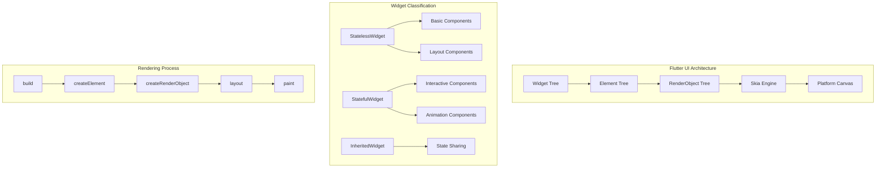
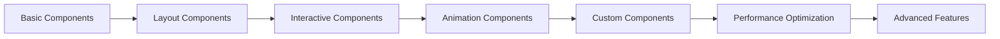

# 🎨 Flutter UI 组件深度指南

> 掌握 Flutter 核心 UI 组件的高级用法和最佳实践，打造精美用户界面


## 📋 目录导航

<details>
<summary>🎯 快速导航</summary>

### 🏗️ 基础组件

- [📝 文本组件](basic-widgets.md#text组件) - 文字显示与样式控制
- [🖼️ 图片组件](basic-widgets.md#image组件) - 图片加载与优化
- [🎨 容器组件](basic-widgets.md#container组件) - 布局容器与装饰
- [📱 图标组件](basic-widgets.md#icon组件) - 图标系统与自定义

### 📐 布局组件

- [📏 线性布局](layout-widgets.md#线性布局) - Row、Column 布局技巧
- [🔲 弹性布局](layout-widgets.md#弹性布局) - Flex、Expanded、Flexible
- [📦 堆叠布局](layout-widgets.md#堆叠布局) - Stack、Positioned 定位
- [🌐 网格布局](layout-widgets.md#网格布局) - GridView、Wrap 自适应

### 🎮 交互组件

- [🔘 按钮组件](interactive-widgets.md#按钮组件) - 各种按钮样式与状态
- [📝 输入组件](interactive-widgets.md#输入组件) - 文本输入与表单验证
- [☑️ 选择组件](interactive-widgets.md#选择组件) - 复选框、单选框、开关
- [👆 手势组件](interactive-widgets.md#手势组件) - 点击、滑动、拖拽手势

### 🎭 高级组件

- [🎬 动画组件](animation-widgets.md#动画组件) - 自定义动画与过渡效果
- [📊 图表组件](advanced-widgets.md#图表组件) - 数据可视化与图表展示
- [🎨 自定义绘制](advanced-widgets.md#自定义绘制) - CustomPainter 深度应用
- [⚡ 性能优化](advanced-widgets.md#性能优化) - Widget 性能优化技巧

</details>

## 🏗️ Flutter UI 架构总览



## 🎯 核心学习目标

### 📚 理论知识

- ✅ 深入理解 Widget 树的构建原理
- ✅ 掌握 Element 和 RenderObject 的关系
- ✅ 了解 Flutter 渲染机制和性能优化
- ✅ 学会组件生命周期管理

### 🛠️ 实践技能

- ✅ 熟练使用各种基础组件
- ✅ 掌握复杂布局的实现技巧
- ✅ 学会创建自定义组件
- ✅ 能够优化组件性能

### 🎨 设计能力

- ✅ 理解 Material Design 设计规范
- ✅ 掌握响应式布局设计
- ✅ 学会创建精美的用户界面
- ✅ 能够适配不同屏幕尺寸

## 🚀 快速开始

### 1. 环境准备

```bash
# 检查Flutter环境
flutter doctor

# 创建新项目
flutter create my_ui_app
cd my_ui_app

# 运行项目
flutter run
```

### 2. 基础组件示例

```dart
import 'package:flutter/material.dart';

void main() {
  runApp(MyApp());
}

class MyApp extends StatelessWidget {
  @override
  Widget build(BuildContext context) {
    return MaterialApp(
      title: 'Flutter UI 组件演示',
      theme: ThemeData(
        primarySwatch: Colors.blue,
        visualDensity: VisualDensity.adaptivePlatformDensity,
      ),
      home: HomePage(),
    );
  }
}

class HomePage extends StatelessWidget {
  @override
  Widget build(BuildContext context) {
    return Scaffold(
      appBar: AppBar(
        title: Text('Flutter UI 组件'),
        elevation: 2,
      ),
      body: Center(
        child: Column(
          mainAxisAlignment: MainAxisAlignment.center,
          children: [
            // 文本组件
            Text(
              'Hello Flutter!',
              style: TextStyle(
                fontSize: 32,
                fontWeight: FontWeight.bold,
                color: Colors.blue[600],
              ),
            ),
            SizedBox(height: 20),

            // 按钮组件
            ElevatedButton(
              onPressed: () {
                ScaffoldMessenger.of(context).showSnackBar(
                  SnackBar(content: Text('按钮被点击了！')),
                );
              },
              child: Text('点击我'),
              style: ElevatedButton.styleFrom(
                padding: EdgeInsets.symmetric(horizontal: 30, vertical: 15),
                shape: RoundedRectangleBorder(
                  borderRadius: BorderRadius.circular(25),
                ),
              ),
            ),
          ],
        ),
      ),
    );
  }
}
```

## 📊 组件性能对比

| 组件类型        | 渲染性能   | 内存占用   | 适用场景   | 复杂度 |
| --------------- | ---------- | ---------- | ---------- | ------ |
| StatelessWidget | ⭐⭐⭐⭐⭐ | ⭐⭐⭐⭐⭐ | 静态内容   | 简单   |
| StatefulWidget  | ⭐⭐⭐⭐   | ⭐⭐⭐⭐   | 动态内容   | 中等   |
| CustomPainter   | ⭐⭐⭐     | ⭐⭐⭐     | 自定义绘制 | 复杂   |
| RenderObject    | ⭐⭐       | ⭐⭐       | 高性能需求 | 极复杂 |

## 🎨 设计模式应用

### 1. 组合模式 (Composite Pattern)

```dart
// Widget树就是组合模式的典型应用
Widget build(BuildContext context) {
  return Container(
    child: Column(
      children: [
        Text('标题'),
        Row(
          children: [
            Icon(Icons.star),
            Text('评分'),
          ],
        ),
      ],
    ),
  );
}
```

### 2. 装饰器模式 (Decorator Pattern)

```dart
// 通过Container装饰其他Widget
Container(
  decoration: BoxDecoration(
    color: Colors.white,
    borderRadius: BorderRadius.circular(8),
    boxShadow: [
      BoxShadow(
        color: Colors.black12,
        blurRadius: 4,
        offset: Offset(0, 2),
      ),
    ],
  ),
  child: Text('装饰后的文本'),
)
```

### 3. 策略模式 (Strategy Pattern)

```dart
// 不同布局策略
Widget buildLayout(LayoutStrategy strategy) {
  switch (strategy) {
    case LayoutStrategy.linear:
      return Column(children: children);
    case LayoutStrategy.grid:
      return GridView.count(crossAxisCount: 2, children: children);
    case LayoutStrategy.stack:
      return Stack(children: children);
  }
}
```

## 🔧 开发工具推荐

### 📱 调试工具

- **Flutter Inspector**: 实时查看 Widget 树
- **Performance Overlay**: 性能监控
- **Debug Paint**: 布局边界可视化

### 🎨 设计工具

- **Figma**: UI 设计原型
- **Adobe XD**: 交互设计
- **Sketch**: 界面设计

### 📚 学习资源

- **Flutter 官方文档**: 最权威的参考资料
- **Flutter Gallery**: 官方组件示例
- **pub.dev**: 第三方组件库

## 📈 学习路径建议



### 🎯 阶段目标

#### 第一阶段：基础掌握

- [ ] 熟悉 Text、Image、Container 等基础组件
- [ ] 掌握 Row、Column、Stack 等布局组件
- [ ] 理解 Widget 生命周期

#### 第二阶段：交互开发

- [ ] 熟练使用按钮、输入框等交互组件
- [ ] 掌握手势识别和事件处理
- [ ] 学会表单验证和数据处理

#### 第三阶段：高级应用

- [ ] 创建自定义动画效果
- [ ] 实现复杂布局和响应式设计
- [ ] 优化组件性能和用户体验

#### 第四阶段：实战项目

- [ ] 完成完整的 UI 项目
- [ ] 掌握团队协作开发流程
- [ ] 学会代码重构和优化

## 🏆 最佳实践

### 📝 代码规范

```dart
// ✅ 推荐：使用const构造函数
const MyWidget({Key? key}) : super(key: key);

// ❌ 避免：在build方法中创建对象
Widget build(BuildContext context) {
  return Container(
    child: Text(DateTime.now().toString()), // 每次都会创建新对象
  );
}

// ✅ 推荐：提取为方法或变量
Widget build(BuildContext context) {
  return Container(
    child: _buildContent(),
  );
}

Widget _buildContent() {
  return Text('静态内容');
}
```

### 🎨 设计原则

- **一致性**: 保持 UI 风格统一
- **简洁性**: 避免过度设计
- **可用性**: 注重用户体验
- **可访问性**: 支持无障碍访问

### ⚡ 性能优化

- 使用 `const`构造函数
- 避免在 `build`方法中创建对象
- 合理使用 `RepaintBoundary`
- 优化 Widget 树深度

## 📚 相关资源

### 🔗 官方资源

- [Flutter 官方文档](https://flutter.dev/docs)
- [Flutter Gallery](https://gallery.flutter.dev/)
- [Flutter Widget Catalog](https://flutter.dev/docs/development/ui/widgets)

### 📖 推荐书籍

- 《Flutter 实战》
- 《Flutter 开发实战详解》
- 《Flutter 技术入门与实战》

### 🎥 视频教程

- [Flutter 官方 YouTube 频道](https://www.youtube.com/c/FlutterDev)
- [B 站 Flutter 教程](https://www.bilibili.com/video/BV1S4411E7LY)

---

## 🎉 开始你的 Flutter UI 之旅

现在你已经了解了 Flutter UI 组件的整体架构和学习路径。接下来，让我们从[基础组件](basic-widgets.md)开始，逐步掌握各种组件的使用方法。

记住：**实践是最好的老师**，多动手编码，多尝试不同的组件组合，你很快就能成为 Flutter UI 开发的高手！

---

<div align="center">

**🌟 如果这个指南对你有帮助，请给个 Star 支持一下！ 🌟**

[](https://github.com/1989allen126/language-tutorial)
[](https://github.com/1989allen126/language-tutorial)

</div>
