# 🚀 Flutter 高级组件深度解析：从基础到高级

> 通过丰富的图表、对比分析和实际案例，全面掌握 Flutter 高级组件的使用技巧


## 📊 文章概览

| 章节                                | 内容               | 难度等级   | 应用场景 |
| ----------------------------------- | ------------------ | ---------- | -------- |
| [自定义绘制组件](#1-自定义绘制组件) | CustomPainter 使用 | ⭐⭐⭐⭐⭐ | 图表、游戏、特效 |
| [复杂动画组件](#2-复杂动画组件)     | 高级动画实现       | ⭐⭐⭐⭐   | 交互体验、视觉效果 |
| [性能优化组件](#3-性能优化组件)     | 性能优化技巧       | ⭐⭐⭐⭐   | 大数据列表、内存管理 |
| [平台特定组件](#4-平台特定组件)     | 平台适配组件       | ⭐⭐⭐     | 跨平台开发 |
| [无障碍组件](#5-无障碍组件)         | 无障碍支持         | ⭐⭐⭐     | 包容性设计 |
| [国际化组件](#6-国际化组件)         | 多语言支持         | ⭐⭐⭐⭐   | 全球化应用 |
| [3D效果组件](#7-3d效果组件)         | 立体视觉效果       | ⭐⭐⭐⭐⭐ | 沉浸式体验 |

## 🎯 学习目标

- ✅ 掌握自定义绘制组件的开发技巧
- ✅ 学会复杂动画组件的实现方法
- ✅ 理解性能优化组件的使用场景
- ✅ 能够实现平台特定的组件适配
- ✅ 掌握无障碍和国际化支持
- ✅ 实现3D效果和高级视觉特效
- ✅ 掌握组件的最佳实践和设计模式

## 💡 核心技能点

```mermaid
mindmap
  root((Flutter高级组件))
    自定义绘制
      Canvas API
      Path操作
      Paint属性
      图表组件
    复杂动画
      粒子系统
      路径动画
      组合动画
      物理动画
    性能优化
      虚拟列表
      图片缓存
      内存管理
      渲染优化
    平台适配
      响应式设计
      平台特定UI
      原生集成
    用户体验
      无障碍支持
      国际化
      主题适配
```



## 📋 目录导航

<details>
<summary>🎯 快速导航</summary>

- [自定义绘制组件](#1-自定义绘制组件) - CustomPainter 使用
- [复杂动画组件](#2-复杂动画组件) - 高级动画实现
- [性能优化组件](#3-性能优化组件) - 性能优化技巧
- [平台特定组件](#4-平台特定组件) - 平台适配组件
- [无障碍组件](#5-无障碍组件) - 无障碍支持
- [国际化组件](#6-国际化组件) - 多语言支持
- [3D效果组件](#7-3d效果组件) - 立体视觉效果
- [高级技巧](#8-高级技巧) - 最佳实践

</details>

---

## 📋 概述

本文档详细介绍 Flutter 中的高级组件，包括自定义绘制、复杂动画、性能优化组件等。

## 1. 自定义绘制组件

### 1.1 CustomPainter 基础

```dart
class CircleProgressPainter extends CustomPainter {
  final double progress;
  final Color backgroundColor;
  final Color progressColor;
  final double strokeWidth;

  CircleProgressPainter({
    required this.progress,
    this.backgroundColor = Colors.grey,
    this.progressColor = Colors.blue,
    this.strokeWidth = 8.0,
  });

  @override
  void paint(Canvas canvas, Size size) {
    final center = Offset(size.width / 2, size.height / 2);
    final radius = (size.width - strokeWidth) / 2;

    // 绘制背景圆环
    final backgroundPaint = Paint()
      ..color = backgroundColor
      ..strokeWidth = strokeWidth
      ..style = PaintingStyle.stroke
      ..strokeCap = StrokeCap.round;

    canvas.drawCircle(center, radius, backgroundPaint);

    // 绘制进度圆弧
    final progressPaint = Paint()
      ..color = progressColor
      ..strokeWidth = strokeWidth
      ..style = PaintingStyle.stroke
      ..strokeCap = StrokeCap.round;

    final sweepAngle = 2 * math.pi * progress;
    canvas.drawArc(
      Rect.fromCircle(center: center, radius: radius),
      -math.pi / 2, // 从顶部开始
      sweepAngle,
      false,
      progressPaint,
    );

    // 绘制进度文本
    final textPainter = TextPainter(
      text: TextSpan(
        text: '${(progress * 100).toInt()}%',
        style: TextStyle(
          color: progressColor,
          fontSize: 16,
          fontWeight: FontWeight.bold,
        ),
      ),
      textDirection: TextDirection.ltr,
    );

    textPainter.layout();
    textPainter.paint(
      canvas,
      Offset(
        center.dx - textPainter.width / 2,
        center.dy - textPainter.height / 2,
      ),
    );
  }

  @override
  bool shouldRepaint(CircleProgressPainter oldDelegate) {
    return oldDelegate.progress != progress ||
        oldDelegate.backgroundColor != backgroundColor ||
        oldDelegate.progressColor != progressColor ||
        oldDelegate.strokeWidth != strokeWidth;
  }
}

class CircleProgressWidget extends StatelessWidget {
  final double progress;
  final double size;
  final Color backgroundColor;
  final Color progressColor;
  final double strokeWidth;

  const CircleProgressWidget({
    Key? key,
    required this.progress,
    this.size = 100,
    this.backgroundColor = Colors.grey,
    this.progressColor = Colors.blue,
    this.strokeWidth = 8.0,
  }) : super(key: key);

  @override
  Widget build(BuildContext context) {
    return SizedBox(
      width: size,
      height: size,
      child: CustomPaint(
        painter: CircleProgressPainter(
          progress: progress,
          backgroundColor: backgroundColor,
          progressColor: progressColor,
          strokeWidth: strokeWidth,
        ),
      ),
    );
  }
}
```

### 1.2 复杂图表组件

```dart
class BarChartPainter extends CustomPainter {
  final List<double> data;
  final List<String> labels;
  final Color barColor;
  final Color textColor;

  BarChartPainter({
    required this.data,
    required this.labels,
    this.barColor = Colors.blue,
    this.textColor = Colors.black,
  });

  @override
  void paint(Canvas canvas, Size size) {
    if (data.isEmpty) return;

    final maxValue = data.reduce(math.max);
    final barWidth = size.width / data.length * 0.8;
    final spacing = size.width / data.length * 0.2;
    final chartHeight = size.height * 0.8;

    final barPaint = Paint()
      ..color = barColor
      ..style = PaintingStyle.fill;

    for (int i = 0; i < data.length; i++) {
      final barHeight = (data[i] / maxValue) * chartHeight;
      final x = i * (barWidth + spacing) + spacing / 2;
      final y = size.height - barHeight - 40; // 留出标签空间

      // 绘制柱状图
      final rect = Rect.fromLTWH(x, y, barWidth, barHeight);
      canvas.drawRRect(
        RRect.fromRectAndRadius(rect, const Radius.circular(4)),
        barPaint,
      );

      // 绘制数值标签
      final valuePainter = TextPainter(
        text: TextSpan(
          text: data[i].toStringAsFixed(1),
          style: TextStyle(
            color: textColor,
            fontSize: 12,
            fontWeight: FontWeight.bold,
          ),
        ),
        textDirection: TextDirection.ltr,
      );
      valuePainter.layout();
      valuePainter.paint(
        canvas,
        Offset(
          x + barWidth / 2 - valuePainter.width / 2,
          y - valuePainter.height - 4,
        ),
      );

      // 绘制底部标签
      if (i < labels.length) {
        final labelPainter = TextPainter(
          text: TextSpan(
            text: labels[i],
            style: TextStyle(
              color: textColor,
              fontSize: 10,
            ),
          ),
          textDirection: TextDirection.ltr,
        );
        labelPainter.layout();
        labelPainter.paint(
          canvas,
          Offset(
            x + barWidth / 2 - labelPainter.width / 2,
            size.height - 30,
          ),
        );
      }
    }
  }

  @override
  bool shouldRepaint(BarChartPainter oldDelegate) {
    return !listEquals(oldDelegate.data, data) ||
        !listEquals(oldDelegate.labels, labels) ||
        oldDelegate.barColor != barColor ||
        oldDelegate.textColor != textColor;
  }
}

class BarChartWidget extends StatelessWidget {
  final List<double> data;
  final List<String> labels;
  final double height;
  final Color barColor;
  final Color textColor;

  const BarChartWidget({
    Key? key,
    required this.data,
    required this.labels,
    this.height = 200,
    this.barColor = Colors.blue,
    this.textColor = Colors.black,
  }) : super(key: key);

  @override
  Widget build(BuildContext context) {
    return Container(
      height: height,
      padding: const EdgeInsets.all(16),
      child: CustomPaint(
        size: Size.infinite,
        painter: BarChartPainter(
          data: data,
          labels: labels,
          barColor: barColor,
          textColor: textColor,
        ),
      ),
    );
  }
}
```

## 2. 复杂动画组件

### 2.1 粒子动画系统

```dart
class Particle {
  Offset position;
  Offset velocity;
  double life;
  double maxLife;
  Color color;
  double size;

  Particle({
    required this.position,
    required this.velocity,
    required this.life,
    required this.maxLife,
    required this.color,
    required this.size,
  });

  void update(double deltaTime) {
    position += velocity * deltaTime;
    life -= deltaTime;
  }

  bool get isDead => life <= 0;

  double get alpha => (life / maxLife).clamp(0.0, 1.0);
}

class ParticleSystemPainter extends CustomPainter {
  final List<Particle> particles;

  ParticleSystemPainter(this.particles);

  @override
  void paint(Canvas canvas, Size size) {
    for (final particle in particles) {
      final paint = Paint()
        ..color = particle.color.withOpacity(particle.alpha)
        ..style = PaintingStyle.fill;

      canvas.drawCircle(
        particle.position,
        particle.size,
        paint,
      );
    }
  }

  @override
  bool shouldRepaint(ParticleSystemPainter oldDelegate) {
    return true; // 总是重绘，因为粒子在移动
  }
}

class ParticleSystemWidget extends StatefulWidget {
  final int particleCount;
  final Color particleColor;
  final double particleSize;
  final Duration particleLife;

  const ParticleSystemWidget({
    Key? key,
    this.particleCount = 50,
    this.particleColor = Colors.blue,
    this.particleSize = 3.0,
    this.particleLife = const Duration(seconds: 3),
  }) : super(key: key);

  @override
  State<ParticleSystemWidget> createState() => _ParticleSystemWidgetState();
}

class _ParticleSystemWidgetState extends State<ParticleSystemWidget>
    with TickerProviderStateMixin {
  late AnimationController _controller;
  final List<Particle> _particles = [];
  final Random _random = Random();
  late DateTime _lastUpdate;

  @override
  void initState() {
    super.initState();
    _controller = AnimationController(
      duration: const Duration(seconds: 1),
      vsync: this,
    );
    _lastUpdate = DateTime.now();
    _controller.addListener(_updateParticles);
    _controller.repeat();
    _initializeParticles();
  }

  @override
  void dispose() {
    _controller.dispose();
    super.dispose();
  }

  void _initializeParticles() {
    _particles.clear();
    for (int i = 0; i < widget.particleCount; i++) {
      _createParticle();
    }
  }

  void _createParticle() {
    final size = MediaQuery.of(context).size;
    _particles.add(Particle(
      position: Offset(
        _random.nextDouble() * size.width,
        size.height + 10,
      ),
      velocity: Offset(
        (_random.nextDouble() - 0.5) * 100,
        -_random.nextDouble() * 200 - 50,
      ),
      life: widget.particleLife.inMilliseconds / 1000.0,
      maxLife: widget.particleLife.inMilliseconds / 1000.0,
      color: widget.particleColor,
      size: widget.particleSize,
    ));
  }

  void _updateParticles() {
    final now = DateTime.now();
    final deltaTime = now.difference(_lastUpdate).inMilliseconds / 1000.0;
    _lastUpdate = now;

    // 更新现有粒子
    for (final particle in _particles) {
      particle.update(deltaTime);
    }

    // 移除死亡的粒子
    _particles.removeWhere((particle) => particle.isDead);

    // 添加新粒子以保持数量
    while (_particles.length < widget.particleCount) {
      _createParticle();
    }

    setState(() {});
  }

  @override
  Widget build(BuildContext context) {
    return CustomPaint(
      size: Size.infinite,
      painter: ParticleSystemPainter(_particles),
    );
  }
}
```

### 2.2 路径动画组件

```dart
class PathAnimationWidget extends StatefulWidget {
  final Path path;
  final Widget child;
  final Duration duration;
  final Curve curve;

  const PathAnimationWidget({
    Key? key,
    required this.path,
    required this.child,
    this.duration = const Duration(seconds: 2),
    this.curve = Curves.easeInOut,
  }) : super(key: key);

  @override
  State<PathAnimationWidget> createState() => _PathAnimationWidgetState();
}

class _PathAnimationWidgetState extends State<PathAnimationWidget>
    with SingleTickerProviderStateMixin {
  late AnimationController _controller;
  late Animation<double> _animation;
  PathMetrics? _pathMetrics;

  @override
  void initState() {
    super.initState();
    _controller = AnimationController(
      duration: widget.duration,
      vsync: this,
    );
    _animation = CurvedAnimation(
      parent: _controller,
      curve: widget.curve,
    );
    _pathMetrics = widget.path.computeMetrics();
    _controller.repeat();
  }

  @override
  void dispose() {
    _controller.dispose();
    super.dispose();
  }

  @override
  Widget build(BuildContext context) {
    return AnimatedBuilder(
      animation: _animation,
      builder: (context, child) {
        if (_pathMetrics == null) return widget.child;

        final pathMetric = _pathMetrics!.first;
        final distance = pathMetric.length * _animation.value;
        final tangent = pathMetric.getTangentForOffset(distance);

        if (tangent == null) return widget.child;

        return Transform.translate(
          offset: tangent.position,
          child: Transform.rotate(
            angle: tangent.angle,
            child: widget.child,
          ),
        );
      },
    );
  }
}
```

## 3. 性能优化组件

### 3.1 虚拟列表组件

```dart
class VirtualListView<T> extends StatefulWidget {
  final List<T> items;
  final Widget Function(BuildContext context, T item, int index) itemBuilder;
  final double itemHeight;
  final int visibleItemCount;

  const VirtualListView({
    Key? key,
    required this.items,
    required this.itemBuilder,
    required this.itemHeight,
    this.visibleItemCount = 10,
  }) : super(key: key);

  @override
  State<VirtualListView<T>> createState() => _VirtualListViewState<T>();
}

class _VirtualListViewState<T> extends State<VirtualListView<T>> {
  late ScrollController _scrollController;
  int _firstVisibleIndex = 0;
  int _lastVisibleIndex = 0;

  @override
  void initState() {
    super.initState();
    _scrollController = ScrollController();
    _scrollController.addListener(_onScroll);
    _updateVisibleRange();
  }

  @override
  void dispose() {
    _scrollController.dispose();
    super.dispose();
  }

  void _onScroll() {
    _updateVisibleRange();
  }

  void _updateVisibleRange() {
    final scrollOffset = _scrollController.hasClients
        ? _scrollController.offset
        : 0.0;

    final newFirstIndex = (scrollOffset / widget.itemHeight).floor();
    final newLastIndex = math.min(
      newFirstIndex + widget.visibleItemCount + 1,
      widget.items.length - 1,
    );

    if (newFirstIndex != _firstVisibleIndex ||
        newLastIndex != _lastVisibleIndex) {
      setState(() {
        _firstVisibleIndex = newFirstIndex;
        _lastVisibleIndex = newLastIndex;
      });
    }
  }

  @override
  Widget build(BuildContext context) {
    final totalHeight = widget.items.length * widget.itemHeight;
    final topPadding = _firstVisibleIndex * widget.itemHeight;
    final bottomPadding = totalHeight - (_lastVisibleIndex + 1) * widget.itemHeight;

    return ListView.builder(
      controller: _scrollController,
      itemCount: _lastVisibleIndex - _firstVisibleIndex + 3, // +3 for padding items
      itemBuilder: (context, index) {
        if (index == 0) {
          return SizedBox(height: topPadding);
        }
        if (index == _lastVisibleIndex - _firstVisibleIndex + 2) {
          return SizedBox(height: bottomPadding);
        }

        final itemIndex = _firstVisibleIndex + index - 1;
        if (itemIndex >= 0 && itemIndex < widget.items.length) {
          return SizedBox(
            height: widget.itemHeight,
            child: widget.itemBuilder(
              context,
              widget.items[itemIndex],
              itemIndex,
            ),
          );
        }

        return const SizedBox.shrink();
      },
    );
  }
}
```

### 3.2 图片缓存组件

```dart
class CachedImageWidget extends StatefulWidget {
  final String imageUrl;
  final double? width;
  final double? height;
  final BoxFit fit;
  final Widget? placeholder;
  final Widget? errorWidget;

  const CachedImageWidget({
    Key? key,
    required this.imageUrl,
    this.width,
    this.height,
    this.fit = BoxFit.cover,
    this.placeholder,
    this.errorWidget,
  }) : super(key: key);

  @override
  State<CachedImageWidget> createState() => _CachedImageWidgetState();
}

class _CachedImageWidgetState extends State<CachedImageWidget> {
  static final Map<String, Uint8List> _cache = {};
  static const int _maxCacheSize = 50;

  Uint8List? _imageData;
  bool _isLoading = false;
  bool _hasError = false;

  @override
  void initState() {
    super.initState();
    _loadImage();
  }

  Future<void> _loadImage() async {
    if (_cache.containsKey(widget.imageUrl)) {
      setState(() {
        _imageData = _cache[widget.imageUrl];
      });
      return;
    }

    setState(() {
      _isLoading = true;
      _hasError = false;
    });

    try {
      final response = await http.get(Uri.parse(widget.imageUrl));
      if (response.statusCode == 200) {
        final imageData = response.bodyBytes;

        // 管理缓存大小
        if (_cache.length >= _maxCacheSize) {
          final firstKey = _cache.keys.first;
          _cache.remove(firstKey);
        }

        _cache[widget.imageUrl] = imageData;

        if (mounted) {
          setState(() {
            _imageData = imageData;
            _isLoading = false;
          });
        }
      } else {
        if (mounted) {
          setState(() {
            _hasError = true;
            _isLoading = false;
          });
        }
      }
    } catch (e) {
      if (mounted) {
        setState(() {
          _hasError = true;
          _isLoading = false;
        });
      }
    }
  }

  @override
  Widget build(BuildContext context) {
    if (_hasError) {
      return widget.errorWidget ??
          Container(
            width: widget.width,
            height: widget.height,
            color: Colors.grey[300],
            child: const Icon(
              Icons.error,
              color: Colors.red,
            ),
          );
    }

    if (_isLoading || _imageData == null) {
      return widget.placeholder ??
          Container(
            width: widget.width,
            height: widget.height,
            color: Colors.grey[300],
            child: const Center(
              child: CircularProgressIndicator(),
            ),
          );
    }

    return Image.memory(
      _imageData!,
      width: widget.width,
      height: widget.height,
      fit: widget.fit,
    );
  }
}
```

## 4. 平台特定组件

### 4.1 平台自适应组件

```dart
class PlatformAdaptiveWidget extends StatelessWidget {
  final Widget? iosWidget;
  final Widget? androidWidget;
  final Widget? webWidget;
  final Widget? defaultWidget;

  const PlatformAdaptiveWidget({
    Key? key,
    this.iosWidget,
    this.androidWidget,
    this.webWidget,
    this.defaultWidget,
  }) : super(key: key);

  @override
  Widget build(BuildContext context) {
    if (kIsWeb && webWidget != null) {
      return webWidget!;
    }

    switch (Theme.of(context).platform) {
      case TargetPlatform.iOS:
      case TargetPlatform.macOS:
        return iosWidget ?? defaultWidget ?? const SizedBox.shrink();
      case TargetPlatform.android:
      case TargetPlatform.fuchsia:
        return androidWidget ?? defaultWidget ?? const SizedBox.shrink();
      default:
        return defaultWidget ?? const SizedBox.shrink();
    }
  }
}

class PlatformButton extends StatelessWidget {
  final String text;
  final VoidCallback? onPressed;
  final Color? color;

  const PlatformButton({
    Key? key,
    required this.text,
    this.onPressed,
    this.color,
  }) : super(key: key);

  @override
  Widget build(BuildContext context) {
    return PlatformAdaptiveWidget(
      iosWidget: CupertinoButton(
        onPressed: onPressed,
        color: color ?? CupertinoColors.activeBlue,
        child: Text(text),
      ),
      androidWidget: ElevatedButton(
        onPressed: onPressed,
        style: ElevatedButton.styleFrom(
          backgroundColor: color ?? Theme.of(context).primaryColor,
        ),
        child: Text(text),
      ),
    );
  }
}
```

## 5. 无障碍组件

### 5.1 语义化组件

```dart
class AccessibleCard extends StatelessWidget {
  final Widget child;
  final String? semanticLabel;
  final String? semanticHint;
  final VoidCallback? onTap;
  final bool isButton;

  const AccessibleCard({
    Key? key,
    required this.child,
    this.semanticLabel,
    this.semanticHint,
    this.onTap,
    this.isButton = false,
  }) : super(key: key);

  @override
  Widget build(BuildContext context) {
    Widget card = Card(
      child: InkWell(
        onTap: onTap,
        child: child,
      ),
    );

    return Semantics(
      label: semanticLabel,
      hint: semanticHint,
      button: isButton,
      enabled: onTap != null,
      child: card,
    );
  }
}

class AccessibleProgressIndicator extends StatelessWidget {
  final double value;
  final String? semanticLabel;

  const AccessibleProgressIndicator({
    Key? key,
    required this.value,
    this.semanticLabel,
  }) : super(key: key);

  @override
  Widget build(BuildContext context) {
    final percentage = (value * 100).round();
    final defaultLabel = '进度 $percentage%';

    return Semantics(
      label: semanticLabel ?? defaultLabel,
      value: '$percentage%',
      child: LinearProgressIndicator(value: value),
    );
  }
}
```

## 6. 国际化组件

### 6.1 多语言文本组件

```dart
class LocalizedText extends StatelessWidget {
  final String key;
  final TextStyle? style;
  final List<dynamic>? args;

  const LocalizedText(
    this.key, {
    Key? key,
    this.style,
    this.args,
  }) : super(key: key);

  @override
  Widget build(BuildContext context) {
    String text = _getLocalizedText(context, key, args);
    return Text(text, style: style);
  }

  String _getLocalizedText(BuildContext context, String key, List<dynamic>? args) {
    // 这里应该使用实际的国际化库，如 intl
    // 这只是一个示例实现
    final locale = Localizations.localeOf(context);

    // 模拟的翻译映射
    final translations = {
      'en': {
        'hello': 'Hello',
        'welcome': 'Welcome {0}',
      },
      'zh': {
        'hello': '你好',
        'welcome': '欢迎 {0}',
      },
    };

    String text = translations[locale.languageCode]?[key] ?? key;

    // 处理参数替换
    if (args != null) {
      for (int i = 0; i < args.length; i++) {
        text = text.replaceAll('{$i}', args[i].toString());
      }
    }

    return text;
  }
}

class LocalizedDatePicker extends StatelessWidget {
  final DateTime? selectedDate;
  final ValueChanged<DateTime>? onDateChanged;

  const LocalizedDatePicker({
    Key? key,
    this.selectedDate,
    this.onDateChanged,
  }) : super(key: key);

  @override
  Widget build(BuildContext context) {
    return ElevatedButton(
      onPressed: () => _showDatePicker(context),
      child: LocalizedText(
        selectedDate != null ? 'selected_date' : 'select_date',
        args: selectedDate != null ? [_formatDate(context, selectedDate!)] : null,
      ),
    );
  }

  Future<void> _showDatePicker(BuildContext context) async {
    final date = await showDatePicker(
      context: context,
      initialDate: selectedDate ?? DateTime.now(),
      firstDate: DateTime(2000),
      lastDate: DateTime(2100),
      locale: Localizations.localeOf(context),
    );

    if (date != null && onDateChanged != null) {
      onDateChanged!(date);
    }
  }

  String _formatDate(BuildContext context, DateTime date) {
    final locale = Localizations.localeOf(context);
    // 这里应该使用 intl 包进行日期格式化
    return '${date.year}-${date.month.toString().padLeft(2, '0')}-${date.day.toString().padLeft(2, '0')}';
  }
}
```

## 7. 3D效果组件

### 7.1 3D变换组件

```dart
class Transform3DWidget extends StatefulWidget {
  final Widget child;
  final double rotationX;
  final double rotationY;
  final double rotationZ;
  final double perspective;

  const Transform3DWidget({
    Key? key,
    required this.child,
    this.rotationX = 0.0,
    this.rotationY = 0.0,
    this.rotationZ = 0.0,
    this.perspective = 0.001,
  }) : super(key: key);

  @override
  State<Transform3DWidget> createState() => _Transform3DWidgetState();
}

class _Transform3DWidgetState extends State<Transform3DWidget>
    with SingleTickerProviderStateMixin {
  late AnimationController _controller;
  late Animation<double> _animation;

  @override
  void initState() {
    super.initState();
    _controller = AnimationController(
      duration: const Duration(seconds: 2),
      vsync: this,
    );
    _animation = Tween<double>(
      begin: 0.0,
      end: 1.0,
    ).animate(CurvedAnimation(
      parent: _controller,
      curve: Curves.easeInOut,
    ));
    _controller.repeat(reverse: true);
  }

  @override
  void dispose() {
    _controller.dispose();
    super.dispose();
  }

  @override
  Widget build(BuildContext context) {
    return AnimatedBuilder(
      animation: _animation,
      builder: (context, child) {
        return Transform(
          alignment: Alignment.center,
          transform: Matrix4.identity()
            ..setEntry(3, 2, widget.perspective)
            ..rotateX(widget.rotationX * _animation.value)
            ..rotateY(widget.rotationY * _animation.value)
            ..rotateZ(widget.rotationZ * _animation.value),
          child: widget.child,
        );
      },
    );
  }
}
```

### 7.2 立体卡片组件

```dart
class Card3D extends StatefulWidget {
  final Widget front;
  final Widget back;
  final Duration duration;

  const Card3D({
    Key? key,
    required this.front,
    required this.back,
    this.duration = const Duration(milliseconds: 600),
  }) : super(key: key);

  @override
  State<Card3D> createState() => _Card3DState();
}

class _Card3DState extends State<Card3D>
    with SingleTickerProviderStateMixin {
  late AnimationController _controller;
  late Animation<double> _animation;
  bool _isShowingFront = true;

  @override
  void initState() {
    super.initState();
    _controller = AnimationController(
      duration: widget.duration,
      vsync: this,
    );
    _animation = Tween<double>(
      begin: 0.0,
      end: 1.0,
    ).animate(CurvedAnimation(
      parent: _controller,
      curve: Curves.easeInOut,
    ));
  }

  @override
  void dispose() {
    _controller.dispose();
    super.dispose();
  }

  void _flip() {
    if (_isShowingFront) {
      _controller.forward();
    } else {
      _controller.reverse();
    }
    _isShowingFront = !_isShowingFront;
  }

  @override
  Widget build(BuildContext context) {
    return GestureDetector(
      onTap: _flip,
      child: AnimatedBuilder(
        animation: _animation,
        builder: (context, child) {
          final isShowingFront = _animation.value < 0.5;
          return Transform(
            alignment: Alignment.center,
            transform: Matrix4.identity()
              ..setEntry(3, 2, 0.001)
              ..rotateY(math.pi * _animation.value),
            child: isShowingFront
                ? widget.front
                : Transform(
                    alignment: Alignment.center,
                    transform: Matrix4.identity()..rotateY(math.pi),
                    child: widget.back,
                  ),
          );
        },
      ),
    );
  }
}
```

## 8. 高级技巧

### 8.1 组件设计模式

```dart
// 建造者模式
class AdvancedButtonBuilder {
  String? _text;
  VoidCallback? _onPressed;
  Color? _backgroundColor;
  Color? _textColor;
  double? _borderRadius;
  EdgeInsets? _padding;
  Widget? _icon;
  bool _loading = false;

  AdvancedButtonBuilder text(String text) {
    _text = text;
    return this;
  }

  AdvancedButtonBuilder onPressed(VoidCallback callback) {
    _onPressed = callback;
    return this;
  }

  AdvancedButtonBuilder backgroundColor(Color color) {
    _backgroundColor = color;
    return this;
  }

  AdvancedButtonBuilder textColor(Color color) {
    _textColor = color;
    return this;
  }

  AdvancedButtonBuilder borderRadius(double radius) {
    _borderRadius = radius;
    return this;
  }

  AdvancedButtonBuilder padding(EdgeInsets padding) {
    _padding = padding;
    return this;
  }

  AdvancedButtonBuilder icon(Widget icon) {
    _icon = icon;
    return this;
  }

  AdvancedButtonBuilder loading(bool loading) {
    _loading = loading;
    return this;
  }

  Widget build() {
    return AdvancedButton(
      text: _text ?? '',
      onPressed: _onPressed,
      backgroundColor: _backgroundColor,
      textColor: _textColor,
      borderRadius: _borderRadius,
      padding: _padding,
      icon: _icon,
      loading: _loading,
    );
  }
}

class AdvancedButton extends StatelessWidget {
  final String text;
  final VoidCallback? onPressed;
  final Color? backgroundColor;
  final Color? textColor;
  final double? borderRadius;
  final EdgeInsets? padding;
  final Widget? icon;
  final bool loading;

  const AdvancedButton({
    Key? key,
    required this.text,
    this.onPressed,
    this.backgroundColor,
    this.textColor,
    this.borderRadius,
    this.padding,
    this.icon,
    this.loading = false,
  }) : super(key: key);

  @override
  Widget build(BuildContext context) {
    return ElevatedButton(
      onPressed: loading ? null : onPressed,
      style: ElevatedButton.styleFrom(
        backgroundColor: backgroundColor,
        foregroundColor: textColor,
        shape: RoundedRectangleBorder(
          borderRadius: BorderRadius.circular(borderRadius ?? 8.0),
        ),
        padding: padding ?? const EdgeInsets.symmetric(
          horizontal: 16,
          vertical: 12,
        ),
      ),
      child: loading
          ? const SizedBox(
              width: 20,
              height: 20,
              child: CircularProgressIndicator(strokeWidth: 2),
            )
          : Row(
              mainAxisSize: MainAxisSize.min,
              children: [
                if (icon != null) ...[icon!, const SizedBox(width: 8)],
                Text(text),
              ],
            ),
    );
  }
}

// 使用示例
Widget buildButton() {
  return AdvancedButtonBuilder()
      .text('提交')
      .backgroundColor(Colors.blue)
      .textColor(Colors.white)
      .borderRadius(12)
      .icon(const Icon(Icons.send))
      .onPressed(() => print('按钮点击'))
      .build();
}
```

### 8.2 响应式组件

```dart
class ResponsiveWidget extends StatelessWidget {
  final Widget mobile;
  final Widget? tablet;
  final Widget? desktop;

  const ResponsiveWidget({
    Key? key,
    required this.mobile,
    this.tablet,
    this.desktop,
  }) : super(key: key);

  @override
  Widget build(BuildContext context) {
    return LayoutBuilder(
      builder: (context, constraints) {
        if (constraints.maxWidth >= 1200) {
          return desktop ?? tablet ?? mobile;
        } else if (constraints.maxWidth >= 768) {
          return tablet ?? mobile;
        } else {
          return mobile;
        }
      },
    );
  }
}

class ResponsiveGrid extends StatelessWidget {
  final List<Widget> children;
  final int mobileColumns;
  final int tabletColumns;
  final int desktopColumns;
  final double spacing;

  const ResponsiveGrid({
    Key? key,
    required this.children,
    this.mobileColumns = 1,
    this.tabletColumns = 2,
    this.desktopColumns = 3,
    this.spacing = 16.0,
  }) : super(key: key);

  @override
  Widget build(BuildContext context) {
    return LayoutBuilder(
      builder: (context, constraints) {
        int columns;
        if (constraints.maxWidth >= 1200) {
          columns = desktopColumns;
        } else if (constraints.maxWidth >= 768) {
          columns = tabletColumns;
        } else {
          columns = mobileColumns;
        }

        return GridView.builder(
          gridDelegate: SliverGridDelegateWithFixedCrossAxisCount(
            crossAxisCount: columns,
            crossAxisSpacing: spacing,
            mainAxisSpacing: spacing,
          ),
          itemCount: children.length,
          itemBuilder: (context, index) => children[index],
        );
      },
    );
  }
}
```

### 8.3 主题感知组件

```dart
class ThemeAwareCard extends StatelessWidget {
  final Widget child;
  final EdgeInsets? padding;
  final VoidCallback? onTap;

  const ThemeAwareCard({
    Key? key,
    required this.child,
    this.padding,
    this.onTap,
  }) : super(key: key);

  @override
  Widget build(BuildContext context) {
    final theme = Theme.of(context);
    final isDark = theme.brightness == Brightness.dark;

    return Card(
      elevation: isDark ? 8 : 4,
      shadowColor: isDark
          ? Colors.black.withOpacity(0.5)
          : Colors.grey.withOpacity(0.3),
      color: isDark
          ? theme.cardColor
          : Colors.white,
      shape: RoundedRectangleBorder(
        borderRadius: BorderRadius.circular(12),
        side: BorderSide(
          color: isDark
              ? Colors.grey[700]!
              : Colors.grey[300]!,
          width: 1,
        ),
      ),
      child: InkWell(
        onTap: onTap,
        borderRadius: BorderRadius.circular(12),
        child: Padding(
          padding: padding ?? const EdgeInsets.all(16),
          child: child,
        ),
      ),
    );
  }
}
```

## 📚 总结

### 核心组件

- **自定义绘制**: CustomPainter、Canvas API、复杂图表
- **复杂动画**: 粒子系统、路径动画、组合动画
- **性能优化**: 虚拟列表、图片缓存、内存管理
- **平台适配**: 平台特定组件、自适应 UI
- **无障碍**: 语义化标签、屏幕阅读器支持
- **国际化**: 多语言支持、本地化组件
- **3D效果**: 立体变换、翻转动画、透视效果
- **设计模式**: 建造者模式、响应式设计、主题适配

### 最佳实践

- **性能优先**: 合理使用缓存和虚拟化
- **用户体验**: 考虑无障碍和国际化
- **平台一致性**: 遵循平台设计规范
- **代码复用**: 创建可复用的组件库
- **响应式设计**: 适配不同屏幕尺寸
- **主题一致性**: 支持明暗主题切换
- **组件解耦**: 使用设计模式提高可维护性

### 性能优化技巧

```dart
// 1. 使用 const 构造函数
const MyWidget();

// 2. 避免在 build 方法中创建对象
class MyWidget extends StatelessWidget {
  static const _textStyle = TextStyle(fontSize: 16);
  
  @override
  Widget build(BuildContext context) {
    return Text('Hello', style: _textStyle);
  }
}

// 3. 使用 RepaintBoundary 隔离重绘
RepaintBoundary(
  child: ExpensiveWidget(),
)

// 4. 合理使用 ListView.builder
ListView.builder(
  itemCount: items.length,
  itemBuilder: (context, index) => ItemWidget(items[index]),
)
```

### 推荐工具

- **flutter_svg**: SVG 图像支持
- **cached_network_image**: 网络图片缓存
- **intl**: 国际化支持
- **flutter_localizations**: 本地化组件
- **provider**: 状态管理
- **flutter_bloc**: 业务逻辑组件
- **get_it**: 依赖注入
- **flutter_screenutil**: 屏幕适配
