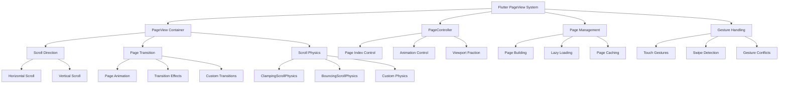

# 📄 Flutter PageView 页面视图深度解析：从基础到高级

> 通过丰富的图表、对比分析和实际案例，全面掌握 Flutter PageView 的使用技巧


## 📊 文章概览

| 章节                                        | 内容             | 难度等级 |
| ------------------------------------------- | ---------------- | -------- |
| [基础 PageView](#基础-pageview)             | 基础页面视图实现 | ⭐⭐     |
| [PageView.builder](#pageviewbuilder)        | 动态页面构建     | ⭐⭐⭐   |
| [PageController 控制](#pagecontroller-控制) | 页面控制器使用   | ⭐⭐⭐   |
| [高级特性](#高级特性)                       | 高级功能实现     | ⭐⭐⭐⭐ |
| [实际应用场景](#实际应用场景)               | 真实项目案例     | ⭐⭐⭐⭐ |

## 🎯 学习目标

- ✅ 掌握 PageView 的核心概念和使用方法
- ✅ 学会 PageController 的配置和控制
- ✅ 理解页面切换动画和手势处理
- ✅ 能够实现复杂的页面视图应用
- ✅ 掌握性能优化和最佳实践

## 📋 目录导航

<details>
<summary>🎯 快速导航</summary>

- [基础 PageView](#基础-pageview) - 基础页面视图实现
- [PageView.builder](#pageviewbuilder) - 动态页面构建
- [PageController 控制](#pagecontroller-控制) - 页面控制器使用
- [高级特性](#高级特性) - 高级功能实现
- [实际应用场景](#实际应用场景) - 真实项目案例
- [性能优化](#性能优化) - 最佳实践

</details>

---

## 📋 概述

PageView 是 Flutter 中用于实现页面滑动切换的重要控件，支持水平和垂直方向的页面切换，常用于引导页、轮播图、图片浏览等场景。

## 🏗️ PageView 架构图



### 📊 PageView 特性对比

| 特性           | PageView | PageView.builder | PageView.custom |
| -------------- | -------- | ---------------- | --------------- |
| **性能**       | ⭐⭐⭐   | ⭐⭐⭐⭐⭐       | ⭐⭐⭐⭐        |
| **内存占用**   | ⭐⭐     | ⭐⭐⭐⭐⭐       | ⭐⭐⭐⭐        |
| **灵活性**     | ⭐⭐     | ⭐⭐⭐⭐         | ⭐⭐⭐⭐⭐      |
| **使用复杂度** | ⭐       | ⭐⭐⭐           | ⭐⭐⭐⭐        |
| **适用场景**   | 固定页面 | 动态页面         | 自定义需求      |

## 基础 PageView

### 1. 简单的 PageView

```dart
import 'package:flutter/material.dart';

class BasicPageViewExample extends StatelessWidget {
  @override
  Widget build(BuildContext context) {
    return Scaffold(
      appBar: AppBar(title: Text('基础 PageView')),
      body: PageView(
        children: [
          Container(
            color: Colors.red[100],
            child: Center(
              child: Text(
                '第一页',
                style: TextStyle(fontSize: 24, fontWeight: FontWeight.bold),
              ),
            ),
          ),
          Container(
            color: Colors.green[100],
            child: Center(
              child: Text(
                '第二页',
                style: TextStyle(fontSize: 24, fontWeight: FontWeight.bold),
              ),
            ),
          ),
          Container(
            color: Colors.blue[100],
            child: Center(
              child: Text(
                '第三页',
                style: TextStyle(fontSize: 24, fontWeight: FontWeight.bold),
              ),
            ),
          ),
        ],
      ),
    );
  }
}
```

### 2. 使用 PageView.builder

```dart
class PageViewBuilderExample extends StatelessWidget {
  final List<Color> colors = [
    Colors.red,
    Colors.green,
    Colors.blue,
    Colors.orange,
    Colors.purple,
    Colors.teal,
  ];

  @override
  Widget build(BuildContext context) {
    return Scaffold(
      appBar: AppBar(title: Text('PageView.builder')),
      body: PageView.builder(
        itemCount: colors.length,
        itemBuilder: (context, index) {
          return Container(
            color: colors[index].withOpacity(0.3),
            child: Center(
              child: Column(
                mainAxisAlignment: MainAxisAlignment.center,
                children: [
                  Icon(
                    Icons.pages,
                    size: 64,
                    color: colors[index],
                  ),
                  SizedBox(height: 16),
                  Text(
                    '页面 ${index + 1}',
                    style: TextStyle(
                      fontSize: 24,
                      fontWeight: FontWeight.bold,
                      color: colors[index],
                    ),
                  ),
                  SizedBox(height: 8),
                  Text(
                    '这是第 ${index + 1} 个页面',
                    style: TextStyle(
                      fontSize: 16,
                      color: colors[index].withOpacity(0.8),
                    ),
                  ),
                ],
              ),
            ),
          );
        },
      ),
    );
  }
}
```

## 带控制器的 PageView

### 1. 手动控制页面切换

```dart
class ControlledPageView extends StatefulWidget {
  @override
  _ControlledPageViewState createState() => _ControlledPageViewState();
}

class _ControlledPageViewState extends State<ControlledPageView> {
  late PageController _pageController;
  int _currentPage = 0;

  final List<PageData> pages = [
    PageData('欢迎', '欢迎使用我们的应用', Icons.waving_hand, Colors.blue),
    PageData('功能', '探索强大的功能特性', Icons.star, Colors.green),
    PageData('开始', '立即开始您的旅程', Icons.rocket_launch, Colors.orange),
  ];

  @override
  void initState() {
    super.initState();
    _pageController = PageController(initialPage: 0);
  }

  @override
  void dispose() {
    _pageController.dispose();
    super.dispose();
  }

  @override
  Widget build(BuildContext context) {
    return Scaffold(
      appBar: AppBar(title: Text('控制器 PageView')),
      body: Column(
        children: [
          // 页面指示器
          Container(
            padding: EdgeInsets.all(16),
            child: Row(
              mainAxisAlignment: MainAxisAlignment.center,
              children: List.generate(pages.length, (index) {
                return Container(
                  margin: EdgeInsets.symmetric(horizontal: 4),
                  width: _currentPage == index ? 12 : 8,
                  height: 8,
                  decoration: BoxDecoration(
                    color: _currentPage == index
                        ? Colors.blue
                        : Colors.grey[300],
                    borderRadius: BorderRadius.circular(4),
                  ),
                );
              }),
            ),
          ),
          // PageView
          Expanded(
            child: PageView.builder(
              controller: _pageController,
              itemCount: pages.length,
              onPageChanged: (index) {
                setState(() {
                  _currentPage = index;
                });
              },
              itemBuilder: (context, index) {
                return _buildPage(pages[index]);
              },
            ),
          ),
          // 控制按钮
          Container(
            padding: EdgeInsets.all(16),
            child: Row(
              mainAxisAlignment: MainAxisAlignment.spaceBetween,
              children: [
                ElevatedButton(
                  onPressed: _currentPage > 0 ? _previousPage : null,
                  child: Text('上一页'),
                ),
                Text('${_currentPage + 1} / ${pages.length}'),
                ElevatedButton(
                  onPressed: _currentPage < pages.length - 1 ? _nextPage : null,
                  child: Text('下一页'),
                ),
              ],
            ),
          ),
        ],
      ),
    );
  }

  Widget _buildPage(PageData pageData) {
    return Container(
      padding: EdgeInsets.all(32),
      color: pageData.color.withOpacity(0.1),
      child: Column(
        mainAxisAlignment: MainAxisAlignment.center,
        children: [
          Icon(
            pageData.icon,
            size: 80,
            color: pageData.color,
          ),
          SizedBox(height: 32),
          Text(
            pageData.title,
            style: TextStyle(
              fontSize: 28,
              fontWeight: FontWeight.bold,
              color: pageData.color,
            ),
          ),
          SizedBox(height: 16),
          Text(
            pageData.description,
            style: TextStyle(
              fontSize: 16,
              color: Colors.grey[600],
            ),
            textAlign: TextAlign.center,
          ),
        ],
      ),
    );
  }

  void _nextPage() {
    _pageController.nextPage(
      duration: Duration(milliseconds: 300),
      curve: Curves.easeInOut,
    );
  }

  void _previousPage() {
    _pageController.previousPage(
      duration: Duration(milliseconds: 300),
      curve: Curves.easeInOut,
    );
  }
}

class PageData {
  final String title;
  final String description;
  final IconData icon;
  final Color color;

  PageData(this.title, this.description, this.icon, this.color);
}
```

### 2. 自动轮播 PageView

```dart
class AutoPlayPageView extends StatefulWidget {
  @override
  _AutoPlayPageViewState createState() => _AutoPlayPageViewState();
}

class _AutoPlayPageViewState extends State<AutoPlayPageView> {
  late PageController _pageController;
  late Timer _timer;
  int _currentPage = 0;

  final List<BannerData> banners = [
    BannerData('轮播图1', '这是第一张轮播图', 'https://via.placeholder.com/400x200/FF5722/FFFFFF?text=Banner+1'),
    BannerData('轮播图2', '这是第二张轮播图', 'https://via.placeholder.com/400x200/4CAF50/FFFFFF?text=Banner+2'),
    BannerData('轮播图3', '这是第三张轮播图', 'https://via.placeholder.com/400x200/2196F3/FFFFFF?text=Banner+3'),
    BannerData('轮播图4', '这是第四张轮播图', 'https://via.placeholder.com/400x200/9C27B0/FFFFFF?text=Banner+4'),
  ];

  @override
  void initState() {
    super.initState();
    _pageController = PageController();
    _startAutoPlay();
  }

  @override
  void dispose() {
    _timer.cancel();
    _pageController.dispose();
    super.dispose();
  }

  void _startAutoPlay() {
    _timer = Timer.periodic(Duration(seconds: 3), (timer) {
      if (_currentPage < banners.length - 1) {
        _currentPage++;
      } else {
        _currentPage = 0;
      }

      _pageController.animateToPage(
        _currentPage,
        duration: Duration(milliseconds: 300),
        curve: Curves.easeInOut,
      );
    });
  }

  @override
  Widget build(BuildContext context) {
    return Scaffold(
      appBar: AppBar(title: Text('自动轮播 PageView')),
      body: Column(
        children: [
          // 轮播图
          Container(
            height: 200,
            child: PageView.builder(
              controller: _pageController,
              itemCount: banners.length,
              onPageChanged: (index) {
                setState(() {
                  _currentPage = index;
                });
              },
              itemBuilder: (context, index) {
                return _buildBanner(banners[index]);
              },
            ),
          ),
          // 指示器
          Container(
            padding: EdgeInsets.symmetric(vertical: 16),
            child: Row(
              mainAxisAlignment: MainAxisAlignment.center,
              children: List.generate(banners.length, (index) {
                return GestureDetector(
                  onTap: () {
                    _pageController.animateToPage(
                      index,
                      duration: Duration(milliseconds: 300),
                      curve: Curves.easeInOut,
                    );
                  },
                  child: Container(
                    margin: EdgeInsets.symmetric(horizontal: 4),
                    width: _currentPage == index ? 24 : 8,
                    height: 8,
                    decoration: BoxDecoration(
                      color: _currentPage == index
                          ? Colors.blue
                          : Colors.grey[300],
                      borderRadius: BorderRadius.circular(4),
                    ),
                  ),
                );
              }),
            ),
          ),
          // 控制按钮
          Padding(
            padding: EdgeInsets.all(16),
            child: Row(
              mainAxisAlignment: MainAxisAlignment.spaceEvenly,
              children: [
                ElevatedButton(
                  onPressed: () {
                    _timer.cancel();
                    ScaffoldMessenger.of(context).showSnackBar(
                      SnackBar(content: Text('自动播放已停止')),
                    );
                  },
                  child: Text('停止自动播放'),
                ),
                ElevatedButton(
                  onPressed: () {
                    _timer.cancel();
                    _startAutoPlay();
                    ScaffoldMessenger.of(context).showSnackBar(
                      SnackBar(content: Text('自动播放已开始')),
                    );
                  },
                  child: Text('开始自动播放'),
                ),
              ],
            ),
          ),
        ],
      ),
    );
  }

  Widget _buildBanner(BannerData banner) {
    return Container(
      margin: EdgeInsets.symmetric(horizontal: 8),
      decoration: BoxDecoration(
        borderRadius: BorderRadius.circular(8),
        boxShadow: [
          BoxShadow(
            color: Colors.black26,
            blurRadius: 4,
            offset: Offset(0, 2),
          ),
        ],
      ),
      child: ClipRRect(
        borderRadius: BorderRadius.circular(8),
        child: Stack(
          fit: StackFit.expand,
          children: [
            // 背景图片（这里用颜色代替）
            Container(
              color: Colors.primaries[banners.indexOf(banner) % Colors.primaries.length],
            ),
            // 文字覆盖层
            Container(
              decoration: BoxDecoration(
                gradient: LinearGradient(
                  begin: Alignment.topCenter,
                  end: Alignment.bottomCenter,
                  colors: [
                    Colors.transparent,
                    Colors.black54,
                  ],
                ),
              ),
              child: Padding(
                padding: EdgeInsets.all(16),
                child: Column(
                  mainAxisAlignment: MainAxisAlignment.end,
                  crossAxisAlignment: CrossAxisAlignment.start,
                  children: [
                    Text(
                      banner.title,
                      style: TextStyle(
                        color: Colors.white,
                        fontSize: 18,
                        fontWeight: FontWeight.bold,
                      ),
                    ),
                    SizedBox(height: 4),
                    Text(
                      banner.description,
                      style: TextStyle(
                        color: Colors.white70,
                        fontSize: 14,
                      ),
                    ),
                  ],
                ),
              ),
            ),
          ],
        ),
      ),
    );
  }
}

class BannerData {
  final String title;
  final String description;
  final String imageUrl;

  BannerData(this.title, this.description, this.imageUrl);
}
```

## 垂直 PageView

### 1. 垂直滑动页面

```dart
class VerticalPageView extends StatefulWidget {
  @override
  _VerticalPageViewState createState() => _VerticalPageViewState();
}

class _VerticalPageViewState extends State<VerticalPageView> {
  int _currentPage = 0;

  final List<StoryData> stories = [
    StoryData('故事1', '这是一个关于勇气的故事...', Icons.favorite, Colors.red),
    StoryData('故事2', '这是一个关于友谊的故事...', Icons.people, Colors.blue),
    StoryData('故事3', '这是一个关于梦想的故事...', Icons.star, Colors.orange),
    StoryData('故事4', '这是一个关于成长的故事...', Icons.trending_up, Colors.green),
  ];

  @override
  Widget build(BuildContext context) {
    return Scaffold(
      appBar: AppBar(title: Text('垂直 PageView')),
      body: Row(
        children: [
          // 侧边指示器
          Container(
            width: 60,
            child: Column(
              mainAxisAlignment: MainAxisAlignment.center,
              children: List.generate(stories.length, (index) {
                return GestureDetector(
                  onTap: () {
                    // 这里可以添加跳转到指定页面的逻辑
                  },
                  child: Container(
                    margin: EdgeInsets.symmetric(vertical: 8),
                    width: 40,
                    height: 40,
                    decoration: BoxDecoration(
                      color: _currentPage == index
                          ? stories[index].color
                          : Colors.grey[300],
                      shape: BoxShape.circle,
                    ),
                    child: Icon(
                      stories[index].icon,
                      color: _currentPage == index
                          ? Colors.white
                          : Colors.grey[600],
                      size: 20,
                    ),
                  ),
                );
              }),
            ),
          ),
          // 垂直 PageView
          Expanded(
            child: PageView.builder(
              scrollDirection: Axis.vertical,
              itemCount: stories.length,
              onPageChanged: (index) {
                setState(() {
                  _currentPage = index;
                });
              },
              itemBuilder: (context, index) {
                return _buildStoryPage(stories[index]);
              },
            ),
          ),
        ],
      ),
    );
  }

  Widget _buildStoryPage(StoryData story) {
    return Container(
      padding: EdgeInsets.all(24),
      decoration: BoxDecoration(
        gradient: LinearGradient(
          begin: Alignment.topLeft,
          end: Alignment.bottomRight,
          colors: [
            story.color.withOpacity(0.1),
            story.color.withOpacity(0.3),
          ],
        ),
      ),
      child: Column(
        mainAxisAlignment: MainAxisAlignment.center,
        children: [
          Icon(
            story.icon,
            size: 80,
            color: story.color,
          ),
          SizedBox(height: 32),
          Text(
            story.title,
            style: TextStyle(
              fontSize: 28,
              fontWeight: FontWeight.bold,
              color: story.color,
            ),
          ),
          SizedBox(height: 16),
          Text(
            story.content,
            style: TextStyle(
              fontSize: 16,
              color: Colors.grey[700],
              height: 1.5,
            ),
            textAlign: TextAlign.center,
          ),
          SizedBox(height: 32),
          Text(
            '向上滑动查看下一个故事',
            style: TextStyle(
              fontSize: 12,
              color: Colors.grey[500],
            ),
          ),
        ],
      ),
    );
  }
}

class StoryData {
  final String title;
  final String content;
  final IconData icon;
  final Color color;

  StoryData(this.title, this.content, this.icon, this.color);
}
```

## 高级 PageView 功能

### 1. 自定义页面切换效果

```dart
class CustomTransitionPageView extends StatefulWidget {
  @override
  _CustomTransitionPageViewState createState() => _CustomTransitionPageViewState();
}

class _CustomTransitionPageViewState extends State<CustomTransitionPageView> {
  late PageController _pageController;
  double _currentPageValue = 0.0;

  final List<Color> colors = [
    Colors.red,
    Colors.green,
    Colors.blue,
    Colors.orange,
    Colors.purple,
  ];

  @override
  void initState() {
    super.initState();
    _pageController = PageController();
    _pageController.addListener(() {
      setState(() {
        _currentPageValue = _pageController.page ?? 0.0;
      });
    });
  }

  @override
  void dispose() {
    _pageController.dispose();
    super.dispose();
  }

  @override
  Widget build(BuildContext context) {
    return Scaffold(
      appBar: AppBar(title: Text('自定义切换效果')),
      body: PageView.builder(
        controller: _pageController,
        itemCount: colors.length,
        itemBuilder: (context, index) {
          return _buildTransformPage(index);
        },
      ),
    );
  }

  Widget _buildTransformPage(int index) {
    double value = 1.0;
    if (_pageController.position.haveDimensions) {
      value = (_currentPageValue - index).abs();
      value = (1 - (value * 0.3)).clamp(0.0, 1.0);
    }

    return Transform.scale(
      scale: value,
      child: Container(
        margin: EdgeInsets.all(16),
        decoration: BoxDecoration(
          color: colors[index],
          borderRadius: BorderRadius.circular(16),
          boxShadow: [
            BoxShadow(
              color: colors[index].withOpacity(0.3),
              blurRadius: 10,
              offset: Offset(0, 5),
            ),
          ],
        ),
        child: Center(
          child: Column(
            mainAxisAlignment: MainAxisAlignment.center,
            children: [
              Icon(
                Icons.pages,
                size: 64,
                color: Colors.white,
              ),
              SizedBox(height: 16),
              Text(
                '页面 ${index + 1}',
                style: TextStyle(
                  fontSize: 24,
                  fontWeight: FontWeight.bold,
                  color: Colors.white,
                ),
              ),
            ],
          ),
        ),
      ),
    );
  }
}
```

### 2. 无限循环 PageView

```dart
class InfinitePageView extends StatefulWidget {
  @override
  _InfinitePageViewState createState() => _InfinitePageViewState();
}

class _InfinitePageViewState extends State<InfinitePageView> {
  late PageController _pageController;

  final List<ImageData> images = [
    ImageData('图片1', Icons.image, Colors.red),
    ImageData('图片2', Icons.photo, Colors.green),
    ImageData('图片3', Icons.camera_alt, Colors.blue),
    ImageData('图片4', Icons.photo_camera, Colors.orange),
  ];

  @override
  void initState() {
    super.initState();
    // 从中间位置开始，实现无限循环的效果
    _pageController = PageController(initialPage: images.length * 1000);
  }

  @override
  void dispose() {
    _pageController.dispose();
    super.dispose();
  }

  @override
  Widget build(BuildContext context) {
    return Scaffold(
      appBar: AppBar(title: Text('无限循环 PageView')),
      body: PageView.builder(
        controller: _pageController,
        itemBuilder: (context, index) {
          // 使用模运算实现循环
          final realIndex = index % images.length;
          return _buildImagePage(images[realIndex], realIndex);
        },
      ),
    );
  }

  Widget _buildImagePage(ImageData imageData, int index) {
    return Container(
      margin: EdgeInsets.all(16),
      decoration: BoxDecoration(
        color: imageData.color.withOpacity(0.1),
        borderRadius: BorderRadius.circular(16),
        border: Border.all(color: imageData.color, width: 2),
      ),
      child: Column(
        mainAxisAlignment: MainAxisAlignment.center,
        children: [
          Icon(
            imageData.icon,
            size: 80,
            color: imageData.color,
          ),
          SizedBox(height: 16),
          Text(
            imageData.title,
            style: TextStyle(
              fontSize: 24,
              fontWeight: FontWeight.bold,
              color: imageData.color,
            ),
          ),
          SizedBox(height: 8),
          Text(
            '索引: $index',
            style: TextStyle(
              fontSize: 16,
              color: Colors.grey[600],
            ),
          ),
          SizedBox(height: 16),
          Text(
            '可以无限向左右滑动',
            style: TextStyle(
              fontSize: 14,
              color: Colors.grey[500],
            ),
          ),
        ],
      ),
    );
  }
}

class ImageData {
  final String title;
  final IconData icon;
  final Color color;

  ImageData(this.title, this.icon, this.color);
}
```

## 实际应用案例

### 1. 应用引导页

```dart
class OnboardingPageView extends StatefulWidget {
  @override
  _OnboardingPageViewState createState() => _OnboardingPageViewState();
}

class _OnboardingPageViewState extends State<OnboardingPageView> {
  late PageController _pageController;
  int _currentPage = 0;

  final List<OnboardingData> onboardingPages = [
    OnboardingData(
      '欢迎使用',
      '感谢您选择我们的应用，让我们开始这段美妙的旅程',
      Icons.waving_hand,
      Colors.blue,
    ),
    OnboardingData(
      '强大功能',
      '我们为您提供了丰富的功能，让您的体验更加完美',
      Icons.star,
      Colors.green,
    ),
    OnboardingData(
      '简单易用',
      '直观的界面设计，让您轻松上手，享受流畅的操作体验',
      Icons.touch_app,
      Colors.orange,
    ),
    OnboardingData(
      '开始使用',
      '一切准备就绪，现在就开始探索我们的应用吧！',
      Icons.rocket_launch,
      Colors.purple,
    ),
  ];

  @override
  void initState() {
    super.initState();
    _pageController = PageController();
  }

  @override
  void dispose() {
    _pageController.dispose();
    super.dispose();
  }

  @override
  Widget build(BuildContext context) {
    return Scaffold(
      body: SafeArea(
        child: Column(
          children: [
            // 跳过按钮
            Align(
              alignment: Alignment.topRight,
              child: Padding(
                padding: EdgeInsets.all(16),
                child: TextButton(
                  onPressed: _skipOnboarding,
                  child: Text('跳过'),
                ),
              ),
            ),
            // PageView
            Expanded(
              child: PageView.builder(
                controller: _pageController,
                itemCount: onboardingPages.length,
                onPageChanged: (index) {
                  setState(() {
                    _currentPage = index;
                  });
                },
                itemBuilder: (context, index) {
                  return _buildOnboardingPage(onboardingPages[index]);
                },
              ),
            ),
            // 指示器和按钮
            Padding(
              padding: EdgeInsets.all(24),
              child: Column(
                children: [
                  // 页面指示器
                  Row(
                    mainAxisAlignment: MainAxisAlignment.center,
                    children: List.generate(onboardingPages.length, (index) {
                      return AnimatedContainer(
                        duration: Duration(milliseconds: 300),
                        margin: EdgeInsets.symmetric(horizontal: 4),
                        width: _currentPage == index ? 24 : 8,
                        height: 8,
                        decoration: BoxDecoration(
                          color: _currentPage == index
                              ? onboardingPages[index].color
                              : Colors.grey[300],
                          borderRadius: BorderRadius.circular(4),
                        ),
                      );
                    }),
                  ),
                  SizedBox(height: 24),
                  // 下一步/完成按钮
                  SizedBox(
                    width: double.infinity,
                    height: 50,
                    child: ElevatedButton(
                      onPressed: _nextPage,
                      style: ElevatedButton.styleFrom(
                        backgroundColor: onboardingPages[_currentPage].color,
                        shape: RoundedRectangleBorder(
                          borderRadius: BorderRadius.circular(25),
                        ),
                      ),
                      child: Text(
                        _currentPage == onboardingPages.length - 1
                            ? '开始使用'
                            : '下一步',
                        style: TextStyle(
                          fontSize: 16,
                          fontWeight: FontWeight.bold,
                          color: Colors.white,
                        ),
                      ),
                    ),
                  ),
                ],
              ),
            ),
          ],
        ),
      ),
    );
  }

  Widget _buildOnboardingPage(OnboardingData data) {
    return Padding(
      padding: EdgeInsets.all(32),
      child: Column(
        mainAxisAlignment: MainAxisAlignment.center,
        children: [
          Icon(
            data.icon,
            size: 120,
            color: data.color,
          ),
          SizedBox(height: 48),
          Text(
            data.title,
            style: TextStyle(
              fontSize: 28,
              fontWeight: FontWeight.bold,
              color: data.color,
            ),
            textAlign: TextAlign.center,
          ),
          SizedBox(height: 24),
          Text(
            data.description,
            style: TextStyle(
              fontSize: 16,
              color: Colors.grey[600],
              height: 1.5,
            ),
            textAlign: TextAlign.center,
          ),
        ],
      ),
    );
  }

  void _nextPage() {
    if (_currentPage < onboardingPages.length - 1) {
      _pageController.nextPage(
        duration: Duration(milliseconds: 300),
        curve: Curves.easeInOut,
      );
    } else {
      _completeOnboarding();
    }
  }

  void _skipOnboarding() {
    _completeOnboarding();
  }

  void _completeOnboarding() {
    // 这里可以导航到主页面或保存引导完成状态
    Navigator.of(context).pushReplacement(
      MaterialPageRoute(builder: (context) => MainApp()),
    );
  }
}

class OnboardingData {
  final String title;
  final String description;
  final IconData icon;
  final Color color;

  OnboardingData(this.title, this.description, this.icon, this.color);
}

// 主应用页面（示例）
class MainApp extends StatelessWidget {
  @override
  Widget build(BuildContext context) {
    return Scaffold(
      appBar: AppBar(title: Text('主应用')),
      body: Center(
        child: Text(
          '欢迎来到主应用！',
          style: TextStyle(fontSize: 24),
        ),
      ),
    );
  }
}
```

### 2. 图片浏览器

```dart
class ImageGalleryPageView extends StatefulWidget {
  final List<String> imageUrls;
  final int initialIndex;

  ImageGalleryPageView({
    required this.imageUrls,
    this.initialIndex = 0,
  });

  @override
  _ImageGalleryPageViewState createState() => _ImageGalleryPageViewState();
}

class _ImageGalleryPageViewState extends State<ImageGalleryPageView> {
  late PageController _pageController;
  late int _currentIndex;

  @override
  void initState() {
    super.initState();
    _currentIndex = widget.initialIndex;
    _pageController = PageController(initialPage: widget.initialIndex);
  }

  @override
  void dispose() {
    _pageController.dispose();
    super.dispose();
  }

  @override
  Widget build(BuildContext context) {
    return Scaffold(
      backgroundColor: Colors.black,
      appBar: AppBar(
        backgroundColor: Colors.black,
        title: Text(
          '${_currentIndex + 1} / ${widget.imageUrls.length}',
          style: TextStyle(color: Colors.white),
        ),
        iconTheme: IconThemeData(color: Colors.white),
        actions: [
          IconButton(
            icon: Icon(Icons.share),
            onPressed: _shareImage,
          ),
          IconButton(
            icon: Icon(Icons.download),
            onPressed: _downloadImage,
          ),
        ],
      ),
      body: PageView.builder(
        controller: _pageController,
        itemCount: widget.imageUrls.length,
        onPageChanged: (index) {
          setState(() {
            _currentIndex = index;
          });
        },
        itemBuilder: (context, index) {
          return _buildImagePage(widget.imageUrls[index], index);
        },
      ),
      bottomNavigationBar: Container(
        color: Colors.black,
        padding: EdgeInsets.all(16),
        child: Row(
          mainAxisAlignment: MainAxisAlignment.spaceEvenly,
          children: [
            IconButton(
              icon: Icon(Icons.zoom_in, color: Colors.white),
              onPressed: _zoomIn,
            ),
            IconButton(
              icon: Icon(Icons.zoom_out, color: Colors.white),
              onPressed: _zoomOut,
            ),
            IconButton(
              icon: Icon(Icons.rotate_right, color: Colors.white),
              onPressed: _rotateImage,
            ),
            IconButton(
              icon: Icon(Icons.info, color: Colors.white),
              onPressed: _showImageInfo,
            ),
          ],
        ),
      ),
    );
  }

  Widget _buildImagePage(String imageUrl, int index) {
    return InteractiveViewer(
      panEnabled: true,
      boundaryMargin: EdgeInsets.all(20),
      minScale: 0.5,
      maxScale: 4.0,
      child: Center(
        child: Container(
          decoration: BoxDecoration(
            color: Colors.grey[300],
            borderRadius: BorderRadius.circular(8),
          ),
          child: Icon(
            Icons.image,
            size: 200,
            color: Colors.grey[600],
          ),
          // 在实际应用中，这里应该是 Image.network(imageUrl)
        ),
      ),
    );
  }

  void _shareImage() {
    ScaffoldMessenger.of(context).showSnackBar(
      SnackBar(content: Text('分享图片 ${_currentIndex + 1}')),
    );
  }

  void _downloadImage() {
    ScaffoldMessenger.of(context).showSnackBar(
      SnackBar(content: Text('下载图片 ${_currentIndex + 1}')),
    );
  }

  void _zoomIn() {
    ScaffoldMessenger.of(context).showSnackBar(
      SnackBar(content: Text('放大图片')),
    );
  }

  void _zoomOut() {
    ScaffoldMessenger.of(context).showSnackBar(
      SnackBar(content: Text('缩小图片')),
    );
  }

  void _rotateImage() {
    ScaffoldMessenger.of(context).showSnackBar(
      SnackBar(content: Text('旋转图片')),
    );
  }

  void _showImageInfo() {
    showDialog(
      context: context,
      builder: (context) => AlertDialog(
        title: Text('图片信息'),
        content: Column(
          mainAxisSize: MainAxisSize.min,
          crossAxisAlignment: CrossAxisAlignment.start,
          children: [
            Text('图片编号: ${_currentIndex + 1}'),
            Text('总数量: ${widget.imageUrls.length}'),
            Text('URL: ${widget.imageUrls[_currentIndex]}'),
          ],
        ),
        actions: [
          TextButton(
            onPressed: () => Navigator.of(context).pop(),
            child: Text('确定'),
          ),
        ],
      ),
    );
  }
}
```

## 最佳实践

### 1. 性能优化

- **懒加载**: 使用 `PageView.builder` 实现按需构建
- **内存管理**: 及时释放 PageController
- **图片优化**: 对于图片轮播，使用适当的缓存策略

### 2. 用户体验

- **平滑动画**: 使用合适的动画曲线和持续时间
- **视觉反馈**: 提供清晰的页面指示器
- **手势支持**: 支持滑动、点击等多种交互方式

### 3. 可访问性

- **语义化**: 为页面内容提供清晰的语义描述
- **键盘导航**: 支持键盘切换页面
- **屏幕阅读器**: 确保内容可被屏幕阅读器正确识别

## 总结

PageView 是 Flutter 中实现页面滑动切换的核心组件，通过合理的配置和自定义，可以创建出丰富多样的页面切换效果。在实际应用中，要注意性能优化和用户体验的平衡，特别是在处理大量页面或复杂内容时。
