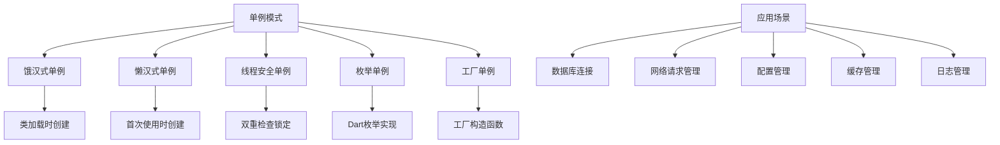

# 🔧 Flutter 单例模式深度解析：从基础到高级

[](https://flutter.dev/)
[](https://dart.dev/)
[](LICENSE)

> 深入掌握 Flutter 中单例模式的多种实现方式和最佳实践，构建高效的状态管理系统

## 📊 文章概览

| 章节                          | 内容               | 难度等级 |
| ----------------------------- | ------------------ | -------- |
| [基础单例实现](#基础单例实现) | 饿汉式和懒汉式单例 | ⭐⭐⭐   |
| [线程安全单例](#线程安全单例) | 线程安全实现方式   | ⭐⭐⭐⭐ |
| [懒加载单例](#懒加载单例)     | 延迟初始化策略     | ⭐⭐⭐   |
| [工厂单例](#工厂单例)         | 工厂模式结合       | ⭐⭐⭐⭐ |
| [枚举单例](#枚举单例)         | 枚举实现方式       | ⭐⭐⭐   |
| [单例管理器](#单例管理器)     | 单例管理策略       | ⭐⭐⭐⭐ |
| [实际应用场景](#实际应用场景) | 真实项目案例       | ⭐⭐⭐⭐ |

## 🎯 学习目标

- ✅ 掌握单例模式的基础实现方式和原理
- ✅ 学会线程安全的单例实现策略
- ✅ 理解不同单例模式的适用场景和选择
- ✅ 能够设计高效的单例管理器
- ✅ 掌握单例模式的最佳实践和性能优化

## 📋 目录导航

<details>
<summary>🎯 快速导航</summary>

- [基础单例实现](#基础单例实现) - 饿汉式和懒汉式单例
- [线程安全单例](#线程安全单例) - 线程安全实现方式
- [懒加载单例](#懒加载单例) - 延迟初始化策略
- [工厂单例](#工厂单例) - 工厂模式结合
- [枚举单例](#枚举单例) - 枚举实现方式
- [单例管理器](#单例管理器) - 单例管理策略
- [实际应用场景](#实际应用场景) - 真实项目案例

</details>

---

## 📋 概述

本文档详细介绍 Flutter 中单例模式的多种实现方式、最佳实践和实际应用场景。单例模式是设计模式中最简单也是最常用的模式之一，在 Flutter 开发中有着广泛的应用。

## 🏗️ 单例模式架构图



### 📊 单例模式特性对比

| 实现方式     | 线程安全 | 性能       | 内存占用   | 复杂度   | 适用场景   |
| ------------ | -------- | ---------- | ---------- | -------- | ---------- |
| **饿汉式**   | ✅       | ⭐⭐⭐⭐⭐ | ⭐⭐       | ⭐⭐     | 简单场景   |
| **懒汉式**   | ❌       | ⭐⭐⭐⭐   | ⭐⭐⭐⭐⭐ | ⭐⭐     | 延迟加载   |
| **双重检查** | ✅       | ⭐⭐⭐⭐   | ⭐⭐⭐⭐⭐ | ⭐⭐⭐⭐ | 高并发     |
| **枚举**     | ✅       | ⭐⭐⭐⭐⭐ | ⭐⭐⭐     | ⭐⭐     | 简单单例   |
| **工厂**     | ✅       | ⭐⭐⭐     | ⭐⭐⭐⭐   | ⭐⭐⭐⭐ | 复杂初始化 |

## 🔧 基础单例实现

### 1. 饿汉式单例（推荐）

```dart
/// 饿汉式单例 - 类加载时就创建实例
class EagerSingleton {
  // 私有静态实例，类加载时创建
  static final EagerSingleton _instance = EagerSingleton._internal();

  // 私有构造函数
  EagerSingleton._internal();

  // 工厂构造函数，返回同一个实例
  factory EagerSingleton() {
    return _instance;
  }

  // 单例的业务方法
  void doSomething() {
    print('EagerSingleton doing something...');
  }

  // 示例属性
  String data = 'Initial Data';

  void updateData(String newData) {
    data = newData;
    print('Data updated to: $data');
  }
}

// 使用示例
void testEagerSingleton() {
  var instance1 = EagerSingleton();
  var instance2 = EagerSingleton();

  print('Same instance: ${identical(instance1, instance2)}'); // true

  instance1.updateData('New Data');
  print('Instance2 data: ${instance2.data}'); // New Data
}
```

### 2. 懒汉式单例

```dart
/// 懒汉式单例 - 首次使用时创建实例
class LazySingleton {
  static LazySingleton? _instance;

  // 私有构造函数
  LazySingleton._internal();

  // 工厂构造函数，懒加载创建实例
  factory LazySingleton() {
    _instance ??= LazySingleton._internal();
    return _instance!;
  }

  // 获取实例的静态方法
  static LazySingleton getInstance() {
    _instance ??= LazySingleton._internal();
    return _instance!;
  }

  void doSomething() {
    print('LazySingleton doing something...');
  }
}

// 使用示例
void testLazySingleton() {
  var instance1 = LazySingleton();
  var instance2 = LazySingleton.getInstance();

  print('Same instance: ${identical(instance1, instance2)}'); // true
}
```

## 🔒 线程安全单例

### 双重检查锁定单例

```dart
import 'dart:isolate';

/// 线程安全的单例实现
class ThreadSafeSingleton {
  static ThreadSafeSingleton? _instance;
  static final Object _lock = Object();

  // 私有构造函数
  ThreadSafeSingleton._internal();

  // 线程安全的工厂构造函数
  factory ThreadSafeSingleton() {
    if (_instance == null) {
      // 使用同步块确保线程安全
      synchronized(_lock, () {
        _instance ??= ThreadSafeSingleton._internal();
      });
    }
    return _instance!;
  }

  void doSomething() {
    print('ThreadSafeSingleton doing something in isolate: ${Isolate.current.debugName}');
  }
}

/// 简单的同步实现
void synchronized(Object lock, void Function() action) {
  // 在Dart中，由于单线程特性，这里主要是概念演示
  // 实际的线程安全主要通过Isolate来实现
  action();
}

// 使用示例
void testThreadSafeSingleton() async {
  var instance1 = ThreadSafeSingleton();
  var instance2 = ThreadSafeSingleton();

  print('Same instance: ${identical(instance1, instance2)}'); // true

  // 在不同Isolate中测试
  await testInIsolate();
}

void testInIsolate() async {
  var receivePort = ReceivePort();

  await Isolate.spawn((SendPort sendPort) {
    var instance = ThreadSafeSingleton();
    instance.doSomething();
    sendPort.send('done');
  }, receivePort.sendPort);

  await receivePort.first;
  receivePort.close();
}
```

## 🏭 工厂单例

### 带参数的工厂单例

```dart
/// 工厂单例模式 - 支持不同类型的单例
class DatabaseConnection {
  static final Map<String, DatabaseConnection> _instances = {};

  final String connectionString;
  final String databaseType;

  // 私有构造函数
  DatabaseConnection._internal(this.connectionString, this.databaseType);

  // 工厂构造函数 - 根据数据库类型返回对应的单例
  factory DatabaseConnection(String type, String connectionString) {
    String key = '$type:$connectionString';

    if (!_instances.containsKey(key)) {
      _instances[key] = DatabaseConnection._internal(connectionString, type);
      print('Created new database connection for $type');
    } else {
      print('Reusing existing database connection for $type');
    }

    return _instances[key]!;
  }

  // 获取所有实例
  static Map<String, DatabaseConnection> getAllInstances() {
    return Map.unmodifiable(_instances);
  }

  // 清理特定实例
  static void closeConnection(String type, String connectionString) {
    String key = '$type:$connectionString';
    _instances.remove(key);
    print('Closed database connection for $type');
  }

  // 清理所有实例
  static void closeAllConnections() {
    _instances.clear();
    print('Closed all database connections');
  }

  void connect() {
    print('Connecting to $databaseType database: $connectionString');
  }

  void disconnect() {
    print('Disconnecting from $databaseType database');
  }

  void query(String sql) {
    print('Executing query on $databaseType: $sql');
  }
}

// 使用示例
void testFactorySingleton() {
  // 创建不同类型的数据库连接
  var mysql1 = DatabaseConnection('MySQL', 'mysql://localhost:3306/app');
  var mysql2 = DatabaseConnection('MySQL', 'mysql://localhost:3306/app');
  var postgres = DatabaseConnection('PostgreSQL', 'postgres://localhost:5432/app');

  print('MySQL instances same: ${identical(mysql1, mysql2)}'); // true
  print('MySQL and PostgreSQL same: ${identical(mysql1, postgres)}'); // false

  mysql1.connect();
  mysql1.query('SELECT * FROM users');

  postgres.connect();
  postgres.query('SELECT * FROM products');

  // 查看所有实例
  print('Total connections: ${DatabaseConnection.getAllInstances().length}');

  // 清理连接
  DatabaseConnection.closeConnection('MySQL', 'mysql://localhost:3306/app');
  DatabaseConnection.closeAllConnections();
}
```

## 🔢 枚举单例

### Dart 枚举单例实现

```dart
/// 枚举单例 - 最安全的单例实现方式
enum ConfigManager {
  instance;

  // 配置数据
  final Map<String, dynamic> _config = {};

  // 初始化配置
  void initialize() {
    _config.addAll({
      'apiUrl': 'https://api.example.com',
      'timeout': 30000,
      'retryCount': 3,
      'enableLogging': true,
    });
    print('ConfigManager initialized');
  }

  // 获取配置
  T? get<T>(String key) {
    return _config[key] as T?;
  }

  // 设置配置
  void set(String key, dynamic value) {
    _config[key] = value;
    print('Config updated: $key = $value');
  }

  // 获取所有配置
  Map<String, dynamic> getAllConfig() {
    return Map.unmodifiable(_config);
  }

  // 重置配置
  void reset() {
    _config.clear();
    initialize();
    print('Config reset to defaults');
  }

  // 从JSON加载配置
  void loadFromJson(Map<String, dynamic> json) {
    _config.addAll(json);
    print('Config loaded from JSON');
  }

  // 保存配置到JSON
  Map<String, dynamic> toJson() {
    return Map.from(_config);
  }
}

// 使用示例
void testEnumSingleton() {
  var config1 = ConfigManager.instance;
  var config2 = ConfigManager.instance;

  print('Same instance: ${identical(config1, config2)}'); // true

  config1.initialize();

  // 获取配置
  String? apiUrl = config1.get<String>('apiUrl');
  int? timeout = config1.get<int>('timeout');

  print('API URL: $apiUrl');
  print('Timeout: $timeout');

  // 更新配置
  config1.set('apiUrl', 'https://api.newdomain.com');

  // 通过另一个引用访问
  String? newApiUrl = config2.get<String>('apiUrl');
  print('New API URL from config2: $newApiUrl');

  // 加载新配置
  config1.loadFromJson({
    'newFeature': true,
    'version': '1.0.0',
  });

  print('All config: ${config1.getAllConfig()}');
}
```

## 🎯 单例管理器

### 统一单例管理

```dart
/// 单例管理器 - 统一管理所有单例实例
class SingletonManager {
  static final Map<Type, dynamic> _instances = {};
  static final Map<String, dynamic> _namedInstances = {};

  // 注册单例
  static T register<T>(T instance) {
    _instances[T] = instance;
    print('Registered singleton: ${T.toString()}');
    return instance;
  }

  // 注册命名单例
  static T registerNamed<T>(String name, T instance) {
    _namedInstances[name] = instance;
    print('Registered named singleton: $name');
    return instance;
  }

  // 获取单例
  static T? get<T>() {
    return _instances[T] as T?;
  }

  // 获取命名单例
  static T? getNamed<T>(String name) {
    return _namedInstances[name] as T?;
  }

  // 检查是否已注册
  static bool isRegistered<T>() {
    return _instances.containsKey(T);
  }

  // 检查命名单例是否已注册
  static bool isNamedRegistered(String name) {
    return _namedInstances.containsKey(name);
  }

  // 注销单例
  static void unregister<T>() {
    _instances.remove(T);
    print('Unregistered singleton: ${T.toString()}');
  }

  // 注销命名单例
  static void unregisterNamed(String name) {
    _namedInstances.remove(name);
    print('Unregistered named singleton: $name');
  }

  // 清理所有单例
  static void clear() {
    _instances.clear();
    _namedInstances.clear();
    print('Cleared all singletons');
  }

  // 获取所有已注册的单例信息
  static Map<String, String> getRegisteredInfo() {
    Map<String, String> info = {};

    _instances.forEach((type, instance) {
      info[type.toString()] = instance.runtimeType.toString();
    });

    _namedInstances.forEach((name, instance) {
      info['Named: $name'] = instance.runtimeType.toString();
    });

    return info;
  }
}

// 示例服务类
class ApiService {
  final String baseUrl;

  ApiService(this.baseUrl);

  void makeRequest(String endpoint) {
    print('Making request to: $baseUrl$endpoint');
  }
}

class CacheService {
  final Map<String, dynamic> _cache = {};

  void put(String key, dynamic value) {
    _cache[key] = value;
    print('Cached: $key');
  }

  T? get<T>(String key) {
    return _cache[key] as T?;
  }

  void clear() {
    _cache.clear();
    print('Cache cleared');
  }
}

// 使用示例
void testSingletonManager() {
  // 注册单例
  var apiService = SingletonManager.register(ApiService('https://api.example.com'));
  var cacheService = SingletonManager.register(CacheService());

  // 注册命名单例
  var devApiService = SingletonManager.registerNamed('dev', ApiService('https://dev-api.example.com'));
  var prodApiService = SingletonManager.registerNamed('prod', ApiService('https://prod-api.example.com'));

  // 获取单例
  var retrievedApiService = SingletonManager.get<ApiService>();
  var retrievedCacheService = SingletonManager.get<CacheService>();

  print('Same ApiService: ${identical(apiService, retrievedApiService)}'); // true

  // 获取命名单例
  var devApi = SingletonManager.getNamed<ApiService>('dev');
  var prodApi = SingletonManager.getNamed<ApiService>('prod');

  // 使用服务
  retrievedApiService?.makeRequest('/users');
  retrievedCacheService?.put('user_1', {'name': 'John', 'age': 30});

  devApi?.makeRequest('/test');
  prodApi?.makeRequest('/users');

  // 检查注册状态
  print('ApiService registered: ${SingletonManager.isRegistered<ApiService>()}');
  print('Dev API registered: ${SingletonManager.isNamedRegistered('dev')}');

  // 获取注册信息
  print('Registered singletons: ${SingletonManager.getRegisteredInfo()}');

  // 清理
  SingletonManager.unregister<ApiService>();
  SingletonManager.unregisterNamed('dev');

  print('After cleanup: ${SingletonManager.getRegisteredInfo()}');
}
```

## 🚀 实际应用场景

### 1. 网络请求管理器

```dart
import 'dart:convert';
import 'dart:io';

/// HTTP客户端单例
class HttpManager {
  static final HttpManager _instance = HttpManager._internal();

  factory HttpManager() => _instance;

  HttpManager._internal();

  late HttpClient _client;
  String? _baseUrl;
  Map<String, String> _defaultHeaders = {};

  // 初始化
  void initialize({
    required String baseUrl,
    Map<String, String>? defaultHeaders,
    Duration? timeout,
  }) {
    _baseUrl = baseUrl;
    _defaultHeaders = defaultHeaders ?? {};

    _client = HttpClient();
    if (timeout != null) {
      _client.connectionTimeout = timeout;
    }

    print('HttpManager initialized with baseUrl: $baseUrl');
  }

  // GET请求
  Future<Map<String, dynamic>> get(String endpoint, {
    Map<String, String>? headers,
    Map<String, dynamic>? queryParams,
  }) async {
    final uri = _buildUri(endpoint, queryParams);
    final request = await _client.getUrl(uri);

    _addHeaders(request, headers);

    final response = await request.close();
    return _handleResponse(response);
  }

  // POST请求
  Future<Map<String, dynamic>> post(String endpoint, {
    Map<String, String>? headers,
    Map<String, dynamic>? body,
  }) async {
    final uri = _buildUri(endpoint);
    final request = await _client.postUrl(uri);

    _addHeaders(request, headers);

    if (body != null) {
      request.write(jsonEncode(body));
    }

    final response = await request.close();
    return _handleResponse(response);
  }

  // 构建URI
  Uri _buildUri(String endpoint, [Map<String, dynamic>? queryParams]) {
    final url = '$_baseUrl$endpoint';
    final uri = Uri.parse(url);

    if (queryParams != null && queryParams.isNotEmpty) {
      return uri.replace(queryParameters: queryParams.map(
        (key, value) => MapEntry(key, value.toString()),
      ));
    }

    return uri;
  }

  // 添加请求头
  void _addHeaders(HttpClientRequest request, Map<String, String>? headers) {
    // 添加默认请求头
    _defaultHeaders.forEach((key, value) {
      request.headers.set(key, value);
    });

    // 添加自定义请求头
    headers?.forEach((key, value) {
      request.headers.set(key, value);
    });

    // 设置Content-Type
    request.headers.set('Content-Type', 'application/json');
  }

  // 处理响应
  Future<Map<String, dynamic>> _handleResponse(HttpClientResponse response) async {
    final responseBody = await response.transform(utf8.decoder).join();

    if (response.statusCode >= 200 && response.statusCode < 300) {
      return jsonDecode(responseBody);
    } else {
      throw HttpException('Request failed with status: ${response.statusCode}');
    }
  }

  // 设置默认请求头
  void setDefaultHeader(String key, String value) {
    _defaultHeaders[key] = value;
  }

  // 移除默认请求头
  void removeDefaultHeader(String key) {
    _defaultHeaders.remove(key);
  }

  // 关闭客户端
  void close() {
    _client.close();
  }
}

// 使用示例
void testHttpManager() async {
  var httpManager = HttpManager();

  // 初始化
  httpManager.initialize(
    baseUrl: 'https://jsonplaceholder.typicode.com',
    defaultHeaders: {
      'User-Agent': 'Flutter App',
      'Accept': 'application/json',
    },
    timeout: Duration(seconds: 30),
  );

  try {
    // GET请求
    var users = await httpManager.get('/users');
    print('Users count: ${users.length}');

    // POST请求
    var newPost = await httpManager.post('/posts', body: {
      'title': 'Test Post',
      'body': 'This is a test post',
      'userId': 1,
    });
    print('Created post: ${newPost['id']}');

  } catch (e) {
    print('Request failed: $e');
  }
}
```

### 2. 应用配置管理器

```dart
import 'dart:convert';
import 'package:shared_preferences/shared_preferences.dart';

/// 应用配置管理器单例
class AppConfig {
  static final AppConfig _instance = AppConfig._internal();

  factory AppConfig() => _instance;

  AppConfig._internal();

  SharedPreferences? _prefs;
  Map<String, dynamic> _config = {};

  // 初始化
  Future<void> initialize() async {
    _prefs = await SharedPreferences.getInstance();
    await _loadConfig();
    print('AppConfig initialized');
  }

  // 加载配置
  Future<void> _loadConfig() async {
    final configString = _prefs?.getString('app_config');
    if (configString != null) {
      _config = jsonDecode(configString);
    } else {
      _setDefaultConfig();
    }
  }

  // 设置默认配置
  void _setDefaultConfig() {
    _config = {
      'theme': 'light',
      'language': 'en',
      'notifications': true,
      'autoSave': true,
      'cacheSize': 100,
      'apiTimeout': 30000,
    };
  }

  // 保存配置
  Future<void> _saveConfig() async {
    await _prefs?.setString('app_config', jsonEncode(_config));
  }

  // 获取配置值
  T? get<T>(String key) {
    return _config[key] as T?;
  }

  // 设置配置值
  Future<void> set(String key, dynamic value) async {
    _config[key] = value;
    await _saveConfig();
    print('Config updated: $key = $value');
  }

  // 获取字符串配置
  String getString(String key, {String defaultValue = ''}) {
    return _config[key] as String? ?? defaultValue;
  }

  // 获取整数配置
  int getInt(String key, {int defaultValue = 0}) {
    return _config[key] as int? ?? defaultValue;
  }

  // 获取布尔配置
  bool getBool(String key, {bool defaultValue = false}) {
    return _config[key] as bool? ?? defaultValue;
  }

  // 获取双精度配置
  double getDouble(String key, {double defaultValue = 0.0}) {
    return _config[key] as double? ?? defaultValue;
  }

  // 设置字符串配置
  Future<void> setString(String key, String value) async {
    await set(key, value);
  }

  // 设置整数配置
  Future<void> setInt(String key, int value) async {
    await set(key, value);
  }

  // 设置布尔配置
  Future<void> setBool(String key, bool value) async {
    await set(key, value);
  }

  // 设置双精度配置
  Future<void> setDouble(String key, double value) async {
    await set(key, value);
  }

  // 移除配置
  Future<void> remove(String key) async {
    _config.remove(key);
    await _saveConfig();
    print('Config removed: $key');
  }

  // 清除所有配置
  Future<void> clear() async {
    _config.clear();
    await _prefs?.remove('app_config');
    _setDefaultConfig();
    print('All config cleared');
  }

  // 重置为默认配置
  Future<void> resetToDefaults() async {
    _setDefaultConfig();
    await _saveConfig();
    print('Config reset to defaults');
  }

  // 获取所有配置
  Map<String, dynamic> getAllConfig() {
    return Map.unmodifiable(_config);
  }

  // 批量更新配置
  Future<void> updateBatch(Map<String, dynamic> updates) async {
    _config.addAll(updates);
    await _saveConfig();
    print('Batch config updated: ${updates.keys.join(", ")}');
  }

  // 导出配置
  String exportConfig() {
    return jsonEncode(_config);
  }

  // 导入配置
  Future<void> importConfig(String configJson) async {
    try {
      final importedConfig = jsonDecode(configJson) as Map<String, dynamic>;
      _config = importedConfig;
      await _saveConfig();
      print('Config imported successfully');
    } catch (e) {
      print('Failed to import config: $e');
      throw Exception('Invalid config format');
    }
  }
}

// 使用示例
void testAppConfig() async {
  var config = AppConfig();

  // 初始化
  await config.initialize();

  // 获取配置
  String theme = config.getString('theme', defaultValue: 'light');
  bool notifications = config.getBool('notifications', defaultValue: true);
  int cacheSize = config.getInt('cacheSize', defaultValue: 100);

  print('Current theme: $theme');
  print('Notifications enabled: $notifications');
  print('Cache size: $cacheSize');

  // 更新配置
  await config.setString('theme', 'dark');
  await config.setBool('notifications', false);
  await config.setInt('cacheSize', 200);

  // 批量更新
  await config.updateBatch({
    'language': 'zh',
    'autoSave': false,
    'newFeature': true,
  });

  // 导出配置
  String exportedConfig = config.exportConfig();
  print('Exported config: $exportedConfig');

  // 获取所有配置
  print('All config: ${config.getAllConfig()}');
}
```

### 3. 日志管理器

```dart
import 'dart:io';
import 'dart:convert';

/// 日志级别枚举
enum LogLevel {
  debug,
  info,
  warning,
  error,
  fatal,
}

/// 日志管理器单例
class LogManager {
  static final LogManager _instance = LogManager._internal();

  factory LogManager() => _instance;

  LogManager._internal();

  LogLevel _minLevel = LogLevel.debug;
  bool _enableConsoleOutput = true;
  bool _enableFileOutput = false;
  String? _logFilePath;
  File? _logFile;

  final List<Map<String, dynamic>> _logBuffer = [];
  static const int _maxBufferSize = 1000;

  // 初始化日志管理器
  Future<void> initialize({
    LogLevel minLevel = LogLevel.debug,
    bool enableConsoleOutput = true,
    bool enableFileOutput = false,
    String? logFilePath,
  }) async {
    _minLevel = minLevel;
    _enableConsoleOutput = enableConsoleOutput;
    _enableFileOutput = enableFileOutput;
    _logFilePath = logFilePath;

    if (_enableFileOutput && _logFilePath != null) {
      _logFile = File(_logFilePath!);
      await _logFile!.create(recursive: true);
    }

    print('LogManager initialized');
  }

  // 记录调试日志
  void debug(String message, [dynamic data]) {
    _log(LogLevel.debug, message, data);
  }

  // 记录信息日志
  void info(String message, [dynamic data]) {
    _log(LogLevel.info, message, data);
  }

  // 记录警告日志
  void warning(String message, [dynamic data]) {
    _log(LogLevel.warning, message, data);
  }

  // 记录错误日志
  void error(String message, [dynamic error, StackTrace? stackTrace]) {
    _log(LogLevel.error, message, {
      'error': error?.toString(),
      'stackTrace': stackTrace?.toString(),
    });
  }

  // 记录致命错误日志
  void fatal(String message, [dynamic error, StackTrace? stackTrace]) {
    _log(LogLevel.fatal, message, {
      'error': error?.toString(),
      'stackTrace': stackTrace?.toString(),
    });
  }

  // 内部日志记录方法
  void _log(LogLevel level, String message, [dynamic data]) {
    if (level.index < _minLevel.index) {
      return;
    }

    final timestamp = DateTime.now().toIso8601String();
    final levelName = level.name.toUpperCase();

    final logEntry = {
      'timestamp': timestamp,
      'level': levelName,
      'message': message,
      'data': data,
    };

    // 添加到缓冲区
    _logBuffer.add(logEntry);
    if (_logBuffer.length > _maxBufferSize) {
      _logBuffer.removeAt(0);
    }

    // 控制台输出
    if (_enableConsoleOutput) {
      _printToConsole(logEntry);
    }

    // 文件输出
    if (_enableFileOutput && _logFile != null) {
      _writeToFile(logEntry);
    }
  }

  // 控制台输出
  void _printToConsole(Map<String, dynamic> logEntry) {
    final timestamp = logEntry['timestamp'];
    final level = logEntry['level'];
    final message = logEntry['message'];
    final data = logEntry['data'];

    String output = '[$timestamp] [$level] $message';
    if (data != null) {
      output += ' | Data: ${jsonEncode(data)}';
    }

    print(output);
  }

  // 文件输出
  Future<void> _writeToFile(Map<String, dynamic> logEntry) async {
    try {
      final logLine = '${jsonEncode(logEntry)}\n';
      await _logFile!.writeAsString(logLine, mode: FileMode.append);
    } catch (e) {
      print('Failed to write log to file: $e');
    }
  }

  // 获取日志缓冲区
  List<Map<String, dynamic>> getLogBuffer() {
    return List.unmodifiable(_logBuffer);
  }

  // 清空日志缓冲区
  void clearBuffer() {
    _logBuffer.clear();
    print('Log buffer cleared');
  }

  // 设置最小日志级别
  void setMinLevel(LogLevel level) {
    _minLevel = level;
    print('Min log level set to: ${level.name}');
  }

  // 启用/禁用控制台输出
  void setConsoleOutput(bool enabled) {
    _enableConsoleOutput = enabled;
    print('Console output ${enabled ? "enabled" : "disabled"}');
  }

  // 启用/禁用文件输出
  Future<void> setFileOutput(bool enabled, [String? filePath]) async {
    _enableFileOutput = enabled;

    if (enabled && filePath != null) {
      _logFilePath = filePath;
      _logFile = File(_logFilePath!);
      await _logFile!.create(recursive: true);
    }

    print('File output ${enabled ? "enabled" : "disabled"}');
  }

  // 导出日志
  String exportLogs() {
    return jsonEncode(_logBuffer);
  }

  // 获取日志统计
  Map<String, int> getLogStats() {
    Map<String, int> stats = {};

    for (var entry in _logBuffer) {
      String level = entry['level'];
      stats[level] = (stats[level] ?? 0) + 1;
    }

    return stats;
  }
}

// 使用示例
void testLogManager() async {
  var logger = LogManager();

  // 初始化
  await logger.initialize(
    minLevel: LogLevel.debug,
    enableConsoleOutput: true,
    enableFileOutput: true,
    logFilePath: '/tmp/app.log',
  );

  // 记录不同级别的日志
  logger.debug('Debug message', {'userId': 123});
  logger.info('User logged in', {'username': 'john_doe'});
  logger.warning('Low disk space', {'available': '10MB'});
  logger.error('Database connection failed', 'Connection timeout');
  logger.fatal('Application crashed', 'Out of memory', StackTrace.current);

  // 获取日志统计
  print('Log stats: ${logger.getLogStats()}');

  // 导出日志
  String exportedLogs = logger.exportLogs();
  print('Exported ${logger.getLogBuffer().length} log entries');

  // 清空缓冲区
  logger.clearBuffer();
}
```

## 📚 最佳实践

### 1. 选择合适的单例模式

```dart
// ✅ 推荐：饿汉式单例（线程安全，简单）
class RecommendedSingleton {
  static final RecommendedSingleton _instance = RecommendedSingleton._internal();
  factory RecommendedSingleton() => _instance;
  RecommendedSingleton._internal();
}

// ✅ 推荐：枚举单例（最安全）
enum SafestSingleton {
  instance;
  void doSomething() {}
}

// ⚠️ 谨慎使用：懒汉式单例（需要考虑线程安全）
class LazySingleton {
  static LazySingleton? _instance;
  factory LazySingleton() => _instance ??= LazySingleton._internal();
  LazySingleton._internal();
}
```

### 2. 单例的生命周期管理

```dart
/// 可销毁的单例基类
abstract class DisposableSingleton {
  bool _disposed = false;

  bool get isDisposed => _disposed;

  void dispose() {
    if (!_disposed) {
      _disposed = true;
      onDispose();
    }
  }

  void onDispose();

  void checkDisposed() {
    if (_disposed) {
      throw StateError('Singleton has been disposed');
    }
  }
}

/// 示例：可销毁的缓存单例
class DisposableCache extends DisposableSingleton {
  static DisposableCache? _instance;

  factory DisposableCache() {
    _instance ??= DisposableCache._internal();
    return _instance!;
  }

  DisposableCache._internal();

  final Map<String, dynamic> _cache = {};

  void put(String key, dynamic value) {
    checkDisposed();
    _cache[key] = value;
  }

  T? get<T>(String key) {
    checkDisposed();
    return _cache[key] as T?;
  }

  @override
  void onDispose() {
    _cache.clear();
    _instance = null;
    print('DisposableCache disposed');
  }
}
```

### 3. 单例的测试策略

```dart
/// 可测试的单例
class TestableSingleton {
  static TestableSingleton? _instance;

  factory TestableSingleton() {
    _instance ??= TestableSingleton._internal();
    return _instance!;
  }

  TestableSingleton._internal();

  // 测试专用：重置单例
  static void resetForTesting() {
    _instance = null;
  }

  // 测试专用：注入测试实例
  static void setTestInstance(TestableSingleton instance) {
    _instance = instance;
  }

  void doSomething() {
    print('TestableSingleton doing something');
  }
}

// 测试示例
void testSingleton() {
  // 重置单例状态
  TestableSingleton.resetForTesting();

  // 创建测试实例
  var testInstance = TestableSingleton();
  testInstance.doSomething();

  // 验证单例行为
  var anotherInstance = TestableSingleton();
  assert(identical(testInstance, anotherInstance));

  print('Singleton test passed');
}
```

### 4. 性能优化建议

- **避免在单例构造函数中执行耗时操作**
- **使用懒加载减少内存占用**
- **合理使用缓存避免重复计算**
- **及时清理不需要的数据**
- **考虑使用弱引用避免内存泄漏**

### 5. 常见陷阱和解决方案

```dart
// ❌ 错误：在单例中持有Context引用
class BadSingleton {
  static final BadSingleton _instance = BadSingleton._internal();
  factory BadSingleton() => _instance;
  BadSingleton._internal();

  BuildContext? context; // 可能导致内存泄漏
}

// ✅ 正确：使用回调或事件通知
class GoodSingleton {
  static final GoodSingleton _instance = GoodSingleton._internal();
  factory GoodSingleton() => _instance;
  GoodSingleton._internal();

  final List<VoidCallback> _listeners = [];

  void addListener(VoidCallback listener) {
    _listeners.add(listener);
  }

  void removeListener(VoidCallback listener) {
    _listeners.remove(listener);
  }

  void notifyListeners() {
    for (var listener in _listeners) {
      listener();
    }
  }
}
```

## 🎯 总结

单例模式在 Flutter 开发中是一个非常有用的设计模式，但需要谨慎使用：

1. **优先选择饿汉式或枚举单例**
2. **避免在单例中持有 UI 相关的引用**
3. **提供适当的清理和重置机制**
4. **考虑单例的可测试性**
5. **合理管理单例的生命周期**

通过合理使用单例模式，可以有效管理应用的全局状态和资源，提高代码的可维护性和性能。
