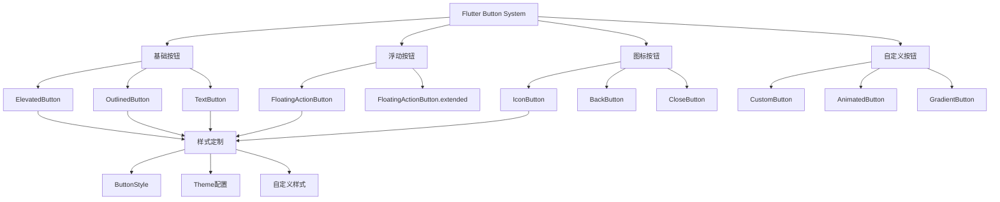

# 🎯 Flutter Button 组件深度解析：从基础到高级

[](https://flutter.dev/)
[](https://dart.dev/)
[](LICENSE)

> 深入掌握 Flutter 中各种按钮组件的使用方法、自定义样式和最佳实践，构建专业的用户交互体验

## ⚡ 快速开始

### 什么是 Flutter Button？

Flutter Button 是用户界面中最常用的交互组件之一，它允许用户通过点击来触发特定的操作。Flutter 提供了多种类型的按钮，每种都有其特定的使用场景和视觉风格。

### 按钮的核心概念

1. **onPressed 回调** - 按钮被点击时执行的函数
2. **child 内容** - 按钮内部显示的内容（文本、图标等）
3. **style 样式** - 按钮的外观样式（颜色、形状、大小等）
4. **状态管理** - 按钮的启用/禁用、加载等状态

### 基础按钮使用

```dart
// 最简单的按钮使用
ElevatedButton(
  onPressed: () => print('按钮被点击'),
  child: Text('点击我'),
)
```

**说明**: 这是一个基础的凸起按钮，当用户点击时会执行 `onPressed` 回调函数。

```dart
// 带图标的按钮
ElevatedButton.icon(
  onPressed: () => print('图标按钮被点击'),
  icon: Icon(Icons.download),
  label: Text('下载'),
)
```

**说明**: 使用 `.icon` 构造函数可以同时显示图标和文本，图标会自动与文本对齐。

```dart
// 轮廓按钮 - 适用于次要操作
OutlinedButton(
  onPressed: () => print('轮廓按钮被点击'),
  child: Text('取消'),
)
```

**说明**: 轮廓按钮只有边框，没有背景色，通常用于次要操作或取消操作。

```dart
// 文本按钮 - 适用于链接样式
TextButton(
  onPressed: () => print('文本按钮被点击'),
  child: Text('了解更多'),
)
```

**说明**: 文本按钮最简洁，只有文字，通常用于链接样式的操作。

### 自定义样式

```dart
ElevatedButton(
  onPressed: () => print('自定义样式按钮'),
  style: ElevatedButton.styleFrom(
    backgroundColor: Colors.blue,      // 背景色
    foregroundColor: Colors.white,     // 文字颜色
    padding: EdgeInsets.symmetric(horizontal: 24, vertical: 12), // 内边距
    shape: RoundedRectangleBorder(     // 形状
      borderRadius: BorderRadius.circular(8),
    ),
  ),
  child: Text('自定义样式'),
)
```

**样式属性说明**:

- `backgroundColor`: 按钮的背景颜色
- `foregroundColor`: 按钮文字和图标的颜色
- `padding`: 按钮内部的内边距
- `shape`: 按钮的形状，可以是圆角矩形、圆形等
- `elevation`: 按钮的阴影高度
- `side`: 按钮的边框样式（主要用于 OutlinedButton）

### 按钮类型选择指南

| 按钮类型                 | 适用场景   | 视觉特点       | 使用建议           |
| ------------------------ | ---------- | -------------- | ------------------ |
| **ElevatedButton**       | 主要操作   | 有背景色和阴影 | 表单提交、确认操作 |
| **OutlinedButton**       | 次要操作   | 只有边框       | 取消、返回操作     |
| **TextButton**           | 辅助操作   | 只有文字       | 链接、帮助信息     |
| **FloatingActionButton** | 浮动操作   | 圆形浮动按钮   | 添加、主要操作     |
| **IconButton**           | 工具栏操作 | 只有图标       | 菜单、设置等       |

## 📊 文章概览

| 章节                              | 内容           | 难度等级 | 预计时间 |
| --------------------------------- | -------------- | -------- | -------- |
| [基础按钮组件](#基础按钮组件)     | 标准按钮类型   | ⭐⭐     | 15 分钟  |
| [按钮样式定制](#按钮样式定制)     | 样式自定义     | ⭐⭐⭐   | 20 分钟  |
| [自定义按钮组件](#自定义按钮组件) | 自定义按钮实现 | ⭐⭐⭐⭐ | 30 分钟  |
| [按钮状态管理](#按钮状态管理)     | 状态处理       | ⭐⭐⭐   | 25 分钟  |
| [按钮动画效果](#按钮动画效果)     | 动画实现       | ⭐⭐⭐⭐ | 35 分钟  |
| [实际应用场景](#实际应用场景)     | 真实项目案例   | ⭐⭐⭐⭐ | 40 分钟  |
| [性能优化](#性能优化和最佳实践)   | 最佳实践       | ⭐⭐⭐⭐ | 20 分钟  |

## 🎯 学习目标

- ✅ 掌握 Flutter 中各种基础按钮组件的使用方法
- ✅ 学会按钮样式的自定义和主题配置
- ✅ 理解自定义按钮组件的设计原则和实现
- ✅ 能够实现按钮状态管理和动画效果
- ✅ 掌握按钮组件的最佳实践和性能优化

## 📋 目录导航

<details>
<summary>🎯 快速导航</summary>

- [基础按钮组件](#基础按钮组件) - 标准按钮类型
- [按钮样式定制](#按钮样式定制) - 样式自定义
- [自定义按钮组件](#自定义按钮组件) - 自定义按钮实现
- [按钮状态管理](#按钮状态管理) - 状态处理
- [按钮动画效果](#按钮动画效果) - 动画实现
- [实际应用场景](#实际应用场景) - 真实项目案例

</details>

---

## 📋 概述

本文档详细介绍 Flutter 中各种按钮组件的使用方法、样式定制、自定义实现和最佳实践。按钮是用户交互的核心组件，掌握按钮的使用技巧对于构建优秀的用户界面至关重要。

## 🏗️ Button 组件架构图



### 📊 Button 组件特性对比

| 按钮类型                 | 主要用途 | 性能       | 灵活性     | 复杂度     | 适用场景           |
| ------------------------ | -------- | ---------- | ---------- | ---------- | ------------------ |
| **ElevatedButton**       | 主要操作 | ⭐⭐⭐⭐⭐ | ⭐⭐⭐     | ⭐⭐       | 表单提交、确认操作 |
| **OutlinedButton**       | 次要操作 | ⭐⭐⭐⭐⭐ | ⭐⭐⭐     | ⭐⭐       | 取消、返回操作     |
| **TextButton**           | 文本操作 | ⭐⭐⭐⭐⭐ | ⭐⭐⭐     | ⭐⭐       | 链接、辅助操作     |
| **FloatingActionButton** | 浮动操作 | ⭐⭐⭐⭐   | ⭐⭐⭐⭐   | ⭐⭐⭐     | 主要操作、添加     |
| **IconButton**           | 图标操作 | ⭐⭐⭐⭐⭐ | ⭐⭐⭐⭐   | ⭐⭐       | 工具栏、导航       |
| **自定义按钮**           | 特殊需求 | ⭐⭐⭐     | ⭐⭐⭐⭐⭐ | ⭐⭐⭐⭐⭐ | 品牌定制、特殊交互 |

## 🎯 基础按钮组件

### 1. ElevatedButton - 凸起按钮

**ElevatedButton** 是最常用的按钮类型，具有凸起的视觉效果，通常用于页面的主要操作。

**特点**:

- 有背景色和阴影效果
- 视觉上比较突出
- 适合主要操作（如提交、确认等）

**基本用法**:

```dart
ElevatedButton(
  onPressed: () {
    // 处理按钮点击事件
    print('按钮被点击');
  },
  child: Text('确认'),
)
```

**带图标的按钮**:

```dart
ElevatedButton.icon(
  onPressed: () => print('下载开始'),
  icon: Icon(Icons.download),
  label: Text('下载文件'),
)
```

**自定义样式**:

```dart
ElevatedButton(
  onPressed: () => print('自定义按钮'),
  style: ElevatedButton.styleFrom(
    backgroundColor: Colors.deepPurple,    // 背景色
    foregroundColor: Colors.white,         // 文字颜色
    padding: EdgeInsets.symmetric(horizontal: 32, vertical: 16), // 内边距
    shape: RoundedRectangleBorder(         // 圆角
      borderRadius: BorderRadius.circular(25),
    ),
    elevation: 8,                          // 阴影高度
  ),
  child: Text('自定义样式'),
)
```

**禁用状态**:

```dart
ElevatedButton(
  onPressed: null,  // 设置为 null 表示禁用
  child: Text('禁用按钮'),
)
```

### 2. OutlinedButton - 轮廓按钮

**OutlinedButton** 只有边框，没有背景色，通常用于次要操作。

**特点**:

- 只有边框，没有背景色
- 视觉上比较轻量
- 适合次要操作（如取消、返回等）

**基本用法**:

```dart
OutlinedButton(
  onPressed: () => print('取消操作'),
  child: Text('取消'),
)
```

**自定义边框样式**:

```dart
OutlinedButton(
  onPressed: () => print('自定义边框'),
  style: OutlinedButton.styleFrom(
    side: BorderSide(color: Colors.red, width: 2),  // 红色粗边框
    shape: RoundedRectangleBorder(
      borderRadius: BorderRadius.circular(20),
    ),
    padding: EdgeInsets.symmetric(horizontal: 24, vertical: 12),
  ),
  child: Text('自定义边框'),
)
```

### 3. TextButton - 文本按钮

**TextButton** 最简洁的按钮类型，只有文字，通常用于链接样式的操作。

**特点**:

- 只有文字，没有背景和边框
- 视觉上最轻量
- 适合辅助操作（如链接、帮助等）

**基本用法**:

```dart
TextButton(
  onPressed: () => print('查看更多'),
  child: Text('了解更多'),
)
```

**链接样式**:

```dart
TextButton(
  onPressed: () => print('打开链接'),
  style: TextButton.styleFrom(
    foregroundColor: Colors.blue,
  ),
  child: Text(
    '访问官网',
    style: TextStyle(
      decoration: TextDecoration.underline,  // 下划线
    ),
  ),
)
```

### 4. FloatingActionButton - 浮动操作按钮

**FloatingActionButton** 是一个圆形的浮动按钮，通常位于屏幕右下角。

**特点**:

- 圆形设计，浮动在界面上
- 通常用于主要操作
- 位置固定在屏幕角落

**基本用法**:

```dart
Scaffold(
  body: Center(child: Text('主要内容')),
  floatingActionButton: FloatingActionButton(
    onPressed: () => print('添加新项目'),
    tooltip: '添加',  // 长按提示
    child: Icon(Icons.add),
  ),
)
```

**扩展版本（带文字）**:

```dart
FloatingActionButton.extended(
  onPressed: () => print('创建新项目'),
  icon: Icon(Icons.add),
  label: Text('新建'),
)
```

### 按钮使用的最佳实践

1. **选择合适的按钮类型**

   - 主要操作使用 ElevatedButton
   - 次要操作使用 OutlinedButton
   - 辅助操作使用 TextButton

2. **提供清晰的反馈**

   - 按钮点击时应该有视觉反馈
   - 使用 tooltip 提供额外说明

3. **合理的按钮大小**

   - 触摸目标至少 48x48 像素
   - 文字按钮可以稍小一些

4. **一致的视觉风格**
   - 同一页面使用统一的按钮样式
   - 保持品牌色彩的一致性

## 🎨 按钮样式定制

### ButtonStyle 详解

**ButtonStyle** 是 Flutter 中用于定义按钮样式的类，它提供了丰富的属性来自定义按钮的外观。

**主要属性说明**:

- `backgroundColor`: 按钮的背景颜色
- `foregroundColor`: 按钮文字和图标的颜色
- `padding`: 按钮内部的内边距
- `shape`: 按钮的形状（圆角、圆形等）
- `elevation`: 按钮的阴影高度
- `side`: 按钮的边框样式

### 渐变背景按钮

渐变背景可以让按钮看起来更加美观和现代化。

```dart
Container(
  decoration: BoxDecoration(
    gradient: LinearGradient(
      colors: [Colors.purple, Colors.blue],
      begin: Alignment.centerLeft,
      end: Alignment.centerRight,
    ),
    borderRadius: BorderRadius.circular(25),
  ),
  child: ElevatedButton(
    onPressed: () => print('渐变按钮'),
    style: ElevatedButton.styleFrom(
      backgroundColor: Colors.transparent,  // 透明背景
      shadowColor: Colors.transparent,       // 透明阴影
    ),
    child: Text('渐变背景按钮'),
  ),
)
```

**实现原理**: 使用 `Container` 的 `decoration` 属性创建渐变背景，然后将按钮的背景设置为透明。

### 阴影效果按钮

阴影可以增加按钮的立体感和层次感。

```dart
ElevatedButton(
  onPressed: () => print('阴影按钮'),
  style: ElevatedButton.styleFrom(
    backgroundColor: Colors.orange,
    foregroundColor: Colors.white,
    elevation: 12,                          // 阴影高度
    shadowColor: Colors.orange.withOpacity(0.5), // 阴影颜色
    shape: RoundedRectangleBorder(
      borderRadius: BorderRadius.circular(15),
    ),
  ),
  child: Text('阴影效果按钮'),
)
```

**阴影参数说明**:

- `elevation`: 控制阴影的高度，数值越大阴影越明显
- `shadowColor`: 阴影的颜色，通常使用半透明色

### 主题配置

通过主题配置可以统一管理整个应用的按钮样式，确保视觉一致性。

```dart
MaterialApp(
  theme: ThemeData(
    // 配置所有 ElevatedButton 的默认样式
    elevatedButtonTheme: ElevatedButtonThemeData(
      style: ElevatedButton.styleFrom(
        backgroundColor: Colors.blue,
        foregroundColor: Colors.white,
        padding: EdgeInsets.symmetric(horizontal: 24, vertical: 12),
        shape: RoundedRectangleBorder(
          borderRadius: BorderRadius.circular(8),
        ),
      ),
    ),
    // 配置所有 OutlinedButton 的默认样式
    outlinedButtonTheme: OutlinedButtonThemeData(
      style: OutlinedButton.styleFrom(
        foregroundColor: Colors.blue,
        side: BorderSide(color: Colors.blue),
        padding: EdgeInsets.symmetric(horizontal: 24, vertical: 12),
      ),
    ),
  ),
  home: MyApp(),
)
```

**主题配置的优势**:

1. **一致性**: 所有按钮使用统一的样式
2. **维护性**: 修改主题即可影响所有按钮
3. **品牌化**: 轻松实现品牌色彩的统一

### 样式定制的最佳实践

1. **保持一致性**

   - 同一页面使用统一的按钮样式
   - 遵循设计规范中的色彩和尺寸标准

2. **考虑可访问性**

   - 确保按钮有足够的对比度
   - 提供合适的触摸目标大小

3. **响应式设计**

   - 在不同屏幕尺寸下调整按钮大小
   - 考虑不同设备的触摸精度

4. **性能优化**
   - 避免在 build 方法中创建新的样式对象
   - 使用 const 构造函数提高性能

## 🎨 自定义按钮组件

### 为什么需要自定义按钮？

虽然 Flutter 提供了丰富的内置按钮组件，但在实际开发中，我们经常需要：

1. **品牌一致性** - 符合公司或产品的设计规范
2. **特殊交互** - 实现特定的动画效果或交互行为
3. **功能扩展** - 添加加载状态、图标等额外功能
4. **复用性** - 创建可在多个地方使用的通用按钮组件

### 基础自定义按钮

下面是一个功能丰富的自定义按钮组件，支持多种配置选项：

```dart
class CustomButton extends StatelessWidget {
  final String text;                    // 按钮文本
  final VoidCallback? onPressed;        // 点击回调
  final Color? backgroundColor;         // 背景色
  final Color? textColor;               // 文字颜色
  final double? width;                  // 按钮宽度
  final double? height;                 // 按钮高度
  final BorderRadius? borderRadius;     // 圆角
  final bool isLoading;                 // 加载状态
  final IconData? icon;                 // 图标

  const CustomButton({
    Key? key,
    required this.text,
    this.onPressed,
    this.backgroundColor,
    this.textColor,
    this.width,
    this.height,
    this.borderRadius,
    this.isLoading = false,
    this.icon,
  }) : super(key: key);

  @override
  Widget build(BuildContext context) {
    return SizedBox(
      width: width,
      height: height ?? 48,
      child: ElevatedButton(
        onPressed: isLoading ? null : onPressed,
        style: ElevatedButton.styleFrom(
          backgroundColor: backgroundColor ?? Theme.of(context).primaryColor,
          foregroundColor: textColor ?? Colors.white,
          shape: RoundedRectangleBorder(
            borderRadius: borderRadius ?? BorderRadius.circular(8),
          ),
        ),
        child: _buildChild(),
      ),
    );
  }

  Widget _buildChild() {
    if (isLoading) {
      return SizedBox(
        width: 20,
        height: 20,
        child: CircularProgressIndicator(
          strokeWidth: 2,
          valueColor: AlwaysStoppedAnimation<Color>(textColor ?? Colors.white),
        ),
      );
    }

    if (icon != null) {
      return Row(
        mainAxisSize: MainAxisSize.min,
        children: [
          Icon(icon, size: 18),
          SizedBox(width: 8),
          Text(text),
        ],
      );
    }

    return Text(text);
  }
}
```

**使用示例**:

```dart
// 基础使用
CustomButton(
  text: '确认',
  onPressed: () => print('按钮被点击'),
)

// 带图标和加载状态
CustomButton(
  text: '提交',
  icon: Icons.send,
  isLoading: true,
  onPressed: () => print('提交数据'),
)
```

### 动画按钮

动画按钮可以为用户提供更好的交互反馈，增强用户体验。

```dart
class AnimatedButton extends StatefulWidget {
  final String text;
  final VoidCallback? onPressed;
  final Duration animationDuration;

  const AnimatedButton({
    Key? key,
    required this.text,
    this.onPressed,
    this.animationDuration = const Duration(milliseconds: 150),
  }) : super(key: key);

  @override
  _AnimatedButtonState createState() => _AnimatedButtonState();
}

class _AnimatedButtonState extends State<AnimatedButton>
    with SingleTickerProviderStateMixin {
  late AnimationController _animationController;
  late Animation<double> _scaleAnimation;

  @override
  void initState() {
    super.initState();
    _animationController = AnimationController(
      duration: widget.animationDuration,
      vsync: this,
    );
    _scaleAnimation = Tween<double>(
      begin: 1.0,
      end: 0.95,
    ).animate(CurvedAnimation(
      parent: _animationController,
      curve: Curves.easeInOut,
    ));
  }

  @override
  void dispose() {
    _animationController.dispose();
    super.dispose();
  }

  @override
  Widget build(BuildContext context) {
    return GestureDetector(
      onTapDown: (_) => _animationController.forward(),
      onTapUp: (_) => _animationController.reverse(),
      onTapCancel: () => _animationController.reverse(),
      child: AnimatedBuilder(
        animation: _scaleAnimation,
        builder: (context, child) {
          return Transform.scale(
            scale: _scaleAnimation.value,
            child: ElevatedButton(
              onPressed: widget.onPressed,
              child: Text(widget.text),
            ),
          );
        },
      ),
    );
  }
}
```

**动画原理**: 使用 `AnimationController` 控制按钮的缩放动画，在按下时缩小到 95%，松开时恢复到原始大小。

### 渐变按钮

渐变按钮可以创建更加美观的视觉效果。

```dart
class GradientButton extends StatelessWidget {
  final String text;
  final VoidCallback? onPressed;
  final List<Color> colors;
  final double? width;
  final double? height;

  const GradientButton({
    Key? key,
    required this.text,
    this.onPressed,
    this.colors = const [Colors.blue, Colors.purple],
    this.width,
    this.height,
  }) : super(key: key);

  @override
  Widget build(BuildContext context) {
    return Container(
      width: width,
      height: height ?? 48,
      decoration: BoxDecoration(
        gradient: LinearGradient(
          colors: colors,
          begin: Alignment.centerLeft,
          end: Alignment.centerRight,
        ),
        borderRadius: BorderRadius.circular(8),
        boxShadow: [
          BoxShadow(
            color: colors.first.withOpacity(0.3),
            blurRadius: 8,
            offset: Offset(0, 4),
          ),
        ],
      ),
      child: Material(
        color: Colors.transparent,
        child: InkWell(
          onTap: onPressed,
          borderRadius: BorderRadius.circular(8),
          child: Container(
            padding: EdgeInsets.symmetric(horizontal: 24, vertical: 12),
            child: Center(
              child: Text(
                text,
                style: TextStyle(
                  color: Colors.white,
                  fontSize: 16,
                  fontWeight: FontWeight.bold,
                ),
              ),
            ),
          ),
        ),
      ),
    );
  }
}
```

**使用示例**:

```dart
GradientButton(
  text: '立即购买',
  colors: [Colors.red, Colors.orange],
  onPressed: () => print('购买'),
)
```

### 自定义按钮的设计原则

1. **单一职责** - 每个自定义按钮应该有明确的功能定位
2. **可配置性** - 提供足够的参数来满足不同使用场景
3. **一致性** - 保持与系统按钮的交互一致性
4. **可访问性** - 支持无障碍访问和键盘导航
5. **性能优化** - 使用 const 构造函数和合理的重建策略

### 自定义按钮的最佳实践

1. **参数设计**

   - 提供合理的默认值
   - 使用可选参数减少使用复杂度
   - 考虑参数的组合使用

2. **状态管理**

   - 正确处理加载、禁用等状态
   - 提供清晰的状态反馈

3. **样式统一**

   - 遵循设计系统的规范
   - 保持与整体 UI 的一致性

4. **文档和示例**
   - 提供清晰的使用说明
   - 包含常见使用场景的示例

## 🎯 按钮状态管理

### 按钮状态的重要性

按钮状态管理是用户体验的重要组成部分。良好的状态管理可以：

1. **提供清晰的反馈** - 用户知道按钮当前的状态
2. **防止误操作** - 避免重复点击或无效操作
3. **提升用户体验** - 流畅的状态转换让操作更自然

### 常见的按钮状态

| 状态         | 描述             | 使用场景           |
| ------------ | ---------------- | ------------------ |
| **正常状态** | 按钮可以正常点击 | 默认状态           |
| **禁用状态** | 按钮不可点击     | 条件不满足时       |
| **加载状态** | 正在执行操作     | 网络请求、数据处理 |
| **选中状态** | 按钮被选中       | 选项按钮、标签页   |
| **错误状态** | 操作失败         | 表单验证失败       |

### 加载状态按钮

加载状态是最常用的按钮状态之一，用于表示正在执行异步操作。

```dart
class LoadingButton extends StatefulWidget {
  final String text;
  final String loadingText;
  final Future<void> Function()? onPressed;

  const LoadingButton({
    Key? key,
    required this.text,
    this.loadingText = '加载中...',
    this.onPressed,
  }) : super(key: key);

  @override
  _LoadingButtonState createState() => _LoadingButtonState();
}

class _LoadingButtonState extends State<LoadingButton> {
  bool _isLoading = false;

  @override
  Widget build(BuildContext context) {
    return ElevatedButton(
      onPressed: _isLoading ? null : _handlePressed,
      child: _isLoading
          ? Row(
              mainAxisSize: MainAxisSize.min,
              children: [
                SizedBox(
                  width: 16,
                  height: 16,
                  child: CircularProgressIndicator(strokeWidth: 2),
                ),
                SizedBox(width: 8),
                Text(widget.loadingText),
              ],
            )
          : Text(widget.text),
    );
  }

  Future<void> _handlePressed() async {
    if (widget.onPressed == null) return;

    setState(() => _isLoading = true);

    try {
      await widget.onPressed!();
    } finally {
      if (mounted) {
        setState(() => _isLoading = false);
      }
    }
  }
}
```

**使用示例**:

```dart
LoadingButton(
  text: '提交',
  loadingText: '提交中...',
  onPressed: () async {
    await Future.delayed(Duration(seconds: 2)); // 模拟网络请求
    print('提交完成');
  },
)
```

**实现要点**:

1. 使用 `_isLoading` 状态控制按钮的显示
2. 在异步操作期间禁用按钮
3. 显示加载指示器和加载文本
4. 正确处理组件销毁的情况

### 按钮组状态管理

按钮组通常用于选择操作或分类筛选，需要管理选中状态。

```dart
class ButtonGroupExample extends StatefulWidget {
  @override
  _ButtonGroupExampleState createState() => _ButtonGroupExampleState();
}

class _ButtonGroupExampleState extends State<ButtonGroupExample> {
  int _selectedIndex = -1;  // 选中的按钮索引

  @override
  Widget build(BuildContext context) {
    return Column(
      children: [
        Text('选择你的偏好:'),
        SizedBox(height: 16),

        // 按钮组
        Wrap(
          spacing: 8,
          children: List.generate(5, (index) {
            final isSelected = _selectedIndex == index;
            return ElevatedButton(
              onPressed: () {
                setState(() {
                  _selectedIndex = index;
                });
              },
              style: ElevatedButton.styleFrom(
                backgroundColor: isSelected ? Colors.blue : Colors.grey[300],
                foregroundColor: isSelected ? Colors.white : Colors.black87,
              ),
              child: Text('选项 ${index + 1}'),
            );
          }),
        ),

        SizedBox(height: 24),

        // 确认按钮
        ElevatedButton(
          onPressed: _selectedIndex >= 0 ? () {
            print('选择了: 选项 ${_selectedIndex + 1}');
          } : null,
          child: Text('确认选择'),
        ),
      ],
    );
  }
}
```

**状态管理要点**:

1. 使用 `_selectedIndex` 跟踪选中状态
2. 根据选中状态改变按钮样式
3. 确认按钮根据选择状态启用/禁用

### 条件状态按钮

有些按钮的状态取决于应用的其他条件，如表单验证、网络状态等。

```dart
class ConditionalButton extends StatelessWidget {
  final String text;
  final VoidCallback? onPressed;
  final bool isEnabled;
  final String? disabledReason;

  const ConditionalButton({
    Key? key,
    required this.text,
    this.onPressed,
    this.isEnabled = true,
    this.disabledReason,
  }) : super(key: key);

  @override
  Widget build(BuildContext context) {
    return Column(
      children: [
        ElevatedButton(
          onPressed: isEnabled ? onPressed : null,
          style: ElevatedButton.styleFrom(
            backgroundColor: isEnabled ? Colors.blue : Colors.grey,
            foregroundColor: Colors.white,
          ),
          child: Text(text),
        ),
        if (!isEnabled && disabledReason != null)
          Padding(
            padding: EdgeInsets.only(top: 8),
            child: Text(
              disabledReason!,
              style: TextStyle(
                color: Colors.red,
                fontSize: 12,
              ),
            ),
          ),
      ],
    );
  }
}
```

**使用示例**:

```dart
ConditionalButton(
  text: '提交订单',
  isEnabled: hasValidAddress && hasPaymentMethod,
  disabledReason: !hasValidAddress ? '请先添加收货地址' : '请先选择支付方式',
  onPressed: () => submitOrder(),
)
```

### 状态管理的最佳实践

1. **状态清晰**

   - 明确定义每个状态的含义
   - 提供清晰的状态反馈

2. **状态一致性**

   - 保持状态转换的逻辑一致
   - 避免状态冲突

3. **用户体验**

   - 状态转换要流畅自然
   - 提供适当的视觉反馈

4. **错误处理**

   - 正确处理异常情况
   - 提供错误状态的恢复机制

5. **性能考虑**
   - 避免不必要的状态更新
   - 合理使用 setState

## 🎬 按钮动画效果

### 动画的重要性

动画效果可以显著提升用户体验：

1. **视觉反馈** - 让用户知道操作已被识别
2. **交互引导** - 引导用户关注重要元素
3. **情感连接** - 让界面更加生动有趣
4. **品牌识别** - 体现产品的设计风格

### 常见的按钮动画类型

| 动画类型     | 效果           | 适用场景     |
| ------------ | -------------- | ------------ |
| **缩放动画** | 按钮按下时缩小 | 点击反馈     |
| **波纹效果** | 点击时产生波纹 | 触觉反馈     |
| **脉冲动画** | 持续缩放提醒   | 重要操作提醒 |
| **颜色过渡** | 颜色渐变变化   | 状态变化     |
| **形状变形** | 按钮形状改变   | 特殊交互     |

### 波纹效果按钮

波纹效果是 Material Design 的标准交互反馈，提供自然的触觉体验。

```dart
class RippleButton extends StatelessWidget {
  final String text;
  final VoidCallback? onPressed;
  final Color? backgroundColor;
  final Color? rippleColor;

  const RippleButton({
    Key? key,
    required this.text,
    this.onPressed,
    this.backgroundColor,
    this.rippleColor,
  }) : super(key: key);

  @override
  Widget build(BuildContext context) {
    return Container(
      decoration: BoxDecoration(
        color: backgroundColor ?? Theme.of(context).primaryColor,
        borderRadius: BorderRadius.circular(8),
      ),
      child: Material(
        color: Colors.transparent,
        child: InkWell(
          onTap: onPressed,
          borderRadius: BorderRadius.circular(8),
          splashColor: rippleColor ?? Colors.white.withOpacity(0.3),
          highlightColor: rippleColor ?? Colors.white.withOpacity(0.1),
          child: Container(
            padding: EdgeInsets.symmetric(horizontal: 24, vertical: 12),
            child: Center(
              child: Text(
                text,
                style: TextStyle(
                  color: Colors.white,
                  fontSize: 16,
                  fontWeight: FontWeight.w500,
                ),
              ),
            ),
          ),
        ),
      ),
    );
  }
}
```

**实现原理**: 使用 `InkWell` 组件包装按钮内容，通过 `splashColor` 和 `highlightColor` 控制波纹效果的颜色。

### 脉冲动画按钮

脉冲动画可以吸引用户注意，常用于重要操作或提醒功能。

```dart
class PulseButton extends StatefulWidget {
  final String text;
  final VoidCallback? onPressed;
  final Color? backgroundColor;

  const PulseButton({
    Key? key,
    required this.text,
    this.onPressed,
    this.backgroundColor,
  }) : super(key: key);

  @override
  _PulseButtonState createState() => _PulseButtonState();
}

class _PulseButtonState extends State<PulseButton>
    with TickerProviderStateMixin {
  late AnimationController _pulseController;
  late Animation<double> _pulseAnimation;

  @override
  void initState() {
    super.initState();
    _pulseController = AnimationController(
      duration: Duration(seconds: 2),
      vsync: this,
    );
    _pulseAnimation = Tween<double>(
      begin: 1.0,
      end: 1.1,
    ).animate(CurvedAnimation(
      parent: _pulseController,
      curve: Curves.easeInOut,
    ));

    // 开始脉冲动画
    _pulseController.repeat(reverse: true);
  }

  @override
  void dispose() {
    _pulseController.dispose();
    super.dispose();
  }

  @override
  Widget build(BuildContext context) {
    return AnimatedBuilder(
      animation: _pulseAnimation,
      builder: (context, child) {
        return Transform.scale(
          scale: _pulseAnimation.value,
          child: ElevatedButton(
            onPressed: widget.onPressed,
            style: ElevatedButton.styleFrom(
              backgroundColor: widget.backgroundColor ?? Colors.red,
              foregroundColor: Colors.white,
            ),
            child: Text(widget.text),
          ),
        );
      },
    );
  }
}
```

**使用场景**: 紧急操作、重要提醒、限时优惠等需要吸引用户注意的场景。

### 颜色过渡动画

颜色过渡动画可以让状态变化更加平滑自然。

```dart
class AnimatedColorButton extends StatefulWidget {
  final String text;
  final VoidCallback? onPressed;
  final Color normalColor;
  final Color pressedColor;

  const AnimatedColorButton({
    Key? key,
    required this.text,
    this.onPressed,
    this.normalColor = Colors.blue,
    this.pressedColor = Colors.red,
  }) : super(key: key);

  @override
  _AnimatedColorButtonState createState() => _AnimatedColorButtonState();
}

class _AnimatedColorButtonState extends State<AnimatedColorButton>
    with SingleTickerProviderStateMixin {
  late AnimationController _colorController;
  late Animation<Color?> _colorAnimation;
  bool _isPressed = false;

  @override
  void initState() {
    super.initState();
    _colorController = AnimationController(
      duration: Duration(milliseconds: 200),
      vsync: this,
    );
    _colorAnimation = ColorTween(
      begin: widget.normalColor,
      end: widget.pressedColor,
    ).animate(_colorController);
  }

  @override
  void dispose() {
    _colorController.dispose();
    super.dispose();
  }

  @override
  Widget build(BuildContext context) {
    return AnimatedBuilder(
      animation: _colorAnimation,
      builder: (context, child) {
        return ElevatedButton(
          onPressed: widget.onPressed,
          style: ElevatedButton.styleFrom(
            backgroundColor: _colorAnimation.value,
            foregroundColor: Colors.white,
          ),
          onLongPress: () {
            setState(() {
              _isPressed = !_isPressed;
              if (_isPressed) {
                _colorController.forward();
              } else {
                _colorController.reverse();
              }
            });
          },
          child: Text(widget.text),
        );
      },
    );
  }
}
```

**交互方式**: 长按按钮可以切换颜色状态，短按执行正常操作。

### 动画设计的最佳实践

1. **适度原则**

   - 动画不要过于夸张
   - 保持与整体设计风格一致

2. **性能考虑**

   - 避免过度使用动画
   - 合理使用动画控制器

3. **用户体验**

   - 动画时长要适中（通常 200-300ms）
   - 提供关闭动画的选项

4. **可访问性**
   - 考虑用户的动画偏好设置
   - 提供替代的视觉反馈

### 动画性能优化

1. **使用 AnimatedBuilder**

   - 只在动画变化时重建
   - 避免整个组件树重建

2. **合理使用 vsync**

   - 使用 TickerProviderStateMixin
   - 及时释放动画控制器

3. **避免复杂动画**
   - 简化动画逻辑
   - 使用硬件加速

## 🎯 实际应用场景

### 应用场景的重要性

了解按钮在实际项目中的应用场景，可以帮助我们：

1. **选择合适的按钮类型** - 根据具体需求选择最合适的按钮
2. **设计合理的交互流程** - 创建流畅的用户体验
3. **实现品牌一致性** - 保持设计风格的统一
4. **提升开发效率** - 复用成熟的解决方案

### 1. 登录表单按钮

登录表单是应用中最常见的场景之一，需要处理多种按钮状态和交互。

**设计要点**:

- 主要操作按钮（登录）要突出显示
- 次要操作按钮（忘记密码、注册）要轻量化
- 需要处理加载状态和验证反馈

```dart
class LoginForm extends StatefulWidget {
  @override
  _LoginFormState createState() => _LoginFormState();
}

class _LoginFormState extends State<LoginForm> {
  final _formKey = GlobalKey<FormState>();
  bool _isLoading = false;

  @override
  Widget build(BuildContext context) {
    return Form(
      key: _formKey,
      child: Column(
        children: [
          // 邮箱输入框
          TextFormField(
            decoration: InputDecoration(
              labelText: '邮箱',
              prefixIcon: Icon(Icons.email),
            ),
            validator: (value) {
              if (value?.isEmpty ?? true) return '请输入邮箱';
              return null;
            },
          ),

          SizedBox(height: 16),

          // 密码输入框
          TextFormField(
            decoration: InputDecoration(
              labelText: '密码',
              prefixIcon: Icon(Icons.lock),
            ),
            obscureText: true,
            validator: (value) {
              if (value?.isEmpty ?? true) return '请输入密码';
              return null;
            },
          ),

          SizedBox(height: 24),

          // 登录按钮
          LoadingButton(
            text: '登录',
            loadingText: '登录中...',
            onPressed: _isLoading ? null : _handleLogin,
          ),

          SizedBox(height: 16),

          // 辅助操作按钮
          Row(
            children: [
              Expanded(
                child: TextButton(
                  onPressed: () => print('忘记密码'),
                  child: Text('忘记密码'),
                ),
              ),
              Expanded(
                child: TextButton(
                  onPressed: () => print('注册账号'),
                  child: Text('注册账号'),
                ),
              ),
            ],
          ),
        ],
      ),
    );
  }

  Future<void> _handleLogin() async {
    if (!_formKey.currentState!.validate()) return;

    setState(() => _isLoading = true);

    try {
      await Future.delayed(Duration(seconds: 2)); // 模拟登录请求
      print('登录成功');
    } catch (e) {
      print('登录失败: $e');
    } finally {
      if (mounted) {
        setState(() => _isLoading = false);
      }
    }
  }
}
```

**关键特性**:

1. 使用 `LoadingButton` 处理异步登录
2. 表单验证和错误提示
3. 合理的按钮层次和布局

### 2. 电商应用按钮

电商应用中的按钮需要处理复杂的业务逻辑和用户交互。

**设计要点**:

- 购买按钮要突出显示
- 收藏、分享等辅助功能要轻量化
- 需要处理库存、价格等动态信息

```dart
class ProductDetailButtons extends StatelessWidget {
  final bool isInStock;
  final double price;
  final bool isFavorited;

  const ProductDetailButtons({
    Key? key,
    required this.isInStock,
    required this.price,
    required this.isFavorited,
  }) : super(key: key);

  @override
  Widget build(BuildContext context) {
    return Column(
      children: [
        // 价格显示
        Row(
          children: [
            Text(
              '¥${price.toStringAsFixed(2)}',
              style: TextStyle(
                fontSize: 24,
                fontWeight: FontWeight.bold,
                color: Colors.red,
              ),
            ),
            Spacer(),
            Text(
              isInStock ? '有库存' : '缺货',
              style: TextStyle(
                color: isInStock ? Colors.green : Colors.red,
              ),
            ),
          ],
        ),

        SizedBox(height: 16),

        // 主要操作按钮
        Row(
          children: [
            // 收藏按钮
            Expanded(
              child: OutlinedButton.icon(
                onPressed: () => print('收藏商品'),
                icon: Icon(
                  isFavorited ? Icons.favorite : Icons.favorite_border,
                  color: isFavorited ? Colors.red : null,
                ),
                label: Text('收藏'),
              ),
            ),

            SizedBox(width: 12),

            // 加入购物车按钮
            Expanded(
              flex: 2,
              child: ElevatedButton.icon(
                onPressed: isInStock ? () => print('加入购物车') : null,
                icon: Icon(Icons.shopping_cart),
                label: Text('加入购物车'),
                style: ElevatedButton.styleFrom(
                  backgroundColor: Colors.orange,
                  foregroundColor: Colors.white,
                ),
              ),
            ),
          ],
        ),

        SizedBox(height: 12),

        // 立即购买按钮
        GradientButton(
          text: '立即购买',
          colors: [Colors.red, Colors.orange],
          onPressed: isInStock ? () => print('立即购买') : null,
        ),
      ],
    );
  }
}
```

**关键特性**:

1. 根据库存状态启用/禁用按钮
2. 使用不同颜色和样式区分按钮重要性
3. 动态显示收藏状态

### 3. 设置页面按钮

设置页面通常包含多种类型的按钮，需要清晰的信息层次。

**设计要点**:

- 使用图标增强可识别性
- 提供清晰的操作反馈
- 处理危险操作的确认

```dart
class SettingsButtons extends StatelessWidget {
  @override
  Widget build(BuildContext context) {
    return Column(
      children: [
        // 普通设置项
        ListTile(
          leading: Icon(Icons.notifications),
          title: Text('通知设置'),
          trailing: Icon(Icons.chevron_right),
          onTap: () => print('打开通知设置'),
        ),

        ListTile(
          leading: Icon(Icons.security),
          title: Text('隐私设置'),
          trailing: Icon(Icons.chevron_right),
          onTap: () => print('打开隐私设置'),
        ),

        Divider(),

        // 操作按钮
        ListTile(
          leading: Icon(Icons.logout, color: Colors.orange),
          title: Text('退出登录', style: TextStyle(color: Colors.orange)),
          onTap: () => _showLogoutDialog(context),
        ),

        ListTile(
          leading: Icon(Icons.delete_forever, color: Colors.red),
          title: Text('删除账号', style: TextStyle(color: Colors.red)),
          onTap: () => _showDeleteAccountDialog(context),
        ),
      ],
    );
  }

  void _showLogoutDialog(BuildContext context) {
    showDialog(
      context: context,
      builder: (context) => AlertDialog(
        title: Text('确认退出'),
        content: Text('确定要退出登录吗？'),
        actions: [
          TextButton(
            onPressed: () => Navigator.pop(context),
            child: Text('取消'),
          ),
          ElevatedButton(
            onPressed: () {
              Navigator.pop(context);
              print('退出登录');
            },
            child: Text('确认'),
          ),
        ],
      ),
    );
  }

  void _showDeleteAccountDialog(BuildContext context) {
    showDialog(
      context: context,
      builder: (context) => AlertDialog(
        title: Text('删除账号'),
        content: Text('此操作不可恢复，确定要删除账号吗？'),
        actions: [
          TextButton(
            onPressed: () => Navigator.pop(context),
            child: Text('取消'),
          ),
          ElevatedButton(
            onPressed: () {
              Navigator.pop(context);
              print('删除账号');
            },
            style: ElevatedButton.styleFrom(
              backgroundColor: Colors.red,
              foregroundColor: Colors.white,
            ),
            child: Text('删除'),
          ),
        ],
      ),
    );
  }
}
```

**关键特性**:

1. 使用 `ListTile` 创建统一的设置项样式
2. 危险操作使用红色标识
3. 提供确认对话框防止误操作

### 应用场景的最佳实践

1. **用户研究**

   - 了解目标用户的使用习惯
   - 分析用户的操作流程

2. **信息架构**

   - 合理组织按钮的层次关系
   - 保持界面的一致性和可预测性

3. **交互设计**

   - 提供清晰的视觉反馈
   - 设计流畅的操作流程

4. **技术实现**
   - 考虑性能和可维护性
   - 实现响应式设计

## 🚀 性能优化和最佳实践

### 1. 按钮性能优化

```dart
// 使用 const 构造函数
const CustomButton({
  Key? key,
  required this.text,
  this.onPressed,
}) : super(key: key);

// 避免在 build 方法中创建新的对象
class OptimizedButton extends StatelessWidget {
  final String text;
  final VoidCallback? onPressed;

  // 预定义样式
  static const ButtonStyle _defaultStyle = ButtonStyle(
    padding: MaterialStatePropertyAll(EdgeInsets.all(16)),
    shape: MaterialStatePropertyAll(
      RoundedRectangleBorder(
        borderRadius: BorderRadius.all(Radius.circular(8)),
      ),
    ),
  );

  const OptimizedButton({
    Key? key,
    required this.text,
    this.onPressed,
  }) : super(key: key);

  @override
  Widget build(BuildContext context) {
    return ElevatedButton(
      onPressed: onPressed,
      style: _defaultStyle,
      child: Text(text),
    );
  }
}
```

### 2. 按钮最佳实践

```dart
class ButtonBestPractices extends StatelessWidget {
  @override
  Widget build(BuildContext context) {
    return Scaffold(
      appBar: AppBar(
        title: Text('按钮最佳实践'),
        backgroundColor: Theme.of(context).colorScheme.inversePrimary,
      ),
      body: Padding(
        padding: EdgeInsets.all(16.0),
        child: Column(
          crossAxisAlignment: CrossAxisAlignment.stretch,
          children: [
            // 1. 提供清晰的反馈
            ElevatedButton(
              onPressed: () {
                // 提供触觉反馈
                HapticFeedback.lightImpact();
                ScaffoldMessenger.of(context).showSnackBar(
                  SnackBar(content: Text('操作成功')),
                );
              },
              child: Text('带反馈的按钮'),
            ),

            SizedBox(height: 16),

            // 2. 合理的按钮大小
            SizedBox(
              height: 48, // 最小触摸目标
              child: ElevatedButton(
                onPressed: () {},
                child: Text('合适大小的按钮'),
              ),
            ),

            SizedBox(height: 16),

            // 3. 清晰的视觉层次
            Row(
              children: [
                Expanded(
                  child: OutlinedButton(
                    onPressed: () {},
                    child: Text('次要操作'),
                  ),
                ),
                SizedBox(width: 12),
                Expanded(
                  flex: 2,
                  child: ElevatedButton(
                    onPressed: () {},
                    child: Text('主要操作'),
                  ),
                ),
              ],
            ),

            SizedBox(height: 16),

            // 4. 无障碍支持
            ElevatedButton(
              onPressed: () {},
              child: Text('无障碍按钮'),
            ).semantics(
              label: '这是一个重要的操作按钮',
              hint: '双击执行操作',
            ),
          ],
        ),
      ),
    );
  }
}
```

## ❓ 常见问题与解决方案

### Q1: 按钮点击没有反应怎么办？

**问题描述**: 按钮点击后没有任何响应

**解决方案**:

```dart
// ❌ 错误做法
ElevatedButton(
  onPressed: null, // 这会导致按钮禁用
  child: Text('点击我'),
)

// ✅ 正确做法
ElevatedButton(
  onPressed: () {
    print('按钮被点击');
    // 执行你的逻辑
  },
  child: Text('点击我'),
)
```

### Q2: 如何实现按钮的加载状态？

**解决方案**:

```dart
class LoadingButton extends StatefulWidget {
  final String text;
  final Future<void> Function()? onPressed;

  const LoadingButton({
    Key? key,
    required this.text,
    this.onPressed,
  }) : super(key: key);

  @override
  _LoadingButtonState createState() => _LoadingButtonState();
}

class _LoadingButtonState extends State<LoadingButton> {
  bool _isLoading = false;

  @override
  Widget build(BuildContext context) {
    return ElevatedButton(
      onPressed: _isLoading ? null : _handlePressed,
      child: _isLoading
        ? SizedBox(
            width: 20,
            height: 20,
            child: CircularProgressIndicator(strokeWidth: 2),
          )
        : Text(widget.text),
    );
  }

  Future<void> _handlePressed() async {
    setState(() => _isLoading = true);
    try {
      await widget.onPressed?.call();
    } finally {
      if (mounted) setState(() => _isLoading = false);
    }
  }
}
```

### Q3: 如何自定义按钮的圆角？

**解决方案**:

```dart
// 使用 shape 属性
ElevatedButton(
  onPressed: () {},
  style: ElevatedButton.styleFrom(
    shape: RoundedRectangleBorder(
      borderRadius: BorderRadius.circular(20), // 圆角半径
    ),
  ),
  child: Text('圆角按钮'),
)

// 或者使用 StadiumBorder 实现胶囊形状
ElevatedButton(
  onPressed: () {},
  style: ElevatedButton.styleFrom(
    shape: StadiumBorder(), // 胶囊形状
  ),
  child: Text('胶囊按钮'),
)
```

### Q4: 如何实现按钮的渐变背景？

**解决方案**:

```dart
Container(
  decoration: BoxDecoration(
    gradient: LinearGradient(
      colors: [Colors.blue, Colors.purple],
      begin: Alignment.centerLeft,
      end: Alignment.centerRight,
    ),
    borderRadius: BorderRadius.circular(8),
  ),
  child: ElevatedButton(
    onPressed: () {},
    style: ElevatedButton.styleFrom(
      backgroundColor: Colors.transparent,
      shadowColor: Colors.transparent,
    ),
    child: Text('渐变按钮'),
  ),
)
```

### Q5: 如何实现按钮的点击动画效果？

**解决方案**:

```dart
class AnimatedButton extends StatefulWidget {
  final String text;
  final VoidCallback? onPressed;

  const AnimatedButton({
    Key? key,
    required this.text,
    this.onPressed,
  }) : super(key: key);

  @override
  _AnimatedButtonState createState() => _AnimatedButtonState();
}

class _AnimatedButtonState extends State<AnimatedButton>
    with SingleTickerProviderStateMixin {
  late AnimationController _controller;
  late Animation<double> _scaleAnimation;

  @override
  void initState() {
    super.initState();
    _controller = AnimationController(
      duration: Duration(milliseconds: 150),
      vsync: this,
    );
    _scaleAnimation = Tween<double>(
      begin: 1.0,
      end: 0.95,
    ).animate(CurvedAnimation(
      parent: _controller,
      curve: Curves.easeInOut,
    ));
  }

  @override
  void dispose() {
    _controller.dispose();
    super.dispose();
  }

  @override
  Widget build(BuildContext context) {
    return GestureDetector(
      onTapDown: (_) => _controller.forward(),
      onTapUp: (_) => _controller.reverse(),
      onTapCancel: () => _controller.reverse(),
      child: AnimatedBuilder(
        animation: _scaleAnimation,
        builder: (context, child) {
          return Transform.scale(
            scale: _scaleAnimation.value,
            child: ElevatedButton(
              onPressed: widget.onPressed,
              child: Text(widget.text),
            ),
          );
        },
      ),
    );
  }
}
```

### Q6: 如何实现按钮的禁用状态？

**解决方案**:

```dart
// 方法1: 设置 onPressed 为 null
ElevatedButton(
  onPressed: isEnabled ? () => print('按钮被点击') : null,
  child: Text('按钮'),
)

// 方法2: 使用条件渲染
isEnabled
  ? ElevatedButton(
      onPressed: () => print('按钮被点击'),
      child: Text('按钮'),
    )
  : ElevatedButton(
      onPressed: null,
      child: Text('按钮'),
    )

// 方法3: 自定义禁用样式
ElevatedButton(
  onPressed: isEnabled ? () => print('按钮被点击') : null,
  style: ElevatedButton.styleFrom(
    backgroundColor: isEnabled ? Colors.blue : Colors.grey,
    foregroundColor: isEnabled ? Colors.white : Colors.grey[400],
  ),
  child: Text('按钮'),
)
```

### Q7: 如何实现按钮的图标和文字对齐？

**解决方案**:

```dart
// 使用 ElevatedButton.icon
ElevatedButton.icon(
  onPressed: () {},
  icon: Icon(Icons.download),
  label: Text('下载'),
)

// 或者手动对齐
ElevatedButton(
  onPressed: () {},
  child: Row(
    mainAxisSize: MainAxisSize.min,
    children: [
      Icon(Icons.download),
      SizedBox(width: 8),
      Text('下载'),
    ],
  ),
)
```

### Q8: 如何实现按钮的响应式设计？

**解决方案**:

```dart
class ResponsiveButton extends StatelessWidget {
  final String text;
  final VoidCallback? onPressed;

  const ResponsiveButton({
    Key? key,
    required this.text,
    this.onPressed,
  }) : super(key: key);

  @override
  Widget build(BuildContext context) {
    // 获取屏幕尺寸
    final screenWidth = MediaQuery.of(context).size.width;

    // 根据屏幕宽度调整按钮样式
    if (screenWidth < 600) {
      // 手机端：垂直布局
      return Column(
        children: [
          ElevatedButton(
            onPressed: onPressed,
            child: Text(text),
          ),
        ],
      );
    } else {
      // 平板/桌面端：水平布局
      return Row(
        children: [
          Expanded(
            child: ElevatedButton(
              onPressed: onPressed,
              child: Text(text),
            ),
          ),
        ],
      );
    }
  }
}
```

## 📚 总结

本文档详细介绍了 Flutter 中各种按钮组件的使用方法、样式定制、自定义实现和最佳实践。通过掌握这些技巧，你可以：

1. **选择合适的按钮类型** - 根据使用场景选择最合适的按钮组件
2. **定制按钮样式** - 使用 ButtonStyle 和主题配置实现品牌一致性
3. **创建自定义按钮** - 实现特殊的交互需求和视觉效果
4. **管理按钮状态** - 处理加载、禁用等不同状态
5. **优化用户体验** - 通过动画和反馈提升交互体验

### 🎯 下一步学习

- [交互式控件](interactive-widgets.md) - 学习更多交互组件
- [自定义组件](custom-widgets.md) - 掌握组件设计原则
- [动画组件](animation-widgets.md) - 深入学习动画效果
- [表单组件](form-widgets.md) - 了解表单中的按钮使用

通过系统学习这些内容，你将能够构建出专业级的用户界面和交互体验。

## 🧪 测试用例

### 1. 基础按钮测试

```dart
import 'package:flutter/material.dart';
import 'package:flutter_test/flutter_test.dart';

void main() {
  group('基础按钮测试', () {
    testWidgets('ElevatedButton 应该正确显示文本', (WidgetTester tester) async {
      await tester.pumpWidget(
        MaterialApp(
          home: Scaffold(
            body: ElevatedButton(
              onPressed: () {},
              child: Text('测试按钮'),
            ),
          ),
        ),
      );

      expect(find.text('测试按钮'), findsOneWidget);
      expect(find.byType(ElevatedButton), findsOneWidget);
    });

    testWidgets('按钮点击应该触发回调', (WidgetTester tester) async {
      bool buttonPressed = false;

      await tester.pumpWidget(
        MaterialApp(
          home: Scaffold(
            body: ElevatedButton(
              onPressed: () {
                buttonPressed = true;
              },
              child: Text('测试按钮'),
            ),
          ),
        ),
      );

      await tester.tap(find.byType(ElevatedButton));
      await tester.pump();

      expect(buttonPressed, isTrue);
    });

    testWidgets('禁用按钮不应该触发回调', (WidgetTester tester) async {
      bool buttonPressed = false;

      await tester.pumpWidget(
        MaterialApp(
          home: Scaffold(
            body: ElevatedButton(
              onPressed: null, // 禁用状态
              child: Text('禁用按钮'),
            ),
          ),
        ),
      );

      await tester.tap(find.byType(ElevatedButton));
      await tester.pump();

      expect(buttonPressed, isFalse);
    });
  });
}
```

### 2. 自定义按钮测试

```dart
import 'package:flutter/material.dart';
import 'package:flutter_test/flutter_test.dart';

void main() {
  group('自定义按钮测试', () {
    testWidgets('CustomButton 应该正确显示加载状态', (WidgetTester tester) async {
      await tester.pumpWidget(
        MaterialApp(
          home: Scaffold(
            body: CustomButton(
              text: '测试按钮',
              isLoading: true,
              onPressed: () {},
            ),
          ),
        ),
      );

      // 应该显示加载指示器而不是文本
      expect(find.text('测试按钮'), findsNothing);
      expect(find.byType(CircularProgressIndicator), findsOneWidget);
    });

    testWidgets('CustomButton 应该正确显示图标', (WidgetTester tester) async {
      await tester.pumpWidget(
        MaterialApp(
          home: Scaffold(
            body: CustomButton(
              text: '测试按钮',
              icon: Icons.download,
              onPressed: () {},
            ),
          ),
        ),
      );

      expect(find.text('测试按钮'), findsOneWidget);
      expect(find.byIcon(Icons.download), findsOneWidget);
    });
  });
}
```

### 3. 按钮样式测试

```dart
import 'package:flutter/material.dart';
import 'package:flutter_test/flutter_test.dart';

void main() {
  group('按钮样式测试', () {
    testWidgets('按钮应该应用自定义样式', (WidgetTester tester) async {
      await tester.pumpWidget(
        MaterialApp(
          home: Scaffold(
            body: ElevatedButton(
              onPressed: () {},
              style: ElevatedButton.styleFrom(
                backgroundColor: Colors.red,
                foregroundColor: Colors.white,
                padding: EdgeInsets.all(20),
              ),
              child: Text('样式按钮'),
            ),
          ),
        ),
      );

      final button = tester.widget<ElevatedButton>(find.byType(ElevatedButton));
      final style = button.style as ButtonStyle;

      // 验证样式属性
      expect(style.backgroundColor?.resolve({}), Colors.red);
      expect(style.foregroundColor?.resolve({}), Colors.white);
      expect(style.padding?.resolve({}), EdgeInsets.all(20));
    });
  });
}
```

### 4. 按钮动画测试

```dart
import 'package:flutter/material.dart';
import 'package:flutter_test/flutter_test.dart';

void main() {
  group('按钮动画测试', () {
    testWidgets('AnimatedButton 应该响应点击动画', (WidgetTester tester) async {
      await tester.pumpWidget(
        MaterialApp(
          home: Scaffold(
            body: AnimatedButton(
              text: '动画按钮',
              onPressed: () {},
            ),
          ),
        ),
      );

      // 初始状态
      expect(find.text('动画按钮'), findsOneWidget);

      // 模拟点击
      await tester.tap(find.byType(ElevatedButton));
      await tester.pump();

      // 验证动画控制器状态
      final animatedButton = tester.widget<AnimatedButton>(find.byType(AnimatedButton));
      final state = tester.state<_AnimatedButtonState>(find.byType(AnimatedButton));

      expect(state._animationController.isAnimating, isTrue);
    });
  });
}
```

### 5. 集成测试

```dart
import 'package:flutter/material.dart';
import 'package:flutter_test/flutter_test.dart';

void main() {
  group('按钮集成测试', () {
    testWidgets('登录表单按钮流程测试', (WidgetTester tester) async {
      await tester.pumpWidget(
        MaterialApp(
          home: LoginFormExample(),
        ),
      );

      // 验证表单元素存在
      expect(find.text('登录'), findsOneWidget);
      expect(find.text('忘记密码'), findsOneWidget);
      expect(find.text('注册账号'), findsOneWidget);

      // 验证输入框存在
      expect(find.byType(TextFormField), findsNWidgets(2));

      // 测试登录按钮点击
      await tester.tap(find.text('登录'));
      await tester.pump();

      // 应该显示验证错误（因为表单为空）
      expect(find.text('请输入邮箱'), findsOneWidget);
      expect(find.text('请输入密码'), findsOneWidget);
    });

    testWidgets('电商按钮交互测试', (WidgetTester tester) async {
      await tester.pumpWidget(
        MaterialApp(
          home: EcommerceButtonsExample(),
        ),
      );

      // 验证按钮存在
      expect(find.text('收藏'), findsOneWidget);
      expect(find.text('加入购物车'), findsOneWidget);
      expect(find.text('立即购买'), findsOneWidget);

      // 测试收藏按钮
      await tester.tap(find.text('收藏'));
      await tester.pump();

      // 应该显示 SnackBar
      expect(find.text('已添加到收藏'), findsOneWidget);
    });
  });
}
```

### 6. 性能测试

```dart
import 'package:flutter/material.dart';
import 'package:flutter_test/flutter_test.dart';

void main() {
  group('按钮性能测试', () {
    testWidgets('大量按钮渲染性能测试', (WidgetTester tester) async {
      final stopwatch = Stopwatch()..start();

      await tester.pumpWidget(
        MaterialApp(
          home: Scaffold(
            body: ListView.builder(
              itemCount: 1000,
              itemBuilder: (context, index) {
                return Padding(
                  padding: EdgeInsets.all(8.0),
                  child: ElevatedButton(
                    onPressed: () {},
                    child: Text('按钮 $index'),
                  ),
                );
              },
            ),
          ),
        ),
      );

      stopwatch.stop();

      // 验证渲染时间在合理范围内（通常应该小于1秒）
      expect(stopwatch.elapsedMilliseconds, lessThan(1000));
    });

    testWidgets('按钮重建性能测试', (WidgetTester tester) async {
      await tester.pumpWidget(
        MaterialApp(
          home: OptimizedButton(
            text: '优化按钮',
            onPressed: () {},
          ),
        ),
      );

      final stopwatch = Stopwatch()..start();

      // 多次重建测试
      for (int i = 0; i < 100; i++) {
        await tester.pumpWidget(
          MaterialApp(
            home: OptimizedButton(
              text: '优化按钮 $i',
              onPressed: () {},
            ),
          ),
        );
      }

      stopwatch.stop();

      // 验证重建时间在合理范围内
      expect(stopwatch.elapsedMilliseconds, lessThan(500));
    });
  });
}
```

### 7. 无障碍测试

```dart
import 'package:flutter/material.dart';
import 'package:flutter_test/flutter_test.dart';

void main() {
  group('按钮无障碍测试', () {
    testWidgets('按钮应该支持无障碍标签', (WidgetTester tester) async {
      await tester.pumpWidget(
        MaterialApp(
          home: Scaffold(
            body: ElevatedButton(
              onPressed: () {},
              child: Text('无障碍按钮'),
            ).semantics(
              label: '这是一个重要的操作按钮',
              hint: '双击执行操作',
            ),
          ),
        ),
      );

      // 验证无障碍标签存在
      expect(find.bySemanticsLabel('这是一个重要的操作按钮'), findsOneWidget);
    });

    testWidgets('按钮应该支持键盘导航', (WidgetTester tester) async {
      await tester.pumpWidget(
        MaterialApp(
          home: Scaffold(
            body: Focus(
              child: ElevatedButton(
                onPressed: () {},
                child: Text('可聚焦按钮'),
              ),
            ),
          ),
        ),
      );

      // 验证按钮可以获得焦点
      expect(find.byType(ElevatedButton), findsOneWidget);

      // 模拟键盘焦点
      await tester.tap(find.byType(ElevatedButton));
      await tester.pump();

      // 验证焦点状态
      final button = tester.widget<ElevatedButton>(find.byType(ElevatedButton));
      expect(button.focusNode?.hasFocus, isTrue);
    });
  });
}
```

这些测试用例涵盖了按钮组件的各个方面，包括基础功能、自定义组件、样式应用、动画效果、集成测试、性能测试和无障碍支持。通过这些测试，可以确保按钮组件在各种场景下都能正常工作。
