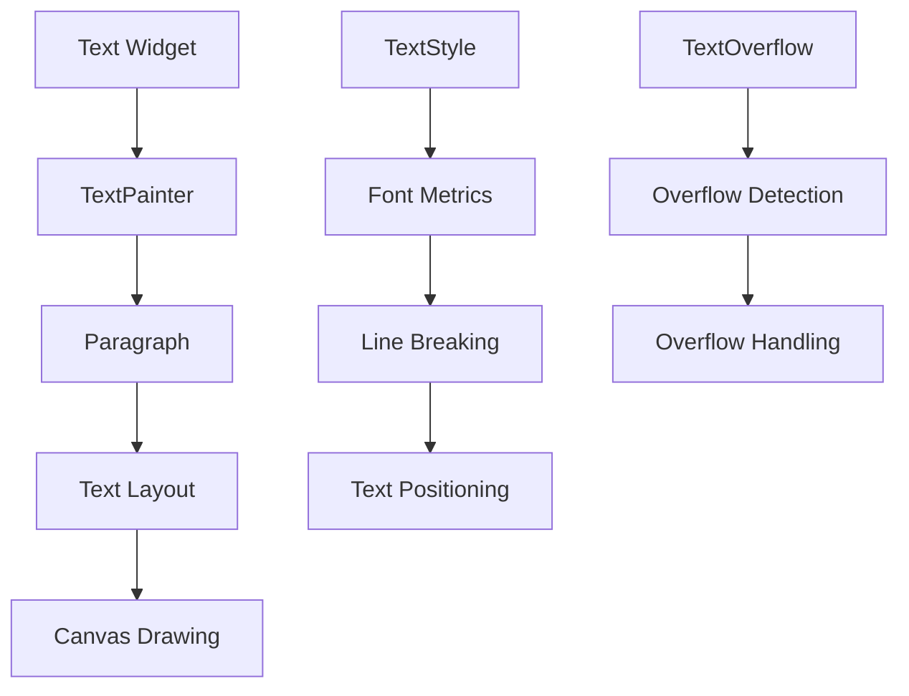

# 📝 Flutter Text 组件深度解析：从入门到精通

> 作为一名 Flutter 开发者，Text 组件是我们每天都会接触的基础组件。本文将深入剖析 Text 组件的内部机制、性能优化技巧和实际应用场景，帮助你在项目中更好地使用这个看似简单却功能强大的组件。


## 📋 目录导航

- [前言：为什么 Text 组件如此重要](#前言为什么-text-组件如此重要)
- [Text 组件的内部机制](#text-组件的内部机制)
- [基础用法与最佳实践](#基础用法与最佳实践)
- [高级样式技巧](#高级样式技巧)
- [性能优化实战](#性能优化实战)
- [常见问题与解决方案](#常见问题与解决方案)
- [实际项目应用](#实际项目应用)
- [总结与思考](#总结与思考)

---

## 🎯 前言：为什么 Text 组件如此重要

在 Flutter 开发中，Text 组件可能是我们使用频率最高的组件之一。从简单的标签显示到复杂的富文本渲染，Text 组件承载着应用中的大部分文本内容展示任务。

### 我的项目经历

在我参与的一个电商应用中，Text 组件的使用频率达到了惊人的 80% 以上。从商品标题、价格显示、用户评价到系统提示，几乎所有的文本内容都依赖于 Text 组件。然而，随着应用的复杂度增加，我们也遇到了不少挑战：

- **性能问题**：大量文本渲染导致页面卡顿
- **样式统一**：不同页面的文本样式不一致
- **响应式适配**：不同屏幕尺寸下的文本显示问题
- **国际化支持**：多语言文本的显示和布局

这些问题的解决过程让我对 Text 组件有了更深入的理解，也积累了不少实用的技巧。

## 🏗️ Text 组件的内部机制

### 组件架构分析

Text 组件的内部实现远比我们想象的要复杂。让我们通过源码分析来理解它的工作原理：

```dart
// Text 组件的核心结构
class Text extends StatelessWidget {
  const Text(
    this.data, {
    super.key,
    this.style,
    this.strutStyle,
    this.textAlign,
    this.textDirection,
    this.locale,
    this.softWrap,
    this.overflow,
    this.textScaleFactor,
    this.maxLines,
    this.semanticsLabel,
    this.textWidthBasis,
    this.textHeightBehavior,
    this.selectionColor,
  });
}
```

### 渲染流程



### 关键属性深度解析

#### 1. TextStyle 的内部结构

```dart
class TextStyle {
  final Color? color;           // 文本颜色
  final double? fontSize;       // 字体大小
  final FontWeight? fontWeight; // 字体粗细
  final FontStyle? fontStyle;   // 字体样式（正常/斜体）
  final double? letterSpacing;  // 字母间距
  final double? wordSpacing;    // 单词间距
  final TextBaseline? textBaseline; // 文本基线
  final double? height;         // 行高倍数
  final Paint? foreground;      // 前景画笔（用于渐变等效果）
  final Paint? background;      // 背景画笔
  final List<Shadow>? shadows;  // 阴影列表
  final List<FontFeature>? fontFeatures; // 字体特性
  final TextDecoration? decoration; // 文本装饰
  final Color? decorationColor; // 装饰颜色
  final TextDecorationStyle? decorationStyle; // 装饰样式
  final double? decorationThickness; // 装饰粗细
  final String? debugLabel;     // 调试标签
  final String? fontFamily;     // 字体族
  final List<String>? fontFamilyFallback; // 备用字体族
  final String? package;        // 字体包名
}
```

#### 2. TextOverflow 的处理机制

```dart
enum TextOverflow {
  /// 显示省略号
  ellipsis,

  /// 淡出效果
  fade,

  /// 直接裁剪
  clip,

  /// 允许溢出
  visible,
}
```

## 🎨 基础用法与最佳实践

### 1. 文本样式系统设计

在实际项目中，我推荐建立一套完整的文本样式系统：

```dart
/// 应用文本样式系统
class AppTextStyles {
  // 标题样式
  static const TextStyle h1 = TextStyle(
    fontSize: 32,
    fontWeight: FontWeight.bold,
    height: 1.2,
    letterSpacing: -0.5,
  );

  static const TextStyle h2 = TextStyle(
    fontSize: 24,
    fontWeight: FontWeight.w600,
    height: 1.3,
    letterSpacing: -0.3,
  );

  static const TextStyle h3 = TextStyle(
    fontSize: 20,
    fontWeight: FontWeight.w600,
    height: 1.4,
  );

  // 正文样式
  static const TextStyle bodyLarge = TextStyle(
    fontSize: 18,
    fontWeight: FontWeight.normal,
    height: 1.5,
  );

  static const TextStyle bodyMedium = TextStyle(
    fontSize: 16,
    fontWeight: FontWeight.normal,
    height: 1.5,
  );

  static const TextStyle bodySmall = TextStyle(
    fontSize: 14,
    fontWeight: FontWeight.normal,
    height: 1.4,
  );

  // 标签样式
  static const TextStyle caption = TextStyle(
    fontSize: 12,
    fontWeight: FontWeight.normal,
    height: 1.3,
    color: Colors.grey,
  );

  // 按钮样式
  static const TextStyle button = TextStyle(
    fontSize: 16,
    fontWeight: FontWeight.w600,
    height: 1.0,
    letterSpacing: 0.5,
  );
}
```

### 2. 响应式文本组件

```dart
/// 响应式文本组件
class ResponsiveText extends StatelessWidget {
  final String text;
  final TextStyle? style;
  final TextAlign? textAlign;
  final int? maxLines;
  final TextOverflow? overflow;

  const ResponsiveText({
    super.key,
    required this.text,
    this.style,
    this.textAlign,
    this.maxLines,
    this.overflow,
  });

  @override
  Widget build(BuildContext context) {
    final mediaQuery = MediaQuery.of(context);
    final textScaleFactor = mediaQuery.textScaleFactor;
    final screenWidth = mediaQuery.size.width;

    // 根据屏幕宽度调整字体大小
    double getResponsiveFontSize(double baseSize) {
      if (screenWidth < 320) return baseSize * 0.8;
      if (screenWidth < 480) return baseSize * 0.9;
      if (screenWidth > 1200) return baseSize * 1.2;
      return baseSize;
    }

    final responsiveStyle = style?.copyWith(
      fontSize: style?.fontSize != null
          ? getResponsiveFontSize(style!.fontSize!) * textScaleFactor
          : null,
    );

    return Text(
      text,
      style: responsiveStyle,
      textAlign: textAlign,
      maxLines: maxLines,
      overflow: overflow,
    );
  }
}
```

### 3. 智能文本溢出处理

```dart
/// 智能文本溢出处理组件
class SmartText extends StatelessWidget {
  final String text;
  final TextStyle? style;
  final double? maxWidth;
  final int? maxLines;
  final TextOverflow overflow;
  final VoidCallback? onOverflow;

  const SmartText({
    super.key,
    required this.text,
    this.style,
    this.maxWidth,
    this.maxLines,
    this.overflow = TextOverflow.ellipsis,
    this.onOverflow,
  });

  @override
  Widget build(BuildContext context) {
    return LayoutBuilder(
      builder: (context, constraints) {
        final effectiveMaxWidth = maxWidth ?? constraints.maxWidth;

        // 计算文本是否溢出
        final textPainter = TextPainter(
          text: TextSpan(text: text, style: style),
          textDirection: TextDirection.ltr,
          maxLines: maxLines,
        );

        textPainter.layout(maxWidth: effectiveMaxWidth);

        // 如果文本溢出且设置了回调，触发回调
        if (textPainter.didExceedMaxLines && onOverflow != null) {
          WidgetsBinding.instance.addPostFrameCallback((_) {
            onOverflow!();
          });
        }

        return Container(
          width: maxWidth,
          child: Text(
            text,
            style: style,
            maxLines: maxLines,
            overflow: overflow,
          ),
        );
      },
    );
  }
}
```

## ⚡ 性能优化实战

### 1. 文本渲染性能优化

```dart
/// 高性能文本组件
class OptimizedText extends StatelessWidget {
  final String text;
  final TextStyle? style;
  final TextAlign? textAlign;
  final int? maxLines;
  final TextOverflow? overflow;

  const OptimizedText({
    super.key,
    required this.text,
    this.style,
    this.textAlign,
    this.maxLines,
    this.overflow,
  });

  @override
  Widget build(BuildContext context) {
    // 使用 const 构造函数优化
    return Text(
      text,
      style: style,
      textAlign: textAlign,
      maxLines: maxLines,
      overflow: overflow,
      // 启用文本缓存
      textWidthBasis: TextWidthBasis.parent,
    );
  }
}

/// 文本缓存管理器
class TextCacheManager {
  static final Map<String, TextPainter> _cache = {};

  static TextPainter? getCachedText(String text, TextStyle style) {
    final key = '${text}_${style.hashCode}';
    return _cache[key];
  }

  static void cacheText(String text, TextStyle style, TextPainter painter) {
    final key = '${text}_${style.hashCode}';
    _cache[key] = painter;

    // 限制缓存大小
    if (_cache.length > 100) {
      final firstKey = _cache.keys.first;
      _cache.remove(firstKey);
    }
  }

  static void clearCache() {
    _cache.clear();
  }
}
```

### 2. 大量文本渲染优化

```dart
/// 虚拟化文本列表
class VirtualizedTextList extends StatefulWidget {
  final List<String> texts;
  final TextStyle? style;
  final double itemHeight;

  const VirtualizedTextList({
    super.key,
    required this.texts,
    this.style,
    this.itemHeight = 50,
  });

  @override
  State<VirtualizedTextList> createState() => _VirtualizedTextListState();
}

class _VirtualizedTextListState extends State<VirtualizedTextList> {
  final ScrollController _scrollController = ScrollController();

  @override
  Widget build(BuildContext context) {
    return ListView.builder(
      controller: _scrollController,
      itemCount: widget.texts.length,
      itemBuilder: (context, index) {
        return SizedBox(
          height: widget.itemHeight,
          child: Text(
            widget.texts[index],
            style: widget.style,
            maxLines: 1,
            overflow: TextOverflow.ellipsis,
          ),
        );
      },
    );
  }

  @override
  void dispose() {
    _scrollController.dispose();
    super.dispose();
  }
}
```

### 3. 内存优化技巧

```dart
/// 内存优化的文本组件
class MemoryOptimizedText extends StatelessWidget {
  final String text;
  final TextStyle? style;

  const MemoryOptimizedText({
    super.key,
    required this.text,
    this.style,
  });

  @override
  Widget build(BuildContext context) {
    // 使用 const 构造函数
    return const Text(
      '静态文本', // 对于不变的文本使用 const
      style: TextStyle(fontSize: 16),
    );
  }
}

/// 文本样式常量
class TextStyles {
  // 使用 const 构造函数定义样式常量
  static const TextStyle title = TextStyle(
    fontSize: 18,
    fontWeight: FontWeight.bold,
  );

  static const TextStyle body = TextStyle(
    fontSize: 16,
    color: Colors.black87,
  );

  static const TextStyle caption = TextStyle(
    fontSize: 12,
    color: Colors.grey,
  );
}
```

## 🔧 常见问题与解决方案

### 1. 文本显示不完整

**问题描述**：文本在某些设备上显示不完整或被截断。

**解决方案**：

```dart
/// 自适应文本组件
class AdaptiveText extends StatelessWidget {
  final String text;
  final TextStyle? style;
  final double? maxWidth;

  const AdaptiveText({
    super.key,
    required this.text,
    this.style,
    this.maxWidth,
  });

  @override
  Widget build(BuildContext context) {
    return LayoutBuilder(
      builder: (context, constraints) {
        final effectiveMaxWidth = maxWidth ?? constraints.maxWidth;

        return Text(
          text,
          style: style,
          maxLines: null, // 允许自动换行
          softWrap: true,
          overflow: TextOverflow.visible,
        );
      },
    );
  }
}
```

### 2. 字体加载问题

**问题描述**：自定义字体在某些设备上无法正确显示。

**解决方案**：

```dart
/// 字体回退组件
class FallbackText extends StatelessWidget {
  final String text;
  final TextStyle? style;
  final List<String> fontFallbacks;

  const FallbackText({
    super.key,
    required this.text,
    this.style,
    this.fontFallbacks = const ['Roboto', 'Arial', 'sans-serif'],
  });

  @override
  Widget build(BuildContext context) {
    return Text(
      text,
      style: style?.copyWith(
        fontFamilyFallback: fontFallbacks,
      ),
    );
  }
}
```

### 3. 性能问题排查

```dart
/// 文本性能监控组件
class MonitoredText extends StatefulWidget {
  final String text;
  final TextStyle? style;
  final VoidCallback? onRenderComplete;

  const MonitoredText({
    super.key,
    required this.text,
    this.style,
    this.onRenderComplete,
  });

  @override
  State<MonitoredText> createState() => _MonitoredTextState();
}

class _MonitoredTextState extends State<MonitoredText> {
  Stopwatch? _stopwatch;

  @override
  void initState() {
    super.initState();
    _stopwatch = Stopwatch()..start();
  }

  @override
  Widget build(BuildContext context) {
    WidgetsBinding.instance.addPostFrameCallback((_) {
      _stopwatch?.stop();
      final duration = _stopwatch?.elapsedMicroseconds ?? 0;

      if (duration > 1000) { // 超过1ms的渲染时间
        debugPrint('Text rendering took ${duration}μs: ${widget.text}');
      }

      widget.onRenderComplete?.call();
    });

    return Text(
      widget.text,
      style: widget.style,
    );
  }
}
```

### 2. 文本对齐方式

**对齐方式的选择**：
文本对齐方式直接影响阅读体验和视觉层次，需要根据内容类型和布局需求选择合适的对齐方式。

**对齐方式说明**：

- **左对齐**：适合大多数文本内容，符合阅读习惯
- **居中对齐**：适合标题、按钮文本等短文本
- **右对齐**：适合数字、时间等需要对齐的内容
- **两端对齐**：适合长段落文本，提升阅读体验

**使用建议**：

- 正文内容通常使用左对齐
- 标题和重要信息可以使用居中对齐
- 数字列表使用右对齐便于比较
- 长文本段落考虑使用两端对齐

### 3. 文本溢出处理

```dart
// 省略号处理
Text(
  '这是一段很长的文本内容，可能会超出容器宽度',
  overflow: TextOverflow.ellipsis,
  maxLines: 1,
)

// 淡出效果
Text(
  '这是一段很长的文本内容，可能会超出容器宽度',
  overflow: TextOverflow.fade,
  maxLines: 1,
)

// 裁剪处理
Text(
  '这是一段很长的文本内容，可能会超出容器宽度',
  overflow: TextOverflow.clip,
  maxLines: 1,
)
```

**溢出处理效果对比：**

| 处理方式     | 效果                                       | 适用场景           |
| ------------ | ------------------------------------------ | ------------------ |
| **ellipsis** | 这是一段很长的文本内容...                  | 标题、按钮文本     |
| **fade**     | 这是一段很长的文本内容                     | 需要渐变效果的场景 |
| **clip**     | 这是一段很长的文本内容                     | 精确裁剪需求       |
| **visible**  | 这是一段很长的文本内容，可能会超出容器宽度 | 允许溢出的场景     |

**文本溢出处理策略**：
文本溢出处理是文本显示中的重要问题，需要根据不同的使用场景选择合适的处理方式。

**溢出处理方式**：

- **ellipsis**：显示省略号，适合标题和按钮文本
- **fade**：渐变效果，适合需要视觉过渡的场景
- **clip**：直接裁剪，适合精确控制显示内容的场景
- **visible**：允许溢出，适合需要完整显示内容的场景

**设计建议**：

- 标题和按钮文本优先使用 ellipsis
- 长段落文本考虑使用 fade 效果
- 需要精确控制时使用 clip
- 特殊场景下允许 visible 溢出

**最佳实践**：

- 合理设置 `maxLines` 属性
- 根据容器大小选择合适的溢出处理方式
- 考虑用户体验，避免内容被意外截断
- 在响应式布局中动态调整处理策略

```dart
// 文本装饰示例
Widget _buildDecorationText() {
  return Card(
    child: Padding(
      padding: EdgeInsets.all(16),
      child: Column(
        crossAxisAlignment: CrossAxisAlignment.start,
        children: [
          Text(
            '文本装饰示例',
            style: TextStyle(fontSize: 18, fontWeight: FontWeight.bold),
          ),
          SizedBox(height: 10),

          Text(
            '下划线文本',
            style: TextStyle(
              decoration: TextDecoration.underline,
              decorationColor: Colors.blue,
            ),
          ),
          Text(
            '删除线文本',
            style: TextStyle(
              decoration: TextDecoration.lineThrough,
              decorationColor: Colors.red,
            ),
          ),

          SizedBox(height: 10),

          // 字体样式
          Text(
            '斜体文本',
            style: TextStyle(fontStyle: FontStyle.italic),
          ),
          Text(
            '字母间距',
            style: TextStyle(letterSpacing: 2.0),
          ),
          Text(
            '单词间距',
            style: TextStyle(wordSpacing: 4.0),
          ),
        ],
      ),
    ),
  );
}
```

```dart
Widget _buildAlignedText() {
  return Card(
    child: Padding(
      padding: EdgeInsets.all(16),
      child: Column(
        crossAxisAlignment: CrossAxisAlignment.start,
        children: [
          Text(
            '文本对齐示例',
            style: TextStyle(fontSize: 18, fontWeight: FontWeight.bold),
          ),
          SizedBox(height: 10),

          Container(
            width: double.infinity,
            padding: EdgeInsets.all(8),
            decoration: BoxDecoration(
              border: Border.all(color: Colors.grey[300]!),
              borderRadius: BorderRadius.circular(4),
            ),
            child: Text(
              '左对齐文本',
              textAlign: TextAlign.left,
            ),
          ),

          SizedBox(height: 8),

          Container(
            width: double.infinity,
            padding: EdgeInsets.all(8),
            decoration: BoxDecoration(
              border: Border.all(color: Colors.grey[300]!),
              borderRadius: BorderRadius.circular(4),
            ),
            child: Text(
              '居中对齐文本',
              textAlign: TextAlign.center,
            ),
          ),

          SizedBox(height: 8),

          Container(
            width: double.infinity,
            padding: EdgeInsets.all(8),
            decoration: BoxDecoration(
              border: Border.all(color: Colors.grey[300]!),
              borderRadius: BorderRadius.circular(4),
            ),
            child: Text(
              '右对齐文本',
              textAlign: TextAlign.right,
            ),
          ),

          SizedBox(height: 8),

          Container(
            width: double.infinity,
            padding: EdgeInsets.all(8),
            decoration: BoxDecoration(
              border: Border.all(color: Colors.grey[300]!),
              borderRadius: BorderRadius.circular(4),
            ),
            child: Text(
              '两端对齐文本，这是一段较长的文本内容，用于演示两端对齐的效果。',
              textAlign: TextAlign.justify,
            ),
          ),
        ],
      ),
    ),
  );
}
```

```dart
Widget _buildOverflowText() {
  return Card(
    child: Padding(
      padding: EdgeInsets.all(16),
      child: Column(
        crossAxisAlignment: CrossAxisAlignment.start,
        children: [
          Text(
            '溢出处理示例',
            style: TextStyle(fontSize: 18, fontWeight: FontWeight.bold),
          ),
          SizedBox(height: 10),

          // 省略号
          Container(
            width: 200,
            padding: EdgeInsets.all(8),
            decoration: BoxDecoration(
              border: Border.all(color: Colors.grey[300]!),
              borderRadius: BorderRadius.circular(4),
            ),
            child: Text(
              '这是一段很长的文本内容，会被截断并显示省略号',
              overflow: TextOverflow.ellipsis,
            ),
          ),

          SizedBox(height: 8),

          // 淡出效果
          Container(
            width: 200,
            padding: EdgeInsets.all(8),
            decoration: BoxDecoration(
              border: Border.all(color: Colors.grey[300]!),
              borderRadius: BorderRadius.circular(4),
            ),
            child: Text(
              '这是一段很长的文本内容，会以淡出效果处理溢出',
              overflow: TextOverflow.fade,
              softWrap: false,
            ),
          ),

          SizedBox(height: 8),

          // 裁剪
          Container(
            width: 200,
            padding: EdgeInsets.all(8),
            decoration: BoxDecoration(
              border: Border.all(color: Colors.grey[300]!),
              borderRadius: BorderRadius.circular(4),
            ),
            child: Text(
              '这是一段很长的文本内容，会被直接裁剪',
              overflow: TextOverflow.clip,
              softWrap: false,
            ),
          ),

          SizedBox(height: 8),

          // 限制行数
          Container(
            width: 200,
            padding: EdgeInsets.all(8),
            decoration: BoxDecoration(
              border: Border.all(color: Colors.grey[300]!),
              borderRadius: BorderRadius.circular(4),
            ),
            child: Text(
              '这是一段很长的文本内容，会被限制在两行内显示，超出部分会被截断并显示省略号',
              maxLines: 2,
              overflow: TextOverflow.ellipsis,
            ),
          ),
        ],
      ),
    ),
  );
}
```

## 🎨 高级文本样式

**高级文本样式的价值**：
高级文本样式能够创建更加丰富和吸引人的视觉效果，提升用户界面的视觉层次和用户体验。

**高级样式类型**：

- **渐变文本**：使用 `ShaderMask` 创建渐变效果
- **阴影文本**：通过 `TextStyle` 的 `shadows` 属性添加阴影
- **描边文本**：使用 `Paint` 创建描边效果
- **背景文本**：为文本添加背景色或背景图片

**设计原则**：

- 保持视觉层次，避免过度装饰
- 确保文本的可读性
- 考虑不同设备的显示效果
- 与整体设计风格保持一致

**使用建议**：

- 渐变文本适合标题和重要信息
- 阴影文本增加视觉深度
- 描边文本提升对比度
- 背景文本突出重要内容

```dart
Widget _buildShadowText() {
  return Card(
    child: Container(
      width: double.infinity,
      padding: EdgeInsets.all(16),
      decoration: BoxDecoration(
        gradient: LinearGradient(
          colors: [Colors.blue[900]!, Colors.blue[700]!],
        ),
      ),
      child: Column(
        children: [
          Text(
            '阴影文本效果',
            style: TextStyle(
              fontSize: 18,
              fontWeight: FontWeight.bold,
              color: Colors.white,
            ),
          ),
          SizedBox(height: 10),

          // 单个阴影
          Text(
            '单个阴影',
            style: TextStyle(
              fontSize: 24,
              fontWeight: FontWeight.bold,
              color: Colors.white,
              shadows: [
                Shadow(
                  offset: Offset(2, 2),
                  blurRadius: 4,
                  color: Colors.black54,
                ),
              ],
            ),
          ),

          SizedBox(height: 10),

          // 多重阴影
          Text(
            '多重阴影',
            style: TextStyle(
              fontSize: 24,
              fontWeight: FontWeight.bold,
              color: Colors.white,
              shadows: [
                Shadow(
                  offset: Offset(1, 1),
                  blurRadius: 2,
                  color: Colors.red,
                ),
                Shadow(
                  offset: Offset(2, 2),
                  blurRadius: 4,
                  color: Colors.blue,
                ),
                Shadow(
                  offset: Offset(3, 3),
                  blurRadius: 6,
                  color: Colors.green,
                ),
              ],
            ),
          ),

          SizedBox(height: 10),

          // 发光效果
          Text(
            '发光效果',
            style: TextStyle(
              fontSize: 24,
              fontWeight: FontWeight.bold,
              color: Colors.white,
              shadows: [
                Shadow(
                  offset: Offset(0, 0),
                  blurRadius: 10,
                  color: Colors.cyan,
                ),
                Shadow(
                  offset: Offset(0, 0),
                  blurRadius: 20,
                  color: Colors.cyan.withOpacity(0.5),
                ),
              ],
            ),
          ),
        ],
      ),
    ),
  );
}
```

```dart
Widget _buildStrokeText() {
  return Card(
    child: Padding(
      padding: EdgeInsets.all(16),
      child: Column(
        children: [
          Text(
            '描边文本效果',
            style: TextStyle(fontSize: 18, fontWeight: FontWeight.bold),
          ),
          SizedBox(height: 10),

          // 使用 Stack 实现描边效果
          Stack(
            children: [
              // 描边
              Text(
                '描边文本',
                style: TextStyle(
                  fontSize: 32,
                  fontWeight: FontWeight.bold,
                  foreground: Paint()
                    ..style = PaintingStyle.stroke
                    ..strokeWidth = 3
                    ..color = Colors.blue,
                ),
              ),
              // 填充
              Text(
                '描边文本',
                style: TextStyle(
                  fontSize: 32,
                  fontWeight: FontWeight.bold,
                  color: Colors.white,
                ),
              ),
            ],
          ),
        ],
      ),
    ),
  );
}
```

```dart
Widget _buildBackgroundText() {
  return Card(
    child: Padding(
      padding: EdgeInsets.all(16),
      child: Column(
        children: [
          Text(
            '背景文本效果',
            style: TextStyle(fontSize: 18, fontWeight: FontWeight.bold),
          ),
          SizedBox(height: 10),

          // 简单背景
          Container(
            padding: EdgeInsets.symmetric(horizontal: 12, vertical: 6),
            decoration: BoxDecoration(
              color: Colors.blue,
              borderRadius: BorderRadius.circular(20),
            ),
            child: Text(
              '标签样式',
              style: TextStyle(color: Colors.white),
            ),
          ),

          SizedBox(height: 10),

          // 渐变背景
          Container(
            padding: EdgeInsets.symmetric(horizontal: 16, vertical: 8),
            decoration: BoxDecoration(
              gradient: LinearGradient(
                colors: [Colors.purple, Colors.blue],
              ),
              borderRadius: BorderRadius.circular(25),
              boxShadow: [
                BoxShadow(
                  color: Colors.purple.withOpacity(0.3),
                  blurRadius: 8,
                  offset: Offset(0, 4),
                ),
              ],
            ),
            child: Text(
              '渐变背景标签',
              style: TextStyle(
                color: Colors.white,
                fontWeight: FontWeight.bold,
              ),
            ),
          ),
        ],
      ),
    ),
  );
}
```

## 🚀 实际项目应用

### 1. 电商应用中的文本应用

```dart
/// 商品价格显示组件
class PriceText extends StatelessWidget {
  final double price;
  final double? originalPrice;
  final bool showDiscount;

  const PriceText({
    super.key,
    required this.price,
    this.originalPrice,
    this.showDiscount = false,
  });

  @override
  Widget build(BuildContext context) {
    return Row(
      children: [
        Text(
          '¥${price.toStringAsFixed(2)}',
          style: TextStyle(
            fontSize: 20,
            fontWeight: FontWeight.bold,
            color: Colors.red,
          ),
        ),
        if (showDiscount && originalPrice != null) ...[
          SizedBox(width: 8),
          Text(
            '¥${originalPrice!.toStringAsFixed(2)}',
            style: TextStyle(
              fontSize: 14,
              decoration: TextDecoration.lineThrough,
              color: Colors.grey,
            ),
          ),
          SizedBox(width: 4),
          Container(
            padding: EdgeInsets.symmetric(horizontal: 4, vertical: 2),
            decoration: BoxDecoration(
              color: Colors.red,
              borderRadius: BorderRadius.circular(4),
            ),
            child: Text(
              '-${((originalPrice! - price) / originalPrice! * 100).toInt()}%',
              style: TextStyle(
                fontSize: 12,
                color: Colors.white,
                fontWeight: FontWeight.bold,
              ),
            ),
          ),
        ],
      ],
    );
  }
}
```

### 2. 社交应用中的文本应用

```dart
/// 用户昵称显示组件
class UsernameText extends StatelessWidget {
  final String username;
  final bool isVerified;
  final bool isVip;

  const UsernameText({
    super.key,
    required this.username,
    this.isVerified = false,
    this.isVip = false,
  });

  @override
  Widget build(BuildContext context) {
    return Row(
      mainAxisSize: MainAxisSize.min,
      children: [
        Text(
          username,
          style: TextStyle(
            fontSize: 16,
            fontWeight: FontWeight.w600,
            color: isVip ? Colors.orange : Colors.black87,
          ),
        ),
        if (isVerified) ...[
          SizedBox(width: 4),
          Icon(
            Icons.verified,
            size: 16,
            color: Colors.blue,
          ),
        ],
        if (isVip) ...[
          SizedBox(width: 4),
          Icon(
            Icons.star,
            size: 16,
            color: Colors.orange,
          ),
        ],
      ],
    );
  }
}
```

### 3. 新闻应用中的文本应用

```dart
/// 新闻标题组件
class NewsTitleText extends StatelessWidget {
  final String title;
  final bool isBreaking;
  final bool isTop;

  const NewsTitleText({
    super.key,
    required this.title,
    this.isBreaking = false,
    this.isTop = false,
  });

  @override
  Widget build(BuildContext context) {
    return Row(
      children: [
        if (isBreaking) ...[
          Container(
            padding: EdgeInsets.symmetric(horizontal: 6, vertical: 2),
            decoration: BoxDecoration(
              color: Colors.red,
              borderRadius: BorderRadius.circular(4),
            ),
            child: Text(
              '突发',
              style: TextStyle(
                fontSize: 12,
                color: Colors.white,
                fontWeight: FontWeight.bold,
              ),
            ),
          ),
          SizedBox(width: 8),
        ],
        if (isTop) ...[
          Container(
            padding: EdgeInsets.symmetric(horizontal: 6, vertical: 2),
            decoration: BoxDecoration(
              color: Colors.orange,
              borderRadius: BorderRadius.circular(4),
            ),
            child: Text(
              '置顶',
              style: TextStyle(
                fontSize: 12,
                color: Colors.white,
                fontWeight: FontWeight.bold,
              ),
            ),
          ),
          SizedBox(width: 8),
        ],
        Expanded(
          child: Text(
            title,
            style: TextStyle(
              fontSize: 18,
              fontWeight: FontWeight.bold,
              height: 1.4,
            ),
            maxLines: 2,
            overflow: TextOverflow.ellipsis,
          ),
        ),
      ],
    );
  }
}
```

## 📊 性能测试与对比

### 1. 渲染性能测试

```dart
/// 文本渲染性能测试
class TextPerformanceTest extends StatefulWidget {
  @override
  State<TextPerformanceTest> createState() => _TextPerformanceTestState();
}

class _TextPerformanceTestState extends State<TextPerformanceTest> {
  List<String> _testTexts = [];
  List<double> _renderTimes = [];

  @override
  void initState() {
    super.initState();
    _generateTestData();
  }

  void _generateTestData() {
    _testTexts = List.generate(1000, (index) => '测试文本 $index');
  }

  void _runPerformanceTest() {
    final stopwatch = Stopwatch();
    final results = <double>[];

    for (int i = 0; i < 10; i++) {
      stopwatch.start();

      // 模拟文本渲染
      for (final text in _testTexts.take(100)) {
        final painter = TextPainter(
          text: TextSpan(text: text),
          textDirection: TextDirection.ltr,
        );
        painter.layout();
      }

      stopwatch.stop();
      results.add(stopwatch.elapsedMicroseconds.toDouble());
      stopwatch.reset();
    }

    setState(() {
      _renderTimes = results;
    });

    final averageTime = results.reduce((a, b) => a + b) / results.length;
    debugPrint('平均渲染时间: ${averageTime.toStringAsFixed(2)}μs');
  }

  @override
  Widget build(BuildContext context) {
    return Column(
      children: [
        ElevatedButton(
          onPressed: _runPerformanceTest,
          child: Text('运行性能测试'),
        ),
        if (_renderTimes.isNotEmpty) ...[
          SizedBox(height: 16),
          Text('测试结果:'),
          ...(_renderTimes.asMap().entries.map((entry) =>
            Text('第${entry.key + 1}次: ${entry.value.toStringAsFixed(2)}μs')
          ),
        ],
      ],
    );
  }
}
```

### 2. 内存使用分析

```dart
/// 内存使用监控
class MemoryMonitor {
  static void logMemoryUsage(String operation) {
    final memoryInfo = ProcessInfo.currentRss;
    debugPrint('$operation - 内存使用: ${(memoryInfo / 1024 / 1024).toStringAsFixed(2)}MB');
  }

  static void compareMemoryUsage(String operation1, String operation2) {
    final before = ProcessInfo.currentRss;
    // 执行操作1
    final after1 = ProcessInfo.currentRss;
    // 执行操作2
    final after2 = ProcessInfo.currentRss;

    debugPrint('$operation1 内存增量: ${((after1 - before) / 1024 / 1024).toStringAsFixed(2)}MB');
    debugPrint('$operation2 内存增量: ${((after2 - after1) / 1024 / 1024).toStringAsFixed(2)}MB');
  }
}
```

## 🎯 总结与思考

### 关键要点回顾

1. **Text 组件的核心价值**：作为 Flutter 中最基础的文本显示组件，Text 组件承载着应用中的大部分文本内容展示任务。

2. **性能优化的重要性**：在实际项目中，文本渲染性能直接影响用户体验，需要从多个角度进行优化。

3. **样式系统的重要性**：建立统一的文本样式系统，能够提高开发效率，保证界面的一致性。

4. **响应式设计的必要性**：不同设备和屏幕尺寸下的文本显示需要特别关注。

### 实践经验分享

在我的项目实践中，Text 组件的使用需要注意以下几点：

1. **合理使用 const 构造函数**：对于不变的文本，使用 const 构造函数可以显著提升性能。

2. **建立样式规范**：制定统一的文本样式规范，避免样式混乱。

3. **性能监控**：在开发过程中持续监控文本渲染性能，及时发现和解决问题。

4. **用户体验优化**：关注文本的可读性、对比度和响应式适配。

### 未来发展趋势

随着 Flutter 的不断发展，Text 组件也在持续优化：

1. **更好的性能**：Flutter 团队持续优化文本渲染性能。
2. **更丰富的功能**：支持更多的文本效果和样式。
3. **更好的国际化支持**：多语言文本的显示和布局支持。
4. **更好的可访问性**：提升文本的可访问性支持。

## 📚 相关资源

- [Flutter Text 官方文档](https://api.flutter.dev/flutter/widgets/Text-class.html)
- [Flutter 文本渲染原理](https://flutter.dev/docs/development/ui/advanced/2d)
- [Flutter 性能优化指南](https://flutter.dev/docs/perf/best-practices)
- [Flutter 国际化指南](https://flutter.dev/docs/development/accessibility-and-localization/internationalization)

---

**作者简介**：我是一名 Flutter 开发者，有多年移动应用开发经验。在实际项目中，我深刻体会到 Text 组件的重要性，也积累了不少实用的技巧和经验。希望通过这篇文章，能够帮助更多的开发者更好地使用 Text 组件，提升应用的用户体验。

**版权声明**：本文为原创文章，转载请注明出处。如有问题或建议，欢迎在评论区讨论。
