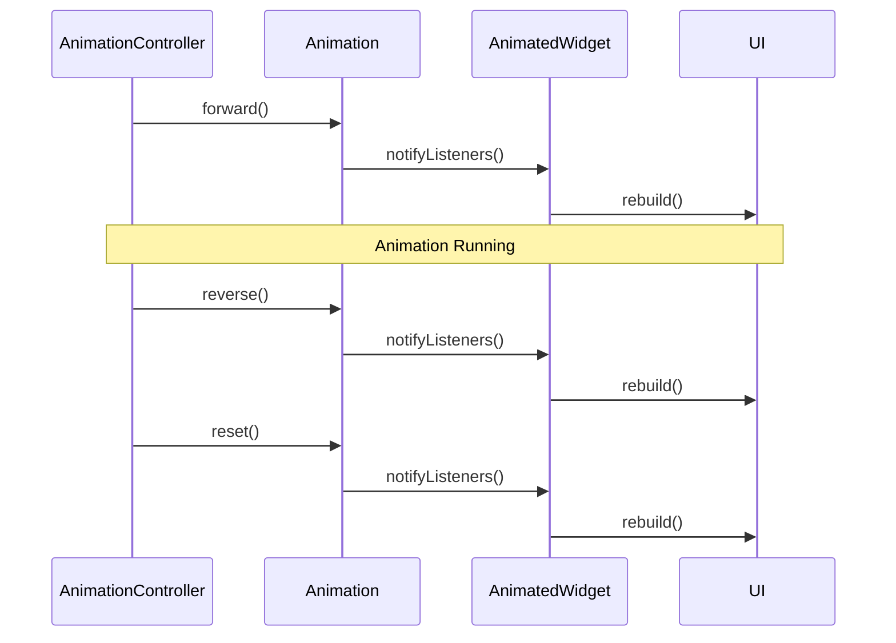

# 🎬 Flutter 动画组件深度解析：从基础到高级

> 通过丰富的图表、对比分析和实际案例，全面掌握 Flutter 动画系统的使用技巧


## 📊 文章概览

| 章节                              | 内容                 | 难度等级 |
| --------------------------------- | -------------------- | -------- |
| [基础动画组件](#基础动画组件)     | 动画控制器与基础动画 | ⭐⭐⭐   |
| [高级动画组件](#高级动画组件)     | 复杂动画效果         | ⭐⭐⭐⭐ |
| [动画曲线与插值](#动画曲线与插值) | 动画曲线系统         | ⭐⭐⭐   |
| [性能优化](#性能优化)             | 动画性能优化         | ⭐⭐⭐⭐ |
| [实际应用场景](#实际应用场景)     | 真实项目案例         | ⭐⭐⭐⭐ |

## 🎯 学习目标

- ✅ 掌握 Flutter 动画系统的核心概念
- ✅ 学会创建各种类型的动画效果
- ✅ 理解动画性能优化技巧
- ✅ 能够实现复杂的交互动画
- ✅ 掌握动画最佳实践

## 📋 目录导航

<details>
<summary>🎯 快速导航</summary>

- [基础动画组件](#基础动画组件) - 动画控制器与基础动画
- [高级动画组件](#高级动画组件) - 复杂动画效果
- [动画曲线与插值](#动画曲线与插值) - 动画曲线系统
- [性能优化](#性能优化) - 动画性能优化
- [实际应用场景](#实际应用场景) - 真实项目案例

</details>

---

## 🎬 动画系统架构

### 🏗️ Flutter 动画架构图



```mermaid
graph TD
    A[Flutter Animation System] --> B[Animation Controller]
    A --> C[Animation Objects]
    A --> D[Tween System]
    A --> E[Curve System]
    A --> F[Animated Widgets]

    B --> G[AnimationController]
    B --> H[TickerProvider]
    B --> I[Duration]
    B --> J[Status Listener]

    C --> K[Animation<T>]
    C --> L[AnimationStatus]
    C --> M[ValueNotifier]
    C --> N[ValueListenable]

    D --> O[Tween<T>]
    D --> P[ColorTween]
    D --> Q[SizeTween]
    D --> R[RectTween]
    D --> S[Custom Tween]

    E --> T[Curves.linear]
    E --> U[Curves.easeIn]
    E --> V[Curves.easeOut]
    E --> W[Curves.easeInOut]
    E --> X[Custom Curve]

    F --> Y[AnimatedBuilder]
    F --> Z[AnimatedContainer]
    F --> AA[AnimatedOpacity]
    F --> BB[Custom AnimatedWidget]
```

### 📊 动画组件特性对比

| 动画类型       | 主要用途     | 性能       | 灵活性     | 复杂度     | 适用场景         |
| -------------- | ------------ | ---------- | ---------- | ---------- | ---------------- |
| **基础动画**   | 简单属性变化 | ⭐⭐⭐⭐⭐ | ⭐⭐       | ⭐⭐       | 透明度、位置变化 |
| **补间动画**   | 数值插值动画 | ⭐⭐⭐⭐   | ⭐⭐⭐⭐   | ⭐⭐⭐     | 颜色、尺寸变化   |
| **物理动画**   | 物理效果动画 | ⭐⭐⭐     | ⭐⭐⭐⭐⭐ | ⭐⭐⭐⭐   | 弹性、阻尼效果   |
| **自定义动画** | 复杂动画效果 | ⭐⭐⭐     | ⭐⭐⭐⭐⭐ | ⭐⭐⭐⭐⭐ | 特殊动画需求     |
| **隐式动画**   | 自动动画     | ⭐⭐⭐⭐   | ⭐⭐⭐     | ⭐⭐       | 属性变化动画     |

### 动画生命周期



## 🎯 基础动画组件

### 1. 基础动画控制器

```dart
class BasicAnimationWidget extends StatefulWidget {
  final Widget child;
  final Duration duration;
  final Curve curve;
  final bool autoStart;

  const BasicAnimationWidget({
    Key? key,
    required this.child,
    this.duration = const Duration(milliseconds: 300),
    this.curve = Curves.easeInOut,
    this.autoStart = true,
  }) : super(key: key);

  @override
  State<BasicAnimationWidget> createState() => _BasicAnimationWidgetState();
}

class _BasicAnimationWidgetState extends State<BasicAnimationWidget>
    with SingleTickerProviderStateMixin {
  late AnimationController _controller;
  late Animation<double> _animation;

  @override
  void initState() {
    super.initState();

    // 创建动画控制器
    _controller = AnimationController(
      duration: widget.duration,
      vsync: this,
    );

    // 创建动画
    _animation = CurvedAnimation(
      parent: _controller,
      curve: widget.curve,
    );

    // 监听动画状态
    _controller.addStatusListener((status) {
      switch (status) {
        case AnimationStatus.completed:
          print('动画完成');
          break;
        case AnimationStatus.dismissed:
          print('动画重置');
          break;
        case AnimationStatus.forward:
          print('动画开始');
          break;
        case AnimationStatus.reverse:
          print('动画反向');
          break;
      }
    });

    // 自动开始动画
    if (widget.autoStart) {
      _controller.forward();
    }
  }

  @override
  void dispose() {
    _controller.dispose();
    super.dispose();
  }

  @override
  Widget build(BuildContext context) {
    return AnimatedBuilder(
      animation: _animation,
      builder: (context, child) {
        return Transform.scale(
          scale: _animation.value,
          child: widget.child,
        );
      },
    );
  }

  // 公共方法
  void start() => _controller.forward();
  void reverse() => _controller.reverse();
  void reset() => _controller.reset();
  void stop() => _controller.stop();
}
```

### 2. 多属性动画组件

```dart
class MultiPropertyAnimation extends StatefulWidget {
  final Widget child;
  final Duration duration;
  final double? scale;
  final double? rotation;
  final Offset? translation;
  final double? opacity;
  final Color? color;

  const MultiPropertyAnimation({
    Key? key,
    required this.child,
    this.duration = const Duration(milliseconds: 500),
    this.scale,
    this.rotation,
    this.translation,
    this.opacity,
    this.color,
  }) : super(key: key);

  @override
  State<MultiPropertyAnimation> createState() => _MultiPropertyAnimationState();
}

class _MultiPropertyAnimationState extends State<MultiPropertyAnimation>
    with SingleTickerProviderStateMixin {
  late AnimationController _controller;
  late Animation<double> _scaleAnimation;
  late Animation<double> _rotationAnimation;
  late Animation<Offset> _translationAnimation;
  late Animation<double> _opacityAnimation;
  late Animation<Color?> _colorAnimation;

  @override
  void initState() {
    super.initState();

    _controller = AnimationController(
      duration: widget.duration,
      vsync: this,
    );

    // 创建各种属性动画
    _scaleAnimation = Tween<double>(
      begin: 1.0,
      end: widget.scale ?? 1.0,
    ).animate(CurvedAnimation(
      parent: _controller,
      curve: Curves.elasticOut,
    ));

    _rotationAnimation = Tween<double>(
      begin: 0.0,
      end: widget.rotation ?? 0.0,
    ).animate(CurvedAnimation(
      parent: _controller,
      curve: Curves.easeInOut,
    ));

    _translationAnimation = Tween<Offset>(
      begin: Offset.zero,
      end: widget.translation ?? Offset.zero,
    ).animate(CurvedAnimation(
      parent: _controller,
      curve: Curves.bounceOut,
    ));

    _opacityAnimation = Tween<double>(
      begin: 1.0,
      end: widget.opacity ?? 1.0,
    ).animate(CurvedAnimation(
      parent: _controller,
      curve: Curves.easeInOut,
    ));

    _colorAnimation = ColorTween(
      begin: Colors.transparent,
      end: widget.color,
    ).animate(CurvedAnimation(
      parent: _controller,
      curve: Curves.easeInOut,
    ));

    _controller.forward();
  }

  @override
  void dispose() {
    _controller.dispose();
    super.dispose();
  }

  @override
  Widget build(BuildContext context) {
    return AnimatedBuilder(
      animation: _controller,
      builder: (context, child) {
        return Transform(
          alignment: Alignment.center,
          transform: Matrix4.identity()
            ..translate(_translationAnimation.value.dx, _translationAnimation.value.dy)
            ..scale(_scaleAnimation.value)
            ..rotateZ(_rotationAnimation.value),
          child: Opacity(
            opacity: _opacityAnimation.value,
            child: Container(
              color: _colorAnimation.value,
              child: widget.child,
            ),
          ),
        );
      },
    );
  }
}
```

## 🌊 高级动画效果

### 1. 波浪动画

```dart
class WaveAnimation extends StatefulWidget {
  final double height;
  final Color color;
  final Duration duration;

  const WaveAnimation({
    Key? key,
    this.height = 100,
    this.color = Colors.blue,
    this.duration = const Duration(seconds: 2),
  }) : super(key: key);

  @override
  State<WaveAnimation> createState() => _WaveAnimationState();
}

class _WaveAnimationState extends State<WaveAnimation>
    with SingleTickerProviderStateMixin {
  late AnimationController _controller;

  @override
  void initState() {
    super.initState();
    _controller = AnimationController(
      duration: widget.duration,
      vsync: this,
    )..repeat();
  }

  @override
  void dispose() {
    _controller.dispose();
    super.dispose();
  }

  @override
  Widget build(BuildContext context) {
    return AnimatedBuilder(
      animation: _controller,
      builder: (context, child) {
        return CustomPaint(
          size: Size(double.infinity, widget.height),
          painter: WavePainter(
            animationValue: _controller.value,
            color: widget.color,
          ),
        );
      },
    );
  }
}

class WavePainter extends CustomPainter {
  final double animationValue;
  final Color color;

  WavePainter({
    required this.animationValue,
    required this.color,
  });

  @override
  void paint(Canvas canvas, Size size) {
    final paint = Paint()
      ..color = color
      ..style = PaintingStyle.fill;

    final path = Path();

    // 创建波浪路径
    path.moveTo(0, size.height * 0.5);

    for (double x = 0; x <= size.width; x++) {
      final y = size.height * 0.5 +
          sin((x / size.width * 2 * pi) + (animationValue * 2 * pi)) * 20;
      path.lineTo(x, y);
    }

    path.lineTo(size.width, size.height);
    path.lineTo(0, size.height);
    path.close();

    canvas.drawPath(path, paint);
  }

  @override
  bool shouldRepaint(covariant CustomPainter oldDelegate) {
    return true;
  }
}
```

### 2. 粒子动画系统

```dart
class ParticleSystem extends StatefulWidget {
  final int particleCount;
  final Color particleColor;
  final double particleSize;
  final Duration duration;

  const ParticleSystem({
    Key? key,
    this.particleCount = 50,
    this.particleColor = Colors.white,
    this.particleSize = 3.0,
    this.duration = const Duration(seconds: 3),
  }) : super(key: key);

  @override
  State<ParticleSystem> createState() => _ParticleSystemState();
}

class _ParticleSystemState extends State<ParticleSystem>
    with SingleTickerProviderStateMixin {
  late AnimationController _controller;
  late List<Particle> _particles;

  @override
  void initState() {
    super.initState();

    _controller = AnimationController(
      duration: widget.duration,
      vsync: this,
    )..repeat();

    _initializeParticles();
  }

  void _initializeParticles() {
    _particles = List.generate(widget.particleCount, (index) {
      return Particle(
        x: Random().nextDouble(),
        y: Random().nextDouble(),
        vx: (Random().nextDouble() - 0.5) * 0.02,
        vy: (Random().nextDouble() - 0.5) * 0.02,
        life: Random().nextDouble(),
        maxLife: Random().nextDouble() * 2 + 1,
      );
    });
  }

  @override
  void dispose() {
    _controller.dispose();
    super.dispose();
  }

  @override
  Widget build(BuildContext context) {
    return AnimatedBuilder(
      animation: _controller,
      builder: (context, child) {
        _updateParticles();
        return CustomPaint(
          size: Size.infinite,
          painter: ParticlePainter(
            particles: _particles,
            color: widget.particleColor,
            size: widget.particleSize,
          ),
        );
      },
    );
  }

  void _updateParticles() {
    for (var particle in _particles) {
      particle.update();

      // 重置超出边界的粒子
      if (particle.x < 0 || particle.x > 1 ||
          particle.y < 0 || particle.y > 1 ||
          particle.life <= 0) {
        particle.reset();
      }
    }
  }
}

class Particle {
  double x, y;
  double vx, vy;
  double life, maxLife;

  Particle({
    required this.x,
    required this.y,
    required this.vx,
    required this.vy,
    required this.life,
    required this.maxLife,
  });

  void update() {
    x += vx;
    y += vy;
    life -= 0.01;
  }

  void reset() {
    x = Random().nextDouble();
    y = Random().nextDouble();
    vx = (Random().nextDouble() - 0.5) * 0.02;
    vy = (Random().nextDouble() - 0.5) * 0.02;
    life = maxLife;
  }

  double get opacity => (life / maxLife).clamp(0.0, 1.0);
}

class ParticlePainter extends CustomPainter {
  final List<Particle> particles;
  final Color color;
  final double size;

  ParticlePainter({
    required this.particles,
    required this.color,
    required this.size,
  });

  @override
  void paint(Canvas canvas, Size canvasSize) {
    for (var particle in particles) {
      final paint = Paint()
        ..color = color.withOpacity(particle.opacity)
        ..style = PaintingStyle.fill;

      canvas.drawCircle(
        Offset(
          particle.x * canvasSize.width,
          particle.y * canvasSize.height,
        ),
        size,
        paint,
      );
    }
  }

  @override
  bool shouldRepaint(covariant CustomPainter oldDelegate) {
    return true;
  }
}
```

## 🎪 页面转场动画

### 1. 自定义页面路由动画

```dart
class CustomPageRoute<T> extends PageRouteBuilder<T> {
  final Widget child;
  final PageTransitionType transitionType;
  final Duration duration;

  CustomPageRoute({
    required this.child,
    this.transitionType = PageTransitionType.slideRight,
    this.duration = const Duration(milliseconds: 300),
  }) : super(
    pageBuilder: (context, animation, secondaryAnimation) => child,
    transitionDuration: duration,
    transitionsBuilder: (context, animation, secondaryAnimation, child) {
      return _buildTransition(
        animation,
        secondaryAnimation,
        child,
        transitionType,
      );
    },
  );

  static Widget _buildTransition(
    Animation<double> animation,
    Animation<double> secondaryAnimation,
    Widget child,
    PageTransitionType type,
  ) {
    switch (type) {
      case PageTransitionType.slideRight:
        return SlideTransition(
          position: Tween<Offset>(
            begin: const Offset(1.0, 0.0),
            end: Offset.zero,
          ).animate(CurvedAnimation(
            parent: animation,
            curve: Curves.easeInOut,
          )),
          child: child,
        );

      case PageTransitionType.slideLeft:
        return SlideTransition(
          position: Tween<Offset>(
            begin: const Offset(-1.0, 0.0),
            end: Offset.zero,
          ).animate(CurvedAnimation(
            parent: animation,
            curve: Curves.easeInOut,
          )),
          child: child,
        );

      case PageTransitionType.slideUp:
        return SlideTransition(
          position: Tween<Offset>(
            begin: const Offset(0.0, 1.0),
            end: Offset.zero,
          ).animate(CurvedAnimation(
            parent: animation,
            curve: Curves.easeInOut,
          )),
          child: child,
        );

      case PageTransitionType.fade:
        return FadeTransition(
          opacity: animation,
          child: child,
        );

      case PageTransitionType.scale:
        return ScaleTransition(
          scale: Tween<double>(
            begin: 0.0,
            end: 1.0,
          ).animate(CurvedAnimation(
            parent: animation,
            curve: Curves.elasticOut,
          )),
          child: child,
        );

      case PageTransitionType.rotation:
        return RotationTransition(
          turns: Tween<double>(
            begin: 0.0,
            end: 1.0,
          ).animate(CurvedAnimation(
            parent: animation,
            curve: Curves.easeInOut,
          )),
          child: FadeTransition(
            opacity: animation,
            child: child,
          ),
        );

      case PageTransitionType.custom:
        return _buildCustomTransition(animation, secondaryAnimation, child);
    }
  }

  static Widget _buildCustomTransition(
    Animation<double> animation,
    Animation<double> secondaryAnimation,
    Widget child,
  ) {
    return AnimatedBuilder(
      animation: animation,
      builder: (context, child) {
        return Transform(
          alignment: Alignment.center,
          transform: Matrix4.identity()
            ..setEntry(3, 2, 0.001)
            ..rotateY(animation.value * pi),
          child: animation.value <= 0.5
              ? Container()
              : child,
        );
      },
      child: child,
    );
  }
}

enum PageTransitionType {
  slideRight,
  slideLeft,
  slideUp,
  fade,
  scale,
  rotation,
  custom,
}
```

### 2. Hero 动画增强

```dart
class EnhancedHero extends StatelessWidget {
  final String tag;
  final Widget child;
  final Duration duration;
  final Curve curve;
  final Widget Function(BuildContext, Size, Widget)? flightShuttleBuilder;

  const EnhancedHero({
    Key? key,
    required this.tag,
    required this.child,
    this.duration = const Duration(milliseconds: 300),
    this.curve = Curves.easeInOut,
    this.flightShuttleBuilder,
  }) : super(key: key);

  @override
  Widget build(BuildContext context) {
    return Hero(
      tag: tag,
      transitionOnUserGestures: true,
      flightShuttleBuilder: flightShuttleBuilder ?? _defaultFlightShuttleBuilder,
      child: child,
    );
  }

  Widget _defaultFlightShuttleBuilder(
    BuildContext flightContext,
    Animation<double> animation,
    HeroFlightDirection flightDirection,
    BuildContext fromHeroContext,
    BuildContext toHeroContext,
  ) {
    return AnimatedBuilder(
      animation: animation,
      builder: (context, child) {
        return Transform.scale(
          scale: 1.0 + (animation.value * 0.1),
          child: Material(
            color: Colors.transparent,
            child: toHeroContext.widget,
          ),
        );
      },
    );
  }
}
```

## 🎨 实战案例：加载动画组件

```dart
class LoadingAnimations {
  // 1. 旋转加载动画
  static Widget spinningLoader({
    double size = 40,
    Color color = Colors.blue,
    double strokeWidth = 4,
  }) {
    return SizedBox(
      width: size,
      height: size,
      child: CircularProgressIndicator(
        strokeWidth: strokeWidth,
        valueColor: AlwaysStoppedAnimation<Color>(color),
      ),
    );
  }

  // 2. 脉冲加载动画
  static Widget pulseLoader({
    double size = 40,
    Color color = Colors.blue,
    Duration duration = const Duration(milliseconds: 1000),
  }) {
    return _PulseLoader(
      size: size,
      color: color,
      duration: duration,
    );
  }

  // 3. 波点加载动画
  static Widget dotsLoader({
    double size = 40,
    Color color = Colors.blue,
    Duration duration = const Duration(milliseconds: 1200),
  }) {
    return _DotsLoader(
      size: size,
      color: color,
      duration: duration,
    );
  }

  // 4. 波浪加载动画
  static Widget waveLoader({
    double width = 100,
    double height = 40,
    Color color = Colors.blue,
    Duration duration = const Duration(milliseconds: 1500),
  }) {
    return _WaveLoader(
      width: width,
      height: height,
      color: color,
      duration: duration,
    );
  }
}

class _PulseLoader extends StatefulWidget {
  final double size;
  final Color color;
  final Duration duration;

  const _PulseLoader({
    required this.size,
    required this.color,
    required this.duration,
  });

  @override
  State<_PulseLoader> createState() => _PulseLoaderState();
}

class _PulseLoaderState extends State<_PulseLoader>
    with SingleTickerProviderStateMixin {
  late AnimationController _controller;
  late Animation<double> _animation;

  @override
  void initState() {
    super.initState();
    _controller = AnimationController(
      duration: widget.duration,
      vsync: this,
    )..repeat(reverse: true);

    _animation = Tween<double>(
      begin: 0.5,
      end: 1.0,
    ).animate(CurvedAnimation(
      parent: _controller,
      curve: Curves.easeInOut,
    ));
  }

  @override
  void dispose() {
    _controller.dispose();
    super.dispose();
  }

  @override
  Widget build(BuildContext context) {
    return AnimatedBuilder(
      animation: _animation,
      builder: (context, child) {
        return Container(
          width: widget.size,
          height: widget.size,
          decoration: BoxDecoration(
            shape: BoxShape.circle,
            color: widget.color.withOpacity(_animation.value),
          ),
        );
      },
    );
  }
}

class _DotsLoader extends StatefulWidget {
  final double size;
  final Color color;
  final Duration duration;

  const _DotsLoader({
    required this.size,
    required this.color,
    required this.duration,
  });

  @override
  State<_DotsLoader> createState() => _DotsLoaderState();
}

class _DotsLoaderState extends State<_DotsLoader>
    with SingleTickerProviderStateMixin {
  late AnimationController _controller;

  @override
  void initState() {
    super.initState();
    _controller = AnimationController(
      duration: widget.duration,
      vsync: this,
    )..repeat();
  }

  @override
  void dispose() {
    _controller.dispose();
    super.dispose();
  }

  @override
  Widget build(BuildContext context) {
    return SizedBox(
      width: widget.size,
      height: widget.size / 4,
      child: Row(
        mainAxisAlignment: MainAxisAlignment.spaceEvenly,
        children: List.generate(3, (index) {
          return AnimatedBuilder(
            animation: _controller,
            builder: (context, child) {
              final delay = index * 0.2;
              final animationValue = (_controller.value - delay) % 1.0;
              final scale = sin(animationValue * pi).abs();

              return Transform.scale(
                scale: 0.5 + scale * 0.5,
                child: Container(
                  width: widget.size / 6,
                  height: widget.size / 6,
                  decoration: BoxDecoration(
                    shape: BoxShape.circle,
                    color: widget.color,
                  ),
                ),
              );
            },
          );
        }),
      ),
    );
  }
}
```

## ⚡ 性能优化技巧

### 1. 动画性能优化原则

```dart
// ✅ 正确：使用RepaintBoundary隔离重绘
Widget build(BuildContext context) {
  return Column(
    children: [
      RepaintBoundary(
        child: AnimatedWidget(), // 动画组件
      ),
      StaticWidget(), // 静态组件
    ],
  );
}

// ✅ 正确：使用Transform而非改变布局
Transform.translate(
  offset: Offset(animation.value, 0),
  child: child,
)

// ❌ 错误：改变布局属性
Padding(
  padding: EdgeInsets.only(left: animation.value),
  child: child,
)
```

### 2. 内存管理

```dart
class OptimizedAnimationWidget extends StatefulWidget {
  @override
  State<OptimizedAnimationWidget> createState() => _OptimizedAnimationWidgetState();
}

class _OptimizedAnimationWidgetState extends State<OptimizedAnimationWidget>
    with SingleTickerProviderStateMixin {
  late AnimationController _controller;

  @override
  void initState() {
    super.initState();
    _controller = AnimationController(
      duration: const Duration(milliseconds: 300),
      vsync: this,
    );
  }

  @override
  void dispose() {
    // 重要：清理动画控制器
    _controller.dispose();
    super.dispose();
  }

  @override
  Widget build(BuildContext context) {
    return AnimatedBuilder(
      animation: _controller,
      // 使用builder避免不必要的重建
      builder: (context, child) {
        return Transform.scale(
          scale: _controller.value,
          child: child,
        );
      },
      child: const ExpensiveWidget(), // 昂贵的子组件
    );
  }
}
```

### 3. 动画调试工具

```dart
class AnimationDebugger {
  static void enableDebugMode() {
    // 启用动画调试
    debugPaintSizeEnabled = true;

    // 显示重绘边界
    debugRepaintRainbowEnabled = true;

    // 慢动画模式
    timeDilation = 2.0;
  }

  static void logAnimationPerformance(
    AnimationController controller,
    String animationName,
  ) {
    controller.addListener(() {
      print('$animationName: ${controller.value}');
    });

    controller.addStatusListener((status) {
      print('$animationName status: $status');
    });
  }
}
```

## 📚 最佳实践总结

### 1. 动画设计原则

- **自然性**：模拟真实世界的物理运动
- **一致性**：保持应用内动画风格统一
- **目的性**：每个动画都应有明确目的
- **性能**：优先考虑 60fps 流畅度

### 2. 常用动画时长参考

```dart
class AnimationDurations {
  static const Duration micro = Duration(milliseconds: 75);
  static const Duration short = Duration(milliseconds: 150);
  static const Duration medium = Duration(milliseconds: 300);
  static const Duration long = Duration(milliseconds: 500);
  static const Duration extraLong = Duration(milliseconds: 700);
}
```

### 3. 动画曲线选择指南

```dart
class AnimationCurves {
  // 进入动画
  static const Curve enter = Curves.easeOut;

  // 退出动画
  static const Curve exit = Curves.easeIn;

  // 强调动画
  static const Curve emphasis = Curves.elasticOut;

  // 标准动画
  static const Curve standard = Curves.easeInOut;

  // 快速动画
  static const Curve quick = Curves.easeInQuad;
}
```
