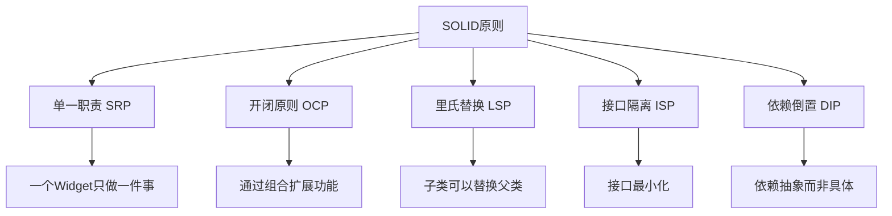

# 🎨 Flutter 自定义组件深度解析：从基础到高级

[](https://flutter.dev/)
[](https://dart.dev/)
[](LICENSE)

> 学会创建可复用、高性能的自定义 Widget，掌握组件设计原则和最佳实践

## 📊 文章概览

| 章节                                                                    | 内容               | 难度等级   |
| ----------------------------------------------------------------------- | ------------------ | ---------- |
| [自定义组件设计原则](#自定义组件设计原则)                               | SOLID 原则应用     | ⭐⭐⭐⭐   |
| [StatelessWidget vs StatefulWidget](#statelesswidget-vs-statefulwidget) | 组件类型选择       | ⭐⭐⭐     |
| [自定义绘制组件](#自定义绘制组件)                                       | CustomPainter 使用 | ⭐⭐⭐⭐⭐ |
| [组合式组件设计](#组合式组件设计)                                       | 组件组合模式       | ⭐⭐⭐⭐   |
| [性能优化技巧](#性能优化技巧)                                           | 性能优化策略       | ⭐⭐⭐⭐   |
| [实际应用场景](#实际应用场景)                                           | 真实项目案例       | ⭐⭐⭐⭐   |

## 🎯 学习目标

- ✅ 掌握 SOLID 原则在 Widget 设计中的应用
- ✅ 学会选择合适的 Widget 类型和生命周期管理
- ✅ 理解自定义绘制组件的实现原理
- ✅ 能够设计可复用和高性能的自定义组件
- ✅ 掌握组件性能优化和最佳实践

## 📋 目录导航

<details>
<summary>🎯 快速导航</summary>

- [自定义组件设计原则](#自定义组件设计原则) - SOLID 原则应用
- [StatelessWidget vs StatefulWidget](#statelesswidget-vs-statefulwidget) - 组件类型选择
- [自定义绘制组件](#自定义绘制组件) - CustomPainter 使用
- [组合式组件设计](#组合式组件设计) - 组件组合模式
- [性能优化技巧](#性能优化技巧) - 性能优化策略
- [实际应用场景](#实际应用场景) - 真实项目案例

</details>

---

## 📋 概述

本文档详细介绍 Flutter 中自定义组件的设计原则、实现方法和最佳实践。通过掌握自定义组件的开发技巧，可以创建出可复用、高性能的 UI 组件，提升开发效率和代码质量。

## 🎨 自定义组件设计原则

### SOLID 原则在 Widget 中的应用



### 📊 组件设计原则对比

| 原则         | 含义                   | 应用场景     | 实现方式 |
| ------------ | ---------------------- | ------------ | -------- |
| **单一职责** | 一个组件只负责一个功能 | 按钮、输入框 | 功能拆分 |
| **开闭原则** | 对扩展开放，对修改封闭 | 主题系统     | 组合模式 |
| **里氏替换** | 子类可以替换父类       | 继承体系     | 接口设计 |
| **接口隔离** | 接口最小化             | 回调函数     | 参数精简 |
| **依赖倒置** | 依赖抽象而非具体       | 依赖注入     | 抽象类   |

## 🏗️ StatelessWidget vs StatefulWidget

### 选择指南

| 场景     | 推荐类型        | 原因                     |
| -------- | --------------- | ------------------------ |
| 静态展示 | StatelessWidget | 性能更好，无状态管理开销 |
| 用户交互 | StatefulWidget  | 需要响应状态变化         |
| 动画效果 | StatefulWidget  | 需要 AnimationController |
| 表单输入 | StatefulWidget  | 需要管理输入状态         |

### StatelessWidget 最佳实践

```dart
class CustomButton extends StatelessWidget {
  // 使用final确保不可变性
  final String text;
  final VoidCallback? onPressed;
  final ButtonStyle? style;
  final Widget? icon;

  // 使用const构造函数提升性能
  const CustomButton({
    Key? key,
    required this.text,
    this.onPressed,
    this.style,
    this.icon,
  }) : super(key: key);

  @override
  Widget build(BuildContext context) {
    // 根据是否有图标选择不同的按钮类型
    if (icon != null) {
      return ElevatedButton.icon(
        onPressed: onPressed,
        icon: icon!,
        label: Text(text),
        style: style ?? _defaultStyle(context),
      );
    }

    return ElevatedButton(
      onPressed: onPressed,
      style: style ?? _defaultStyle(context),
      child: Text(text),
    );
  }

  // 提取默认样式为私有方法
  ButtonStyle _defaultStyle(BuildContext context) {
    return ElevatedButton.styleFrom(
      padding: EdgeInsets.symmetric(horizontal: 24, vertical: 12),
      shape: RoundedRectangleBorder(
        borderRadius: BorderRadius.circular(8),
      ),
    );
  }
}
```

### StatefulWidget 生命周期管理

```dart
class AnimatedCounter extends StatefulWidget {
  final int initialValue;
  final Duration animationDuration;
  final VoidCallback? onComplete;

  const AnimatedCounter({
    Key? key,
    this.initialValue = 0,
    this.animationDuration = const Duration(milliseconds: 500),
    this.onComplete,
  }) : super(key: key);

  @override
  State<AnimatedCounter> createState() => _AnimatedCounterState();
}

class _AnimatedCounterState extends State<AnimatedCounter>
    with SingleTickerProviderStateMixin {
  late AnimationController _controller;
  late Animation<double> _animation;
  int _currentValue = 0;

  @override
  void initState() {
    super.initState();
    _currentValue = widget.initialValue;

    // 初始化动画控制器
    _controller = AnimationController(
      duration: widget.animationDuration,
      vsync: this,
    );

    // 创建动画
    _animation = Tween<double>(
      begin: 0.0,
      end: 1.0,
    ).animate(CurvedAnimation(
      parent: _controller,
      curve: Curves.easeInOut,
    ));

    // 监听动画完成
    _controller.addStatusListener((status) {
      if (status == AnimationStatus.completed) {
        widget.onComplete?.call();
      }
    });
  }

  @override
  void didUpdateWidget(AnimatedCounter oldWidget) {
    super.didUpdateWidget(oldWidget);

    // 响应外部属性变化
    if (widget.initialValue != oldWidget.initialValue) {
      _updateValue(widget.initialValue);
    }
  }

  @override
  void dispose() {
    // 清理资源
    _controller.dispose();
    super.dispose();
  }

  void _updateValue(int newValue) {
    setState(() {
      _currentValue = newValue;
    });
    _controller.forward(from: 0);
  }

  @override
  Widget build(BuildContext context) {
    return AnimatedBuilder(
      animation: _animation,
      builder: (context, child) {
        return Transform.scale(
          scale: 1.0 + (_animation.value * 0.2),
          child: Text(
            '$_currentValue',
            style: TextStyle(
              fontSize: 48,
              fontWeight: FontWeight.bold,
              color: Color.lerp(
                Colors.blue,
                Colors.red,
                _animation.value,
              ),
            ),
          ),
        );
      },
    );
  }
}
```

## 🎭 组合模式 vs 继承模式

### 组合模式（推荐）

```dart
// 通过组合创建复杂组件
class ProfileCard extends StatelessWidget {
  final User user;
  final VoidCallback? onTap;
  final bool showBadge;

  const ProfileCard({
    Key? key,
    required this.user,
    this.onTap,
    this.showBadge = false,
  }) : super(key: key);

  @override
  Widget build(BuildContext context) {
    return Card(
      child: InkWell(
        onTap: onTap,
        child: Padding(
          padding: EdgeInsets.all(16),
          child: Row(
            children: [
              _buildAvatar(),
              SizedBox(width: 16),
              Expanded(child: _buildUserInfo()),
              if (showBadge) _buildBadge(),
            ],
          ),
        ),
      ),
    );
  }

  Widget _buildAvatar() {
    return CircleAvatar(
      radius: 30,
      backgroundImage: user.avatarUrl.isNotEmpty
          ? NetworkImage(user.avatarUrl)
          : null,
      child: user.avatarUrl.isEmpty
          ? Icon(Icons.person)
          : null,
    );
  }

  Widget _buildUserInfo() {
    return Column(
      crossAxisAlignment: CrossAxisAlignment.start,
      children: [
        Text(
          user.name,
          style: TextStyle(
            fontSize: 18,
            fontWeight: FontWeight.bold,
          ),
        ),
        SizedBox(height: 4),
        Text(
          user.email,
          style: TextStyle(
            color: Colors.grey[600],
          ),
        ),
      ],
    );
  }

  Widget _buildBadge() {
    return Container(
      padding: EdgeInsets.symmetric(horizontal: 8, vertical: 4),
      decoration: BoxDecoration(
        color: Colors.green,
        borderRadius: BorderRadius.circular(12),
      ),
      child: Text(
        'VIP',
        style: TextStyle(
          color: Colors.white,
          fontSize: 12,
          fontWeight: FontWeight.bold,
        ),
      ),
    );
  }
}
```

### 继承模式（谨慎使用）

```dart
// 基础按钮类
abstract class BaseButton extends StatelessWidget {
  final String text;
  final VoidCallback? onPressed;

  const BaseButton({
    Key? key,
    required this.text,
    this.onPressed,
  }) : super(key: key);

  // 抽象方法，子类必须实现
  ButtonStyle getButtonStyle(BuildContext context);

  @override
  Widget build(BuildContext context) {
    return ElevatedButton(
      onPressed: onPressed,
      style: getButtonStyle(context),
      child: Text(text),
    );
  }
}

// 主要按钮
class PrimaryButton extends BaseButton {
  const PrimaryButton({
    Key? key,
    required String text,
    VoidCallback? onPressed,
  }) : super(key: key, text: text, onPressed: onPressed);

  @override
  ButtonStyle getButtonStyle(BuildContext context) {
    return ElevatedButton.styleFrom(
      backgroundColor: Theme.of(context).primaryColor,
      foregroundColor: Colors.white,
    );
  }
}

// 次要按钮
class SecondaryButton extends BaseButton {
  const SecondaryButton({
    Key? key,
    required String text,
    VoidCallback? onPressed,
  }) : super(key: key, text: text, onPressed: onPressed);

  @override
  ButtonStyle getButtonStyle(BuildContext context) {
    return ElevatedButton.styleFrom(
      backgroundColor: Colors.grey[300],
      foregroundColor: Colors.black87,
    );
  }
}
```

## 🎨 自定义绘制组件

### CustomPainter 基础

```dart
class CircularProgressPainter extends CustomPainter {
  final double progress;
  final Color backgroundColor;
  final Color progressColor;
  final double strokeWidth;

  CircularProgressPainter({
    required this.progress,
    this.backgroundColor = Colors.grey,
    this.progressColor = Colors.blue,
    this.strokeWidth = 8.0,
  });

  @override
  void paint(Canvas canvas, Size size) {
    final center = Offset(size.width / 2, size.height / 2);
    final radius = (size.width - strokeWidth) / 2;

    // 绘制背景圆环
    final backgroundPaint = Paint()
      ..color = backgroundColor
      ..strokeWidth = strokeWidth
      ..style = PaintingStyle.stroke
      ..strokeCap = StrokeCap.round;

    canvas.drawCircle(center, radius, backgroundPaint);

    // 绘制进度圆弧
    final progressPaint = Paint()
      ..color = progressColor
      ..strokeWidth = strokeWidth
      ..style = PaintingStyle.stroke
      ..strokeCap = StrokeCap.round;

    final sweepAngle = 2 * math.pi * progress;
    canvas.drawArc(
      Rect.fromCircle(center: center, radius: radius),
      -math.pi / 2, // 从顶部开始
      sweepAngle,
      false,
      progressPaint,
    );
  }

  @override
  bool shouldRepaint(CircularProgressPainter oldDelegate) {
    return oldDelegate.progress != progress ||
           oldDelegate.backgroundColor != backgroundColor ||
           oldDelegate.progressColor != progressColor ||
           oldDelegate.strokeWidth != strokeWidth;
  }
}

// 使用自定义绘制组件
class CircularProgressIndicator extends StatelessWidget {
  final double progress;
  final double size;
  final Color? backgroundColor;
  final Color? progressColor;

  const CircularProgressIndicator({
    Key? key,
    required this.progress,
    this.size = 100,
    this.backgroundColor,
    this.progressColor,
  }) : super(key: key);

  @override
  Widget build(BuildContext context) {
    return SizedBox(
      width: size,
      height: size,
      child: CustomPaint(
        painter: CircularProgressPainter(
          progress: progress.clamp(0.0, 1.0),
          backgroundColor: backgroundColor ?? Colors.grey[300]!,
          progressColor: progressColor ?? Theme.of(context).primaryColor,
        ),
        child: Center(
          child: Text(
            '${(progress * 100).toInt()}%',
            style: TextStyle(
              fontSize: size * 0.15,
              fontWeight: FontWeight.bold,
            ),
          ),
        ),
      ),
    );
  }
}
```

## 🔧 组件配置与主题

### 主题感知组件

```dart
class ThemedCard extends StatelessWidget {
  final Widget child;
  final EdgeInsetsGeometry? padding;
  final VoidCallback? onTap;

  const ThemedCard({
    Key? key,
    required this.child,
    this.padding,
    this.onTap,
  }) : super(key: key);

  @override
  Widget build(BuildContext context) {
    final theme = Theme.of(context);
    final isDark = theme.brightness == Brightness.dark;

    return Card(
      elevation: isDark ? 8 : 4,
      color: isDark ? theme.cardColor : Colors.white,
      shape: RoundedRectangleBorder(
        borderRadius: BorderRadius.circular(12),
        side: BorderSide(
          color: isDark ? Colors.grey[700]! : Colors.grey[200]!,
          width: 1,
        ),
      ),
      child: InkWell(
        onTap: onTap,
        borderRadius: BorderRadius.circular(12),
        child: Padding(
          padding: padding ?? EdgeInsets.all(16),
          child: child,
        ),
      ),
    );
  }
}
```

### 可配置组件

```dart
class ConfigurableButton extends StatelessWidget {
  final String text;
  final VoidCallback? onPressed;
  final ButtonConfig config;

  const ConfigurableButton({
    Key? key,
    required this.text,
    this.onPressed,
    this.config = const ButtonConfig(),
  }) : super(key: key);

  @override
  Widget build(BuildContext context) {
    return ElevatedButton(
      onPressed: onPressed,
      style: ElevatedButton.styleFrom(
        backgroundColor: config.backgroundColor,
        foregroundColor: config.textColor,
        padding: config.padding,
        shape: RoundedRectangleBorder(
          borderRadius: BorderRadius.circular(config.borderRadius),
        ),
        elevation: config.elevation,
      ),
      child: Text(
        text,
        style: TextStyle(
          fontSize: config.fontSize,
          fontWeight: config.fontWeight,
        ),
      ),
    );
  }
}

class ButtonConfig {
  final Color? backgroundColor;
  final Color? textColor;
  final EdgeInsetsGeometry padding;
  final double borderRadius;
  final double elevation;
  final double fontSize;
  final FontWeight fontWeight;

  const ButtonConfig({
    this.backgroundColor,
    this.textColor,
    this.padding = const EdgeInsets.symmetric(horizontal: 24, vertical: 12),
    this.borderRadius = 8.0,
    this.elevation = 2.0,
    this.fontSize = 16.0,
    this.fontWeight = FontWeight.w600,
  });

  // 预定义配置
  static const primary = ButtonConfig(
    backgroundColor: Colors.blue,
    textColor: Colors.white,
    elevation: 4.0,
  );

  static const secondary = ButtonConfig(
    backgroundColor: Colors.grey,
    textColor: Colors.black87,
    elevation: 1.0,
  );

  static const danger = ButtonConfig(
    backgroundColor: Colors.red,
    textColor: Colors.white,
    elevation: 3.0,
  );
}
```

## 🚀 性能优化技巧

### 1. 使用 const 构造函数

```dart
// ✅ 好的做法
class MyWidget extends StatelessWidget {
  const MyWidget({Key? key}) : super(key: key);

  @override
  Widget build(BuildContext context) {
    return const Text('Static content');
  }
}
```

### 2. 避免在 build 中创建对象

```dart
class OptimizedWidget extends StatelessWidget {
  // ✅ 在类级别定义静态对象
  static const _textStyle = TextStyle(
    fontSize: 16,
    fontWeight: FontWeight.bold,
  );

  static const _padding = EdgeInsets.all(16);

  @override
  Widget build(BuildContext context) {
    return Padding(
      padding: _padding,
      child: Text(
        'Optimized text',
        style: _textStyle,
      ),
    );
  }
}
```

### 3. 合理使用 RepaintBoundary

```dart
class ExpensiveWidget extends StatelessWidget {
  @override
  Widget build(BuildContext context) {
    return RepaintBoundary(
      child: CustomPaint(
        painter: ComplexPainter(),
        size: Size(200, 200),
      ),
    );
  }
}
```

---

**完成 UI 组件模块！** 下一步：[网络请求模块](../02-networking/README.md)
