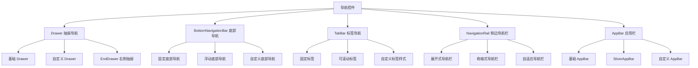

# 🗂️ Flutter Drawer 抽屉导航深度解析：从基础到高级

[](https://flutter.dev/)
[](https://dart.dev/)
[](LICENSE)

> 深入掌握 Drawer 抽屉导航及相关导航控件的使用方法，构建专业级应用导航系统

## 📊 文章概览

| 章节                                        | 内容             | 难度等级 |
| ------------------------------------------- | ---------------- | -------- |
| [Drawer 基础用法](#drawer-基础用法)         | 基础抽屉导航实现 | ⭐⭐     |
| [自定义 Drawer](#自定义-drawer)             | 自定义样式和布局 | ⭐⭐⭐   |
| [EndDrawer 右侧抽屉](#enddrawer-右侧抽屉)   | 右侧抽屉导航     | ⭐⭐⭐   |
| [BottomNavigationBar](#bottomnavigationbar) | 底部导航栏       | ⭐⭐⭐   |
| [NavigationRail](#navigationrail)           | 侧边导航栏       | ⭐⭐⭐⭐ |
| [AppBar 应用栏](#appbar-应用栏)             | 顶部应用栏       | ⭐⭐     |
| [实际应用场景](#实际应用场景)               | 真实项目案例     | ⭐⭐⭐⭐ |

## 🎯 学习目标

- ✅ 掌握 Drawer 抽屉导航的基础用法和配置
- ✅ 学会自定义 Drawer 的样式和交互效果
- ✅ 理解不同导航控件的使用场景和选择策略
- ✅ 能够实现复杂的导航系统和状态管理
- ✅ 掌握导航性能优化和最佳实践

## 📋 目录导航

<details>
<summary>🎯 快速导航</summary>

- [Drawer 基础用法](#drawer-基础用法) - 基础抽屉导航实现
- [自定义 Drawer](#自定义-drawer) - 自定义样式和布局
- [EndDrawer 右侧抽屉](#enddrawer-右侧抽屉) - 右侧抽屉导航
- [BottomNavigationBar](#bottomnavigationbar) - 底部导航栏
- [NavigationRail](#navigationrail) - 侧边导航栏
- [AppBar 应用栏](#appbar-应用栏) - 顶部应用栏
- [实际应用场景](#实际应用场景) - 真实项目案例

</details>

---

## 📋 概述

Drawer 是 Flutter 中常用的侧边导航组件，通常与 Scaffold 配合使用，为应用提供主要的导航功能。本文将详细介绍 Drawer 及相关导航控件的使用方法和最佳实践。

## 🏗️ 导航控件架构图



### 📊 导航控件特性对比

| 导航类型                | 主要用途   | 性能       | 灵活性   | 复杂度   | 适用场景       |
| ----------------------- | ---------- | ---------- | -------- | -------- | -------------- |
| **Drawer**              | 侧边导航   | ⭐⭐⭐⭐   | ⭐⭐⭐⭐ | ⭐⭐⭐   | 主要导航菜单   |
| **BottomNavigationBar** | 底部导航   | ⭐⭐⭐⭐⭐ | ⭐⭐⭐   | ⭐⭐     | 主要页面切换   |
| **TabBar**              | 标签导航   | ⭐⭐⭐⭐   | ⭐⭐⭐⭐ | ⭐⭐⭐   | 内容分类       |
| **NavigationRail**      | 侧边导航栏 | ⭐⭐⭐⭐   | ⭐⭐⭐⭐ | ⭐⭐⭐⭐ | 桌面端导航     |
| **AppBar**              | 顶部导航   | ⭐⭐⭐⭐⭐ | ⭐⭐⭐⭐ | ⭐⭐     | 页面标题和操作 |

## Drawer 基础用法

### 基本 Drawer 实现

```dart
class BasicDrawerExample extends StatelessWidget {
  @override
  Widget build(BuildContext context) {
    return Scaffold(
      appBar: AppBar(
        title: Text('基础 Drawer 示例'),
        backgroundColor: Colors.blue,
        foregroundColor: Colors.white,
      ),
      drawer: Drawer(
        child: ListView(
          padding: EdgeInsets.zero,
          children: [
            // 抽屉头部
            DrawerHeader(
              decoration: BoxDecoration(
                gradient: LinearGradient(
                  colors: [Colors.blue, Colors.blueAccent],
                  begin: Alignment.topLeft,
                  end: Alignment.bottomRight,
                ),
              ),
              child: Column(
                crossAxisAlignment: CrossAxisAlignment.start,
                children: [
                  CircleAvatar(
                    radius: 30,
                    backgroundColor: Colors.white,
                    child: Icon(
                      Icons.person,
                      size: 40,
                      color: Colors.blue,
                    ),
                  ),
                  SizedBox(height: 10),
                  Text(
                    '用户名',
                    style: TextStyle(
                      color: Colors.white,
                      fontSize: 18,
                      fontWeight: FontWeight.bold,
                    ),
                  ),
                  Text(
                    'user@example.com',
                    style: TextStyle(
                      color: Colors.white70,
                      fontSize: 14,
                    ),
                  ),
                ],
              ),
            ),

            // 导航项
            ListTile(
              leading: Icon(Icons.home),
              title: Text('首页'),
              onTap: () {
                Navigator.pop(context);
                _navigateToPage(context, '首页');
              },
            ),
            ListTile(
              leading: Icon(Icons.person),
              title: Text('个人资料'),
              onTap: () {
                Navigator.pop(context);
                _navigateToPage(context, '个人资料');
              },
            ),
            ListTile(
              leading: Icon(Icons.settings),
              title: Text('设置'),
              onTap: () {
                Navigator.pop(context);
                _navigateToPage(context, '设置');
              },
            ),
            Divider(),
            ListTile(
              leading: Icon(Icons.help),
              title: Text('帮助'),
              onTap: () {
                Navigator.pop(context);
                _showHelpDialog(context);
              },
            ),
            ListTile(
              leading: Icon(Icons.logout),
              title: Text('退出登录'),
              onTap: () {
                Navigator.pop(context);
                _showLogoutDialog(context);
              },
            ),
          ],
        ),
      ),
      body: Center(
        child: Column(
          mainAxisAlignment: MainAxisAlignment.center,
          children: [
            Icon(
              Icons.menu,
              size: 64,
              color: Colors.grey,
            ),
            SizedBox(height: 16),
            Text(
              '点击左上角菜单按钮\n打开抽屉导航',
              textAlign: TextAlign.center,
              style: TextStyle(
                fontSize: 16,
                color: Colors.grey[600],
              ),
            ),
          ],
        ),
      ),
    );
  }

  void _navigateToPage(BuildContext context, String pageName) {
    ScaffoldMessenger.of(context).showSnackBar(
      SnackBar(
        content: Text('导航到：$pageName'),
        duration: Duration(seconds: 1),
      ),
    );
  }

  void _showHelpDialog(BuildContext context) {
    showDialog(
      context: context,
      builder: (context) => AlertDialog(
        title: Text('帮助'),
        content: Text('这是帮助信息'),
        actions: [
          TextButton(
            onPressed: () => Navigator.pop(context),
            child: Text('确定'),
          ),
        ],
      ),
    );
  }

  void _showLogoutDialog(BuildContext context) {
    showDialog(
      context: context,
      builder: (context) => AlertDialog(
        title: Text('退出登录'),
        content: Text('确定要退出登录吗？'),
        actions: [
          TextButton(
            onPressed: () => Navigator.pop(context),
            child: Text('取消'),
          ),
          TextButton(
            onPressed: () {
              Navigator.pop(context);
              ScaffoldMessenger.of(context).showSnackBar(
                SnackBar(content: Text('已退出登录')),
              );
            },
            child: Text('确定'),
          ),
        ],
      ),
    );
  }
}
```

### 自定义 Drawer 样式

```dart
class CustomDrawerExample extends StatefulWidget {
  @override
  _CustomDrawerExampleState createState() => _CustomDrawerExampleState();
}

class _CustomDrawerExampleState extends State<CustomDrawerExample> {
  int _selectedIndex = 0;

  final List<DrawerItem> _drawerItems = [
    DrawerItem(Icons.dashboard, '仪表盘', Colors.blue),
    DrawerItem(Icons.analytics, '数据分析', Colors.green),
    DrawerItem(Icons.people, '用户管理', Colors.orange),
    DrawerItem(Icons.inventory, '库存管理', Colors.purple),
    DrawerItem(Icons.payment, '财务管理', Colors.red),
    DrawerItem(Icons.settings, '系统设置', Colors.grey),
  ];

  @override
  Widget build(BuildContext context) {
    return Scaffold(
      appBar: AppBar(
        title: Text('自定义 Drawer'),
        backgroundColor: Colors.indigo,
        foregroundColor: Colors.white,
        elevation: 0,
      ),
      drawer: Container(
        width: 280,
        child: Drawer(
          child: Container(
            decoration: BoxDecoration(
              gradient: LinearGradient(
                colors: [Colors.indigo[50]!, Colors.white],
                begin: Alignment.topCenter,
                end: Alignment.bottomCenter,
              ),
            ),
            child: Column(
              children: [
                // 自定义头部
                Container(
                  height: 200,
                  width: double.infinity,
                  decoration: BoxDecoration(
                    gradient: LinearGradient(
                      colors: [Colors.indigo, Colors.indigoAccent],
                      begin: Alignment.topLeft,
                      end: Alignment.bottomRight,
                    ),
                  ),
                  child: SafeArea(
                    child: Padding(
                      padding: EdgeInsets.all(20),
                      child: Column(
                        crossAxisAlignment: CrossAxisAlignment.start,
                        children: [
                          Container(
                            width: 80,
                            height: 80,
                            decoration: BoxDecoration(
                              shape: BoxShape.circle,
                              border: Border.all(
                                color: Colors.white,
                                width: 3,
                              ),
                              image: DecorationImage(
                                image: NetworkImage(
                                  'https://via.placeholder.com/150',
                                ),
                                fit: BoxFit.cover,
                              ),
                            ),
                          ),
                          SizedBox(height: 15),
                          Text(
                            '管理员',
                            style: TextStyle(
                              color: Colors.white,
                              fontSize: 20,
                              fontWeight: FontWeight.bold,
                            ),
                          ),
                          Text(
                            'admin@company.com',
                            style: TextStyle(
                              color: Colors.white70,
                              fontSize: 14,
                            ),
                          ),
                          SizedBox(height: 10),
                          Container(
                            padding: EdgeInsets.symmetric(
                              horizontal: 8,
                              vertical: 4,
                            ),
                            decoration: BoxDecoration(
                              color: Colors.white.withOpacity(0.2),
                              borderRadius: BorderRadius.circular(12),
                            ),
                            child: Text(
                              '在线',
                              style: TextStyle(
                                color: Colors.white,
                                fontSize: 12,
                              ),
                            ),
                          ),
                        ],
                      ),
                    ),
                  ),
                ),

                // 导航项列表
                Expanded(
                  child: ListView.builder(
                    padding: EdgeInsets.symmetric(vertical: 10),
                    itemCount: _drawerItems.length,
                    itemBuilder: (context, index) {
                      final item = _drawerItems[index];
                      final isSelected = index == _selectedIndex;

                      return Container(
                        margin: EdgeInsets.symmetric(
                          horizontal: 10,
                          vertical: 2,
                        ),
                        decoration: BoxDecoration(
                          borderRadius: BorderRadius.circular(12),
                          color: isSelected
                              ? item.color.withOpacity(0.1)
                              : Colors.transparent,
                        ),
                        child: ListTile(
                          leading: Container(
                            width: 40,
                            height: 40,
                            decoration: BoxDecoration(
                              color: isSelected
                                  ? item.color
                                  : item.color.withOpacity(0.1),
                              borderRadius: BorderRadius.circular(10),
                            ),
                            child: Icon(
                              item.icon,
                              color: isSelected
                                  ? Colors.white
                                  : item.color,
                              size: 22,
                            ),
                          ),
                          title: Text(
                            item.title,
                            style: TextStyle(
                              fontWeight: isSelected
                                  ? FontWeight.bold
                                  : FontWeight.normal,
                              color: isSelected
                                  ? item.color
                                  : Colors.grey[700],
                            ),
                          ),
                          trailing: isSelected
                              ? Icon(
                                  Icons.arrow_forward_ios,
                                  size: 16,
                                  color: item.color,
                                )
                              : null,
                          onTap: () {
                            setState(() {
                              _selectedIndex = index;
                            });
                            Navigator.pop(context);
                            _navigateToPage(context, item.title);
                          },
                        ),
                      );
                    },
                  ),
                ),

                // 底部操作
                Container(
                  padding: EdgeInsets.all(20),
                  child: Column(
                    children: [
                      Divider(),
                      ListTile(
                        leading: Icon(
                          Icons.logout,
                          color: Colors.red,
                        ),
                        title: Text(
                          '退出登录',
                          style: TextStyle(
                            color: Colors.red,
                            fontWeight: FontWeight.w500,
                          ),
                        ),
                        onTap: () {
                          Navigator.pop(context);
                          _showLogoutDialog(context);
                        },
                      ),
                    ],
                  ),
                ),
              ],
            ),
          ),
        ),
      ),
      body: Container(
        width: double.infinity,
        decoration: BoxDecoration(
          gradient: LinearGradient(
            colors: [Colors.indigo[50]!, Colors.white],
            begin: Alignment.topCenter,
            end: Alignment.bottomCenter,
          ),
        ),
        child: Center(
          child: Column(
            mainAxisAlignment: MainAxisAlignment.center,
            children: [
              Container(
                width: 100,
                height: 100,
                decoration: BoxDecoration(
                  color: _drawerItems[_selectedIndex].color.withOpacity(0.1),
                  borderRadius: BorderRadius.circular(20),
                ),
                child: Icon(
                  _drawerItems[_selectedIndex].icon,
                  size: 50,
                  color: _drawerItems[_selectedIndex].color,
                ),
              ),
              SizedBox(height: 20),
              Text(
                _drawerItems[_selectedIndex].title,
                style: TextStyle(
                  fontSize: 24,
                  fontWeight: FontWeight.bold,
                  color: _drawerItems[_selectedIndex].color,
                ),
              ),
              SizedBox(height: 10),
              Text(
                '当前选中的页面',
                style: TextStyle(
                  fontSize: 16,
                  color: Colors.grey[600],
                ),
              ),
            ],
          ),
        ),
      ),
    );
  }

  void _navigateToPage(BuildContext context, String pageName) {
    ScaffoldMessenger.of(context).showSnackBar(
      SnackBar(
        content: Text('切换到：$pageName'),
        duration: Duration(seconds: 1),
      ),
    );
  }

  void _showLogoutDialog(BuildContext context) {
    showDialog(
      context: context,
      builder: (context) => AlertDialog(
        title: Text('退出登录'),
        content: Text('确定要退出登录吗？'),
        actions: [
          TextButton(
            onPressed: () => Navigator.pop(context),
            child: Text('取消'),
          ),
          TextButton(
            onPressed: () {
              Navigator.pop(context);
              ScaffoldMessenger.of(context).showSnackBar(
                SnackBar(content: Text('已退出登录')),
              );
            },
            child: Text(
              '确定',
              style: TextStyle(color: Colors.red),
            ),
          ),
        ],
      ),
    );
  }
}

class DrawerItem {
  final IconData icon;
  final String title;
  final Color color;

  DrawerItem(this.icon, this.title, this.color);
}
```

## BottomNavigationBar 底部导航

### 基础底部导航

```dart
class BottomNavigationExample extends StatefulWidget {
  @override
  _BottomNavigationExampleState createState() => _BottomNavigationExampleState();
}

class _BottomNavigationExampleState extends State<BottomNavigationExample> {
  int _currentIndex = 0;

  final List<Widget> _pages = [
    HomePage(),
    SearchPage(),
    FavoritePage(),
    ProfilePage(),
  ];

  @override
  Widget build(BuildContext context) {
    return Scaffold(
      body: _pages[_currentIndex],
      bottomNavigationBar: BottomNavigationBar(
        type: BottomNavigationBarType.fixed,
        currentIndex: _currentIndex,
        onTap: (index) {
          setState(() {
            _currentIndex = index;
          });
        },
        selectedItemColor: Colors.blue,
        unselectedItemColor: Colors.grey,
        items: [
          BottomNavigationBarItem(
            icon: Icon(Icons.home),
            activeIcon: Icon(Icons.home_filled),
            label: '首页',
          ),
          BottomNavigationBarItem(
            icon: Icon(Icons.search),
            activeIcon: Icon(Icons.search_rounded),
            label: '搜索',
          ),
          BottomNavigationBarItem(
            icon: Icon(Icons.favorite_border),
            activeIcon: Icon(Icons.favorite),
            label: '收藏',
          ),
          BottomNavigationBarItem(
            icon: Icon(Icons.person_outline),
            activeIcon: Icon(Icons.person),
            label: '我的',
          ),
        ],
      ),
    );
  }
}

// 页面组件
class HomePage extends StatelessWidget {
  @override
  Widget build(BuildContext context) {
    return Scaffold(
      appBar: AppBar(
        title: Text('首页'),
        backgroundColor: Colors.blue,
        foregroundColor: Colors.white,
      ),
      body: Center(
        child: Column(
          mainAxisAlignment: MainAxisAlignment.center,
          children: [
            Icon(
              Icons.home,
              size: 64,
              color: Colors.blue,
            ),
            SizedBox(height: 16),
            Text(
              '首页内容',
              style: TextStyle(
                fontSize: 24,
                fontWeight: FontWeight.bold,
              ),
            ),
          ],
        ),
      ),
    );
  }
}

class SearchPage extends StatelessWidget {
  @override
  Widget build(BuildContext context) {
    return Scaffold(
      appBar: AppBar(
        title: Text('搜索'),
        backgroundColor: Colors.green,
        foregroundColor: Colors.white,
      ),
      body: Center(
        child: Column(
          mainAxisAlignment: MainAxisAlignment.center,
          children: [
            Icon(
              Icons.search,
              size: 64,
              color: Colors.green,
            ),
            SizedBox(height: 16),
            Text(
              '搜索页面',
              style: TextStyle(
                fontSize: 24,
                fontWeight: FontWeight.bold,
              ),
            ),
          ],
        ),
      ),
    );
  }
}

class FavoritePage extends StatelessWidget {
  @override
  Widget build(BuildContext context) {
    return Scaffold(
      appBar: AppBar(
        title: Text('收藏'),
        backgroundColor: Colors.red,
        foregroundColor: Colors.white,
      ),
      body: Center(
        child: Column(
          mainAxisAlignment: MainAxisAlignment.center,
          children: [
            Icon(
              Icons.favorite,
              size: 64,
              color: Colors.red,
            ),
            SizedBox(height: 16),
            Text(
              '收藏页面',
              style: TextStyle(
                fontSize: 24,
                fontWeight: FontWeight.bold,
              ),
            ),
          ],
        ),
      ),
    );
  }
}

class ProfilePage extends StatelessWidget {
  @override
  Widget build(BuildContext context) {
    return Scaffold(
      appBar: AppBar(
        title: Text('我的'),
        backgroundColor: Colors.purple,
        foregroundColor: Colors.white,
      ),
      body: Center(
        child: Column(
          mainAxisAlignment: MainAxisAlignment.center,
          children: [
            Icon(
              Icons.person,
              size: 64,
              color: Colors.purple,
            ),
            SizedBox(height: 16),
            Text(
              '个人中心',
              style: TextStyle(
                fontSize: 24,
                fontWeight: FontWeight.bold,
              ),
            ),
          ],
        ),
      ),
    );
  }
}
```

### 自定义底部导航栏

```dart
class CustomBottomNavigationExample extends StatefulWidget {
  @override
  _CustomBottomNavigationExampleState createState() => _CustomBottomNavigationExampleState();
}

class _CustomBottomNavigationExampleState extends State<CustomBottomNavigationExample>
    with TickerProviderStateMixin {
  int _currentIndex = 0;
  late AnimationController _animationController;
  late Animation<double> _animation;

  final List<NavigationItem> _navigationItems = [
    NavigationItem(Icons.home, '首页', Colors.blue),
    NavigationItem(Icons.explore, '发现', Colors.green),
    NavigationItem(Icons.add_circle, '发布', Colors.orange),
    NavigationItem(Icons.notifications, '通知', Colors.red),
    NavigationItem(Icons.person, '我的', Colors.purple),
  ];

  @override
  void initState() {
    super.initState();
    _animationController = AnimationController(
      duration: Duration(milliseconds: 300),
      vsync: this,
    );
    _animation = Tween<double>(
      begin: 0.0,
      end: 1.0,
    ).animate(CurvedAnimation(
      parent: _animationController,
      curve: Curves.elasticOut,
    ));
  }

  @override
  void dispose() {
    _animationController.dispose();
    super.dispose();
  }

  @override
  Widget build(BuildContext context) {
    return Scaffold(
      body: IndexedStack(
        index: _currentIndex,
        children: _navigationItems.map((item) {
          return _buildPage(item);
        }).toList(),
      ),
      bottomNavigationBar: Container(
        height: 80,
        decoration: BoxDecoration(
          color: Colors.white,
          boxShadow: [
            BoxShadow(
              color: Colors.black.withOpacity(0.1),
              spreadRadius: 0,
              blurRadius: 10,
              offset: Offset(0, -5),
            ),
          ],
        ),
        child: Row(
          mainAxisAlignment: MainAxisAlignment.spaceAround,
          children: _navigationItems.asMap().entries.map((entry) {
            final index = entry.key;
            final item = entry.value;
            final isSelected = index == _currentIndex;

            return GestureDetector(
              onTap: () {
                setState(() {
                  _currentIndex = index;
                });
                _animationController.reset();
                _animationController.forward();
              },
              child: AnimatedContainer(
                duration: Duration(milliseconds: 200),
                padding: EdgeInsets.symmetric(
                  horizontal: isSelected ? 16 : 12,
                  vertical: 8,
                ),
                decoration: BoxDecoration(
                  color: isSelected
                      ? item.color.withOpacity(0.1)
                      : Colors.transparent,
                  borderRadius: BorderRadius.circular(20),
                ),
                child: Column(
                  mainAxisSize: MainAxisSize.min,
                  children: [
                    AnimatedBuilder(
                      animation: _animation,
                      builder: (context, child) {
                        return Transform.scale(
                          scale: isSelected
                              ? 1.0 + (_animation.value * 0.2)
                              : 1.0,
                          child: Icon(
                            item.icon,
                            color: isSelected
                                ? item.color
                                : Colors.grey[400],
                            size: isSelected ? 28 : 24,
                          ),
                        );
                      },
                    ),
                    SizedBox(height: 4),
                    AnimatedDefaultTextStyle(
                      duration: Duration(milliseconds: 200),
                      style: TextStyle(
                        color: isSelected
                            ? item.color
                            : Colors.grey[400],
                        fontSize: isSelected ? 12 : 10,
                        fontWeight: isSelected
                            ? FontWeight.bold
                            : FontWeight.normal,
                      ),
                      child: Text(item.label),
                    ),
                  ],
                ),
              ),
            );
          }).toList(),
        ),
      ),
    );
  }

  Widget _buildPage(NavigationItem item) {
    return Scaffold(
      appBar: AppBar(
        title: Text(item.label),
        backgroundColor: item.color,
        foregroundColor: Colors.white,
        elevation: 0,
      ),
      body: Container(
        width: double.infinity,
        decoration: BoxDecoration(
          gradient: LinearGradient(
            colors: [item.color.withOpacity(0.1), Colors.white],
            begin: Alignment.topCenter,
            end: Alignment.bottomCenter,
          ),
        ),
        child: Center(
          child: Column(
            mainAxisAlignment: MainAxisAlignment.center,
            children: [
              Container(
                width: 100,
                height: 100,
                decoration: BoxDecoration(
                  color: item.color.withOpacity(0.2),
                  borderRadius: BorderRadius.circular(20),
                ),
                child: Icon(
                  item.icon,
                  size: 50,
                  color: item.color,
                ),
              ),
              SizedBox(height: 20),
              Text(
                item.label,
                style: TextStyle(
                  fontSize: 28,
                  fontWeight: FontWeight.bold,
                  color: item.color,
                ),
              ),
              SizedBox(height: 10),
              Text(
                '这是${item.label}页面',
                style: TextStyle(
                  fontSize: 16,
                  color: Colors.grey[600],
                ),
              ),
            ],
          ),
        ),
      ),
    );
  }
}

class NavigationItem {
  final IconData icon;
  final String label;
  final Color color;

  NavigationItem(this.icon, this.label, this.color);
}
```

## NavigationRail 侧边导航栏

### 基础 NavigationRail

```dart
class NavigationRailExample extends StatefulWidget {
  @override
  _NavigationRailExampleState createState() => _NavigationRailExampleState();
}

class _NavigationRailExampleState extends State<NavigationRailExample> {
  int _selectedIndex = 0;
  bool _isExtended = false;

  final List<NavigationRailDestination> _destinations = [
    NavigationRailDestination(
      icon: Icon(Icons.dashboard_outlined),
      selectedIcon: Icon(Icons.dashboard),
      label: Text('仪表盘'),
    ),
    NavigationRailDestination(
      icon: Icon(Icons.analytics_outlined),
      selectedIcon: Icon(Icons.analytics),
      label: Text('分析'),
    ),
    NavigationRailDestination(
      icon: Icon(Icons.people_outline),
      selectedIcon: Icon(Icons.people),
      label: Text('用户'),
    ),
    NavigationRailDestination(
      icon: Icon(Icons.settings_outlined),
      selectedIcon: Icon(Icons.settings),
      label: Text('设置'),
    ),
  ];

  @override
  Widget build(BuildContext context) {
    return Scaffold(
      body: Row(
        children: [
          NavigationRail(
            selectedIndex: _selectedIndex,
            onDestinationSelected: (index) {
              setState(() {
                _selectedIndex = index;
              });
            },
            extended: _isExtended,
            destinations: _destinations,
            leading: FloatingActionButton(
              elevation: 0,
              onPressed: () {
                setState(() {
                  _isExtended = !_isExtended;
                });
              },
              child: Icon(_isExtended ? Icons.menu_open : Icons.menu),
            ),
            trailing: Expanded(
              child: Align(
                alignment: Alignment.bottomCenter,
                child: Padding(
                  padding: EdgeInsets.only(bottom: 20),
                  child: IconButton(
                    onPressed: () {},
                    icon: Icon(Icons.logout),
                  ),
                ),
              ),
            ),
          ),
          VerticalDivider(thickness: 1, width: 1),
          Expanded(
            child: _buildSelectedPage(),
          ),
        ],
      ),
    );
  }

  Widget _buildSelectedPage() {
    final titles = ['仪表盘', '数据分析', '用户管理', '系统设置'];
    final icons = [
      Icons.dashboard,
      Icons.analytics,
      Icons.people,
      Icons.settings,
    ];
    final colors = [
      Colors.blue,
      Colors.green,
      Colors.orange,
      Colors.purple,
    ];

    return Container(
      color: Colors.grey[50],
      child: Column(
        children: [
          AppBar(
            title: Text(titles[_selectedIndex]),
            backgroundColor: colors[_selectedIndex],
            foregroundColor: Colors.white,
            automaticallyImplyLeading: false,
          ),
          Expanded(
            child: Center(
              child: Column(
                mainAxisAlignment: MainAxisAlignment.center,
                children: [
                  Icon(
                    icons[_selectedIndex],
                    size: 80,
                    color: colors[_selectedIndex],
                  ),
                  SizedBox(height: 20),
                  Text(
                    titles[_selectedIndex],
                    style: TextStyle(
                      fontSize: 24,
                      fontWeight: FontWeight.bold,
                      color: colors[_selectedIndex],
                    ),
                  ),
                  SizedBox(height: 10),
                  Text(
                    '这是${titles[_selectedIndex]}页面的内容',
                    style: TextStyle(
                      fontSize: 16,
                      color: Colors.grey[600],
                    ),
                  ),
                ],
              ),
            ),
          ),
        ],
      ),
    );
  }
}
```

### 响应式 NavigationRail

```dart
class ResponsiveNavigationExample extends StatefulWidget {
  @override
  _ResponsiveNavigationExampleState createState() => _ResponsiveNavigationExampleState();
}

class _ResponsiveNavigationExampleState extends State<ResponsiveNavigationExample> {
  int _selectedIndex = 0;

  final List<NavigationItem> _items = [
    NavigationItem(Icons.home, '首页', Colors.blue),
    NavigationItem(Icons.search, '搜索', Colors.green),
    NavigationItem(Icons.favorite, '收藏', Colors.red),
    NavigationItem(Icons.person, '我的', Colors.purple),
  ];

  @override
  Widget build(BuildContext context) {
    return Scaffold(
      body: LayoutBuilder(
        builder: (context, constraints) {
          // 根据屏幕宽度决定使用哪种导航方式
          if (constraints.maxWidth >= 800) {
            // 宽屏使用 NavigationRail
            return _buildNavigationRailLayout();
          } else {
            // 窄屏使用 BottomNavigationBar
            return _buildBottomNavigationLayout();
          }
        },
      ),
    );
  }

  Widget _buildNavigationRailLayout() {
    return Row(
      children: [
        NavigationRail(
          selectedIndex: _selectedIndex,
          onDestinationSelected: (index) {
            setState(() {
              _selectedIndex = index;
            });
          },
          labelType: NavigationRailLabelType.all,
          destinations: _items.map((item) {
            return NavigationRailDestination(
              icon: Icon(item.icon),
              label: Text(item.label),
            );
          }).toList(),
        ),
        VerticalDivider(thickness: 1, width: 1),
        Expanded(
          child: _buildPageContent(),
        ),
      ],
    );
  }

  Widget _buildBottomNavigationLayout() {
    return Scaffold(
      body: _buildPageContent(),
      bottomNavigationBar: BottomNavigationBar(
        type: BottomNavigationBarType.fixed,
        currentIndex: _selectedIndex,
        onTap: (index) {
          setState(() {
            _selectedIndex = index;
          });
        },
        items: _items.map((item) {
          return BottomNavigationBarItem(
            icon: Icon(item.icon),
            label: item.label,
          );
        }).toList(),
      ),
    );
  }

  Widget _buildPageContent() {
    final item = _items[_selectedIndex];

    return Container(
      color: Colors.grey[50],
      child: Column(
        children: [
          AppBar(
            title: Text(item.label),
            backgroundColor: item.color,
            foregroundColor: Colors.white,
            automaticallyImplyLeading: false,
          ),
          Expanded(
            child: Center(
              child: Column(
                mainAxisAlignment: MainAxisAlignment.center,
                children: [
                  Icon(
                    item.icon,
                    size: 80,
                    color: item.color,
                  ),
                  SizedBox(height: 20),
                  Text(
                    item.label,
                    style: TextStyle(
                      fontSize: 24,
                      fontWeight: FontWeight.bold,
                      color: item.color,
                    ),
                  ),
                  SizedBox(height: 10),
                  Text(
                    '响应式导航示例',
                    style: TextStyle(
                      fontSize: 16,
                      color: Colors.grey[600],
                    ),
                  ),
                  SizedBox(height: 20),
                  Container(
                    padding: EdgeInsets.symmetric(
                      horizontal: 20,
                      vertical: 10,
                    ),
                    decoration: BoxDecoration(
                      color: item.color.withOpacity(0.1),
                      borderRadius: BorderRadius.circular(20),
                    ),
                    child: Text(
                      MediaQuery.of(context).size.width >= 800
                          ? '当前使用 NavigationRail'
                          : '当前使用 BottomNavigationBar',
                      style: TextStyle(
                        color: item.color,
                        fontWeight: FontWeight.bold,
                      ),
                    ),
                  ),
                ],
              ),
            ),
          ),
        ],
      ),
    );
  }
}
```

## 高级 AppBar 用法

### SliverAppBar 滚动效果

```dart
class SliverAppBarExample extends StatelessWidget {
  @override
  Widget build(BuildContext context) {
    return Scaffold(
      body: CustomScrollView(
        slivers: [
          SliverAppBar(
            expandedHeight: 200,
            floating: false,
            pinned: true,
            snap: false,
            backgroundColor: Colors.blue,
            foregroundColor: Colors.white,
            flexibleSpace: FlexibleSpaceBar(
              title: Text(
                '可折叠 AppBar',
                style: TextStyle(
                  fontWeight: FontWeight.bold,
                ),
              ),
              background: Container(
                decoration: BoxDecoration(
                  gradient: LinearGradient(
                    colors: [Colors.blue, Colors.blueAccent],
                    begin: Alignment.topLeft,
                    end: Alignment.bottomRight,
                  ),
                ),
                child: Stack(
                  children: [
                    Positioned(
                      right: 20,
                      bottom: 20,
                      child: Icon(
                        Icons.star,
                        size: 80,
                        color: Colors.white.withOpacity(0.3),
                      ),
                    ),
                  ],
                ),
              ),
            ),
            actions: [
              IconButton(
                icon: Icon(Icons.search),
                onPressed: () {},
              ),
              IconButton(
                icon: Icon(Icons.more_vert),
                onPressed: () {},
              ),
            ],
          ),
          SliverList(
            delegate: SliverChildBuilderDelegate(
              (context, index) {
                return Card(
                  margin: EdgeInsets.symmetric(
                    horizontal: 16,
                    vertical: 8,
                  ),
                  child: ListTile(
                    leading: CircleAvatar(
                      backgroundColor: Colors.blue,
                      child: Text('${index + 1}'),
                    ),
                    title: Text('列表项 ${index + 1}'),
                    subtitle: Text('这是第 ${index + 1} 个列表项的描述'),
                    trailing: Icon(Icons.arrow_forward_ios),
                    onTap: () {
                      ScaffoldMessenger.of(context).showSnackBar(
                        SnackBar(
                          content: Text('点击了列表项 ${index + 1}'),
                        ),
                      );
                    },
                  ),
                );
              },
              childCount: 50,
            ),
          ),
        ],
      ),
    );
  }
}
```

### 自定义 AppBar

```dart
class CustomAppBarExample extends StatelessWidget {
  @override
  Widget build(BuildContext context) {
    return Scaffold(
      appBar: PreferredSize(
        preferredSize: Size.fromHeight(80),
        child: Container(
          decoration: BoxDecoration(
            gradient: LinearGradient(
              colors: [Colors.purple, Colors.purpleAccent],
              begin: Alignment.topLeft,
              end: Alignment.bottomRight,
            ),
            boxShadow: [
              BoxShadow(
                color: Colors.purple.withOpacity(0.3),
                spreadRadius: 0,
                blurRadius: 10,
                offset: Offset(0, 5),
              ),
            ],
          ),
          child: SafeArea(
            child: Padding(
              padding: EdgeInsets.symmetric(horizontal: 16),
              child: Row(
                children: [
                  IconButton(
                    icon: Icon(
                      Icons.menu,
                      color: Colors.white,
                    ),
                    onPressed: () {
                      Scaffold.of(context).openDrawer();
                    },
                  ),
                  Expanded(
                    child: Column(
                      mainAxisAlignment: MainAxisAlignment.center,
                      crossAxisAlignment: CrossAxisAlignment.start,
                      children: [
                        Text(
                          '自定义 AppBar',
                          style: TextStyle(
                            color: Colors.white,
                            fontSize: 20,
                            fontWeight: FontWeight.bold,
                          ),
                        ),
                        Text(
                          '副标题信息',
                          style: TextStyle(
                            color: Colors.white70,
                            fontSize: 14,
                          ),
                        ),
                      ],
                    ),
                  ),
                  IconButton(
                    icon: Icon(
                      Icons.notifications,
                      color: Colors.white,
                    ),
                    onPressed: () {},
                  ),
                  IconButton(
                    icon: Icon(
                      Icons.search,
                      color: Colors.white,
                    ),
                    onPressed: () {},
                  ),
                ],
              ),
            ),
          ),
        ),
      ),
      drawer: Drawer(
        child: ListView(
          children: [
            DrawerHeader(
              decoration: BoxDecoration(
                gradient: LinearGradient(
                  colors: [Colors.purple, Colors.purpleAccent],
                ),
              ),
              child: Text(
                '菜单',
                style: TextStyle(
                  color: Colors.white,
                  fontSize: 24,
                ),
              ),
            ),
            ListTile(
              leading: Icon(Icons.home),
              title: Text('首页'),
              onTap: () {
                Navigator.pop(context);
              },
            ),
            ListTile(
              leading: Icon(Icons.settings),
              title: Text('设置'),
              onTap: () {
                Navigator.pop(context);
              },
            ),
          ],
        ),
      ),
      body: Center(
        child: Column(
          mainAxisAlignment: MainAxisAlignment.center,
          children: [
            Icon(
              Icons.star,
              size: 80,
              color: Colors.purple,
            ),
            SizedBox(height: 20),
            Text(
              '自定义 AppBar 示例',
              style: TextStyle(
                fontSize: 24,
                fontWeight: FontWeight.bold,
                color: Colors.purple,
              ),
            ),
          ],
        ),
      ),
    );
  }
}
```

## 导航最佳实践

### 1. 导航选择指南

```dart
// 根据应用类型选择合适的导航方式
class NavigationGuide {
  // 移动端应用（3-5个主要页面）
  static Widget buildMobileNavigation() {
    return BottomNavigationBar(
      type: BottomNavigationBarType.fixed,
      items: [
        BottomNavigationBarItem(icon: Icon(Icons.home), label: '首页'),
        BottomNavigationBarItem(icon: Icon(Icons.search), label: '搜索'),
        BottomNavigationBarItem(icon: Icon(Icons.favorite), label: '收藏'),
        BottomNavigationBarItem(icon: Icon(Icons.person), label: '我的'),
      ],
    );
  }

  // 桌面端应用（多个功能模块）
  static Widget buildDesktopNavigation() {
    return NavigationRail(
      extended: true,
      destinations: [
        NavigationRailDestination(
          icon: Icon(Icons.dashboard),
          label: Text('仪表盘'),
        ),
        NavigationRailDestination(
          icon: Icon(Icons.analytics),
          label: Text('数据分析'),
        ),
        NavigationRailDestination(
          icon: Icon(Icons.people),
          label: Text('用户管理'),
        ),
      ],
    );
  }

  // 复杂应用（多层级导航）
  static Widget buildComplexNavigation() {
    return Drawer(
      child: ListView(
        children: [
          DrawerHeader(
            child: Text('应用菜单'),
          ),
          ExpansionTile(
            leading: Icon(Icons.business),
            title: Text('业务管理'),
            children: [
              ListTile(
                leading: Icon(Icons.inventory),
                title: Text('库存管理'),
              ),
              ListTile(
                leading: Icon(Icons.shopping_cart),
                title: Text('订单管理'),
              ),
            ],
          ),
          ExpansionTile(
            leading: Icon(Icons.settings),
            title: Text('系统设置'),
            children: [
              ListTile(
                leading: Icon(Icons.security),
                title: Text('安全设置'),
              ),
              ListTile(
                leading: Icon(Icons.backup),
                title: Text('数据备份'),
              ),
            ],
          ),
        ],
      ),
    );
  }
}
```

### 2. 性能优化

```dart
class NavigationPerformance {
  // 使用 IndexedStack 避免页面重建
  static Widget buildOptimizedNavigation(int currentIndex, List<Widget> pages) {
    return IndexedStack(
      index: currentIndex,
      children: pages,
    );
  }

  // 懒加载页面
  static Widget buildLazyLoadedPage(int index) {
    return Builder(
      builder: (context) {
        // 只有当页面被选中时才构建
        return _buildPageContent(index);
      },
    );
  }

  static Widget _buildPageContent(int index) {
    switch (index) {
      case 0:
        return HomePage();
      case 1:
        return SearchPage();
      case 2:
        return ProfilePage();
      default:
        return Container();
    }
  }
}
```

### 3. 状态管理

```dart
// 使用 Provider 管理导航状态
class NavigationProvider extends ChangeNotifier {
  int _currentIndex = 0;

  int get currentIndex => _currentIndex;

  void setIndex(int index) {
    if (_currentIndex != index) {
      _currentIndex = index;
      notifyListeners();
    }
  }

  void navigateToHome() => setIndex(0);
  void navigateToSearch() => setIndex(1);
  void navigateToProfile() => setIndex(2);
}

// 在应用中使用
class NavigationWithProvider extends StatelessWidget {
  @override
  Widget build(BuildContext context) {
    return ChangeNotifierProvider(
      create: (context) => NavigationProvider(),
      child: Consumer<NavigationProvider>(
        builder: (context, navigationProvider, child) {
          return Scaffold(
            body: IndexedStack(
              index: navigationProvider.currentIndex,
              children: [
                HomePage(),
                SearchPage(),
                ProfilePage(),
              ],
            ),
            bottomNavigationBar: BottomNavigationBar(
              currentIndex: navigationProvider.currentIndex,
              onTap: navigationProvider.setIndex,
              items: [
                BottomNavigationBarItem(
                  icon: Icon(Icons.home),
                  label: '首页',
                ),
                BottomNavigationBarItem(
                  icon: Icon(Icons.search),
                  label: '搜索',
                ),
                BottomNavigationBarItem(
                  icon: Icon(Icons.person),
                  label: '我的',
                ),
              ],
            ),
          );
        },
      ),
    );
  }
}
```

### 4. 可访问性支持

```dart
class AccessibleNavigation {
  static Widget buildAccessibleBottomNavigation() {
    return BottomNavigationBar(
      items: [
        BottomNavigationBarItem(
          icon: Semantics(
            label: '首页导航',
            child: Icon(Icons.home),
          ),
          label: '首页',
        ),
        BottomNavigationBarItem(
          icon: Semantics(
            label: '搜索功能',
            child: Icon(Icons.search),
          ),
          label: '搜索',
        ),
        BottomNavigationBarItem(
          icon: Semantics(
            label: '个人中心',
            child: Icon(Icons.person),
          ),
          label: '我的',
        ),
      ],
    );
  }
}
```

## 总结

本文详细介绍了 Flutter 中的各种导航控件：

1. **Drawer 抽屉导航**：适用于多功能应用的主导航
2. **BottomNavigationBar 底部导航**：移动端应用的标准导航方式
3. **NavigationRail 侧边导航栏**：桌面端应用的理想选择
4. **AppBar 应用栏**：提供页面标题和操作按钮

### 选择建议

- **移动端应用**：优先使用 BottomNavigationBar
- **桌面端应用**：推荐使用 NavigationRail
- **复杂应用**：结合使用 Drawer + BottomNavigationBar
- **响应式应用**：根据屏幕尺寸动态选择导航方式

### 性能优化要点

- 使用 IndexedStack 避免页面重建
- 实现懒加载减少内存占用
- 合理使用状态管理
- 添加可访问性支持

---

**下一步学习：** [原生通信详解](../02-native-communication/README.md)
