# 🎮 Flutter 交互组件深度解析：从基础到高级

> 通过丰富的图表、对比分析和实际案例，全面掌握 Flutter 交互组件的使用技巧


## 📊 文章概览

| 章节                                | 内容             | 难度等级 |
| ----------------------------------- | ---------------- | -------- |
| [TabBar 组件](#tabbar-组件)         | 标签栏与页面切换 | ⭐⭐⭐   |
| [可拖拽组件](#可拖拽组件)           | 拖拽交互实现     | ⭐⭐⭐⭐ |
| [Drawer 抽屉组件](#drawer-抽屉组件) | 侧边栏导航       | ⭐⭐⭐   |
| [按钮组件](#按钮组件)               | 各种按钮样式     | ⭐⭐     |
| [手势识别](#手势识别)               | 手势处理机制     | ⭐⭐⭐⭐ |
| [弹窗组件](#弹窗组件)               | 对话框与提示     | ⭐⭐⭐   |

## 🎯 学习目标

- ✅ 掌握各种交互组件的核心特性和使用场景
- ✅ 学会手势识别和用户交互处理
- ✅ 理解拖拽机制和动画效果
- ✅ 能够实现复杂的交互界面
- ✅ 掌握性能优化和最佳实践

## 📋 目录导航

<details>
<summary>🎯 快速导航</summary>

- [TabBar 组件](#tabbar-组件) - 标签栏与页面切换
- [可拖拽组件](#可拖拽组件) - 拖拽交互实现
- [Drawer 抽屉组件](#drawer-抽屉组件) - 侧边栏导航
- [按钮组件](#按钮组件) - 各种按钮样式
- [手势识别](#手势识别) - 手势处理机制
- [弹窗组件](#弹窗组件) - 对话框与提示
- [实际应用场景](#实际应用场景) - 真实项目案例
- [性能优化](#性能优化) - 最佳实践

</details>

---

## 🏗️ 交互组件架构图



```mermaid
graph TD
    A[Flutter Interactive Widgets] --> B[Navigation Components]
    A --> C[Drag Components]
    A --> D[Gesture Components]
    A --> E[Button Components]
    A --> F[Dialog Components]

    B --> G[TabBar]
    B --> H[TabBarView]
    B --> I[DefaultTabController]
    B --> J[Drawer]
    B --> K[EndDrawer]

    C --> L[Draggable]
    C --> M[DragTarget]
    C --> N[LongPressDraggable]
    C --> O[DragStartBehavior]

    D --> P[GestureDetector]
    D --> Q[InkWell]
    D --> R[InkResponse]
    D --> S[RawGestureDetector]

    E --> T[ElevatedButton]
    E --> U[TextButton]
    E --> V[IconButton]
    E --> W[FloatingActionButton]

    F --> X[AlertDialog]
    F --> Y[SimpleDialog]
    F --> Z[BottomSheet]
    F --> AA[SnackBar]
```

### 📊 交互组件特性对比

| 组件类型            | 主要用途   | 性能       | 灵活性     | 复杂度   | 适用场景   |
| ------------------- | ---------- | ---------- | ---------- | -------- | ---------- |
| **TabBar**          | 标签页切换 | ⭐⭐⭐⭐   | ⭐⭐⭐     | ⭐⭐⭐   | 多页面应用 |
| **Draggable**       | 拖拽交互   | ⭐⭐⭐     | ⭐⭐⭐⭐⭐ | ⭐⭐⭐⭐ | 拖拽排序   |
| **Drawer**          | 侧边导航   | ⭐⭐⭐⭐   | ⭐⭐⭐     | ⭐⭐     | 导航菜单   |
| **GestureDetector** | 手势识别   | ⭐⭐⭐⭐⭐ | ⭐⭐⭐⭐⭐ | ⭐⭐⭐⭐ | 自定义手势 |
| **ElevatedButton**  | 按钮交互   | ⭐⭐⭐⭐⭐ | ⭐⭐⭐     | ⭐⭐     | 表单提交   |
| **AlertDialog**     | 对话框     | ⭐⭐⭐⭐   | ⭐⭐⭐⭐   | ⭐⭐⭐   | 用户确认   |

## 📋 目录

- [TabBar 组件](#tabbar组件)
- [可拖拽组件](#可拖拽组件)
- [Drawer 抽屉组件](#drawer抽屉组件)
- [按钮组件](#按钮组件)
- [手势识别](#手势识别)
- [拖拽组件](#拖拽组件)
- [滑动组件](#滑动组件)
- [弹窗组件](#弹窗组件)
- [导航组件](#导航组件)
- [刷新组件](#刷新组件)
- [交互动画](#交互动画)

## 🏷️ TabBar 组件

### TabBar 的核心价值

**TabBar 组件概述**：
TabBar 是 Flutter 中用于创建标签页导航的重要组件，提供了丰富的样式定制选项和交互功能。

**TabBar 的优势**：

- **导航清晰**：提供清晰的页面导航结构
- **样式丰富**：支持多种样式定制选项
- **交互流畅**：支持滑动切换和点击切换
- **易于扩展**：可以轻松添加更多标签页

**应用场景**：

- **应用主页**：主要功能模块的导航
- **内容分类**：不同类型内容的展示
- **设置页面**：不同设置类别的分组
- **数据展示**：不同数据视图的切换

### 设计原则

**TabBar 设计要点**：

- **标签数量**：建议控制在 3-5 个标签页
- **标签命名**：使用简洁明了的标签名称
- **视觉层次**：通过颜色和字体建立清晰的视觉层次
- **交互反馈**：提供清晰的选中状态反馈

### 基础用法

**TabBar 的核心功能**：
TabBar 提供了多种配置选项来满足不同的导航需求，包括样式定制、交互控制等功能。

```dart
Widget _buildCustomTabBar() {
  return DefaultTabController(
    length: _tabs.length,
    child: Scaffold(
      appBar: AppBar(
        title: Text('自定义 TabBar'),
        bottom: TabBar(
          controller: _tabController,
          isScrollable: true,
          indicatorColor: Colors.white,
          indicatorWeight: 3,
          tabs: _tabs.map((tab) {
            return Tab(
              child: Container(
                padding: EdgeInsets.symmetric(horizontal: 12, vertical: 8),
                child: Row(
                  mainAxisSize: MainAxisSize.min,
                  children: [
                    Icon(tab['icon'], size: 20),
                    SizedBox(width: 8),
                    Text(tab['title']),
                    if (tab['count'] > 0) ...[
                      SizedBox(width: 4),
                      Container(
                        padding: EdgeInsets.symmetric(
                          horizontal: 6,
                          vertical: 2,
                        ),
                        decoration: BoxDecoration(
                          color: Colors.red,
                          borderRadius: BorderRadius.circular(10),
                        ),
                        child: Text(
                          '${tab['count']}',
                          style: TextStyle(
                            color: Colors.white,
                            fontSize: 10,
                            fontWeight: FontWeight.bold,
                          ),
                        ),
                      ),
                    ],
                  ],
                ),
              ),
            );
          }).toList(),
        ),
      ),
      body: TabBarView(
        controller: _tabController,
        children: _tabs.map((tab) {
          return _buildTabContent(tab['title']);
        }).toList(),
      ),
    ),
  );
}
```

```dart
Widget _buildTabContent(String title) {
  return Container(
    padding: EdgeInsets.all(16),
    child: Column(
      children: [
        Container(
          width: double.infinity,
          padding: EdgeInsets.all(20),
          decoration: BoxDecoration(
            color: Colors.blue[50],
            borderRadius: BorderRadius.circular(12),
            border: Border.all(color: Colors.blue[200]!),
          ),
          child: Column(
            children: [
              Icon(
                Icons.tab,
                size: 48,
                color: Colors.blue,
              ),
              SizedBox(height: 16),
              Text(
                '$title 页面',
                style: TextStyle(
                  fontSize: 24,
                  fontWeight: FontWeight.bold,
                  color: Colors.blue[800],
                ),
              ),
              SizedBox(height: 8),
              Text(
                '这里是 $title 页面的内容',
                style: TextStyle(
                  fontSize: 16,
                  color: Colors.grey[600],
                ),
              ),
            ],
          ),
        ),
        SizedBox(height: 20),
        Expanded(
          child: ListView.builder(
            itemCount: 10,
            itemBuilder: (context, index) {
              return Card(
                margin: EdgeInsets.only(bottom: 8),
                child: ListTile(
                  leading: CircleAvatar(
                    backgroundColor: Colors.blue,
                    child: Text('${index + 1}'),
                  ),
                  title: Text('$title 项目 ${index + 1}'),
                  subtitle: Text('这是 $title 页面的第 ${index + 1} 个项目'),
                  trailing: Icon(Icons.arrow_forward_ios),
                ),
              );
            },
          ),
        ),
      ],
    ),
  );
}

@override
void dispose() {
  _tabController.dispose();
  super.dispose();
}
}
```

````

## 🎯 可拖拽组件

### 基础拖拽实现

```dart
class BasicDragExample extends StatefulWidget {
  @override
  _BasicDragExampleState createState() => _BasicDragExampleState();
}

class _BasicDragExampleState extends State<BasicDragExample> {
  List<Color> _colors = [
    Colors.red,
    Colors.green,
    Colors.blue,
    Colors.orange,
    Colors.purple,
  ];

  Color? _draggedColor;
  String _message = '拖拽颜色到目标区域';

  @override
  Widget build(BuildContext context) {
    return Scaffold(
      appBar: AppBar(
        title: Text('Basic Drag & Drop'),
      ),
      body: Padding(
        padding: EdgeInsets.all(16),
        child: Column(
          children: [
            Text(
              _message,
              style: TextStyle(
                fontSize: 18,
                fontWeight: FontWeight.bold,
              ),
            ),
            SizedBox(height: 20),

            // 可拖拽的颜色块
            Text(
              '可拖拽的颜色:',
              style: TextStyle(fontSize: 16, fontWeight: FontWeight.bold),
            ),
            SizedBox(height: 10),
            Wrap(
              spacing: 10,
              children: _colors.map((color) {
                return Draggable<Color>(
                  data: color,
                  child: _buildColorBox(color, '拖我'),
                  feedback: Material(
                    elevation: 8,
                    borderRadius: BorderRadius.circular(8),
                    child: _buildColorBox(color, '拖拽中', opacity: 0.8),
                  ),
                  childWhenDragging: _buildColorBox(
                    color.withOpacity(0.3),
                    '拖拽中',
                  ),
                  onDragStarted: () {
                    setState(() {
                      _message = '正在拖拽 ${_getColorName(color)}';
                    });
                  },
                  onDragEnd: (details) {
                    setState(() {
                      _message = '拖拽结束';
                    });
                  },
                );
              }).toList(),
            ),

            SizedBox(height: 40),

            // 拖拽目标区域
            Text(
              '拖拽目标区域:',
              style: TextStyle(fontSize: 16, fontWeight: FontWeight.bold),
            ),
            SizedBox(height: 10),
            DragTarget<Color>(
              builder: (context, candidateData, rejectedData) {
                return Container(
                  width: 200,
                  height: 200,
                  decoration: BoxDecoration(
                    color: _draggedColor ?? Colors.grey[200],
                    border: Border.all(
                      color: candidateData.isNotEmpty
                          ? Colors.blue
                          : Colors.grey,
                      width: candidateData.isNotEmpty ? 3 : 1,
                    ),
                    borderRadius: BorderRadius.circular(12),
                  ),
                  child: Center(
                    child: Column(
                      mainAxisAlignment: MainAxisAlignment.center,
                      children: [
                        Icon(
                          candidateData.isNotEmpty
                              ? Icons.add_circle
                              : Icons.touch_app,
                          size: 48,
                          color: candidateData.isNotEmpty
                              ? Colors.blue
                              : Colors.grey[600],
                        ),
                        SizedBox(height: 8),
                        Text(
                          candidateData.isNotEmpty
                              ? '松开放置'
                              : (_draggedColor == null ? '拖拽到这里' : '已放置颜色'),
                          style: TextStyle(
                            fontSize: 16,
                            color: candidateData.isNotEmpty
                                ? Colors.blue
                                : Colors.grey[600],
                            fontWeight: candidateData.isNotEmpty
                                ? FontWeight.bold
                                : FontWeight.normal,
                          ),
                        ),
                      ],
                    ),
                  ),
                );
              },
              onWillAccept: (data) {
                return data != null;
              },
              onAccept: (data) {
                setState(() {
                  _draggedColor = data;
                  _message = '成功放置 ${_getColorName(data)}';
                });
              },
              onLeave: (data) {
                setState(() {
                  _message = '离开目标区域';
                });
              },
            ),

            SizedBox(height: 20),

            if (_draggedColor != null)
              ElevatedButton(
                onPressed: () {
                  setState(() {
                    _draggedColor = null;
                    _message = '已清除，可以重新拖拽';
                  });
                },
                child: Text('清除'),
              ),
          ],
        ),
      ),
    );
  }

  Widget _buildColorBox(Color color, String text, {double opacity = 1.0}) {
    return Container(
      width: 80,
      height: 80,
      decoration: BoxDecoration(
        color: color.withOpacity(opacity),
        borderRadius: BorderRadius.circular(8),
        boxShadow: [
          BoxShadow(
            color: Colors.black.withOpacity(0.2),
            spreadRadius: 1,
            blurRadius: 3,
            offset: Offset(0, 2),
          ),
        ],
      ),
      child: Center(
        child: Text(
          text,
          style: TextStyle(
            color: Colors.white,
            fontWeight: FontWeight.bold,
            fontSize: 12,
          ),
          textAlign: TextAlign.center,
        ),
      ),
    );
  }

  String _getColorName(Color color) {
    if (color == Colors.red) return '红色';
    if (color == Colors.green) return '绿色';
    if (color == Colors.blue) return '蓝色';
    if (color == Colors.orange) return '橙色';
    if (color == Colors.purple) return '紫色';
    return '未知颜色';
  }
}
````

## 🗂️ Drawer 抽屉组件

### 基础 Drawer 实现

```dart
class DrawerExample extends StatefulWidget {
  @override
  _DrawerExampleState createState() => _DrawerExampleState();
}

class _DrawerExampleState extends State<DrawerExample> {
  String _selectedPage = 'Home';

  @override
  Widget build(BuildContext context) {
    return Scaffold(
      appBar: AppBar(
        title: Text(_selectedPage),
        backgroundColor: Colors.blue,
      ),
      drawer: Drawer(
        child: ListView(
          padding: EdgeInsets.zero,
          children: [
            // 抽屉头部
            UserAccountsDrawerHeader(
              accountName: Text(
                'John Doe',
                style: TextStyle(fontWeight: FontWeight.bold),
              ),
              accountEmail: Text('john.doe@example.com'),
              currentAccountPicture: CircleAvatar(
                backgroundColor: Colors.white,
                child: Text(
                  'JD',
                  style: TextStyle(
                    fontSize: 24,
                    fontWeight: FontWeight.bold,
                    color: Colors.blue,
                  ),
                ),
              ),
              decoration: BoxDecoration(
                gradient: LinearGradient(
                  colors: [Colors.blue, Colors.blue[700]!],
                  begin: Alignment.topLeft,
                  end: Alignment.bottomRight,
                ),
              ),
            ),

            // 菜单项
            _buildDrawerItem(
              icon: Icons.home,
              title: 'Home',
              isSelected: _selectedPage == 'Home',
              onTap: () => _selectPage('Home'),
            ),
            _buildDrawerItem(
              icon: Icons.person,
              title: 'Profile',
              isSelected: _selectedPage == 'Profile',
              onTap: () => _selectPage('Profile'),
            ),
            _buildDrawerItem(
              icon: Icons.settings,
              title: 'Settings',
              isSelected: _selectedPage == 'Settings',
              onTap: () => _selectPage('Settings'),
            ),
            _buildDrawerItem(
              icon: Icons.favorite,
              title: 'Favorites',
              isSelected: _selectedPage == 'Favorites',
              onTap: () => _selectPage('Favorites'),
              trailing: Container(
                padding: EdgeInsets.symmetric(horizontal: 8, vertical: 2),
                decoration: BoxDecoration(
                  color: Colors.red,
                  borderRadius: BorderRadius.circular(10),
                ),
                child: Text(
                  '5',
                  style: TextStyle(
                    color: Colors.white,
                    fontSize: 12,
                    fontWeight: FontWeight.bold,
                  ),
                ),
              ),
            ),

            Divider(),

            _buildDrawerItem(
              icon: Icons.help,
              title: 'Help',
              onTap: () {
                Navigator.pop(context);
                _showHelpDialog();
              },
            ),
            _buildDrawerItem(
              icon: Icons.logout,
              title: 'Logout',
              onTap: () {
                Navigator.pop(context);
                _showLogoutDialog();
              },
            ),
          ],
        ),
      ),
      endDrawer: Drawer(
        child: ListView(
          padding: EdgeInsets.zero,
          children: [
            DrawerHeader(
              decoration: BoxDecoration(
                color: Colors.green,
              ),
              child: Column(
                crossAxisAlignment: CrossAxisAlignment.start,
                children: [
                  Icon(
                    Icons.notifications,
                    size: 48,
                    color: Colors.white,
                  ),
                  SizedBox(height: 16),
                  Text(
                    'Notifications',
                    style: TextStyle(
                      color: Colors.white,
                      fontSize: 24,
                      fontWeight: FontWeight.bold,
                    ),
                  ),
                ],
              ),
            ),
            ...List.generate(5, (index) {
              return ListTile(
                leading: CircleAvatar(
                  backgroundColor: Colors.blue,
                  child: Text('${index + 1}'),
                ),
                title: Text('Notification ${index + 1}'),
                subtitle: Text('This is notification message ${index + 1}'),
                trailing: Icon(Icons.arrow_forward_ios, size: 16),
                onTap: () {
                  Navigator.pop(context);
                  ScaffoldMessenger.of(context).showSnackBar(
                    SnackBar(
                      content: Text('Opened notification ${index + 1}'),
                    ),
                  );
                },
              );
            }),
          ],
        ),
      ),
      body: _buildPageContent(),
    );
  }

  Widget _buildDrawerItem({
    required IconData icon,
    required String title,
    bool isSelected = false,
    VoidCallback? onTap,
    Widget? trailing,
  }) {
    return Container(
      margin: EdgeInsets.symmetric(horizontal: 8, vertical: 2),
      decoration: BoxDecoration(
        color: isSelected ? Colors.blue.withOpacity(0.1) : null,
        borderRadius: BorderRadius.circular(8),
      ),
      child: ListTile(
        leading: Icon(
          icon,
          color: isSelected ? Colors.blue : Colors.grey[600],
        ),
        title: Text(
          title,
          style: TextStyle(
            color: isSelected ? Colors.blue : Colors.black87,
            fontWeight: isSelected ? FontWeight.bold : FontWeight.normal,
          ),
        ),
        trailing: trailing,
        onTap: onTap,
      ),
    );
  }

  void _selectPage(String page) {
    setState(() {
      _selectedPage = page;
    });
    Navigator.pop(context);
  }

  Widget _buildPageContent() {
    return Center(
      child: Column(
        mainAxisAlignment: MainAxisAlignment.center,
        children: [
          Icon(
            _getPageIcon(),
            size: 80,
            color: Colors.blue,
          ),
          SizedBox(height: 20),
          Text(
            _selectedPage,
            style: TextStyle(
              fontSize: 32,
              fontWeight: FontWeight.bold,
              color: Colors.blue,
            ),
          ),
          SizedBox(height: 10),
          Text(
            'This is the $_selectedPage page',
            style: TextStyle(
              fontSize: 16,
              color: Colors.grey[600],
            ),
          ),
          SizedBox(height: 30),
          Row(
            mainAxisAlignment: MainAxisAlignment.center,
            children: [
              ElevatedButton.icon(
                onPressed: () {
                  Scaffold.of(context).openDrawer();
                },
                icon: Icon(Icons.menu),
                label: Text('Open Left Drawer'),
              ),
              SizedBox(width: 16),
              ElevatedButton.icon(
                onPressed: () {
                  Scaffold.of(context).openEndDrawer();
                },
                icon: Icon(Icons.notifications),
                label: Text('Open Right Drawer'),
              ),
            ],
          ),
        ],
      ),
    );
  }

  IconData _getPageIcon() {
    switch (_selectedPage) {
      case 'Home':
        return Icons.home;
      case 'Profile':
        return Icons.person;
      case 'Settings':
        return Icons.settings;
      case 'Favorites':
        return Icons.favorite;
      default:
        return Icons.help;
    }
  }

  void _showHelpDialog() {
    showDialog(
      context: context,
      builder: (context) {
        return AlertDialog(
          title: Text('Help'),
          content: Text('This is the help information.'),
          actions: [
            TextButton(
              onPressed: () {
                Navigator.of(context).pop();
              },
              child: Text('OK'),
            ),
          ],
        );
      },
    );
  }

  void _showLogoutDialog() {
    showDialog(
      context: context,
      builder: (context) {
        return AlertDialog(
          title: Text('Logout'),
          content: Text('Are you sure you want to logout?'),
          actions: [
            TextButton(
              onPressed: () {
                Navigator.of(context).pop();
              },
              child: Text('Cancel'),
            ),
            ElevatedButton(
              onPressed: () {
                Navigator.of(context).pop();
                ScaffoldMessenger.of(context).showSnackBar(
                  SnackBar(
                    content: Text('Logged out successfully'),
                  ),
                );
              },
              child: Text('Logout'),
            ),
          ],
        );
      },
    );
  }
}
```

## 🔘 按钮组件

### 基础按钮

````dart
// lib/widgets/button_examples.dart
import 'package:flutter/material.dart';

class ButtonExamples extends StatefulWidget {
  const ButtonExamples({super.key});

  @override
  State<ButtonExamples> createState() => _ButtonExamplesState();
}

class _ButtonExamplesState extends State<ButtonExamples> {
  bool _isLoading = false;
  bool _isLiked = false;
  int _counter = 0;

  @override
  void initState() {
    super.initState();
    _initializeFormData();
  }

## 2. 手势识别组件

### 2.1 基础手势识别

```dart
class GestureDetectorExample extends StatefulWidget {
  const GestureDetectorExample({Key? key}) : super(key: key);

  @override
  State<GestureDetectorExample> createState() => _GestureDetectorExampleState();
}

class _GestureDetectorExampleState extends State<GestureDetectorExample> {
  String _gestureInfo = '等待手势...';
  Offset _position = const Offset(100, 100);
  double _scale = 1.0;
  double _rotation = 0.0;
  Color _containerColor = Colors.blue;

  @override
  Widget build(BuildContext context) {
    return Scaffold(
      appBar: AppBar(
        title: const Text('手势识别示例'),
      ),
      body: Column(
        children: [
          Container(
            padding: const EdgeInsets.all(16),
            width: double.infinity,
            color: Colors.grey[100],
            child: Text(
              _gestureInfo,
              style: const TextStyle(fontSize: 16),
              textAlign: TextAlign.center,
            ),
          ),
          Expanded(
            child: Stack(
              children: [
                // 基础手势检测容器
                Positioned(
                  left: _position.dx,
                  top: _position.dy,
                  child: GestureDetector(
                    onTap: () {
                      setState(() {
                        _gestureInfo = '单击事件';
                        _containerColor = Colors.green;
                      });
                    },
                    onDoubleTap: () {
                      setState(() {
                        _gestureInfo = '双击事件';
                        _containerColor = Colors.red;
                      });
                    },
                    onLongPress: () {
                      setState(() {
                        _gestureInfo = '长按事件';
                        _containerColor = Colors.purple;
                      });
                    },
                    onPanStart: (details) {
                      setState(() {
                        _gestureInfo = '开始拖拽';
                      });
                    },
                    onPanUpdate: (details) {
                      setState(() {
                        _position += details.delta;
                        _gestureInfo = '拖拽中: (${_position.dx.toInt()}, ${_position.dy.toInt()})';
                      });
                    },
                    onPanEnd: (details) {
                      setState(() {
                        _gestureInfo = '拖拽结束';
                      });
                    },
                    child: Transform.rotate(
                      angle: _rotation,
                      child: Transform.scale(
                        scale: _scale,
                        child: Container(
                          width: 100,
                          height: 100,
                          decoration: BoxDecoration(
                            color: _containerColor,
                            borderRadius: BorderRadius.circular(12),
                            boxShadow: [
                              BoxShadow(
                                color: Colors.black.withOpacity(0.2),
                                blurRadius: 8,
                                offset: const Offset(0, 4),
                              ),
                            ],
                          ),
                          child: const Icon(
                            Icons.touch_app,
                            color: Colors.white,
                            size: 40,
                          ),
                        ),
                      ),
                    ),
                  ),
                ),

                // 缩放和旋转手势检测区域
                Positioned(
                  right: 20,
                  top: 100,
                  child: GestureDetector(
                    onScaleStart: (details) {
                      setState(() {
                        _gestureInfo = '开始缩放/旋转';
                      });
                    },
                    onScaleUpdate: (details) {
                      setState(() {
                        _scale = details.scale;
                        _rotation = details.rotation;
                        _gestureInfo = '缩放: ${_scale.toStringAsFixed(2)}, 旋转: ${(_rotation * 180 / 3.14159).toStringAsFixed(1)}°';
                      });
                    },
                    onScaleEnd: (details) {
                      setState(() {
                        _gestureInfo = '缩放/旋转结束';
                      });
                    },
                    child: Container(
                      width: 120,
                      height: 120,
                      decoration: BoxDecoration(
                        color: Colors.orange.withOpacity(0.3),
                        border: Border.all(color: Colors.orange, width: 2),
                        borderRadius: BorderRadius.circular(12),
                      ),
                      child: const Center(
                        child: Text(
                          '双指\n缩放旋转',
                          textAlign: TextAlign.center,
                          style: TextStyle(
                            color: Colors.orange,
                            fontWeight: FontWeight.bold,
                          ),
                        ),
                      ),
                    ),
                  ),
                ),
              ],
            ),
          ),

          // 重置按钮
          Padding(
            padding: const EdgeInsets.all(16),
            child: ElevatedButton(
              onPressed: () {
                setState(() {
                  _position = const Offset(100, 100);
                  _scale = 1.0;
                  _rotation = 0.0;
                  _containerColor = Colors.blue;
                  _gestureInfo = '已重置';
                });
              },
              child: const Text('重置位置'),
            ),
          ),
        ],
      ),
    );
  }
}
````

### 2.2 高级手势识别器

```dart
class AdvancedGestureRecognizer extends StatefulWidget {
  const AdvancedGestureRecognizer({Key? key}) : super(key: key);

  @override
  State<AdvancedGestureRecognizer> createState() => _AdvancedGestureRecognizerState();
}

class _AdvancedGestureRecognizerState extends State<AdvancedGestureRecognizer> {
  final List<String> _gestureHistory = [];
  Velocity _velocity = Velocity.zero;

  @override
  Widget build(BuildContext context) {
    return Scaffold(
      appBar: AppBar(
        title: const Text('高级手势识别'),
        actions: [
          IconButton(
            onPressed: () {
              setState(() {
                _gestureHistory.clear();
              });
            },
            icon: const Icon(Icons.clear),
          ),
        ],
      ),
      body: Column(
        children: [
          // 手势检测区域
          Expanded(
            flex: 2,
            child: Container(
              width: double.infinity,
              margin: const EdgeInsets.all(16),
              decoration: BoxDecoration(
                color: Colors.grey[100],
                borderRadius: BorderRadius.circular(12),
                border: Border.all(color: Colors.grey[300]!),
              ),
              child: GestureDetector(
                onTap: () => _addGesture('单击'),
                onDoubleTap: () => _addGesture('双击'),
                onLongPress: () => _addGesture('长按'),
                onTapDown: (details) {
                  _addGesture('按下: (${details.localPosition.dx.toInt()}, ${details.localPosition.dy.toInt()})');
                },
                onTapUp: (details) {
                  _addGesture('抬起: (${details.localPosition.dx.toInt()}, ${details.localPosition.dy.toInt()})');
                },
                onPanStart: (details) {
                  _addGesture('拖拽开始: (${details.localPosition.dx.toInt()}, ${details.localPosition.dy.toInt()})');
                },
                onPanUpdate: (details) {
                  _velocity = details.velocity;
                },
                onPanEnd: (details) {
                  final speed = _velocity.pixelsPerSecond.distance;
                  _addGesture('拖拽结束 - 速度: ${speed.toStringAsFixed(1)} px/s');
                },
                onScaleStart: (details) {
                  _addGesture('缩放开始');
                },
                onScaleUpdate: (details) {
                  if (details.scale != 1.0) {
                    _addGesture('缩放: ${details.scale.toStringAsFixed(2)}x');
                  }
                  if (details.rotation != 0.0) {
                    final degrees = details.rotation * 180 / 3.14159;
                    _addGesture('旋转: ${degrees.toStringAsFixed(1)}°');
                  }
                },
                onScaleEnd: (details) {
                  _addGesture('缩放结束');
                },
                child: const Center(
                  child: Column(
                    mainAxisAlignment: MainAxisAlignment.center,
                    children: [
                      Icon(
                        Icons.touch_app,
                        size: 64,
                        color: Colors.grey,
                      ),
                      SizedBox(height: 16),
                      Text(
                        '在此区域进行手势操作',
                        style: TextStyle(
                          fontSize: 18,
                          color: Colors.grey,
                        ),
                      ),
                      SizedBox(height: 8),
                      Text(
                        '支持: 点击、双击、长按、拖拽、缩放、旋转',
                        style: TextStyle(
                          fontSize: 14,
                          color: Colors.grey,
                        ),
                      ),
                    ],
                  ),
                ),
              ),
            ),
          ),

          // 手势历史记录
          Expanded(
            flex: 1,
            child: Container(
              margin: const EdgeInsets.all(16),
              padding: const EdgeInsets.all(12),
              decoration: BoxDecoration(
                color: Colors.white,
                borderRadius: BorderRadius.circular(12),
                border: Border.all(color: Colors.grey[300]!),
              ),
              child: Column(
                crossAxisAlignment: CrossAxisAlignment.start,
                children: [
                  const Text(
                    '手势历史记录',
                    style: TextStyle(
                      fontSize: 16,
                      fontWeight: FontWeight.bold,
                    ),
                  ),
                  const SizedBox(height: 8),
                  Expanded(
                    child: ListView.builder(
                      itemCount: _gestureHistory.length,
                      reverse: true,
                      itemBuilder: (context, index) {
                        final reversedIndex = _gestureHistory.length - 1 - index;
                        return Padding(
                          padding: const EdgeInsets.symmetric(vertical: 2),
                          child: Text(
                            '${reversedIndex + 1}. ${_gestureHistory[reversedIndex]}',
                            style: TextStyle(
                              fontSize: 14,
                              color: Colors.grey[700],
                            ),
                          ),
                        );
                      },
                    ),
                  ),
                ],
              ),
            ),
          ),
        ],
      ),
    );
  }

  void _addGesture(String gesture) {
    setState(() {
      _gestureHistory.add('${DateTime.now().toString().substring(11, 19)} - $gesture');
      if (_gestureHistory.length > 50) {
        _gestureHistory.removeAt(0);
      }
    });
  }
}
```

## 3. 拖拽组件

### 3.1 基础拖拽

```dart
class DragDropExample extends StatefulWidget {
  const DragDropExample({Key? key}) : super(key: key);

  @override
  State<DragDropExample> createState() => _DragDropExampleState();
}

class _DragDropExampleState extends State<DragDropExample> {
  List<DragItem> _items = [
    DragItem(id: '1', text: '苹果', color: Colors.red),
    DragItem(id: '2', text: '香蕉', color: Colors.yellow),
    DragItem(id: '3', text: '橙子', color: Colors.orange),
    DragItem(id: '4', text: '葡萄', color: Colors.purple),
  ];

  List<DragItem> _basket = [];
  String _feedback = '';

  @override
  Widget build(BuildContext context) {
    return Scaffold(
      appBar: AppBar(
        title: const Text('拖拽示例'),
      ),
      body: Padding(
        padding: const EdgeInsets.all(16),
        child: Column(
          children: [
            // 反馈信息
            if (_feedback.isNotEmpty)
              Container(
                width: double.infinity,
                padding: const EdgeInsets.all(12),
                margin: const EdgeInsets.only(bottom: 16),
                decoration: BoxDecoration(
                  color: Colors.blue[50],
                  borderRadius: BorderRadius.circular(8),
                  border: Border.all(color: Colors.blue[200]!),
                ),
                child: Text(
                  _feedback,
                  style: TextStyle(color: Colors.blue[700]),
                ),
              ),

            // 可拖拽项目
            const Text(
              '可拖拽的水果',
              style: TextStyle(fontSize: 18, fontWeight: FontWeight.bold),
            ),
            const SizedBox(height: 12),

            Container(
              height: 120,
              padding: const EdgeInsets.all(12),
              decoration: BoxDecoration(
                color: Colors.grey[100],
                borderRadius: BorderRadius.circular(12),
                border: Border.all(color: Colors.grey[300]!),
              ),
              child: GridView.builder(
                gridDelegate: const SliverGridDelegateWithFixedCrossAxisCount(
                  crossAxisCount: 2,
                  childAspectRatio: 3,
                  crossAxisSpacing: 8,
                  mainAxisSpacing: 8,
                ),
                itemCount: _items.length,
                itemBuilder: (context, index) {
                  final item = _items[index];
                  return Draggable<DragItem>(
                    data: item,
                    feedback: Material(
                      elevation: 8,
                      borderRadius: BorderRadius.circular(8),
                      child: Container(
                        width: 120,
                        height: 40,
                        decoration: BoxDecoration(
                          color: item.color,
                          borderRadius: BorderRadius.circular(8),
                        ),
                        child: Center(
                          child: Text(
                            item.text,
                            style: const TextStyle(
                              color: Colors.white,
                              fontWeight: FontWeight.bold,
                            ),
                          ),
                        ),
                      ),
                    ),
                    childWhenDragging: Container(
                      decoration: BoxDecoration(
                        color: Colors.grey[300],
                        borderRadius: BorderRadius.circular(8),
                        border: Border.all(
                          color: Colors.grey[400]!,
                          style: BorderStyle.solid,
                          width: 2,
                        ),
                      ),
                      child: Center(
                        child: Text(
                          item.text,
                          style: TextStyle(
                            color: Colors.grey[600],
                            fontWeight: FontWeight.bold,
                          ),
                        ),
                      ),
                    ),
                    onDragStarted: () {
                      setState(() {
                        _feedback = '开始拖拽 ${item.text}';
                      });
                    },
                    onDragEnd: (details) {
                      setState(() {
                        _feedback = '拖拽结束';
                      });
                    },
                    child: Container(
                      decoration: BoxDecoration(
                        color: item.color,
                        borderRadius: BorderRadius.circular(8),
                      ),
                      child: Center(
                        child: Text(
                          item.text,
                          style: const TextStyle(
                            color: Colors.white,
                            fontWeight: FontWeight.bold,
                          ),
                        ),
                      ),
                    ),
                  );
                },
              ),
            ),

            const SizedBox(height: 32),

            // 拖拽目标区域
            const Text(
              '水果篮子',
              style: TextStyle(fontSize: 18, fontWeight: FontWeight.bold),
            ),
            const SizedBox(height: 12),

            DragTarget<DragItem>(
              onAccept: (item) {
                setState(() {
                  _basket.add(item);
                  _items.remove(item);
                  _feedback = '${item.text} 已添加到篮子';
                });
              },
              onWillAccept: (item) {
                setState(() {
                  _feedback = '准备接收 ${item?.text}';
                });
                return true;
              },
              onLeave: (item) {
                setState(() {
                  _feedback = '${item?.text} 离开了篮子区域';
                });
              },
              builder: (context, candidateData, rejectedData) {
                final isHovering = candidateData.isNotEmpty;
                return Container(
                  width: double.infinity,
                  height: 150,
                  decoration: BoxDecoration(
                    color: isHovering ? Colors.green[50] : Colors.brown[50],
                    borderRadius: BorderRadius.circular(12),
                    border: Border.all(
                      color: isHovering ? Colors.green : Colors.brown[300]!,
                      width: 2,
                      style: isHovering ? BorderStyle.solid : BorderStyle.solid,
                    ),
                  ),
                  child: _basket.isEmpty
                      ? Center(
                          child: Column(
                            mainAxisAlignment: MainAxisAlignment.center,
                            children: [
                              Icon(
                                Icons.shopping_basket,
                                size: 48,
                                color: isHovering ? Colors.green : Colors.brown[400],
                              ),
                              const SizedBox(height: 8),
                              Text(
                                isHovering ? '松开以放入篮子' : '将水果拖拽到这里',
                                style: TextStyle(
                                  color: isHovering ? Colors.green : Colors.brown[600],
                                  fontSize: 16,
                                ),
                              ),
                            ],
                          ),
                        )
                      : Padding(
                          padding: const EdgeInsets.all(12),
                          child: Wrap(
                            spacing: 8,
                            runSpacing: 8,
                            children: _basket.map((item) {
                              return GestureDetector(
                                onTap: () {
                                  setState(() {
                                    _basket.remove(item);
                                    _items.add(item);
                                    _feedback = '${item.text} 已从篮子中移除';
                                  });
                                },
                                child: Container(
                                  padding: const EdgeInsets.symmetric(
                                    horizontal: 12,
                                    vertical: 6,
                                  ),
                                  decoration: BoxDecoration(
                                    color: item.color,
                                    borderRadius: BorderRadius.circular(16),
                                  ),
                                  child: Row(
                                    mainAxisSize: MainAxisSize.min,
                                    children: [
                                      Text(
                                        item.text,
                                        style: const TextStyle(
                                          color: Colors.white,
                                          fontWeight: FontWeight.bold,
                                        ),
                                      ),
                                      const SizedBox(width: 4),
                                      const Icon(
                                        Icons.close,
                                        color: Colors.white,
                                        size: 16,
                                      ),
                                    ],
                                  ),
                                ),
                              );
                            }).toList(),
                          ),
                        ),
                );
              },
            ),

            const SizedBox(height: 16),

            // 重置按钮
            ElevatedButton(
              onPressed: () {
                setState(() {
                  _items = [
                    DragItem(id: '1', text: '苹果', color: Colors.red),
                    DragItem(id: '2', text: '香蕉', color: Colors.yellow),
                    DragItem(id: '3', text: '橙子', color: Colors.orange),
                    DragItem(id: '4', text: '葡萄', color: Colors.purple),
                  ];
                  _basket.clear();
                  _feedback = '已重置';
                });
              },
              child: const Text('重置'),
            ),
          ],
        ),
      ),
    );
  }
}

class DragItem {
  final String id;
  final String text;
  final Color color;

  DragItem({
    required this.id,
    required this.text,
    required this.color,
  });
}
```

## 4. 滑动组件

### 4.1 可滑动列表

```dart
class SwipeableListExample extends StatefulWidget {
  const SwipeableListExample({Key? key}) : super(key: key);

  @override
  State<SwipeableListExample> createState() => _SwipeableListExampleState();
}

class _SwipeableListExampleState extends State<SwipeableListExample> {
  List<ListItem> _items = List.generate(
    20,
    (index) => ListItem(
      id: index,
      title: '项目 ${index + 1}',
      subtitle: '这是第 ${index + 1} 个项目的描述',
      isCompleted: index % 3 == 0,
    ),
  );

  @override
  Widget build(BuildContext context) {
    return Scaffold(
      appBar: AppBar(
        title: const Text('可滑动列表'),
        actions: [
          IconButton(
            onPressed: () {
              setState(() {
                _items = List.generate(
                  20,
                  (index) => ListItem(
                    id: index,
                    title: '项目 ${index + 1}',
                    subtitle: '这是第 ${index + 1} 个项目的描述',
                    isCompleted: index % 3 == 0,
                  ),
                );
              });
            },
            icon: const Icon(Icons.refresh),
          ),
        ],
      ),
      body: ListView.builder(
        itemCount: _items.length,
        itemBuilder: (context, index) {
          final item = _items[index];
          return Dismissible(
            key: Key(item.id.toString()),
            background: Container(
              color: Colors.green,
              alignment: Alignment.centerLeft,
              padding: const EdgeInsets.only(left: 20),
              child: const Row(
                children: [
                  Icon(Icons.check, color: Colors.white, size: 32),
                  SizedBox(width: 8),
                  Text(
                    '完成',
                    style: TextStyle(
                      color: Colors.white,
                      fontSize: 16,
                      fontWeight: FontWeight.bold,
                    ),
                  ),
                ],
              ),
            ),
            secondaryBackground: Container(
              color: Colors.red,
              alignment: Alignment.centerRight,
              padding: const EdgeInsets.only(right: 20),
              child: const Row(
                mainAxisAlignment: MainAxisAlignment.end,
                children: [
                  Text(
                    '删除',
                    style: TextStyle(
                      color: Colors.white,
                      fontSize: 16,
                      fontWeight: FontWeight.bold,
                    ),
                  ),
                  SizedBox(width: 8),
                  Icon(Icons.delete, color: Colors.white, size: 32),
                ],
              ),
            ),
            confirmDismiss: (direction) async {
              if (direction == DismissDirection.startToEnd) {
                // 向右滑动 - 完成
                setState(() {
                  item.isCompleted = !item.isCompleted;
                });
                ScaffoldMessenger.of(context).showSnackBar(
                  SnackBar(
                    content: Text(
                      item.isCompleted ? '${item.title} 已完成' : '${item.title} 已取消完成',
                    ),
                    duration: const Duration(seconds: 1),
                  ),
                );
                return false; // 不删除项目
              } else {
                // 向左滑动 - 删除
                return await showDialog<bool>(
                  context: context,
                  builder: (context) => AlertDialog(
                    title: const Text('确认删除'),
                    content: Text('确定要删除 "${item.title}" 吗？'),
                    actions: [
                      TextButton(
                        onPressed: () => Navigator.of(context).pop(false),
                        child: const Text('取消'),
                      ),
                      TextButton(
                        onPressed: () => Navigator.of(context).pop(true),
                        child: const Text('删除'),
                      ),
                    ],
                  ),
                ) ?? false;
              }
            },
            onDismissed: (direction) {
              if (direction == DismissDirection.endToStart) {
                setState(() {
                  _items.removeAt(index);
                });
                ScaffoldMessenger.of(context).showSnackBar(
                  SnackBar(
                    content: Text('${item.title} 已删除'),
                    action: SnackBarAction(
                      label: '撤销',
                      onPressed: () {
                        setState(() {
                          _items.insert(index, item);
                        });
                      },
                    ),
                  ),
                );
              }
            },
            child: Card(
              margin: const EdgeInsets.symmetric(horizontal: 8, vertical: 4),
              child: ListTile(
                leading: CircleAvatar(
                  backgroundColor: item.isCompleted ? Colors.green : Colors.grey,
                  child: Icon(
                    item.isCompleted ? Icons.check : Icons.radio_button_unchecked,
                    color: Colors.white,
                  ),
                ),
                title: Text(
                  item.title,
                  style: TextStyle(
                    decoration: item.isCompleted ? TextDecoration.lineThrough : null,
                    color: item.isCompleted ? Colors.grey : null,
                  ),
                ),
                subtitle: Text(
                  item.subtitle,
                  style: TextStyle(
                    color: item.isCompleted ? Colors.grey : null,
                  ),
                ),
                trailing: const Icon(Icons.drag_handle),
              ),
            ),
          );
        },
      ),
    );
  }
}

class ListItem {
  final int id;
  final String title;
  final String subtitle;
  bool isCompleted;

  ListItem({
    required this.id,
    required this.title,
    required this.subtitle,
    this.isCompleted = false,
  });
}
```

## 5. 弹窗组件

### 5.1 各种弹窗示例

```dart
class DialogExample extends StatefulWidget {
  const DialogExample({Key? key}) : super(key: key);

  @override
  State<DialogExample> createState() => _DialogExampleState();
}

class _DialogExampleState extends State<DialogExample> {
  String _selectedOption = '';
  String _inputText = '';
  DateTime? _selectedDate;
  TimeOfDay? _selectedTime;

  @override
  Widget build(BuildContext context) {
    return Scaffold(
      appBar: AppBar(
        title: const Text('弹窗组件示例'),
      ),
      body: Padding(
        padding: const EdgeInsets.all(16),
        child: Column(
          crossAxisAlignment: CrossAxisAlignment.stretch,
          children: [
            // 基础弹窗
            const Text(
              '基础弹窗',
              style: TextStyle(fontSize: 18, fontWeight: FontWeight.bold),
            ),
            const SizedBox(height: 12),

            Row(
              children: [
                Expanded(
                  child: ElevatedButton(
                    onPressed: () => _showAlertDialog(),
                    child: const Text('警告弹窗'),
                  ),
                ),
                const SizedBox(width: 8),
                Expanded(
                  child: ElevatedButton(
                    onPressed: () => _showConfirmDialog(),
                    child: const Text('确认弹窗'),
                  ),
                ),
              ],
            ),

            const SizedBox(height: 16),

            Row(
              children: [
                Expanded(
                  child: ElevatedButton(
                    onPressed: () => _showInputDialog(),
                    child: const Text('输入弹窗'),
                  ),
                ),
                const SizedBox(width: 8),
                Expanded(
                  child: ElevatedButton(
                    onPressed: () => _showChoiceDialog(),
                    child: const Text('选择弹窗'),
                  ),
                ),
              ],
            ),

            const SizedBox(height: 24),

            // 选择器弹窗
            const Text(
              '选择器弹窗',
              style: TextStyle(fontSize: 18, fontWeight: FontWeight.bold),
            ),
            const SizedBox(height: 12),

            Row(
              children: [
                Expanded(
                  child: ElevatedButton(
                    onPressed: () => _showDatePicker(),
                    child: const Text('日期选择'),
                  ),
                ),
                const SizedBox(width: 8),
                Expanded(
                  child: ElevatedButton(
                    onPressed: () => _showTimePicker(),
                    child: const Text('时间选择'),
                  ),
                ),
              ],
            ),

            const SizedBox(height: 16),

            ElevatedButton(
              onPressed: () => _showColorPicker(),
              child: const Text('颜色选择'),
            ),

            const SizedBox(height: 24),

            // 底部弹窗
            const Text(
              '底部弹窗',
              style: TextStyle(fontSize: 18, fontWeight: FontWeight.bold),
            ),
            const SizedBox(height: 12),

            Row(
              children: [
                Expanded(
                  child: ElevatedButton(
                    onPressed: () => _showBottomSheet(),
                    child: const Text('底部弹窗'),
                  ),
                ),
                const SizedBox(width: 8),
                Expanded(
                  child: ElevatedButton(
                    onPressed: () => _showModalBottomSheet(),
                    child: const Text('模态底部弹窗'),
                  ),
                ),
              ],
            ),

            const SizedBox(height: 24),

            // 自定义弹窗
            const Text(
              '自定义弹窗',
              style: TextStyle(fontSize: 18, fontWeight: FontWeight.bold),
            ),
            const SizedBox(height: 12),

            Row(
              children: [
                Expanded(
                  child: ElevatedButton(
                    onPressed: () => _showCustomDialog(),
                    child: const Text('自定义弹窗'),
                  ),
                ),
                const SizedBox(width: 8),
                Expanded(
                  child: ElevatedButton(
                    onPressed: () => _showLoadingDialog(),
                    child: const Text('加载弹窗'),
                  ),
                ),
              ],
            ),

            const SizedBox(height: 24),

            // 显示选择结果
            if (_selectedOption.isNotEmpty ||
                _inputText.isNotEmpty ||
                _selectedDate != null ||
                _selectedTime != null)
              Container(
                padding: const EdgeInsets.all(16),
                decoration: BoxDecoration(
                  color: Colors.blue[50],
                  borderRadius: BorderRadius.circular(8),
                  border: Border.all(color: Colors.blue[200]!),
                ),
                child: Column(
                  crossAxisAlignment: CrossAxisAlignment.start,
                  children: [
                    const Text(
                      '选择结果:',
                      style: TextStyle(
                        fontSize: 16,
                        fontWeight: FontWeight.bold,
                      ),
                    ),
                    const SizedBox(height: 8),
                    if (_selectedOption.isNotEmpty)
                      Text('选择项: $_selectedOption'),
                    if (_inputText.isNotEmpty)
                      Text('输入内容: $_inputText'),
                    if (_selectedDate != null)
                      Text('选择日期: ${_selectedDate!.toString().substring(0, 10)}'),
                    if (_selectedTime != null)
                      Text('选择时间: ${_selectedTime!.format(context)}'),
                  ],
                ),
              ),
          ],
        ),
      ),
    );
  }

  void _showAlertDialog() {
    showDialog(
      context: context,
      builder: (context) => AlertDialog(
        title: const Text('警告'),
        content: const Text('这是一个警告消息！'),
        actions: [
          TextButton(
            onPressed: () => Navigator.of(context).pop(),
            child: const Text('确定'),
          ),
        ],
      ),
    );
  }

  void _showConfirmDialog() {
    showDialog(
      context: context,
      builder: (context) => AlertDialog(
        title: const Text('确认操作'),
        content: const Text('确定要执行此操作吗？'),
        actions: [
          TextButton(
            onPressed: () => Navigator.of(context).pop(),
            child: const Text('取消'),
          ),
          TextButton(
            onPressed: () {
              Navigator.of(context).pop();
              ScaffoldMessenger.of(context).showSnackBar(
                const SnackBar(content: Text('操作已确认')),
              );
            },
            child: const Text('确定'),
          ),
        ],
      ),
    );
  }

  void _showInputDialog() {
    final controller = TextEditingController();
    showDialog(
      context: context,
      builder: (context) => AlertDialog(
        title: const Text('输入内容'),
        content: TextField(
          controller: controller,
          decoration: const InputDecoration(
            hintText: '请输入内容...',
            border: OutlineInputBorder(),
          ),
        ),
        actions: [
          TextButton(
            onPressed: () => Navigator.of(context).pop(),
            child: const Text('取消'),
          ),
          TextButton(
            onPressed: () {
              setState(() {
                _inputText = controller.text;
              });
              Navigator.of(context).pop();
            },
            child: const Text('确定'),
          ),
        ],
      ),
    );
  }

  void _showChoiceDialog() {
    final options = ['选项 1', '选项 2', '选项 3', '选项 4'];
    showDialog(
      context: context,
      builder: (context) => AlertDialog(
        title: const Text('选择选项'),
        content: Column(
          mainAxisSize: MainAxisSize.min,
          children: options.map((option) {
            return RadioListTile<String>(
              title: Text(option),
              value: option,
              groupValue: _selectedOption,
              onChanged: (value) {
                setState(() {
                  _selectedOption = value!;
                });
                Navigator.of(context).pop();
              },
            );
          }).toList(),
        ),
        actions: [
          TextButton(
            onPressed: () => Navigator.of(context).pop(),
            child: const Text('取消'),
          ),
        ],
      ),
    );
  }

  void _showDatePicker() async {
    final date = await showDatePicker(
      context: context,
      initialDate: DateTime.now(),
      firstDate: DateTime(2020),
      lastDate: DateTime(2030),
    );
    if (date != null) {
      setState(() {
        _selectedDate = date;
      });
    }
  }

  void _showTimePicker() async {
    final time = await showTimePicker(
      context: context,
      initialTime: TimeOfDay.now(),
    );
    if (time != null) {
      setState(() {
        _selectedTime = time;
      });
    }
  }

  void _showColorPicker() {
    showDialog(
      context: context,
      builder: (context) => AlertDialog(
        title: const Text('选择颜色'),
        content: SizedBox(
          width: 300,
          height: 200,
          child: GridView.builder(
            gridDelegate: const SliverGridDelegateWithFixedCrossAxisCount(
              crossAxisCount: 6,
              crossAxisSpacing: 8,
              mainAxisSpacing: 8,
            ),
            itemCount: Colors.primaries.length,
            itemBuilder: (context, index) {
              final color = Colors.primaries[index];
              return GestureDetector(
                onTap: () {
                  Navigator.of(context).pop();
                  ScaffoldMessenger.of(context).showSnackBar(
                    SnackBar(
                      content: Text('选择了颜色: ${color.toString()}'),
                      backgroundColor: color,
                    ),
                  );
                },
                child: Container(
                  decoration: BoxDecoration(
                    color: color,
                    borderRadius: BorderRadius.circular(8),
                    border: Border.all(color: Colors.grey[300]!),
                  ),
                ),
              );
            },
          ),
        ),
        actions: [
          TextButton(
            onPressed: () => Navigator.of(context).pop(),
            child: const Text('取消'),
          ),
        ],
      ),
    );
  }

  void _showBottomSheet() {
    showBottomSheet(
      context: context,
      builder: (context) => Container(
        height: 200,
        padding: const EdgeInsets.all(16),
        child: Column(
          crossAxisAlignment: CrossAxisAlignment.start,
          children: [
            const Text(
              '底部弹窗',
              style: TextStyle(fontSize: 18, fontWeight: FontWeight.bold),
            ),
            const SizedBox(height: 16),
            const Text('这是一个持久的底部弹窗，点击外部区域不会关闭。'),
            const SizedBox(height: 16),
            ElevatedButton(
              onPressed: () => Navigator.of(context).pop(),
              child: const Text('关闭'),
            ),
          ],
        ),
      ),
    );
  }

  void _showModalBottomSheet() {
    showModalBottomSheet(
      context: context,
      isScrollControlled: true,
      shape: const RoundedRectangleBorder(
        borderRadius: BorderRadius.vertical(top: Radius.circular(20)),
      ),
      builder: (context) => DraggableScrollableSheet(
        initialChildSize: 0.6,
        minChildSize: 0.3,
        maxChildSize: 0.9,
        expand: false,
        builder: (context, scrollController) {
          return Container(
            padding: const EdgeInsets.all(16),
            child: Column(
              children: [
                Container(
                  width: 40,
                  height: 4,
                  decoration: BoxDecoration(
                    color: Colors.grey[300],
                    borderRadius: BorderRadius.circular(2),
                  ),
                ),
                const SizedBox(height: 16),
                const Text(
                  '可拖拽的模态底部弹窗',
                  style: TextStyle(fontSize: 18, fontWeight: FontWeight.bold),
                ),
                const SizedBox(height: 16),
                Expanded(
                  child: ListView.builder(
                    controller: scrollController,
                    itemCount: 20,
                    itemBuilder: (context, index) {
                      return ListTile(
                        leading: CircleAvatar(child: Text('${index + 1}')),
                        title: Text('项目 ${index + 1}'),
                        subtitle: Text('这是第 ${index + 1} 个项目'),
                        onTap: () {
                          Navigator.of(context).pop();
                          ScaffoldMessenger.of(context).showSnackBar(
                            SnackBar(content: Text('选择了项目 ${index + 1}')),
                          );
                        },
                      );
                    },
                  ),
                ),
              ],
            ),
          );
        },
      ),
    );
  }

  void _showCustomDialog() {
    showDialog(
      context: context,
      barrierDismissible: false,
      builder: (context) => Dialog(
        shape: RoundedRectangleBorder(
          borderRadius: BorderRadius.circular(20),
        ),
        child: Container(
          padding: const EdgeInsets.all(20),
          decoration: BoxDecoration(
            borderRadius: BorderRadius.circular(20),
            gradient: const LinearGradient(
              colors: [Colors.purple, Colors.blue],
              begin: Alignment.topLeft,
              end: Alignment.bottomRight,
            ),
          ),
          child: Column(
            mainAxisSize: MainAxisSize.min,
            children: [
              const Icon(
                Icons.star,
                color: Colors.white,
                size: 64,
              ),
              const SizedBox(height: 16),
              const Text(
                '自定义弹窗',
                style: TextStyle(
                  color: Colors.white,
                  fontSize: 24,
                  fontWeight: FontWeight.bold,
                ),
              ),
              const SizedBox(height: 8),
              const Text(
                '这是一个带有渐变背景的自定义弹窗',
                style: TextStyle(
                  color: Colors.white70,
                  fontSize: 16,
                ),
                textAlign: TextAlign.center,
              ),
              const SizedBox(height: 24),
              Row(
                mainAxisAlignment: MainAxisAlignment.spaceEvenly,
                children: [
                  TextButton(
                    onPressed: () => Navigator.of(context).pop(),
                    style: TextButton.styleFrom(
                      backgroundColor: Colors.white.withOpacity(0.2),
                      padding: const EdgeInsets.symmetric(
                        horizontal: 24,
                        vertical: 12,
                      ),
                    ),
                    child: const Text(
                      '取消',
                      style: TextStyle(color: Colors.white),
                    ),
                  ),
                  TextButton(
                    onPressed: () {
                      Navigator.of(context).pop();
                      ScaffoldMessenger.of(context).showSnackBar(
                        const SnackBar(content: Text('自定义操作已执行')),
                      );
                    },
                    style: TextButton.styleFrom(
                      backgroundColor: Colors.white,
                      padding: const EdgeInsets.symmetric(
                        horizontal: 24,
                        vertical: 12,
                      ),
                    ),
                    child: const Text(
                      '确定',
                      style: TextStyle(color: Colors.purple),
                    ),
                  ),
                ],
              ),
            ],
          ),
        ),
      ),
    );
  }

  void _showLoadingDialog() {
    showDialog(
      context: context,
      barrierDismissible: false,
      builder: (context) => const Dialog(
        child: Padding(
          padding: EdgeInsets.all(20),
          child: Row(
            mainAxisSize: MainAxisSize.min,
            children: [
              CircularProgressIndicator(),
              SizedBox(width: 16),
              Text('加载中...'),
            ],
          ),
        ),
      ),
    );

    // 3秒后自动关闭
    Future.delayed(const Duration(seconds: 3), () {
      if (Navigator.of(context).canPop()) {
        Navigator.of(context).pop();
        ScaffoldMessenger.of(context).showSnackBar(
          const SnackBar(content: Text('加载完成！')),
        );
      }
    });
  }
}
```

## 总结

### 核心组件

1. **按钮组件**

   - ElevatedButton、OutlinedButton、TextButton
   - FloatingActionButton
   - 自定义按钮样式和动画

2. **手势识别**

   - GestureDetector 基础手势
   - 复杂手势组合
   - 手势冲突处理

3. **拖拽组件**

   - Draggable 和 DragTarget
   - 拖拽反馈和状态管理
   - 复杂拖拽场景

4. **滑动组件**

   - Dismissible 滑动删除
   - 自定义滑动动作
   - 滑动确认机制

5. **弹窗组件**
   - AlertDialog 基础弹窗
   - BottomSheet 底部弹窗
   - 自定义弹窗设计

### 最佳实践

1. **用户体验**

   - 提供清晰的视觉反馈
   - 合理的动画时长
   - 一致的交互模式

2. **性能优化**

   - 避免过度重建
   - 合理使用 setState
   - 优化动画性能

3. **无障碍支持**
   - 添加语义化标签
   - 支持键盘导航
   - 提供替代交互方式

### 推荐工具

- **开发工具**: Flutter Inspector
- **测试工具**: Widget Testing
- **调试工具**: Flutter DevTools
- **设计工具**: Material Design Guidelines

  void \_initializeFormData() {
  if (widget.initialData != null) {
  \_formData.addAll(widget.initialData!);
  }

      // 为每个字段设置默认值
      for (var field in widget.fields) {
        _formData.putIfAbsent(field.name, () => field.defaultValue);
      }

  }

  @override
  Widget build(BuildContext context) {
  return Scaffold(
  appBar: AppBar(
  title: const Text('按钮组件示例'),
  backgroundColor: Theme.of(context).colorScheme.inversePrimary,
  ),
  body: Padding(
  padding: const EdgeInsets.all(16.0),
  child: Column(
  crossAxisAlignment: CrossAxisAlignment.stretch,
  children: [
  // 基础按钮
  const Text('基础按钮', style: TextStyle(fontSize: 18, fontWeight: FontWeight.bold)),
  const SizedBox(height: 12),

              Row(
                mainAxisAlignment: MainAxisAlignment.spaceEvenly,
                children: [
                  ElevatedButton(
                    onPressed: () => _showMessage('ElevatedButton 点击'),
                    child: const Text('Elevated'),
                  ),

                  OutlinedButton(
                    onPressed: () => _showMessage('OutlinedButton 点击'),
                    child: const Text('Outlined'),
                  ),

                  TextButton(
                    onPressed: () => _showMessage('TextButton 点击'),
                    child: const Text('Text'),
                  ),
                ],
              ),

              const SizedBox(height: 24),

              // 带图标的按钮
              const Text('带图标的按钮', style: TextStyle(fontSize: 18, fontWeight: FontWeight.bold)),
              const SizedBox(height: 12),

              Row(
                mainAxisAlignment: MainAxisAlignment.spaceEvenly,
                children: [
                  ElevatedButton.icon(
                    onPressed: () => _showMessage('下载开始'),
                    icon: const Icon(Icons.download),
                    label: const Text('下载'),
                  ),

                  OutlinedButton.icon(
                    onPressed: () => _showMessage('分享功能'),
                    icon: const Icon(Icons.share),
                    label: const Text('分享'),
                  ),
                ],
              ),

              const SizedBox(height: 24),

              // 自定义样式按钮
              const Text('自定义样式按钮', style: TextStyle(fontSize: 18, fontWeight: FontWeight.bold)),
              const SizedBox(height: 12),

              ElevatedButton(
                onPressed: _isLoading ? null : _simulateLoading,
                style: ElevatedButton.styleFrom(
                  backgroundColor: Colors.deepPurple,
                  foregroundColor: Colors.white,
                  padding: const EdgeInsets.symmetric(horizontal: 32, vertical: 16),
                  shape: RoundedRectangleBorder(
                    borderRadius: BorderRadius.circular(25),
                  ),
                  elevation: 8,
                ),
                child: _isLoading
                    ? const SizedBox(
                        width: 20,
                        height: 20,
                        child: CircularProgressIndicator(
                          strokeWidth: 2,
                          valueColor: AlwaysStoppedAnimation<Color>(Colors.white),
                        ),
                      )
                    : const Text('加载按钮', style: TextStyle(fontSize: 16)),
              ),

              const SizedBox(height: 16),

              // 渐变按钮
              Container(
                decoration: BoxDecoration(
                  gradient: const LinearGradient(
                    colors: [Colors.purple, Colors.blue],
                    begin: Alignment.centerLeft,
                    end: Alignment.centerRight,
                  ),
                  borderRadius: BorderRadius.circular(25),
                ),
                child: ElevatedButton(
                  onPressed: () => _showMessage('渐变按钮点击'),
                  style: ElevatedButton.styleFrom(
                    backgroundColor: Colors.transparent,
                    shadowColor: Colors.transparent,
                    padding: const EdgeInsets.symmetric(horizontal: 32, vertical: 16),
                    shape: RoundedRectangleBorder(
                      borderRadius: BorderRadius.circular(25),
                    ),
                  ),
                  child: const Text(
                    '渐变按钮',
                    style: TextStyle(fontSize: 16, color: Colors.white),
                  ),
                ),
              ),

              const SizedBox(height: 24),

              // 浮动操作按钮
              const Text('浮动操作按钮', style: TextStyle(fontSize: 18, fontWeight: FontWeight.bold)),
              const SizedBox(height: 12),

              Row(
                mainAxisAlignment: MainAxisAlignment.spaceEvenly,
                children: [
                  FloatingActionButton(
                    onPressed: () {
                      setState(() {
                        _counter++;
                      });
                    },
                    heroTag: 'add',
                    child: const Icon(Icons.add),
                  ),

                  Text(
                    '$_counter',
                    style: const TextStyle(fontSize: 24, fontWeight: FontWeight.bold),
                  ),

                  FloatingActionButton(
                    onPressed: () {
                      setState(() {
                        _counter = _counter > 0 ? _counter - 1 : 0;
                      });
                    },
                    heroTag: 'remove',
                    backgroundColor: Colors.red,
                    child: const Icon(Icons.remove),
                  ),
                ],
              ),

              const SizedBox(height: 24),

              // 切换按钮
              const Text('切换按钮', style: TextStyle(fontSize: 18, fontWeight: FontWeight.bold)),
              const SizedBox(height: 12),

              Row(
                mainAxisAlignment: MainAxisAlignment.center,
                children: [
                  IconButton(
                    onPressed: () {
                      setState(() {
                        _isLiked = !_isLiked;
                      });
                    },
                    icon: Icon(
                      _isLiked ? Icons.favorite : Icons.favorite_border,
                      color: _isLiked ? Colors.red : Colors.grey,
                      size: 32,
                    ),
                  ),
                  const SizedBox(width: 16),
                  Text(
                    _isLiked ? '已喜欢' : '点击喜欢',
                    style: const TextStyle(fontSize: 16),
                  ),
                ],
              ),
            ],
          ),
        ),
      );

  }

  void \_showMessage(String message) {
  ScaffoldMessenger.of(context).showSnackBar(
  SnackBar(
  content: Text(message),
  duration: const Duration(seconds: 1),
  ),
  );
  }

  Future<void> \_simulateLoading() async {
  setState(() {
  \_isLoading = true;
  });

      await Future.delayed(const Duration(seconds: 2));

      if (mounted) {
        setState(() {
          _isLoading = false;
        });
        _showMessage('加载完成！');
      }

  }
  }

// 自定义按钮组件
class CustomButton extends StatefulWidget {
final String text;
final VoidCallback? onPressed;
final Color? backgroundColor;
final Color? textColor;
final double? width;
final double? height;
final BorderRadius? borderRadius;
final bool isLoading;
final IconData? icon;
final ButtonStyle? style;

const CustomButton({
Key? key,
required this.text,
this.onPressed,
this.backgroundColor,
this.textColor,
this.width,
this.height,
this.borderRadius,
this.isLoading = false,
this.icon,
this.style,
}) : super(key: key);

@override
State<CustomButton> createState() => \_CustomButtonState();
}

class \_CustomButtonState extends State<CustomButton>
with SingleTickerProviderStateMixin {
late AnimationController \_animationController;
late Animation<double> \_scaleAnimation;

@override
void initState() {
super.initState();
\_animationController = AnimationController(
duration: const Duration(milliseconds: 100),
vsync: this,
);
\_scaleAnimation = Tween<double>(
begin: 1.0,
end: 0.95,
).animate(CurvedAnimation(
parent: \_animationController,
curve: Curves.easeInOut,
));
}

@override
void dispose() {
\_animationController.dispose();
super.dispose();
}

@override
Widget build(BuildContext context) {
return GestureDetector(
onTapDown: (_) => \_animationController.forward(),
onTapUp: (_) => \_animationController.reverse(),
onTapCancel: () => \_animationController.reverse(),
child: AnimatedBuilder(
animation: \_scaleAnimation,
builder: (context, child) {
return Transform.scale(
scale: \_scaleAnimation.value,
child: Container(
width: widget.width,
height: widget.height ?? 48,
decoration: BoxDecoration(
color: widget.backgroundColor ?? Theme.of(context).primaryColor,
borderRadius: widget.borderRadius ?? BorderRadius.circular(8),
boxShadow: [
BoxShadow(
color: Colors.black.withOpacity(0.1),
blurRadius: 4,
offset: const Offset(0, 2),
),
],
),
child: Material(
color: Colors.transparent,
child: InkWell(
onTap: widget.isLoading ? null : widget.onPressed,
borderRadius: widget.borderRadius ?? BorderRadius.circular(8),
child: Container(
padding: const EdgeInsets.symmetric(horizontal: 16, vertical: 12),
child: Row(
mainAxisSize: MainAxisSize.min,
mainAxisAlignment: MainAxisAlignment.center,
children: [
if (widget.isLoading)
SizedBox(
width: 16,
height: 16,
child: CircularProgressIndicator(
strokeWidth: 2,
valueColor: AlwaysStoppedAnimation<Color>(
widget.textColor ?? Colors.white,
),
),
)
else if (widget.icon != null)
Icon(
widget.icon,
color: widget.textColor ?? Colors.white,
size: 18,
),
if ((widget.icon != null || widget.isLoading) && widget.text.isNotEmpty)
const SizedBox(width: 8),
if (widget.text.isNotEmpty)
Text(
widget.text,
style: TextStyle(
color: widget.textColor ?? Colors.white,
fontSize: 16,
fontWeight: FontWeight.w500,
),
),
],
),
),
),
),
),
);
},
),
);
}
}

// 按钮样式枚举
enum ButtonVariant {
primary,
secondary,
success,
warning,
danger,
info,
}

// 按钮大小枚举
enum ButtonSize {
small,
medium,
large,
}

// 按钮工厂类
class ButtonFactory {
static Widget createButton({
required String text,
required VoidCallback? onPressed,
ButtonVariant variant = ButtonVariant.primary,
ButtonSize size = ButtonSize.medium,
IconData? icon,
bool isLoading = false,
bool isOutlined = false,
}) {
final colors = \_getButtonColors(variant);
final dimensions = \_getButtonDimensions(size);

    if (isOutlined) {
      return OutlinedButton.icon(
        onPressed: isLoading ? null : onPressed,
        icon: isLoading
            ? SizedBox(
                width: dimensions.iconSize,
                height: dimensions.iconSize,
                child: CircularProgressIndicator(
                  strokeWidth: 2,
                  valueColor: AlwaysStoppedAnimation<Color>(colors.primary),
                ),
              )
            : Icon(icon ?? Icons.touch_app, size: dimensions.iconSize),
        label: Text(
          text,
          style: TextStyle(fontSize: dimensions.fontSize),
        ),
        style: OutlinedButton.styleFrom(
          foregroundColor: colors.primary,
          side: BorderSide(color: colors.primary),
          padding: EdgeInsets.symmetric(
            horizontal: dimensions.horizontalPadding,
            vertical: dimensions.verticalPadding,
          ),
        ),
      );
    }

    return ElevatedButton.icon(
      onPressed: isLoading ? null : onPressed,
      icon: isLoading
          ? SizedBox(
              width: dimensions.iconSize,
              height: dimensions.iconSize,
              child: CircularProgressIndicator(
                strokeWidth: 2,
                valueColor: AlwaysStoppedAnimation<Color>(colors.onPrimary),
              ),
            )
          : Icon(icon ?? Icons.touch_app, size: dimensions.iconSize),
      label: Text(
        text,
        style: TextStyle(fontSize: dimensions.fontSize),
      ),
      style: ElevatedButton.styleFrom(
        backgroundColor: colors.primary,
        foregroundColor: colors.onPrimary,
        padding: EdgeInsets.symmetric(
          horizontal: dimensions.horizontalPadding,
          vertical: dimensions.verticalPadding,
        ),
      ),
    );

}

static ButtonColors \_getButtonColors(ButtonVariant variant) {
switch (variant) {
case ButtonVariant.primary:
return ButtonColors(Colors.blue, Colors.white);
case ButtonVariant.secondary:
return ButtonColors(Colors.grey, Colors.white);
case ButtonVariant.success:
return ButtonColors(Colors.green, Colors.white);
case ButtonVariant.warning:
return ButtonColors(Colors.orange, Colors.white);
case ButtonVariant.danger:
return ButtonColors(Colors.red, Colors.white);
case ButtonVariant.info:
return ButtonColors(Colors.cyan, Colors.white);
}
}

static ButtonDimensions \_getButtonDimensions(ButtonSize size) {
switch (size) {
case ButtonSize.small:
return ButtonDimensions(12, 14, 8, 12);
case ButtonSize.medium:
return ButtonDimensions(16, 16, 12, 16);
case ButtonSize.large:
return ButtonDimensions(20, 18, 16, 20);
}
}
}

class ButtonColors {
final Color primary;
final Color onPrimary;

ButtonColors(this.primary, this.onPrimary);
}

class ButtonDimensions {
final double fontSize;
final double iconSize;
final double verticalPadding;
final double horizontalPadding;

ButtonDimensions(
this.fontSize,
this.iconSize,
this.verticalPadding,
this.horizontalPadding,
);
}

````

## 🤏 手势处理

### 手势识别架构

```mermaid
graph TD
    A[GestureDetector] --> B[Tap Gestures]
    A --> C[Pan Gestures]
    A --> D[Scale Gestures]
    A --> E[Long Press]

    B --> F[onTap]
    B --> G[onDoubleTap]
    B --> H[onTapDown/Up]

    C --> I[onPanStart]
    C --> J[onPanUpdate]
    C --> K[onPanEnd]

    D --> L[onScaleStart]
    D --> M[onScaleUpdate]
    D --> N[onScaleEnd]
````

### 高级手势处理组件

```dart
class AdvancedGestureWidget extends StatefulWidget {
  final Widget child;
  final VoidCallback? onTap;
  final VoidCallback? onDoubleTap;
  final VoidCallback? onLongPress;
  final Function(DragUpdateDetails)? onPan;
  final Function(ScaleUpdateDetails)? onScale;
  final bool enablePan;
  final bool enableScale;
  final bool enableRotation;

  const AdvancedGestureWidget({
    Key? key,
    required this.child,
    this.onTap,
    this.onDoubleTap,
    this.onLongPress,
    this.onPan,
    this.onScale,
    this.enablePan = false,
    this.enableScale = false,
    this.enableRotation = false,
  }) : super(key: key);

  @override
  State<AdvancedGestureWidget> createState() => _AdvancedGestureWidgetState();
}

class _AdvancedGestureWidgetState extends State<AdvancedGestureWidget>
    with TickerProviderStateMixin {
  late AnimationController _scaleController;
  late AnimationController _rotationController;
  late Animation<double> _scaleAnimation;
  late Animation<double> _rotationAnimation;

  double _scale = 1.0;
  double _rotation = 0.0;
  Offset _offset = Offset.zero;

  @override
  void initState() {
    super.initState();

    _scaleController = AnimationController(
      duration: const Duration(milliseconds: 200),
      vsync: this,
    );

    _rotationController = AnimationController(
      duration: const Duration(milliseconds: 200),
      vsync: this,
    );

    _scaleAnimation = Tween<double>(
      begin: 1.0,
      end: 1.1,
    ).animate(CurvedAnimation(
      parent: _scaleController,
      curve: Curves.easeInOut,
    ));

    _rotationAnimation = Tween<double>(
      begin: 0.0,
      end: 0.1,
    ).animate(CurvedAnimation(
      parent: _rotationController,
      curve: Curves.easeInOut,
    ));
  }

  @override
  void dispose() {
    _scaleController.dispose();
    _rotationController.dispose();
    super.dispose();
  }

  @override
  Widget build(BuildContext context) {
    return GestureDetector(
      onTap: () {
        _animatePress();
        widget.onTap?.call();
      },
      onDoubleTap: () {
        _animateDoubleTap();
        widget.onDoubleTap?.call();
      },
      onLongPress: () {
        _animateLongPress();
        widget.onLongPress?.call();
      },
      onPanUpdate: widget.enablePan ? (details) {
        setState(() {
          _offset += details.delta;
        });
        widget.onPan?.call(details);
      } : null,
      onScaleUpdate: widget.enableScale ? (details) {
        setState(() {
          _scale = details.scale;
          if (widget.enableRotation) {
            _rotation = details.rotation;
          }
        });
        widget.onScale?.call(details);
      } : null,
      child: AnimatedBuilder(
        animation: Listenable.merge([_scaleController, _rotationController]),
        builder: (context, child) {
          return Transform(
            alignment: Alignment.center,
            transform: Matrix4.identity()
              ..translate(_offset.dx, _offset.dy)
              ..scale(_scale * _scaleAnimation.value)
              ..rotateZ(_rotation + _rotationAnimation.value),
            child: widget.child,
          );
        },
      ),
    );
  }

  void _animatePress() {
    _scaleController.forward().then((_) {
      _scaleController.reverse();
    });
  }

  void _animateDoubleTap() {
    _rotationController.forward().then((_) {
      _rotationController.reverse();
    });
  }

  void _animateLongPress() {
    _scaleController.forward();
    _rotationController.forward();

    Future.delayed(const Duration(milliseconds: 500), () {
      _scaleController.reverse();
      _rotationController.reverse();
    });
  }
}
```

## 🎯 用户交互反馈

### 交互反馈系统

```dart
class InteractiveFeedback {
  static void haptic(HapticFeedbackType type) {
    switch (type) {
      case HapticFeedbackType.light:
        HapticFeedback.lightImpact();
        break;
      case HapticFeedbackType.medium:
        HapticFeedback.mediumImpact();
        break;
      case HapticFeedbackType.heavy:
        HapticFeedback.heavyImpact();
        break;
      case HapticFeedbackType.selection:
        HapticFeedback.selectionClick();
        break;
    }
  }

  static void showSnackBar(
    BuildContext context,
    String message, {
    SnackBarType type = SnackBarType.info,
    Duration duration = const Duration(seconds: 3),
    VoidCallback? action,
    String? actionLabel,
  }) {
    final snackBar = SnackBar(
      content: Row(
        children: [
          Icon(
            _getSnackBarIcon(type),
            color: Colors.white,
          ),
          const SizedBox(width: 12),
          Expanded(child: Text(message)),
        ],
      ),
      backgroundColor: _getSnackBarColor(type),
      duration: duration,
      action: action != null && actionLabel != null
          ? SnackBarAction(
              label: actionLabel,
              onPressed: action,
              textColor: Colors.white,
            )
          : null,
    );

    ScaffoldMessenger.of(context).showSnackBar(snackBar);
  }

  static IconData _getSnackBarIcon(SnackBarType type) {
    switch (type) {
      case SnackBarType.success:
        return Icons.check_circle;
      case SnackBarType.error:
        return Icons.error;
      case SnackBarType.warning:
        return Icons.warning;
      case SnackBarType.info:
        return Icons.info;
    }
  }

  static Color _getSnackBarColor(SnackBarType type) {
    switch (type) {
      case SnackBarType.success:
        return Colors.green;
      case SnackBarType.error:
        return Colors.red;
      case SnackBarType.warning:
        return Colors.orange;
      case SnackBarType.info:
        return Colors.blue;
    }
  }
}

enum HapticFeedbackType {
  light,
  medium,
  heavy,
  selection,
}

enum SnackBarType {
  success,
  error,
  warning,
  info,
}
```

## 📱 实战案例：可拖拽排序列表

```dart
class DraggableListView extends StatefulWidget {
  final List<DraggableItem> items;
  final Function(List<DraggableItem>) onReorder;
  final Widget Function(DraggableItem item, int index) itemBuilder;

  const DraggableListView({
    Key? key,
    required this.items,
    required this.onReorder,
    required this.itemBuilder,
  }) : super(key: key);

  @override
  State<DraggableListView> createState() => _DraggableListViewState();
}

class _DraggableListViewState extends State<DraggableListView> {
  late List<DraggableItem> _items;

  @override
  void initState() {
    super.initState();
    _items = List.from(widget.items);
  }

  @override
  Widget build(BuildContext context) {
    return ReorderableListView.builder(
      itemCount: _items.length,
      onReorder: _onReorder,
      itemBuilder: (context, index) {
        final item = _items[index];
        return Dismissible(
          key: Key(item.id),
          direction: DismissDirection.endToStart,
          background: Container(
            alignment: Alignment.centerRight,
            padding: const EdgeInsets.only(right: 20),
            color: Colors.red,
            child: const Icon(
              Icons.delete,
              color: Colors.white,
            ),
          ),
          confirmDismiss: (direction) async {
            return await showDialog<bool>(
              context: context,
              builder: (context) => AlertDialog(
                title: const Text('确认删除'),
                content: Text('确定要删除"${item.title}"吗？'),
                actions: [
                  TextButton(
                    onPressed: () => Navigator.of(context).pop(false),
                    child: const Text('取消'),
                  ),
                  TextButton(
                    onPressed: () => Navigator.of(context).pop(true),
                    child: const Text('删除'),
                  ),
                ],
              ),
            ) ?? false;
          },
          onDismissed: (direction) {
            setState(() {
              _items.removeAt(index);
            });
            widget.onReorder(_items);

            InteractiveFeedback.haptic(HapticFeedbackType.medium);
            InteractiveFeedback.showSnackBar(
              context,
              '已删除"${item.title}"',
              type: SnackBarType.info,
            );
          },
          child: widget.itemBuilder(item, index),
        );
      },
    );
  }

  void _onReorder(int oldIndex, int newIndex) {
    setState(() {
      if (newIndex > oldIndex) {
        newIndex -= 1;
      }
      final item = _items.removeAt(oldIndex);
      _items.insert(newIndex, item);
    });

    widget.onReorder(_items);
    InteractiveFeedback.haptic(HapticFeedbackType.light);
  }
}

class DraggableItem {
  final String id;
  final String title;
  final String? subtitle;
  final Widget? leading;
  final Widget? trailing;

  const DraggableItem({
    required this.id,
    required this.title,
    this.subtitle,
    this.leading,
    this.trailing,
  });
}
```

## 6. 导航组件

### 6.1 页面导航

```dart
class NavigationExample extends StatefulWidget {
  const NavigationExample({Key? key}) : super(key: key);

  @override
  State<NavigationExample> createState() => _NavigationExampleState();
}

class _NavigationExampleState extends State<NavigationExample> {
  int _currentIndex = 0;

  final List<Widget> _pages = [
    const HomePage(),
    const SearchPage(),
    const FavoritePage(),
    const ProfilePage(),
  ];

  final List<NavigationDestination> _destinations = [
    const NavigationDestination(
      icon: Icon(Icons.home_outlined),
      selectedIcon: Icon(Icons.home),
      label: '首页',
    ),
    const NavigationDestination(
      icon: Icon(Icons.search_outlined),
      selectedIcon: Icon(Icons.search),
      label: '搜索',
    ),
    const NavigationDestination(
      icon: Icon(Icons.favorite_outline),
      selectedIcon: Icon(Icons.favorite),
      label: '收藏',
    ),
    const NavigationDestination(
      icon: Icon(Icons.person_outline),
      selectedIcon: Icon(Icons.person),
      label: '我的',
    ),
  ];

  @override
  Widget build(BuildContext context) {
    return Scaffold(
      appBar: AppBar(
        title: Text(_destinations[_currentIndex].label),
        actions: [
          IconButton(
            onPressed: () => _showNavigationMenu(),
            icon: const Icon(Icons.more_vert),
          ),
        ],
      ),
      body: IndexedStack(
        index: _currentIndex,
        children: _pages,
      ),
      bottomNavigationBar: NavigationBar(
        selectedIndex: _currentIndex,
        onDestinationSelected: (index) {
          setState(() {
            _currentIndex = index;
          });
        },
        destinations: _destinations,
      ),
      drawer: _buildDrawer(),
    );
  }

  Widget _buildDrawer() {
    return Drawer(
      child: ListView(
        padding: EdgeInsets.zero,
        children: [
          const DrawerHeader(
            decoration: BoxDecoration(
              gradient: LinearGradient(
                colors: [Colors.blue, Colors.purple],
                begin: Alignment.topLeft,
                end: Alignment.bottomRight,
              ),
            ),
            child: Column(
              crossAxisAlignment: CrossAxisAlignment.start,
              children: [
                CircleAvatar(
                  radius: 30,
                  backgroundColor: Colors.white,
                  child: Icon(Icons.person, size: 40, color: Colors.blue),
                ),
                SizedBox(height: 16),
                Text(
                  '用户名',
                  style: TextStyle(
                    color: Colors.white,
                    fontSize: 18,
                    fontWeight: FontWeight.bold,
                  ),
                ),
                Text(
                  'user@example.com',
                  style: TextStyle(
                    color: Colors.white70,
                    fontSize: 14,
                  ),
                ),
              ],
            ),
          ),
          ListTile(
            leading: const Icon(Icons.dashboard),
            title: const Text('仪表板'),
            onTap: () => _navigateToPage('dashboard'),
          ),
          ListTile(
            leading: const Icon(Icons.settings),
            title: const Text('设置'),
            onTap: () => _navigateToPage('settings'),
          ),
          const Divider(),
          ListTile(
            leading: const Icon(Icons.logout),
            title: const Text('退出登录'),
            onTap: () => _showLogoutDialog(),
          ),
        ],
      ),
    );
  }

  void _showNavigationMenu() {
    showModalBottomSheet(
      context: context,
      builder: (context) => Container(
        padding: const EdgeInsets.all(16),
        child: Column(
          mainAxisSize: MainAxisSize.min,
          children: [
            ListTile(
              leading: const Icon(Icons.tab),
              title: const Text('新标签页'),
              onTap: () => Navigator.pop(context),
            ),
            ListTile(
              leading: const Icon(Icons.history),
              title: const Text('历史记录'),
              onTap: () => Navigator.pop(context),
            ),
          ],
        ),
      ),
    );
  }

  void _navigateToPage(String page) {
    Navigator.pop(context);
    ScaffoldMessenger.of(context).showSnackBar(
      SnackBar(content: Text('导航到: $page')),
    );
  }

  void _showLogoutDialog() {
    Navigator.pop(context);
    showDialog(
      context: context,
      builder: (context) => AlertDialog(
        title: const Text('确认退出'),
        content: const Text('确定要退出登录吗？'),
        actions: [
          TextButton(
            onPressed: () => Navigator.pop(context),
            child: const Text('取消'),
          ),
          TextButton(
            onPressed: () {
              Navigator.pop(context);
              ScaffoldMessenger.of(context).showSnackBar(
                const SnackBar(content: Text('已退出登录')),
              );
            },
            child: const Text('确定'),
          ),
        ],
      ),
    );
  }
}

// 示例页面组件
class HomePage extends StatelessWidget {
  const HomePage({Key? key}) : super(key: key);

  @override
  Widget build(BuildContext context) {
    return const Center(
      child: Column(
        mainAxisAlignment: MainAxisAlignment.center,
        children: [
          Icon(Icons.home, size: 64, color: Colors.blue),
          SizedBox(height: 16),
          Text(
            '首页',
            style: TextStyle(fontSize: 24, fontWeight: FontWeight.bold),
          ),
        ],
      ),
    );
  }
}

class SearchPage extends StatelessWidget {
  const SearchPage({Key? key}) : super(key: key);

  @override
  Widget build(BuildContext context) {
    return const Center(
      child: Column(
        mainAxisAlignment: MainAxisAlignment.center,
        children: [
          Icon(Icons.search, size: 64, color: Colors.green),
          SizedBox(height: 16),
          Text(
            '搜索',
            style: TextStyle(fontSize: 24, fontWeight: FontWeight.bold),
          ),
        ],
      ),
    );
  }
}

class FavoritePage extends StatelessWidget {
  const FavoritePage({Key? key}) : super(key: key);

  @override
  Widget build(BuildContext context) {
    return const Center(
      child: Column(
        mainAxisAlignment: MainAxisAlignment.center,
        children: [
          Icon(Icons.favorite, size: 64, color: Colors.red),
          SizedBox(height: 16),
          Text(
            '收藏',
            style: TextStyle(fontSize: 24, fontWeight: FontWeight.bold),
          ),
        ],
      ),
    );
  }
}

class ProfilePage extends StatelessWidget {
  const ProfilePage({Key? key}) : super(key: key);

  @override
  Widget build(BuildContext context) {
    return const Center(
      child: Column(
        mainAxisAlignment: MainAxisAlignment.center,
        children: [
          Icon(Icons.person, size: 64, color: Colors.purple),
          SizedBox(height: 16),
          Text(
            '我的',
            style: TextStyle(fontSize: 24, fontWeight: FontWeight.bold),
          ),
        ],
      ),
    );
  }
}
```

## 7. 刷新组件

### 7.1 下拉刷新和上拉加载

```dart
class RefreshExample extends StatefulWidget {
  const RefreshExample({Key? key}) : super(key: key);

  @override
  State<RefreshExample> createState() => _RefreshExampleState();
}

class _RefreshExampleState extends State<RefreshExample> {
  final List<String> _items = List.generate(20, (index) => '项目 ${index + 1}');
  bool _isLoading = false;
  bool _hasMore = true;
  final ScrollController _scrollController = ScrollController();

  @override
  void initState() {
    super.initState();
    _scrollController.addListener(_onScroll);
  }

  @override
  void dispose() {
    _scrollController.dispose();
    super.dispose();
  }

  void _onScroll() {
    if (_scrollController.position.pixels ==
        _scrollController.position.maxScrollExtent) {
      _loadMore();
    }
  }

  Future<void> _onRefresh() async {
    await Future.delayed(const Duration(seconds: 2));
    setState(() {
      _items.clear();
      _items.addAll(List.generate(20, (index) => '刷新项目 ${index + 1}'));
      _hasMore = true;
    });
  }

  Future<void> _loadMore() async {
    if (_isLoading || !_hasMore) return;

    setState(() {
      _isLoading = true;
    });

    await Future.delayed(const Duration(seconds: 1));

    setState(() {
      final startIndex = _items.length;
      _items.addAll(
        List.generate(10, (index) => '加载项目 ${startIndex + index + 1}'),
      );
      _isLoading = false;

      if (_items.length >= 50) {
        _hasMore = false;
      }
    });
  }

  @override
  Widget build(BuildContext context) {
    return Scaffold(
      appBar: AppBar(
        title: const Text('刷新组件示例'),
      ),
      body: RefreshIndicator(
        onRefresh: _onRefresh,
        child: ListView.builder(
          controller: _scrollController,
          itemCount: _items.length + (_hasMore ? 1 : 0),
          itemBuilder: (context, index) {
            if (index == _items.length) {
              return _buildLoadingIndicator();
            }

            return ListTile(
              leading: CircleAvatar(child: Text('${index + 1}')),
              title: Text(_items[index]),
              subtitle: Text('描述信息 ${index + 1}'),
            );
          },
        ),
      ),
    );
  }

  Widget _buildLoadingIndicator() {
    if (!_hasMore) {
      return const Padding(
        padding: EdgeInsets.all(16),
        child: Center(
          child: Text(
            '没有更多数据了',
            style: TextStyle(color: Colors.grey),
          ),
        ),
      );
    }

    return const Padding(
      padding: EdgeInsets.all(16),
      child: Center(
        child: CircularProgressIndicator(),
      ),
    );
  }
}
```

## 8. 交互动画

### 8.1 动画按钮和过渡效果

```dart
class AnimationExample extends StatefulWidget {
  const AnimationExample({Key? key}) : super(key: key);

  @override
  State<AnimationExample> createState() => _AnimationExampleState();
}

class _AnimationExampleState extends State<AnimationExample>
    with TickerProviderStateMixin {
  late AnimationController _scaleController;
  late AnimationController _rotationController;
  late Animation<double> _scaleAnimation;
  late Animation<double> _rotationAnimation;

  bool _isExpanded = false;

  @override
  void initState() {
    super.initState();

    _scaleController = AnimationController(
      duration: const Duration(milliseconds: 300),
      vsync: this,
    );

    _rotationController = AnimationController(
      duration: const Duration(milliseconds: 500),
      vsync: this,
    );

    _scaleAnimation = Tween<double>(
      begin: 1.0,
      end: 1.2,
    ).animate(CurvedAnimation(
      parent: _scaleController,
      curve: Curves.elasticOut,
    ));

    _rotationAnimation = Tween<double>(
      begin: 0.0,
      end: 1.0,
    ).animate(CurvedAnimation(
      parent: _rotationController,
      curve: Curves.easeInOut,
    ));
  }

  @override
  void dispose() {
    _scaleController.dispose();
    _rotationController.dispose();
    super.dispose();
  }

  @override
  Widget build(BuildContext context) {
    return Scaffold(
      appBar: AppBar(
        title: const Text('交互动画示例'),
      ),
      body: Padding(
        padding: const EdgeInsets.all(16),
        child: Column(
          children: [
            // 缩放动画按钮
            Center(
              child: GestureDetector(
                onTapDown: (_) => _scaleController.forward(),
                onTapUp: (_) => _scaleController.reverse(),
                onTapCancel: () => _scaleController.reverse(),
                child: AnimatedBuilder(
                  animation: _scaleAnimation,
                  builder: (context, child) {
                    return Transform.scale(
                      scale: _scaleAnimation.value,
                      child: Container(
                        width: 120,
                        height: 50,
                        decoration: BoxDecoration(
                          gradient: const LinearGradient(
                            colors: [Colors.blue, Colors.purple],
                          ),
                          borderRadius: BorderRadius.circular(25),
                        ),
                        child: const Center(
                          child: Text(
                            '点击我',
                            style: TextStyle(
                              color: Colors.white,
                              fontWeight: FontWeight.bold,
                            ),
                          ),
                        ),
                      ),
                    );
                  },
                ),
              ),
            ),

            const SizedBox(height: 32),

            // 旋转动画
            Center(
              child: GestureDetector(
                onTap: () {
                  if (_rotationController.isCompleted) {
                    _rotationController.reset();
                  } else {
                    _rotationController.forward();
                  }
                },
                child: AnimatedBuilder(
                  animation: _rotationAnimation,
                  builder: (context, child) {
                    return Transform.rotate(
                      angle: _rotationAnimation.value * 2 * 3.14159,
                      child: Container(
                        width: 80,
                        height: 80,
                        decoration: const BoxDecoration(
                          color: Colors.orange,
                          shape: BoxShape.circle,
                        ),
                        child: const Icon(
                          Icons.refresh,
                          color: Colors.white,
                          size: 40,
                        ),
                      ),
                    );
                  },
                ),
              ),
            ),

            const SizedBox(height: 32),

            // 组合动画
            Center(
              child: AnimatedContainer(
                duration: const Duration(milliseconds: 500),
                curve: Curves.easeInOut,
                width: _isExpanded ? 200 : 100,
                height: _isExpanded ? 100 : 50,
                decoration: BoxDecoration(
                  color: _isExpanded ? Colors.purple : Colors.blue,
                  borderRadius: BorderRadius.circular(_isExpanded ? 20 : 10),
                ),
                child: Material(
                  color: Colors.transparent,
                  child: InkWell(
                    borderRadius: BorderRadius.circular(_isExpanded ? 20 : 10),
                    onTap: () {
                      setState(() {
                        _isExpanded = !_isExpanded;
                      });
                    },
                    child: Center(
                      child: Text(
                        _isExpanded ? '收起' : '展开',
                        style: const TextStyle(
                          color: Colors.white,
                          fontWeight: FontWeight.bold,
                        ),
                      ),
                    ),
                  ),
                ),
              ),
            ),
          ],
        ),
      ),
    );
  }
}
```

## 🎨 性能优化技巧

### 1. 减少重建

```dart
// ❌ 错误：每次都创建新的Widget
Widget build(BuildContext context) {
  return GestureDetector(
    onTap: () => print('tapped'),
    child: Container(
      child: Text('Click me'),
    ),
  );
}

// ✅ 正确：使用const构造函数
Widget build(BuildContext context) {
  return GestureDetector(
    onTap: _handleTap,
    child: const Container(
      child: Text('Click me'),
    ),
  );
}

void _handleTap() {
  print('tapped');
}
```

### 2. 合理使用 AutomaticKeepAliveClientMixin

```dart
class ExpensiveWidget extends StatefulWidget {
  @override
  State<ExpensiveWidget> createState() => _ExpensiveWidgetState();
}

class _ExpensiveWidgetState extends State<ExpensiveWidget>
    with AutomaticKeepAliveClientMixin {

  @override
  bool get wantKeepAlive => true;

  @override
  Widget build(BuildContext context) {
    super.build(context); // 必须调用
    return ExpensiveChildWidget();
  }
}
```

### 3. 使用 RepaintBoundary 优化绘制

```dart
Widget build(BuildContext context) {
  return Column(
    children: [
      RepaintBoundary(
        child: AnimatedWidget(), // 频繁重绘的组件
      ),
      StaticWidget(), // 静态组件
    ],
  );
}
```
