# 📐 Flutter 布局组件深度解析：从基础到高级

> 通过丰富的图表、对比分析和实际案例，全面掌握 Flutter 布局组件的使用技巧


## 📊 文章概览

| 章节                                              | 内容         | 难度等级   |
| ------------------------------------------------- | ------------ | ---------- |
| [Row & Column 线性布局](#row--column-线性布局)    | 水平垂直布局 | ⭐⭐       |
| [Stack 层叠布局](#stack-层叠布局)                 | 层叠定位布局 | ⭐⭐⭐     |
| [Flex 弹性布局](#flex-弹性布局)                   | 弹性伸缩布局 | ⭐⭐⭐     |
| [Wrap 流式布局](#wrap-流式布局)                   | 自动换行布局 | ⭐⭐       |
| [CustomMultiChildLayout](#custommultichildlayout) | 自定义布局   | ⭐⭐⭐⭐⭐ |

## 🎯 学习目标

- ✅ 掌握各种布局组件的核心特性和使用场景
- ✅ 学会复杂布局的实现技巧
- ✅ 理解布局约束和尺寸计算
- ✅ 能够实现响应式布局设计
- ✅ 掌握性能优化和最佳实践

## 📋 目录导航

<details>
<summary>🎯 快速导航</summary>

- [Row & Column 线性布局](#row--column-线性布局) - 水平垂直布局
- [Stack 层叠布局](#stack-层叠布局) - 层叠定位布局
- [Flex 弹性布局](#flex-弹性布局) - 弹性伸缩布局
- [Wrap 流式布局](#wrap-流式布局) - 自动换行布局
- [CustomMultiChildLayout](#custommultichildlayout) - 自定义布局
- [实际应用场景](#实际应用场景) - 真实项目案例
- [性能优化](#性能优化) - 最佳实践

</details>

---

## 🏗️ 布局组件架构图

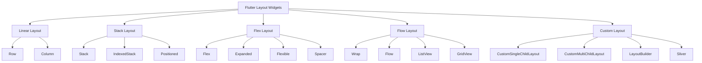

### 📊 布局组件特性对比

| 布局类型         | 主要用途   | 性能       | 灵活性     | 复杂度     | 适用场景     |
| ---------------- | ---------- | ---------- | ---------- | ---------- | ------------ |
| **Row/Column**   | 线性排列   | ⭐⭐⭐⭐⭐ | ⭐⭐⭐     | ⭐⭐       | 简单线性布局 |
| **Stack**        | 层叠定位   | ⭐⭐⭐⭐   | ⭐⭐⭐⭐   | ⭐⭐⭐     | 重叠元素布局 |
| **Flex**         | 弹性伸缩   | ⭐⭐⭐⭐   | ⭐⭐⭐⭐⭐ | ⭐⭐⭐⭐   | 复杂弹性布局 |
| **Wrap**         | 流式换行   | ⭐⭐⭐⭐   | ⭐⭐⭐     | ⭐⭐       | 标签、按钮组 |
| **CustomLayout** | 自定义布局 | ⭐⭐⭐     | ⭐⭐⭐⭐⭐ | ⭐⭐⭐⭐⭐ | 特殊布局需求 |

## 📐 Row & Column 线性布局

### 布局轴概念详解

在 Flutter 的布局系统中，理解主轴（Main Axis）和交叉轴（Cross Axis）是掌握布局的关键。

#### Row 组件的轴方向

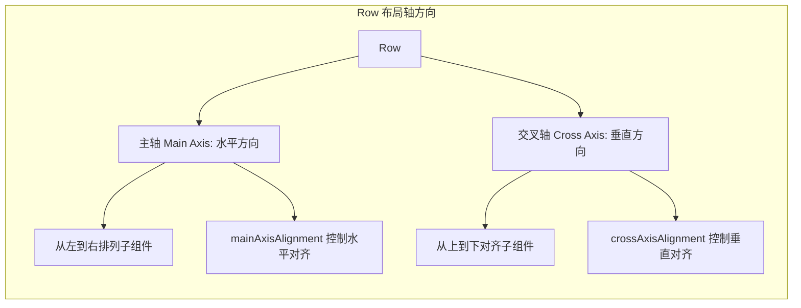

**Row 轴方向说明**:

- **主轴（Main Axis）**: 水平方向（从左到右）
- **交叉轴（Cross Axis）**: 垂直方向（从上到下）
- **子组件排列**: 沿主轴方向依次排列
- **对齐控制**: 主轴控制水平对齐，交叉轴控制垂直对齐

#### Column 组件的轴方向

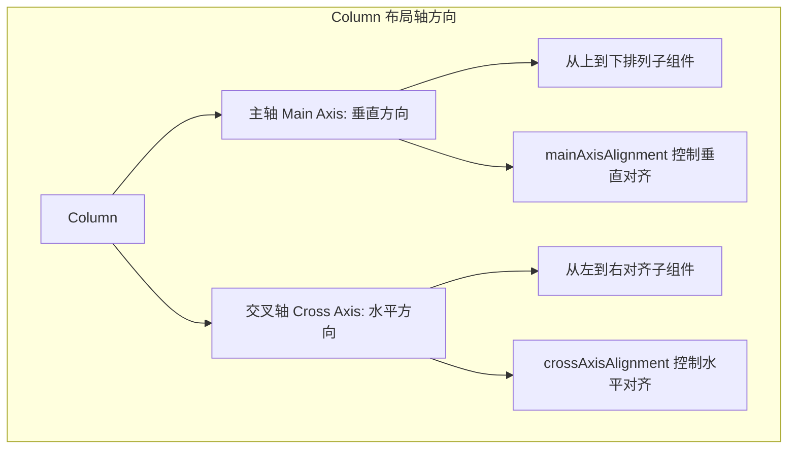

**Column 轴方向说明**:

- **主轴（Main Axis）**: 垂直方向（从上到下）
- **交叉轴（Cross Axis）**: 水平方向（从左到右）
- **子组件排列**: 沿主轴方向依次排列
- **对齐控制**: 主轴控制垂直对齐，交叉轴控制水平对齐

### 基础用法对比

| 属性               | Row      | Column   | 说明           |
| ------------------ | -------- | -------- | -------------- |
| mainAxis           | 水平方向 | 垂直方向 | 主轴方向       |
| crossAxis          | 垂直方向 | 水平方向 | 交叉轴方向     |
| mainAxisAlignment  | 水平对齐 | 垂直对齐 | 主轴对齐方式   |
| crossAxisAlignment | 垂直对齐 | 水平对齐 | 交叉轴对齐方式 |

### 对齐方式详解

#### MainAxisAlignment 主轴对齐

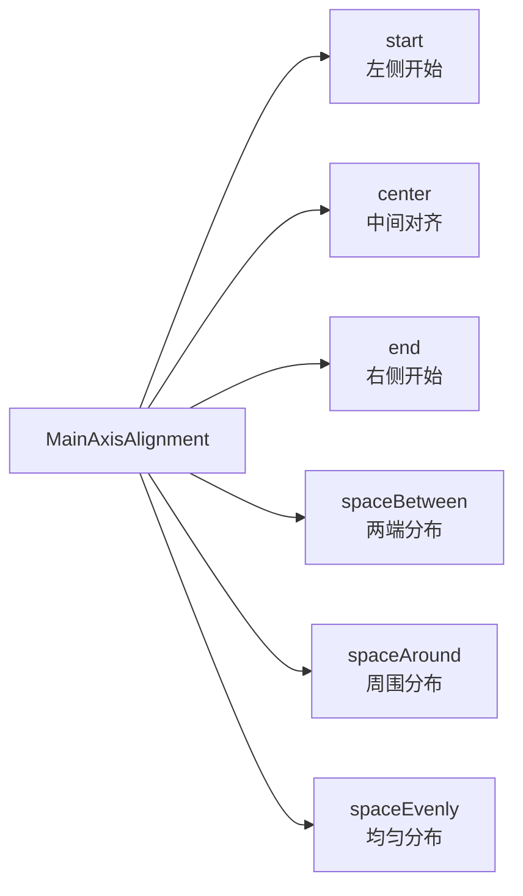

**Row 的 MainAxisAlignment 对齐方式**:

| 对齐方式       | 效果描述                     | 示意图          |
| -------------- | ---------------------------- | --------------- |
| `start`        | 子组件从左侧开始排列         | `[A][B][C]`     |
| `center`       | 子组件在中间对齐             | `[A][B][C]`     |
| `end`          | 子组件从右侧开始排列         | `    [A][B][C]` |
| `spaceBetween` | 子组件之间平均分布，两端对齐 | `[A]  [B]  [C]` |
| `spaceAround`  | 子组件周围平均分布           | `[A] [B] [C]`   |
| `spaceEvenly`  | 子组件和间距完全平均分布     | `[A] [B] [C]`   |

```dart
// MainAxisAlignment 示例
Row(
  mainAxisAlignment: MainAxisAlignment.spaceEvenly,
  children: [
    Container(width: 50, height: 50, color: Colors.red),
    Container(width: 50, height: 50, color: Colors.green),
    Container(width: 50, height: 50, color: Colors.blue),
  ],
)
```

#### CrossAxisAlignment 交叉轴对齐

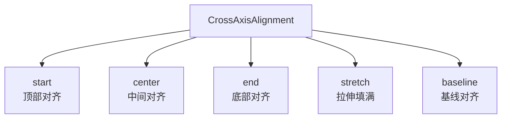

**Row 的 CrossAxisAlignment 对齐方式**:

| 对齐方式   | 效果描述             | 示意图                              |
| ---------- | -------------------- | ----------------------------------- |
| `start`    | 子组件从顶部对齐     | `[A]`<br>`[B]`<br>`[C]`             |
| `center`   | 子组件在中间对齐     | `[A]`<br>`[B]`<br>`[C]`             |
| `end`      | 子组件从底部对齐     | `    [A]`<br>`    [B]`<br>`    [C]` |
| `stretch`  | 子组件拉伸填满交叉轴 | `[A]`<br>`[B]`<br>`[C]`             |
| `baseline` | 子组件按基线对齐     | `[A]`<br>`[B]`<br>`[C]`             |

```dart
// CrossAxisAlignment 示例
Column(
  crossAxisAlignment: CrossAxisAlignment.stretch,
  children: [
    Container(height: 50, color: Colors.red),
    Container(height: 50, color: Colors.green),
    Container(height: 50, color: Colors.blue),
  ],
)
```

### 实际布局示例

#### Row 布局应用场景

**Row 布局的核心价值**：
Row 组件是水平布局的基础，特别适合创建导航栏、工具栏、状态栏等水平排列的界面元素。

**常见应用场景**：

- **导航栏**：标题、返回按钮、操作按钮的水平排列
- **工具栏**：多个功能按钮的水平排列
- **状态栏**：评分、价格、标签的水平展示
- **表单行**：标签和输入框的水平排列

**设计要点**：

- 使用 `mainAxisAlignment` 控制水平对齐方式
- 使用 `crossAxisAlignment` 控制垂直对齐方式
- 合理使用 `Expanded` 和 `Flexible` 处理空间分配
- 通过 `SizedBox` 控制组件间距

#### Column 布局应用场景

**Column 布局的核心价值**：
Column 组件是垂直布局的基础，适合创建卡片、列表项、详情页等垂直排列的界面元素。

**常见应用场景**：

- **产品卡片**：图片、标题、价格、描述的垂直排列
- **用户资料**：头像、姓名、简介的垂直排列
- **设置页面**：标题、选项、说明的垂直排列
- **表单页面**：多个输入字段的垂直排列

**设计要点**：

- 使用 `crossAxisAlignment` 控制水平对齐方式
- 合理使用 `SizedBox` 控制垂直间距
- 注意内容溢出处理
- 考虑响应式布局需求

### 布局约束和尺寸

#### 尺寸约束规则

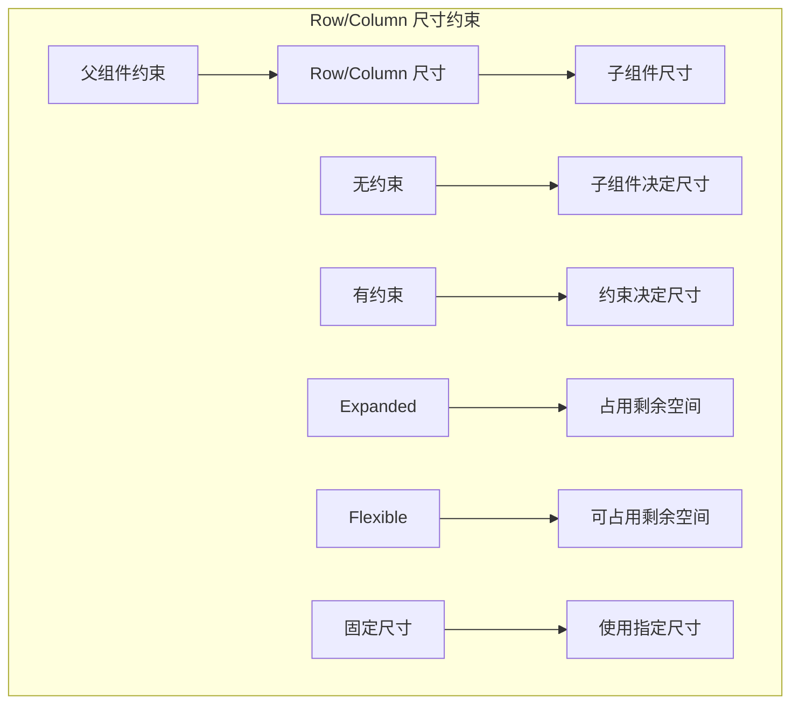

#### 常用尺寸组件

```dart
Row(
  children: [
    // 固定尺寸
    Container(
      width: 100,
      height: 50,
      color: Colors.red,
      child: Text('固定尺寸'),
    ),

    // 占用剩余空间
    Expanded(
      child: Container(
        height: 50,
        color: Colors.green,
        child: Text('占用剩余空间'),
      ),
    ),

    // 根据内容调整
    Flexible(
      child: Container(
        height: 50,
        color: Colors.blue,
        child: Text('根据内容调整'),
      ),
    ),
  ],
)
```

### 对齐方式可视化

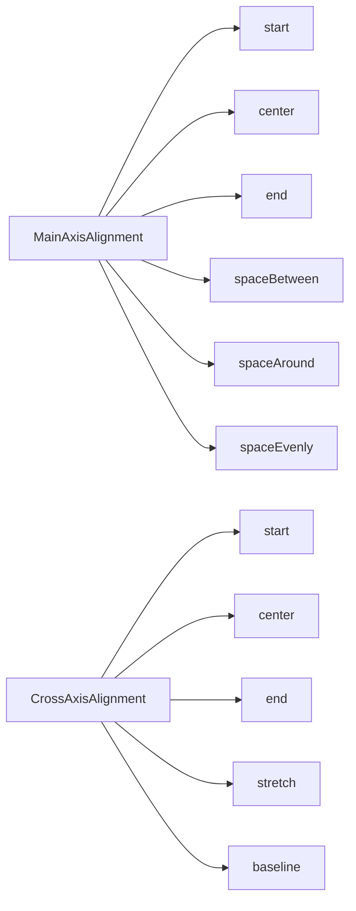

**MainAxisAlignment 主轴对齐方式**:

- `start` - 从起始位置开始排列
- `center` - 在中心位置对齐
- `end` - 从结束位置开始排列
- `spaceBetween` - 子组件之间平均分布
- `spaceAround` - 子组件周围平均分布
- `spaceEvenly` - 子组件和间距完全平均分布

**CrossAxisAlignment 交叉轴对齐方式**:

- `start` - 从起始位置对齐
- `center` - 在中心位置对齐
- `end` - 从结束位置对齐
- `stretch` - 拉伸填满交叉轴
- `baseline` - 按基线对齐

## 📚 Stack 层叠布局

### Stack 布局轴概念详解

Stack 组件是 Flutter 中实现层叠布局的核心组件，它允许子组件在同一个位置重叠显示。理解 Stack 的轴方向对于掌握层叠布局至关重要。

#### Stack 组件的轴方向

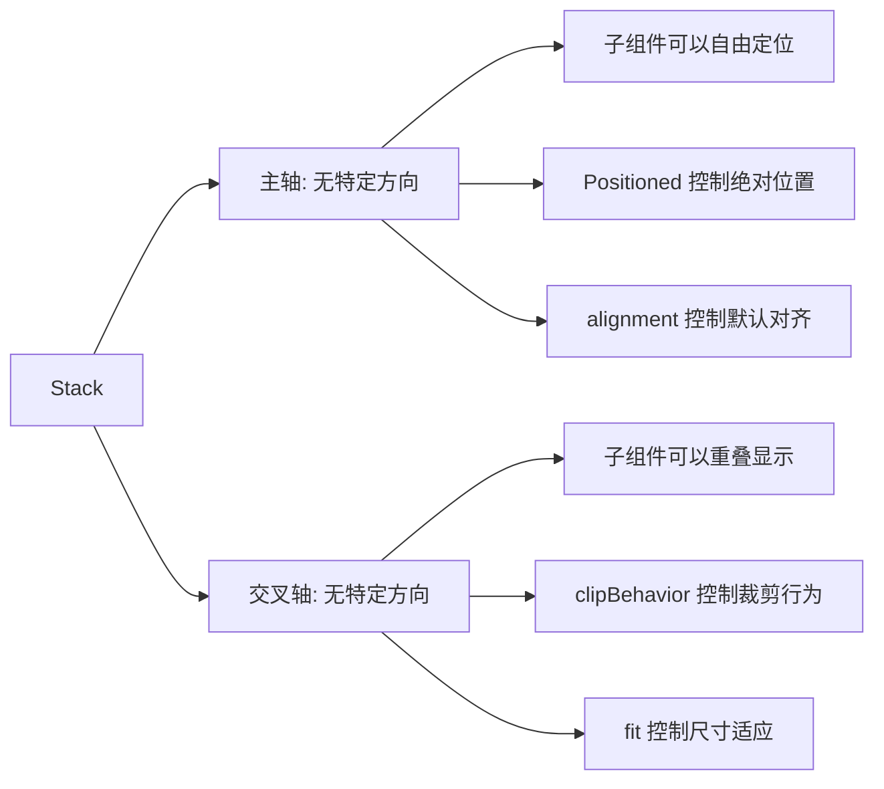

**Stack 轴方向说明**:

- **主轴（Main Axis）**: Stack 没有传统的主轴概念，子组件可以自由定位
- **交叉轴（Cross Axis）**: Stack 没有传统的交叉轴概念，子组件可以重叠
- **定位方式**: 通过 `Positioned` 组件或 `alignment` 属性控制子组件位置
- **层叠顺序**: 后添加的子组件显示在上层

#### Stack vs Row/Column 对比

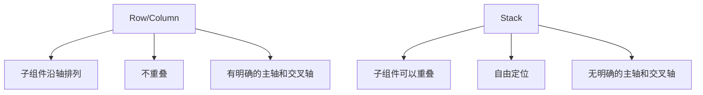

### 基础层叠

**Stack 的核心概念**：
Stack 允许子组件在同一个位置重叠显示，通过 `Positioned` 组件或 `alignment` 属性控制子组件的位置。

**层叠布局的特点**：

- **自由定位**：子组件可以放置在任意位置
- **重叠显示**：多个子组件可以在同一位置重叠
- **层叠顺序**：后添加的子组件显示在上层
- **绝对定位**：通过 `Positioned` 实现精确的位置控制

**使用场景**：

- 头像上的状态指示器
- 卡片上的操作按钮
- 图片上的水印或标签
- 模态框和对话框

### Stack 对齐方式

#### Alignment 对齐

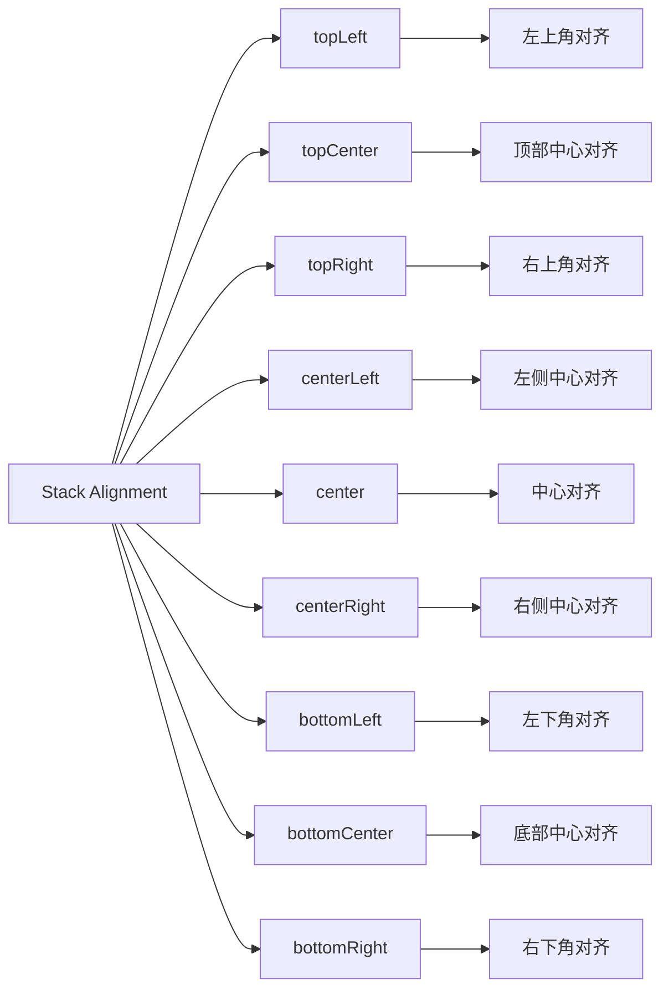

**Stack Alignment 对齐方式**:

| 对齐方式                 | 效果描述     | 示意图             |
| ------------------------ | ------------ | ------------------ |
| `Alignment.topLeft`      | 左上角对齐   | `[A]`              |
| `Alignment.topCenter`    | 顶部中心对齐 | `[A]`              |
| `Alignment.topRight`     | 右上角对齐   | `    [A]`          |
| `Alignment.centerLeft`   | 左侧中心对齐 | `[A]`<br>`   `     |
| `Alignment.center`       | 中心对齐     | `[A]`<br>`   `     |
| `Alignment.centerRight`  | 右侧中心对齐 | `    [A]`<br>`   ` |
| `Alignment.bottomLeft`   | 左下角对齐   | `   `<br>`[A]`     |
| `Alignment.bottomCenter` | 底部中心对齐 | `   `<br>`[A]`     |
| `Alignment.bottomRight`  | 右下角对齐   | `   `<br>`    [A]` |

```dart
// 不同对齐方式的示例
Stack(
  alignment: Alignment.center, // 默认对齐方式
  children: [
    Container(
      width: 200,
      height: 200,
      color: Colors.blue[100],
    ),
    Container(
      width: 100,
      height: 100,
      color: Colors.red[100],
    ),
  ],
)
```

### Positioned 定位详解

#### Positioned 属性说明

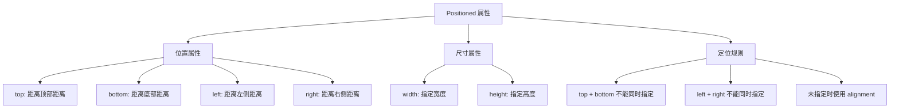

**Positioned 定位属性**:

| 属性     | 说明         | 示例                          |
| -------- | ------------ | ----------------------------- |
| `top`    | 距离顶部距离 | `Positioned(top: 10, ...)`    |
| `bottom` | 距离底部距离 | `Positioned(bottom: 10, ...)` |
| `left`   | 距离左侧距离 | `Positioned(left: 10, ...)`   |
| `right`  | 距离右侧距离 | `Positioned(right: 10, ...)`  |
| `width`  | 指定宽度     | `Positioned(width: 100, ...)` |
| `height` | 指定高度     | `Positioned(height: 50, ...)` |

**定位规则**:

- `top` 和 `bottom` 不能同时指定
- `left` 和 `right` 不能同时指定
- 未指定位置时使用 Stack 的 `alignment` 属性

#### Positioned 使用示例

**Positioned 的核心功能**：
Positioned 组件用于在 Stack 中精确控制子组件的位置，支持绝对定位和相对定位。

**定位策略**：

- **四角定位**：使用 `top`、`bottom`、`left`、`right` 属性
- **尺寸控制**：通过 `width` 和 `height` 指定组件尺寸
- **约束规则**：`top` 和 `bottom` 不能同时指定，`left` 和 `right` 不能同时指定
- **默认对齐**：未指定位置时使用 Stack 的 `alignment` 属性

**常见定位模式**：

- **左上角**：`top: 10, left: 10`
- **右上角**：`top: 10, right: 10`
- **底部居中**：`bottom: 10, left: 0, right: 0`
- **完全居中**：不指定位置，使用 `alignment: Alignment.center`

### 高级定位技巧

**Stack 的高级应用**：
Stack 不仅支持基础定位，还提供了许多高级功能来创建复杂的层叠布局。

**高级特性**：

- **边界控制**：通过 `clipBehavior` 控制子组件是否超出边界
- **尺寸适应**：通过 `fit` 属性控制 Stack 的尺寸适应方式
- **层叠顺序**：通过 `children` 的顺序控制显示层级
- **响应式定位**：结合 `LayoutBuilder` 实现响应式定位
  Positioned(
  bottom: 0,
  left: 0,
  right: 0,
  child: Container(
  height: 50,
  decoration: BoxDecoration(
  color: Colors.black54,
  borderRadius: BorderRadius.only(
  bottomLeft: Radius.circular(12),
  bottomRight: Radius.circular(12),
  ),
  ),
  child: Row(
  mainAxisAlignment: MainAxisAlignment.spaceEvenly,
  children: [
  IconButton(
  icon: Icon(Icons.favorite, color: Colors.white),
  onPressed: () {},
  ),
  IconButton(
  icon: Icon(Icons.share, color: Colors.white),
  onPressed: () {},
  ),
  IconButton(
  icon: Icon(Icons.more_vert, color: Colors.white),
  onPressed: () {},
  ),
  ],
  ),
  ),
  ),
  ],
  );
  }
  }

````

### Stack 尺寸控制

#### StackFit 尺寸适应

```mermaid
graph TD
    A[StackFit] --> B[loose]
    A --> C[expand]
    A --> D[passthrough]

    B --> E[子组件决定尺寸]
    B --> F[Stack 尺寸可能小于父组件]

    C --> G[Stack 填满父组件]
    C --> H[子组件可以超出边界]

    D --> I[使用父组件约束]
    D --> J[默认行为]
````

**StackFit 尺寸适应方式**:

| 适应方式               | 效果描述                                 | 使用场景         |
| ---------------------- | ---------------------------------------- | ---------------- |
| `StackFit.loose`       | 子组件决定尺寸，Stack 尺寸可能小于父组件 | 子组件尺寸固定时 |
| `StackFit.expand`      | Stack 填满父组件，子组件可以超出边界     | 需要填满容器时   |
| `StackFit.passthrough` | 使用父组件约束（默认行为）               | 大多数情况下     |

```dart
// 不同 StackFit 的示例
Column(
  children: [
    // loose: 子组件决定尺寸
    Stack(
      fit: StackFit.loose,
      children: [
        Container(width: 100, height: 100, color: Colors.red),
        Positioned(
          top: 50,
          left: 50,
          child: Container(width: 50, height: 50, color: Colors.blue),
        ),
      ],
    ),

    SizedBox(height: 20),

    // expand: 填满父组件
    Container(
      width: 200,
      height: 100,
      child: Stack(
        fit: StackFit.expand,
        children: [
          Container(color: Colors.green),
          Positioned(
            top: 10,
            left: 10,
            child: Text('在扩展的 Stack 中'),
          ),
        ],
      ),
    ),
  ],
)
```

### 实际应用示例

#### 头像叠加应用

**应用场景**：
头像叠加是 Stack 布局的经典应用，常用于显示用户头像和在线状态、VIP 标识等附加信息。

**设计要点**：

- **主头像**：使用 `CircleAvatar` 显示用户头像
- **状态指示器**：通过 `Positioned` 在右下角显示在线状态
- **视觉层次**：状态指示器应该比主头像小，避免遮挡主要内容
- **边框处理**：为状态指示器添加白色边框，确保在不同背景下都清晰可见

**实现思路**：

1. 主头像作为 Stack 的第一个子组件
2. 状态指示器使用 `Positioned(bottom: 0, right: 0)` 定位
3. 通过 `Border.all` 为状态指示器添加边框

#### 卡片布局应用

**应用场景**：
卡片布局常用于产品展示、新闻列表、图片画廊等场景，通过层叠效果增强视觉吸引力。

**设计要点**：

- **背景图片**：使用 `DecorationImage` 设置背景
- **渐变遮罩**：添加渐变遮罩确保文字可读性
- **文字定位**：使用 `Positioned` 将文字固定在底部
- **圆角处理**：为卡片添加圆角，提升视觉效果

**实现思路**：

1. 背景图片作为底层
2. 渐变遮罩作为中间层，确保文字可读性
3. 文字内容使用 `Positioned` 固定在底部
4. 通过 `BorderRadius` 统一处理圆角效果

### Stack 性能优化

#### 优化技巧

```dart
class OptimizedStackExample extends StatelessWidget {
  final List<Widget> children;

  const OptimizedStackExample({
    Key? key,
    required this.children,
  }) : super(key: key);

  @override
  Widget build(BuildContext context) {
    return Stack(
      clipBehavior: Clip.hardEdge, // 裁剪超出边界的子组件
      children: children,
    );
  }
}
```

#### 避免过度使用

```dart
// ❌ 不推荐：过度使用 Stack
Stack(
  children: [
    Container(color: Colors.red),
    Positioned(
      top: 10,
      left: 10,
      child: Text('标题'),
    ),
    Positioned(
      top: 40,
      left: 10,
      child: Text('描述'),
    ),
  ],
)

// ✅ 推荐：使用 Column 布局
Column(
  crossAxisAlignment: CrossAxisAlignment.start,
  children: [
    Container(color: Colors.red),
    SizedBox(height: 10),
    Text('标题'),
    SizedBox(height: 10),
    Text('描述'),
  ],
)
```

## 🔄 Flex & Expanded 弹性布局

### Flex 布局轴概念详解

Flex 组件是 Flutter 中实现弹性布局的核心组件，它可以根据子组件的 flex 属性动态分配空间。理解 Flex 的轴方向对于掌握弹性布局至关重要。

#### Flex 组件的轴方向

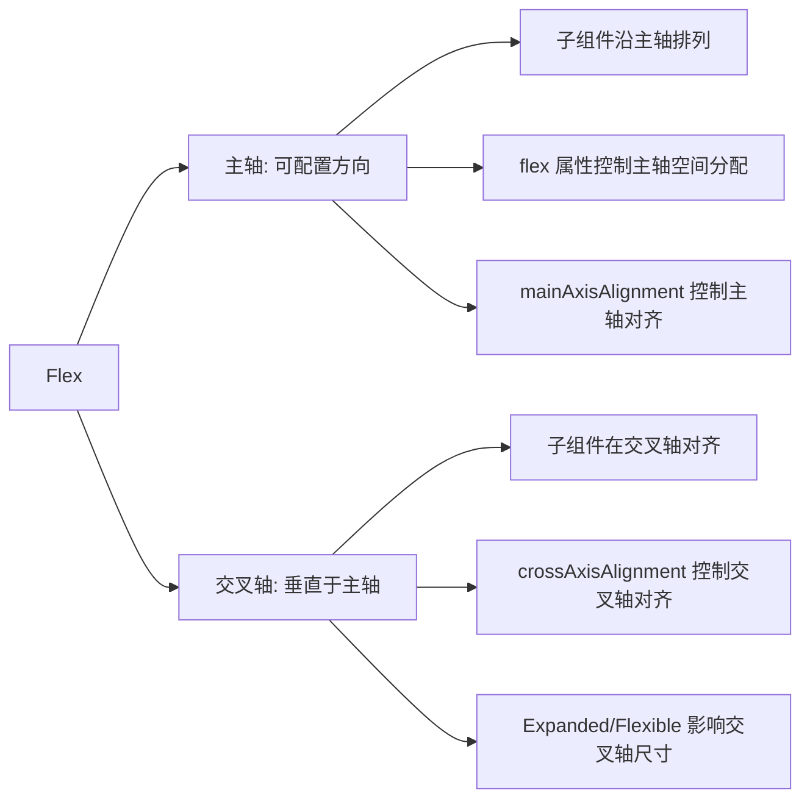

**Flex 轴方向说明**:

- **主轴（Main Axis）**: 通过 `direction` 属性配置（水平或垂直）
- **交叉轴（Cross Axis）**: 垂直于主轴的方向
- **空间分配**: 子组件的 `flex` 属性决定主轴空间分配比例
- **对齐控制**: 主轴和交叉轴都有独立的对齐方式

#### Flex 方向配置

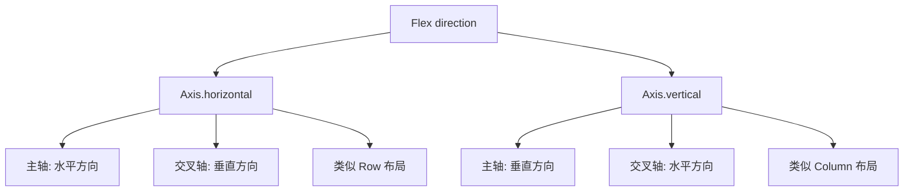

### Flex vs Row/Column

```dart
// Flex 可以动态改变方向
Flex(
  direction: isHorizontal ? Axis.horizontal : Axis.vertical,
  children: [
    Expanded(
      flex: 2,
      child: Container(color: Colors.red),
    ),
    Expanded(
      flex: 1,
      child: Container(color: Colors.green),
    ),
  ],
)
```

### Expanded vs Flexible

#### 空间分配机制

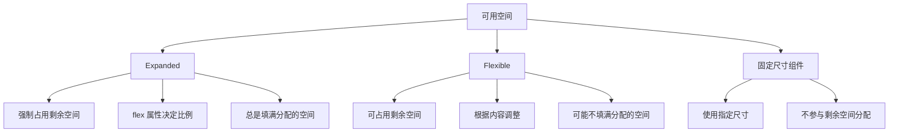

**Expanded vs Flexible 空间分配**:

| 组件类型     | 空间分配行为     | 特点                                  |
| ------------ | ---------------- | ------------------------------------- |
| `Expanded`   | 强制占用剩余空间 | 总是填满分配的空间，flex 属性决定比例 |
| `Flexible`   | 可占用剩余空间   | 根据内容调整，可能不填满分配的空间    |
| 固定尺寸组件 | 使用指定尺寸     | 不参与剩余空间分配                    |

**空间分配流程**:

1. 固定尺寸组件先占用指定空间
2. 剩余空间按 flex 比例分配给 Expanded/Flexible 组件
3. Expanded 组件强制填满分配的空间
4. Flexible 组件根据内容调整，可能不填满

#### 实际对比示例

```dart
Column(
  children: [
    // Expanded: 强制占用剩余空间
    Expanded(
      child: Container(
        color: Colors.red,
        child: Text('Expanded - 占用所有剩余空间'),
      ),
    ),
    // Flexible: 可以占用剩余空间，但不强制
    Flexible(
      child: Container(
        color: Colors.green,
        child: Text('Flexible - 根据内容大小调整'),
      ),
    ),
    // 固定大小
    Container(
      height: 100,
      color: Colors.blue,
      child: Text('Fixed - 固定大小'),
    ),
  ],
)
```

### Flex 布局详解

#### 基础 Flex 布局

```dart
class FlexLayoutExample extends StatelessWidget {
  @override
  Widget build(BuildContext context) {
    return Column(
      children: [
        // 水平 Flex 布局
        Container(
          height: 100,
          child: Flex(
            direction: Axis.horizontal,
            children: [
              Expanded(
                flex: 1,
                child: Container(color: Colors.red, child: Center(child: Text('1'))),
              ),
              Expanded(
                flex: 2,
                child: Container(color: Colors.green, child: Center(child: Text('2'))),
              ),
              Expanded(
                flex: 3,
                child: Container(color: Colors.blue, child: Center(child: Text('3'))),
              ),
            ],
          ),
        ),

        SizedBox(height: 20),

        // 垂直 Flex 布局
        Container(
          height: 200,
          child: Flex(
            direction: Axis.vertical,
            children: [
              Expanded(
                flex: 1,
                child: Container(color: Colors.orange, child: Center(child: Text('1'))),
              ),
              Expanded(
                flex: 2,
                child: Container(color: Colors.purple, child: Center(child: Text('2'))),
              ),
              Expanded(
                flex: 1,
                child: Container(color: Colors.teal, child: Center(child: Text('1'))),
              ),
            ],
          ),
        ),
      ],
    );
  }
}
```

#### 复杂 Flex 布局

```dart
class ComplexFlexExample extends StatelessWidget {
  @override
  Widget build(BuildContext context) {
    return Container(
      height: 300,
      child: Flex(
        direction: Axis.horizontal,
        children: [
          // 左侧固定宽度
          Container(
            width: 100,
            color: Colors.grey[300],
            child: Center(child: Text('侧边栏')),
          ),

          // 中间弹性区域
          Expanded(
            flex: 2,
            child: Flex(
              direction: Axis.vertical,
              children: [
                // 顶部固定高度
                Container(
                  height: 60,
                  color: Colors.blue[100],
                  child: Center(child: Text('顶部导航')),
                ),

                // 中间内容区域
                Expanded(
                  child: Container(
                    color: Colors.white,
                    child: Center(child: Text('主要内容区域')),
                  ),
                ),

                // 底部固定高度
                Container(
                  height: 40,
                  color: Colors.green[100],
                  child: Center(child: Text('底部状态栏')),
                ),
              ],
            ),
          ),

          // 右侧固定宽度
          Container(
            width: 80,
            color: Colors.grey[300],
            child: Center(child: Text('工具栏')),
          ),
        ],
      ),
    );
  }
}
```

### Spacer 组件

#### Spacer 工作原理

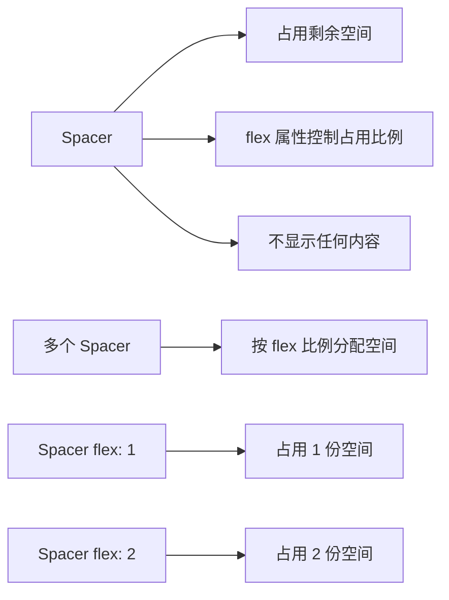

**Spacer 组件特点**:

- 占用剩余空间但不显示任何内容
- 通过 `flex` 属性控制占用比例
- 多个 Spacer 按 flex 比例分配空间

**Spacer 使用场景**:
| 场景 | 示例 | 效果 |
|------|------|------|
| 两端对齐 | `[A] Spacer() [B]` | A 在左，B 在右 |
| 三等分 | `[A] Spacer(flex:1) [B] Spacer(flex:1) [C]` | A、B、C 均匀分布 |
| 比例分布 | `[A] Spacer(flex:1) [B] Spacer(flex:2) [C]` | A 占 1/4，B 占 1/2，C 占 1/4 |

#### Spacer 使用示例

**Spacer 的核心价值**：
Spacer 是一个简单但强大的组件，用于在布局中创建灵活的间距，特别适合创建两端对齐和均匀分布的布局。

**使用场景**：

- **两端对齐**：将内容分别放在左右两端
- **均匀分布**：在多个元素之间创建相等的间距
- **比例分布**：通过不同的 flex 值创建比例间距
- **响应式布局**：结合其他组件创建自适应布局

**设计原则**：

- 优先使用 `Spacer()` 而不是固定尺寸的 `SizedBox`
- 合理使用 `flex` 属性控制间距比例
- 避免过度使用，保持布局的简洁性

### Flex 布局约束和尺寸

#### 尺寸约束规则

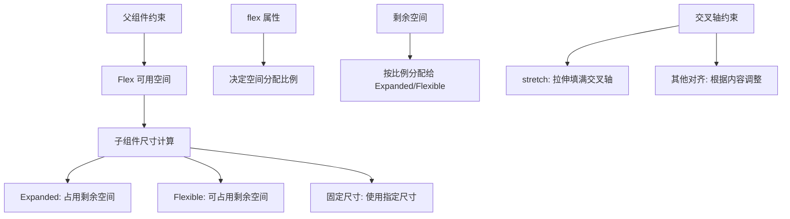

**Flex 尺寸约束流程**:

1. **父组件约束** → Flex 可用空间
2. **子组件尺寸计算**:
   - `Expanded`: 占用剩余空间
   - `Flexible`: 可占用剩余空间
   - 固定尺寸: 使用指定尺寸
3. **空间分配**:
   - `flex` 属性决定空间分配比例
   - 剩余空间按比例分配给 Expanded/Flexible
4. **交叉轴约束**:
   - `stretch`: 拉伸填满交叉轴
   - 其他对齐: 根据内容调整

#### 响应式 Flex 布局

**响应式布局的核心价值**：
响应式布局是现代应用开发的重要特性，能够根据不同的屏幕尺寸和设备类型提供最佳的用户体验。

**实现策略**：

- **断点设计**：根据屏幕宽度设置布局切换的断点
- **方向切换**：在宽屏和窄屏之间切换布局方向
- **比例调整**：根据屏幕尺寸调整组件的 flex 比例
- **内容适配**：确保内容在不同布局下都能正常显示

**设计要点**：

- 使用 `LayoutBuilder` 获取可用空间信息
- 设置合理的断点值（如 600px、800px、1200px）
- 考虑不同设备的使用场景
- 保持布局的一致性和可用性

### Flex 布局最佳实践

#### 性能优化

```dart
class OptimizedFlexExample extends StatelessWidget {
  final List<Widget> children;

  const OptimizedFlexExample({
    Key? key,
    required this.children,
  }) : super(key: key);

  @override
  Widget build(BuildContext context) {
    return Flex(
      direction: Axis.horizontal,
      children: children.map((child) {
        // 使用 const 构造函数优化性能
        return Expanded(
          child: child,
        );
      }).toList(),
    );
  }
}
```

#### 布局调试

```dart
class DebugFlexExample extends StatelessWidget {
  @override
  Widget build(BuildContext context) {
    return Flex(
      direction: Axis.horizontal,
      children: [
        Expanded(
          flex: 1,
          child: Container(
            color: Colors.red.withOpacity(0.3),
            child: Center(
              child: Text(
                'Flex: 1\n占用 1/6 空间',
                textAlign: TextAlign.center,
              ),
            ),
          ),
        ),
        Expanded(
          flex: 2,
          child: Container(
            color: Colors.green.withOpacity(0.3),
            child: Center(
              child: Text(
                'Flex: 2\n占用 2/6 空间',
                textAlign: TextAlign.center,
              ),
            ),
          ),
        ),
        Expanded(
          flex: 3,
          child: Container(
            color: Colors.blue.withOpacity(0.3),
            child: Center(
              child: Text(
                'Flex: 3\n占用 3/6 空间',
                textAlign: TextAlign.center,
              ),
            ),
          ),
        ),
      ],
    );
  }
}
```

## 📦 Wrap 流式布局

### Wrap 布局轴概念详解

Wrap 组件是 Flutter 中实现流式布局的重要组件，它能够自动换行处理子组件。理解 Wrap 的轴方向对于掌握其布局原理至关重要。

#### Wrap 组件的轴方向

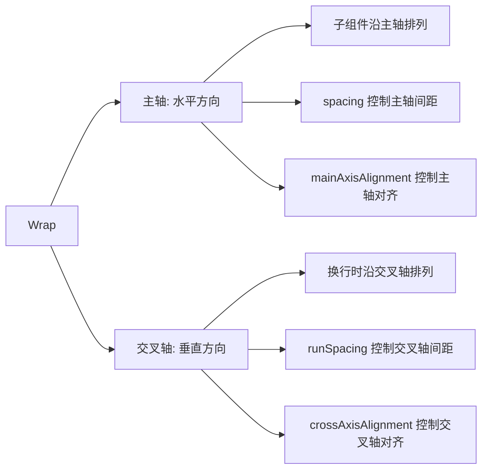

**Wrap 轴方向说明**:

- **主轴（Main Axis）**: 水平方向（从左到右）
- **交叉轴（Cross Axis）**: 垂直方向（从上到下）
- **子组件排列**: 沿主轴方向排列，超出宽度时换行
- **间距控制**: `spacing` 控制主轴间距，`runSpacing` 控制交叉轴间距

#### Wrap vs Row 对比

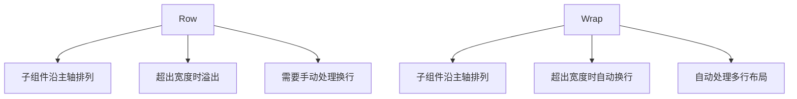

### 基础 Wrap 用法

```dart
class BasicWrapExample extends StatelessWidget {
  @override
  Widget build(BuildContext context) {
    return Container(
      padding: EdgeInsets.all(16),
      child: Wrap(
        spacing: 8,        // 主轴间距
        runSpacing: 8,     // 交叉轴间距
        children: [
          Chip(label: Text('Flutter')),
          Chip(label: Text('Dart')),
          Chip(label: Text('Widget')),
          Chip(label: Text('Layout')),
          Chip(label: Text('Animation')),
          Chip(label: Text('State Management')),
          Chip(label: Text('Navigation')),
          Chip(label: Text('Network')),
        ],
      ),
    );
  }
}
```

### Wrap 对齐方式详解

#### MainAxisAlignment 主轴对齐

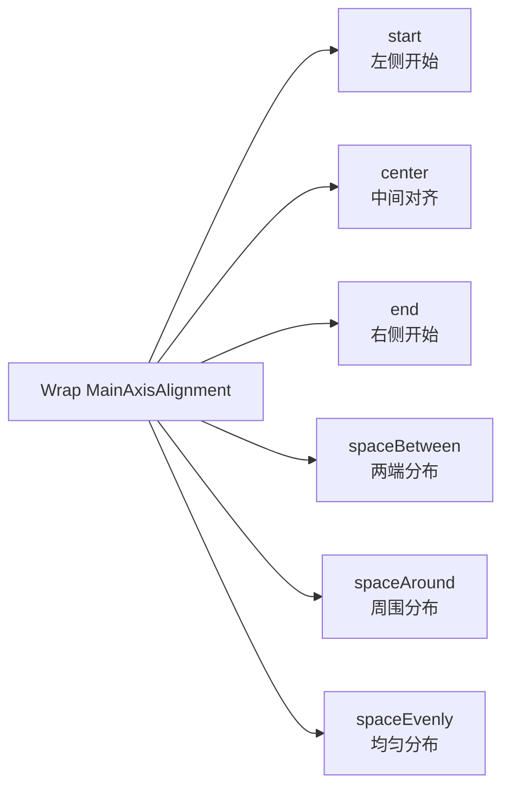

**Wrap 的 MainAxisAlignment 对齐方式**:

| 对齐方式       | 效果描述                     | 示意图          |
| -------------- | ---------------------------- | --------------- |
| `start`        | 每行从左侧开始排列           | `[A][B][C]`     |
| `center`       | 每行在中间对齐               | `[A][B][C]`     |
| `end`          | 每行从右侧开始排列           | `    [A][B][C]` |
| `spaceBetween` | 每行子组件之间平均分布       | `[A]  [B]  [C]` |
| `spaceAround`  | 每行子组件周围平均分布       | `[A] [B] [C]`   |
| `spaceEvenly`  | 每行子组件和间距完全平均分布 | `[A] [B] [C]`   |

```dart
// 不同主轴对齐方式的示例
Wrap(
  spacing: 8,
  runSpacing: 8,
  mainAxisAlignment: WrapAlignment.spaceEvenly,
  children: [
    Container(width: 80, height: 40, color: Colors.red),
    Container(width: 80, height: 40, color: Colors.green),
    Container(width: 80, height: 40, color: Colors.blue),
    Container(width: 80, height: 40, color: Colors.orange),
  ],
)
```

#### CrossAxisAlignment 交叉轴对齐

```mermaid
graph TD
    A[Wrap CrossAxisAlignment] --> B[start<br/>顶部对齐]
    A --> C[center<br/>中间对齐]
    A --> D[end<br/>底部对齐]
    A --> E[stretch<br/>拉伸填满]
    A --> F[baseline<br/>基线对齐]
```

```dart
// 不同交叉轴对齐方式的示例
Wrap(
  spacing: 8,
  runSpacing: 8,
  crossAxisAlignment: WrapCrossAlignment.center,
  children: [
    Container(width: 80, height: 30, color: Colors.red),
    Container(width: 80, height: 50, color: Colors.green),
    Container(width: 80, height: 40, color: Colors.blue),
    Container(width: 80, height: 60, color: Colors.orange),
  ],
)
```

### Wrap 方向控制

#### 水平 Wrap（默认）

```dart
Wrap(
  direction: Axis.horizontal,  // 默认值，可以省略
  spacing: 8,
  runSpacing: 8,
  children: [
    // 子组件从左到右排列，超出宽度时换行
  ],
)
```

#### 垂直 Wrap

```dart
Wrap(
  direction: Axis.vertical,    // 垂直方向
  spacing: 8,                  // 垂直间距
  runSpacing: 8,              // 水平间距
  children: [
    // 子组件从上到下排列，超出高度时换列
  ],
)
```

### 实际应用示例

#### 标签选择器

```dart
class TagSelector extends StatefulWidget {
  @override
  _TagSelectorState createState() => _TagSelectorState();
}

class _TagSelectorState extends State<TagSelector> {
  final List<String> _allTags = [
    'Flutter', 'Dart', 'Widget', 'Layout', 'Animation',
    'State Management', 'Navigation', 'Network', 'Database',
    'UI/UX', 'Performance', 'Testing', 'Deployment'
  ];

  final Set<String> _selectedTags = {};

  @override
  Widget build(BuildContext context) {
    return Column(
      crossAxisAlignment: CrossAxisAlignment.start,
      children: [
        Text(
          '选择你感兴趣的标签:',
          style: TextStyle(fontSize: 18, fontWeight: FontWeight.bold),
        ),

        SizedBox(height: 16),

        Wrap(
          spacing: 8,
          runSpacing: 8,
          children: _allTags.map((tag) {
            final isSelected = _selectedTags.contains(tag);
            return GestureDetector(
              onTap: () {
                setState(() {
                  if (isSelected) {
                    _selectedTags.remove(tag);
                  } else {
                    _selectedTags.add(tag);
                  }
                });
              },
              child: Container(
                padding: EdgeInsets.symmetric(horizontal: 12, vertical: 6),
                decoration: BoxDecoration(
                  color: isSelected ? Colors.blue : Colors.grey[200],
                  borderRadius: BorderRadius.circular(16),
                  border: Border.all(
                    color: isSelected ? Colors.blue : Colors.grey[300]!,
                  ),
                ),
                child: Text(
                  tag,
                  style: TextStyle(
                    color: isSelected ? Colors.white : Colors.black87,
                    fontSize: 14,
                  ),
                ),
              ),
            );
          }).toList(),
        ),

        SizedBox(height: 16),

        Text(
          '已选择: ${_selectedTags.length} 个标签',
          style: TextStyle(color: Colors.grey[600]),
        ),
      ],
    );
  }
}
```

#### 按钮组布局

```dart
class ButtonGroupExample extends StatelessWidget {
  @override
  Widget build(BuildContext context) {
    return Container(
      padding: EdgeInsets.all(16),
      child: Wrap(
        spacing: 12,
        runSpacing: 12,
        alignment: WrapAlignment.center,
        children: [
          ElevatedButton(
            onPressed: () => print('保存'),
            child: Text('保存'),
          ),
          OutlinedButton(
            onPressed: () => print('取消'),
            child: Text('取消'),
          ),
          TextButton(
            onPressed: () => print('删除'),
            child: Text('删除'),
          ),
          ElevatedButton.icon(
            onPressed: () => print('分享'),
            icon: Icon(Icons.share),
            label: Text('分享'),
          ),
          OutlinedButton.icon(
            onPressed: () => print('导出'),
            icon: Icon(Icons.download),
            label: Text('导出'),
          ),
        ],
      ),
    );
  }
}
```

### Wrap 布局约束和尺寸

#### 尺寸约束规则

```mermaid
graph TD
    A[父组件约束] --> B[Wrap 可用空间]
    B --> C[子组件尺寸计算]

    D[主轴方向] --> E[计算每行可容纳的子组件]
    F[交叉轴方向] --> G[计算需要的行数]

    H[spacing] --> I[影响主轴布局]
    J[runSpacing] --> K[影响交叉轴布局]

    L[子组件尺寸] --> M[决定换行位置]
    N[容器宽度] --> O[决定每行容量]
```

#### 响应式 Wrap 布局

**Wrap 响应式设计的价值**：
Wrap 组件天然支持响应式布局，能够根据容器宽度自动调整子组件的排列方式，特别适合创建自适应的标签列表和按钮组。

**响应式策略**：

- **间距自适应**：根据容器宽度调整 `spacing` 和 `runSpacing`
- **组件尺寸调整**：根据可用空间调整子组件的尺寸
- **换行优化**：确保在不同宽度下都有良好的视觉效果
- **性能考虑**：避免在频繁变化的布局中过度重建

**设计原则**：

- 设置合理的断点值，避免布局频繁切换
- 保持间距的一致性，提升视觉体验
- 考虑不同设备的使用场景
- 优化性能，避免不必要的重建

### Wrap 性能优化

#### 优化技巧

```dart
class OptimizedWrapExample extends StatelessWidget {
  final List<String> items;

  const OptimizedWrapExample({
    Key? key,
    required this.items,
  }) : super(key: key);

  @override
  Widget build(BuildContext context) {
    return Wrap(
      spacing: 8,
      runSpacing: 8,
      children: items.map((item) {
        // 使用 const 构造函数优化性能
        return const Chip(
          label: Text('标签'),
        );
      }).toList(),
    );
  }
}
```

## 📱 实战案例：响应式卡片布局

```dart
class ResponsiveCardLayout extends StatelessWidget {
  final List<CardData> cards;

  const ResponsiveCardLayout({Key? key, required this.cards}) : super(key: key);

  @override
  Widget build(BuildContext context) {
    return LayoutBuilder(
      builder: (context, constraints) {
        // 根据屏幕宽度决定列数
        int crossAxisCount;
        if (constraints.maxWidth > 1200) {
          crossAxisCount = 4;
        } else if (constraints.maxWidth > 800) {
          crossAxisCount = 3;
        } else if (constraints.maxWidth > 600) {
          crossAxisCount = 2;
        } else {
          crossAxisCount = 1;
        }

        return GridView.builder(
          gridDelegate: SliverGridDelegateWithFixedCrossAxisCount(
            crossAxisCount: crossAxisCount,
            childAspectRatio: 0.8,
            crossAxisSpacing: 16,
            mainAxisSpacing: 16,
          ),
          padding: EdgeInsets.all(16),
          itemCount: cards.length,
          itemBuilder: (context, index) {
            return _buildCard(cards[index]);
          },
        );
      },
    );
  }

  Widget _buildCard(CardData data) {
    return Container(
      decoration: BoxDecoration(
        color: Colors.white,
        borderRadius: BorderRadius.circular(12),
        boxShadow: [
          BoxShadow(
            color: Colors.black12,
            blurRadius: 8,
            offset: Offset(0, 4),
          ),
        ],
      ),
      child: Column(
        crossAxisAlignment: CrossAxisAlignment.start,
        children: [
          // 图片区域
          Expanded(
            flex: 3,
            child: Container(
              width: double.infinity,
              decoration: BoxDecoration(
                borderRadius: BorderRadius.vertical(
                  top: Radius.circular(12),
                ),
                image: DecorationImage(
                  image: NetworkImage(data.imageUrl),
                  fit: BoxFit.cover,
                ),
              ),
            ),
          ),
          // 内容区域
          Expanded(
            flex: 2,
            child: Padding(
              padding: EdgeInsets.all(12),
              child: Column(
                crossAxisAlignment: CrossAxisAlignment.start,
                children: [
                  Text(
                    data.title,
                    style: TextStyle(
                      fontSize: 16,
                      fontWeight: FontWeight.bold,
                    ),
                    maxLines: 2,
                    overflow: TextOverflow.ellipsis,
                  ),
                  SizedBox(height: 8),
                  Expanded(
                    child: Text(
                      data.description,
                      style: TextStyle(
                        fontSize: 14,
                        color: Colors.grey[600],
                      ),
                      maxLines: 3,
                      overflow: TextOverflow.ellipsis,
                    ),
                  ),
                  Row(
                    mainAxisAlignment: MainAxisAlignment.spaceBetween,
                    children: [
                      Text(
                        '\$${data.price}',
                        style: TextStyle(
                          fontSize: 18,
                          fontWeight: FontWeight.bold,
                          color: Colors.green,
                        ),
                      ),
                      Icon(
                        Icons.favorite_border,
                        color: Colors.grey,
                      ),
                    ],
                  ),
                ],
              ),
            ),
          ),
        ],
      ),
    );
  }
}

class CardData {
  final String title;
  final String description;
  final String imageUrl;
  final double price;

  CardData({
    required this.title,
    required this.description,
    required this.imageUrl,
    required this.price,
  });
}
```

## 🎯 布局性能优化

### 性能优化的核心原则

**布局性能的重要性**：
在 Flutter 应用中，布局性能直接影响用户体验。良好的性能优化能够确保应用流畅运行，特别是在复杂布局和大量组件的情况下。

**优化策略**：

- **减少嵌套层级**：避免不必要的组件嵌套
- **合理使用组件**：选择最适合的布局组件
- **避免重复计算**：缓存计算结果，避免重复构建
- **优化重建**：减少不必要的 Widget 重建

### 1. 避免不必要的嵌套

**嵌套过度的危害**：
过度嵌套不仅影响性能，还会降低代码的可读性和维护性。每个嵌套层级都会增加布局计算的复杂度。

**优化方法**：

- 使用 `Container` 的 `padding` 和 `alignment` 属性替代嵌套的 `Padding` 和 `Center`
- 合并功能相似的组件
- 提取可复用的组件，减少重复代码

### 2. 使用 Intrinsic 组件处理特殊布局

**Intrinsic 组件的价值**：
Intrinsic 组件能够根据子组件的内容自动计算尺寸，特别适合处理需要统一高度的复杂布局。

**使用场景**：

- **IntrinsicHeight**：让 Row 中的所有子组件高度一致
- **IntrinsicWidth**：让 Column 中的所有子组件宽度一致
- **Baseline**：按基线对齐文本组件

**注意事项**：

- Intrinsic 组件性能开销较大，应谨慎使用
- 仅在必要时使用，避免过度依赖

### 3. 合理使用 LayoutBuilder

**LayoutBuilder 的应用**：
LayoutBuilder 能够获取父组件的约束信息，是实现响应式布局的重要工具。

**最佳实践**：

- 设置合理的断点值
- 避免在 LayoutBuilder 中执行复杂计算
- 缓存计算结果，避免重复计算
- 考虑不同设备的使用场景

---

**下一步**: 学习[自定义组件](custom-widgets.md)
