# 🎛️ Flutter 其他常用控件深度解析：从基础到高级

[](https://flutter.dev/)
[](https://dart.dev/)
[](LICENSE)

> 深入掌握 Flutter 中对话框、提示条、选择器等常用控件的使用方法，构建完整的用户交互体验

## 📊 文章概览

| 章节                            | 内容           | 难度等级 |
| ------------------------------- | -------------- | -------- |
| [Dialog 对话框](#dialog-对话框) | 各种对话框组件 | ⭐⭐⭐   |
| [提示类控件](#提示类控件)       | 提示信息组件   | ⭐⭐     |
| [弹窗类控件](#弹窗类控件)       | 底部弹窗组件   | ⭐⭐⭐   |
| [选择器类控件](#选择器类控件)   | 各种选择器     | ⭐⭐⭐   |
| [进度指示器类](#进度指示器类)   | 进度显示组件   | ⭐⭐     |
| [其他交互控件](#其他交互控件)   | 开关、滑块等   | ⭐⭐⭐   |
| [实际应用场景](#实际应用场景)   | 真实项目案例   | ⭐⭐⭐⭐ |

## 🎯 学习目标

- ✅ 掌握各种对话框的使用方法和配置选项
- ✅ 学会提示类控件的样式定制和交互处理
- ✅ 理解弹窗类控件的布局和动画效果
- ✅ 能够实现各种选择器的自定义功能
- ✅ 掌握进度指示器和交互控件的最佳实践

## 📋 目录导航

<details>
<summary>🎯 快速导航</summary>

- [Dialog 对话框](#dialog-对话框) - 各种对话框组件
- [提示类控件](#提示类控件) - 提示信息组件
- [弹窗类控件](#弹窗类控件) - 底部弹窗组件
- [选择器类控件](#选择器类控件) - 各种选择器
- [进度指示器类](#进度指示器类) - 进度显示组件
- [其他交互控件](#其他交互控件) - 开关、滑块等
- [实际应用场景](#实际应用场景) - 真实项目案例

</details>

---

## 📋 概述

除了基础的布局、文本、滚动和导航控件外，Flutter 还提供了许多实用的交互控件，如对话框、提示条、底部弹窗等。这些控件在实际开发中经常用到，能够提升用户体验和应用的交互性。

## 🏗️ 控件架构图

```mermaid
graph TB
    A[其他常用控件] --> B[对话框类]
    A --> C[提示类]
    A --> D[弹窗类]
    A --> E[选择器类]
    A --> F[进度指示器类]
    A --> G[其他交互控件]

    B --> B1[AlertDialog 警告对话框]
    B --> B2[SimpleDialog 简单对话框]
    B --> B3[Dialog 自定义对话框]
    B --> B4[CupertinoAlertDialog iOS风格对话框]

    C --> C1[SnackBar 底部提示条]
    C --> C2[Banner 横幅提示]
    C --> C3[Tooltip 工具提示]

    D --> D1[BottomSheet 底部弹窗]
    D --> D2[ModalBottomSheet 模态底部弹窗]
    D --> D3[DraggableScrollableSheet 可拖拽弹窗]

    E --> E1[DatePicker 日期选择器]
    E --> E2[TimePicker 时间选择器]
    E --> E3[ColorPicker 颜色选择器]
    E --> E4[FilePicker 文件选择器]

    F --> F1[CircularProgressIndicator 圆形进度条]
    F --> F2[LinearProgressIndicator 线性进度条]
    F --> F3[RefreshIndicator 刷新指示器]

    G --> G1[Switch 开关]
    G --> G2[Checkbox 复选框]
    G --> G3[Radio 单选框]
    G --> G4[Slider 滑块]
    G --> G5[Stepper 步骤器]
```



### 📊 控件特性对比

| 控件类型        | 主要用途   | 性能       | 灵活性   | 复杂度 | 适用场景 |
| --------------- | ---------- | ---------- | -------- | ------ | -------- |
| **AlertDialog** | 警告对话框 | ⭐⭐⭐⭐   | ⭐⭐⭐   | ⭐⭐   | 用户确认 |
| **SnackBar**    | 底部提示   | ⭐⭐⭐⭐⭐ | ⭐⭐⭐   | ⭐     | 操作反馈 |
| **BottomSheet** | 底部弹窗   | ⭐⭐⭐⭐   | ⭐⭐⭐⭐ | ⭐⭐⭐ | 选项展示 |
| **DatePicker**  | 日期选择   | ⭐⭐⭐⭐   | ⭐⭐⭐   | ⭐⭐   | 日期输入 |
| **Switch**      | 开关控件   | ⭐⭐⭐⭐⭐ | ⭐⭐⭐   | ⭐     | 状态切换 |

## Dialog 对话框

### Dialog 的核心价值

**Dialog 组件概述**：
Dialog 是 Flutter 中用于显示模态对话框的重要组件，提供了多种类型的对话框来满足不同的交互需求。

**Dialog 的优势**：

- **模态交互**：强制用户关注当前操作
- **类型丰富**：支持警告、确认、选择等多种类型
- **样式灵活**：支持自定义样式和布局
- **易于使用**：提供简单的 API 接口

**应用场景**：

- **用户确认**：重要操作的确认提示
- **错误提示**：错误信息的展示
- **选择操作**：提供选项供用户选择
- **信息展示**：重要信息的突出显示

### 设计原则

**Dialog 设计要点**：

- **明确目的**：确保对话框的目的清晰明确
- **简洁内容**：保持对话框内容简洁明了
- **合理操作**：提供合理的操作选项
- **视觉层次**：建立清晰的视觉层次结构

### AlertDialog 警告对话框

**AlertDialog 的特点**：
AlertDialog 是最常用的对话框类型，适合显示警告、确认和简单的信息提示。

```dart
shape: RoundedRectangleBorder(
  borderRadius: BorderRadius.circular(20),
),
child: Container(
  padding: EdgeInsets.all(20),
  decoration: BoxDecoration(
    borderRadius: BorderRadius.circular(20),
    gradient: LinearGradient(
      colors: [Colors.blue[50]!, Colors.white],
      begin: Alignment.topCenter,
      end: Alignment.bottomCenter,
    ),
  ),
  child: Column(
    mainAxisSize: MainAxisSize.min,
    children: [
      Container(
        width: 80,
        height: 80,
        decoration: BoxDecoration(
          color: Colors.blue,
          shape: BoxShape.circle,
        ),
        child: Icon(
          Icons.check,
          color: Colors.white,
          size: 40,
        ),
      ),
      SizedBox(height: 20),
      Text(
        '操作成功',
        style: TextStyle(
          fontSize: 24,
          fontWeight: FontWeight.bold,
          color: Colors.blue,
        ),
      ),
      SizedBox(height: 10),
      Text(
        '您的操作已经成功完成',
        style: TextStyle(
          fontSize: 16,
          color: Colors.grey[600],
        ),
        textAlign: TextAlign.center,
      ),
      SizedBox(height: 30),
      SizedBox(
        width: double.infinity,
        child: ElevatedButton(
          onPressed: () => Navigator.pop(context),
          style: ElevatedButton.styleFrom(
            backgroundColor: Colors.blue,
            foregroundColor: Colors.white,
            padding: EdgeInsets.symmetric(vertical: 15),
            shape: RoundedRectangleBorder(
              borderRadius: BorderRadius.circular(10),
            ),
          ),
          child: Text(
            '确定',
            style: TextStyle(
              fontSize: 16,
              fontWeight: FontWeight.bold,
            ),
          ),
        ),
      ),
    ],
  ),
),
);
}
```

```dart
// 列表对话框
void _showListDialog(BuildContext context) {
  final List<String> options = ['选项一', '选项二', '选项三', '选项四'];

    showDialog(
      context: context,
      builder: (context) => SimpleDialog(
        title: Text('请选择一个选项'),
        children: options.map((option) {
          return SimpleDialogOption(
            onPressed: () {
              Navigator.pop(context);
              ScaffoldMessenger.of(context).showSnackBar(
                SnackBar(content: Text('选择了：$option')),
              );
            },
            child: Padding(
              padding: EdgeInsets.symmetric(vertical: 10),
              child: Row(
                children: [
                  Icon(Icons.radio_button_unchecked),
                  SizedBox(width: 15),
                  Text(
                    option,
                    style: TextStyle(fontSize: 16),
                  ),
                ],
              ),
            ),
          );
        }).toList(),
      ),
    );

}
}

```

### 高级对话框示例

```dart
class AdvancedDialogExample extends StatefulWidget {
  @override
  _AdvancedDialogExampleState createState() => _AdvancedDialogExampleState();
}

class _AdvancedDialogExampleState extends State<AdvancedDialogExample> {
  @override
  Widget build(BuildContext context) {
    return Scaffold(
      appBar: AppBar(
        title: Text('高级对话框'),
        backgroundColor: Colors.purple,
        foregroundColor: Colors.white,
      ),
      body: Center(
        child: Column(
          mainAxisAlignment: MainAxisAlignment.center,
          children: [
            ElevatedButton(
              onPressed: () => _showFormDialog(context),
              child: Text('表单对话框'),
            ),
            SizedBox(height: 20),
            ElevatedButton(
              onPressed: () => _showProgressDialog(context),
              child: Text('进度对话框'),
            ),
            SizedBox(height: 20),
            ElevatedButton(
              onPressed: () => _showImageDialog(context),
              child: Text('图片对话框'),
            ),
          ],
        ),
      ),
    );
  }

  // 表单对话框
  void _showFormDialog(BuildContext context) {
    final _nameController = TextEditingController();
    final _emailController = TextEditingController();
    final _formKey = GlobalKey<FormState>();

    showDialog(
      context: context,
      builder: (context) => AlertDialog(
        title: Text('用户信息'),
        content: Form(
          key: _formKey,
          child: Column(
            mainAxisSize: MainAxisSize.min,
            children: [
              TextFormField(
                controller: _nameController,
                decoration: InputDecoration(
                  labelText: '姓名',
                  border: OutlineInputBorder(),
                ),
                validator: (value) {
                  if (value == null || value.isEmpty) {
                    return '请输入姓名';
                  }
                  return null;
                },
              ),
              SizedBox(height: 15),
              TextFormField(
                controller: _emailController,
                decoration: InputDecoration(
                  labelText: '邮箱',
                  border: OutlineInputBorder(),
                ),
                validator: (value) {
                  if (value == null || value.isEmpty) {
                    return '请输入邮箱';
                  }
                  if (!value.contains('@')) {
                    return '请输入有效的邮箱地址';
                  }
                  return null;
                },
              ),
            ],
          ),
        ),
        actions: [
          TextButton(
            onPressed: () => Navigator.pop(context),
            child: Text('取消'),
          ),
          ElevatedButton(
            onPressed: () {
              if (_formKey.currentState!.validate()) {
                Navigator.pop(context);
                ScaffoldMessenger.of(context).showSnackBar(
                  SnackBar(
                    content: Text(
                      '保存成功：${_nameController.text}, ${_emailController.text}',
                    ),
                  ),
                );
              }
            },
            child: Text('保存'),
          ),
        ],
      ),
    );
  }

  // 进度对话框
  void _showProgressDialog(BuildContext context) {
    showDialog(
      context: context,
      barrierDismissible: false,
      builder: (context) => ProgressDialog(),
    );
  }

  // 图片对话框
  void _showImageDialog(BuildContext context) {
    showDialog(
      context: context,
      builder: (context) => Dialog(
        child: Container(
          padding: EdgeInsets.all(20),
          child: Column(
            mainAxisSize: MainAxisSize.min,
            children: [
              Container(
                width: 200,
                height: 200,
                decoration: BoxDecoration(
                  borderRadius: BorderRadius.circular(10),
                  image: DecorationImage(
                    image: NetworkImage('https://via.placeholder.com/200'),
                    fit: BoxFit.cover,
                  ),
                ),
              ),
              SizedBox(height: 20),
              Text(
                '图片预览',
                style: TextStyle(
                  fontSize: 18,
                  fontWeight: FontWeight.bold,
                ),
              ),
              SizedBox(height: 10),
              Text(
                '这是一个图片预览对话框示例',
                style: TextStyle(
                  color: Colors.grey[600],
                ),
                textAlign: TextAlign.center,
              ),
              SizedBox(height: 20),
              Row(
                mainAxisAlignment: MainAxisAlignment.spaceEvenly,
                children: [
                  TextButton(
                    onPressed: () => Navigator.pop(context),
                    child: Text('关闭'),
                  ),
                  ElevatedButton(
                    onPressed: () {
                      Navigator.pop(context);
                      ScaffoldMessenger.of(context).showSnackBar(
                        SnackBar(content: Text('图片已保存')),
                      );
                    },
                    child: Text('保存'),
                  ),
                ],
              ),
            ],
          ),
        ),
      ),
    );
  }
}

// 进度对话框组件
class ProgressDialog extends StatefulWidget {
  @override
  _ProgressDialogState createState() => _ProgressDialogState();
}

class _ProgressDialogState extends State<ProgressDialog>
    with TickerProviderStateMixin {
  late AnimationController _controller;
  double _progress = 0.0;
  Timer? _timer;

  @override
  void initState() {
    super.initState();
    _controller = AnimationController(
      duration: Duration(seconds: 2),
      vsync: this,
    );

    _startProgress();
  }

  void _startProgress() {
    _timer = Timer.periodic(Duration(milliseconds: 100), (timer) {
      setState(() {
        _progress += 0.02;
        if (_progress >= 1.0) {
          _progress = 1.0;
          timer.cancel();
          Future.delayed(Duration(milliseconds: 500), () {
            Navigator.pop(context);
            ScaffoldMessenger.of(context).showSnackBar(
              SnackBar(content: Text('操作完成')),
            );
          });
        }
      });
    });
  }

  @override
  void dispose() {
    _controller.dispose();
    _timer?.cancel();
    super.dispose();
  }

  @override
  Widget build(BuildContext context) {
    return AlertDialog(
      content: Column(
        mainAxisSize: MainAxisSize.min,
        children: [
          CircularProgressIndicator(
            value: _progress,
            strokeWidth: 6,
          ),
          SizedBox(height: 20),
          Text(
            '正在处理中...',
            style: TextStyle(
              fontSize: 16,
              fontWeight: FontWeight.w500,
            ),
          ),
          SizedBox(height: 10),
          Text(
            '${(_progress * 100).toInt()}%',
            style: TextStyle(
              fontSize: 14,
              color: Colors.grey[600],
            ),
          ),
        ],
      ),
    );
  }
}
```

## SnackBar 提示条

### 基础 SnackBar

```dart
class SnackBarExample extends StatelessWidget {
  @override
  Widget build(BuildContext context) {
    return Scaffold(
      appBar: AppBar(
        title: Text('SnackBar 示例'),
        backgroundColor: Colors.green,
        foregroundColor: Colors.white,
      ),
      body: Center(
        child: Column(
          mainAxisAlignment: MainAxisAlignment.center,
          children: [
            ElevatedButton(
              onPressed: () => _showBasicSnackBar(context),
              child: Text('基础提示'),
            ),
            SizedBox(height: 20),
            ElevatedButton(
              onPressed: () => _showActionSnackBar(context),
              child: Text('带操作的提示'),
            ),
            SizedBox(height: 20),
            ElevatedButton(
              onPressed: () => _showCustomSnackBar(context),
              child: Text('自定义样式提示'),
            ),
            SizedBox(height: 20),
            ElevatedButton(
              onPressed: () => _showFloatingSnackBar(context),
              child: Text('浮动提示'),
            ),
          ],
        ),
      ),
    );
  }

  // 基础提示
  void _showBasicSnackBar(BuildContext context) {
    ScaffoldMessenger.of(context).showSnackBar(
      SnackBar(
        content: Text('这是一个基础的提示消息'),
        duration: Duration(seconds: 2),
      ),
    );
  }

  // 带操作的提示
  void _showActionSnackBar(BuildContext context) {
    ScaffoldMessenger.of(context).showSnackBar(
      SnackBar(
        content: Text('消息已发送'),
        action: SnackBarAction(
          label: '撤销',
          onPressed: () {
            ScaffoldMessenger.of(context).showSnackBar(
              SnackBar(
                content: Text('已撤销发送'),
                duration: Duration(seconds: 1),
              ),
            );
          },
        ),
        duration: Duration(seconds: 4),
      ),
    );
  }

  // 自定义样式提示
  void _showCustomSnackBar(BuildContext context) {
    ScaffoldMessenger.of(context).showSnackBar(
      SnackBar(
        content: Row(
          children: [
            Icon(
              Icons.check_circle,
              color: Colors.white,
            ),
            SizedBox(width: 10),
            Expanded(
              child: Text(
                '操作成功完成',
                style: TextStyle(
                  fontWeight: FontWeight.bold,
                ),
              ),
            ),
          ],
        ),
        backgroundColor: Colors.green,
        behavior: SnackBarBehavior.floating,
        shape: RoundedRectangleBorder(
          borderRadius: BorderRadius.circular(10),
        ),
        margin: EdgeInsets.all(20),
        duration: Duration(seconds: 3),
      ),
    );
  }

  // 浮动提示
  void _showFloatingSnackBar(BuildContext context) {
    ScaffoldMessenger.of(context).showSnackBar(
      SnackBar(
        content: Container(
          padding: EdgeInsets.symmetric(vertical: 5),
          child: Row(
            children: [
              Container(
                width: 40,
                height: 40,
                decoration: BoxDecoration(
                  color: Colors.white.withOpacity(0.2),
                  borderRadius: BorderRadius.circular(20),
                ),
                child: Icon(
                  Icons.info,
                  color: Colors.white,
                ),
              ),
              SizedBox(width: 15),
              Expanded(
                child: Column(
                  crossAxisAlignment: CrossAxisAlignment.start,
                  mainAxisSize: MainAxisSize.min,
                  children: [
                    Text(
                      '提示信息',
                      style: TextStyle(
                        fontWeight: FontWeight.bold,
                        fontSize: 16,
                      ),
                    ),
                    Text(
                      '这是一个详细的提示信息描述',
                      style: TextStyle(
                        fontSize: 14,
                        color: Colors.white70,
                      ),
                    ),
                  ],
                ),
              ),
              IconButton(
                onPressed: () {
                  ScaffoldMessenger.of(context).hideCurrentSnackBar();
                },
                icon: Icon(
                  Icons.close,
                  color: Colors.white,
                ),
              ),
            ],
          ),
        ),
        backgroundColor: Colors.indigo,
        behavior: SnackBarBehavior.floating,
        shape: RoundedRectangleBorder(
          borderRadius: BorderRadius.circular(15),
        ),
        margin: EdgeInsets.all(20),
        duration: Duration(seconds: 5),
      ),
    );
  }
}
```

## BottomSheet 底部弹窗

### 基础 BottomSheet

```dart
class BottomSheetExample extends StatelessWidget {
  @override
  Widget build(BuildContext context) {
    return Scaffold(
      appBar: AppBar(
        title: Text('BottomSheet 示例'),
        backgroundColor: Colors.orange,
        foregroundColor: Colors.white,
      ),
      body: Center(
        child: Column(
          mainAxisAlignment: MainAxisAlignment.center,
          children: [
            ElevatedButton(
              onPressed: () => _showModalBottomSheet(context),
              child: Text('模态底部弹窗'),
            ),
            SizedBox(height: 20),
            ElevatedButton(
              onPressed: () => _showPersistentBottomSheet(context),
              child: Text('持久底部弹窗'),
            ),
            SizedBox(height: 20),
            ElevatedButton(
              onPressed: () => _showDraggableBottomSheet(context),
              child: Text('可拖拽底部弹窗'),
            ),
            SizedBox(height: 20),
            ElevatedButton(
              onPressed: () => _showCustomBottomSheet(context),
              child: Text('自定义底部弹窗'),
            ),
          ],
        ),
      ),
    );
  }

  // 模态底部弹窗
  void _showModalBottomSheet(BuildContext context) {
    showModalBottomSheet(
      context: context,
      builder: (context) => Container(
        padding: EdgeInsets.all(20),
        child: Column(
          mainAxisSize: MainAxisSize.min,
          children: [
            Container(
              width: 40,
              height: 4,
              decoration: BoxDecoration(
                color: Colors.grey[300],
                borderRadius: BorderRadius.circular(2),
              ),
            ),
            SizedBox(height: 20),
            Text(
              '选择操作',
              style: TextStyle(
                fontSize: 18,
                fontWeight: FontWeight.bold,
              ),
            ),
            SizedBox(height: 20),
            ListTile(
              leading: Icon(Icons.share),
              title: Text('分享'),
              onTap: () {
                Navigator.pop(context);
                ScaffoldMessenger.of(context).showSnackBar(
                  SnackBar(content: Text('分享功能')),
                );
              },
            ),
            ListTile(
              leading: Icon(Icons.copy),
              title: Text('复制链接'),
              onTap: () {
                Navigator.pop(context);
                ScaffoldMessenger.of(context).showSnackBar(
                  SnackBar(content: Text('链接已复制')),
                );
              },
            ),
            ListTile(
              leading: Icon(Icons.delete, color: Colors.red),
              title: Text(
                '删除',
                style: TextStyle(color: Colors.red),
              ),
              onTap: () {
                Navigator.pop(context);
                ScaffoldMessenger.of(context).showSnackBar(
                  SnackBar(content: Text('已删除')),
                );
              },
            ),
          ],
        ),
      ),
    );
  }

  // 持久底部弹窗
  void _showPersistentBottomSheet(BuildContext context) {
    Scaffold.of(context).showBottomSheet(
      (context) => Container(
        width: double.infinity,
        padding: EdgeInsets.all(20),
        decoration: BoxDecoration(
          color: Colors.white,
          borderRadius: BorderRadius.vertical(
            top: Radius.circular(20),
          ),
          boxShadow: [
            BoxShadow(
              color: Colors.black.withOpacity(0.1),
              spreadRadius: 0,
              blurRadius: 10,
              offset: Offset(0, -5),
            ),
          ],
        ),
        child: Column(
          mainAxisSize: MainAxisSize.min,
          children: [
            Row(
              mainAxisAlignment: MainAxisAlignment.spaceBetween,
              children: [
                Text(
                  '持久弹窗',
                  style: TextStyle(
                    fontSize: 18,
                    fontWeight: FontWeight.bold,
                  ),
                ),
                IconButton(
                  onPressed: () => Navigator.pop(context),
                  icon: Icon(Icons.close),
                ),
              ],
            ),
            SizedBox(height: 10),
            Text(
              '这是一个持久的底部弹窗，不会因为点击外部而关闭',
              style: TextStyle(
                color: Colors.grey[600],
              ),
            ),
            SizedBox(height: 20),
            SizedBox(
              width: double.infinity,
              child: ElevatedButton(
                onPressed: () => Navigator.pop(context),
                child: Text('关闭'),
              ),
            ),
          ],
        ),
      ),
    );
  }

  // 可拖拽底部弹窗
  void _showDraggableBottomSheet(BuildContext context) {
    showModalBottomSheet(
      context: context,
      isScrollControlled: true,
      backgroundColor: Colors.transparent,
      builder: (context) => DraggableScrollableSheet(
        initialChildSize: 0.4,
        minChildSize: 0.2,
        maxChildSize: 0.9,
        builder: (context, scrollController) {
          return Container(
            decoration: BoxDecoration(
              color: Colors.white,
              borderRadius: BorderRadius.vertical(
                top: Radius.circular(20),
              ),
            ),
            child: Column(
              children: [
                Container(
                  padding: EdgeInsets.all(20),
                  child: Column(
                    children: [
                      Container(
                        width: 40,
                        height: 4,
                        decoration: BoxDecoration(
                          color: Colors.grey[300],
                          borderRadius: BorderRadius.circular(2),
                        ),
                      ),
                      SizedBox(height: 20),
                      Text(
                        '可拖拽弹窗',
                        style: TextStyle(
                          fontSize: 18,
                          fontWeight: FontWeight.bold,
                        ),
                      ),
                      SizedBox(height: 10),
                      Text(
                        '向上拖拽可以展开更多内容',
                        style: TextStyle(
                          color: Colors.grey[600],
                        ),
                      ),
                    ],
                  ),
                ),
                Expanded(
                  child: ListView.builder(
                    controller: scrollController,
                    itemCount: 50,
                    itemBuilder: (context, index) {
                      return ListTile(
                        leading: CircleAvatar(
                          child: Text('${index + 1}'),
                        ),
                        title: Text('列表项 ${index + 1}'),
                        subtitle: Text('这是第 ${index + 1} 个列表项'),
                        onTap: () {
                          Navigator.pop(context);
                          ScaffoldMessenger.of(context).showSnackBar(
                            SnackBar(
                              content: Text('点击了列表项 ${index + 1}'),
                            ),
                          );
                        },
                      );
                    },
                  ),
                ),
              ],
            ),
          );
        },
      ),
    );
  }

  // 自定义底部弹窗
  void _showCustomBottomSheet(BuildContext context) {
    showModalBottomSheet(
      context: context,
      backgroundColor: Colors.transparent,
      builder: (context) => Container(
        margin: EdgeInsets.all(20),
        decoration: BoxDecoration(
          color: Colors.white,
          borderRadius: BorderRadius.circular(20),
        ),
        child: Column(
          mainAxisSize: MainAxisSize.min,
          children: [
            Container(
              padding: EdgeInsets.all(20),
              decoration: BoxDecoration(
                gradient: LinearGradient(
                  colors: [Colors.purple, Colors.purpleAccent],
                ),
                borderRadius: BorderRadius.vertical(
                  top: Radius.circular(20),
                ),
              ),
              child: Row(
                children: [
                  Icon(
                    Icons.star,
                    color: Colors.white,
                    size: 30,
                  ),
                  SizedBox(width: 15),
                  Expanded(
                    child: Column(
                      crossAxisAlignment: CrossAxisAlignment.start,
                      children: [
                        Text(
                          '自定义弹窗',
                          style: TextStyle(
                            color: Colors.white,
                            fontSize: 18,
                            fontWeight: FontWeight.bold,
                          ),
                        ),
                        Text(
                          '带有渐变背景的弹窗',
                          style: TextStyle(
                            color: Colors.white70,
                            fontSize: 14,
                          ),
                        ),
                      ],
                    ),
                  ),
                  IconButton(
                    onPressed: () => Navigator.pop(context),
                    icon: Icon(
                      Icons.close,
                      color: Colors.white,
                    ),
                  ),
                ],
              ),
            ),
            Padding(
              padding: EdgeInsets.all(20),
              child: Column(
                children: [
                  Text(
                    '这是一个自定义样式的底部弹窗，具有渐变背景和圆角设计。',
                    style: TextStyle(
                      fontSize: 16,
                      color: Colors.grey[700],
                    ),
                    textAlign: TextAlign.center,
                  ),
                  SizedBox(height: 30),
                  Row(
                    children: [
                      Expanded(
                        child: OutlinedButton(
                          onPressed: () => Navigator.pop(context),
                          child: Text('取消'),
                        ),
                      ),
                      SizedBox(width: 15),
                      Expanded(
                        child: ElevatedButton(
                          onPressed: () {
                            Navigator.pop(context);
                            ScaffoldMessenger.of(context).showSnackBar(
                              SnackBar(content: Text('确认操作')),
                            );
                          },
                          style: ElevatedButton.styleFrom(
                            backgroundColor: Colors.purple,
                            foregroundColor: Colors.white,
                          ),
                          child: Text('确认'),
                        ),
                      ),
                    ],
                  ),
                ],
              ),
            ),
          ],
        ),
      ),
    );
  }
}
```

## 选择器控件

### DatePicker 日期选择器

```dart
class DatePickerExample extends StatefulWidget {
  @override
  _DatePickerExampleState createState() => _DatePickerExampleState();
}

class _DatePickerExampleState extends State<DatePickerExample> {
  DateTime? _selectedDate;
  TimeOfDay? _selectedTime;
  DateTimeRange? _selectedDateRange;

  @override
  Widget build(BuildContext context) {
    return Scaffold(
      appBar: AppBar(
        title: Text('选择器示例'),
        backgroundColor: Colors.teal,
        foregroundColor: Colors.white,
      ),
      body: Padding(
        padding: EdgeInsets.all(20),
        child: Column(
          crossAxisAlignment: CrossAxisAlignment.stretch,
          children: [
            // 日期选择
            Card(
              child: Padding(
                padding: EdgeInsets.all(15),
                child: Column(
                  crossAxisAlignment: CrossAxisAlignment.start,
                  children: [
                    Text(
                      '选择日期',
                      style: TextStyle(
                        fontSize: 16,
                        fontWeight: FontWeight.bold,
                      ),
                    ),
                    SizedBox(height: 10),
                    Row(
                      children: [
                        Expanded(
                          child: Text(
                            _selectedDate != null
                                ? '${_selectedDate!.year}-${_selectedDate!.month.toString().padLeft(2, '0')}-${_selectedDate!.day.toString().padLeft(2, '0')}'
                                : '请选择日期',
                            style: TextStyle(
                              fontSize: 16,
                              color: _selectedDate != null
                                  ? Colors.black
                                  : Colors.grey,
                            ),
                          ),
                        ),
                        ElevatedButton(
                          onPressed: () => _selectDate(context),
                          child: Text('选择'),
                        ),
                      ],
                    ),
                  ],
                ),
              ),
            ),
            SizedBox(height: 15),

            // 时间选择
            Card(
              child: Padding(
                padding: EdgeInsets.all(15),
                child: Column(
                  crossAxisAlignment: CrossAxisAlignment.start,
                  children: [
                    Text(
                      '选择时间',
                      style: TextStyle(
                        fontSize: 16,
                        fontWeight: FontWeight.bold,
                      ),
                    ),
                    SizedBox(height: 10),
                    Row(
                      children: [
                        Expanded(
                          child: Text(
                            _selectedTime != null
                                ? '${_selectedTime!.hour.toString().padLeft(2, '0')}:${_selectedTime!.minute.toString().padLeft(2, '0')}'
                                : '请选择时间',
                            style: TextStyle(
                              fontSize: 16,
                              color: _selectedTime != null
                                  ? Colors.black
                                  : Colors.grey,
                            ),
                          ),
                        ),
                        ElevatedButton(
                          onPressed: () => _selectTime(context),
                          child: Text('选择'),
                        ),
                      ],
                    ),
                  ],
                ),
              ),
            ),
            SizedBox(height: 15),

            // 日期范围选择
            Card(
              child: Padding(
                padding: EdgeInsets.all(15),
                child: Column(
                  crossAxisAlignment: CrossAxisAlignment.start,
                  children: [
                    Text(
                      '选择日期范围',
                      style: TextStyle(
                        fontSize: 16,
                        fontWeight: FontWeight.bold,
                      ),
                    ),
                    SizedBox(height: 10),
                    Row(
                      children: [
                        Expanded(
                          child: Text(
                            _selectedDateRange != null
                                ? '${_formatDate(_selectedDateRange!.start)} - ${_formatDate(_selectedDateRange!.end)}'
                                : '请选择日期范围',
                            style: TextStyle(
                              fontSize: 16,
                              color: _selectedDateRange != null
                                  ? Colors.black
                                  : Colors.grey,
                            ),
                          ),
                        ),
                        ElevatedButton(
                          onPressed: () => _selectDateRange(context),
                          child: Text('选择'),
                        ),
                      ],
                    ),
                  ],
                ),
              ),
            ),
            SizedBox(height: 30),

            // 显示选择结果
            if (_selectedDate != null || _selectedTime != null || _selectedDateRange != null)
              Card(
                color: Colors.teal[50],
                child: Padding(
                  padding: EdgeInsets.all(15),
                  child: Column(
                    crossAxisAlignment: CrossAxisAlignment.start,
                    children: [
                      Text(
                        '选择结果',
                        style: TextStyle(
                          fontSize: 16,
                          fontWeight: FontWeight.bold,
                          color: Colors.teal,
                        ),
                      ),
                      SizedBox(height: 10),
                      if (_selectedDate != null)
                        Text('日期: ${_formatDate(_selectedDate!)}'),
                      if (_selectedTime != null)
                        Text('时间: ${_selectedTime!.format(context)}'),
                      if (_selectedDateRange != null)
                        Text(
                          '日期范围: ${_formatDate(_selectedDateRange!.start)} - ${_formatDate(_selectedDateRange!.end)}',
                        ),
                    ],
                  ),
                ),
              ),
          ],
        ),
      ),
    );
  }

  // 选择日期
  Future<void> _selectDate(BuildContext context) async {
    final DateTime? picked = await showDatePicker(
      context: context,
      initialDate: _selectedDate ?? DateTime.now(),
      firstDate: DateTime(2000),
      lastDate: DateTime(2030),
      locale: Locale('zh', 'CN'),
      builder: (context, child) {
        return Theme(
          data: Theme.of(context).copyWith(
            colorScheme: ColorScheme.light(
              primary: Colors.teal,
              onPrimary: Colors.white,
              surface: Colors.white,
              onSurface: Colors.black,
            ),
          ),
          child: child!,
        );
      },
    );

    if (picked != null && picked != _selectedDate) {
      setState(() {
        _selectedDate = picked;
      });
    }
  }

  // 选择时间
  Future<void> _selectTime(BuildContext context) async {
    final TimeOfDay? picked = await showTimePicker(
      context: context,
      initialTime: _selectedTime ?? TimeOfDay.now(),
      builder: (context, child) {
        return Theme(
          data: Theme.of(context).copyWith(
            colorScheme: ColorScheme.light(
              primary: Colors.teal,
              onPrimary: Colors.white,
              surface: Colors.white,
              onSurface: Colors.black,
            ),
          ),
          child: child!,
        );
      },
    );

    if (picked != null && picked != _selectedTime) {
      setState(() {
        _selectedTime = picked;
      });
    }
  }

  // 选择日期范围
  Future<void> _selectDateRange(BuildContext context) async {
    final DateTimeRange? picked = await showDateRangePicker(
      context: context,
      firstDate: DateTime(2000),
      lastDate: DateTime(2030),
      initialDateRange: _selectedDateRange,
      locale: Locale('zh', 'CN'),
      builder: (context, child) {
        return Theme(
          data: Theme.of(context).copyWith(
            colorScheme: ColorScheme.light(
              primary: Colors.teal,
              onPrimary: Colors.white,
              surface: Colors.white,
              onSurface: Colors.black,
            ),
          ),
          child: child!,
        );
      },
    );

    if (picked != null && picked != _selectedDateRange) {
      setState(() {
        _selectedDateRange = picked;
      });
    }
  }

  String _formatDate(DateTime date) {
    return '${date.year}-${date.month.toString().padLeft(2, '0')}-${date.day.toString().padLeft(2, '0')}';
  }
}
```

## 进度指示器

### 进度条示例

```dart
class ProgressIndicatorExample extends StatefulWidget {
  @override
  _ProgressIndicatorExampleState createState() => _ProgressIndicatorExampleState();
}

class _ProgressIndicatorExampleState extends State<ProgressIndicatorExample>
    with TickerProviderStateMixin {
  late AnimationController _animationController;
  double _progress = 0.0;
  Timer? _timer;

  @override
  void initState() {
    super.initState();
    _animationController = AnimationController(
      duration: Duration(seconds: 2),
      vsync: this,
    );
  }

  @override
  void dispose() {
    _animationController.dispose();
    _timer?.cancel();
    super.dispose();
  }

  @override
  Widget build(BuildContext context) {
    return Scaffold(
      appBar: AppBar(
        title: Text('进度指示器'),
        backgroundColor: Colors.deepPurple,
        foregroundColor: Colors.white,
      ),
      body: Padding(
        padding: EdgeInsets.all(20),
        child: Column(
          crossAxisAlignment: CrossAxisAlignment.stretch,
          children: [
            // 圆形进度条
            Card(
              child: Padding(
                padding: EdgeInsets.all(20),
                child: Column(
                  children: [
                    Text(
                      '圆形进度条',
                      style: TextStyle(
                        fontSize: 18,
                        fontWeight: FontWeight.bold,
                      ),
                    ),
                    SizedBox(height: 20),
                    Row(
                      mainAxisAlignment: MainAxisAlignment.spaceEvenly,
                      children: [
                        // 不确定进度
                        Column(
                          children: [
                            CircularProgressIndicator(),
                            SizedBox(height: 10),
                            Text('不确定进度'),
                          ],
                        ),
                        // 确定进度
                        Column(
                          children: [
                            Stack(
                              alignment: Alignment.center,
                              children: [
                                SizedBox(
                                  width: 60,
                                  height: 60,
                                  child: CircularProgressIndicator(
                                    value: _progress,
                                    strokeWidth: 6,
                                    backgroundColor: Colors.grey[300],
                                    valueColor: AlwaysStoppedAnimation<Color>(
                                      Colors.deepPurple,
                                    ),
                                  ),
                                ),
                                Text(
                                  '${(_progress * 100).toInt()}%',
                                  style: TextStyle(
                                    fontWeight: FontWeight.bold,
                                  ),
                                ),
                              ],
                            ),
                            SizedBox(height: 10),
                            Text('确定进度'),
                          ],
                        ),
                        // 自定义样式
                        Column(
                          children: [
                            Container(
                              width: 60,
                              height: 60,
                              child: CircularProgressIndicator(
                                value: _progress,
                                strokeWidth: 8,
                                backgroundColor: Colors.orange[100],
                                valueColor: AlwaysStoppedAnimation<Color>(
                                  Colors.orange,
                                ),
                              ),
                            ),
                            SizedBox(height: 10),
                            Text('自定义样式'),
                          ],
                        ),
                      ],
                    ),
                  ],
                ),
              ),
            ),
            SizedBox(height: 20),

            // 线性进度条
            Card(
              child: Padding(
                padding: EdgeInsets.all(20),
                child: Column(
                  crossAxisAlignment: CrossAxisAlignment.start,
                  children: [
                    Text(
                      '线性进度条',
                      style: TextStyle(
                        fontSize: 18,
                        fontWeight: FontWeight.bold,
                      ),
                    ),
                    SizedBox(height: 20),

                    // 基础线性进度条
                    Text('基础进度条'),
                    SizedBox(height: 10),
                    LinearProgressIndicator(
                      value: _progress,
                      backgroundColor: Colors.grey[300],
                      valueColor: AlwaysStoppedAnimation<Color>(Colors.blue),
                    ),
                    SizedBox(height: 20),

                    // 自定义高度
                    Text('自定义高度'),
                    SizedBox(height: 10),
                    Container(
                      height: 10,
                      child: LinearProgressIndicator(
                        value: _progress,
                        backgroundColor: Colors.grey[300],
                        valueColor: AlwaysStoppedAnimation<Color>(Colors.green),
                      ),
                    ),
                    SizedBox(height: 20),

                    // 圆角进度条
                    Text('圆角进度条'),
                    SizedBox(height: 10),
                    Container(
                      height: 8,
                      decoration: BoxDecoration(
                        borderRadius: BorderRadius.circular(4),
                        color: Colors.grey[300],
                      ),
                      child: ClipRRect(
                        borderRadius: BorderRadius.circular(4),
                        child: LinearProgressIndicator(
                          value: _progress,
                          backgroundColor: Colors.transparent,
                          valueColor: AlwaysStoppedAnimation<Color>(Colors.purple),
                        ),
                      ),
                    ),
                    SizedBox(height: 20),

                    // 渐变进度条
                    Text('渐变进度条'),
                    SizedBox(height: 10),
                    Container(
                      height: 8,
                      decoration: BoxDecoration(
                        borderRadius: BorderRadius.circular(4),
                        color: Colors.grey[300],
                      ),
                      child: ClipRRect(
                        borderRadius: BorderRadius.circular(4),
                        child: Stack(
                          children: [
                            Container(
                              width: double.infinity,
                              height: double.infinity,
                              color: Colors.grey[300],
                            ),
                            FractionallySizedBox(
                              widthFactor: _progress,
                              child: Container(
                                decoration: BoxDecoration(
                                  gradient: LinearGradient(
                                    colors: [Colors.pink, Colors.orange],
                                  ),
                                ),
                              ),
                            ),
                          ],
                        ),
                      ),
                    ),
                  ],
                ),
              ),
            ),
            SizedBox(height: 30),

            // 控制按钮
            Row(
              children: [
                Expanded(
                  child: ElevatedButton(
                    onPressed: _startProgress,
                    child: Text('开始进度'),
                  ),
                ),
                SizedBox(width: 15),
                Expanded(
                  child: ElevatedButton(
                    onPressed: _resetProgress,
                    child: Text('重置进度'),
                  ),
                ),
              ],
            ),
          ],
        ),
      ),
    );
  }

  void _startProgress() {
    _timer?.cancel();
    setState(() {
      _progress = 0.0;
    });

    _timer = Timer.periodic(Duration(milliseconds: 50), (timer) {
      setState(() {
        _progress += 0.01;
        if (_progress >= 1.0) {
          _progress = 1.0;
          timer.cancel();
        }
      });
    });
  }

  void _resetProgress() {
    _timer?.cancel();
    setState(() {
      _progress = 0.0;
    });
  }
}
```

## 其他交互控件

### Switch、Checkbox、Radio 示例

```dart
class InteractiveWidgetsExample extends StatefulWidget {
  @override
  _InteractiveWidgetsExampleState createState() => _InteractiveWidgetsExampleState();
}

class _InteractiveWidgetsExampleState extends State<InteractiveWidgetsExample> {
  bool _switchValue = false;
  bool _checkboxValue = false;
  String _radioValue = 'option1';
  double _sliderValue = 50.0;
  int _currentStep = 0;

  @override
  Widget build(BuildContext context) {
    return Scaffold(
      appBar: AppBar(
        title: Text('交互控件'),
        backgroundColor: Colors.indigo,
        foregroundColor: Colors.white,
      ),
      body: SingleChildScrollView(
        padding: EdgeInsets.all(20),
        child: Column(
          crossAxisAlignment: CrossAxisAlignment.stretch,
          children: [
            // Switch 开关
            Card(
              child: Padding(
                padding: EdgeInsets.all(15),
                child: Column(
                  crossAxisAlignment: CrossAxisAlignment.start,
                  children: [
                    Text(
                      'Switch 开关',
                      style: TextStyle(
                        fontSize: 18,
                        fontWeight: FontWeight.bold,
                      ),
                    ),
                    SizedBox(height: 15),
                    SwitchListTile(
                      title: Text('启用通知'),
                      subtitle: Text('接收应用推送通知'),
                      value: _switchValue,
                      onChanged: (value) {
                        setState(() {
                          _switchValue = value;
                        });
                      },
                      secondary: Icon(Icons.notifications),
                    ),
                    Divider(),
                    Row(
                      mainAxisAlignment: MainAxisAlignment.spaceBetween,
                      children: [
                        Text('自定义样式开关'),
                        Switch(
                          value: _switchValue,
                          onChanged: (value) {
                            setState(() {
                              _switchValue = value;
                            });
                          },
                          activeColor: Colors.green,
                          activeTrackColor: Colors.green[200],
                          inactiveThumbColor: Colors.grey,
                          inactiveTrackColor: Colors.grey[300],
                        ),
                      ],
                    ),
                  ],
                ),
              ),
            ),
            SizedBox(height: 15),

            // Checkbox 复选框
            Card(
              child: Padding(
                padding: EdgeInsets.all(15),
                child: Column(
                  crossAxisAlignment: CrossAxisAlignment.start,
                  children: [
                    Text(
                      'Checkbox 复选框',
                      style: TextStyle(
                        fontSize: 18,
                        fontWeight: FontWeight.bold,
                      ),
                    ),
                    SizedBox(height: 15),
                    CheckboxListTile(
                      title: Text('同意用户协议'),
                      subtitle: Text('阅读并同意服务条款'),
                      value: _checkboxValue,
                      onChanged: (value) {
                        setState(() {
                          _checkboxValue = value ?? false;
                        });
                      },
                      secondary: Icon(Icons.description),
                      controlAffinity: ListTileControlAffinity.leading,
                    ),
                    Divider(),
                    Row(
                      children: [
                        Checkbox(
                          value: _checkboxValue,
                          onChanged: (value) {
                            setState(() {
                              _checkboxValue = value ?? false;
                            });
                          },
                          activeColor: Colors.blue,
                          checkColor: Colors.white,
                        ),
                        Expanded(
                          child: Text('自定义样式复选框'),
                        ),
                      ],
                    ),
                  ],
                ),
              ),
            ),
            SizedBox(height: 15),

            // Radio 单选框
            Card(
              child: Padding(
                padding: EdgeInsets.all(15),
                child: Column(
                  crossAxisAlignment: CrossAxisAlignment.start,
                  children: [
                    Text(
                      'Radio 单选框',
                      style: TextStyle(
                        fontSize: 18,
                        fontWeight: FontWeight.bold,
                      ),
                    ),
                    SizedBox(height: 15),
                    RadioListTile<String>(
                      title: Text('选项一'),
                      subtitle: Text('第一个选项'),
                      value: 'option1',
                      groupValue: _radioValue,
                      onChanged: (value) {
                        setState(() {
                          _radioValue = value!;
                        });
                      },
                    ),
                    RadioListTile<String>(
                      title: Text('选项二'),
                      subtitle: Text('第二个选项'),
                      value: 'option2',
                      groupValue: _radioValue,
                      onChanged: (value) {
                        setState(() {
                          _radioValue = value!;
                        });
                      },
                    ),
                    RadioListTile<String>(
                      title: Text('选项三'),
                      subtitle: Text('第三个选项'),
                      value: 'option3',
                      groupValue: _radioValue,
                      onChanged: (value) {
                        setState(() {
                          _radioValue = value!;
                        });
                      },
                    ),
                  ],
                ),
              ),
            ),
            SizedBox(height: 15),

            // Slider 滑块
            Card(
              child: Padding(
                padding: EdgeInsets.all(15),
                child: Column(
                  crossAxisAlignment: CrossAxisAlignment.start,
                  children: [
                    Text(
                      'Slider 滑块',
                      style: TextStyle(
                        fontSize: 18,
                        fontWeight: FontWeight.bold,
                      ),
                    ),
                    SizedBox(height: 15),
                    Text(
                      '音量: ${_sliderValue.toInt()}',
                      style: TextStyle(fontSize: 16),
                    ),
                    Slider(
                      value: _sliderValue,
                      min: 0,
                      max: 100,
                      divisions: 10,
                      label: _sliderValue.toInt().toString(),
                      onChanged: (value) {
                        setState(() {
                          _sliderValue = value;
                        });
                      },
                      activeColor: Colors.blue,
                      inactiveColor: Colors.blue[100],
                    ),
                    SizedBox(height: 20),
                    Text(
                      '自定义样式滑块',
                      style: TextStyle(fontSize: 16),
                    ),
                    SliderTheme(
                      data: SliderTheme.of(context).copyWith(
                        activeTrackColor: Colors.purple,
                        inactiveTrackColor: Colors.purple[100],
                        thumbColor: Colors.purple,
                        overlayColor: Colors.purple.withOpacity(0.2),
                        thumbShape: RoundSliderThumbShape(enabledThumbRadius: 12),
                        overlayShape: RoundSliderOverlayShape(overlayRadius: 20),
                      ),
                      child: Slider(
                        value: _sliderValue,
                        min: 0,
                        max: 100,
                        onChanged: (value) {
                          setState(() {
                            _sliderValue = value;
                          });
                        },
                      ),
                    ),
                  ],
                ),
              ),
            ),
            SizedBox(height: 15),

            // Stepper 步骤器
            Card(
              child: Padding(
                padding: EdgeInsets.all(15),
                child: Column(
                  crossAxisAlignment: CrossAxisAlignment.start,
                  children: [
                    Text(
                      'Stepper 步骤器',
                      style: TextStyle(
                        fontSize: 18,
                        fontWeight: FontWeight.bold,
                      ),
                    ),
                    SizedBox(height: 15),
                    Theme(
                      data: Theme.of(context).copyWith(
                        colorScheme: ColorScheme.light(
                          primary: Colors.indigo,
                        ),
                      ),
                      child: Stepper(
                        currentStep: _currentStep,
                        onStepTapped: (step) {
                          setState(() {
                            _currentStep = step;
                          });
                        },
                        controlsBuilder: (context, details) {
                          return Row(
                            children: [
                              if (details.stepIndex < 2)
                                ElevatedButton(
                                  onPressed: details.onStepContinue,
                                  child: Text('下一步'),
                                ),
                              SizedBox(width: 10),
                              if (details.stepIndex > 0)
                                TextButton(
                                  onPressed: details.onStepCancel,
                                  child: Text('上一步'),
                                ),
                            ],
                          );
                        },
                        onStepContinue: () {
                          if (_currentStep < 2) {
                            setState(() {
                              _currentStep++;
                            });
                          }
                        },
                        onStepCancel: () {
                          if (_currentStep > 0) {
                            setState(() {
                              _currentStep--;
                            });
                          }
                        },
                        steps: [
                          Step(
                            title: Text('步骤一'),
                            content: Text('这是第一个步骤的内容'),
                            isActive: _currentStep >= 0,
                            state: _currentStep > 0
                                ? StepState.complete
                                : StepState.indexed,
                          ),
                          Step(
                            title: Text('步骤二'),
                            content: Text('这是第二个步骤的内容'),
                            isActive: _currentStep >= 1,
                            state: _currentStep > 1
                                ? StepState.complete
                                : _currentStep == 1
                                    ? StepState.indexed
                                    : StepState.disabled,
                          ),
                          Step(
                            title: Text('步骤三'),
                            content: Text('这是第三个步骤的内容'),
                            isActive: _currentStep >= 2,
                            state: _currentStep == 2
                                ? StepState.indexed
                                : StepState.disabled,
                          ),
                        ],
                      ),
                    ),
                  ],
                ),
              ),
            ),
          ],
        ),
      ),
    );
  }
}
```

## 实际应用场景

### 设置页面示例

```dart
class SettingsPageExample extends StatefulWidget {
  @override
  _SettingsPageExampleState createState() => _SettingsPageExampleState();
}

class _SettingsPageExampleState extends State<SettingsPageExample> {
  bool _notificationsEnabled = true;
  bool _darkModeEnabled = false;
  bool _autoBackup = true;
  String _language = 'zh';
  double _fontSize = 16.0;

  @override
  Widget build(BuildContext context) {
    return Scaffold(
      appBar: AppBar(
        title: Text('设置'),
        backgroundColor: Colors.blueGrey,
        foregroundColor: Colors.white,
        actions: [
          IconButton(
            onPressed: () => _showResetDialog(context),
            icon: Icon(Icons.refresh),
          ),
        ],
      ),
      body: ListView(
        children: [
          // 通知设置
          _buildSectionHeader('通知设置'),
          SwitchListTile(
            title: Text('推送通知'),
            subtitle: Text('接收应用推送消息'),
            value: _notificationsEnabled,
            onChanged: (value) {
              setState(() {
                _notificationsEnabled = value;
              });
              _showSnackBar('通知设置已${value ? '开启' : '关闭'}');
            },
            secondary: Icon(Icons.notifications),
          ),

          // 外观设置
          _buildSectionHeader('外观设置'),
          SwitchListTile(
            title: Text('深色模式'),
            subtitle: Text('使用深色主题'),
            value: _darkModeEnabled,
            onChanged: (value) {
              setState(() {
                _darkModeEnabled = value;
              });
              _showSnackBar('深色模式已${value ? '开启' : '关闭'}');
            },
            secondary: Icon(Icons.dark_mode),
          ),

          ListTile(
            title: Text('字体大小'),
            subtitle: Text('${_fontSize.toInt()}px'),
            leading: Icon(Icons.text_fields),
            trailing: Container(
              width: 150,
              child: Slider(
                value: _fontSize,
                min: 12,
                max: 24,
                divisions: 6,
                onChanged: (value) {
                  setState(() {
                    _fontSize = value;
                  });
                },
              ),
            ),
          ),

          // 语言设置
          _buildSectionHeader('语言设置'),
          RadioListTile<String>(
            title: Text('中文'),
            value: 'zh',
            groupValue: _language,
            onChanged: (value) {
              setState(() {
                _language = value!;
              });
              _showSnackBar('语言已切换为中文');
            },
            secondary: Icon(Icons.language),
          ),
          RadioListTile<String>(
            title: Text('English'),
            value: 'en',
            groupValue: _language,
            onChanged: (value) {
              setState(() {
                _language = value!;
              });
              _showSnackBar('Language switched to English');
            },
            secondary: Icon(Icons.language),
          ),

          // 数据设置
          _buildSectionHeader('数据设置'),
          SwitchListTile(
            title: Text('自动备份'),
            subtitle: Text('自动备份应用数据'),
            value: _autoBackup,
            onChanged: (value) {
              setState(() {
                _autoBackup = value;
              });
              _showSnackBar('自动备份已${value ? '开启' : '关闭'}');
            },
            secondary: Icon(Icons.backup),
          ),

          ListTile(
            title: Text('清除缓存'),
            subtitle: Text('清除应用缓存数据'),
            leading: Icon(Icons.cleaning_services),
            trailing: Icon(Icons.chevron_right),
            onTap: () => _showClearCacheDialog(context),
          ),

          // 关于
          _buildSectionHeader('关于'),
          ListTile(
            title: Text('版本信息'),
            subtitle: Text('v1.0.0'),
            leading: Icon(Icons.info),
            trailing: Icon(Icons.chevron_right),
            onTap: () => _showAboutDialog(context),
          ),

          ListTile(
            title: Text('用户协议'),
            leading: Icon(Icons.description),
            trailing: Icon(Icons.chevron_right),
            onTap: () => _showSnackBar('打开用户协议'),
          ),

          SizedBox(height: 20),
        ],
      ),
    );
  }

  Widget _buildSectionHeader(String title) {
    return Container(
      padding: EdgeInsets.fromLTRB(16, 20, 16, 8),
      child: Text(
        title,
        style: TextStyle(
          fontSize: 14,
          fontWeight: FontWeight.bold,
          color: Colors.blue,
        ),
      ),
    );
  }

  void _showSnackBar(String message) {
    ScaffoldMessenger.of(context).showSnackBar(
      SnackBar(
        content: Text(message),
        duration: Duration(seconds: 2),
      ),
    );
  }

  void _showResetDialog(BuildContext context) {
    showDialog(
      context: context,
      builder: (context) => AlertDialog(
        title: Text('重置设置'),
        content: Text('确定要重置所有设置为默认值吗？'),
        actions: [
          TextButton(
            onPressed: () => Navigator.pop(context),
            child: Text('取消'),
          ),
          ElevatedButton(
            onPressed: () {
              setState(() {
                _notificationsEnabled = true;
                _darkModeEnabled = false;
                _autoBackup = true;
                _language = 'zh';
                _fontSize = 16.0;
              });
              Navigator.pop(context);
              _showSnackBar('设置已重置');
            },
            style: ElevatedButton.styleFrom(
              backgroundColor: Colors.red,
              foregroundColor: Colors.white,
            ),
            child: Text('重置'),
          ),
        ],
      ),
    );
  }

  void _showClearCacheDialog(BuildContext context) {
    showDialog(
      context: context,
      builder: (context) => AlertDialog(
        title: Row(
          children: [
            Icon(Icons.warning, color: Colors.orange),
            SizedBox(width: 10),
            Text('清除缓存'),
          ],
        ),
        content: Text('清除缓存后，应用可能需要重新加载数据。确定要继续吗？'),
        actions: [
          TextButton(
            onPressed: () => Navigator.pop(context),
            child: Text('取消'),
          ),
          ElevatedButton(
            onPressed: () {
              Navigator.pop(context);
              _showProgressDialog(context);
            },
            child: Text('清除'),
          ),
        ],
      ),
    );
  }

  void _showProgressDialog(BuildContext context) {
    showDialog(
      context: context,
      barrierDismissible: false,
      builder: (context) => AlertDialog(
        content: Column(
          mainAxisSize: MainAxisSize.min,
          children: [
            CircularProgressIndicator(),
            SizedBox(height: 20),
            Text('正在清除缓存...'),
          ],
        ),
      ),
    );

    // 模拟清除过程
    Future.delayed(Duration(seconds: 2), () {
      Navigator.pop(context);
      _showSnackBar('缓存清除完成');
    });
  }

  void _showAboutDialog(BuildContext context) {
    showAboutDialog(
      context: context,
      applicationName: 'Flutter Demo',
      applicationVersion: '1.0.0',
      applicationIcon: Icon(
        Icons.flutter_dash,
        size: 50,
        color: Colors.blue,
      ),
      children: [
        Text('这是一个 Flutter 应用示例，展示了各种常用控件的使用方法。'),
      ],
    );
  }
}
```

## 最佳实践

### 性能优化

1. **对话框优化**

   - 使用 `showDialog` 时避免在 `builder` 中创建复杂的控件树
   - 对于频繁显示的对话框，考虑预构建并缓存
   - 及时释放对话框中的资源（如动画控制器、定时器等）

2. **SnackBar 优化**

   - 避免同时显示多个 SnackBar
   - 使用 `ScaffoldMessenger.of(context).hideCurrentSnackBar()` 及时隐藏
   - 合理设置 `duration` 避免用户体验问题

3. **BottomSheet 优化**

   - 对于复杂的 BottomSheet，使用 `isScrollControlled: true`
   - 合理使用 `DraggableScrollableSheet` 提升交互体验
   - 避免在 BottomSheet 中嵌套过多的滚动控件

### 用户体验

1. **交互反馈**

   - 为所有交互操作提供适当的视觉反馈
   - 使用动画增强用户体验
   - 提供明确的操作结果提示

2. **可访问性**

   - 为控件添加语义标签
   - 支持键盘导航
   - 考虑色盲用户的需求

3. **响应式设计**

   - 适配不同屏幕尺寸
   - 考虑横竖屏切换
   - 合理使用断点布局

### 状态管理

1. **本地状态**

   - 使用 `StatefulWidget` 管理简单的本地状态
   - 合理使用 `setState` 避免不必要的重建

2. **全局状态**

   - 对于需要跨页面共享的设置，使用状态管理方案
   - 考虑使用 `SharedPreferences` 持久化用户设置

## 总结

其他常用控件是 Flutter 应用开发中不可缺少的组成部分，它们提供了丰富的交互方式和用户体验。通过合理使用这些控件，可以构建出功能完善、用户体验良好的应用。

主要控件包括：

- **对话框类**：AlertDialog、SimpleDialog、自定义 Dialog
- **提示类**：SnackBar、Banner、Tooltip
- **弹窗类**：BottomSheet、ModalBottomSheet、DraggableScrollableSheet
- **选择器类**：DatePicker、TimePicker、ColorPicker
- **进度指示器**：CircularProgressIndicator、LinearProgressIndicator
- **交互控件**：Switch、Checkbox、Radio、Slider、Stepper

在实际开发中，要注意性能优化、用户体验和可访问性，合理选择和使用这些控件，为用户提供流畅、直观的交互体验。

---

**下一步学习：** [原生通信详解](../02-native-communication/README.md)
