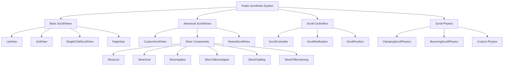

# 📜 Flutter 滚动控件深度解析：从基础到高级

> 通过丰富的图表、对比分析和实际案例，全面掌握 Flutter 滚动控件的使用技巧


## 📊 文章概览

| 章节                                                 | 内容            | 难度等级 |
| ---------------------------------------------------- | --------------- | -------- |
| [ListView 详解](#listview-详解)                      | 列表视图控件    | ⭐⭐⭐   |
| [GridView 详解](#gridview-详解)                      | 网格视图控件    | ⭐⭐⭐   |
| [CustomScrollView](#customscrollview-和-sliver-系列) | 自定义滚动视图  | ⭐⭐⭐⭐ |
| [Sliver 系列控件](#sliver-系列控件)                  | Sliver 组件详解 | ⭐⭐⭐⭐ |
| [性能优化](#性能优化)                                | 滚动性能优化    | ⭐⭐⭐⭐ |

## 🎯 学习目标

- ✅ 掌握各种滚动控件的核心概念和使用方法
- ✅ 学会 ScrollController 的配置和控制
- ✅ 理解 Sliver 系列控件的高级用法
- ✅ 能够实现复杂的滚动界面
- ✅ 掌握性能优化和最佳实践

## 📋 目录导航

<details>
<summary>🎯 快速导航</summary>

- [ListView 详解](#listview-详解) - 列表视图控件
- [GridView 详解](#gridview-详解) - 网格视图控件
- [CustomScrollView](#customscrollview-和-sliver-系列) - 自定义滚动视图
- [Sliver 系列控件](#sliver-系列控件) - Sliver 组件详解
- [性能优化](#性能优化) - 滚动性能优化
- [实际应用场景](#实际应用场景) - 真实项目案例

</details>

---

## 📋 概述

Flutter 提供了丰富的滚动控件来处理超出屏幕范围的内容。本文将详细介绍 ListView、GridView、CustomScrollView、Sliver 系列控件以及 PageView 的使用方法和最佳实践。

## 🏗️ 滚动控件架构图



### 📊 滚动控件特性对比

| 控件类型             | 主要用途   | 性能     | 灵活性     | 复杂度     | 适用场景     |
| -------------------- | ---------- | -------- | ---------- | ---------- | ------------ |
| **ListView**         | 垂直列表   | ⭐⭐⭐⭐ | ⭐⭐⭐     | ⭐⭐       | 简单列表     |
| **GridView**         | 网格布局   | ⭐⭐⭐⭐ | ⭐⭐⭐     | ⭐⭐       | 图片网格     |
| **CustomScrollView** | 自定义滚动 | ⭐⭐⭐   | ⭐⭐⭐⭐⭐ | ⭐⭐⭐⭐⭐ | 复杂布局     |
| **PageView**         | 页面切换   | ⭐⭐⭐⭐ | ⭐⭐⭐⭐   | ⭐⭐⭐     | 引导页、轮播 |
| **Sliver 系列**      | 高级滚动   | ⭐⭐⭐   | ⭐⭐⭐⭐⭐ | ⭐⭐⭐⭐⭐ | 特殊需求     |

## ListView 详解

### 基础用法

````dart
// 基础 ListView
class BasicListView extends StatelessWidget {
  @override
  Widget build(BuildContext context) {
    return ListView(
      children: [
        ListTile(
          leading: Icon(Icons.person),
          title: Text('用户1'),
          subtitle: Text('在线'),
          trailing: Icon(Icons.more_vert),
        ),
        ListTile(
          leading: Icon(Icons.person),
          title: Text('用户2'),
          subtitle: Text('离线'),
          trailing: Icon(Icons.more_vert),
        ),
        // 更多项目...
      ],
    );
  }
}

// ListView.builder - 适用于大量数据
class BuilderListView extends StatelessWidget {
  final List<String> items = List.generate(1000, (index) => '项目 $index');

  @override
  Widget build(BuildContext context) {
    return ListView.builder(
      itemCount: items.length,
      itemBuilder: (context, index) {
        return Card(
          margin: EdgeInsets.symmetric(horizontal: 16, vertical: 4),
          child: ListTile(
            leading: CircleAvatar(
              child: Text('${index + 1}'),
            ),
            title: Text(items[index]),
            subtitle: Text('描述信息 $index'),
            onTap: () {
              ScaffoldMessenger.of(context).showSnackBar(
                SnackBar(content: Text('点击了 ${items[index]}')),
              );
            },
          ),
        );
      },
    );
  }
}

## CustomScrollView 和 Sliver 系列

### CustomScrollView 基础用法

```dart
// CustomScrollView 组合多种滚动组件
class CustomScrollViewExample extends StatelessWidget {
  @override
  Widget build(BuildContext context) {
    return CustomScrollView(
      slivers: [
        // 可折叠的应用栏
        SliverAppBar(
          expandedHeight: 200,
          floating: false,
          pinned: true,
          flexibleSpace: FlexibleSpaceBar(
            title: Text('自定义滚动视图'),
            background: Container(
              decoration: BoxDecoration(
                gradient: LinearGradient(
                  begin: Alignment.topLeft,
                  end: Alignment.bottomRight,
                  colors: [Colors.blue, Colors.purple],
                ),
              ),
            ),
          ),
        ),

        // 固定内容
        SliverToBoxAdapter(
          child: Container(
            height: 100,
            color: Colors.amber[100],
            child: Center(
              child: Text(
                '固定内容区域',
                style: TextStyle(fontSize: 18, fontWeight: FontWeight.bold),
              ),
            ),
          ),
        ),

        // 列表
        SliverList(
          delegate: SliverChildBuilderDelegate(
            (context, index) {
              return ListTile(
                leading: CircleAvatar(
                  child: Text('${index + 1}'),
                ),
                title: Text('列表项 ${index + 1}'),
                subtitle: Text('这是第 ${index + 1} 个列表项'),
              );
            },
            childCount: 10,
          ),
        ),

        // 网格
        SliverGrid(
          gridDelegate: SliverGridDelegateWithFixedCrossAxisCount(
            crossAxisCount: 2,
            crossAxisSpacing: 10,
            mainAxisSpacing: 10,
          ),
          delegate: SliverChildBuilderDelegate(
            (context, index) {
              return Container(
                decoration: BoxDecoration(
                  color: Colors.teal[100 * (index % 9 + 1)],
                  borderRadius: BorderRadius.circular(8),
                ),
                child: Center(
                  child: Text(
                    '网格 $index',
                    style: TextStyle(fontWeight: FontWeight.bold),
                  ),
                ),
              );
            },
            childCount: 6,
          ),
        ),

        // 填充剩余空间
        SliverFillRemaining(
          child: Container(
            color: Colors.grey[100],
            child: Center(
              child: Text(
                '填充剩余空间',
                style: TextStyle(fontSize: 16),
              ),
            ),
          ),
        ),
      ],
    );
  }
}
````

## PageView 详解

### 基础 PageView

```dart
// 基础页面视图
class BasicPageView extends StatefulWidget {
  @override
  _BasicPageViewState createState() => _BasicPageViewState();
}

class _BasicPageViewState extends State<BasicPageView> {
  PageController _pageController = PageController();
  int _currentPage = 0;

  final List<PageData> pages = [
    PageData(
      title: '欢迎使用',
      description: '这是一个功能强大的应用',
      color: Colors.blue,
      icon: Icons.star,
    ),
    PageData(
      title: '简单易用',
      description: '直观的用户界面设计',
      color: Colors.green,
      icon: Icons.thumb_up,
    ),
    PageData(
      title: '开始体验',
      description: '立即开始您的旅程',
      color: Colors.orange,
      icon: Icons.rocket_launch,
    ),
  ];

  @override
  Widget build(BuildContext context) {
    return Scaffold(
      body: Column(
        children: [
          Expanded(
            child: PageView.builder(
              controller: _pageController,
              onPageChanged: (index) {
                setState(() {
                  _currentPage = index;
                });
              },
              itemCount: pages.length,
              itemBuilder: (context, index) {
                final page = pages[index];
                return Container(
                  decoration: BoxDecoration(
                    gradient: LinearGradient(
                      begin: Alignment.topCenter,
                      end: Alignment.bottomCenter,
                      colors: [
                        page.color.withOpacity(0.8),
                        page.color.withOpacity(0.6),
                      ],
                    ),
                  ),
                  child: SafeArea(
                    child: Padding(
                      padding: EdgeInsets.all(32),
                      child: Column(
                        mainAxisAlignment: MainAxisAlignment.center,
                        children: [
                          Icon(
                            page.icon,
                            size: 100,
                            color: Colors.white,
                          ),
                          SizedBox(height: 32),
                          Text(
                            page.title,
                            style: TextStyle(
                              fontSize: 28,
                              fontWeight: FontWeight.bold,
                              color: Colors.white,
                            ),
                            textAlign: TextAlign.center,
                          ),
                          SizedBox(height: 16),
                          Text(
                            page.description,
                            style: TextStyle(
                              fontSize: 16,
                              color: Colors.white.withOpacity(0.9),
                            ),
                            textAlign: TextAlign.center,
                          ),
                        ],
                      ),
                    ),
                  ),
                );
              },
            ),
          ),

          // 页面指示器
          Container(
            padding: EdgeInsets.all(20),
            child: Row(
              mainAxisAlignment: MainAxisAlignment.center,
              children: List.generate(
                pages.length,
                (index) => Container(
                  margin: EdgeInsets.symmetric(horizontal: 4),
                  width: _currentPage == index ? 12 : 8,
                  height: 8,
                  decoration: BoxDecoration(
                    color: _currentPage == index
                        ? pages[_currentPage].color
                        : Colors.grey[300],
                    borderRadius: BorderRadius.circular(4),
                  ),
                ),
              ),
            ),
          ),

          // 导航按钮
          Padding(
            padding: EdgeInsets.all(20),
            child: Row(
              mainAxisAlignment: MainAxisAlignment.spaceBetween,
              children: [
                if (_currentPage > 0)
                  TextButton(
                    onPressed: () {
                      _pageController.previousPage(
                        duration: Duration(milliseconds: 300),
                        curve: Curves.easeInOut,
                      );
                    },
                    child: Text('上一页'),
                  )
                else
                  SizedBox(width: 80),

                if (_currentPage < pages.length - 1)
                  ElevatedButton(
                    onPressed: () {
                      _pageController.nextPage(
                        duration: Duration(milliseconds: 300),
                        curve: Curves.easeInOut,
                      );
                    },
                    child: Text('下一页'),
                  )
                else
                  ElevatedButton(
                    onPressed: () {
                      // 完成引导
                      Navigator.of(context).pushReplacementNamed('/home');
                    },
                    child: Text('开始使用'),
                  ),
              ],
            ),
          ),
        ],
      ),
    );
  }

  @override
  void dispose() {
    _pageController.dispose();
    super.dispose();
  }
}

class PageData {
  final String title;
  final String description;
  final Color color;
  final IconData icon;

  PageData({
    required this.title,
    required this.description,
    required this.color,
    required this.icon,
  });
}
```

### 高级 PageView 用法

```dart
// 卡片式 PageView
class CardPageView extends StatefulWidget {
  @override
  _CardPageViewState createState() => _CardPageViewState();
}

class _CardPageViewState extends State<CardPageView> {
  PageController _pageController = PageController(
    viewportFraction: 0.8, // 显示部分相邻页面
    initialPage: 0,
  );

  int _currentPage = 0;

  final List<CardData> cards = List.generate(10, (index) => CardData(
    title: '卡片 ${index + 1}',
    subtitle: '这是第 ${index + 1} 张卡片',
    color: Colors.primaries[index % Colors.primaries.length],
  ));

  @override
  Widget build(BuildContext context) {
    return Scaffold(
      appBar: AppBar(title: Text('卡片式 PageView')),
      body: Column(
        children: [
          SizedBox(height: 20),
          Container(
            height: 300,
            child: PageView.builder(
              controller: _pageController,
              onPageChanged: (index) {
                setState(() {
                  _currentPage = index;
                });
              },
              itemCount: cards.length,
              itemBuilder: (context, index) {
                final card = cards[index];
                return AnimatedBuilder(
                  animation: _pageController,
                  builder: (context, child) {
                    double value = 1.0;
                    if (_pageController.position.haveDimensions) {
                      value = _pageController.page! - index;
                      value = (1 - (value.abs() * 0.3)).clamp(0.0, 1.0);
                    }

                    return Center(
                      child: SizedBox(
                        height: Curves.easeOut.transform(value) * 300,
                        width: Curves.easeOut.transform(value) * 250,
                        child: child,
                      ),
                    );
                  },
                  child: Container(
                    margin: EdgeInsets.symmetric(horizontal: 10),
                    decoration: BoxDecoration(
                      color: card.color,
                      borderRadius: BorderRadius.circular(16),
                      boxShadow: [
                        BoxShadow(
                          color: Colors.black26,
                          blurRadius: 10,
                          offset: Offset(0, 5),
                        ),
                      ],
                    ),
                    child: Center(
                      child: Column(
                        mainAxisAlignment: MainAxisAlignment.center,
                        children: [
                          Text(
                            card.title,
                            style: TextStyle(
                              fontSize: 24,
                              fontWeight: FontWeight.bold,
                              color: Colors.white,
                            ),
                          ),
                          SizedBox(height: 10),
                          Text(
                            card.subtitle,
                            style: TextStyle(
                              fontSize: 16,
                              color: Colors.white.withOpacity(0.8),
                            ),
                          ),
                        ],
                      ),
                    ),
                  ),
                );
              },
            ),
          ),

          SizedBox(height: 20),

          // 页面指示器
          Row(
            mainAxisAlignment: MainAxisAlignment.center,
            children: List.generate(
              cards.length,
              (index) => Container(
                margin: EdgeInsets.symmetric(horizontal: 3),
                width: _currentPage == index ? 12 : 8,
                height: 8,
                decoration: BoxDecoration(
                  color: _currentPage == index
                      ? cards[_currentPage].color
                      : Colors.grey[300],
                  borderRadius: BorderRadius.circular(4),
                ),
              ),
            ),
          ),
        ],
      ),
    );
  }

  @override
  void dispose() {
    _pageController.dispose();
    super.dispose();
  }
}

class CardData {
  final String title;
  final String subtitle;
  final Color color;

  CardData({
    required this.title,
    required this.subtitle,
    required this.color,
  });
}
```

## 滚动监听和控制

### ScrollController 使用

```dart
// 滚动控制器示例
class ScrollControllerExample extends StatefulWidget {
  @override
  _ScrollControllerExampleState createState() => _ScrollControllerExampleState();
}

class _ScrollControllerExampleState extends State<ScrollControllerExample> {
  ScrollController _scrollController = ScrollController();
  bool _showBackToTop = false;
  double _scrollProgress = 0.0;

  @override
  void initState() {
    super.initState();
    _scrollController.addListener(_scrollListener);
  }

  void _scrollListener() {
    setState(() {
      // 计算滚动进度
      if (_scrollController.position.maxScrollExtent > 0) {
        _scrollProgress = _scrollController.offset /
            _scrollController.position.maxScrollExtent;
      }

      // 显示/隐藏回到顶部按钮
      _showBackToTop = _scrollController.offset > 200;
    });
  }

  void _scrollToTop() {
    _scrollController.animateTo(
      0,
      duration: Duration(milliseconds: 500),
      curve: Curves.easeInOut,
    );
  }

  void _scrollToBottom() {
    _scrollController.animateTo(
      _scrollController.position.maxScrollExtent,
      duration: Duration(milliseconds: 500),
      curve: Curves.easeInOut,
    );
  }

  @override
  Widget build(BuildContext context) {
    return Scaffold(
      appBar: AppBar(
        title: Text('滚动控制器示例'),
        bottom: PreferredSize(
          preferredSize: Size.fromHeight(4),
          child: LinearProgressIndicator(
            value: _scrollProgress,
            backgroundColor: Colors.transparent,
            valueColor: AlwaysStoppedAnimation<Color>(Colors.white),
          ),
        ),
      ),
      body: Stack(
        children: [
          ListView.builder(
            controller: _scrollController,
            itemCount: 100,
            itemBuilder: (context, index) {
              return Card(
                margin: EdgeInsets.symmetric(horizontal: 16, vertical: 4),
                child: ListTile(
                  leading: CircleAvatar(
                    child: Text('${index + 1}'),
                  ),
                  title: Text('项目 ${index + 1}'),
                  subtitle: Text('这是第 ${index + 1} 个项目的描述'),
                  trailing: Icon(Icons.arrow_forward_ios),
                ),
              );
            },
          ),

          // 滚动控制按钮
          Positioned(
            right: 16,
            bottom: 80,
            child: Column(
              children: [
                if (_showBackToTop)
                  FloatingActionButton(
                    mini: true,
                    onPressed: _scrollToTop,
                    child: Icon(Icons.keyboard_arrow_up),
                    heroTag: 'top',
                  ),
                SizedBox(height: 8),
                FloatingActionButton(
                  mini: true,
                  onPressed: _scrollToBottom,
                  child: Icon(Icons.keyboard_arrow_down),
                  heroTag: 'bottom',
                ),
              ],
            ),
          ),
        ],
      ),
    );
  }

  @override
  void dispose() {
    _scrollController.removeListener(_scrollListener);
    _scrollController.dispose();
    super.dispose();
  }
}
```

### ScrollNotification 监听

```dart
// 滚动通知监听
class ScrollNotificationExample extends StatefulWidget {
  @override
  _ScrollNotificationExampleState createState() => _ScrollNotificationExampleState();
}

class _ScrollNotificationExampleState extends State<ScrollNotificationExample> {
  String _scrollInfo = '滚动信息将在这里显示';
  bool _isScrolling = false;

  @override
  Widget build(BuildContext context) {
    return Scaffold(
      appBar: AppBar(
        title: Text('滚动通知监听'),
      ),
      body: Column(
        children: [
          Container(
            padding: EdgeInsets.all(16),
            color: _isScrolling ? Colors.blue[50] : Colors.grey[50],
            child: Column(
              crossAxisAlignment: CrossAxisAlignment.start,
              children: [
                Text(
                  '滚动状态: ${_isScrolling ? "滚动中" : "静止"}',
                  style: TextStyle(
                    fontWeight: FontWeight.bold,
                    color: _isScrolling ? Colors.blue : Colors.grey[600],
                  ),
                ),
                SizedBox(height: 8),
                Text(_scrollInfo),
              ],
            ),
          ),

          Expanded(
            child: NotificationListener<ScrollNotification>(
              onNotification: (ScrollNotification notification) {
                setState(() {
                  if (notification is ScrollStartNotification) {
                    _isScrolling = true;
                    _scrollInfo = '开始滚动 - 滚动方向: ${notification.dragDetails?.globalPosition}';
                  } else if (notification is ScrollUpdateNotification) {
                    _scrollInfo = '滚动中 - 当前位置: ${notification.metrics.pixels.toStringAsFixed(1)}, '
                        '最大滚动: ${notification.metrics.maxScrollExtent.toStringAsFixed(1)}, '
                        '滚动比例: ${(notification.metrics.pixels / notification.metrics.maxScrollExtent * 100).toStringAsFixed(1)}%';
                  } else if (notification is ScrollEndNotification) {
                    _isScrolling = false;
                    _scrollInfo = '滚动结束 - 最终位置: ${notification.metrics.pixels.toStringAsFixed(1)}';
                  } else if (notification is OverscrollNotification) {
                    _scrollInfo = '过度滚动 - 过度量: ${notification.overscroll.toStringAsFixed(1)}';
                  }
                });
                return true; // 返回 true 表示消费了这个通知
              },
              child: ListView.builder(
                itemCount: 50,
                itemBuilder: (context, index) {
                  return Container(
                    height: 80,
                    margin: EdgeInsets.symmetric(horizontal: 16, vertical: 4),
                    decoration: BoxDecoration(
                      color: Colors.blue[50],
                      borderRadius: BorderRadius.circular(8),
                      border: Border.all(color: Colors.blue[200]!),
                    ),
                    child: Center(
                      child: Text(
                        '项目 ${index + 1}',
                        style: TextStyle(
                          fontSize: 16,
                          fontWeight: FontWeight.w500,
                        ),
                      ),
                    ),
                  );
                },
              ),
            ),
          ),
        ],
      ),
    );
  }
}
```

## 性能优化

### ListView 性能优化

```dart
// 优化的 ListView 实现
class OptimizedListView extends StatelessWidget {
  final List<String> items;

  const OptimizedListView({Key? key, required this.items}) : super(key: key);

  @override
  Widget build(BuildContext context) {
    return ListView.builder(
      // 1. 设置合适的 itemExtent 提高性能
      itemExtent: 80.0,

      // 2. 启用缓存扩展
      cacheExtent: 200.0,

      // 3. 使用 addAutomaticKeepAlives: false 减少内存占用
      addAutomaticKeepAlives: false,
      addRepaintBoundaries: true,
      addSemanticIndexes: true,

      itemCount: items.length,
      itemBuilder: (context, index) {
        // 4. 使用 RepaintBoundary 包装复杂项目
        return RepaintBoundary(
          child: _OptimizedListItem(
            key: ValueKey(items[index]),
            title: items[index],
            index: index,
          ),
        );
      },
    );
  }
}

class _OptimizedListItem extends StatelessWidget {
  final String title;
  final int index;

  const _OptimizedListItem({
    Key? key,
    required this.title,
    required this.index,
  }) : super(key: key);

  @override
  Widget build(BuildContext context) {
    return Container(
      height: 80,
      margin: EdgeInsets.symmetric(horizontal: 16, vertical: 4),
      decoration: BoxDecoration(
        color: Colors.white,
        borderRadius: BorderRadius.circular(8),
        boxShadow: [
          BoxShadow(
            color: Colors.grey.withOpacity(0.1),
            blurRadius: 4,
            offset: Offset(0, 2),
          ),
        ],
      ),
      child: ListTile(
        leading: CircleAvatar(
          child: Text('${index + 1}'),
        ),
        title: Text(title),
        subtitle: Text('优化的列表项 $index'),
        trailing: Icon(Icons.arrow_forward_ios),
      ),
    );
  }
}
```

### 懒加载和分页

```dart
// 懒加载列表
class LazyLoadListView extends StatefulWidget {
  @override
  _LazyLoadListViewState createState() => _LazyLoadListViewState();
}

class _LazyLoadListViewState extends State<LazyLoadListView> {
  List<String> _items = [];
  bool _isLoading = false;
  bool _hasMore = true;
  ScrollController _scrollController = ScrollController();

  @override
  void initState() {
    super.initState();
    _loadMoreItems();
    _scrollController.addListener(_scrollListener);
  }

  void _scrollListener() {
    if (_scrollController.position.pixels >=
        _scrollController.position.maxScrollExtent - 200) {
      _loadMoreItems();
    }
  }

  Future<void> _loadMoreItems() async {
    if (_isLoading || !_hasMore) return;

    setState(() {
      _isLoading = true;
    });

    // 模拟网络请求
    await Future.delayed(Duration(seconds: 1));

    final newItems = List.generate(20, (index) =>
        '项目 ${_items.length + index + 1}');

    setState(() {
      _items.addAll(newItems);
      _isLoading = false;

      // 模拟数据加载完毕
      if (_items.length >= 100) {
        _hasMore = false;
      }
    });
  }

  @override
  Widget build(BuildContext context) {
    return Scaffold(
      appBar: AppBar(title: Text('懒加载列表')),
      body: RefreshIndicator(
        onRefresh: () async {
          setState(() {
            _items.clear();
            _hasMore = true;
          });
          await _loadMoreItems();
        },
        child: ListView.builder(
          controller: _scrollController,
          itemCount: _items.length + (_hasMore ? 1 : 0),
          itemBuilder: (context, index) {
            if (index == _items.length) {
              // 加载指示器
              return Container(
                padding: EdgeInsets.all(16),
                alignment: Alignment.center,
                child: _isLoading
                    ? CircularProgressIndicator()
                    : Text('没有更多数据了'),
              );
            }

            return ListTile(
              leading: CircleAvatar(
                child: Text('${index + 1}'),
              ),
              title: Text(_items[index]),
              subtitle: Text('懒加载项目 $index'),
            );
          },
        ),
      ),
    );
  }

  @override
  void dispose() {
    _scrollController.removeListener(_scrollListener);
    _scrollController.dispose();
    super.dispose();
  }
}
```

## 实际应用场景

### 聊天界面

```dart
// 聊天界面实现
class ChatListView extends StatefulWidget {
  @override
  _ChatListViewState createState() => _ChatListViewState();
}

class _ChatListViewState extends State<ChatListView> {
  List<ChatMessage> _messages = [];
  ScrollController _scrollController = ScrollController();
  TextEditingController _textController = TextEditingController();

  @override
  void initState() {
    super.initState();
    _loadInitialMessages();
  }

  void _loadInitialMessages() {
    _messages = [
      ChatMessage(text: '你好！', isMe: false, timestamp: DateTime.now().subtract(Duration(minutes: 5))),
      ChatMessage(text: '你好，有什么可以帮助你的吗？', isMe: true, timestamp: DateTime.now().subtract(Duration(minutes: 4))),
      ChatMessage(text: '我想了解一下Flutter的滚动控件', isMe: false, timestamp: DateTime.now().subtract(Duration(minutes: 3))),
      ChatMessage(text: 'Flutter提供了丰富的滚动控件，包括ListView、GridView、CustomScrollView等', isMe: true, timestamp: DateTime.now().subtract(Duration(minutes: 2))),
    ];
    setState(() {});
  }

  void _sendMessage() {
    if (_textController.text.trim().isEmpty) return;

    final message = ChatMessage(
      text: _textController.text,
      isMe: false,
      timestamp: DateTime.now(),
    );

    setState(() {
      _messages.add(message);
    });

    _textController.clear();

    // 滚动到底部
    WidgetsBinding.instance.addPostFrameCallback((_) {
      _scrollController.animateTo(
        _scrollController.position.maxScrollExtent,
        duration: Duration(milliseconds: 300),
        curve: Curves.easeOut,
      );
    });
  }

  @override
  Widget build(BuildContext context) {
    return Scaffold(
      appBar: AppBar(
        title: Text('聊天'),
        backgroundColor: Colors.blue,
      ),
      body: Column(
        children: [
          Expanded(
            child: ListView.builder(
              controller: _scrollController,
              padding: EdgeInsets.all(16),
              itemCount: _messages.length,
              itemBuilder: (context, index) {
                final message = _messages[index];
                return _ChatBubble(message: message);
              },
            ),
          ),

          // 输入框
          Container(
            padding: EdgeInsets.all(16),
            decoration: BoxDecoration(
              color: Colors.white,
              boxShadow: [
                BoxShadow(
                  color: Colors.grey.withOpacity(0.2),
                  blurRadius: 4,
                  offset: Offset(0, -2),
                ),
              ],
            ),
            child: Row(
              children: [
                Expanded(
                  child: TextField(
                    controller: _textController,
                    decoration: InputDecoration(
                      hintText: '输入消息...',
                      border: OutlineInputBorder(
                        borderRadius: BorderRadius.circular(24),
                      ),
                      contentPadding: EdgeInsets.symmetric(
                        horizontal: 16,
                        vertical: 8,
                      ),
                    ),
                    onSubmitted: (_) => _sendMessage(),
                  ),
                ),
                SizedBox(width: 8),
                FloatingActionButton(
                  mini: true,
                  onPressed: _sendMessage,
                  child: Icon(Icons.send),
                ),
              ],
            ),
          ),
        ],
      ),
    );
  }

  @override
  void dispose() {
    _scrollController.dispose();
    _textController.dispose();
    super.dispose();
  }
}

class _ChatBubble extends StatelessWidget {
  final ChatMessage message;

  const _ChatBubble({required this.message});

  @override
  Widget build(BuildContext context) {
    return Padding(
      padding: EdgeInsets.symmetric(vertical: 4),
      child: Row(
        mainAxisAlignment: message.isMe
            ? MainAxisAlignment.end
            : MainAxisAlignment.start,
        children: [
          if (!message.isMe) ..[
            CircleAvatar(
              radius: 16,
              child: Icon(Icons.person, size: 16),
            ),
            SizedBox(width: 8),
          ],

          Flexible(
            child: Container(
              padding: EdgeInsets.symmetric(horizontal: 16, vertical: 10),
              decoration: BoxDecoration(
                color: message.isMe ? Colors.blue : Colors.grey[200],
                borderRadius: BorderRadius.circular(18),
              ),
              child: Column(
                crossAxisAlignment: CrossAxisAlignment.start,
                children: [
                  Text(
                    message.text,
                    style: TextStyle(
                      color: message.isMe ? Colors.white : Colors.black87,
                    ),
                  ),
                  SizedBox(height: 4),
                  Text(
                    '${message.timestamp.hour}:${message.timestamp.minute.toString().padLeft(2, '0')}',
                    style: TextStyle(
                      fontSize: 12,
                      color: message.isMe
                          ? Colors.white.withOpacity(0.7)
                          : Colors.grey[600],
                    ),
                  ),
                ],
              ),
            ),
          ),

          if (message.isMe) ..[
            SizedBox(width: 8),
            CircleAvatar(
              radius: 16,
              backgroundColor: Colors.blue,
              child: Icon(Icons.person, size: 16, color: Colors.white),
            ),
          ],
        ],
      ),
    );
  }
}

class ChatMessage {
  final String text;
  final bool isMe;
  final DateTime timestamp;

  ChatMessage({
    required this.text,
    required this.isMe,
    required this.timestamp,
  });
}
```

## 最佳实践

### 1. 性能优化建议

- **使用 `ListView.builder`** 而不是 `ListView` 来处理大量数据
- **设置 `itemExtent`** 当所有项目高度相同时，可以显著提高性能
- **使用 `RepaintBoundary`** 包装复杂的列表项，避免不必要的重绘
- **合理设置 `cacheExtent`** 控制缓存区域大小
- **避免在 `itemBuilder` 中进行复杂计算**

### 2. 内存管理

- **及时释放 ScrollController**
- **使用 `addAutomaticKeepAlives: false`** 减少内存占用
- **实现懒加载和分页** 避免一次性加载大量数据

### 3. 用户体验

- **添加加载指示器** 让用户了解数据加载状态
- **实现下拉刷新** 提供数据更新功能
- **合理的滚动动画** 使用适当的 Curve 和 Duration
- **提供滚动位置指示** 如进度条或回到顶部按钮

### 4. 响应式设计

- **根据屏幕尺寸调整列数** 在 GridView 中使用 LayoutBuilder
- **适配不同设备** 考虑平板和手机的不同显示需求
- **处理横竖屏切换** 保持滚动位置和状态

## 总结

Flutter 的滚动控件提供了强大而灵活的解决方案：

1. **ListView** - 适用于线性列表，支持动态和静态内容
2. **GridView** - 适用于网格布局，支持响应式设计
3. **CustomScrollView + Sliver** - 适用于复杂的滚动效果和组合布局
4. **PageView** - 适用于页面切换和引导界面
5. **滚动监听** - 提供丰富的滚动状态和控制能力

通过合理使用这些控件和优化技巧，可以创建流畅、高性能的滚动界面，提供优秀的用户体验。

---

**下一步学习：** [TabBar 和 PageView 详解](./tabbar-pageview.md)

### 高级 Sliver 用法

```dart
// 自定义 Sliver 组件
class SliverHeaderDelegate extends SliverPersistentHeaderDelegate {
  final double minHeight;
  final double maxHeight;
  final Widget child;

  SliverHeaderDelegate({
    required this.minHeight,
    required this.maxHeight,
    required this.child,
  });

  @override
  double get minExtent => minHeight;

  @override
  double get maxExtent => maxHeight;

  @override
  Widget build(BuildContext context, double shrinkOffset, bool overlapsContent) {
    return SizedBox.expand(child: child);
  }

  @override
  bool shouldRebuild(SliverHeaderDelegate oldDelegate) {
    return maxHeight != oldDelegate.maxHeight ||
        minHeight != oldDelegate.minHeight ||
        child != oldDelegate.child;
  }
}

// 使用自定义 Sliver
class AdvancedSliverExample extends StatelessWidget {
  @override
  Widget build(BuildContext context) {
    return CustomScrollView(
      slivers: [
        // 自定义持久化头部
        SliverPersistentHeader(
          pinned: true,
          delegate: SliverHeaderDelegate(
            minHeight: 60,
            maxHeight: 120,
            child: Container(
              decoration: BoxDecoration(
                gradient: LinearGradient(
                  colors: [Colors.orange, Colors.red],
                ),
              ),
              child: Center(
                child: Text(
                  '持久化头部',
                  style: TextStyle(
                    color: Colors.white,
                    fontSize: 20,
                    fontWeight: FontWeight.bold,
                  ),
                ),
              ),
            ),
          ),
        ),

        // 带内边距的 Sliver
        SliverPadding(
          padding: EdgeInsets.all(16),
          sliver: SliverList(
            delegate: SliverChildListDelegate([
              Card(
                child: Padding(
                  padding: EdgeInsets.all(16),
                  child: Text('带内边距的卡片 1'),
                ),
              ),
              Card(
                child: Padding(
                  padding: EdgeInsets.all(16),
                  child: Text('带内边距的卡片 2'),
                ),
              ),
            ]),
          ),
        ),

        // 动态 Sliver 列表
        SliverList(
          delegate: SliverChildBuilderDelegate(
            (context, index) {
              return Container(
                height: 80,
                margin: EdgeInsets.symmetric(horizontal: 16, vertical: 4),
                decoration: BoxDecoration(
                  color: Colors.blue[50],
                  borderRadius: BorderRadius.circular(8),
                  border: Border.all(color: Colors.blue[200]!),
                ),
                child: Center(
                  child: Text(
                    '动态项目 ${index + 1}',
                    style: TextStyle(
                      fontSize: 16,
                      fontWeight: FontWeight.w500,
                    ),
                  ),
                ),
              );
            },
            childCount: 20,
          ),
        ),
      ],
    );
  }
}
```

### ListView 高级用法

```dart
// 分组 ListView
class GroupedListView extends StatelessWidget {
  final Map<String, List<String>> groupedData = {
    '今天': ['消息1', '消息2', '消息3'],
    '昨天': ['消息4', '消息5'],
    '更早': ['消息6', '消息7', '消息8', '消息9'],
  };

  @override
  Widget build(BuildContext context) {
    return ListView.builder(
      itemCount: _getTotalItemCount(),
      itemBuilder: (context, index) {
        final item = _getItemAtIndex(index);

        if (item['isHeader']) {
          return Container(
            padding: EdgeInsets.symmetric(horizontal: 16, vertical: 8),
            color: Colors.grey[100],
            child: Text(
              item['data'],
              style: TextStyle(
                fontWeight: FontWeight.bold,
                color: Colors.grey[600],
              ),
            ),
          );
        } else {
          return ListTile(
            leading: Icon(Icons.message),
            title: Text(item['data']),
            subtitle: Text('详细内容...'),
          );
        }
      },
    );
  }

  int _getTotalItemCount() {
    int count = 0;
    groupedData.forEach((key, value) {
      count += 1 + value.length; // 1 for header + items
    });
    return count;
  }

  Map<String, dynamic> _getItemAtIndex(int index) {
    int currentIndex = 0;

    for (String group in groupedData.keys) {
      if (currentIndex == index) {
        return {'isHeader': true, 'data': group};
      }
      currentIndex++;

      for (String item in groupedData[group]!) {
        if (currentIndex == index) {
          return {'isHeader': false, 'data': item};
        }
        currentIndex++;
      }
    }

    return {'isHeader': false, 'data': ''};
  }
}
```

## GridView 详解

### 基础用法

```dart
// 固定列数的网格
class BasicGridView extends StatelessWidget {
  @override
  Widget build(BuildContext context) {
    return GridView.count(
      crossAxisCount: 2,
      crossAxisSpacing: 10,
      mainAxisSpacing: 10,
      padding: EdgeInsets.all(16),
      children: List.generate(20, (index) {
        return Container(
          decoration: BoxDecoration(
            color: Colors.blue[100 * (index % 9 + 1)],
            borderRadius: BorderRadius.circular(8),
          ),
          child: Center(
            child: Text(
              '项目 $index',
              style: TextStyle(
                fontSize: 16,
                fontWeight: FontWeight.bold,
              ),
            ),
          ),
        );
      }),
    );
  }
}

// 动态网格 - 适用于大量数据
class DynamicGridView extends StatelessWidget {
  final List<GridItem> items = List.generate(100, (index) => GridItem(
    id: index,
    title: '商品 $index',
    price: (index + 1) * 10.0,
    imageUrl: 'https://picsum.photos/200/200?random=$index',
  ));

  @override
  Widget build(BuildContext context) {
    return GridView.builder(
      gridDelegate: SliverGridDelegateWithFixedCrossAxisCount(
        crossAxisCount: 2,
        crossAxisSpacing: 10,
        mainAxisSpacing: 10,
        childAspectRatio: 0.8,
      ),
      padding: EdgeInsets.all(16),
      itemCount: items.length,
      itemBuilder: (context, index) {
        final item = items[index];
        return Card(
          elevation: 4,
          child: Column(
            crossAxisAlignment: CrossAxisAlignment.start,
            children: [
              Expanded(
                child: Container(
                  width: double.infinity,
                  decoration: BoxDecoration(
                    color: Colors.grey[300],
                    borderRadius: BorderRadius.vertical(
                      top: Radius.circular(4),
                    ),
                  ),
                  child: Icon(
                    Icons.image,
                    size: 50,
                    color: Colors.grey[600],
                  ),
                ),
              ),
              Padding(
                padding: EdgeInsets.all(8),
                child: Column(
                  crossAxisAlignment: CrossAxisAlignment.start,
                  children: [
                    Text(
                      item.title,
                      style: TextStyle(
                        fontWeight: FontWeight.bold,
                        fontSize: 14,
                      ),
                      maxLines: 1,
                      overflow: TextOverflow.ellipsis,
                    ),
                    SizedBox(height: 4),
                    Text(
                      '¥${item.price.toStringAsFixed(2)}',
                      style: TextStyle(
                        color: Colors.red,
                        fontWeight: FontWeight.bold,
                      ),
                    ),
                  ],
                ),
              ),
            ],
          ),
        );
      },
    );
  }
}

class GridItem {
  final int id;
  final String title;
  final double price;
  final String imageUrl;

  GridItem({
    required this.id,
    required this.title,
    required this.price,
    required this.imageUrl,
  });
}
```

### 响应式网格

```dart
// 响应式网格布局
class ResponsiveGridView extends StatelessWidget {
  @override
  Widget build(BuildContext context) {
    return LayoutBuilder(
      builder: (context, constraints) {
        // 根据屏幕宽度计算列数
        int crossAxisCount;
        if (constraints.maxWidth < 600) {
          crossAxisCount = 2;
        } else if (constraints.maxWidth < 900) {
          crossAxisCount = 3;
        } else {
          crossAxisCount = 4;
        }

        return GridView.builder(
          gridDelegate: SliverGridDelegateWithFixedCrossAxisCount(
            crossAxisCount: crossAxisCount,
            crossAxisSpacing: 10,
            mainAxisSpacing: 10,
            childAspectRatio: 1.2,
          ),
          padding: EdgeInsets.all(16),
          itemCount: 50,
          itemBuilder: (context, index) {
            return Card(
              child: Container(
                padding: EdgeInsets.all(16),
                child: Column(
                  mainAxisAlignment: MainAxisAlignment.center,
                  children: [
                    Icon(
                      Icons.star,
                      size: 40,
                      color: Colors.amber,
                    ),
                    SizedBox(height: 8),
                    Text(
                      '项目 $index',
                      style: TextStyle(fontWeight: FontWeight.bold),
                    ),
                  ],
                ),
              ),
            );
          },
        );
      },
    );
  }
}
```
