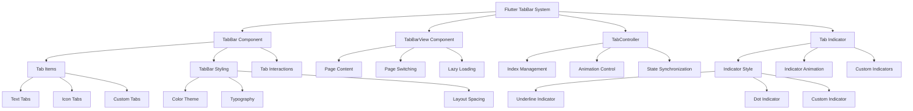

# 🏷️ Flutter TabBar 标签栏深度解析：从基础到高级

> 通过丰富的图表、对比分析和实际案例，全面掌握 Flutter TabBar 的使用技巧


## 📊 文章概览

| 章节                                        | 内容           | 难度等级 |
| ------------------------------------------- | -------------- | -------- |
| [基础 TabBar](#基础-tabbar)                 | 基础标签栏实现 | ⭐⭐     |
| [TabBarView 页面视图](#tabbarview-页面视图) | 标签页面切换   | ⭐⭐⭐   |
| [TabController 控制](#tabcontroller-控制)   | 标签控制器使用 | ⭐⭐⭐   |
| [自定义样式](#自定义样式)                   | 自定义标签样式 | ⭐⭐⭐⭐ |
| [实际应用场景](#实际应用场景)               | 真实项目案例   | ⭐⭐⭐⭐ |

## 🎯 学习目标

- ✅ 掌握 TabBar 的核心概念和使用方法
- ✅ 学会 TabController 的配置和控制
- ✅ 理解标签切换动画和样式定制
- ✅ 能够实现复杂的标签导航应用
- ✅ 掌握性能优化和最佳实践

## 📋 目录导航

<details>
<summary>🎯 快速导航</summary>

- [基础 TabBar](#基础-tabbar) - 基础标签栏实现
- [TabBarView 页面视图](#tabbarview-页面视图) - 标签页面切换
- [TabController 控制](#tabcontroller-控制) - 标签控制器使用
- [自定义样式](#自定义样式) - 自定义标签样式
- [实际应用场景](#实际应用场景) - 真实项目案例
- [性能优化](#性能优化) - 最佳实践

</details>

---

## 📋 概述

TabBar 是 Flutter 中用于实现标签导航的重要控件，通常与 TabBarView 配合使用，为用户提供直观的多页面切换体验。

## 🏗️ TabBar 架构图



### 📊 TabBar 特性对比

| 特性           | DefaultTabController | TabController | Custom TabBar |
| -------------- | -------------------- | ------------- | ------------- |
| **性能**       | ⭐⭐⭐⭐             | ⭐⭐⭐⭐⭐    | ⭐⭐⭐        |
| **灵活性**     | ⭐⭐                 | ⭐⭐⭐⭐      | ⭐⭐⭐⭐⭐    |
| **使用复杂度** | ⭐                   | ⭐⭐⭐        | ⭐⭐⭐⭐      |
| **状态管理**   | 自动                 | 手动          | 完全自定义    |
| **适用场景**   | 简单标签             | 复杂标签      | 特殊需求      |

## 基础 TabBar

### 1. 简单的 TabBar

```dart
import 'package:flutter/material.dart';

class BasicTabBarExample extends StatelessWidget {
  @override
  Widget build(BuildContext context) {
    return DefaultTabController(
      length: 3,
      child: Scaffold(
        appBar: AppBar(
          title: Text('基础 TabBar'),
          bottom: TabBar(
            tabs: [
              Tab(text: '首页'),
              Tab(text: '发现'),
              Tab(text: '我的'),
            ],
          ),
        ),
        body: TabBarView(
          children: [
            Center(child: Text('首页内容', style: TextStyle(fontSize: 24))),
            Center(child: Text('发现内容', style: TextStyle(fontSize: 24))),
            Center(child: Text('我的内容', style: TextStyle(fontSize: 24))),
          ],
        ),
      ),
    );
  }
}
```

### 2. 带图标的 TabBar

```dart
class IconTabBarExample extends StatelessWidget {
  @override
  Widget build(BuildContext context) {
    return DefaultTabController(
      length: 4,
      child: Scaffold(
        appBar: AppBar(
          title: Text('图标 TabBar'),
          bottom: TabBar(
            tabs: [
              Tab(
                icon: Icon(Icons.home),
                text: '首页',
              ),
              Tab(
                icon: Icon(Icons.search),
                text: '搜索',
              ),
              Tab(
                icon: Icon(Icons.favorite),
                text: '收藏',
              ),
              Tab(
                icon: Icon(Icons.person),
                text: '个人',
              ),
            ],
          ),
        ),
        body: TabBarView(
          children: [
            _buildTabContent('首页', Icons.home, Colors.blue),
            _buildTabContent('搜索', Icons.search, Colors.green),
            _buildTabContent('收藏', Icons.favorite, Colors.red),
            _buildTabContent('个人', Icons.person, Colors.orange),
          ],
        ),
      ),
    );
  }

  Widget _buildTabContent(String title, IconData icon, Color color) {
    return Container(
      color: color.withOpacity(0.1),
      child: Center(
        child: Column(
          mainAxisAlignment: MainAxisAlignment.center,
          children: [
            Icon(icon, size: 64, color: color),
            SizedBox(height: 16),
            Text(
              title,
              style: TextStyle(
                fontSize: 24,
                fontWeight: FontWeight.bold,
                color: color,
              ),
            ),
          ],
        ),
      ),
    );
  }
}
```

## 自定义 TabBar 样式

### 1. 自定义颜色和样式

```dart
class CustomStyledTabBar extends StatelessWidget {
  @override
  Widget build(BuildContext context) {
    return DefaultTabController(
      length: 3,
      child: Scaffold(
        appBar: AppBar(
          title: Text('自定义样式 TabBar'),
          backgroundColor: Colors.deepPurple,
          bottom: TabBar(
            // 指示器颜色
            indicatorColor: Colors.white,
            // 指示器权重
            indicatorWeight: 3.0,
            // 指示器大小
            indicatorSize: TabBarIndicatorSize.label,
            // 选中标签颜色
            labelColor: Colors.white,
            // 未选中标签颜色
            unselectedLabelColor: Colors.white70,
            // 标签样式
            labelStyle: TextStyle(
              fontSize: 16,
              fontWeight: FontWeight.bold,
            ),
            unselectedLabelStyle: TextStyle(
              fontSize: 14,
              fontWeight: FontWeight.normal,
            ),
            tabs: [
              Tab(text: '热门'),
              Tab(text: '推荐'),
              Tab(text: '最新'),
            ],
          ),
        ),
        body: TabBarView(
          children: [
            _buildContentList('热门内容', Colors.red),
            _buildContentList('推荐内容', Colors.blue),
            _buildContentList('最新内容', Colors.green),
          ],
        ),
      ),
    );
  }

  Widget _buildContentList(String category, Color color) {
    return ListView.builder(
      itemCount: 20,
      itemBuilder: (context, index) {
        return ListTile(
          leading: CircleAvatar(
            backgroundColor: color,
            child: Text('${index + 1}'),
          ),
          title: Text('$category 项目 ${index + 1}'),
          subtitle: Text('这是 $category 的第 ${index + 1} 个项目'),
          trailing: Icon(Icons.arrow_forward_ios),
        );
      },
    );
  }
}
```

### 2. 自定义指示器

```dart
class CustomIndicatorTabBar extends StatelessWidget {
  @override
  Widget build(BuildContext context) {
    return DefaultTabController(
      length: 4,
      child: Scaffold(
        appBar: AppBar(
          title: Text('自定义指示器'),
          bottom: TabBar(
            // 自定义指示器
            indicator: BoxDecoration(
              borderRadius: BorderRadius.circular(20),
              color: Colors.white,
            ),
            labelColor: Colors.blue,
            unselectedLabelColor: Colors.white,
            tabs: [
              Tab(text: '标签1'),
              Tab(text: '标签2'),
              Tab(text: '标签3'),
              Tab(text: '标签4'),
            ],
          ),
        ),
        body: TabBarView(
          children: [
            Container(color: Colors.red[100], child: Center(child: Text('页面1'))),
            Container(color: Colors.green[100], child: Center(child: Text('页面2'))),
            Container(color: Colors.blue[100], child: Center(child: Text('页面3'))),
            Container(color: Colors.orange[100], child: Center(child: Text('页面4'))),
          ],
        ),
      ),
    );
  }
}

// 自定义圆点指示器
class DotIndicator extends Decoration {
  final Color color;
  final double radius;

  const DotIndicator({
    this.color = Colors.blue,
    this.radius = 4.0,
  });

  @override
  BoxPainter createBoxPainter([VoidCallback? onChanged]) {
    return _DotPainter(color: color, radius: radius, onChanged: onChanged);
  }
}

class _DotPainter extends BoxPainter {
  final Color color;
  final double radius;

  _DotPainter({
    required this.color,
    required this.radius,
    VoidCallback? onChanged,
  }) : super(onChanged);

  @override
  void paint(Canvas canvas, Offset offset, ImageConfiguration configuration) {
    final Paint paint = Paint()
      ..color = color
      ..style = PaintingStyle.fill;

    final Offset center = Offset(
      offset.dx + configuration.size!.width / 2,
      offset.dy + configuration.size!.height - radius,
    );

    canvas.drawCircle(center, radius, paint);
  }
}
```

## 高级 TabBar 功能

### 1. 可滚动的 TabBar

```dart
class ScrollableTabBar extends StatelessWidget {
  final List<String> categories = [
    '推荐', '热点', '科技', '体育', '娱乐', '财经',
    '军事', '国际', '时尚', '游戏', '旅游', '教育'
  ];

  @override
  Widget build(BuildContext context) {
    return DefaultTabController(
      length: categories.length,
      child: Scaffold(
        appBar: AppBar(
          title: Text('可滚动 TabBar'),
          bottom: TabBar(
            // 启用滚动
            isScrollable: true,
            // 标签间距
            labelPadding: EdgeInsets.symmetric(horizontal: 20),
            tabs: categories.map((category) => Tab(text: category)).toList(),
          ),
        ),
        body: TabBarView(
          children: categories.map((category) {
            return Center(
              child: Column(
                mainAxisAlignment: MainAxisAlignment.center,
                children: [
                  Icon(Icons.category, size: 64, color: Colors.blue),
                  SizedBox(height: 16),
                  Text(
                    category,
                    style: TextStyle(fontSize: 24, fontWeight: FontWeight.bold),
                  ),
                  SizedBox(height: 8),
                  Text('这是 $category 分类的内容'),
                ],
              ),
            );
          }).toList(),
        ),
      ),
    );
  }
}
```

### 2. 手动控制的 TabBar

```dart
class ManualTabController extends StatefulWidget {
  @override
  _ManualTabControllerState createState() => _ManualTabControllerState();
}

class _ManualTabControllerState extends State<ManualTabController>
    with TickerProviderStateMixin {
  late TabController _tabController;
  int _currentIndex = 0;

  @override
  void initState() {
    super.initState();
    _tabController = TabController(length: 3, vsync: this);
    _tabController.addListener(_handleTabSelection);
  }

  void _handleTabSelection() {
    if (_tabController.indexIsChanging) {
      setState(() {
        _currentIndex = _tabController.index;
      });
    }
  }

  @override
  void dispose() {
    _tabController.dispose();
    super.dispose();
  }

  @override
  Widget build(BuildContext context) {
    return Scaffold(
      appBar: AppBar(
        title: Text('手动控制 TabBar'),
        bottom: TabBar(
          controller: _tabController,
          tabs: [
            Tab(icon: Icon(Icons.home), text: '首页'),
            Tab(icon: Icon(Icons.search), text: '搜索'),
            Tab(icon: Icon(Icons.person), text: '个人'),
          ],
        ),
      ),
      body: Column(
        children: [
          // 当前页面指示器
          Container(
            padding: EdgeInsets.all(16),
            child: Text(
              '当前页面: ${_getCurrentPageName()}',
              style: TextStyle(fontSize: 18, fontWeight: FontWeight.bold),
            ),
          ),
          // 手动切换按钮
          Row(
            mainAxisAlignment: MainAxisAlignment.spaceEvenly,
            children: [
              ElevatedButton(
                onPressed: () => _tabController.animateTo(0),
                child: Text('首页'),
              ),
              ElevatedButton(
                onPressed: () => _tabController.animateTo(1),
                child: Text('搜索'),
              ),
              ElevatedButton(
                onPressed: () => _tabController.animateTo(2),
                child: Text('个人'),
              ),
            ],
          ),
          // TabBarView
          Expanded(
            child: TabBarView(
              controller: _tabController,
              children: [
                _buildPageContent('首页', Icons.home, Colors.blue),
                _buildPageContent('搜索', Icons.search, Colors.green),
                _buildPageContent('个人', Icons.person, Colors.orange),
              ],
            ),
          ),
        ],
      ),
    );
  }

  String _getCurrentPageName() {
    switch (_currentIndex) {
      case 0:
        return '首页';
      case 1:
        return '搜索';
      case 2:
        return '个人';
      default:
        return '未知';
    }
  }

  Widget _buildPageContent(String title, IconData icon, Color color) {
    return Container(
      color: color.withOpacity(0.1),
      child: Center(
        child: Column(
          mainAxisAlignment: MainAxisAlignment.center,
          children: [
            Icon(icon, size: 64, color: color),
            SizedBox(height: 16),
            Text(
              title,
              style: TextStyle(
                fontSize: 24,
                fontWeight: FontWeight.bold,
                color: color,
              ),
            ),
          ],
        ),
      ),
    );
  }
}
```

## 实际应用案例

### 1. 新闻应用的分类标签

```dart
class NewsTabBar extends StatefulWidget {
  @override
  _NewsTabBarState createState() => _NewsTabBarState();
}

class _NewsTabBarState extends State<NewsTabBar>
    with TickerProviderStateMixin {
  late TabController _tabController;

  final List<NewsCategory> categories = [
    NewsCategory('推荐', Icons.recommend, Colors.red),
    NewsCategory('热点', Icons.whatshot, Colors.orange),
    NewsCategory('科技', Icons.computer, Colors.blue),
    NewsCategory('体育', Icons.sports_soccer, Colors.green),
    NewsCategory('娱乐', Icons.movie, Colors.purple),
  ];

  @override
  void initState() {
    super.initState();
    _tabController = TabController(length: categories.length, vsync: this);
  }

  @override
  void dispose() {
    _tabController.dispose();
    super.dispose();
  }

  @override
  Widget build(BuildContext context) {
    return Scaffold(
      appBar: AppBar(
        title: Text('新闻'),
        backgroundColor: Colors.white,
        foregroundColor: Colors.black,
        elevation: 0,
        bottom: TabBar(
          controller: _tabController,
          isScrollable: true,
          labelColor: Colors.red,
          unselectedLabelColor: Colors.grey,
          indicatorColor: Colors.red,
          indicatorWeight: 2,
          labelPadding: EdgeInsets.symmetric(horizontal: 16),
          tabs: categories.map((category) {
            return Tab(
              child: Row(
                mainAxisSize: MainAxisSize.min,
                children: [
                  Icon(category.icon, size: 16),
                  SizedBox(width: 4),
                  Text(category.name),
                ],
              ),
            );
          }).toList(),
        ),
      ),
      body: TabBarView(
        controller: _tabController,
        children: categories.map((category) {
          return _buildNewsList(category);
        }).toList(),
      ),
    );
  }

  Widget _buildNewsList(NewsCategory category) {
    return ListView.builder(
      padding: EdgeInsets.all(8),
      itemCount: 20,
      itemBuilder: (context, index) {
        return Card(
          margin: EdgeInsets.symmetric(vertical: 4),
          child: ListTile(
            leading: Container(
              width: 60,
              height: 60,
              decoration: BoxDecoration(
                color: category.color.withOpacity(0.1),
                borderRadius: BorderRadius.circular(8),
              ),
              child: Icon(category.icon, color: category.color),
            ),
            title: Text('${category.name}新闻标题 ${index + 1}'),
            subtitle: Text('这是一条关于${category.name}的新闻摘要...'),
            trailing: Text(
              '${DateTime.now().hour}:${DateTime.now().minute}',
              style: TextStyle(color: Colors.grey, fontSize: 12),
            ),
            onTap: () {
              // 处理新闻点击
              ScaffoldMessenger.of(context).showSnackBar(
                SnackBar(
                  content: Text('点击了${category.name}新闻 ${index + 1}'),
                ),
              );
            },
          ),
        );
      },
    );
  }
}

class NewsCategory {
  final String name;
  final IconData icon;
  final Color color;

  NewsCategory(this.name, this.icon, this.color);
}
```

### 2. 电商应用的商品分类

```dart
class ProductTabBar extends StatefulWidget {
  @override
  _ProductTabBarState createState() => _ProductTabBarState();
}

class _ProductTabBarState extends State<ProductTabBar>
    with TickerProviderStateMixin {
  late TabController _tabController;

  final List<ProductCategory> categories = [
    ProductCategory('全部', Icons.apps),
    ProductCategory('手机', Icons.phone_android),
    ProductCategory('电脑', Icons.laptop),
    ProductCategory('家电', Icons.home),
    ProductCategory('服装', Icons.checkroom),
    ProductCategory('图书', Icons.book),
  ];

  @override
  void initState() {
    super.initState();
    _tabController = TabController(length: categories.length, vsync: this);
  }

  @override
  void dispose() {
    _tabController.dispose();
    super.dispose();
  }

  @override
  Widget build(BuildContext context) {
    return Scaffold(
      appBar: AppBar(
        title: Text('商品分类'),
        bottom: TabBar(
          controller: _tabController,
          isScrollable: true,
          tabs: categories.map((category) {
            return Tab(
              icon: Icon(category.icon),
              text: category.name,
            );
          }).toList(),
        ),
      ),
      body: TabBarView(
        controller: _tabController,
        children: categories.map((category) {
          return _buildProductGrid(category);
        }).toList(),
      ),
    );
  }

  Widget _buildProductGrid(ProductCategory category) {
    return GridView.builder(
      padding: EdgeInsets.all(8),
      gridDelegate: SliverGridDelegateWithFixedCrossAxisCount(
        crossAxisCount: 2,
        childAspectRatio: 0.8,
        crossAxisSpacing: 8,
        mainAxisSpacing: 8,
      ),
      itemCount: 20,
      itemBuilder: (context, index) {
        return Card(
          child: Column(
            crossAxisAlignment: CrossAxisAlignment.start,
            children: [
              Expanded(
                child: Container(
                  width: double.infinity,
                  decoration: BoxDecoration(
                    color: Colors.grey[200],
                    borderRadius: BorderRadius.vertical(top: Radius.circular(4)),
                  ),
                  child: Icon(
                    category.icon,
                    size: 48,
                    color: Colors.grey[400],
                  ),
                ),
              ),
              Padding(
                padding: EdgeInsets.all(8),
                child: Column(
                  crossAxisAlignment: CrossAxisAlignment.start,
                  children: [
                    Text(
                      '${category.name}商品 ${index + 1}',
                      style: TextStyle(fontWeight: FontWeight.bold),
                      maxLines: 1,
                      overflow: TextOverflow.ellipsis,
                    ),
                    SizedBox(height: 4),
                    Text(
                      '¥${(index + 1) * 99}',
                      style: TextStyle(
                        color: Colors.red,
                        fontSize: 16,
                        fontWeight: FontWeight.bold,
                      ),
                    ),
                  ],
                ),
              ),
            ],
          ),
        );
      },
    );
  }
}

class ProductCategory {
  final String name;
  final IconData icon;

  ProductCategory(this.name, this.icon);
}
```

## 最佳实践

### 1. 性能优化

- **懒加载**: 使用 `AutomaticKeepAliveClientMixin` 保持页面状态
- **内存管理**: 及时释放 TabController
- **避免重建**: 合理使用 `const` 构造函数

### 2. 用户体验

- **响应式设计**: 根据屏幕尺寸调整标签数量
- **加载状态**: 为页面切换添加加载指示器
- **错误处理**: 处理页面加载失败的情况

### 3. 可访问性

- **语义化标签**: 为标签提供清晰的文本描述
- **键盘导航**: 支持键盘切换标签
- **屏幕阅读器**: 确保标签内容可被屏幕阅读器识别

## 总结

TabBar 是 Flutter 中实现标签导航的核心组件，通过合理的配置和自定义，可以创建出美观且功能丰富的标签页界面。结合 TabBarView 使用时，要注意性能优化和用户体验的平衡。
