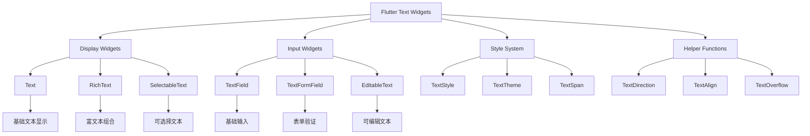

# 📝 Flutter 文本控件完整指南

> 通过模块化的学习路径，全面掌握 Flutter 文本控件的使用技巧


## 📊 学习路径概览

| 模块                                                 | 内容               | 难度等级 | 文件链接 |
| ---------------------------------------------------- | ------------------ | -------- | -------- |
| [Text 基础文本](#text-基础文本)                         | 基础文本显示与样式 | ⭐⭐     | [text-basic.md](text-basic.md) |
| [RichText 富文本](#richtext-富文本)                     | 富文本显示与组合   | ⭐⭐⭐   | [text-richtext.md](text-richtext.md) |
| [TextField 文本输入](#textfield-文本输入)               | 文本输入与交互     | ⭐⭐⭐   | [text-input.md](text-input.md) |
| [SelectableText 可选择文本](#selectabletext-可选择文本) | 文本选择与复制     | ⭐⭐     | [text-selectable.md](text-selectable.md) |
| [文本样式和主题](#文本样式和主题)                       | 样式系统与主题     | ⭐⭐⭐   | [text-styling.md](text-styling.md) |
| [国际化文本处理](#国际化文本处理)                       | 多语言支持         | ⭐⭐⭐⭐ | [text-internationalization.md](text-internationalization.md) |
| [实际应用场景](#实际应用场景)                           | 真实项目案例       | ⭐⭐⭐⭐ | [text-applications.md](text-applications.md) |
| [性能优化](#性能优化)                                   | 最佳实践           | ⭐⭐⭐⭐ | [text-performance.md](text-performance.md) |

## 🎯 学习目标

- ✅ 掌握各种文本控件的核心特性和使用场景
- ✅ 学会文本样式配置和主题管理
- ✅ 理解表单验证和用户交互处理
- ✅ 能够实现国际化文本和多语言支持
- ✅ 掌握性能优化和最佳实践

## 📋 快速导航

<details>
<summary>🎯 按功能分类</summary>

### 显示类控件
- [Text 基础文本](text-basic.md) - 基础文本显示与样式
- [RichText 富文本](text-richtext.md) - 富文本显示与组合
- [SelectableText 可选择文本](text-selectable.md) - 文本选择与复制

### 输入类控件
- [TextField 文本输入](text-input.md) - 文本输入与交互
- [TextFormField 表单文本](text-input.md#textformfield-表单文本) - 表单验证与处理

### 样式与主题
- [文本样式和主题](text-styling.md) - 样式系统与主题管理

### 高级功能
- [国际化文本处理](text-internationalization.md) - 多语言支持
- [实际应用场景](text-applications.md) - 真实项目案例
- [性能优化](text-performance.md) - 最佳实践

</details>

---

## 🏗️ 文本控件架构图



## 📊 文本控件特性对比

| 控件类型                 | 主要用途     | 性能       | 灵活性     | 复杂度     | 适用场景       |
| ------------------------ | ------------ | ---------- | ---------- | ---------- | -------------- |
| **Text**           | 基础文本显示 | ⭐⭐⭐⭐⭐ | ⭐⭐       | ⭐         | 简单文本展示   |
| **RichText**       | 富文本显示   | ⭐⭐⭐⭐   | ⭐⭐⭐⭐⭐ | ⭐⭐⭐     | 复杂文本组合   |
| **SelectableText** | 可选择文本   | ⭐⭐⭐     | ⭐⭐⭐⭐   | ⭐⭐       | 需要选择的文本 |
| **TextField**      | 基础输入     | ⭐⭐⭐⭐   | ⭐⭐⭐     | ⭐⭐⭐     | 简单输入框     |
| **TextFormField**  | 表单输入     | ⭐⭐⭐     | ⭐⭐⭐⭐   | ⭐⭐⭐⭐   | 表单验证       |
| **EditableText**   | 可编辑文本   | ⭐⭐⭐     | ⭐⭐⭐⭐⭐ | ⭐⭐⭐⭐⭐ | 自定义编辑器   |

## 🚀 快速开始

### 1. 基础文本显示

```dart
// 简单文本
Text('Hello Flutter')

// 带样式的文本
Text(
  'Hello Flutter',
  style: TextStyle(
    fontSize: 24,
    fontWeight: FontWeight.bold,
    color: Colors.blue,
  ),
)
```

### 2. 富文本显示

```dart
RichText(
  text: TextSpan(
    children: [
      TextSpan(text: '这是'),
      TextSpan(
        text: '粗体',
        style: TextStyle(fontWeight: FontWeight.bold),
      ),
      TextSpan(text: '文本'),
    ],
  ),
)
```

### 3. 文本输入

```dart
TextField(
  decoration: InputDecoration(
    labelText: '请输入内容',
    border: OutlineInputBorder(),
  ),
)
```

## 📚 学习建议

### 学习顺序

1. **从基础开始**：先学习 [Text 基础文本](text-basic.md)
2. **进阶富文本**：掌握 [RichText 富文本](text-richtext.md)
3. **输入交互**：学习 [文本输入控件](text-input.md)
4. **样式管理**：了解 [文本样式系统](text-styling.md)
5. **高级功能**：探索 [国际化](text-internationalization.md) 和 [实际应用](text-applications.md)

### 实践建议

- **循序渐进**：按照难度等级逐步学习
- **动手实践**：每个模块都有完整的代码示例
- **项目应用**：在实际项目中应用所学知识
- **性能优化**：关注 [性能优化](text-performance.md) 最佳实践

## 🔗 相关资源

### 官方文档
- [Flutter Text Widget](https://api.flutter.dev/flutter/widgets/Text-class.html)
- [Flutter RichText Widget](https://api.flutter.dev/flutter/widgets/RichText-class.html)
- [Flutter TextField Widget](https://api.flutter.dev/flutter/material/TextField-class.html)

### 相关模块
- [按钮控件](button-widgets.md) - 学习按钮组件
- [布局控件](layout-widgets.md) - 学习布局组件
- [表单控件](form-widgets.md) - 学习表单组件

## 🤝 贡献指南

如果你发现任何错误或有改进建议，欢迎：

1. 提交 Issue 报告问题
2. 提交 Pull Request 贡献代码
3. 分享使用经验和最佳实践

## 📄 许可证

本项目采用 MIT 许可证 - 查看 [LICENSE](../LICENSE) 文件了解详情。

---

**开始你的 Flutter 文本控件学习之旅吧！** 🚀

选择你感兴趣的模块，开始深入学习。每个模块都包含详细的理论知识、实用的代码示例和最佳实践指导。 