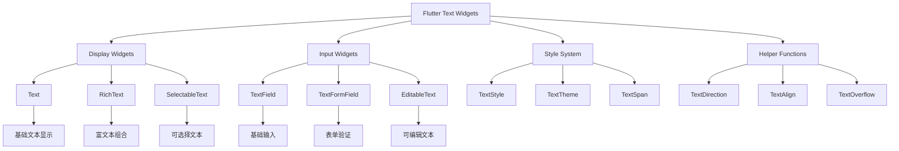

# 📝 Flutter 文本控件完整指南

> 通过模块化的学习路径，全面掌握 Flutter 文本控件的使用技巧


## 📊 学习路径概览

| 模块                                                 | 内容               | 难度等级 | 文件链接 |
| ---------------------------------------------------- | ------------------ | -------- | -------- |
| [Text 基础文本](#text-基础文本)                         | 基础文本显示与样式 | ⭐⭐     | [text-basic.md](text-basic.md) |
| [RichText 富文本](#richtext-富文本)                     | 富文本显示与组合   | ⭐⭐⭐   | [text-richtext.md](text-richtext.md) |
| [TextField 文本输入](#textfield-文本输入)               | 文本输入与交互     | ⭐⭐⭐   | [text-input.md](text-input.md) |
| [SelectableText 可选择文本](#selectabletext-可选择文本) | 文本选择与复制     | ⭐⭐     | [text-selectable.md](text-selectable.md) |
| [文本样式和主题](#文本样式和主题)                       | 样式系统与主题     | ⭐⭐⭐   | [text-styling.md](text-styling.md) |
| [国际化文本处理](#国际化文本处理)                       | 多语言支持         | ⭐⭐⭐⭐ | [text-internationalization.md](text-internationalization.md) |
| [实际应用场景](#实际应用场景)                           | 真实项目案例       | ⭐⭐⭐⭐ | [text-applications.md](text-applications.md) |
| [性能优化](#性能优化)                                   | 最佳实践           | ⭐⭐⭐⭐ | [text-performance.md](text-performance.md) |

## 🎯 学习目标

- ✅ 掌握各种文本控件的核心特性和使用场景
- ✅ 学会文本样式配置和主题管理
- ✅ 理解表单验证和用户交互处理
- ✅ 能够实现国际化文本和多语言支持
- ✅ 掌握性能优化和最佳实践

## 📋 快速导航

<details>
<summary>🎯 按功能分类</summary>

### 显示类控件
- [Text 基础文本](text-basic.md) - 基础文本显示与样式
- [RichText 富文本](text-richtext.md) - 富文本显示与组合
- [SelectableText 可选择文本](text-selectable.md) - 文本选择与复制

### 输入类控件
- [TextField 文本输入](text-input.md) - 文本输入与交互
- [TextFormField 表单文本](text-input.md#textformfield-表单文本) - 表单验证与处理

### 样式与主题
- [文本样式和主题](text-styling.md) - 样式系统与主题管理

### 高级功能
- [国际化文本处理](text-internationalization.md) - 多语言支持
- [实际应用场景](text-applications.md) - 真实项目案例
- [性能优化](text-performance.md) - 最佳实践

</details>

---

## 🏗️ 文本控件架构图



## 📊 文本控件特性对比

| 控件类型                 | 主要用途     | 性能       | 灵活性     | 复杂度     | 适用场景       |
| ------------------------ | ------------ | ---------- | ---------- | ---------- | -------------- |
| **Text**           | 基础文本显示 | ⭐⭐⭐⭐⭐ | ⭐⭐       | ⭐         | 简单文本展示   |
| **RichText**       | 富文本显示   | ⭐⭐⭐⭐   | ⭐⭐⭐⭐⭐ | ⭐⭐⭐     | 复杂文本组合   |
| **SelectableText** | 可选择文本   | ⭐⭐⭐     | ⭐⭐⭐⭐   | ⭐⭐       | 需要选择的文本 |
| **TextField**      | 基础输入     | ⭐⭐⭐⭐   | ⭐⭐⭐     | ⭐⭐⭐     | 简单输入框     |
| **TextFormField**  | 表单输入     | ⭐⭐⭐     | ⭐⭐⭐⭐   | ⭐⭐⭐⭐   | 表单验证       |
| **EditableText**   | 可编辑文本   | ⭐⭐⭐     | ⭐⭐⭐⭐⭐ | ⭐⭐⭐⭐⭐ | 自定义编辑器   |

## 🚀 快速开始

### 基础文本显示

```dart
// 简单文本
Text('Hello, Flutter!')

// 带样式的文本
Text(
  'Styled Text',
  style: TextStyle(
    fontSize: 18,
    fontWeight: FontWeight.bold,
    color: Colors.blue,
  ),
)
```

### 富文本显示

```dart
RichText(
  text: TextSpan(
    children: [
      TextSpan(text: 'Hello, '),
      TextSpan(
        text: 'Flutter!',
        style: TextStyle(
          fontWeight: FontWeight.bold,
          color: Colors.blue,
        ),
      ),
    ],
  ),
)
```

### 文本输入

```dart
TextField(
  decoration: InputDecoration(
    labelText: '请输入内容',
    hintText: '这是一个输入框',
  ),
)
```

## 📚 学习建议

### 学习顺序

1. **从基础开始**：先学习 `Text` 控件的基础用法
2. **掌握样式**：学习 `TextStyle` 和主题系统
3. **进阶功能**：学习 `RichText` 和富文本处理
4. **输入交互**：学习 `TextField` 和表单处理
5. **高级特性**：学习国际化和性能优化

### 实践建议

- **动手实践**：每个概念都要通过代码实践
- **项目应用**：在实际项目中应用所学知识
- **性能测试**：关注文本渲染的性能表现
- **用户体验**：注重文本的可读性和交互体验

### 进阶方向

- **自定义文本渲染**：创建自定义的文本渲染组件
- **文本动画**：实现文本的动画效果
- **文本分析**：进行文本内容的分析和处理
- **无障碍支持**：提升文本的无障碍访问性

## 🔗 相关资源

### 官方文档
- [Flutter Text Widget](https://api.flutter.dev/flutter/widgets/Text-class.html)
- [Flutter RichText Widget](https://api.flutter.dev/flutter/widgets/RichText-class.html)
- [Flutter TextField Widget](https://api.flutter.dev/flutter/material/TextField-class.html)

### 社区资源
- [Flutter 官方博客](https://medium.com/flutter)
- [Flutter 社区](https://flutter.dev/community)
- [Stack Overflow](https://stackoverflow.com/questions/tagged/flutter)

### 工具推荐
- [Flutter Inspector](https://flutter.dev/docs/development/tools/flutter-inspector)
- [Dart DevTools](https://flutter.dev/docs/development/tools/devtools)
- [Flutter IntelliJ Plugin](https://flutter.dev/docs/development/tools/android-studio)

## 🤝 贡献指南

### 如何贡献

1. **发现问题**：在使用过程中发现的问题
2. **提出建议**：对文档内容的改进建议
3. **提交代码**：修复问题或添加新功能
4. **完善文档**：补充或更新相关文档

### 贡献规范

- 遵循 Flutter 的代码规范
- 添加适当的测试用例
- 更新相关的文档说明
- 确保代码的可读性和可维护性

## 📄 许可证

本项目采用 MIT 许可证 - 查看 [LICENSE](LICENSE) 文件了解详情。

---

**开始你的 Flutter 文本控件学习之旅吧！** 🚀

选择你感兴趣的主题，开始深入学习 Flutter 文本控件的各种特性和应用技巧。 