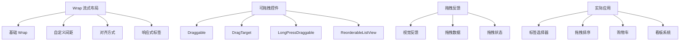

# 🔄 Flutter Wrap 流式布局与可拖拽控件深度解析

[](https://flutter.dev/)
[](https://dart.dev/)
[](LICENSE)

> 深入掌握 Wrap 流式布局和可拖拽控件的使用方法，构建灵活响应式界面和流畅拖拽交互体验

## 📊 文章概览

| 章节                            | 内容             | 难度等级 |
| ------------------------------- | ---------------- | -------- |
| [Wrap 流式布局](#wrap-流式布局) | 自动换行布局控件 | ⭐⭐     |
| [可拖拽控件](#可拖拽控件)       | 拖拽交互组件     | ⭐⭐⭐   |
| [拖拽反馈系统](#拖拽反馈系统)   | 视觉反馈机制     | ⭐⭐⭐   |
| [实际应用场景](#实际应用场景)   | 真实项目案例     | ⭐⭐⭐⭐ |
| [性能优化](#性能优化)           | 优化技巧         | ⭐⭐⭐⭐ |

## 🎯 学习目标

- ✅ 掌握 Wrap 流式布局的原理和使用方法
- ✅ 学会可拖拽控件的配置和交互处理
- ✅ 理解拖拽反馈系统的视觉机制
- ✅ 能够实现复杂的拖拽排序功能
- ✅ 掌握性能优化和最佳实践

## 📋 目录导航

<details>
<summary>🎯 快速导航</summary>

- [Wrap 流式布局](#wrap-流式布局) - 自动换行布局控件
- [可拖拽控件](#可拖拽控件) - 拖拽交互组件
- [拖拽反馈系统](#拖拽反馈系统) - 视觉反馈机制
- [实际应用场景](#实际应用场景) - 真实项目案例
- [性能优化](#性能优化) - 优化技巧

</details>

---

## 📋 概述

本文档详细介绍 Flutter 中的 Wrap 流式布局控件和可拖拽控件的使用方法，包括基础用法、高级特性、实际应用场景和性能优化等内容。Wrap 组件能够自动换行处理子组件，而可拖拽控件则提供了丰富的交互体验。

## 🏗️ Wrap 和可拖拽控件架构图



### 📊 组件特性对比

| 组件类型                | 主要用途 | 性能     | 灵活性     | 复杂度   | 适用场景     |
| ----------------------- | -------- | -------- | ---------- | -------- | ------------ |
| **Wrap**                | 流式布局 | ⭐⭐⭐⭐ | ⭐⭐⭐⭐   | ⭐⭐     | 标签、按钮组 |
| **Draggable**           | 基础拖拽 | ⭐⭐⭐⭐ | ⭐⭐⭐⭐⭐ | ⭐⭐⭐   | 简单拖拽     |
| **DragTarget**          | 拖拽目标 | ⭐⭐⭐⭐ | ⭐⭐⭐⭐   | ⭐⭐⭐   | 拖拽接收     |
| **ReorderableListView** | 列表重排 | ⭐⭐⭐   | ⭐⭐⭐⭐   | ⭐⭐⭐⭐ | 列表排序     |

## Wrap 流式布局

### 基础用法

```dart
class BasicWrapExample extends StatelessWidget {
  @override
  Widget build(BuildContext context) {
    return Scaffold(
      appBar: AppBar(
        title: Text('Wrap 基础用法'),
      ),
      body: Padding(
        padding: EdgeInsets.all(16),
        child: Column(
          crossAxisAlignment: CrossAxisAlignment.start,
          children: [
            // 基础 Wrap
            Text(
              '基础 Wrap：',
              style: TextStyle(
                fontSize: 18,
                fontWeight: FontWeight.bold,
              ),
            ),
            SizedBox(height: 8),
            Container(
              width: double.infinity,
              padding: EdgeInsets.all(16),
              decoration: BoxDecoration(
                border: Border.all(color: Colors.grey[300]!),
                borderRadius: BorderRadius.circular(8),
              ),
              child: Wrap(
                children: [
                  Chip(label: Text('Flutter')),
                  Chip(label: Text('Dart')),
                  Chip(label: Text('Mobile Development')),
                  Chip(label: Text('Cross Platform')),
                  Chip(label: Text('UI Framework')),
                  Chip(label: Text('Google')),
                  Chip(label: Text('Open Source')),
                ],
              ),
            ),

            SizedBox(height: 24),

            // 自定义间距的 Wrap
            Text(
              '自定义间距：',
              style: TextStyle(
                fontSize: 18,
                fontWeight: FontWeight.bold,
              ),
            ),
            SizedBox(height: 8),
            Container(
              width: double.infinity,
              padding: EdgeInsets.all(16),
              decoration: BoxDecoration(
                border: Border.all(color: Colors.grey[300]!),
                borderRadius: BorderRadius.circular(8),
              ),
              child: Wrap(
                spacing: 12.0, // 水平间距
                runSpacing: 8.0, // 垂直间距
                children: [
                  _buildColorChip('红色', Colors.red),
                  _buildColorChip('蓝色', Colors.blue),
                  _buildColorChip('绿色', Colors.green),
                  _buildColorChip('橙色', Colors.orange),
                  _buildColorChip('紫色', Colors.purple),
                  _buildColorChip('青色', Colors.cyan),
                  _buildColorChip('粉色', Colors.pink),
                  _buildColorChip('黄色', Colors.yellow),
                ],
              ),
            ),

            SizedBox(height: 24),

            // 不同对齐方式的 Wrap
            Text(
              '对齐方式：',
              style: TextStyle(
                fontSize: 18,
                fontWeight: FontWeight.bold,
              ),
            ),
            SizedBox(height: 8),
            Container(
              width: double.infinity,
              padding: EdgeInsets.all(16),
              decoration: BoxDecoration(
                border: Border.all(color: Colors.grey[300]!),
                borderRadius: BorderRadius.circular(8),
              ),
              child: Column(
                children: [
                  // 居中对齐
                  Text('居中对齐：'),
                  Wrap(
                    alignment: WrapAlignment.center,
                    spacing: 8.0,
                    children: [
                      Chip(label: Text('标签1')),
                      Chip(label: Text('标签2')),
                      Chip(label: Text('标签3')),
                    ],
                  ),

                  SizedBox(height: 16),

                  // 右对齐
                  Text('右对齐：'),
                  Wrap(
                    alignment: WrapAlignment.end,
                    spacing: 8.0,
                    children: [
                      Chip(label: Text('标签A')),
                      Chip(label: Text('标签B')),
                      Chip(label: Text('标签C')),
                    ],
                  ),

                  SizedBox(height: 16),

                  // 两端对齐
                  Text('两端对齐：'),
                  Wrap(
                    alignment: WrapAlignment.spaceBetween,
                    spacing: 8.0,
                    children: [
                      Chip(label: Text('开始')),
                      Chip(label: Text('中间')),
                      Chip(label: Text('结束')),
                    ],
                  ),
                ],
              ),
            ),
          ],
        ),
      ),
    );
  }

  Widget _buildColorChip(String label, Color color) {
    return Chip(
      label: Text(
        label,
        style: TextStyle(
          color: Colors.white,
          fontWeight: FontWeight.bold,
        ),
      ),
      backgroundColor: color,
    );
  }
}
```

### 响应式标签选择器

```dart
class ResponsiveTagSelector extends StatefulWidget {
  @override
  _ResponsiveTagSelectorState createState() => _ResponsiveTagSelectorState();
}

class _ResponsiveTagSelectorState extends State<ResponsiveTagSelector> {
  final List<String> _allTags = [
    'Flutter', 'Dart', 'Mobile', 'iOS', 'Android',
    'Web', 'Desktop', 'Cross Platform', 'UI/UX',
    'State Management', 'Animation', 'Performance',
    'Testing', 'Deployment', 'CI/CD', 'Firebase',
    'REST API', 'GraphQL', 'Database', 'Cloud',
  ];

  final Set<String> _selectedTags = {};

  @override
  Widget build(BuildContext context) {
    return Scaffold(
      appBar: AppBar(
        title: Text('响应式标签选择器'),
        actions: [
          IconButton(
            icon: Icon(Icons.clear_all),
            onPressed: () {
              setState(() {
                _selectedTags.clear();
              });
            },
          ),
        ],
      ),
      body: Column(
        children: [
          // 已选择的标签
          if (_selectedTags.isNotEmpty)
            Container(
              width: double.infinity,
              padding: EdgeInsets.all(16),
              color: Colors.blue[50],
              child: Column(
                crossAxisAlignment: CrossAxisAlignment.start,
                children: [
                  Text(
                    '已选择 (${_selectedTags.length})：',
                    style: TextStyle(
                      fontSize: 16,
                      fontWeight: FontWeight.bold,
                      color: Colors.blue[800],
                    ),
                  ),
                  SizedBox(height: 8),
                  Wrap(
                    spacing: 8.0,
                    runSpacing: 4.0,
                    children: _selectedTags.map((tag) {
                      return Chip(
                        label: Text(
                          tag,
                          style: TextStyle(color: Colors.white),
                        ),
                        backgroundColor: Colors.blue,
                        deleteIcon: Icon(
                          Icons.close,
                          size: 18,
                          color: Colors.white,
                        ),
                        onDeleted: () {
                          setState(() {
                            _selectedTags.remove(tag);
                          });
                        },
                      );
                    }).toList(),
                  ),
                ],
              ),
            ),

          // 可选择的标签
          Expanded(
            child: Padding(
              padding: EdgeInsets.all(16),
              child: Column(
                crossAxisAlignment: CrossAxisAlignment.start,
                children: [
                  Text(
                    '可选择的标签：',
                    style: TextStyle(
                      fontSize: 16,
                      fontWeight: FontWeight.bold,
                    ),
                  ),
                  SizedBox(height: 12),
                  Expanded(
                    child: SingleChildScrollView(
                      child: Wrap(
                        spacing: 8.0,
                        runSpacing: 8.0,
                        children: _allTags.map((tag) {
                          final isSelected = _selectedTags.contains(tag);
                          return FilterChip(
                            label: Text(tag),
                            selected: isSelected,
                            onSelected: (selected) {
                              setState(() {
                                if (selected) {
                                  _selectedTags.add(tag);
                                } else {
                                  _selectedTags.remove(tag);
                                }
                              });
                            },
                            selectedColor: Colors.blue[100],
                            checkmarkColor: Colors.blue,
                            side: BorderSide(
                              color: isSelected ? Colors.blue : Colors.grey[300]!,
                            ),
                          );
                        }).toList(),
                      ),
                    ),
                  ),
                ],
              ),
            ),
          ),

          // 底部操作栏
          Container(
            width: double.infinity,
            padding: EdgeInsets.all(16),
            decoration: BoxDecoration(
              color: Colors.white,
              boxShadow: [
                BoxShadow(
                  color: Colors.grey.withOpacity(0.2),
                  spreadRadius: 1,
                  blurRadius: 4,
                  offset: Offset(0, -2),
                ),
              ],
            ),
            child: Row(
              children: [
                Expanded(
                  child: Text(
                    '已选择 ${_selectedTags.length} 个标签',
                    style: TextStyle(
                      fontSize: 16,
                      color: Colors.grey[600],
                    ),
                  ),
                ),
                ElevatedButton(
                  onPressed: _selectedTags.isEmpty ? null : () {
                    // 处理选择结果
                    showDialog(
                      context: context,
                      builder: (context) => AlertDialog(
                        title: Text('选择结果'),
                        content: Text(
                          '您选择了：\n${_selectedTags.join(', ')}',
                        ),
                        actions: [
                          TextButton(
                            onPressed: () => Navigator.pop(context),
                            child: Text('确定'),
                          ),
                        ],
                      ),
                    );
                  },
                  child: Text('确认选择'),
                ),
              ],
            ),
          ),
        ],
      ),
    );
  }
}
```

## 可拖拽控件

### Draggable 基础用法

```dart
class BasicDraggableExample extends StatefulWidget {
  @override
  _BasicDraggableExampleState createState() => _BasicDraggableExampleState();
}

class _BasicDraggableExampleState extends State<BasicDraggableExample> {
  String _draggedData = '';
  Color _targetColor = Colors.grey[200]!;

  @override
  Widget build(BuildContext context) {
    return Scaffold(
      appBar: AppBar(
        title: Text('Draggable 基础用法'),
      ),
      body: Padding(
        padding: EdgeInsets.all(16),
        child: Column(
          children: [
            // 拖拽源
            Text(
              '拖拽这些颜色到下方的目标区域：',
              style: TextStyle(
                fontSize: 16,
                fontWeight: FontWeight.bold,
              ),
            ),
            SizedBox(height: 16),

            Wrap(
              spacing: 16,
              runSpacing: 16,
              children: [
                _buildDraggableColor('红色', Colors.red),
                _buildDraggableColor('蓝色', Colors.blue),
                _buildDraggableColor('绿色', Colors.green),
                _buildDraggableColor('橙色', Colors.orange),
                _buildDraggableColor('紫色', Colors.purple),
                _buildDraggableColor('青色', Colors.cyan),
              ],
            ),

            SizedBox(height: 40),

            // 拖拽目标
            Text(
              '拖拽目标区域：',
              style: TextStyle(
                fontSize: 16,
                fontWeight: FontWeight.bold,
              ),
            ),
            SizedBox(height: 16),

            DragTarget<ColorData>(
              onAccept: (colorData) {
                setState(() {
                  _draggedData = '接收到：${colorData.name}';
                  _targetColor = colorData.color;
                });
              },
              onWillAccept: (colorData) {
                return colorData != null;
              },
              onLeave: (colorData) {
                setState(() {
                  _targetColor = Colors.grey[200]!;
                });
              },
              builder: (context, candidateData, rejectedData) {
                return AnimatedContainer(
                  duration: Duration(milliseconds: 200),
                  width: double.infinity,
                  height: 150,
                  decoration: BoxDecoration(
                    color: candidateData.isNotEmpty
                        ? Colors.blue[100]
                        : _targetColor,
                    border: Border.all(
                      color: candidateData.isNotEmpty
                          ? Colors.blue
                          : Colors.grey[400]!,
                      width: 2,
                      style: candidateData.isNotEmpty
                          ? BorderStyle.solid
                          : BorderStyle.dashed,
                    ),
                    borderRadius: BorderRadius.circular(12),
                  ),
                  child: Center(
                    child: Column(
                      mainAxisAlignment: MainAxisAlignment.center,
                      children: [
                        Icon(
                          candidateData.isNotEmpty
                              ? Icons.add_circle
                              : Icons.touch_app,
                          size: 48,
                          color: candidateData.isNotEmpty
                              ? Colors.blue
                              : Colors.grey[600],
                        ),
                        SizedBox(height: 8),
                        Text(
                          candidateData.isNotEmpty
                              ? '松开以放置'
                              : (_draggedData.isEmpty ? '将颜色拖拽到这里' : _draggedData),
                          style: TextStyle(
                            fontSize: 16,
                            color: candidateData.isNotEmpty
                                ? Colors.blue
                                : Colors.grey[600],
                            fontWeight: candidateData.isNotEmpty
                                ? FontWeight.bold
                                : FontWeight.normal,
                          ),
                        ),
                      ],
                    ),
                  ),
                );
              },
            ),
          ],
        ),
      ),
    );
  }

  Widget _buildDraggableColor(String name, Color color) {
    return Draggable<ColorData>(
      data: ColorData(name, color),
      feedback: Material(
        elevation: 8,
        borderRadius: BorderRadius.circular(8),
        child: Container(
          width: 80,
          height: 80,
          decoration: BoxDecoration(
            color: color,
            borderRadius: BorderRadius.circular(8),
          ),
          child: Center(
            child: Text(
              name,
              style: TextStyle(
                color: Colors.white,
                fontWeight: FontWeight.bold,
                fontSize: 12,
              ),
            ),
          ),
        ),
      ),
      childWhenDragging: Container(
        width: 80,
        height: 80,
        decoration: BoxDecoration(
          color: color.withOpacity(0.3),
          borderRadius: BorderRadius.circular(8),
          border: Border.all(
            color: color,
            width: 2,
            style: BorderStyle.dashed,
          ),
        ),
        child: Center(
          child: Text(
            name,
            style: TextStyle(
              color: color,
              fontWeight: FontWeight.bold,
              fontSize: 12,
            ),
          ),
        ),
      ),
      child: Container(
        width: 80,
        height: 80,
        decoration: BoxDecoration(
          color: color,
          borderRadius: BorderRadius.circular(8),
          boxShadow: [
            BoxShadow(
              color: Colors.black.withOpacity(0.2),
              spreadRadius: 1,
              blurRadius: 4,
              offset: Offset(0, 2),
            ),
          ],
        ),
        child: Center(
          child: Text(
            name,
            style: TextStyle(
              color: Colors.white,
              fontWeight: FontWeight.bold,
              fontSize: 12,
            ),
          ),
        ),
      ),
    );
  }
}

class ColorData {
  final String name;
  final Color color;

  ColorData(this.name, this.color);
}
```

### 拖拽排序列表

```dart
class DraggableListExample extends StatefulWidget {
  @override
  _DraggableListExampleState createState() => _DraggableListExampleState();
}

class _DraggableListExampleState extends State<DraggableListExample> {
  List<TaskItem> _tasks = [
    TaskItem('1', '完成项目文档', TaskStatus.pending, Colors.blue),
    TaskItem('2', '代码审查', TaskStatus.inProgress, Colors.orange),
    TaskItem('3', '修复Bug #123', TaskStatus.pending, Colors.red),
    TaskItem('4', '部署到生产环境', TaskStatus.completed, Colors.green),
    TaskItem('5', '用户测试', TaskStatus.pending, Colors.purple),
    TaskItem('6', '性能优化', TaskStatus.inProgress, Colors.cyan),
  ];

  @override
  Widget build(BuildContext context) {
    return Scaffold(
      appBar: AppBar(
        title: Text('拖拽排序任务列表'),
        actions: [
          IconButton(
            icon: Icon(Icons.shuffle),
            onPressed: () {
              setState(() {
                _tasks.shuffle();
              });
            },
          ),
        ],
      ),
      body: ReorderableListView.builder(
        padding: EdgeInsets.all(16),
        itemCount: _tasks.length,
        onReorder: (oldIndex, newIndex) {
          setState(() {
            if (newIndex > oldIndex) {
              newIndex -= 1;
            }
            final TaskItem item = _tasks.removeAt(oldIndex);
            _tasks.insert(newIndex, item);
          });
        },
        itemBuilder: (context, index) {
          final task = _tasks[index];
          return Card(
            key: ValueKey(task.id),
            margin: EdgeInsets.only(bottom: 8),
            child: ListTile(
              leading: CircleAvatar(
                backgroundColor: task.color.withOpacity(0.2),
                child: Icon(
                  _getStatusIcon(task.status),
                  color: task.color,
                ),
              ),
              title: Text(
                task.title,
                style: TextStyle(
                  decoration: task.status == TaskStatus.completed
                      ? TextDecoration.lineThrough
                      : null,
                ),
              ),
              subtitle: Text(_getStatusText(task.status)),
              trailing: Row(
                mainAxisSize: MainAxisSize.min,
                children: [
                  _buildStatusChip(task.status, task.color),
                  SizedBox(width: 8),
                  Icon(Icons.drag_handle, color: Colors.grey),
                ],
              ),
              onTap: () {
                _showTaskDialog(task);
              },
            ),
          );
        },
      ),
      floatingActionButton: FloatingActionButton(
        onPressed: () {
          _addNewTask();
        },
        child: Icon(Icons.add),
      ),
    );
  }

  IconData _getStatusIcon(TaskStatus status) {
    switch (status) {
      case TaskStatus.pending:
        return Icons.schedule;
      case TaskStatus.inProgress:
        return Icons.play_circle;
      case TaskStatus.completed:
        return Icons.check_circle;
    }
  }

  String _getStatusText(TaskStatus status) {
    switch (status) {
      case TaskStatus.pending:
        return '待处理';
      case TaskStatus.inProgress:
        return '进行中';
      case TaskStatus.completed:
        return '已完成';
    }
  }

  Widget _buildStatusChip(TaskStatus status, Color color) {
    return Container(
      padding: EdgeInsets.symmetric(horizontal: 8, vertical: 4),
      decoration: BoxDecoration(
        color: color.withOpacity(0.1),
        borderRadius: BorderRadius.circular(12),
        border: Border.all(color: color.withOpacity(0.3)),
      ),
      child: Text(
        _getStatusText(status),
        style: TextStyle(
          fontSize: 12,
          color: color,
          fontWeight: FontWeight.bold,
        ),
      ),
    );
  }

  void _showTaskDialog(TaskItem task) {
    showDialog(
      context: context,
      builder: (context) => AlertDialog(
        title: Text('任务详情'),
        content: Column(
          mainAxisSize: MainAxisSize.min,
          crossAxisAlignment: CrossAxisAlignment.start,
          children: [
            Text('标题：${task.title}'),
            SizedBox(height: 8),
            Text('状态：${_getStatusText(task.status)}'),
            SizedBox(height: 16),
            Text('更改状态：'),
            SizedBox(height: 8),
            Wrap(
              spacing: 8,
              children: TaskStatus.values.map((status) {
                return ChoiceChip(
                  label: Text(_getStatusText(status)),
                  selected: task.status == status,
                  onSelected: (selected) {
                    if (selected) {
                      setState(() {
                        task.status = status;
                      });
                      Navigator.pop(context);
                    }
                  },
                );
              }).toList(),
            ),
          ],
        ),
        actions: [
          TextButton(
            onPressed: () => Navigator.pop(context),
            child: Text('关闭'),
          ),
        ],
      ),
    );
  }

  void _addNewTask() {
    final newTask = TaskItem(
      DateTime.now().millisecondsSinceEpoch.toString(),
      '新任务 ${_tasks.length + 1}',
      TaskStatus.pending,
      Colors.primaries[_tasks.length % Colors.primaries.length],
    );

    setState(() {
      _tasks.add(newTask);
    });
  }
}

class TaskItem {
  final String id;
  final String title;
  TaskStatus status;
  final Color color;

  TaskItem(this.id, this.title, this.status, this.color);
}

enum TaskStatus {
  pending,
  inProgress,
  completed,
}
```

## 看板拖拽系统

### 多列拖拽看板

```dart
class KanbanBoardExample extends StatefulWidget {
  @override
  _KanbanBoardExampleState createState() => _KanbanBoardExampleState();
}

class _KanbanBoardExampleState extends State<KanbanBoardExample> {
  Map<String, List<KanbanCard>> _columns = {
    'todo': [
      KanbanCard('1', '设计用户界面', '需要完成登录页面的设计', Colors.blue),
      KanbanCard('2', '数据库设计', '设计用户表和权限表', Colors.green),
      KanbanCard('3', 'API文档', '编写RESTful API文档', Colors.orange),
    ],
    'doing': [
      KanbanCard('4', '前端开发', '实现用户注册功能', Colors.purple),
      KanbanCard('5', '后端开发', '实现用户认证API', Colors.red),
    ],
    'done': [
      KanbanCard('6', '项目初始化', '创建项目结构和配置', Colors.cyan),
    ],
  };

  final Map<String, String> _columnTitles = {
    'todo': '待办事项',
    'doing': '进行中',
    'done': '已完成',
  };

  final Map<String, Color> _columnColors = {
    'todo': Colors.grey,
    'doing': Colors.orange,
    'done': Colors.green,
  };

  @override
  Widget build(BuildContext context) {
    return Scaffold(
      appBar: AppBar(
        title: Text('看板拖拽系统'),
        backgroundColor: Colors.indigo,
        foregroundColor: Colors.white,
      ),
      body: Container(
        color: Colors.grey[100],
        child: Row(
          children: _columns.keys.map((columnKey) {
            return Expanded(
              child: _buildColumn(columnKey),
            );
          }).toList(),
        ),
      ),
    );
  }

  Widget _buildColumn(String columnKey) {
    final cards = _columns[columnKey]!;
    final title = _columnTitles[columnKey]!;
    final color = _columnColors[columnKey]!;

    return Container(
      margin: EdgeInsets.all(8),
      decoration: BoxDecoration(
        color: Colors.white,
        borderRadius: BorderRadius.circular(12),
        boxShadow: [
          BoxShadow(
            color: Colors.black.withOpacity(0.1),
            spreadRadius: 1,
            blurRadius: 4,
            offset: Offset(0, 2),
          ),
        ],
      ),
      child: Column(
        children: [
          // 列标题
          Container(
            width: double.infinity,
            padding: EdgeInsets.all(16),
            decoration: BoxDecoration(
              color: color.withOpacity(0.1),
              borderRadius: BorderRadius.only(
                topLeft: Radius.circular(12),
                topRight: Radius.circular(12),
              ),
            ),
            child: Row(
              children: [
                Icon(Icons.circle, color: color, size: 12),
                SizedBox(width: 8),
                Text(
                  title,
                  style: TextStyle(
                    fontSize: 16,
                    fontWeight: FontWeight.bold,
                    color: color,
                  ),
                ),
                Spacer(),
                Container(
                  padding: EdgeInsets.symmetric(horizontal: 8, vertical: 4),
                  decoration: BoxDecoration(
                    color: color.withOpacity(0.2),
                    borderRadius: BorderRadius.circular(12),
                  ),
                  child: Text(
                    '${cards.length}',
                    style: TextStyle(
                      fontSize: 12,
                      fontWeight: FontWeight.bold,
                      color: color,
                    ),
                  ),
                ),
              ],
            ),
          ),

          // 卡片列表
          Expanded(
            child: DragTarget<KanbanCard>(
              onAccept: (card) {
                setState(() {
                  // 从原列中移除
                  _columns.forEach((key, value) {
                    value.removeWhere((c) => c.id == card.id);
                  });
                  // 添加到新列
                  _columns[columnKey]!.add(card);
                });
              },
              onWillAccept: (card) => card != null,
              builder: (context, candidateData, rejectedData) {
                return Container(
                  width: double.infinity,
                  decoration: BoxDecoration(
                    color: candidateData.isNotEmpty
                        ? color.withOpacity(0.05)
                        : Colors.transparent,
                    border: candidateData.isNotEmpty
                        ? Border.all(color: color, width: 2)
                        : null,
                    borderRadius: BorderRadius.only(
                      bottomLeft: Radius.circular(12),
                      bottomRight: Radius.circular(12),
                    ),
                  ),
                  child: ListView.builder(
                    padding: EdgeInsets.all(8),
                    itemCount: cards.length,
                    itemBuilder: (context, index) {
                      return _buildKanbanCard(cards[index]);
                    },
                  ),
                );
              },
            ),
          ),
        ],
      ),
    );
  }

  Widget _buildKanbanCard(KanbanCard card) {
    return Draggable<KanbanCard>(
      data: card,
      feedback: Material(
        elevation: 8,
        borderRadius: BorderRadius.circular(8),
        child: Container(
          width: 250,
          child: _buildCardContent(card, isDragging: true),
        ),
      ),
      childWhenDragging: Container(
        margin: EdgeInsets.only(bottom: 8),
        child: _buildCardContent(card, isPlaceholder: true),
      ),
      child: Container(
        margin: EdgeInsets.only(bottom: 8),
        child: _buildCardContent(card),
      ),
    );
  }

  Widget _buildCardContent(KanbanCard card, {bool isDragging = false, bool isPlaceholder = false}) {
    return Container(
      padding: EdgeInsets.all(12),
      decoration: BoxDecoration(
        color: isPlaceholder
            ? Colors.grey[200]
            : Colors.white,
        borderRadius: BorderRadius.circular(8),
        border: Border.all(
          color: isPlaceholder
              ? Colors.grey[400]!
              : card.color.withOpacity(0.3),
          style: isPlaceholder
              ? BorderStyle.dashed
              : BorderStyle.solid,
        ),
        boxShadow: isDragging || isPlaceholder ? [] : [
          BoxShadow(
            color: Colors.black.withOpacity(0.1),
            spreadRadius: 1,
            blurRadius: 3,
            offset: Offset(0, 1),
          ),
        ],
      ),
      child: Column(
        crossAxisAlignment: CrossAxisAlignment.start,
        children: [
          Row(
            children: [
              Container(
                width: 4,
                height: 20,
                decoration: BoxDecoration(
                  color: isPlaceholder ? Colors.grey : card.color,
                  borderRadius: BorderRadius.circular(2),
                ),
              ),
              SizedBox(width: 8),
              Expanded(
                child: Text(
                  card.title,
                  style: TextStyle(
                    fontSize: 14,
                    fontWeight: FontWeight.bold,
                    color: isPlaceholder ? Colors.grey : Colors.black87,
                  ),
                ),
              ),
            ],
          ),
          SizedBox(height: 8),
          Text(
            card.description,
            style: TextStyle(
              fontSize: 12,
              color: isPlaceholder ? Colors.grey : Colors.grey[600],
              height: 1.3,
            ),
          ),
          SizedBox(height: 8),
          Row(
            children: [
              Icon(
                Icons.schedule,
                size: 14,
                color: isPlaceholder ? Colors.grey : Colors.grey[500],
              ),
              SizedBox(width: 4),
              Text(
                '2天前',
                style: TextStyle(
                  fontSize: 11,
                  color: isPlaceholder ? Colors.grey : Colors.grey[500],
                ),
              ),
              Spacer(),
              CircleAvatar(
                radius: 12,
                backgroundColor: isPlaceholder
                    ? Colors.grey
                    : card.color.withOpacity(0.2),
                child: Text(
                  'A',
                  style: TextStyle(
                    fontSize: 10,
                    color: isPlaceholder ? Colors.white : card.color,
                    fontWeight: FontWeight.bold,
                  ),
                ),
              ),
            ],
          ),
        ],
      ),
    );
  }
}

class KanbanCard {
  final String id;
  final String title;
  final String description;
  final Color color;

  KanbanCard(this.id, this.title, this.description, this.color);
}
```

## 购物车拖拽示例

### 拖拽添加到购物车

```dart
class ShoppingCartDragExample extends StatefulWidget {
  @override
  _ShoppingCartDragExampleState createState() => _ShoppingCartDragExampleState();
}

class _ShoppingCartDragExampleState extends State<ShoppingCartDragExample> {
  final List<Product> _products = [
    Product('1', 'iPhone 14', 6999.0, 'https://example.com/iphone.jpg', Colors.blue),
    Product('2', 'MacBook Pro', 12999.0, 'https://example.com/macbook.jpg', Colors.grey),
    Product('3', 'iPad Air', 4599.0, 'https://example.com/ipad.jpg', Colors.purple),
    Product('4', 'Apple Watch', 2999.0, 'https://example.com/watch.jpg', Colors.red),
    Product('5', 'AirPods Pro', 1999.0, 'https://example.com/airpods.jpg', Colors.orange),
    Product('6', 'Magic Mouse', 799.0, 'https://example.com/mouse.jpg', Colors.green),
  ];

  final List<CartItem> _cartItems = [];

  @override
  Widget build(BuildContext context) {
    return Scaffold(
      appBar: AppBar(
        title: Text('拖拽购物车'),
        actions: [
          Stack(
            children: [
              IconButton(
                icon: Icon(Icons.shopping_cart),
                onPressed: () {
                  _showCartDialog();
                },
              ),
              if (_cartItems.isNotEmpty)
                Positioned(
                  right: 8,
                  top: 8,
                  child: Container(
                    padding: EdgeInsets.all(2),
                    decoration: BoxDecoration(
                      color: Colors.red,
                      borderRadius: BorderRadius.circular(10),
                    ),
                    constraints: BoxConstraints(
                      minWidth: 16,
                      minHeight: 16,
                    ),
                    child: Text(
                      '${_cartItems.length}',
                      style: TextStyle(
                        color: Colors.white,
                        fontSize: 12,
                      ),
                      textAlign: TextAlign.center,
                    ),
                  ),
                ),
            ],
          ),
        ],
      ),
      body: Column(
        children: [
          // 购物车拖拽区域
          DragTarget<Product>(
            onAccept: (product) {
              setState(() {
                final existingIndex = _cartItems.indexWhere(
                  (item) => item.product.id == product.id,
                );

                if (existingIndex >= 0) {
                  _cartItems[existingIndex].quantity++;
                } else {
                  _cartItems.add(CartItem(product, 1));
                }
              });

              ScaffoldMessenger.of(context).showSnackBar(
                SnackBar(
                  content: Text('${product.name} 已添加到购物车'),
                  duration: Duration(seconds: 1),
                ),
              );
            },
            onWillAccept: (product) => product != null,
            builder: (context, candidateData, rejectedData) {
              return AnimatedContainer(
                duration: Duration(milliseconds: 200),
                width: double.infinity,
                height: 80,
                margin: EdgeInsets.all(16),
                decoration: BoxDecoration(
                  color: candidateData.isNotEmpty
                      ? Colors.green[100]
                      : Colors.grey[100],
                  border: Border.all(
                    color: candidateData.isNotEmpty
                        ? Colors.green
                        : Colors.grey[400]!,
                    width: 2,
                    style: candidateData.isNotEmpty
                        ? BorderStyle.solid
                        : BorderStyle.dashed,
                  ),
                  borderRadius: BorderRadius.circular(12),
                ),
                child: Center(
                  child: Row(
                    mainAxisAlignment: MainAxisAlignment.center,
                    children: [
                      Icon(
                        candidateData.isNotEmpty
                            ? Icons.add_shopping_cart
                            : Icons.shopping_cart_outlined,
                        size: 32,
                        color: candidateData.isNotEmpty
                            ? Colors.green
                            : Colors.grey[600],
                      ),
                      SizedBox(width: 12),
                      Text(
                        candidateData.isNotEmpty
                            ? '松开以添加到购物车'
                            : '将商品拖拽到这里添加到购物车',
                        style: TextStyle(
                          fontSize: 16,
                          fontWeight: FontWeight.bold,
                          color: candidateData.isNotEmpty
                              ? Colors.green
                              : Colors.grey[600],
                        ),
                      ),
                    ],
                  ),
                ),
              );
            },
          ),

          // 商品列表
          Expanded(
            child: GridView.builder(
              padding: EdgeInsets.all(16),
              gridDelegate: SliverGridDelegateWithFixedCrossAxisCount(
                crossAxisCount: 2,
                childAspectRatio: 0.8,
                crossAxisSpacing: 16,
                mainAxisSpacing: 16,
              ),
              itemCount: _products.length,
              itemBuilder: (context, index) {
                return _buildProductCard(_products[index]);
              },
            ),
          ),
        ],
      ),
    );
  }

  Widget _buildProductCard(Product product) {
    return Draggable<Product>(
      data: product,
      feedback: Material(
        elevation: 8,
        borderRadius: BorderRadius.circular(12),
        child: Container(
          width: 150,
          height: 200,
          child: _buildProductContent(product, isDragging: true),
        ),
      ),
      childWhenDragging: _buildProductContent(product, isPlaceholder: true),
      child: _buildProductContent(product),
    );
  }

  Widget _buildProductContent(Product product, {bool isDragging = false, bool isPlaceholder = false}) {
    return Card(
      elevation: isDragging ? 8 : (isPlaceholder ? 0 : 4),
      child: Container(
        decoration: BoxDecoration(
          borderRadius: BorderRadius.circular(12),
          color: isPlaceholder ? Colors.grey[200] : Colors.white,
          border: isPlaceholder
              ? Border.all(color: Colors.grey[400]!, style: BorderStyle.dashed)
              : null,
        ),
        child: Column(
          crossAxisAlignment: CrossAxisAlignment.start,
          children: [
            // 商品图片
            Expanded(
              flex: 3,
              child: Container(
                width: double.infinity,
                decoration: BoxDecoration(
                  color: isPlaceholder
                      ? Colors.grey[300]
                      : product.color.withOpacity(0.1),
                  borderRadius: BorderRadius.only(
                    topLeft: Radius.circular(12),
                    topRight: Radius.circular(12),
                  ),
                ),
                child: Icon(
                  Icons.phone_iphone,
                  size: 48,
                  color: isPlaceholder ? Colors.grey : product.color,
                ),
              ),
            ),

            // 商品信息
            Expanded(
              flex: 2,
              child: Padding(
                padding: EdgeInsets.all(12),
                child: Column(
                  crossAxisAlignment: CrossAxisAlignment.start,
                  children: [
                    Text(
                      product.name,
                      style: TextStyle(
                        fontSize: 14,
                        fontWeight: FontWeight.bold,
                        color: isPlaceholder ? Colors.grey : Colors.black87,
                      ),
                      maxLines: 1,
                      overflow: TextOverflow.ellipsis,
                    ),
                    SizedBox(height: 4),
                    Text(
                      '¥${product.price.toStringAsFixed(0)}',
                      style: TextStyle(
                        fontSize: 16,
                        fontWeight: FontWeight.bold,
                        color: isPlaceholder ? Colors.grey : Colors.red,
                      ),
                    ),
                  ],
                ),
              ),
            ),
          ],
        ),
      ),
    );
  }

  void _showCartDialog() {
    showDialog(
      context: context,
      builder: (context) => AlertDialog(
        title: Text('购物车'),
        content: Container(
          width: double.maxFinite,
          height: 300,
          child: _cartItems.isEmpty
              ? Center(
                  child: Text('购物车为空'),
                )
              : ListView.builder(
                  itemCount: _cartItems.length,
                  itemBuilder: (context, index) {
                    final item = _cartItems[index];
                    return ListTile(
                      leading: Container(
                        width: 40,
                        height: 40,
                        decoration: BoxDecoration(
                          color: item.product.color.withOpacity(0.1),
                          borderRadius: BorderRadius.circular(8),
                        ),
                        child: Icon(
                          Icons.phone_iphone,
                          color: item.product.color,
                        ),
                      ),
                      title: Text(item.product.name),
                      subtitle: Text('¥${item.product.price.toStringAsFixed(0)}'),
                      trailing: Row(
                        mainAxisSize: MainAxisSize.min,
                        children: [
                          IconButton(
                            icon: Icon(Icons.remove),
                            onPressed: () {
                              setState(() {
                                if (item.quantity > 1) {
                                  item.quantity--;
                                } else {
                                  _cartItems.removeAt(index);
                                }
                              });
                              Navigator.pop(context);
                              _showCartDialog();
                            },
                          ),
                          Text('${item.quantity}'),
                          IconButton(
                            icon: Icon(Icons.add),
                            onPressed: () {
                              setState(() {
                                item.quantity++;
                              });
                              Navigator.pop(context);
                              _showCartDialog();
                            },
                          ),
                        ],
                      ),
                    );
                  },
                ),
        ),
        actions: [
          TextButton(
            onPressed: () {
              setState(() {
                _cartItems.clear();
              });
              Navigator.pop(context);
            },
            child: Text('清空'),
          ),
          TextButton(
            onPressed: () => Navigator.pop(context),
            child: Text('关闭'),
          ),
        ],
      ),
    );
  }
}

class Product {
  final String id;
  final String name;
  final double price;
  final String imageUrl;
  final Color color;

  Product(this.id, this.name, this.price, this.imageUrl, this.color);
}

class CartItem {
  final Product product;
  int quantity;

  CartItem(this.product, this.quantity);
}
```

## 性能优化

### 拖拽性能优化技巧

```dart
// 优化的拖拽实现
class OptimizedDragExample extends StatefulWidget {
  @override
  _OptimizedDragExampleState createState() => _OptimizedDragExampleState();
}

class _OptimizedDragExampleState extends State<OptimizedDragExample> {
  final List<DragItem> _items = List.generate(
    100,
    (index) => DragItem(
      id: index.toString(),
      title: '项目 ${index + 1}',
      color: Colors.primaries[index % Colors.primaries.length],
    ),
  );

  @override
  Widget build(BuildContext context) {
    return Scaffold(
      appBar: AppBar(
        title: Text('优化的拖拽性能'),
      ),
      body: ListView.builder(
        // 使用 cacheExtent 优化性能
        cacheExtent: 200.0,
        itemCount: _items.length,
        itemBuilder: (context, index) {
          return _buildOptimizedDragItem(_items[index]);
        },
      ),
    );
  }

  Widget _buildOptimizedDragItem(DragItem item) {
    return LongPressDraggable<DragItem>(
      data: item,
      // 使用 LongPressDraggable 避免意外拖拽
      delay: Duration(milliseconds: 200),

      // 优化反馈组件
      feedback: Material(
        elevation: 8,
        borderRadius: BorderRadius.circular(8),
        child: Container(
          width: 300,
          height: 60,
          padding: EdgeInsets.all(12),
          decoration: BoxDecoration(
            color: item.color.withOpacity(0.9),
            borderRadius: BorderRadius.circular(8),
          ),
          child: Row(
            children: [
              Icon(Icons.drag_handle, color: Colors.white),
              SizedBox(width: 12),
              Text(
                item.title,
                style: TextStyle(
                  color: Colors.white,
                  fontWeight: FontWeight.bold,
                ),
              ),
            ],
          ),
        ),
      ),

      // 拖拽时的占位符
      childWhenDragging: Container(
        height: 60,
        margin: EdgeInsets.symmetric(horizontal: 16, vertical: 4),
        decoration: BoxDecoration(
          color: Colors.grey[200],
          borderRadius: BorderRadius.circular(8),
          border: Border.all(
            color: Colors.grey[400]!,
            style: BorderStyle.dashed,
          ),
        ),
        child: Center(
          child: Text(
            '拖拽中...',
            style: TextStyle(color: Colors.grey[600]),
          ),
        ),
      ),

      child: Card(
        margin: EdgeInsets.symmetric(horizontal: 16, vertical: 4),
        child: ListTile(
          leading: Container(
            width: 40,
            height: 40,
            decoration: BoxDecoration(
              color: item.color.withOpacity(0.2),
              borderRadius: BorderRadius.circular(8),
            ),
            child: Icon(
              Icons.drag_handle,
              color: item.color,
            ),
          ),
          title: Text(item.title),
          subtitle: Text('长按拖拽'),
          trailing: Icon(Icons.more_vert),
        ),
      ),
    );
  }
}

class DragItem {
  final String id;
  final String title;
  final Color color;

  DragItem({
    required this.id,
    required this.title,
    required this.color,
  });
}
```

## 最佳实践

### 1. 性能优化建议

- **使用 `LongPressDraggable`** 避免意外触发拖拽
- **优化反馈组件** 保持反馈组件简单，避免复杂的布局
- **合理使用 `childWhenDragging`** 提供清晰的视觉反馈
- **缓存拖拽数据** 避免在拖拽过程中进行复杂计算
- **限制拖拽范围** 使用 `DragTarget` 的 `onWillAccept` 进行验证

### 2. 用户体验优化

- **提供视觉反馈** 使用动画和颜色变化指示拖拽状态
- **明确拖拽区域** 清楚标示可拖拽和可放置的区域
- **支持撤销操作** 为重要的拖拽操作提供撤销功能
- **响应式设计** 根据屏幕尺寸调整拖拽交互

### 3. 可访问性

- **键盘支持** 为拖拽操作提供键盘替代方案
- **语义化标签** 为拖拽元素提供清晰的语义描述
- **屏幕阅读器** 确保拖拽状态可被屏幕阅读器识别

### 4. 状态管理

- **数据一致性** 确保拖拽操作后数据状态的一致性
- **错误处理** 处理拖拽失败的情况
- **状态持久化** 必要时保存拖拽后的状态

## 总结

Wrap 和可拖拽控件为 Flutter 应用提供了灵活的布局和交互能力：

1. **Wrap** - 实现流式布局，自动换行排列子组件
2. **Draggable** - 提供拖拽功能，支持丰富的视觉反馈
3. **DragTarget** - 定义拖拽目标区域，处理拖拽数据
4. **ReorderableListView** - 实现列表项的拖拽排序
5. **性能优化** - 通过合理的组件设计和状态管理提升性能

通过合理使用这些控件和优化技巧，可以创建直观、流畅的拖拽交互体验。

---

**下一步学习：** [Drawer 抽屉导航详解](./drawer-navigation.md)
