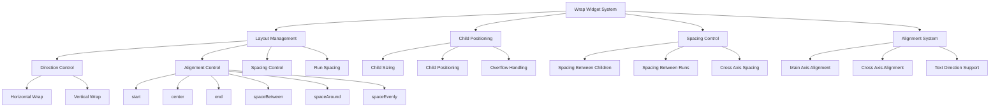

# 🔄 Flutter Wrap 组件深度解析：从基础到高级

[](https://flutter.dev/)
[](https://dart.dev/)
[](LICENSE)

> 深入掌握 Wrap、Chip、Flexible、Expanded 等实用控件的高级用法和实际应用，构建灵活响应式布局

## 📊 文章概览

| 章节                                          | 内容           | 难度等级 |
| --------------------------------------------- | -------------- | -------- |
| [Wrap 组件](#wrap-组件)                       | 流式布局控件   | ⭐⭐     |
| [Chip 组件系列](#chip-组件系列)               | 标签和选择组件 | ⭐⭐⭐   |
| [Flexible 和 Expanded](#flexible-和-expanded) | 弹性布局组件   | ⭐⭐⭐   |
| [Card 组件](#card-组件)                       | 卡片容器组件   | ⭐⭐     |
| [Tooltip 组件](#tooltip-组件)                 | 提示信息组件   | ⭐⭐     |
| [Badge 组件](#badge-组件)                     | 徽章标识组件   | ⭐⭐     |
| [Divider 组件](#divider-组件)                 | 分割线组件     | ⭐       |
| [实际项目应用](#实际项目应用)                 | 真实项目案例   | ⭐⭐⭐⭐ |

## 🎯 学习目标

- ✅ 掌握 Wrap 组件的流式布局原理和使用方法
- ✅ 学会 Chip 系列组件的各种样式和交互效果
- ✅ 理解 Flexible 和 Expanded 的弹性布局机制
- ✅ 能够实现响应式布局和自适应界面
- ✅ 掌握各种装饰组件的使用技巧

## 📋 目录导航

<details>
<summary>🎯 快速导航</summary>

- [Wrap 组件](#wrap-组件) - 流式布局控件
- [Chip 组件系列](#chip-组件系列) - 标签和选择组件
- [Flexible 和 Expanded](#flexible-和-expanded) - 弹性布局组件
- [Card 组件](#card-组件) - 卡片容器组件
- [Tooltip 组件](#tooltip-组件) - 提示信息组件
- [Badge 组件](#badge-组件) - 徽章标识组件
- [Divider 组件](#divider-组件) - 分割线组件
- [实际项目应用](#实际项目应用) - 真实项目案例

</details>

---

## 📋 概述

本文档详细介绍 Flutter 中 Wrap 组件及其他实用控件的使用方法、最佳实践和高级技巧。Wrap 组件是 Flutter 中实现流式布局的重要工具，能够自动换行处理子组件，特别适用于标签、按钮组等场景。

## 🏗️ Wrap 组件架构图



### 📊 Wrap 组件特性对比

| 特性           | Wrap         | Row          | Column       | Flow           |
| -------------- | ------------ | ------------ | ------------ | -------------- |
| **自动换行**   | ✅           | ❌           | ❌           | ✅             |
| **性能**       | ⭐⭐⭐⭐     | ⭐⭐⭐⭐⭐   | ⭐⭐⭐⭐⭐   | ⭐⭐⭐         |
| **灵活性**     | ⭐⭐⭐⭐     | ⭐⭐⭐       | ⭐⭐⭐       | ⭐⭐⭐⭐⭐     |
| **使用复杂度** | ⭐⭐         | ⭐           | ⭐           | ⭐⭐⭐⭐       |
| **适用场景**   | 标签、按钮组 | 简单水平布局 | 简单垂直布局 | 复杂自定义布局 |

## 🔄 Wrap 组件

### 基础 Wrap 布局

**Wrap 布局的核心价值**：
Wrap 组件是 Flutter 中实现流式布局的重要工具，能够自动换行处理子组件，特别适用于标签、按钮组等场景。

**Wrap vs Row 对比**：

- **Row 布局**：子组件沿水平方向排列，超出宽度时会溢出
- **Wrap 布局**：子组件沿水平方向排列，超出宽度时自动换行

**Wrap 布局的优势**：

- **自动换行**：无需手动处理换行逻辑
- **响应式设计**：能够适应不同屏幕尺寸
- **灵活间距**：支持主轴和交叉轴间距控制
- **多种对齐**：支持多种对齐方式

**应用场景**：

- **标签列表**：文章标签、商品分类等
- **按钮组**：操作按钮、功能按钮等
- **搜索历史**：搜索关键词的历史记录
- **用户兴趣**：用户选择的兴趣标签

### 设计原则

**Wrap 布局设计要点**：

- **合理间距**：设置合适的 `spacing` 和 `runSpacing`
- **对齐方式**：根据内容选择合适的对齐方式
- **响应式考虑**：考虑不同屏幕尺寸下的显示效果
- **性能优化**：避免过多的子组件影响性能

````dart
Widget _buildWrapAlignmentDemo() {
  return Card(
    child: Padding(
      padding: EdgeInsets.all(16),
      child: Column(
        crossAxisAlignment: CrossAxisAlignment.start,
        children: [
          Text(
            'Wrap 对齐方式演示',
            style: TextStyle(
              fontSize: 18,
              fontWeight: FontWeight.bold,
            ),
          ),
          SizedBox(height: 16),

          _buildWrapAlignment('Start', WrapAlignment.start),
          _buildWrapAlignment('Center', WrapAlignment.center),
          _buildWrapAlignment('End', WrapAlignment.end),
          _buildWrapAlignment('SpaceBetween', WrapAlignment.spaceBetween),
          _buildWrapAlignment('SpaceAround', WrapAlignment.spaceAround),
          _buildWrapAlignment('SpaceEvenly', WrapAlignment.spaceEvenly),
        ],
      ),
    ),
  );
}

```dart
Widget _buildWrapAlignment(String title, WrapAlignment alignment) {
  return Column(
    crossAxisAlignment: CrossAxisAlignment.start,
    children: [
      Text('$title:'),
      SizedBox(height: 4),
      Container(
        width: double.infinity,
        padding: EdgeInsets.all(12),
        decoration: BoxDecoration(
          color: Colors.grey[100],
          border: Border.all(color: Colors.grey[300]!),
          borderRadius: BorderRadius.circular(8),
        ),
        child: Wrap(
          alignment: alignment,
          spacing: 8,
          runSpacing: 8,
          children: List.generate(4, (index) {
            return Container(
              padding: EdgeInsets.symmetric(
                horizontal: 12,
                vertical: 6,
              ),
              decoration: BoxDecoration(
                color: Colors.blue,
                borderRadius: BorderRadius.circular(16),
              ),
              child: Text(
                'Item ${index + 1}',
                style: TextStyle(
                  color: Colors.white,
                  fontSize: 12,
                ),
              ),
            );
          }),
        ),
      ),
      SizedBox(height: 12),
    ],
  );
}
````

## 🏷️ Chip 组件系列

### Chip 组件全家桶

```dart
class ChipFamilyExample extends StatefulWidget {
  @override
  _ChipFamilyExampleState createState() => _ChipFamilyExampleState();
}

class _ChipFamilyExampleState extends State<ChipFamilyExample> {
  Set<String> _selectedFilters = {'Flutter', 'Mobile'};
  String _selectedChoice = 'Option 1';
  List<String> _inputChips = ['Tag 1', 'Tag 2', 'Tag 3'];

  @override
  Widget build(BuildContext context) {
    return Scaffold(
      appBar: AppBar(
        title: Text('Chip Family'),
      ),
      body: SingleChildScrollView(
        padding: EdgeInsets.all(16),
        child: Column(
          crossAxisAlignment: CrossAxisAlignment.start,
          children: [
            // 基础 Chip
            _buildSection(
              '基础 Chip',
              Wrap(
                spacing: 8,
                children: [
                  Chip(
                    label: Text('Basic Chip'),
                    avatar: CircleAvatar(
                      backgroundColor: Colors.blue,
                      child: Text('B'),
                    ),
                  ),
                  Chip(
                    label: Text('With Icon'),
                    avatar: Icon(Icons.star, size: 20),
                    backgroundColor: Colors.orange[100],
                  ),
                  Chip(
                    label: Text('Deletable'),
                    onDeleted: () {
                      ScaffoldMessenger.of(context).showSnackBar(
                        SnackBar(content: Text('Chip deleted')),
                      );
                    },
                    deleteIcon: Icon(Icons.close),
                  ),
                ],
              ),
            ),

            // Choice Chip
            _buildSection(
              'Choice Chip (单选)',
              Wrap(
                spacing: 8,
                children: ['Option 1', 'Option 2', 'Option 3'].map((option) {
                  return ChoiceChip(
                    label: Text(option),
                    selected: _selectedChoice == option,
                    onSelected: (selected) {
                      setState(() {
                        _selectedChoice = option;
                      });
                    },
                    selectedColor: Colors.blue[100],
                    avatar: _selectedChoice == option
                        ? Icon(Icons.check, size: 16)
                        : null,
                  );
                }).toList(),
              ),
            ),

            // Filter Chip
            _buildSection(
              'Filter Chip (多选)',
              Wrap(
                spacing: 8,
                children: ['Flutter', 'Dart', 'Mobile', 'Web', 'Desktop']
                    .map((filter) {
                  return FilterChip(
                    label: Text(filter),
                    selected: _selectedFilters.contains(filter),
                    onSelected: (selected) {
                      setState(() {
                        if (selected) {
                          _selectedFilters.add(filter);
                        } else {
                          _selectedFilters.remove(filter);
                        }
                      });
                    },
                    checkmarkColor: Colors.white,
                    selectedColor: Colors.green,
                    backgroundColor: Colors.grey[200],
                  );
                }).toList(),
              ),
            ),

            // Input Chip
            _buildSection(
              'Input Chip (可编辑)',
              Wrap(
                spacing: 8,
                children: _inputChips.map((chip) {
                  return InputChip(
                    label: Text(chip),
                    avatar: CircleAvatar(
                      backgroundColor: Colors.purple,
                      child: Text(
                        chip.substring(chip.length - 1),
                        style: TextStyle(color: Colors.white),
                      ),
                    ),
                    onDeleted: () {
                      setState(() {
                        _inputChips.remove(chip);
                      });
                    },
                    onPressed: () {
                      _showEditChipDialog(chip);
                    },
                  );
                }).toList()
                  ..add(
                    ActionChip(
                      label: Text('Add Tag'),
                      avatar: Icon(Icons.add),
                      onPressed: _showAddChipDialog,
                    ),
                  ),
              ),
            ),

            // Action Chip
            _buildSection(
              'Action Chip (操作)',
              Wrap(
                spacing: 8,
                children: [
                  ActionChip(
                    label: Text('Share'),
                    avatar: Icon(Icons.share),
                    onPressed: () {
                      ScaffoldMessenger.of(context).showSnackBar(
                        SnackBar(content: Text('Share action')),
                      );
                    },
                  ),
                  ActionChip(
                    label: Text('Download'),
                    avatar: Icon(Icons.download),
                    onPressed: () {
                      ScaffoldMessenger.of(context).showSnackBar(
                        SnackBar(content: Text('Download action')),
                      );
                    },
                  ),
                  ActionChip(
                    label: Text('Favorite'),
                    avatar: Icon(Icons.favorite),
                    backgroundColor: Colors.red[100],
                    onPressed: () {
                      ScaffoldMessenger.of(context).showSnackBar(
                        SnackBar(content: Text('Added to favorites')),
                      );
                    },
                  ),
                ],
              ),
            ),

            SizedBox(height: 20),

            // 选择结果显示
            Container(
              width: double.infinity,
              padding: EdgeInsets.all(16),
              decoration: BoxDecoration(
                color: Colors.blue[50],
                borderRadius: BorderRadius.circular(8),
                border: Border.all(color: Colors.blue[200]!),
              ),
              child: Column(
                crossAxisAlignment: CrossAxisAlignment.start,
                children: [
                  Text(
                    '选择结果:',
                    style: TextStyle(
                      fontSize: 16,
                      fontWeight: FontWeight.bold,
                    ),
                  ),
                  SizedBox(height: 8),
                  Text('Choice: $_selectedChoice'),
                  Text('Filters: ${_selectedFilters.join(", ")}'),
                  Text('Input Chips: ${_inputChips.join(", ")}'),
                ],
              ),
            ),
          ],
        ),
      ),
    );
  }

  Widget _buildSection(String title, Widget content) {
    return Column(
      crossAxisAlignment: CrossAxisAlignment.start,
      children: [
        Text(
          title,
          style: TextStyle(
            fontSize: 16,
            fontWeight: FontWeight.bold,
          ),
        ),
        SizedBox(height: 8),
        content,
        SizedBox(height: 20),
      ],
    );
  }

  void _showAddChipDialog() {
    String newChip = '';
    showDialog(
      context: context,
      builder: (context) {
        return AlertDialog(
          title: Text('Add New Tag'),
          content: TextField(
            onChanged: (value) {
              newChip = value;
            },
            decoration: InputDecoration(
              hintText: 'Enter tag name',
            ),
          ),
          actions: [
            TextButton(
              onPressed: () {
                Navigator.of(context).pop();
              },
              child: Text('Cancel'),
            ),
            ElevatedButton(
              onPressed: () {
                if (newChip.isNotEmpty) {
                  setState(() {
                    _inputChips.add(newChip);
                  });
                }
                Navigator.of(context).pop();
              },
              child: Text('Add'),
            ),
          ],
        );
      },
    );
  }

  void _showEditChipDialog(String currentChip) {
    String editedChip = currentChip;
    showDialog(
      context: context,
      builder: (context) {
        return AlertDialog(
          title: Text('Edit Tag'),
          content: TextField(
            controller: TextEditingController(text: currentChip),
            onChanged: (value) {
              editedChip = value;
            },
            decoration: InputDecoration(
              hintText: 'Enter tag name',
            ),
          ),
          actions: [
            TextButton(
              onPressed: () {
                Navigator.of(context).pop();
              },
              child: Text('Cancel'),
            ),
            ElevatedButton(
              onPressed: () {
                if (editedChip.isNotEmpty) {
                  setState(() {
                    int index = _inputChips.indexOf(currentChip);
                    _inputChips[index] = editedChip;
                  });
                }
                Navigator.of(context).pop();
              },
              child: Text('Save'),
            ),
          ],
        );
      },
    );
  }
}
```

## 📏 Flexible 和 Expanded

### Flex 布局详解

```dart
class FlexLayoutExample extends StatelessWidget {
  @override
  Widget build(BuildContext context) {
    return Scaffold(
      appBar: AppBar(
        title: Text('Flexible vs Expanded'),
      ),
      body: SingleChildScrollView(
        padding: EdgeInsets.all(16),
        child: Column(
          crossAxisAlignment: CrossAxisAlignment.start,
          children: [
            _buildSection(
              '基础 Row 布局 (固定宽度)',
              Row(
                children: [
                  _buildBox('Box 1', Colors.red, width: 100),
                  _buildBox('Box 2', Colors.green, width: 100),
                  _buildBox('Box 3', Colors.blue, width: 100),
                ],
              ),
            ),

            _buildSection(
              'Expanded 布局 (平均分配)',
              Row(
                children: [
                  Expanded(
                    child: _buildBox('Expanded 1', Colors.red),
                  ),
                  Expanded(
                    child: _buildBox('Expanded 2', Colors.green),
                  ),
                  Expanded(
                    child: _buildBox('Expanded 3', Colors.blue),
                  ),
                ],
              ),
            ),

            _buildSection(
              'Expanded 布局 (不同比例)',
              Row(
                children: [
                  Expanded(
                    flex: 1,
                    child: _buildBox('Flex 1', Colors.red),
                  ),
                  Expanded(
                    flex: 2,
                    child: _buildBox('Flex 2', Colors.green),
                  ),
                  Expanded(
                    flex: 3,
                    child: _buildBox('Flex 3', Colors.blue),
                  ),
                ],
              ),
            ),

            _buildSection(
              'Flexible 布局 (自适应)',
              Row(
                children: [
                  Flexible(
                    child: _buildBox('Flexible 1\nShort', Colors.red),
                  ),
                  Flexible(
                    child: _buildBox('Flexible 2\nMedium Text', Colors.green),
                  ),
                  Flexible(
                    child: _buildBox('Flexible 3\nVery Long Text Content', Colors.blue),
                  ),
                ],
              ),
            ),

            _buildSection(
              '混合布局 (固定 + Expanded)',
              Row(
                children: [
                  _buildBox('Fixed', Colors.orange, width: 80),
                  Expanded(
                    child: _buildBox('Expanded', Colors.purple),
                  ),
                  _buildBox('Fixed', Colors.teal, width: 80),
                ],
              ),
            ),

            _buildSection(
              'Spacer 使用',
              Row(
                children: [
                  _buildBox('Left', Colors.red, width: 80),
                  Spacer(),
                  _buildBox('Center', Colors.green, width: 80),
                  Spacer(),
                  _buildBox('Right', Colors.blue, width: 80),
                ],
              ),
            ),

            SizedBox(height: 20),

            // 实际应用示例
            Text(
              '实际应用示例:',
              style: TextStyle(
                fontSize: 18,
                fontWeight: FontWeight.bold,
              ),
            ),
            SizedBox(height: 16),

            // 用户信息卡片
            Card(
              child: Padding(
                padding: EdgeInsets.all(16),
                child: Row(
                  children: [
                    CircleAvatar(
                      radius: 30,
                      backgroundColor: Colors.blue,
                      child: Text(
                        'JD',
                        style: TextStyle(
                          color: Colors.white,
                          fontSize: 20,
                          fontWeight: FontWeight.bold,
                        ),
                      ),
                    ),
                    SizedBox(width: 16),
                    Expanded(
                      child: Column(
                        crossAxisAlignment: CrossAxisAlignment.start,
                        children: [
                          Text(
                            'John Doe',
                            style: TextStyle(
                              fontSize: 18,
                              fontWeight: FontWeight.bold,
                            ),
                          ),
                          Text(
                            'Software Engineer at Tech Company',
                            style: TextStyle(
                              color: Colors.grey[600],
                            ),
                          ),
                          Text(
                            'john.doe@example.com',
                            style: TextStyle(
                              color: Colors.blue,
                            ),
                          ),
                        ],
                      ),
                    ),
                    Column(
                      children: [
                        IconButton(
                          onPressed: () {},
                          icon: Icon(Icons.message),
                        ),
                        IconButton(
                          onPressed: () {},
                          icon: Icon(Icons.call),
                        ),
                      ],
                    ),
                  ],
                ),
              ),
            ),
          ],
        ),
      ),
    );
  }

  Widget _buildSection(String title, Widget content) {
    return Column(
      crossAxisAlignment: CrossAxisAlignment.start,
      children: [
        Text(
          title,
          style: TextStyle(
            fontSize: 16,
            fontWeight: FontWeight.bold,
          ),
        ),
        SizedBox(height: 8),
        Container(
          width: double.infinity,
          height: 60,
          decoration: BoxDecoration(
            border: Border.all(color: Colors.grey[300]!),
            borderRadius: BorderRadius.circular(8),
          ),
          child: content,
        ),
        SizedBox(height: 16),
      ],
    );
  }

  Widget _buildBox(String text, Color color, {double? width}) {
    return Container(
      width: width,
      height: 60,
      decoration: BoxDecoration(
        color: color.withOpacity(0.7),
        border: Border.all(color: color),
      ),
      child: Center(
        child: Text(
          text,
          style: TextStyle(
            color: Colors.white,
            fontWeight: FontWeight.bold,
            fontSize: 12,
          ),
          textAlign: TextAlign.center,
        ),
      ),
    );
  }
}
```

## 🃏 Card 组件

### Card 组件高级用法

```dart
class CardAdvancedExample extends StatelessWidget {
  @override
  Widget build(BuildContext context) {
    return Scaffold(
      appBar: AppBar(
        title: Text('Advanced Card'),
      ),
      body: SingleChildScrollView(
        padding: EdgeInsets.all(16),
        child: Column(
          children: [
            // 基础卡片
            _buildBasicCard(),
            SizedBox(height: 16),

            // 产品卡片
            _buildProductCard(),
            SizedBox(height: 16),

            // 新闻卡片
            _buildNewsCard(),
            SizedBox(height: 16),

            // 统计卡片
            _buildStatsCard(),
            SizedBox(height: 16),

            // 用户资料卡片
            _buildProfileCard(),
          ],
        ),
      ),
    );
  }

  Widget _buildBasicCard() {
    return Card(
      elevation: 4,
      shape: RoundedRectangleBorder(
        borderRadius: BorderRadius.circular(12),
      ),
      child: Padding(
        padding: EdgeInsets.all(16),
        child: Column(
          crossAxisAlignment: CrossAxisAlignment.start,
          children: [
            Text(
              '基础卡片',
              style: TextStyle(
                fontSize: 18,
                fontWeight: FontWeight.bold,
              ),
            ),
            SizedBox(height: 8),
            Text(
              '这是一个基础的卡片组件，具有阴影效果和圆角边框。',
              style: TextStyle(color: Colors.grey[600]),
            ),
          ],
        ),
      ),
    );
  }

  Widget _buildProductCard() {
    return Card(
      elevation: 6,
      shape: RoundedRectangleBorder(
        borderRadius: BorderRadius.circular(16),
      ),
      clipBehavior: Clip.antiAlias,
      child: Column(
        crossAxisAlignment: CrossAxisAlignment.start,
        children: [
          Container(
            height: 200,
            width: double.infinity,
            decoration: BoxDecoration(
              gradient: LinearGradient(
                colors: [Colors.blue[400]!, Colors.blue[600]!],
                begin: Alignment.topLeft,
                end: Alignment.bottomRight,
              ),
            ),
            child: Center(
              child: Icon(
                Icons.phone_android,
                size: 80,
                color: Colors.white,
              ),
            ),
          ),
          Padding(
            padding: EdgeInsets.all(16),
            child: Column(
              crossAxisAlignment: CrossAxisAlignment.start,
              children: [
                Row(
                  mainAxisAlignment: MainAxisAlignment.spaceBetween,
                  children: [
                    Text(
                      'iPhone 15 Pro',
                      style: TextStyle(
                        fontSize: 20,
                        fontWeight: FontWeight.bold,
                      ),
                    ),
                    Container(
                      padding: EdgeInsets.symmetric(
                        horizontal: 8,
                        vertical: 4,
                      ),
                      decoration: BoxDecoration(
                        color: Colors.green,
                        borderRadius: BorderRadius.circular(12),
                      ),
                      child: Text(
                        'NEW',
                        style: TextStyle(
                          color: Colors.white,
                          fontSize: 12,
                          fontWeight: FontWeight.bold,
                        ),
                      ),
                    ),
                  ],
                ),
                SizedBox(height: 8),
                Text(
                  '最新的iPhone，配备A17 Pro芯片，钛金属设计。',
                  style: TextStyle(color: Colors.grey[600]),
                ),
                SizedBox(height: 12),
                Row(
                  mainAxisAlignment: MainAxisAlignment.spaceBetween,
                  children: [
                    Text(
                      '¥8999',
                      style: TextStyle(
                        fontSize: 24,
                        fontWeight: FontWeight.bold,
                        color: Colors.red,
                      ),
                    ),
                    Row(
                      children: [
                        IconButton(
                          onPressed: () {},
                          icon: Icon(Icons.favorite_border),
                        ),
                        ElevatedButton(
                          onPressed: () {},
                          child: Text('购买'),
                        ),
                      ],
                    ),
                  ],
                ),
              ],
            ),
          ),
        ],
      ),
    );
  }

  Widget _buildNewsCard() {
    return Card(
      elevation: 2,
      shape: RoundedRectangleBorder(
        borderRadius: BorderRadius.circular(12),
      ),
      child: InkWell(
        borderRadius: BorderRadius.circular(12),
        onTap: () {},
        child: Padding(
          padding: EdgeInsets.all(16),
          child: Row(
            children: [
              Container(
                width: 80,
                height: 80,
                decoration: BoxDecoration(
                  color: Colors.orange[100],
                  borderRadius: BorderRadius.circular(8),
                ),
                child: Icon(
                  Icons.article,
                  size: 40,
                  color: Colors.orange,
                ),
              ),
              SizedBox(width: 16),
              Expanded(
                child: Column(
                  crossAxisAlignment: CrossAxisAlignment.start,
                  children: [
                    Text(
                      'Flutter 3.16 发布',
                      style: TextStyle(
                        fontSize: 16,
                        fontWeight: FontWeight.bold,
                      ),
                      maxLines: 2,
                      overflow: TextOverflow.ellipsis,
                    ),
                    SizedBox(height: 4),
                    Text(
                      'Google 发布了 Flutter 3.16，带来了许多新功能和性能改进...',
                      style: TextStyle(
                        color: Colors.grey[600],
                        fontSize: 14,
                      ),
                      maxLines: 2,
                      overflow: TextOverflow.ellipsis,
                    ),
                    SizedBox(height: 8),
                    Row(
                      children: [
                        Icon(
                          Icons.access_time,
                          size: 16,
                          color: Colors.grey[500],
                        ),
                        SizedBox(width: 4),
                        Text(
                          '2小时前',
                          style: TextStyle(
                            color: Colors.grey[500],
                            fontSize: 12,
                          ),
                        ),
                        Spacer(),
                        Icon(
                          Icons.thumb_up_outlined,
                          size: 16,
                          color: Colors.grey[500],
                        ),
                        SizedBox(width: 4),
                        Text(
                          '128',
                          style: TextStyle(
                            color: Colors.grey[500],
                            fontSize: 12,
                          ),
                        ),
                      ],
                    ),
                  ],
                ),
              ),
            ],
          ),
        ),
      ),
    );
  }

  Widget _buildStatsCard() {
    return Card(
      elevation: 4,
      shape: RoundedRectangleBorder(
        borderRadius: BorderRadius.circular(16),
      ),
      child: Padding(
        padding: EdgeInsets.all(20),
        child: Column(
          children: [
            Text(
              '今日统计',
              style: TextStyle(
                fontSize: 18,
                fontWeight: FontWeight.bold,
              ),
            ),
            SizedBox(height: 20),
            Row(
              children: [
                Expanded(
                  child: _buildStatItem(
                    '访问量',
                    '1,234',
                    Icons.visibility,
                    Colors.blue,
                  ),
                ),
                Container(
                  width: 1,
                  height: 60,
                  color: Colors.grey[300],
                ),
                Expanded(
                  child: _buildStatItem(
                    '用户数',
                    '567',
                    Icons.people,
                    Colors.green,
                  ),
                ),
                Container(
                  width: 1,
                  height: 60,
                  color: Colors.grey[300],
                ),
                Expanded(
                  child: _buildStatItem(
                    '收入',
                    '¥8,900',
                    Icons.attach_money,
                    Colors.orange,
                  ),
                ),
              ],
            ),
          ],
        ),
      ),
    );
  }

  Widget _buildStatItem(String label, String value, IconData icon, Color color) {
    return Column(
      children: [
        Icon(
          icon,
          size: 32,
          color: color,
        ),
        SizedBox(height: 8),
        Text(
          value,
          style: TextStyle(
            fontSize: 20,
            fontWeight: FontWeight.bold,
            color: color,
          ),
        ),
        Text(
          label,
          style: TextStyle(
            color: Colors.grey[600],
            fontSize: 12,
          ),
        ),
      ],
    );
  }

  Widget _buildProfileCard() {
    return Card(
      elevation: 8,
      shape: RoundedRectangleBorder(
        borderRadius: BorderRadius.circular(20),
      ),
      child: Container(
        decoration: BoxDecoration(
          borderRadius: BorderRadius.circular(20),
          gradient: LinearGradient(
            colors: [Colors.purple[400]!, Colors.blue[400]!],
            begin: Alignment.topLeft,
            end: Alignment.bottomRight,
          ),
        ),
        child: Padding(
          padding: EdgeInsets.all(20),
          child: Column(
            children: [
              CircleAvatar(
                radius: 40,
                backgroundColor: Colors.white,
                child: Text(
                  'JD',
                  style: TextStyle(
                    fontSize: 32,
                    fontWeight: FontWeight.bold,
                    color: Colors.purple,
                  ),
                ),
              ),
              SizedBox(height: 16),
              Text(
                'John Doe',
                style: TextStyle(
                  fontSize: 24,
                  fontWeight: FontWeight.bold,
                  color: Colors.white,
                ),
              ),
              Text(
                'Flutter Developer',
                style: TextStyle(
                  fontSize: 16,
                  color: Colors.white70,
                ),
              ),
              SizedBox(height: 20),
              Row(
                mainAxisAlignment: MainAxisAlignment.spaceEvenly,
                children: [
                  _buildProfileStat('Projects', '12'),
                  _buildProfileStat('Followers', '1.2K'),
                  _buildProfileStat('Following', '234'),
                ],
              ),
              SizedBox(height: 20),
              ElevatedButton(
                onPressed: () {},
                style: ElevatedButton.styleFrom(
                  backgroundColor: Colors.white,
                  foregroundColor: Colors.purple,
                  shape: RoundedRectangleBorder(
                    borderRadius: BorderRadius.circular(20),
                  ),
                ),
                child: Text('Follow'),
              ),
            ],
          ),
        ),
      ),
    );
  }

  Widget _buildProfileStat(String label, String value) {
    return Column(
      children: [
        Text(
          value,
          style: TextStyle(
            fontSize: 20,
            fontWeight: FontWeight.bold,
            color: Colors.white,
          ),
        ),
        Text(
          label,
          style: TextStyle(
            fontSize: 12,
            color: Colors.white70,
          ),
        ),
      ],
    );
  }
}
```

## 💡 Tooltip 组件

### Tooltip 使用示例

```dart
class TooltipExample extends StatelessWidget {
  @override
  Widget build(BuildContext context) {
    return Scaffold(
      appBar: AppBar(
        title: Text('Tooltip Examples'),
      ),
      body: Padding(
        padding: EdgeInsets.all(16),
        child: Column(
          crossAxisAlignment: CrossAxisAlignment.start,
          children: [
            Text(
              'Tooltip 使用示例:',
              style: TextStyle(
                fontSize: 18,
                fontWeight: FontWeight.bold,
              ),
            ),
            SizedBox(height: 20),

            // 基础 Tooltip
            Wrap(
              spacing: 16,
              runSpacing: 16,
              children: [
                Tooltip(
                  message: '这是一个基础的提示信息',
                  child: ElevatedButton(
                    onPressed: () {},
                    child: Text('基础 Tooltip'),
                  ),
                ),

                Tooltip(
                  message: '长按或悬停查看详细信息',
                  preferBelow: false,
                  child: IconButton(
                    onPressed: () {},
                    icon: Icon(Icons.info),
                  ),
                ),

                Tooltip(
                  message: '自定义样式的提示',
                  decoration: BoxDecoration(
                    color: Colors.red,
                    borderRadius: BorderRadius.circular(8),
                  ),
                  textStyle: TextStyle(
                    color: Colors.white,
                    fontSize: 14,
                  ),
                  child: Container(
                    padding: EdgeInsets.all(12),
                    decoration: BoxDecoration(
                      color: Colors.red[100],
                      borderRadius: BorderRadius.circular(8),
                    ),
                    child: Text('自定义样式'),
                  ),
                ),
              ],
            ),

            SizedBox(height: 30),

            // 实际应用场景
            Text(
              '实际应用场景:',
              style: TextStyle(
                fontSize: 18,
                fontWeight: FontWeight.bold,
              ),
            ),
            SizedBox(height: 16),

            // 工具栏
            Card(
              child: Padding(
                padding: EdgeInsets.all(16),
                child: Row(
                  mainAxisAlignment: MainAxisAlignment.spaceEvenly,
                  children: [
                    Tooltip(
                      message: '保存文档',
                      child: IconButton(
                        onPressed: () {},
                        icon: Icon(Icons.save),
                      ),
                    ),
                    Tooltip(
                      message: '打开文件',
                      child: IconButton(
                        onPressed: () {},
                        icon: Icon(Icons.folder_open),
                      ),
                    ),
                    Tooltip(
                      message: '打印文档',
                      child: IconButton(
                        onPressed: () {},
                        icon: Icon(Icons.print),
                      ),
                    ),
                    Tooltip(
                      message: '分享文档',
                      child: IconButton(
                        onPressed: () {},
                        icon: Icon(Icons.share),
                      ),
                    ),
                    Tooltip(
                      message: '更多选项',
                      child: IconButton(
                        onPressed: () {},
                        icon: Icon(Icons.more_vert),
                      ),
                    ),
                  ],
                ),
              ),
            ),
          ],
        ),
      ),
    );
  }
}
```

## 🏷️ Badge 组件

### Badge 使用示例

```dart
class BadgeExample extends StatefulWidget {
  @override
  _BadgeExampleState createState() => _BadgeExampleState();
}

class _BadgeExampleState extends State<BadgeExample> {
  int _notificationCount = 5;
  int _messageCount = 12;

  @override
  Widget build(BuildContext context) {
    return Scaffold(
      appBar: AppBar(
        title: Text('Badge Examples'),
        actions: [
          Badge(
            label: Text('$_notificationCount'),
            child: IconButton(
              onPressed: () {
                setState(() {
                  _notificationCount = 0;
                });
              },
              icon: Icon(Icons.notifications),
            ),
          ),
          SizedBox(width: 16),
        ],
      ),
      body: Padding(
        padding: EdgeInsets.all(16),
        child: Column(
          crossAxisAlignment: CrossAxisAlignment.start,
          children: [
            Text(
              'Badge 使用示例:',
              style: TextStyle(
                fontSize: 18,
                fontWeight: FontWeight.bold,
              ),
            ),
            SizedBox(height: 20),

            // 基础 Badge
            Wrap(
              spacing: 20,
              runSpacing: 20,
              children: [
                Badge(
                  label: Text('3'),
                  child: Icon(Icons.mail, size: 32),
                ),

                Badge(
                  label: Text('99+'),
                  backgroundColor: Colors.red,
                  child: Icon(Icons.message, size: 32),
                ),

                Badge(
                  child: Icon(Icons.shopping_cart, size: 32),
                ),

                Badge(
                  label: Text('NEW'),
                  backgroundColor: Colors.green,
                  child: Container(
                    padding: EdgeInsets.all(8),
                    decoration: BoxDecoration(
                      color: Colors.blue[100],
                      borderRadius: BorderRadius.circular(8),
                    ),
                    child: Text('Feature'),
                  ),
                ),
              ],
            ),

            SizedBox(height: 30),

            // 实际应用
            Text(
              '实际应用场景:',
              style: TextStyle(
                fontSize: 18,
                fontWeight: FontWeight.bold,
              ),
            ),
            SizedBox(height: 16),

            // 底部导航栏模拟
            Card(
              child: Padding(
                padding: EdgeInsets.symmetric(vertical: 16),
                child: Row(
                  mainAxisAlignment: MainAxisAlignment.spaceEvenly,
                  children: [
                    _buildNavItem(Icons.home, 'Home', 0),
                    _buildNavItem(Icons.search, 'Search', 0),
                    _buildNavItem(Icons.message, 'Messages', _messageCount),
                    _buildNavItem(Icons.person, 'Profile', 1),
                  ],
                ),
              ),
            ),

            SizedBox(height: 20),

            // 控制按钮
            Row(
              children: [
                ElevatedButton(
                  onPressed: () {
                    setState(() {
                      _messageCount++;
                    });
                  },
                  child: Text('增加消息'),
                ),
                SizedBox(width: 16),
                ElevatedButton(
                  onPressed: () {
                    setState(() {
                      _messageCount = 0;
                    });
                  },
                  child: Text('清除消息'),
                ),
              ],
            ),
          ],
        ),
      ),
    );
  }

  Widget _buildNavItem(IconData icon, String label, int count) {
    return Column(
      mainAxisSize: MainAxisSize.min,
      children: [
        Badge(
          label: count > 0 ? Text('$count') : null,
          isLabelVisible: count > 0,
          child: Icon(icon, size: 28),
        ),
        SizedBox(height: 4),
        Text(
          label,
          style: TextStyle(fontSize: 12),
        ),
      ],
    );
  }
}
```

## ➖ Divider 组件

### Divider 使用示例

```dart
class DividerExample extends StatelessWidget {
  @override
  Widget build(BuildContext context) {
    return Scaffold(
      appBar: AppBar(
        title: Text('Divider Examples'),
      ),
      body: SingleChildScrollView(
        child: Column(
          children: [
            // 基础分割线
            ListTile(
              leading: Icon(Icons.home),
              title: Text('Home'),
              trailing: Icon(Icons.arrow_forward_ios),
            ),
            Divider(),
            ListTile(
              leading: Icon(Icons.settings),
              title: Text('Settings'),
              trailing: Icon(Icons.arrow_forward_ios),
            ),
            Divider(color: Colors.red, thickness: 2),
            ListTile(
              leading: Icon(Icons.help),
              title: Text('Help'),
              trailing: Icon(Icons.arrow_forward_ios),
            ),

            SizedBox(height: 20),

            // 垂直分割线
            Container(
              height: 100,
              child: Row(
                children: [
                  Expanded(
                    child: Container(
                      color: Colors.blue[100],
                      child: Center(child: Text('Left')),
                    ),
                  ),
                  VerticalDivider(
                    color: Colors.blue,
                    thickness: 2,
                    width: 20,
                  ),
                  Expanded(
                    child: Container(
                      color: Colors.green[100],
                      child: Center(child: Text('Right')),
                    ),
                  ),
                ],
              ),
            ),

            SizedBox(height: 20),

            // 自定义分割线
            Padding(
              padding: EdgeInsets.symmetric(horizontal: 16),
              child: Column(
                children: [
                  Text('自定义分割线'),
                  SizedBox(height: 10),
                  Container(
                    height: 1,
                    decoration: BoxDecoration(
                      gradient: LinearGradient(
                        colors: [Colors.transparent, Colors.blue, Colors.transparent],
                      ),
                    ),
                  ),
                  SizedBox(height: 20),
                  Row(
                    children: [
                      Expanded(child: Divider()),
                      Padding(
                        padding: EdgeInsets.symmetric(horizontal: 16),
                        child: Text('OR'),
                      ),
                      Expanded(child: Divider()),
                    ],
                  ),
                ],
              ),
            ),
          ],
        ),
      ),
    );
  }
}
```

## 🚀 实际项目应用

### 电商商品筛选页面

```dart
class ProductFilterPage extends StatefulWidget {
  @override
  _ProductFilterPageState createState() => _ProductFilterPageState();
}

class _ProductFilterPageState extends State<ProductFilterPage> {
  Set<String> _selectedCategories = {'Electronics'};
  Set<String> _selectedBrands = {'Apple', 'Samsung'};
  RangeValues _priceRange = RangeValues(100, 5000);
  String _sortBy = 'Price';

  final List<String> _categories = [
    'Electronics', 'Clothing', 'Books', 'Home', 'Sports', 'Beauty'
  ];

  final List<String> _brands = [
    'Apple', 'Samsung', 'Nike', 'Adidas', 'Sony', 'LG'
  ];

  final List<String> _sortOptions = [
    'Price', 'Rating', 'Newest', 'Popular'
  ];

  @override
  Widget build(BuildContext context) {
    return Scaffold(
      appBar: AppBar(
        title: Text('商品筛选'),
        actions: [
          TextButton(
            onPressed: _resetFilters,
            child: Text('重置'),
          ),
        ],
      ),
      body: Column(
        children: [
          Expanded(
            child: SingleChildScrollView(
              padding: EdgeInsets.all(16),
              child: Column(
                crossAxisAlignment: CrossAxisAlignment.start,
                children: [
                  // 分类筛选
                  _buildFilterSection(
                    '商品分类',
                    Wrap(
                      spacing: 8,
                      runSpacing: 8,
                      children: _categories.map((category) {
                        return FilterChip(
                          label: Text(category),
                          selected: _selectedCategories.contains(category),
                          onSelected: (selected) {
                            setState(() {
                              if (selected) {
                                _selectedCategories.add(category);
                              } else {
                                _selectedCategories.remove(category);
                              }
                            });
                          },
                        );
                      }).toList(),
                    ),
                  ),

                  // 品牌筛选
                  _buildFilterSection(
                    '品牌',
                    Wrap(
                      spacing: 8,
                      runSpacing: 8,
                      children: _brands.map((brand) {
                        return FilterChip(
                          label: Text(brand),
                          selected: _selectedBrands.contains(brand),
                          onSelected: (selected) {
                            setState(() {
                              if (selected) {
                                _selectedBrands.add(brand);
                              } else {
                                _selectedBrands.remove(brand);
                              }
                            });
                          },
                          selectedColor: Colors.blue[100],
                          checkmarkColor: Colors.blue,
                        );
                      }).toList(),
                    ),
                  ),

                  // 价格范围
                  _buildFilterSection(
                    '价格范围: ¥${_priceRange.start.round()} - ¥${_priceRange.end.round()}',
                    RangeSlider(
                      values: _priceRange,
                      min: 0,
                      max: 10000,
                      divisions: 100,
                      labels: RangeLabels(
                        '¥${_priceRange.start.round()}',
                        '¥${_priceRange.end.round()}',
                      ),
                      onChanged: (values) {
                        setState(() {
                          _priceRange = values;
                        });
                      },
                    ),
                  ),

                  // 排序方式
                  _buildFilterSection(
                    '排序方式',
                    Wrap(
                      spacing: 8,
                      children: _sortOptions.map((option) {
                        return ChoiceChip(
                          label: Text(option),
                          selected: _sortBy == option,
                          onSelected: (selected) {
                            if (selected) {
                              setState(() {
                                _sortBy = option;
                              });
                            }
                          },
                        );
                      }).toList(),
                    ),
                  ),

                  SizedBox(height: 20),

                  // 筛选结果预览
                  Card(
                    child: Padding(
                      padding: EdgeInsets.all(16),
                      child: Column(
                        crossAxisAlignment: CrossAxisAlignment.start,
                        children: [
                          Text(
                            '筛选条件预览:',
                            style: TextStyle(
                              fontSize: 16,
                              fontWeight: FontWeight.bold,
                            ),
                          ),
                          SizedBox(height: 8),
                          if (_selectedCategories.isNotEmpty)
                            Text('分类: ${_selectedCategories.join(", ")}'),
                          if (_selectedBrands.isNotEmpty)
                            Text('品牌: ${_selectedBrands.join(", ")}'),
                          Text('价格: ¥${_priceRange.start.round()} - ¥${_priceRange.end.round()}'),
                          Text('排序: $_sortBy'),
                        ],
                      ),
                    ),
                  ),
                ],
              ),
            ),
          ),

          // 底部按钮
          Container(
            padding: EdgeInsets.all(16),
            decoration: BoxDecoration(
              color: Colors.white,
              boxShadow: [
                BoxShadow(
                  color: Colors.black.withOpacity(0.1),
                  spreadRadius: 1,
                  blurRadius: 3,
                  offset: Offset(0, -1),
                ),
              ],
            ),
            child: Row(
              children: [
                Expanded(
                  child: OutlinedButton(
                    onPressed: _resetFilters,
                    child: Text('重置筛选'),
                  ),
                ),
                SizedBox(width: 16),
                Expanded(
                  flex: 2,
                  child: ElevatedButton(
                    onPressed: _applyFilters,
                    child: Text('应用筛选 (123)'),
                  ),
                ),
              ],
            ),
          ),
        ],
      ),
    );
  }

  Widget _buildFilterSection(String title, Widget content) {
    return Column(
      crossAxisAlignment: CrossAxisAlignment.start,
      children: [
        Text(
          title,
          style: TextStyle(
            fontSize: 16,
            fontWeight: FontWeight.bold,
          ),
        ),
        SizedBox(height: 12),
        content,
        SizedBox(height: 20),
        Divider(),
        SizedBox(height: 20),
      ],
    );
  }

  void _resetFilters() {
    setState(() {
      _selectedCategories.clear();
      _selectedBrands.clear();
      _priceRange = RangeValues(0, 10000);
      _sortBy = 'Price';
    });
  }

  void _applyFilters() {
    // 应用筛选逻辑
    Navigator.pop(context, {
      'categories': _selectedCategories,
      'brands': _selectedBrands,
      'priceRange': _priceRange,
      'sortBy': _sortBy,
    });
  }
}
```

## 📚 最佳实践

### 1. Wrap 使用场景

- 标签云展示
- 筛选条件展示
- 响应式布局
- 动态内容展示

### 2. Chip 组件选择

- **Chip**: 纯展示信息
- **ChoiceChip**: 单选场景
- **FilterChip**: 多选筛选
- **InputChip**: 可编辑标签
- **ActionChip**: 触发操作

### 3. Flexible vs Expanded

- **Flexible**: 子组件可以小于分配空间
- **Expanded**: 子组件必须填满分配空间
- 混合使用实现复杂布局

### 4. 性能优化

- 大量 Chip 时使用 ListView.builder
- 避免在 build 方法中创建大量对象
- 合理使用 const 构造函数

### 5. 用户体验

- 提供清晰的视觉反馈
- 合理的间距和对齐
- 响应式设计适配不同屏幕
- 无障碍访问支持
