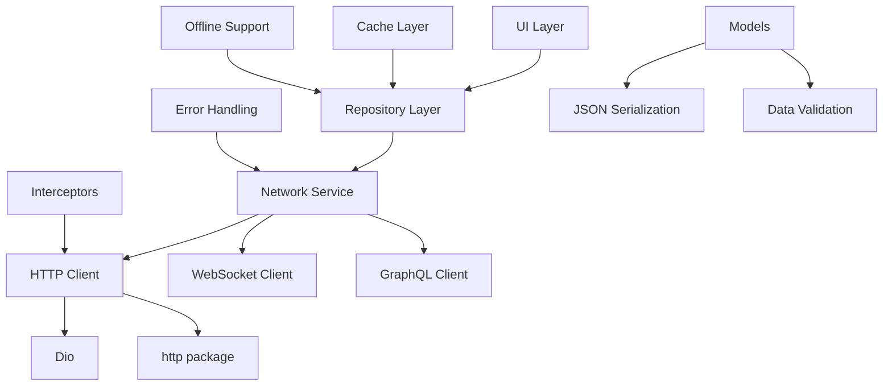
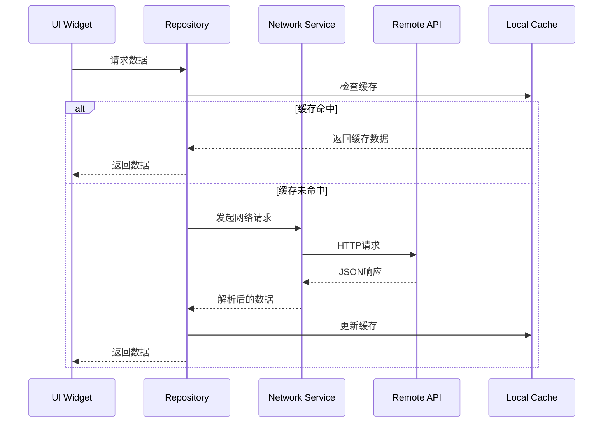
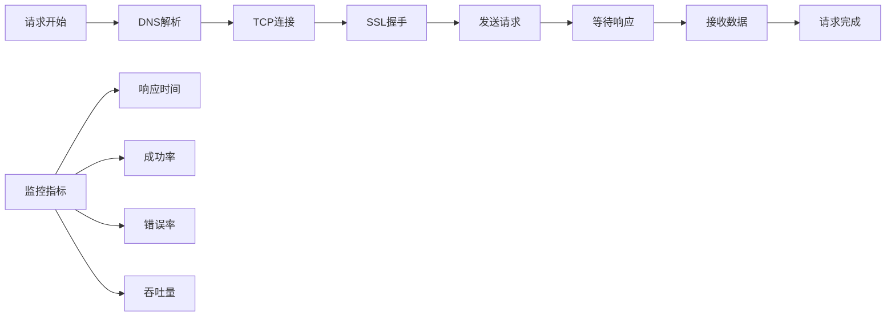
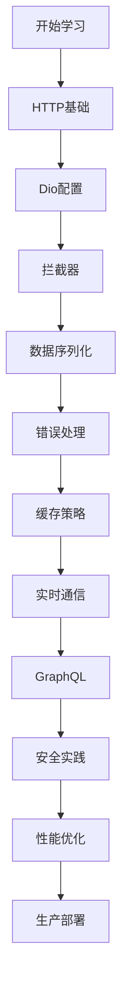

# Flutter 网络请求详解

> 掌握Flutter网络编程，构建高效的数据交互系统

## 🌐 网络架构概览

### 网络层架构设计



### 数据流架构



## 📚 学习目标

- 🎯 **HTTP客户端配置**：掌握Dio和http包的高级配置
- 🔄 **请求拦截器**：实现认证、日志、错误处理拦截器
- 📦 **数据序列化**：JSON序列化与反序列化最佳实践
- 🚀 **性能优化**：缓存策略、连接池、请求合并
- 🔒 **安全实践**：HTTPS、证书固定、API密钥管理
- 📱 **离线支持**：网络状态检测、离线缓存策略
- 🌊 **实时通信**：WebSocket、Server-Sent Events
- 📊 **GraphQL集成**：查询优化、缓存策略

## 📖 章节列表

### [1. HTTP客户端配置](./http-client.md)
- Dio高级配置
- 连接池管理
- 超时设置
- 重试机制

### [2. 请求拦截器](./interceptors.md)
- 认证拦截器
- 日志拦截器
- 错误处理拦截器
- 缓存拦截器

### [3. 数据模型与序列化](./data-models.md)
- JSON序列化
- 代码生成
- 数据验证
- 类型安全

### [4. 错误处理策略](./error-handling.md)
- 网络错误分类
- 重试策略
- 降级方案
- 用户友好提示

### [5. 缓存与离线支持](./caching-offline.md)
- HTTP缓存
- 本地存储
- 离线检测
- 数据同步

### [6. 实时通信](./realtime-communication.md)
- WebSocket实现
- Server-Sent Events
- 心跳机制
- 重连策略

### [7. GraphQL集成](./graphql-integration.md)
- 查询构建
- 缓存策略
- 订阅实现
- 性能优化

### [8. 安全与认证](./security-auth.md)
- HTTPS配置
- 证书固定
- JWT处理
- OAuth2.0集成

## 🛠️ 技术栈

### 核心依赖
```yaml
dependencies:
  dio: ^5.3.2              # HTTP客户端
  retrofit: ^4.0.3         # REST API生成器
  json_annotation: ^4.8.1  # JSON序列化注解
  connectivity_plus: ^5.0.1 # 网络状态检测
  hive: ^2.2.3             # 本地缓存
  web_socket_channel: ^2.4.0 # WebSocket
  graphql_flutter: ^5.1.2  # GraphQL客户端

dev_dependencies:
  retrofit_generator: ^7.0.8
  json_serializable: ^6.7.1
  build_runner: ^2.4.7
```

### 架构模式
- **Repository Pattern**：数据访问抽象
- **Service Locator**：依赖注入
- **Observer Pattern**：状态通知
- **Strategy Pattern**：缓存策略

## 🚀 快速开始

### 1. 基础HTTP客户端设置

```dart
// 创建Dio实例
final dio = Dio(BaseOptions(
  baseUrl: 'https://api.example.com',
  connectTimeout: const Duration(seconds: 5),
  receiveTimeout: const Duration(seconds: 3),
  headers: {
    'Content-Type': 'application/json',
    'Accept': 'application/json',
  },
));

// 添加拦截器
dio.interceptors.addAll([
  LogInterceptor(requestBody: true, responseBody: true),
  AuthInterceptor(),
  ErrorInterceptor(),
]);
```

### 2. 数据模型定义

```dart
@JsonSerializable()
class User {
  final int id;
  final String name;
  final String email;
  
  User({required this.id, required this.name, required this.email});
  
  factory User.fromJson(Map<String, dynamic> json) => _$UserFromJson(json);
  Map<String, dynamic> toJson() => _$UserToJson(this);
}
```

### 3. API服务定义

```dart
@RestApi(baseUrl: 'https://api.example.com')
abstract class ApiService {
  factory ApiService(Dio dio) = _ApiService;
  
  @GET('/users')
  Future<List<User>> getUsers();
  
  @POST('/users')
  Future<User> createUser(@Body() User user);
  
  @PUT('/users/{id}')
  Future<User> updateUser(@Path() int id, @Body() User user);
  
  @DELETE('/users/{id}')
  Future<void> deleteUser(@Path() int id);
}
```

## 📊 性能监控

### 网络请求性能指标



### 性能优化策略

1. **连接复用**：HTTP/2支持，Keep-Alive
2. **请求合并**：批量API，GraphQL
3. **缓存策略**：HTTP缓存，本地缓存
4. **压缩传输**：Gzip，Brotli
5. **预加载**：关键数据预取

## 🔧 调试工具

### 网络调试配置

```dart
class NetworkDebugger {
  static void enableDebugMode() {
    if (kDebugMode) {
      // 启用详细日志
      dio.interceptors.add(LogInterceptor(
        requestBody: true,
        responseBody: true,
        logPrint: (object) => debugPrint(object.toString()),
      ));
      
      // 启用网络代理（用于抓包）
      (dio.httpClientAdapter as DefaultHttpClientAdapter).onHttpClientCreate = (client) {
        client.findProxy = (uri) => 'PROXY localhost:8888';
        client.badCertificateCallback = (cert, host, port) => true;
        return client;
      };
    }
  }
}
```

## 📱 最佳实践

### 1. 错误处理
```dart
try {
  final response = await apiService.getUsers();
  return Right(response);
} on DioException catch (e) {
  return Left(_handleDioError(e));
} catch (e) {
  return Left(UnknownError(e.toString()));
}
```

### 2. 缓存策略
```dart
class CacheStrategy {
  static const Duration shortCache = Duration(minutes: 5);
  static const Duration mediumCache = Duration(hours: 1);
  static const Duration longCache = Duration(days: 1);
  
  static CacheOptions getCacheOptions(CacheDuration duration) {
    switch (duration) {
      case CacheDuration.short:
        return CacheOptions(maxAge: shortCache);
      case CacheDuration.medium:
        return CacheOptions(maxAge: mediumCache);
      case CacheDuration.long:
        return CacheOptions(maxAge: longCache);
    }
  }
}
```

### 3. 网络状态监听
```dart
class NetworkMonitor {
  static Stream<ConnectivityResult> get connectivityStream =>
      Connectivity().onConnectivityChanged;
  
  static Future<bool> get isConnected async {
    final result = await Connectivity().checkConnectivity();
    return result != ConnectivityResult.none;
  }
}
```

## 🎯 学习路径



## 📈 进阶主题

- 🔄 **请求重试与熔断**
- 📊 **API版本管理**
- 🔐 **端到端加密**
- 📱 **多环境配置**
- 🚀 **性能监控与分析**
- 🧪 **网络层测试策略**

---

> 💡 **提示**：建议按照章节顺序学习，每个章节都包含理论讲解、代码示例和实战练习。