# 缓存策略与离线支持

> 构建高效的缓存系统，提供流畅的离线体验

## 🗄️ 缓存架构设计

### 多层缓存架构

```mermaid
graph TD
    A[应用层] --> B[内存缓存]
    A --> C[磁盘缓存]
    A --> D[数据库缓存]
    
    B --> E[LRU Cache]
    B --> F[TTL Cache]
    
    C --> G[HTTP Cache]
    C --> H[Image Cache]
    C --> I[File Cache]
    
    D --> J[SQLite]
    D --> K[Hive]
    D --> L[SharedPreferences]
    
    M[网络层] --> N[Cache-Control]
    M --> O[ETag]
    M --> P[Last-Modified]
```



## 💾 HTTP缓存实现

### 1. 基础缓存管理器

```dart
class CacheManager {
  static const String _cacheDir = 'http_cache';
  static const Duration _defaultMaxAge = Duration(hours: 1);
  
  final Directory _cacheDirectory;
  final Map<String, CacheEntry> _memoryCache = {};
  final int _maxMemoryCacheSize;
  
  CacheManager._(this._cacheDirectory, this._maxMemoryCacheSize);
  
  static CacheManager? _instance;
  
  static Future<CacheManager> getInstance({
    int maxMemoryCacheSize = 100,
  }) async {
    if (_instance == null) {
      final appDir = await getApplicationDocumentsDirectory();
      final cacheDir = Directory('${appDir.path}/$_cacheDir');
      if (!await cacheDir.exists()) {
        await cacheDir.create(recursive: true);
      }
      _instance = CacheManager._(cacheDir, maxMemoryCacheSize);
    }
    return _instance!;
  }
  
  Future<CacheEntry?> get(String key) async {
    // 首先检查内存缓存
    if (_memoryCache.containsKey(key)) {
      final entry = _memoryCache[key]!;
      if (!entry.isExpired) {
        return entry;
      } else {
        _memoryCache.remove(key);
      }
    }
    
    // 检查磁盘缓存
    final file = File('${_cacheDirectory.path}/${_hashKey(key)}.cache');
    if (await file.exists()) {
      try {
        final content = await file.readAsString();
        final data = jsonDecode(content);
        final entry = CacheEntry.fromJson(data);
        
        if (!entry.isExpired) {
          // 加载到内存缓存
          _addToMemoryCache(key, entry);
          return entry;
        } else {
          // 删除过期文件
          await file.delete();
        }
      } catch (e) {
        debugPrint('Cache read error: $e');
        await file.delete();
      }
    }
    
    return null;
  }
  
  Future<void> put(
    String key,
    dynamic data, {
    Duration? maxAge,
    Map<String, String>? headers,
  }) async {
    final entry = CacheEntry(
      data: data,
      headers: headers ?? {},
      createdAt: DateTime.now(),
      maxAge: maxAge ?? _defaultMaxAge,
    );
    
    // 添加到内存缓存
    _addToMemoryCache(key, entry);
    
    // 保存到磁盘
    try {
      final file = File('${_cacheDirectory.path}/${_hashKey(key)}.cache');
      await file.writeAsString(jsonEncode(entry.toJson()));
    } catch (e) {
      debugPrint('Cache write error: $e');
    }
  }
  
  Future<void> remove(String key) async {
    _memoryCache.remove(key);
    
    final file = File('${_cacheDirectory.path}/${_hashKey(key)}.cache');
    if (await file.exists()) {
      await file.delete();
    }
  }
  
  Future<void> clear() async {
    _memoryCache.clear();
    
    if (await _cacheDirectory.exists()) {
      await for (final file in _cacheDirectory.list()) {
        if (file is File && file.path.endsWith('.cache')) {
          await file.delete();
        }
      }
    }
  }
  
  Future<int> getCacheSize() async {
    int size = 0;
    if (await _cacheDirectory.exists()) {
      await for (final file in _cacheDirectory.list()) {
        if (file is File) {
          final stat = await file.stat();
          size += stat.size;
        }
      }
    }
    return size;
  }
  
  void _addToMemoryCache(String key, CacheEntry entry) {
    if (_memoryCache.length >= _maxMemoryCacheSize) {
      // LRU淘汰策略
      final oldestKey = _memoryCache.keys.first;
      _memoryCache.remove(oldestKey);
    }
    _memoryCache[key] = entry;
  }
  
  String _hashKey(String key) {
    return key.hashCode.abs().toString();
  }
}
```

### 2. 缓存条目模型

```dart
class CacheEntry {
  final dynamic data;
  final Map<String, String> headers;
  final DateTime createdAt;
  final Duration maxAge;
  final String? etag;
  final DateTime? lastModified;
  
  CacheEntry({
    required this.data,
    required this.headers,
    required this.createdAt,
    required this.maxAge,
    this.etag,
    this.lastModified,
  });
  
  bool get isExpired {
    return DateTime.now().isAfter(createdAt.add(maxAge));
  }
  
  bool get isStale {
    final staleTime = maxAge * 0.8; // 80%时间后认为过期
    return DateTime.now().isAfter(createdAt.add(staleTime));
  }
  
  factory CacheEntry.fromJson(Map<String, dynamic> json) {
    return CacheEntry(
      data: json['data'],
      headers: Map<String, String>.from(json['headers'] ?? {}),
      createdAt: DateTime.parse(json['createdAt']),
      maxAge: Duration(milliseconds: json['maxAge']),
      etag: json['etag'],
      lastModified: json['lastModified'] != null 
          ? DateTime.parse(json['lastModified']) 
          : null,
    );
  }
  
  Map<String, dynamic> toJson() {
    return {
      'data': data,
      'headers': headers,
      'createdAt': createdAt.toIso8601String(),
      'maxAge': maxAge.inMilliseconds,
      'etag': etag,
      'lastModified': lastModified?.toIso8601String(),
    };
  }
}
```

## 🔄 缓存策略实现

### 1. 缓存策略枚举

```dart
enum CacheStrategy {
  // 仅使用缓存
  cacheOnly,
  // 缓存优先，缓存不存在时请求网络
  cacheFirst,
  // 网络优先，网络失败时使用缓存
  networkFirst,
  // 仅使用网络
  networkOnly,
  // 先返回缓存，同时请求网络更新
  staleWhileRevalidate,
}
```

### 2. 智能缓存拦截器

```dart
class SmartCacheInterceptor extends Interceptor {
  final CacheManager _cacheManager;
  final NetworkConnectivity _connectivity;
  
  SmartCacheInterceptor({
    required CacheManager cacheManager,
    required NetworkConnectivity connectivity,
  }) : _cacheManager = cacheManager,
       _connectivity = connectivity;
  
  @override
  void onRequest(
    RequestOptions options,
    RequestInterceptorHandler handler,
  ) async {
    // 只处理GET请求
    if (options.method.toUpperCase() != 'GET') {
      handler.next(options);
      return;
    }
    
    final strategy = _getCacheStrategy(options);
    final cacheKey = _generateCacheKey(options);
    final isOnline = await _connectivity.isConnected;
    
    switch (strategy) {
      case CacheStrategy.cacheOnly:
        await _handleCacheOnly(cacheKey, handler, options);
        break;
        
      case CacheStrategy.cacheFirst:
        await _handleCacheFirst(cacheKey, handler, options, isOnline);
        break;
        
      case CacheStrategy.networkFirst:
        if (isOnline) {
          handler.next(options);
        } else {
          await _handleCacheOnly(cacheKey, handler, options);
        }
        break;
        
      case CacheStrategy.networkOnly:
        if (isOnline) {
          handler.next(options);
        } else {
          handler.reject(
            DioException(
              requestOptions: options,
              type: DioExceptionType.connectionError,
              message: 'No internet connection',
            ),
          );
        }
        break;
        
      case CacheStrategy.staleWhileRevalidate:
        await _handleStaleWhileRevalidate(cacheKey, handler, options, isOnline);
        break;
    }
  }
  
  @override
  void onResponse(
    Response response,
    ResponseInterceptorHandler handler,
  ) async {
    if (response.requestOptions.method.toUpperCase() == 'GET') {
      await _cacheResponse(response);
    }
    handler.next(response);
  }
  
  Future<void> _handleCacheOnly(
    String cacheKey,
    RequestInterceptorHandler handler,
    RequestOptions options,
  ) async {
    final cached = await _cacheManager.get(cacheKey);
    if (cached != null) {
      final response = Response(
        data: cached.data,
        statusCode: 200,
        headers: Headers.fromMap(cached.headers.map(
          (key, value) => MapEntry(key, [value]),
        )),
        requestOptions: options,
      );
      handler.resolve(response);
    } else {
      handler.reject(
        DioException(
          requestOptions: options,
          type: DioExceptionType.unknown,
          message: 'No cached data available',
        ),
      );
    }
  }
  
  Future<void> _handleCacheFirst(
    String cacheKey,
    RequestInterceptorHandler handler,
    RequestOptions options,
    bool isOnline,
  ) async {
    final cached = await _cacheManager.get(cacheKey);
    if (cached != null && !cached.isExpired) {
      final response = Response(
        data: cached.data,
        statusCode: 200,
        headers: Headers.fromMap(cached.headers.map(
          (key, value) => MapEntry(key, [value]),
        )),
        requestOptions: options,
      );
      handler.resolve(response);
    } else if (isOnline) {
      handler.next(options);
    } else if (cached != null) {
      // 使用过期缓存
      final response = Response(
        data: cached.data,
        statusCode: 200,
        headers: Headers.fromMap(cached.headers.map(
          (key, value) => MapEntry(key, [value]),
        )),
        requestOptions: options,
      );
      handler.resolve(response);
    } else {
      handler.reject(
        DioException(
          requestOptions: options,
          type: DioExceptionType.connectionError,
          message: 'No internet connection and no cached data',
        ),
      );
    }
  }
  
  Future<void> _handleStaleWhileRevalidate(
    String cacheKey,
    RequestInterceptorHandler handler,
    RequestOptions options,
    bool isOnline,
  ) async {
    final cached = await _cacheManager.get(cacheKey);
    
    if (cached != null) {
      // 立即返回缓存数据
      final response = Response(
        data: cached.data,
        statusCode: 200,
        headers: Headers.fromMap(cached.headers.map(
          (key, value) => MapEntry(key, [value]),
        )),
        requestOptions: options,
      );
      handler.resolve(response);
      
      // 如果缓存过期且有网络，后台更新
      if (cached.isStale && isOnline) {
        _backgroundRevalidate(options);
      }
    } else if (isOnline) {
      handler.next(options);
    } else {
      handler.reject(
        DioException(
          requestOptions: options,
          type: DioExceptionType.connectionError,
          message: 'No internet connection and no cached data',
        ),
      );
    }
  }
  
  void _backgroundRevalidate(RequestOptions options) {
    // 后台异步更新缓存
    HttpClient.instance.fetch(options).then((response) {
      _cacheResponse(response);
    }).catchError((error) {
      debugPrint('Background revalidation failed: $error');
    });
  }
  
  Future<void> _cacheResponse(Response response) async {
    final cacheKey = _generateCacheKey(response.requestOptions);
    final maxAge = _getMaxAgeFromHeaders(response.headers);
    
    await _cacheManager.put(
      cacheKey,
      response.data,
      maxAge: maxAge,
      headers: response.headers.map.map(
        (key, value) => MapEntry(key, value.join(', ')),
      ),
    );
  }
  
  CacheStrategy _getCacheStrategy(RequestOptions options) {
    final strategyHeader = options.headers['Cache-Strategy'] as String?;
    if (strategyHeader != null) {
      return CacheStrategy.values.firstWhere(
        (strategy) => strategy.name == strategyHeader,
        orElse: () => CacheStrategy.networkFirst,
      );
    }
    return CacheStrategy.networkFirst;
  }
  
  String _generateCacheKey(RequestOptions options) {
    final uri = options.uri.toString();
    final headers = options.headers.entries
        .where((entry) => entry.key.startsWith('Cache-Key-'))
        .map((entry) => '${entry.key}:${entry.value}')
        .join(',');
    return '$uri|$headers';
  }
  
  Duration _getMaxAgeFromHeaders(Headers headers) {
    final cacheControl = headers.value('cache-control');
    if (cacheControl != null) {
      final maxAgeMatch = RegExp(r'max-age=(\d+)').firstMatch(cacheControl);
      if (maxAgeMatch != null) {
        final seconds = int.parse(maxAgeMatch.group(1)!);
        return Duration(seconds: seconds);
      }
    }
    return const Duration(hours: 1); // 默认1小时
  }
}
```

## 📱 离线支持实现

### 1. 网络连接监听

```dart
class NetworkConnectivity {
  static final NetworkConnectivity _instance = NetworkConnectivity._internal();
  factory NetworkConnectivity() => _instance;
  NetworkConnectivity._internal();
  
  final Connectivity _connectivity = Connectivity();
  final StreamController<bool> _connectionController = 
      StreamController<bool>.broadcast();
  
  Stream<bool> get connectionStream => _connectionController.stream;
  
  bool _isConnected = true;
  bool get isConnected => _isConnected;
  
  void initialize() {
    _connectivity.onConnectivityChanged.listen((result) {
      final wasConnected = _isConnected;
      _isConnected = result != ConnectivityResult.none;
      
      if (wasConnected != _isConnected) {
        _connectionController.add(_isConnected);
        
        if (_isConnected) {
          _onConnectionRestored();
        } else {
          _onConnectionLost();
        }
      }
    });
    
    // 初始检查
    _checkInitialConnection();
  }
  
  Future<void> _checkInitialConnection() async {
    final result = await _connectivity.checkConnectivity();
    _isConnected = result != ConnectivityResult.none;
    _connectionController.add(_isConnected);
  }
  
  void _onConnectionRestored() {
    debugPrint('Network connection restored');
    // 触发离线队列处理
    OfflineQueueManager().processQueue();
  }
  
  void _onConnectionLost() {
    debugPrint('Network connection lost');
  }
  
  void dispose() {
    _connectionController.close();
  }
}
```

### 2. 离线请求队列

```dart
class OfflineQueueManager {
  static final OfflineQueueManager _instance = OfflineQueueManager._internal();
  factory OfflineQueueManager() => _instance;
  OfflineQueueManager._internal();
  
  final List<OfflineRequest> _queue = [];
  final String _queueKey = 'offline_request_queue';
  bool _isProcessing = false;
  
  Future<void> addToQueue(RequestOptions options) async {
    final offlineRequest = OfflineRequest(
      id: _generateId(),
      options: options,
      timestamp: DateTime.now(),
      retryCount: 0,
    );
    
    _queue.add(offlineRequest);
    await _saveQueue();
    
    debugPrint('Added request to offline queue: ${options.uri}');
  }
  
  Future<void> processQueue() async {
    if (_isProcessing || _queue.isEmpty) return;
    
    _isProcessing = true;
    debugPrint('Processing offline queue: ${_queue.length} requests');
    
    final failedRequests = <OfflineRequest>[];
    
    for (final request in List.from(_queue)) {
      try {
        await HttpClient.instance.fetch(request.options);
        _queue.remove(request);
        debugPrint('Offline request processed: ${request.options.uri}');
      } catch (e) {
        request.retryCount++;
        if (request.retryCount >= 3) {
          _queue.remove(request);
          debugPrint('Offline request failed permanently: ${request.options.uri}');
        } else {
          failedRequests.add(request);
        }
      }
    }
    
    await _saveQueue();
    _isProcessing = false;
    
    // 如果还有失败的请求，延迟重试
    if (failedRequests.isNotEmpty) {
      Timer(const Duration(seconds: 30), () => processQueue());
    }
  }
  
  Future<void> loadQueue() async {
    try {
      final prefs = await SharedPreferences.getInstance();
      final queueJson = prefs.getString(_queueKey);
      if (queueJson != null) {
        final List<dynamic> queueData = jsonDecode(queueJson);
        _queue.clear();
        _queue.addAll(
          queueData.map((data) => OfflineRequest.fromJson(data)),
        );
      }
    } catch (e) {
      debugPrint('Failed to load offline queue: $e');
    }
  }
  
  Future<void> _saveQueue() async {
    try {
      final prefs = await SharedPreferences.getInstance();
      final queueJson = jsonEncode(
        _queue.map((request) => request.toJson()).toList(),
      );
      await prefs.setString(_queueKey, queueJson);
    } catch (e) {
      debugPrint('Failed to save offline queue: $e');
    }
  }
  
  String _generateId() {
    return '${DateTime.now().millisecondsSinceEpoch}_${Random().nextInt(9999)}';
  }
  
  void clearQueue() {
    _queue.clear();
    _saveQueue();
  }
  
  int get queueLength => _queue.length;
}
```

### 3. 离线请求模型

```dart
class OfflineRequest {
  final String id;
  final RequestOptions options;
  final DateTime timestamp;
  int retryCount;
  
  OfflineRequest({
    required this.id,
    required this.options,
    required this.timestamp,
    required this.retryCount,
  });
  
  factory OfflineRequest.fromJson(Map<String, dynamic> json) {
    return OfflineRequest(
      id: json['id'],
      options: RequestOptions(
        path: json['path'],
        method: json['method'],
        data: json['data'],
        queryParameters: Map<String, dynamic>.from(json['queryParameters'] ?? {}),
        headers: Map<String, dynamic>.from(json['headers'] ?? {}),
      ),
      timestamp: DateTime.parse(json['timestamp']),
      retryCount: json['retryCount'] ?? 0,
    );
  }
  
  Map<String, dynamic> toJson() {
    return {
      'id': id,
      'path': options.path,
      'method': options.method,
      'data': options.data,
      'queryParameters': options.queryParameters,
      'headers': options.headers,
      'timestamp': timestamp.toIso8601String(),
      'retryCount': retryCount,
    };
  }
}
```

## 🎯 最佳实践

### 缓存配置建议

```dart
class CacheConfig {
  // API响应缓存时间
  static const Duration userDataCache = Duration(minutes: 15);
  static const Duration listDataCache = Duration(minutes: 5);
  static const Duration staticDataCache = Duration(hours: 24);
  
  // 图片缓存配置
  static const Duration imageCache = Duration(days: 7);
  static const int maxImageCacheSize = 100 * 1024 * 1024; // 100MB
  
  // 内存缓存配置
  static const int maxMemoryCacheEntries = 100;
  
  static Duration getCacheDuration(String endpoint) {
    if (endpoint.contains('/user/')) {
      return userDataCache;
    } else if (endpoint.contains('/list/')) {
      return listDataCache;
    } else if (endpoint.contains('/static/')) {
      return staticDataCache;
    }
    return const Duration(minutes: 5);
  }
}
```

### 性能优化技巧

1. **合理设置缓存时间**：根据数据更新频率设置不同的缓存时间
2. **使用压缩**：对大型响应数据进行压缩存储
3. **定期清理**：定期清理过期缓存文件
4. **内存管理**：限制内存缓存大小，避免内存泄漏
5. **网络状态感知**：根据网络状态调整缓存策略

### 调试工具

```dart
class CacheDebugger {
  static void logCacheHit(String key, String source) {
    debugPrint('🎯 Cache HIT [$source]: $key');
  }
  
  static void logCacheMiss(String key) {
    debugPrint('❌ Cache MISS: $key');
  }
  
  static void logCacheSize(int entries, int sizeBytes) {
    final sizeMB = sizeBytes / (1024 * 1024);
    debugPrint('📊 Cache Stats: $entries entries, ${sizeMB.toStringAsFixed(2)}MB');
  }
}
```