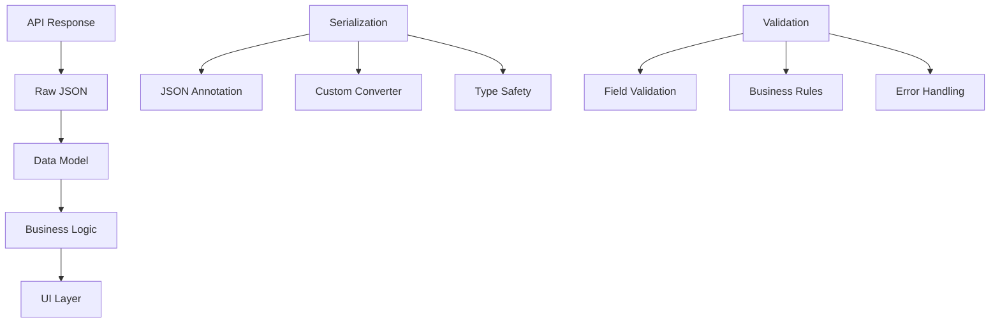
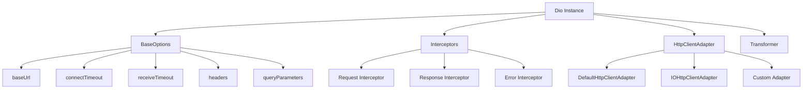
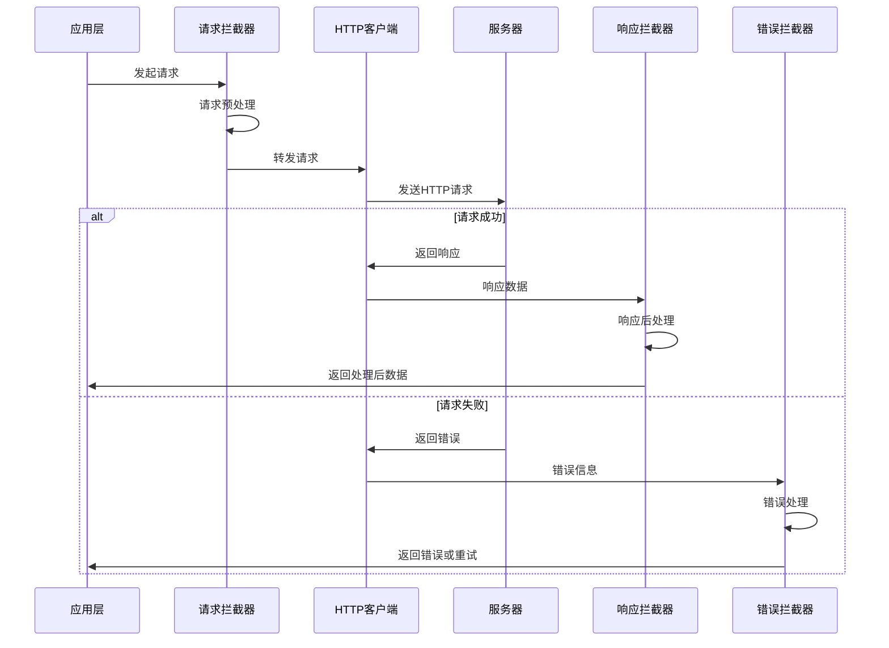
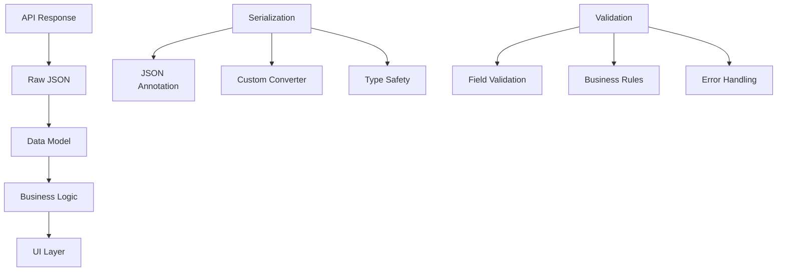

# 数据模型与序列化

> 构建类型安全、高性能的数据模型系统

## 🏗️ 数据模型架构

### 模型设计原则



## 📋 基础数据模型

### 1. 用户模型示例

```dart
import 'package:json_annotation/json_annotation.dart';
import 'package:equatable/equatable.dart';

part 'user_model.g.dart';

@JsonSerializable()
class UserModel extends Equatable {
  final String id;
  final String username;
  final String email;
  @JsonKey(name: 'first_name')
  final String firstName;
  @JsonKey(name: 'last_name')
  final String lastName;
  @JsonKey(name: 'avatar_url')
  final String? avatarUrl;
  @JsonKey(name: 'created_at')
  final DateTime createdAt;
  @JsonKey(name: 'updated_at')
  final DateTime updatedAt;
  @JsonKey(name: 'is_active')
  final bool isActive;
  final UserRole role;
  final UserProfile? profile;

  const UserModel({
    required this.id,
    required this.username,
    required this.email,
    required this.firstName,
    required this.lastName,
    this.avatarUrl,
    required this.createdAt,
    required this.updatedAt,
    required this.isActive,
    required this.role,
    this.profile,
  });

  // 从JSON创建实例
  factory UserModel.fromJson(Map<String, dynamic> json) =>
      _$UserModelFromJson(json);

  // 转换为JSON
  Map<String, dynamic> toJson() => _$UserModelToJson(this);

  // 复制并修改
  UserModel copyWith({
    String? id,
    String? username,
    String? email,
    String? firstName,
    String? lastName,
    String? avatarUrl,
    DateTime? createdAt,
    DateTime? updatedAt,
    bool? isActive,
    UserRole? role,
    UserProfile? profile,
  }) {
    return UserModel(
      id: id ?? this.id,
      username: username ?? this.username,
      email: email ?? this.email,
      firstName: firstName ?? this.firstName,
      lastName: lastName ?? this.lastName,
      avatarUrl: avatarUrl ?? this.avatarUrl,
      createdAt: createdAt ?? this.createdAt,
      updatedAt: updatedAt ?? this.updatedAt,
      isActive: isActive ?? this.isActive,
      role: role ?? this.role,
      profile: profile ?? this.profile,
    );
  }

  // 业务逻辑方法
  String get fullName => '$firstName $lastName';

  String get displayName => username.isNotEmpty ? username : fullName;

  bool get hasAvatar => avatarUrl != null && avatarUrl!.isNotEmpty;

  bool get isAdmin => role == UserRole.admin;

  // Equatable实现
  @override
  List<Object?> get props => [
    id, username, email, firstName, lastName,
    avatarUrl, createdAt, updatedAt, isActive, role, profile,
  ];
}
```

### 2. 枚举类型处理

```dart
@JsonEnum(valueField: 'value')
enum UserRole {
  @JsonValue('admin')
  admin('admin', 'Administrator'),
  @JsonValue('user')
  user('user', 'Regular User'),
  @JsonValue('moderator')
  moderator('moderator', 'Moderator'),
  @JsonValue('guest')
  guest('guest', 'Guest');

  const UserRole(this.value, this.displayName);

  final String value;
  final String displayName;

  static UserRole fromString(String value) {
    return UserRole.values.firstWhere(
      (role) => role.value == value,
      orElse: () => UserRole.guest,
    );
  }
}
```

### 3. 嵌套模型

```dart
@JsonSerializable()
class UserProfile extends Equatable {
  final String? bio;
  final String? website;
  final String? location;
  @JsonKey(name: 'birth_date')
  final DateTime? birthDate;
  final List<String> interests;
  final Map<String, dynamic> settings;

  const UserProfile({
    this.bio,
    this.website,
    this.location,
    this.birthDate,
    this.interests = const [],
    this.settings = const {},
  });

  factory UserProfile.fromJson(Map<String, dynamic> json) =>
      _$UserProfileFromJson(json);

  Map<String, dynamic> toJson() => _$UserProfileToJson(this);

  UserProfile copyWith({
    String? bio,
    String? website,
    String? location,
    DateTime? birthDate,
    List<String>? interests,
    Map<String, dynamic>? settings,
  }) {
    return UserProfile(
      bio: bio ?? this.bio,
      website: website ?? this.website,
      location: location ?? this.location,
      birthDate: birthDate ?? this.birthDate,
      interests: interests ?? this.interests,
      settings: settings ?? this.settings,
    );
  }

  @override
  List<Object?> get props => [
    bio, website, location, birthDate, interests, settings,
  ];
}
```

## 🔄 自定义序列化转换器

### 1. 日期时间转换器

```dart
class DateTimeConverter implements JsonConverter<DateTime, String> {
  const DateTimeConverter();

  @override
  DateTime fromJson(String json) {
    try {
      return DateTime.parse(json).toLocal();
    } catch (e) {
      throw FormatException('Invalid date format: $json');
    }
  }

  @override
  String toJson(DateTime object) {
    return object.toUtc().toIso8601String();
  }
}

// 可空日期时间转换器
class NullableDateTimeConverter implements JsonConverter<DateTime?, String?> {
  const NullableDateTimeConverter();

  @override
  DateTime? fromJson(String? json) {
    if (json == null || json.isEmpty) return null;
    try {
      return DateTime.parse(json).toLocal();
    } catch (e) {
      return null;
    }
  }

  @override
  String? toJson(DateTime? object) {
    return object?.toUtc().toIso8601String();
  }
}
```

### 2. 数字转换器

```dart
class StringToIntConverter implements JsonConverter<int, dynamic> {
  const StringToIntConverter();

  @override
  int fromJson(dynamic json) {
    if (json is int) return json;
    if (json is String) {
      return int.tryParse(json) ?? 0;
    }
    if (json is double) {
      return json.toInt();
    }
    return 0;
  }

  @override
  String toJson(int object) => object.toString();
}

class StringToDoubleConverter implements JsonConverter<double, dynamic> {
  const StringToDoubleConverter();

  @override
  double fromJson(dynamic json) {
    if (json is double) return json;
    if (json is int) return json.toDouble();
    if (json is String) {
      return double.tryParse(json) ?? 0.0;
    }
    return 0.0;
  }

  @override
  String toJson(double object) => object.toString();
}
```

### 3. 复杂类型转换器

```dart
class ColorConverter implements JsonConverter<Color, String> {
  const ColorConverter();

  @override
  Color fromJson(String json) {
    try {
      // 支持多种颜色格式
      if (json.startsWith('#')) {
        return Color(int.parse(json.substring(1), radix: 16) + 0xFF000000);
      } else if (json.startsWith('0x')) {
        return Color(int.parse(json));
      } else {
        // 预定义颜色名称
        return _getColorByName(json);
      }
    } catch (e) {
      return Colors.transparent;
    }
  }

  @override
  String toJson(Color object) {
    return '#${object.value.toRadixString(16).padLeft(8, '0').substring(2)}';
  }

  Color _getColorByName(String name) {
    switch (name.toLowerCase()) {
      case 'red': return Colors.red;
      case 'blue': return Colors.blue;
      case 'green': return Colors.green;
      case 'yellow': return Colors.yellow;
      case 'orange': return Colors.orange;
      case 'purple': return Colors.purple;
      default: return Colors.transparent;
    }
  }
}
```

## 📊 API响应包装器

### 1. 通用响应模型

```dart
@JsonSerializable(genericArgumentFactories: true)
class ApiResponse<T> extends Equatable {
  final bool success;
  final String message;
  final T? data;
  final ApiError? error;
  final ApiMeta? meta;

  const ApiResponse({
    required this.success,
    required this.message,
    this.data,
    this.error,
    this.meta,
  });

  factory ApiResponse.fromJson(
    Map<String, dynamic> json,
    T Function(Object? json) fromJsonT,
  ) => _$ApiResponseFromJson(json, fromJsonT);

  Map<String, dynamic> toJson(Object Function(T value) toJsonT) =>
      _$ApiResponseToJson(this, toJsonT);

  // 成功响应
  factory ApiResponse.success({
    required T data,
    String message = 'Success',
    ApiMeta? meta,
  }) {
    return ApiResponse(
      success: true,
      message: message,
      data: data,
      meta: meta,
    );
  }

  // 错误响应
  factory ApiResponse.error({
    required String message,
    ApiError? error,
  }) {
    return ApiResponse(
      success: false,
      message: message,
      error: error,
    );
  }

  @override
  List<Object?> get props => [success, message, data, error, meta];
}
```

### 2. 分页响应模型

```dart
@JsonSerializable(genericArgumentFactories: true)
class PaginatedResponse<T> extends Equatable {
  final List<T> data;
  final PaginationMeta pagination;

  const PaginatedResponse({
    required this.data,
    required this.pagination,
  });

  factory PaginatedResponse.fromJson(
    Map<String, dynamic> json,
    T Function(Object? json) fromJsonT,
  ) => _$PaginatedResponseFromJson(json, fromJsonT);

  Map<String, dynamic> toJson(Object Function(T value) toJsonT) =>
      _$PaginatedResponseToJson(this, toJsonT);

  @override
  List<Object?> get props => [data, pagination];
}

@JsonSerializable()
class PaginationMeta extends Equatable {
  @JsonKey(name: 'current_page')
  final int currentPage;
  @JsonKey(name: 'per_page')
  final int perPage;
  @JsonKey(name: 'total_items')
  final int totalItems;
  @JsonKey(name: 'total_pages')
  final int totalPages;
  @JsonKey(name: 'has_next')
  final bool hasNext;
  @JsonKey(name: 'has_previous')
  final bool hasPrevious;

  const PaginationMeta({
    required this.currentPage,
    required this.perPage,
    required this.totalItems,
    required this.totalPages,
    required this.hasNext,
    required this.hasPrevious,
  });

  factory PaginationMeta.fromJson(Map<String, dynamic> json) =>
      _$PaginationMetaFromJson(json);

  Map<String, dynamic> toJson() => _$PaginationMetaToJson(this);

  @override
  List<Object?> get props => [
    currentPage, perPage, totalItems, totalPages, hasNext, hasPrevious,
  ];
}
```

## 🔍 数据验证

### 1. 字段验证

```dart
mixin ValidationMixin {
  List<ValidationError> validate();

  bool get isValid => validate().isEmpty;

  String? get firstError {
    final errors = validate();
    return errors.isNotEmpty ? errors.first.message : null;
  }
}

class ValidationError {
  final String field;
  final String message;
  final dynamic value;

  const ValidationError({
    required this.field,
    required this.message,
    this.value,
  });

  @override
  String toString() => '$field: $message';
}

// 验证器
class Validators {
  static ValidationError? required(String field, dynamic value) {
    if (value == null ||
        (value is String && value.trim().isEmpty) ||
        (value is List && value.isEmpty)) {
      return ValidationError(
        field: field,
        message: '$field is required',
        value: value,
      );
    }
    return null;
  }

  static ValidationError? email(String field, String? value) {
    if (value == null || value.isEmpty) return null;

    final emailRegex = RegExp(r'^[\w-\.]+@([\w-]+\.)+[\w-]{2,4}$');
    if (!emailRegex.hasMatch(value)) {
      return ValidationError(
        field: field,
        message: '$field must be a valid email address',
        value: value,
      );
    }
    return null;
  }

  static ValidationError? minLength(String field, String? value, int min) {
    if (value == null || value.length < min) {
      return ValidationError(
        field: field,
        message: '$field must be at least $min characters long',
        value: value,
      );
    }
    return null;
  }

  static ValidationError? range(String field, num? value, num min, num max) {
    if (value == null || value < min || value > max) {
      return ValidationError(
        field: field,
        message: '$field must be between $min and $max',
        value: value,
      );
    }
    return null;
  }
}
```

### 2. 模型验证示例

```dart
@JsonSerializable()
class CreateUserRequest extends Equatable with ValidationMixin {
  final String username;
  final String email;
  final String password;
  @JsonKey(name: 'first_name')
  final String firstName;
  @JsonKey(name: 'last_name')
  final String lastName;

  const CreateUserRequest({
    required this.username,
    required this.email,
    required this.password,
    required this.firstName,
    required this.lastName,
  });

  factory CreateUserRequest.fromJson(Map<String, dynamic> json) =>
      _$CreateUserRequestFromJson(json);

  Map<String, dynamic> toJson() => _$CreateUserRequestToJson(this);

  @override
  List<ValidationError> validate() {
    final errors = <ValidationError>[];

    // 用户名验证
    final usernameError = Validators.required('username', username) ??
        Validators.minLength('username', username, 3);
    if (usernameError != null) errors.add(usernameError);

    // 邮箱验证
    final emailError = Validators.required('email', email) ??
        Validators.email('email', email);
    if (emailError != null) errors.add(emailError);

    // 密码验证
    final passwordError = Validators.required('password', password) ??
        Validators.minLength('password', password, 8);
    if (passwordError != null) errors.add(passwordError);

    // 姓名验证
    final firstNameError = Validators.required('firstName', firstName);
    if (firstNameError != null) errors.add(firstNameError);

    final lastNameError = Validators.required('lastName', lastName);
    if (lastNameError != null) errors.add(lastNameError);

    return errors;
  }

  @override
  List<Object?> get props => [username, email, password, firstName, lastName];
}
```

## 🚀 性能优化

### 1. 序列化优化

```dart
// 使用const构造函数
@JsonSerializable()
class OptimizedModel extends Equatable {
  final String id;
  final String name;

  const OptimizedModel({
    required this.id,
    required this.name,
  });

  factory OptimizedModel.fromJson(Map<String, dynamic> json) =>
      _$OptimizedModelFromJson(json);

  Map<String, dynamic> toJson() => _$OptimizedModelToJson(this);

  @override
  List<Object?> get props => [id, name];
}

// 批量序列化
class ModelSerializer {
  static List<T> fromJsonList<T>(
    List<dynamic> jsonList,
    T Function(Map<String, dynamic>) fromJson,
  ) {
    return jsonList
        .cast<Map<String, dynamic>>()
        .map(fromJson)
        .toList();
  }

  static List<Map<String, dynamic>> toJsonList<T>(
    List<T> models,
    Map<String, dynamic> Function(T) toJson,
  ) {
    return models.map(toJson).toList();
  }
}
```

### 2. 内存优化

```dart
// 使用工厂模式缓存常用实例
class CachedModel {
  static final Map<String, CachedModel> _cache = {};

  final String id;
  final String data;

  CachedModel._internal({
    required this.id,
    required this.data,
  });

  factory CachedModel({
    required String id,
    required String data,
  }) {
    return _cache.putIfAbsent(
      id,
      () => CachedModel._internal(id: id, data: data),
    );
  }

  static void clearCache() {
    _cache.clear();
  }
}
```

## 🎯 最佳实践

### 代码生成配置

```yaml
# build.yaml
targets:
  $default:
    builders:
      json_serializable:
        options:
          # 生成可空安全代码
          nullable: true
          # 生成copyWith方法
          create_to_json: true
          # 字段重命名策略
          field_rename: snake
          # 包含if_null字段
          include_if_null: false
```

### 目录结构建议

Trae

继续创建HTTP客户端配置文档：

```
# HTTP客户端配置详解

> 深入掌握Dio和HTTP包的高级配置与优化技巧

## 🚀 Dio高级配置

### 基础配置架构



### 1. 完整的Dio配置

```dart
class HttpClient {
  static late Dio _dio;
  static const Duration _connectTimeout = 
  Duration(seconds: 10);
  static const Duration _receiveTimeout = 
  Duration(seconds: 15);
  static const Duration _sendTimeout = 
  Duration(seconds: 10);
  
  static Dio get instance => _dio;
  
  static void initialize({
    required String baseUrl,
    Map<String, dynamic>? defaultHeaders,
    bool enableLogging = false,
  }) {
    final baseOptions = BaseOptions(
      baseUrl: baseUrl,
      connectTimeout: _connectTimeout,
      receiveTimeout: _receiveTimeout,
      sendTimeout: _sendTimeout,
      headers: {
        'Content-Type': 'application/
        json',
        'Accept': 'application/json',
        ...?defaultHeaders,
      },
      // 响应类型
      responseType: ResponseType.json,
      // 请求编码
      contentType: Headers.
      jsonContentType,
      // 验证状态码
      validateStatus: (status) {
        return status != null && status 
        >= 200 && status < 300;
      },
      // 跟随重定向
      followRedirects: true,
      maxRedirects: 3,
      // 持久连接
      persistentConnection: true,
      // 接收数据时的缓冲区大小
      receiveDataWhenStatusError: true,
    );
    
    _dio = Dio(baseOptions);
    
    // 配置HTTP客户端适配器
    _configureHttpClientAdapter();
    
    // 添加拦截器
    _setupInterceptors(enableLogging);
  }
  
  static void _configureHttpClientAdapter
  () {
    (_dio.httpClientAdapter as 
    DefaultHttpClientAdapter).
    onHttpClientCreate = (client) {
      // 配置连接池
      client.maxConnectionsPerHost = 5;
      client.connectionTimeout = 
      _connectTimeout;
      client.idleTimeout = const Duration
      (seconds: 30);
      
      // 配置代理（仅在调试模式下）
      if (kDebugMode) {
        // client.findProxy = (uri) => 
        'PROXY localhost:8888';
        // client.badCertificateCallback 
        = (cert, host, port) => true;
      }
      
      return client;
    };
  }
  
  static void _setupInterceptors(bool 
  enableLogging) {
    // 请求/响应拦截器
    _dio.interceptors.addAll([
      // 认证拦截器
      AuthInterceptor(),
      
      // 缓存拦截器
      CacheInterceptor(),
      
      // 重试拦截器
      RetryInterceptor(),
      
      // 日志拦截器（仅在调试模式下）
      if (enableLogging && kDebugMode)
        LogInterceptor(
          requestBody: true,
          responseBody: true,
          requestHeader: true,
          responseHeader: false,
          error: true,
          logPrint: (object) => debugPrint
          ('[HTTP] $object'),
        ),
      
      // 错误处理拦截器
      ErrorInterceptor(),
    ]);
  }
}
```

### 2. 环境配置管理

```dart
enum Environment {
  development,
  staging,
  production,
}

class ApiConfig {
  static Environment _currentEnvironment 
  = Environment.development;
  
  static Environment get 
  currentEnvironment => 
  _currentEnvironment;
  
  static void setEnvironment(Environment 
  environment) {
    _currentEnvironment = environment;
  }
  
  static String get baseUrl {
    switch (_currentEnvironment) {
      case Environment.development:
        return 'https://dev-api.example.
        com';
      case Environment.staging:
        return 'https://staging-api.
        example.com';
      case Environment.production:
        return 'https://api.example.com';
    }
  }
  
  static Duration get connectTimeout {
    switch (_currentEnvironment) {
      case Environment.development:
        return const Duration(seconds: 
        30); // 开发环境较长超时
      case Environment.staging:
        return const Duration(seconds: 
        15);
      case Environment.production:
        return const Duration(seconds: 
        10);
    }
  }
  
  static bool get enableLogging {
    return _currentEnvironment != 
    Environment.production;
  }
  
  static Map<String, String> get 
  defaultHeaders {
    final headers = <String, String>{
      'X-App-Version': '1.0.0',
      'X-Platform': Platform.isIOS ? 
      'iOS' : 'Android',
    };
    
    if (_currentEnvironment == 
    Environment.development) {
      headers['X-Debug-Mode'] = 'true';
    }
    
    return headers;
  }
}
```

## 🔄 连接池管理

### 连接池优化配置

```dart
class ConnectionPoolManager {
  static void configureConnectionPool(Dio 
  dio) {
    (dio.httpClientAdapter as 
    DefaultHttpClientAdapter).
    onHttpClientCreate = (client) {
      // 最大连接数
      client.maxConnectionsPerHost = 6;
      
      // 连接超时
      client.connectionTimeout = const 
      Duration(seconds: 10);
      
      // 空闲超时
      client.idleTimeout = const Duration
      (seconds: 30);
      
      // 启用HTTP/2
      client.autoUncompress = true;
      
      // 配置用户代理
      client.userAgent = 'Flutter App/1.0.
      0';
      
      return client;
    };
  }
  
  // 自定义HTTP客户端适配器
  static HttpClientAdapter 
  createCustomAdapter() {
    return IOHttpClientAdapter(
      createHttpClient: () {
        final client = HttpClient();
        
        // 连接池配置
        client.maxConnectionsPerHost = 8;
        client.connectionTimeout = const 
        Duration(seconds: 10);
        client.idleTimeout = const 
        Duration(seconds: 30);
        
        // SSL配置
        client.badCertificateCallback = 
        (cert, host, port) {
          // 在生产环境中应该进行适当的证书验证
          return kDebugMode;
        };
        
        return client;
      },
    );
  }
}
```

## ⏱️ 超时设置策略

### 智能超时配置

```dart
class TimeoutConfig {
  // 根据网络类型调整超时时间
  static Duration getConnectTimeout
  (ConnectivityResult connectivity) {
    switch (connectivity) {
      case ConnectivityResult.wifi:
        return const Duration(seconds: 
        10);
      case ConnectivityResult.mobile:
        return const Duration(seconds: 
        15);
      case ConnectivityResult.ethernet:
        return const Duration(seconds: 8);
      default:
        return const Duration(seconds: 
        20);
    }
  }
  
  static Duration getReceiveTimeout
  (ConnectivityResult connectivity) {
    switch (connectivity) {
      case ConnectivityResult.wifi:
        return const Duration(seconds: 
        15);
      case ConnectivityResult.mobile:
        return const Duration(seconds: 
        25);
      case ConnectivityResult.ethernet:
        return const Duration(seconds: 
        12);
      default:
        return const Duration(seconds: 
        30);
    }
  }
  
  // 动态调整超时时间
  static void adjustTimeouts(Dio dio) 
  async {
    final connectivity = await 
    Connectivity().checkConnectivity();
    
    dio.options.connectTimeout = 
    getConnectTimeout(connectivity);
    dio.options.receiveTimeout = 
    getReceiveTimeout(connectivity);
  }
}

// 网络状态监听器
class NetworkTimeoutManager {
  static 
  StreamSubscription<ConnectivityResult>? 
  _subscription;
  static final Dio _dio = HttpClient.
  instance;
  
  static void startMonitoring() {
    _subscription = Connectivity().
    onConnectivityChanged.listen((result) 
    {
      _adjustTimeoutsForConnectivity
      (result);
    });
  }
  
  static void stopMonitoring() {
    _subscription?.cancel();
    _subscription = null;
  }
  
  static void 
  _adjustTimeoutsForConnectivity
  (ConnectivityResult result) {
    _dio.options.connectTimeout = 
    TimeoutConfig.getConnectTimeout
    (result);
    _dio.options.receiveTimeout = 
    TimeoutConfig.getReceiveTimeout
    (result);
    
    debugPrint('网络类型变更: $result, 超时
    时间已调整');
  }
}
```

## 🔄 重试机制

### 智能重试策略

```dart
class RetryInterceptor extends 
Interceptor {
  final int maxRetries;
  final Duration baseDelay;
  final List<int> retryStatusCodes;
  final List<DioExceptionType> 
  retryExceptionTypes;
  
  RetryInterceptor({
    this.maxRetries = 3,
    this.baseDelay = const Duration
    (seconds: 1),
    this.retryStatusCodes = const [408, 
    429, 500, 502, 503, 504],
    this.retryExceptionTypes = const [
      DioExceptionType.connectionTimeout,
      DioExceptionType.receiveTimeout,
      DioExceptionType.connectionError,
    ],
  });
  
  @override
  void onError(DioException err, 
  ErrorInterceptorHandler handler) async {
    final shouldRetry = _shouldRetry(err);
    final retryCount = err.requestOptions.
    extra['retryCount'] ?? 0;
    
    if (shouldRetry && retryCount < 
    maxRetries) {
      // 增加重试计数
      err.requestOptions.extra
      ['retryCount'] = retryCount + 1;
      
      // 计算延迟时间（指数退避）
      final delay = _calculateDelay
      (retryCount);
      
      debugPrint('请求重试 ${retryCount + 
      1}/$maxRetries，延迟 ${delay.
      inMilliseconds}ms');
      
      // 等待后重试
      await Future.delayed(delay);
      
      try {
        final response = await err.
        requestOptions.dio.fetch(err.
        requestOptions);
        handler.resolve(response);
      } catch (e) {
        if (e is DioException) {
          onError(e, handler);
        } else {
          handler.reject(err);
        }
      }
    } else {
      handler.reject(err);
    }
  }
  
  bool _shouldRetry(DioException err) {
    // 检查异常类型
    if (retryExceptionTypes.contains(err.
    type)) {
      return true;
    }
    
    // 检查状态码
    if (err.response?.statusCode != null) 
    {
      return retryStatusCodes.contains
      (err.response!.statusCode);
    }
    
    return false;
  }
  
  Duration _calculateDelay(int 
  retryCount) {
    // 指数退避算法：baseDelay * 
    2^retryCount + 随机抖动
    final exponentialDelay = baseDelay * 
    pow(2, retryCount);
    final jitter = Duration(
      milliseconds: Random().nextInt
      (1000), // 0-1秒随机抖动
    );
    
    return exponentialDelay + jitter;
  }
}
```

## 📊 请求优先级管理

### 请求队列与优先级

```dart
enum RequestPriority {
  low(0),
  normal(1),
  high(2),
  critical(3);
  
  const RequestPriority(this.value);
  final int value;
}

class PriorityInterceptor extends 
Interceptor {
  final PriorityQueue<_PriorityRequest> 
  _requestQueue = 
  PriorityQueue<_PriorityRequest>();
  final Map<String, CancelToken> 
  _cancelTokens = {};
  int _activeRequests = 0;
  final int _maxConcurrentRequests = 5;
  
  @override
  void onRequest(RequestOptions options, 
  RequestInterceptorHandler handler) {
    final priority = options.extra
    ['priority'] as RequestPriority? ?? 
    RequestPriority.normal;
    final requestId = options.extra
    ['requestId'] as String? ?? 
    _generateRequestId();
    
    // 创建取消令牌
    final cancelToken = CancelToken();
    _cancelTokens[requestId] = 
    cancelToken;
    options.cancelToken = cancelToken;
    
    if (_activeRequests >= 
    _maxConcurrentRequests) {
      // 添加到队列
      _requestQueue.add(_PriorityRequest(
        options: options,
        handler: handler,
        priority: priority,
        requestId: requestId,
      ));
    } else {
      // 直接执行
      _executeRequest(options, handler, 
      requestId);
    }
  }
  
  @override
  void onResponse(Response response, 
  ResponseInterceptorHandler handler) {
    _activeRequests--;
    _processQueue();
    handler.next(response);
  }
  
  @override
  void onError(DioException err, 
  ErrorInterceptorHandler handler) {
    _activeRequests--;
    _processQueue();
    handler.next(err);
  }
  
  void _executeRequest(RequestOptions 
  options, RequestInterceptorHandler 
  handler, String requestId) {
    _activeRequests++;
    handler.next(options);
  }
  
  void _processQueue() {
    while (_requestQueue.isNotEmpty && 
    _activeRequests < 
    _maxConcurrentRequests) {
      final request = _requestQueue.
      removeFirst();
      _executeRequest(request.options, 
      request.handler, request.requestId);
    }
  }
  
  String _generateRequestId() {
    return DateTime.now().
    millisecondsSinceEpoch.toString();
  }
  
  // 取消低优先级请求
  void cancelLowPriorityRequests() {
    _requestQueue.removeWhere((request) {
      if (request.priority == 
      RequestPriority.low) {
        _cancelTokens[request.requestId]?.
        cancel('取消低优先级请求');
        return true;
      }
      return false;
    });
  }
}

class _PriorityRequest implements 
Comparable<_PriorityRequest> {
  final RequestOptions options;
  final RequestInterceptorHandler handler;
  final RequestPriority priority;
  final String requestId;
  
  _PriorityRequest({
    required this.options,
    required this.handler,
    required this.priority,
    required this.requestId,
  });
  
  @override
  int compareTo(_PriorityRequest other) {
    // 优先级高的排在前面
    return other.priority.value.compareTo
    (priority.value);
  }
}
```

## 🔧 HTTP/2 支持

### HTTP/2 配置

```dart
class Http2Client {
  static Dio createHttp2Client(String 
  baseUrl) {
    final dio = Dio(BaseOptions(
      baseUrl: baseUrl,
      connectTimeout: const Duration
      (seconds: 10),
      receiveTimeout: const Duration
      (seconds: 15),
    ));
    
    // 配置HTTP/2支持
    (dio.httpClientAdapter as 
    DefaultHttpClientAdapter).
    onHttpClientCreate = (client) {
      // 启用HTTP/2
      client.autoUncompress = true;
      
      // 配置ALPN协议
      client.supportedProtocols = ['h2', 
      'http/1.1'];
      
      return client;
    };
    
    return dio;
  }
  
  // 服务器推送处理
  static void handleServerPush(Dio dio) {
    dio.interceptors.add
    (InterceptorsWrapper(
      onResponse: (response, handler) {
        // 处理服务器推送的资源
        final pushedResources = response.
        headers['link'];
        if (pushedResources != null) {
          _processPushedResources
          (pushedResources);
        }
        handler.next(response);
      },
    ));
  }
  
  static void _processPushedResources
  (List<String> links) {
    for (final link in links) {
      if (link.contains('rel=preload')) {
        // 处理预加载资源
        debugPrint('服务器推送资源: $link');
      }
    }
  }
}
```

## 📱 移动端优化

### 网络状态适配

```dart
class MobileNetworkOptimizer {
  static void optimizeForMobile(Dio dio) {
    dio.interceptors.add
    (InterceptorsWrapper(
      onRequest: (options, handler) async 
      {
        // 检查网络状态
        final connectivity = await 
        Connectivity().checkConnectivity
        ();
        
        // 根据网络状态调整请求
        switch (connectivity) {
          case ConnectivityResult.mobile:
            _optimizeForMobileNetwork
            (options);
            break;
          case ConnectivityResult.wifi:
            _optimizeForWifiNetwork
            (options);
            break;
          default:
            break;
        }
        
        handler.next(options);
      },
    ));
  }
  
  static void _optimizeForMobileNetwork
  (RequestOptions options) {
    // 移动网络优化
    options.headers['Accept-Encoding'] = 
    'gzip, deflate, br';
    options.headers['Cache-Control'] = 
    'max-age=300'; // 5分钟缓存
    
    // 减少超时时间
    options.connectTimeout = const 
    Duration(seconds: 8);
    options.receiveTimeout = const 
    Duration(seconds: 12);
  }
  
  static void _optimizeForWifiNetwork
  (RequestOptions options) {
    // WiFi网络优化
    options.headers['Cache-Control'] = 
    'max-age=60'; // 1分钟缓存
    
    // 正常超时时间
    options.connectTimeout = const 
    Duration(seconds: 10);
    options.receiveTimeout = const 
    Duration(seconds: 15);
  }
  
  // 数据压缩
  static void enableCompression(Dio dio) {
    dio.interceptors.add
    (InterceptorsWrapper(
      onRequest: (options, handler) {
        // 启用请求压缩
        options.headers
        ['Accept-Encoding'] = 'gzip, 
        deflate, br';
        
        // 对大型请求体进行压缩
        if (options.data is String && 
        (options.data as String).length > 
        1024) {
          options.headers
          ['Content-Encoding'] = 'gzip';
          options.data = gzip.encode(utf8.
          encode(options.data as String));
        }
        
        handler.next(options);
      },
    ));
  }
}
```

## 🧪 测试支持

### Mock HTTP客户端

```dart
class MockHttpClient {
  static Dio createMockClient(Map<String, 
  dynamic> mockResponses) {
    final dio = Dio();
    
    dio.httpClientAdapter = MockAdapter();
    
    // 配置Mock响应
    for (final entry in mockResponses.
    entries) {
      final path = entry.key;
      final response = entry.value;
      
      (dio.httpClientAdapter as 
      MockAdapter).onGet(
        path,
        (server) => server.reply(200, 
        response),
      );
    }
    
    return dio;
  }
  
  // 网络延迟模拟
  static Dio createSlowNetworkClient
  (Duration delay) {
    final dio = Dio();
    
    dio.interceptors.add
    (InterceptorsWrapper(
      onRequest: (options, handler) async 
      {
        await Future.delayed(delay);
        handler.next(options);
      },
    ));
    
    return dio;
  }
  
  // 网络错误模拟
  static Dio createUnstableNetworkClient
  (double errorRate) {
    final dio = Dio();
    
    dio.interceptors.add
    (InterceptorsWrapper(
      onRequest: (options, handler) {
        if (Random().nextDouble() < 
        errorRate) {
          handler.reject(DioException(
            requestOptions: options,
            type: DioExceptionType.
            connectionError,
            message: '模拟网络错误',
          ));
        } else {
          handler.next(options);
        }
      },
    ));
    
    return dio;
  }
}
```

## 📊 性能监控

### 请求性能追踪

```dart
class PerformanceInterceptor extends 
Interceptor {
  final Map<String, DateTime> 
  _requestStartTimes = {};
  
  @override
  void onRequest(RequestOptions options, 
  RequestInterceptorHandler handler) {
    final requestId = options.hashCode.
    toString();
    _requestStartTimes[requestId] = 
    DateTime.now();
    
    debugPrint('🚀 请求开始: ${options.
    method} ${options.uri}');
    handler.next(options);
  }
  
  @override
  void onResponse(Response response, 
  ResponseInterceptorHandler handler) {
    final requestId = response.
    requestOptions.hashCode.toString();
    final startTime = _requestStartTimes.
    remove(requestId);
    
    if (startTime != null) {
      final duration = DateTime.now().
      difference(startTime);
      final size = _calculateResponseSize
      (response);
      
      debugPrint('✅ 请求完成: ${response.
      requestOptions.method} ${response.
      requestOptions.uri}');
      debugPrint('   耗时: ${duration.
      inMilliseconds}ms');
      debugPrint('   大小: ${_formatBytes
      (size)}');
      debugPrint('   状态: ${response.
      statusCode}');
      
      // 记录性能指标
      _recordPerformanceMetrics(response.
      requestOptions, duration, size);
    }
    
    handler.next(response);
  }
  
  @override
  void onError(DioException err, 
  ErrorInterceptorHandler handler) {
    final requestId = err.requestOptions.
    hashCode.toString();
    final startTime = _requestStartTimes.
    remove(requestId);
    
    if (startTime != null) {
      final duration = DateTime.now().
      difference(startTime);
      
      debugPrint('❌ 请求失败: ${err.
      requestOptions.method} ${err.
      requestOptions.uri}');
      debugPrint('   耗时: ${duration.
      inMilliseconds}ms');
      debugPrint('   错误: ${err.message}
      ');
    }
    
    handler.next(err);
  }
  
  int _calculateResponseSize(Response 
  response) {
    if (response.data is String) {
      return utf8.encode(response.data as 
      String).length;
    } else if (response.data is 
    List<int>) {
      return (response.data as List<int>).
      length;
    }
    return 0;
  }
  
  String _formatBytes(int bytes) {
    if (bytes < 1024) return '${bytes}B';
    if (bytes < 1024 * 1024) return '$
    {(bytes / 1024).toStringAsFixed(1)}
    KB';
    return '${(bytes / (1024 * 1024)).
    toStringAsFixed(1)}MB';
  }
  
  void _recordPerformanceMetrics
  (RequestOptions options, Duration 
  duration, int size) {
    // 这里可以集成到分析服务
    // 例如：Firebase Analytics, 
    Crashlytics等
  }
}
```

## 🔧 最佳实践总结

### 1. 配置检查清单

```dart
class HttpClientValidator {
  static List<String> 
  validateConfiguration(Dio dio) {
    final issues = <String>[];
    
    // 检查超时配置
    if (dio.options.connectTimeout == 
    null || 
        dio.options.connectTimeout!.
        inSeconds > 30) {
      issues.add('连接超时时间过长或未设置');
    }
    
    if (dio.options.receiveTimeout == 
    null || 
        dio.options.receiveTimeout!.
        inSeconds > 60) {
      issues.add('接收超时时间过长或未设置');
    }
    
    // 检查基础URL
    if (dio.options.baseUrl.isEmpty) {
      issues.add('未设置基础URL');
    }
    
    // 检查必要的拦截器
    final hasErrorInterceptor = dio.
    interceptors
        .any((interceptor) => interceptor 
        is ErrorInterceptor);
    if (!hasErrorInterceptor) {
      issues.add('缺少错误处理拦截器');
    }
    
    return issues;
  }
}
```

### 2. 性能优化建议

- ✅ **连接复用**：配置合适的连接池大小
- ✅ **超时设置**：根据网络环境动态调整
- ✅ **请求压缩**：启用Gzip压缩
- ✅ **HTTP/2**：在支持的服务器上启用
- ✅ **缓存策略**：合理设置缓存头
- ✅ **重试机制**：实现指数退避重试
- ✅ **请求优先级**：关键请求优先处理
- ✅ **性能监控**：追踪请求性能指标
```
继续创建拦截器文档：

Carlton Allen

复制

删除

继续

Trae

我需要继续创建网络请求模块的剩余文档，包括请求拦截器、数据模型与序列化、错误处理策略等内容。

02-network/http-client.md 1 - 50

我需要查看http-client.md文件的更多内容，然后继续创建网络请求模块的其他文档。

02-network/http-client.md 51 - 150

我继续创建网络请求模块的剩余文档。接下来我将创建请求拦截器、数据模型与序列化、错误处理策略等文档。

```
# 请求拦截器详解

> 掌握Dio拦截器的高级用法，实现请求预处理、响应后
处理和错误统一处理

## 🔧 拦截器架构

### 拦截器执行流程



## 🔐 认证拦截器

### 1. JWT Token管理

```dart
class AuthInterceptor extends Interceptor 
{
  final TokenManager _tokenManager = 
  GetIt.instance<TokenManager>();
  final AuthService _authService = GetIt.
  instance<AuthService>();
  
  @override
  void onRequest(
    RequestOptions options,
    RequestInterceptorHandler handler,
  ) async {
    // 获取访问令牌
    final accessToken = await 
    _tokenManager.getAccessToken();
    
    if (accessToken != null && 
    !_isAuthEndpoint(options.path)) {
      options.headers['Authorization'] = 
      'Bearer $accessToken';
    }
    
    // 添加请求ID用于追踪
    options.headers['X-Request-ID'] = 
    _generateRequestId();
    
    // 添加设备信息
    options.headers.addAll(await 
    _getDeviceHeaders());
    
    handler.next(options);
  }
  
  @override
  void onError(
    DioException err,
    ErrorInterceptorHandler handler,
  ) async {
    // 处理401未授权错误
    if (err.response?.statusCode == 401) {
      try {
        // 尝试刷新令牌
        final refreshed = await 
        _refreshToken();
        if (refreshed) {
          // 重新发起原始请求
          final clonedRequest = await 
          _cloneRequest(err.
          requestOptions);
          final response = await 
          HttpClient.instance.fetch
          (clonedRequest);
          handler.resolve(response);
          return;
        }
      } catch (e) {
        // 刷新失败，跳转到登录页
        await _handleAuthFailure();
      }
    }
    
    handler.next(err);
  }
  
  bool _isAuthEndpoint(String path) {
    const authEndpoints = ['/auth/login', 
    '/auth/register', '/auth/refresh'];
    return authEndpoints.any((endpoint) 
    => path.contains(endpoint));
  }
  
  String _generateRequestId() {
    return '${DateTime.now().
    millisecondsSinceEpoch}_${Random().
    nextInt(9999)}';
  }
  
  Future<Map<String, String>> 
  _getDeviceHeaders() async {
    final deviceInfo = await 
    DeviceInfoPlugin().deviceInfo;
    return {
      'X-Device-Platform': Platform.
      operatingSystem,
      'X-Device-Version': Platform.
      operatingSystemVersion,
      'X-App-Version': await 
      _getAppVersion(),
    };
  }
  
  Future<bool> _refreshToken() async {
    try {
      final refreshToken = await 
      _tokenManager.getRefreshToken();
      if (refreshToken == null) return 
      false;
      
      final response = await _authService.
      refreshToken(refreshToken);
      await _tokenManager.saveTokens(
        accessToken: response.accessToken,
        refreshToken: response.
        refreshToken,
      );
      
      return true;
    } catch (e) {
      return false;
    }
  }
  
  Future<RequestOptions> _cloneRequest
  (RequestOptions options) async {
    final accessToken = await 
    _tokenManager.getAccessToken();
    return options.copyWith(
      headers: {
        ...options.headers,
        'Authorization': 'Bearer 
        $accessToken',
      },
    );
  }
  
  Future<void> _handleAuthFailure() async 
  {
    await _tokenManager.clearTokens();
    // 通知应用层跳转到登录页
    GetIt.instance<NavigationService>().
    navigateToLogin();
  }
}
```

### 2. Token管理器

```dart
class TokenManager {
  static const String _accessTokenKey = 
  'access_token';
  static const String _refreshTokenKey = 
  'refresh_token';
  static const String _tokenExpiryKey = 
  'token_expiry';
  
  final FlutterSecureStorage 
  _secureStorage = const 
  FlutterSecureStorage(
    aOptions: AndroidOptions(
      encryptedSharedPreferences: true,
    ),
    iOptions: IOSOptions(
      accessibility: IOSAccessibility.
      first_unlock_this_device,
    ),
  );
  
  Future<String?> getAccessToken() async {
    final token = await _secureStorage.
    read(key: _accessTokenKey);
    if (token == null) return null;
    
    // 检查令牌是否过期
    if (await _isTokenExpired()) {
      return null;
    }
    
    return token;
  }
  
  Future<String?> getRefreshToken() async 
  {
    return await _secureStorage.read(key: 
    _refreshTokenKey);
  }
  
  Future<void> saveTokens({
    required String accessToken,
    required String refreshToken,
    Duration? expiresIn,
  }) async {
    await Future.wait([
      _secureStorage.write(key: 
      _accessTokenKey, value: 
      accessToken),
      _secureStorage.write(key: 
      _refreshTokenKey, value: 
      refreshToken),
      if (expiresIn != null)
        _secureStorage.write(
          key: _tokenExpiryKey,
          value: DateTime.now().add
          (expiresIn).
          millisecondsSinceEpoch.toString
          (),
        ),
    ]);
  }
  
  Future<void> clearTokens() async {
    await Future.wait([
      _secureStorage.delete(key: 
      _accessTokenKey),
      _secureStorage.delete(key: 
      _refreshTokenKey),
      _secureStorage.delete(key: 
      _tokenExpiryKey),
    ]);
  }
  
  Future<bool> _isTokenExpired() async {
    final expiryString = await 
    _secureStorage.read(key: 
    _tokenExpiryKey);
    if (expiryString == null) return 
    false;
    
    final expiry = DateTime.
    fromMillisecondsSinceEpoch(int.parse
    (expiryString));
    return DateTime.now().isAfter(expiry.
    subtract(const Duration(minutes: 5)));
  }
}
```

## 🔄 重试拦截器

### 智能重试策略

```dart
class RetryInterceptor extends 
Interceptor {
  final int maxRetries;
  final Duration baseDelay;
  final List<int> retryStatusCodes;
  final List<DioExceptionType> 
  retryExceptionTypes;
  
  RetryInterceptor({
    this.maxRetries = 3,
    this.baseDelay = const Duration
    (seconds: 1),
    this.retryStatusCodes = const [408, 
    429, 500, 502, 503, 504],
    this.retryExceptionTypes = const [
      DioExceptionType.connectionTimeout,
      DioExceptionType.sendTimeout,
      DioExceptionType.receiveTimeout,
      DioExceptionType.connectionError,
    ],
  });
  
  @override
  void onError(
    DioException err,
    ErrorInterceptorHandler handler,
  ) async {
    final shouldRetry = _shouldRetry(err);
    final retryCount = err.requestOptions.
    extra['retryCount'] as int? ?? 0;
    
    if (shouldRetry && retryCount < 
    maxRetries) {
      // 计算延迟时间（指数退避）
      final delay = _calculateDelay
      (retryCount);
      await Future.delayed(delay);
      
      // 更新重试次数
      err.requestOptions.extra
      ['retryCount'] = retryCount + 1;
      
      try {
        // 重新发起请求
        final response = await HttpClient.
        instance.fetch(err.
        requestOptions);
        handler.resolve(response);
        return;
      } catch (e) {
        // 重试失败，继续处理错误
      }
    }
    
    handler.next(err);
  }
  
  bool _shouldRetry(DioException err) {
    // 检查HTTP状态码
    if (err.response?.statusCode != null) 
    {
      return retryStatusCodes.contains
      (err.response!.statusCode);
    }
    
    // 检查异常类型
    return retryExceptionTypes.contains
    (err.type);
  }
  
  Duration _calculateDelay(int 
  retryCount) {
    // 指数退避算法：baseDelay * 
    2^retryCount + 随机抖动
    final exponentialDelay = baseDelay * 
    math.pow(2, retryCount);
    final jitter = Duration(
      milliseconds: Random().nextInt
      (1000),
    );
    return exponentialDelay + jitter;
  }
}
```

## 📦 缓存拦截器

### HTTP缓存策略

```dart
class CacheInterceptor extends 
Interceptor {
  final CacheManager _cacheManager;
  final Duration defaultCacheDuration;
  
  CacheInterceptor({
    required CacheManager cacheManager,
    this.defaultCacheDuration = const 
    Duration(minutes: 5),
  }) : _cacheManager = cacheManager;
  
  @override
  void onRequest(
    RequestOptions options,
    RequestInterceptorHandler handler,
  ) async {
    // 只缓存GET请求
    if (options.method.toUpperCase() != 
    'GET') {
      handler.next(options);
      return;
    }
    
    final cacheKey = _generateCacheKey
    (options);
    final cachePolicy = _getCachePolicy
    (options);
    
    switch (cachePolicy) {
      case CachePolicy.cacheFirst:
        final cachedResponse = await 
        _getCachedResponse(cacheKey);
        if (cachedResponse != null) {
          handler.resolve(cachedResponse);
          return;
        }
        break;
        
      case CachePolicy.networkFirst:
        // 继续网络请求，在响应中处理缓存
        break;
        
      case CachePolicy.noCache:
        await _cacheManager.removeFile
        (cacheKey);
        break;
    }
    
    handler.next(options);
  }
  
  @override
  void onResponse(
    Response response,
    ResponseInterceptorHandler handler,
  ) async {
    final cachePolicy = _getCachePolicy
    (response.requestOptions);
    
    if (cachePolicy != CachePolicy.
    noCache && 
        response.requestOptions.method.
        toUpperCase() == 'GET') {
      await _cacheResponse(response);
    }
    
    handler.next(response);
  }
  
  String _generateCacheKey(RequestOptions 
  options) {
    final uri = options.uri.toString();
    final headers = options.headers.
    entries
        .where((entry) => entry.key.
        startsWith('X-Cache-'))
        .map((entry) => '${entry.key}:$
        {entry.value}')
        .join(',');
    
    return '${uri}_$headers'.hashCode.
    toString();
  }
  
  CachePolicy _getCachePolicy
  (RequestOptions options) {
    final policyHeader = options.headers
    ['X-Cache-Policy'] as String?;
    return CachePolicy.values.firstWhere(
      (policy) => policy.name == 
      policyHeader,
      orElse: () => CachePolicy.
      networkFirst,
    );
  }
  
  Future<Response?> _getCachedResponse
  (String cacheKey) async {
    try {
      final file = await _cacheManager.
      getFileFromCache(cacheKey);
      if (file?.file != null) {
        final content = await file!.file.
        readAsString();
        final data = jsonDecode(content);
        
        return Response(
          data: data['data'],
          statusCode: data['statusCode'],
          headers: Headers.fromMap
          (Map<String, List<String>>.from
          (data['headers'])),
          requestOptions: RequestOptions
          (path: ''),
        );
      }
    } catch (e) {
      debugPrint('Cache read error: $e');
    }
    return null;
  }
  
  Future<void> _cacheResponse(Response 
  response) async {
    try {
      final cacheKey = _generateCacheKey
      (response.requestOptions);
      final cacheData = {
        'data': response.data,
        'statusCode': response.statusCode,
        'headers': response.headers.map,
        'timestamp': DateTime.now().
        millisecondsSinceEpoch,
      };
      
      final content = jsonEncode
      (cacheData);
      await _cacheManager.putFile(
        cacheKey,
        Uint8List.fromList(utf8.encode
        (content)),
        maxAge: defaultCacheDuration,
      );
    } catch (e) {
      debugPrint('Cache write error: $e');
    }
  }
}

enum CachePolicy {
  cacheFirst,
  networkFirst,
  noCache,
}
```

## 📊 性能监控拦截器

### 请求性能追踪

```dart
class PerformanceInterceptor extends 
Interceptor {
  final PerformanceTracker _tracker = 
  GetIt.instance<PerformanceTracker>();
  
  @override
  void onRequest(
    RequestOptions options,
    RequestInterceptorHandler handler,
  ) {
    options.extra['startTime'] = DateTime.
    now();
    options.extra['requestId'] = 
    _generateRequestId();
    
    _tracker.startRequest(
      requestId: options.extra
      ['requestId'],
      url: options.uri.toString(),
      method: options.method,
    );
    
    handler.next(options);
  }
  
  @override
  void onResponse(
    Response response,
    ResponseInterceptorHandler handler,
  ) {
    final startTime = response.
    requestOptions.extra['startTime'] as 
    DateTime?;
    final requestId = response.
    requestOptions.extra['requestId'] as 
    String?;
    
    if (startTime != null && requestId != 
    null) {
      final duration = DateTime.now().
      difference(startTime);
      
      _tracker.completeRequest(
        requestId: requestId,
        statusCode: response.
        statusCode ?? 0,
        duration: duration,
        responseSize: 
        _calculateResponseSize(response),
      );
    }
    
    handler.next(response);
  }
  
  @override
  void onError(
    DioException err,
    ErrorInterceptorHandler handler,
  ) {
    final startTime = err.requestOptions.
    extra['startTime'] as DateTime?;
    final requestId = err.requestOptions.
    extra['requestId'] as String?;
    
    if (startTime != null && requestId != 
    null) {
      final duration = DateTime.now().
      difference(startTime);
      
      _tracker.failRequest(
        requestId: requestId,
        error: err.toString(),
        duration: duration,
      );
    }
    
    handler.next(err);
  }
  
  String _generateRequestId() {
    return 'req_${DateTime.now().
    millisecondsSinceEpoch}_${Random().
    nextInt(9999)}';
  }
  
  int _calculateResponseSize(Response 
  response) {
    if (response.data is String) {
      return utf8.encode(response.data).
      length;
    } else if (response.data is Map || 
    response.data is List) {
      return utf8.encode(jsonEncode
      (response.data)).length;
    }
    return 0;
  }
}
```

## 🎯 最佳实践

### 拦截器配置建议

```dart
class InterceptorConfig {
  static List<Interceptor> 
  getProductionInterceptors() {
    return [
      // 1. 认证拦截器（最高优先级）
      AuthInterceptor(),
      
      // 2. 缓存拦截器
      CacheInterceptor(
        cacheManager: DefaultCacheManager
        (),
        defaultCacheDuration: const 
        Duration(minutes: 5),
      ),
      
      // 3. 重试拦截器
      RetryInterceptor(
        maxRetries: 3,
        baseDelay: const Duration
        (seconds: 1),
      ),
      
      // 4. 性能监控拦截器
      PerformanceInterceptor(),
      
      // 5. 错误处理拦截器（最低优先级）
      ErrorInterceptor(),
    ];
  }
  
  static List<Interceptor> 
  getDevelopmentInterceptors() {
    return [
      ...getProductionInterceptors(),
      
      // 开发环境专用拦截器
      LogInterceptor(
        requestBody: true,
        responseBody: true,
        requestHeader: true,
        responseHeader: false,
        error: true,
        logPrint: (object) => debugPrint('
        [HTTP] $object'),
      ),
      
      // Mock拦截器（用于测试）
      if (kDebugMode) MockInterceptor(),
    ];
  }
}
```

### 性能优化要点

1. **拦截器顺序**：按重要性和依赖关系排序
2. **异步操作**：避免在拦截器中进行耗时操作
3. **错误处理**：确保拦截器不会抛出未捕获的异常
4. **内存管理**：及时清理缓存和临时数据
5. **条件执行**：根据请求类型和环境条件执行拦截
器逻辑

### 调试技巧

```dart
class DebugInterceptor extends 
Interceptor {
  @override
  void onRequest(RequestOptions options, 
  RequestInterceptorHandler handler) {
    debugPrint('🚀 Request: ${options.
    method} ${options.uri}');
    debugPrint('📤 Headers: ${options.
    headers}');
    if (options.data != null) {
      debugPrint('📦 Body: ${options.data}
      ');
    }
    handler.next(options);
  }
  
  @override
  void onResponse(Response response, 
  ResponseInterceptorHandler handler) {
    debugPrint('✅ Response: ${response.
    statusCode} ${response.requestOptions.
    uri}');
    debugPrint('📥 Data: ${response.data}
    ');
    handler.next(response);
  }
  
  @override
  void onError(DioException err, 
  ErrorInterceptorHandler handler) {
    debugPrint('❌ Error: ${err.message}');
    debugPrint('🔍 Request: ${err.
    requestOptions.uri}');
    if (err.response != null) {
      debugPrint('📄 Response: ${err.
      response?.data}');
    }
    handler.next(err);
  }
}
```
```
现在我将创建数据模型与序列化的文档：

```
# 数据模型与序列化

> 构建类型安全、高性能的数据模型系统

## 🏗️ 数据模型架构

### 模型设计原则



## 📋 基础数据模型

### 1. 用户模型示例

```dart
import 'package:json_annotation/
json_annotation.dart';
import 'package:equatable/equatable.dart';

part 'user_model.g.dart';

@JsonSerializable()
class UserModel extends Equatable {
  final String id;
  final String username;
  final String email;
  @JsonKey(name: 'first_name')
  final String firstName;
  @JsonKey(name: 'last_name')
  final String lastName;
  @JsonKey(name: 'avatar_url')
  final String? avatarUrl;
  @JsonKey(name: 'created_at')
  final DateTime createdAt;
  @JsonKey(name: 'updated_at')
  final DateTime updatedAt;
  @JsonKey(name: 'is_active')
  final bool isActive;
  final UserRole role;
  final UserProfile? profile;
  
  const UserModel({
    required this.id,
    required this.username,
    required this.email,
    required this.firstName,
    required this.lastName,
    this.avatarUrl,
    required this.createdAt,
    required this.updatedAt,
    required this.isActive,
    required this.role,
    this.profile,
  });
  
  // 从JSON创建实例
  factory UserModel.fromJson(Map<String, 
  dynamic> json) => 
      _$UserModelFromJson(json);
  
  // 转换为JSON
  Map<String, dynamic> toJson() => 
  _$UserModelToJson(this);
  
  // 复制并修改
  UserModel copyWith({
    String? id,
    String? username,
    String? email,
    String? firstName,
    String? lastName,
    String? avatarUrl,
    DateTime? createdAt,
    DateTime? updatedAt,
    bool? isActive,
    UserRole? role,
    UserProfile? profile,
  }) {
    return UserModel(
      id: id ?? this.id,
      username: username ?? this.username,
      email: email ?? this.email,
      firstName: firstName ?? this.
      firstName,
      lastName: lastName ?? this.lastName,
      avatarUrl: avatarUrl ?? this.
      avatarUrl,
      createdAt: createdAt ?? this.
      createdAt,
      updatedAt: updatedAt ?? this.
      updatedAt,
      isActive: isActive ?? this.isActive,
      role: role ?? this.role,
      profile: profile ?? this.profile,
    );
  }
  
  // 业务逻辑方法
  String get fullName => '$firstName 
  $lastName';
  
  String get displayName => username.
  isNotEmpty ? username : fullName;
  
  bool get hasAvatar => avatarUrl != 
  null && avatarUrl!.isNotEmpty;
  
  bool get isAdmin => role == UserRole.
  admin;
  
  // Equatable实现
  @override
  List<Object?> get props => [
    id, username, email, firstName, 
    lastName,
    avatarUrl, createdAt, updatedAt, 
    isActive, role, profile,
  ];
}
```

### 2. 枚举类型处理

```dart
@JsonEnum(valueField: 'value')
enum UserRole {
  @JsonValue('admin')
  admin('admin', 'Administrator'),
  @JsonValue('user')
  user('user', 'Regular User'),
  @JsonValue('moderator')
  moderator('moderator', 'Moderator'),
  @JsonValue('guest')
  guest('guest', 'Guest');
  
  const UserRole(this.value, this.
  displayName);
  
  final String value;
  final String displayName;
  
  static UserRole fromString(String 
  value) {
    return UserRole.values.firstWhere(
      (role) => role.value == value,
      orElse: () => UserRole.guest,
    );
  }
}
```

### 3. 嵌套模型

```dart
@JsonSerializable()
class UserProfile extends Equatable {
  final String? bio;
  final String? website;
  final String? location;
  @JsonKey(name: 'birth_date')
  final DateTime? birthDate;
  final List<String> interests;
  final Map<String, dynamic> settings;
  
  const UserProfile({
    this.bio,
    this.website,
    this.location,
    this.birthDate,
    this.interests = const [],
    this.settings = const {},
  });
  
  factory UserProfile.fromJson
  (Map<String, dynamic> json) => 
      _$UserProfileFromJson(json);
  
  Map<String, dynamic> toJson() => 
  _$UserProfileToJson(this);
  
  UserProfile copyWith({
    String? bio,
    String? website,
    String? location,
    DateTime? birthDate,
    List<String>? interests,
    Map<String, dynamic>? settings,
  }) {
    return UserProfile(
      bio: bio ?? this.bio,
      website: website ?? this.website,
      location: location ?? this.location,
      birthDate: birthDate ?? this.
      birthDate,
      interests: interests ?? this.
      interests,
      settings: settings ?? this.settings,
    );
  }
  
  @override
  List<Object?> get props => [
    bio, website, location, birthDate, 
    interests, settings,
  ];
}
```

## 🔄 自定义序列化转换器

### 1. 日期时间转换器

```dart
class DateTimeConverter implements 
JsonConverter<DateTime, String> {
  const DateTimeConverter();
  
  @override
  DateTime fromJson(String json) {
    try {
      return DateTime.parse(json).toLocal
      ();
    } catch (e) {
      throw FormatException('Invalid date 
      format: $json');
    }
  }
  
  @override
  String toJson(DateTime object) {
    return object.toUtc().toIso8601String
    ();
  }
}

// 可空日期时间转换器
class NullableDateTimeConverter 
implements JsonConverter<DateTime?, 
String?> {
  const NullableDateTimeConverter();
  
  @override
  DateTime? fromJson(String? json) {
    if (json == null || json.isEmpty) 
    return null;
    try {
      return DateTime.parse(json).toLocal
      ();
    } catch (e) {
      return null;
    }
  }
  
  @override
  String? toJson(DateTime? object) {
    return object?.toUtc().toIso8601String
    ();
  }
}
```

### 2. 数字转换器

```dart
class StringToIntConverter implements 
JsonConverter<int, dynamic> {
  const StringToIntConverter();
  
  @override
  int fromJson(dynamic json) {
    if (json is int) return json;
    if (json is String) {
      return int.tryParse(json) ?? 0;
    }
    if (json is double) {
      return json.toInt();
    }
    return 0;
  }
  
  @override
  String toJson(int object) => object.
  toString();
}

class StringToDoubleConverter implements 
JsonConverter<double, dynamic> {
  const StringToDoubleConverter();
  
  @override
  double fromJson(dynamic json) {
    if (json is double) return json;
    if (json is int) return json.toDouble
    ();
    if (json is String) {
      return double.tryParse(json) ?? 0.0;
    }
    return 0.0;
  }
  
  @override
  String toJson(double object) => object.
  toString();
}
```

### 3. 复杂类型转换器

```dart
class ColorConverter implements 
JsonConverter<Color, String> {
  const ColorConverter();
  
  @override
  Color fromJson(String json) {
    try {
      // 支持多种颜色格式
      if (json.startsWith('#')) {
        return Color(int.parse(json.
        substring(1), radix: 16) + 
        0xFF000000);
      } else if (json.startsWith('0x')) {
        return Color(int.parse(json));
      } else {
        // 预定义颜色名称
        return _getColorByName(json);
      }
    } catch (e) {
      return Colors.transparent;
    }
  }
  
  @override
  String toJson(Color object) {
    return '#${object.value.toRadixString
    (16).padLeft(8, '0').substring(2)}';
  }
  
  Color _getColorByName(String name) {
    switch (name.toLowerCase()) {
      case 'red': return Colors.red;
      case 'blue': return Colors.blue;
      case 'green': return Colors.green;
      case 'yellow': return Colors.yellow;
      case 'orange': return Colors.orange;
      case 'purple': return Colors.purple;
      default: return Colors.transparent;
    }
  }
}
```

## 📊 API响应包装器

### 1. 通用响应模型

```dart
@JsonSerializable
(genericArgumentFactories: true)
class ApiResponse<T> extends Equatable {
  final bool success;
  final String message;
  final T? data;
  final ApiError? error;
  final ApiMeta? meta;
  
  const ApiResponse({
    required this.success,
    required this.message,
    this.data,
    this.error,
    this.meta,
  });
  
  factory ApiResponse.fromJson(
    Map<String, dynamic> json,
    T Function(Object? json) fromJsonT,
  ) => _$ApiResponseFromJson(json, 
  fromJsonT);
  
  Map<String, dynamic> toJson(Object 
  Function(T value) toJsonT) => 
      _$ApiResponseToJson(this, toJsonT);
  
  // 成功响应
  factory ApiResponse.success({
    required T data,
    String message = 'Success',
    ApiMeta? meta,
  }) {
    return ApiResponse(
      success: true,
      message: message,
      data: data,
      meta: meta,
    );
  }
  
  // 错误响应
  factory ApiResponse.error({
    required String message,
    ApiError? error,
  }) {
    return ApiResponse(
      success: false,
      message: message,
      error: error,
    );
  }
  
  @override
  List<Object?> get props => [success, 
  message, data, error, meta];
}
```

### 2. 分页响应模型

```dart
@JsonSerializable
(genericArgumentFactories: true)
class PaginatedResponse<T> extends 
Equatable {
  final List<T> data;
  final PaginationMeta pagination;
  
  const PaginatedResponse({
    required this.data,
    required this.pagination,
  });
  
  factory PaginatedResponse.fromJson(
    Map<String, dynamic> json,
    T Function(Object? json) fromJsonT,
  ) => _$PaginatedResponseFromJson(json, 
  fromJsonT);
  
  Map<String, dynamic> toJson(Object 
  Function(T value) toJsonT) => 
      _$PaginatedResponseToJson(this, 
      toJsonT);
  
  @override
  List<Object?> get props => [data, 
  pagination];
}

@JsonSerializable()
class PaginationMeta extends Equatable {
  @JsonKey(name: 'current_page')
  final int currentPage;
  @JsonKey(name: 'per_page')
  final int perPage;
  @JsonKey(name: 'total_items')
  final int totalItems;
  @JsonKey(name: 'total_pages')
  final int totalPages;
  @JsonKey(name: 'has_next')
  final bool hasNext;
  @JsonKey(name: 'has_previous')
  final bool hasPrevious;
  
  const PaginationMeta({
    required this.currentPage,
    required this.perPage,
    required this.totalItems,
    required this.totalPages,
    required this.hasNext,
    required this.hasPrevious,
  });
  
  factory PaginationMeta.fromJson
  (Map<String, dynamic> json) => 
      _$PaginationMetaFromJson(json);
  
  Map<String, dynamic> toJson() => 
  _$PaginationMetaToJson(this);
  
  @override
  List<Object?> get props => [
    currentPage, perPage, totalItems, 
    totalPages, hasNext, hasPrevious,
  ];
}
```

## 🔍 数据验证

### 1. 字段验证

```dart
mixin ValidationMixin {
  List<ValidationError> validate();
  
  bool get isValid => validate().isEmpty;
  
  String? get firstError {
    final errors = validate();
    return errors.isNotEmpty ? errors.
    first.message : null;
  }
}

class ValidationError {
  final String field;
  final String message;
  final dynamic value;
  
  const ValidationError({
    required this.field,
    required this.message,
    this.value,
  });
  
  @override
  String toString() => '$field: $message';
}

// 验证器
class Validators {
  static ValidationError? required(String 
  field, dynamic value) {
    if (value == null || 
        (value is String && value.trim().
        isEmpty) ||
        (value is List && value.isEmpty)) 
        {
      return ValidationError(
        field: field,
        message: '$field is required',
        value: value,
      );
    }
    return null;
  }
  
  static ValidationError? email(String 
  field, String? value) {
    if (value == null || value.isEmpty) 
    return null;
    
    final emailRegex = RegExp(r'^[\w-\.]+@
    ([\w-]+\.)+[\w-]{2,4}$');
    if (!emailRegex.hasMatch(value)) {
      return ValidationError(
        field: field,
        message: '$field must be a valid 
        email address',
        value: value,
      );
    }
    return null;
  }
  
  static ValidationError? minLength
  (String field, String? value, int min) {
    if (value == null || value.length < 
    min) {
      return ValidationError(
        field: field,
        message: '$field must be at least 
        $min characters long',
        value: value,
      );
    }
    return null;
  }
  
  static ValidationError? range(String 
  field, num? value, num min, num max) {
    if (value == null || value < min || 
    value > max) {
      return ValidationError(
        field: field,
        message: '$field must be between 
        $min and $max',
        value: value,
      );
    }
    return null;
  }
}
```

### 2. 模型验证示例

```dart
@JsonSerializable()
class CreateUserRequest extends Equatable 
with ValidationMixin {
  final String username;
  final String email;
  final String password;
  @JsonKey(name: 'first_name')
  final String firstName;
  @JsonKey(name: 'last_name')
  final String lastName;
  
  const CreateUserRequest({
    required this.username,
    required this.email,
    required this.password,
    required this.firstName,
    required this.lastName,
  });
  
  factory CreateUserRequest.fromJson
  (Map<String, dynamic> json) => 
      _$CreateUserRequestFromJson(json);
  
  Map<String, dynamic> toJson() => 
  _$CreateUserRequestToJson(this);
  
  @override
  List<ValidationError> validate() {
    final errors = <ValidationError>[];
    
    // 用户名验证
    final usernameError = Validators.
    required('username', username) ??
        Validators.minLength('username', 
        username, 3);
    if (usernameError != null) errors.add
    (usernameError);
    
    // 邮箱验证
    final emailError = Validators.required
    ('email', email) ??
        Validators.email('email', email);
    if (emailError != null) errors.add
    (emailError);
    
    // 密码验证
    final passwordError = Validators.
    required('password', password) ??
        Validators.minLength('password', 
        password, 8);
    if (passwordError != null) errors.add
    (passwordError);
    
    // 姓名验证
    final firstNameError = Validators.
    required('firstName', firstName);
    if (firstNameError != null) errors.add
    (firstNameError);
    
    final lastNameError = Validators.
    required('lastName', lastName);
    if (lastNameError != null) errors.add
    (lastNameError);
    
    return errors;
  }
  
  @override
  List<Object?> get props => [username, 
  email, password, firstName, lastName];
}
```

## 🚀 性能优化

### 1. 序列化优化

```dart
// 使用const构造函数
@JsonSerializable()
class OptimizedModel extends Equatable {
  final String id;
  final String name;
  
  const OptimizedModel({
    required this.id,
    required this.name,
  });
  
  factory OptimizedModel.fromJson
  (Map<String, dynamic> json) => 
      _$OptimizedModelFromJson(json);
  
  Map<String, dynamic> toJson() => 
  _$OptimizedModelToJson(this);
  
  @override
  List<Object?> get props => [id, name];
}

// 批量序列化
class ModelSerializer {
  static List<T> fromJsonList<T>(
    List<dynamic> jsonList,
    T Function(Map<String, dynamic>) 
    fromJson,
  ) {
    return jsonList
        .cast<Map<String, dynamic>>()
        .map(fromJson)
        .toList();
  }
  
  static List<Map<String, dynamic>> 
  toJsonList<T>(
    List<T> models,
    Map<String, dynamic> Function(T) 
    toJson,
  ) {
    return models.map(toJson).toList();
  }
}
```

### 2. 内存优化

```dart
// 使用工厂模式缓存常用实例
class CachedModel {
  static final Map<String, CachedModel> 
  _cache = {};
  
  final String id;
  final String data;
  
  CachedModel._internal({
    required this.id,
    required this.data,
  });
  
  factory CachedModel({
    required String id,
    required String data,
  }) {
    return _cache.putIfAbsent(
      id,
      () => CachedModel._internal(id: id, 
      data: data),
    );
  }
  
  static void clearCache() {
    _cache.clear();
  }
}
```

## 🎯 最佳实践

### 代码生成配置

```yaml
# build.yaml
targets:
  $default:
    builders:
      json_serializable:
        options:
          # 生成可空安全代码
          nullable: true
          # 生成copyWith方法
          create_to_json: true
          # 字段重命名策略
          field_rename: snake
          # 包含if_null字段
          include_if_null: false
```

### 目录结构建议

```
lib/
├── models/
│   ├── base/
│   │   ├── api_response.dart
│   │   ├── paginated_response.dart
│   │   └── validation_mixin.dart
│   ├── user/
│   │   ├── user_model.dart
│   │   ├── user_profile.dart
│   │   └── create_user_request.dart
│   └── converters/
│       ├── date_time_converter.dart
│       ├── color_converter.dart
│       └── string_converter.dart
└── generated/
└── *.g.dart
```

### 性能监控

```dart
class SerializationProfiler {
  static void profileSerialization<T>(
    String name,
    T Function() operation,
  ) {
    final stopwatch = Stopwatch()..start();
    final result = operation();
    stopwatch.stop();

    debugPrint('Serialization [$name]: ${stopwatch.elapsedMicroseconds}μs');
    return result;
  }
}
```
