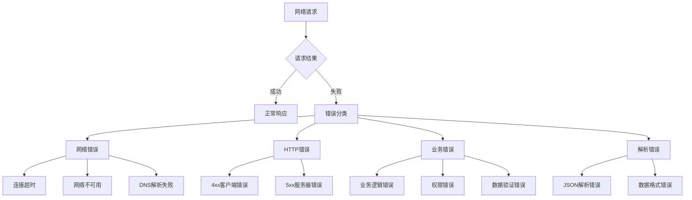

# 错误处理策略

> 构建健壮的网络错误处理机制，提升用户体验

## 🚨 错误处理架构

### 错误分类体系



## 🔧 错误模型定义

### 1. 基础错误类

```dart
abstract class AppError extends Equatable implements Exception {
  final String message;
  final String? code;
  final dynamic originalError;
  final StackTrace? stackTrace;
  
  const AppError({
    required this.message,
    this.code,
    this.originalError,
    this.stackTrace,
  });
  
  @override
  List<Object?> get props => [message, code, originalError];
  
  @override
  String toString() => 'AppError(code: $code, message: $message)';
}
```

### 2. 网络错误类型

```dart
class NetworkError extends AppError {
  final NetworkErrorType type;
  
  const NetworkError({
    required this.type,
    required String message,
    String? code,
    dynamic originalError,
    StackTrace? stackTrace,
  }) : super(
    message: message,
    code: code,
    originalError: originalError,
    stackTrace: stackTrace,
  );
  
  factory NetworkError.connectionTimeout() {
    return const NetworkError(
      type: NetworkErrorType.connectionTimeout,
      message: '连接超时，请检查网络连接',
      code: 'NETWORK_TIMEOUT',
    );
  }
  
  factory NetworkError.noInternet() {
    return const NetworkError(
      type: NetworkErrorType.noInternet,
      message: '网络不可用，请检查网络设置',
      code: 'NO_INTERNET',
    );
  }
  
  factory NetworkError.serverUnavailable() {
    return const NetworkError(
      type: NetworkErrorType.serverUnavailable,
      message: '服务器暂时不可用，请稍后重试',
      code: 'SERVER_UNAVAILABLE',
    );
  }
  
  @override
  List<Object?> get props => [...super.props, type];
}

enum NetworkErrorType {
  connectionTimeout,
  receiveTimeout,
  sendTimeout,
  noInternet,
  serverUnavailable,
  dnsFailure,
  certificateError,
}
```

### 3. HTTP错误类型

```dart
class HttpError extends AppError {
  final int statusCode;
  final Map<String, dynamic>? responseData;
  final Map<String, List<String>>? headers;
  
  const HttpError({
    required this.statusCode,
    required String message,
    String? code,
    this.responseData,
    this.headers,
    dynamic originalError,
    StackTrace? stackTrace,
  }) : super(
    message: message,
    code: code,
    originalError: originalError,
    stackTrace: stackTrace,
  );
  
  factory HttpError.badRequest({
    String? message,
    Map<String, dynamic>? responseData,
  }) {
    return HttpError(
      statusCode: 400,
      message: message ?? '请求参数错误',
      code: 'BAD_REQUEST',
      responseData: responseData,
    );
  }
  
  factory HttpError.unauthorized({
    String? message,
  }) {
    return HttpError(
      statusCode: 401,
      message: message ?? '未授权访问，请重新登录',
      code: 'UNAUTHORIZED',
    );
  }
  
  factory HttpError.forbidden({
    String? message,
  }) {
    return HttpError(
      statusCode: 403,
      message: message ?? '权限不足，无法访问',
      code: 'FORBIDDEN',
    );
  }
  
  factory HttpError.notFound({
    String? message,
  }) {
    return HttpError(
      statusCode: 404,
      message: message ?? '请求的资源不存在',
      code: 'NOT_FOUND',
    );
  }
  
  factory HttpError.internalServerError({
    String? message,
  }) {
    return HttpError(
      statusCode: 500,
      message: message ?? '服务器内部错误',
      code: 'INTERNAL_SERVER_ERROR',
    );
  }
  
  bool get isClientError => statusCode >= 400 && statusCode < 500;
  bool get isServerError => statusCode >= 500;
  
  @override
  List<Object?> get props => [...super.props, statusCode, responseData];
}
```

### 4. 业务错误类型

```dart
class BusinessError extends AppError {
  final BusinessErrorType type;
  final Map<String, dynamic>? details;
  
  const BusinessError({
    required this.type,
    required String message,
    String? code,
    this.details,
    dynamic originalError,
    StackTrace? stackTrace,
  }) : super(
    message: message,
    code: code,
    originalError: originalError,
    stackTrace: stackTrace,
  );
  
  factory BusinessError.validationFailed({
    required String message,
    Map<String, dynamic>? details,
  }) {
    return BusinessError(
      type: BusinessErrorType.validation,
      message: message,
      code: 'VALIDATION_FAILED',
      details: details,
    );
  }
  
  factory BusinessError.insufficientPermissions({
    String? message,
  }) {
    return BusinessError(
      type: BusinessErrorType.permission,
      message: message ?? '权限不足',
      code: 'INSUFFICIENT_PERMISSIONS',
    );
  }
  
  @override
  List<Object?> get props => [...super.props, type, details];
}

enum BusinessErrorType {
  validation,
  permission,
  businessRule,
  dataConflict,
}
```

## 🛡️ 错误拦截器

### 统一错误处理拦截器

```dart
class ErrorInterceptor extends Interceptor {
  final ErrorReporter _errorReporter = GetIt.instance<ErrorReporter>();
  final ConnectivityService _connectivity = GetIt.instance<ConnectivityService>();
  
  @override
  void onError(
    DioException err,
    ErrorInterceptorHandler handler,
  ) async {
    final appError = await _convertToAppError(err);
    
    // 记录错误
    await _logError(appError, err);
    
    // 上报错误（非敏感错误）
    if (_shouldReportError(appError)) {
      await _errorReporter.reportError(appError);
    }
    
    // 创建新的DioException包含AppError
    final newError = DioException(
      requestOptions: err.requestOptions,
      response: err.response,
      type: err.type,
      error: appError,
      message: appError.message,
    );
    
    handler.next(newError);
  }
  
  Future<AppError> _convertToAppError(DioException err) async {
    // 检查网络连接
    final hasConnection = await _connectivity.hasConnection();
    
    switch (err.type) {
      case DioExceptionType.connectionTimeout:
        return NetworkError.connectionTimeout();
        
      case DioExceptionType.sendTimeout:
        return const NetworkError(
          type: NetworkErrorType.sendTimeout,
          message: '发送超时，请重试',
          code: 'SEND_TIMEOUT',
        );
        
      case DioExceptionType.receiveTimeout:
        return const NetworkError(
          type: NetworkErrorType.receiveTimeout,
          message: '接收超时，请重试',
          code: 'RECEIVE_TIMEOUT',
        );
        
      case DioExceptionType.badResponse:
        return _handleHttpError(err.response!);
        
      case DioExceptionType.connectionError:
        if (!hasConnection) {
          return NetworkError.noInternet();
        }
        return NetworkError.serverUnavailable();
        
      case DioExceptionType.badCertificate:
        return const NetworkError(
          type: NetworkErrorType.certificateError,
          message: '证书验证失败',
          code: 'CERTIFICATE_ERROR',
        );
        
      default:
        return AppError(
          message: err.message ?? '未知错误',
          code: 'UNKNOWN_ERROR',
          originalError: err,
        );
    }
  }
  
  AppError _handleHttpError(Response response) {
    final statusCode = response.statusCode ?? 0;
    final responseData = response.data as Map<String, dynamic>?;
    
    // 尝试从响应中提取错误信息
    String? message = responseData?['message'] as String?;
    String? code = responseData?['code'] as String?;
    
    switch (statusCode) {
      case 400:
        return HttpError.badRequest(
          message: message,
          responseData: responseData,
        );
      case 401:
        return HttpError.unauthorized(message: message);
      case 403:
        return HttpError.forbidden(message: message);
      case 404:
        return HttpError.notFound(message: message);
      case 422:
        // 数据验证错误
        return BusinessError.validationFailed(
          message: message ?? '数据验证失败',
          details: responseData?['errors'] as Map<String, dynamic>?,
        );
      case 500:
        return HttpError.internalServerError(message: message);
      default:
        if (statusCode >= 400 && statusCode < 500) {
          return HttpError(
            statusCode: statusCode,
            message: message ?? '客户端错误',
            code: code ?? 'CLIENT_ERROR',
            responseData: responseData,
          );
        } else if (statusCode >= 500) {
          return HttpError(
            statusCode: statusCode,
            message: message ?? '服务器错误',
            code: code ?? 'SERVER_ERROR',
            responseData: responseData,
          );
        }
        return HttpError(
          statusCode: statusCode,
          message: message ?? 'HTTP错误',
          code: code ?? 'HTTP_ERROR',
          responseData: responseData,
        );
    }
  }
  
  Future<void> _logError(AppError error, DioException originalError) async {
    final logData = {
      'error_type': error.runtimeType.toString(),
      'error_code': error.code,
      'error_message': error.message,
      'request_url': originalError.requestOptions.uri.toString(),
      'request_method': originalError.requestOptions.method,
      'timestamp': DateTime.now().toIso8601String(),
    };
    
    if (error is HttpError) {
      logData['status_code'] = error.statusCode;
      logData['response_data'] = error.responseData;
    }
    
    debugPrint('Network Error: ${jsonEncode(logData)}');
  }
  
  bool _shouldReportError(AppError error) {
    // 不上报敏感错误
    if (error is HttpError && error.statusCode == 401) {
      return false;
    }
    
    // 不上报网络连接错误
    if (error is NetworkError && error.type == NetworkErrorType.noInternet) {
      return false;
    }
    
    return true;
  }
}
```

## 🔄 错误恢复策略

### 自动恢复机制

```dart
class ErrorRecoveryService {
  final Dio _dio;
  final ConnectivityService _connectivity;
  
  ErrorRecoveryService({
    required Dio dio,
    required ConnectivityService connectivity,
  }) : _dio = dio, _connectivity = connectivity;
  
  Future<Response<T>> executeWithRecovery<T>(
    Future<Response<T>> Function() request,
    {
    int maxRetries = 3,
    Duration baseDelay = const Duration(seconds: 1),
    bool Function(AppError)? shouldRetry,
  }) async {
    int attempts = 0;
    
    while (attempts <= maxRetries) {
      try {
        return await request();
      } catch (e) {
        attempts++;
        
        if (e is DioException && e.error is AppError) {
          final appError = e.error as AppError;
          
          // 检查是否应该重试
          if (attempts > maxRetries || 
              (shouldRetry != null && !shouldRetry(appError))) {
            rethrow;
          }
          
          // 执行恢复策略
          await _executeRecoveryStrategy(appError);
          
          // 等待后重试
          if (attempts <= maxRetries) {
            await Future.delayed(_calculateDelay(attempts, baseDelay));
          }
        } else {
          rethrow;
        }
      }
    }
    
    throw Exception('Max retries exceeded');
  }
  
  Future<void> _executeRecoveryStrategy(AppError error) async {
    if (error is NetworkError) {
      await _handleNetworkError(error);
    } else if (error is HttpError) {
      await _handleHttpError(error);
    }
  }
  
  Future<void> _handleNetworkError(NetworkError error) async {
    switch (error.type) {
      case NetworkErrorType.noInternet:
        // 等待网络恢复
        await _waitForConnection();
        break;
      case NetworkErrorType.dnsFailure:
        // 尝试刷新DNS
        await _refreshDns();
        break;
      default:
        break;
    }
  }
  
  Future<void> _handleHttpError(HttpError error) async {
    switch (error.statusCode) {
      case 401:
        // 尝试刷新token
        await _refreshAuthToken();
        break;
      case 503:
        // 服务不可用，等待更长时间
        await Future.delayed(const Duration(seconds: 5));
        break;
      default:
        break;
    }
  }
  
  Future<void> _waitForConnection() async {
    const maxWait = Duration(seconds: 30);
    const checkInterval = Duration(seconds: 2);
    
    final stopwatch = Stopwatch()..start();
    
    while (stopwatch.elapsed < maxWait) {
      if (await _connectivity.hasConnection()) {
        return;
      }
      await Future.delayed(checkInterval);
    }
  }
  
  Future<void> _refreshDns() async {
    // 实现DNS刷新逻辑
  }
  
  Future<void> _refreshAuthToken() async {
    // 实现token刷新逻辑
  }
  
  Duration _calculateDelay(int attempt, Duration baseDelay) {
    // 指数退避
    return baseDelay * math.pow(2, attempt - 1);
  }
}
```

## 📱 用户友好的错误展示

### 错误消息本地化

```dart
class ErrorMessageLocalizer {
  static const Map<String, Map<String, String>> _messages = {
    'zh': {
      'NETWORK_TIMEOUT': '网络连接超时，请检查网络后重试',
      'NO_INTERNET': '网络不可用，请检查网络设置',
      'SERVER_UNAVAILABLE': '服务器暂时不可用，请稍后重试',
      'UNAUTHORIZED': '登录已过期，请重新登录',
      'FORBIDDEN': '权限不足，无法执行此操作',
      'NOT_FOUND': '请求的内容不存在',
      'VALIDATION_FAILED': '输入信息有误，请检查后重试',
      'UNKNOWN_ERROR': '发生未知错误，请稍后重试',
    },
    'en': {
      'NETWORK_TIMEOUT': 'Network connection timeout, please check your network and try again',
      'NO_INTERNET': 'No internet connection, please check your network settings',
      'SERVER_UNAVAILABLE': 'Server temporarily unavailable, please try again later',
      'UNAUTHORIZED': 'Login expired, please log in again',
      'FORBIDDEN': 'Insufficient permissions to perform this action',
      'NOT_FOUND': 'The requested content does not exist',
      'VALIDATION_FAILED': 'Input information is incorrect, please check and try again',
      'UNKNOWN_ERROR': 'An unknown error occurred, please try again later',
    },
  };
  
  static String getLocalizedMessage(AppError error, [String locale = 'zh']) {
    final messages = _messages[locale] ?? _messages['zh']!;
    return messages[error.code] ?? error.message;
  }
}
```

### 错误UI组件

```dart
class ErrorWidget extends StatelessWidget {
  final AppError error;
  final VoidCallback? onRetry;
  final VoidCallback? onDismiss;
  
  const ErrorWidget({
    Key? key,
    required this.error,
    this.onRetry,
    this.onDismiss,
  }) : super(key: key);
  
  @override
  Widget build(BuildContext context) {
    return Container(
      padding: const EdgeInsets.all(16),
      decoration: BoxDecoration(
        color: _getErrorColor(error).withOpacity(0.1),
        borderRadius: BorderRadius.circular(8),
        border: Border.all(
          color: _getErrorColor(error).withOpacity(0.3),
        ),
      ),
      child: Column(
        mainAxisSize: MainAxisSize.min,
        children: [
          Row(
            children: [
              Icon(
                _getErrorIcon(error),
                color: _getErrorColor(error),
                size: 24,
              ),
              const SizedBox(width: 12),
              Expanded(
                child: Text(
                  ErrorMessageLocalizer.getLocalizedMessage(error),
                  style: TextStyle(
                    color: _getErrorColor(error),
                    fontWeight: FontWeight.w500,
                  ),
                ),
              ),
              if (onDismiss != null)
                IconButton(
                  onPressed: onDismiss,
                  icon: const Icon(Icons.close),
                  iconSize: 20,
                ),
            ],
          ),
          if (onRetry != null) ..[
            const SizedBox(height: 12),
            SizedBox(
              width: double.infinity,
              child: ElevatedButton(
                onPressed: onRetry,
                style: ElevatedButton.styleFrom(
                  backgroundColor: _getErrorColor(error),
                ),
                child: const Text('重试'),
              ),
            ),
          ],
        ],
      ),
    );
  }
  
  Color _getErrorColor(AppError error) {
    if (error is NetworkError) {
      return Colors.orange;
    } else if (error is HttpError) {
      return error.isServerError ? Colors.red : Colors.amber;
    } else if (error is BusinessError) {
      return Colors.blue;
    }
    return Colors.grey;
  }
  
  IconData _getErrorIcon(AppError error) {
    if (error is NetworkError) {
      switch (error.type) {
        case NetworkErrorType.noInternet:
          return Icons.wifi_off;
        case NetworkErrorType.connectionTimeout:
          return Icons.access_time;
        default:
          return Icons.error_outline;
      }
    } else if (error is HttpError) {
      switch (error.statusCode) {
        case 401:
          return Icons.lock_outline;
        case 403:
          return Icons.block;
        case 404:
          return Icons.search_off;
        default:
          return Icons.error_outline;
      }
    }
    return Icons.error_outline;
  }
}
```

## 🎯 最佳实践

### 错误处理检查清单

- ✅ **分类明确**：按错误类型进行分类处理
- ✅ **用户友好**：提供清晰的错误提示和解决方案
- ✅ **自动恢复**：实现合理的重试和恢复机制
- ✅ **错误上报**：记录和上报关键错误信息
- ✅ **本地化支持**：支持多语言错误消息
- ✅ **性能考虑**：避免错误处理影响应用性能

### 调试技巧

```dart
class ErrorDebugger {
  static void logDetailedError(AppError error, StackTrace? stackTrace) {
    if (kDebugMode) {
      debugPrint('=== Error Details ===');
      debugPrint('Type: ${error.runtimeType}');
      debugPrint('Code: ${error.code}');
      debugPrint('Message: ${error.message}');
      
      if (error is HttpError) {
        debugPrint('Status Code: ${error.statusCode}');
        debugPrint('Response Data: ${error.responseData}');
      }
      
      if (stackTrace != null) {
        debugPrint('Stack Trace:');
        debugPrint(stackTrace.toString());
      }
      
      debugPrint('==================');
    }
  }
}
```