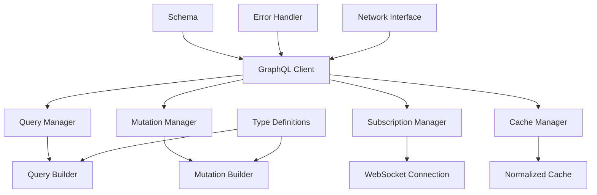
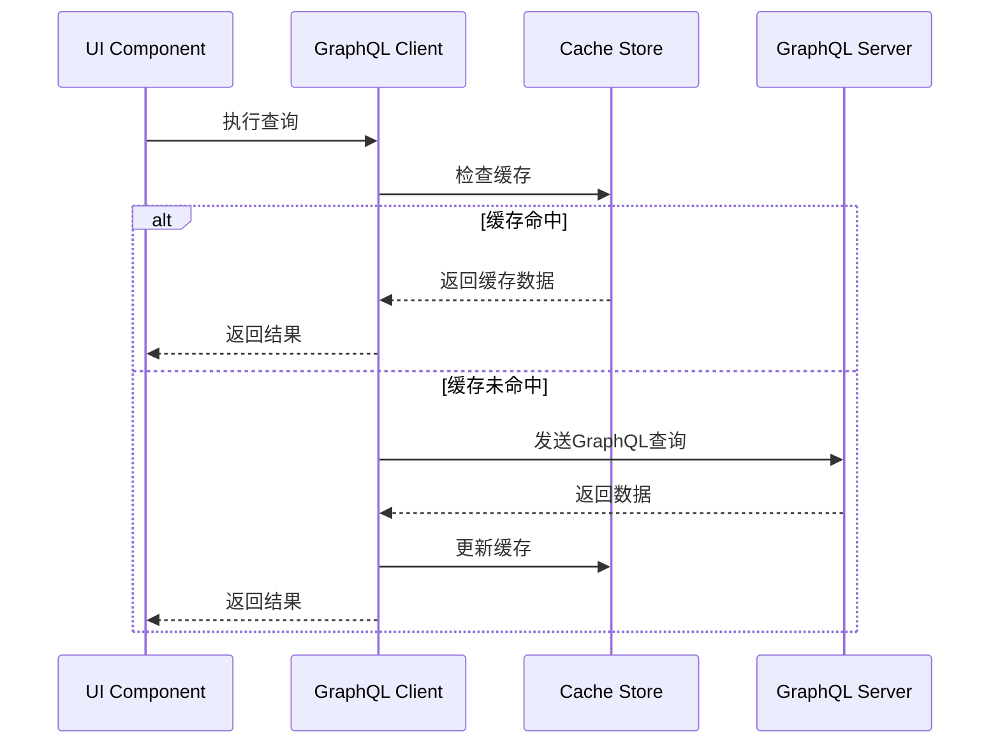

# GraphQL 集成

> 在Flutter中集成GraphQL，实现高效的数据查询和变更

## 📋 目录

- [GraphQL架构设计](#graphql架构设计)
- [GraphQL客户端配置](#graphql客户端配置)
- [查询与变更](#查询与变更)
- [缓存策略](#缓存策略)
- [订阅实现](#订阅实现)
- [错误处理](#错误处理)
- [性能优化](#性能优化)
- [最佳实践](#最佳实践)

## 🏗️ GraphQL架构设计

### GraphQL客户端架构



### GraphQL数据流



## ⚙️ GraphQL客户端配置

### 基础客户端设置

```dart
import 'package:graphql_flutter/graphql_flutter.dart';
import 'package:flutter/material.dart';

class GraphQLConfig {
  static HttpLink httpLink = HttpLink(
    'https://api.example.com/graphql',
  );
  
  static AuthLink authLink = AuthLink(
    getToken: () async {
      // 获取认证token
      final token = await TokenManager.getToken();
      return token != null ? 'Bearer $token' : null;
    },
  );
  
  static WebSocketLink websocketLink = WebSocketLink(
    'wss://api.example.com/graphql',
    config: SocketClientConfig(
      autoReconnect: true,
      inactivityTimeout: Duration(seconds: 30),
    ),
  );
  
  static Link link = Link.split(
    (request) => request.isSubscription,
    websocketLink,
    authLink.concat(httpLink),
  );
  
  static ValueNotifier<GraphQLClient> initializeClient() {
    return ValueNotifier(
      GraphQLClient(
        link: link,
        cache: GraphQLCache(
          store: HiveStore(),
        ),
        defaultPolicies: DefaultPolicies(
          watchQuery: Policies(
            fetchPolicy: FetchPolicy.cacheAndNetwork,
            errorPolicy: ErrorPolicy.all,
          ),
          query: Policies(
            fetchPolicy: FetchPolicy.cacheFirst,
            errorPolicy: ErrorPolicy.all,
          ),
        ),
      ),
    );
  }
}
```

### 高级客户端配置

```dart
class AdvancedGraphQLClient {
  late GraphQLClient _client;
  final _retryLink = RetryLink();
  final _errorLink = ErrorLink(
    errorHandler: (context, error) {
      // 全局错误处理
      if (error.linkException is ServerException) {
        final serverError = error.linkException as ServerException;
        _handleServerError(serverError);
      } else if (error.linkException is NetworkException) {
        _handleNetworkError(error.linkException as NetworkException);
      }
    },
  );
  
  void initialize() {
    final link = Link.from([
      _errorLink,
      _retryLink,
      GraphQLConfig.authLink,
      GraphQLConfig.httpLink,
    ]);
    
    _client = GraphQLClient(
      link: link,
      cache: GraphQLCache(
        store: HiveStore(),
        typePolicies: {
          'User': TypePolicy(
            keyFields: {'id'},
            merge: true,
          ),
          'Post': TypePolicy(
            keyFields: {'id'},
            merge: (existing, incoming, context) {
              // 自定义合并逻辑
              return {
                ...existing ?? {},
                ...incoming,
                'updatedAt': incoming['updatedAt'],
              };
            },
          ),
        },
      ),
    );
  }
  
  void _handleServerError(ServerException error) {
    // 处理服务器错误
    print('Server Error: ${error.parsedResponse?.errors}');
  }
  
  void _handleNetworkError(NetworkException error) {
    // 处理网络错误
    print('Network Error: ${error.message}');
  }
}
```

## 🔍 查询与变更

### 查询实现

```dart
class UserQueries {
  static const String getUserProfile = r'''
    query GetUserProfile($userId: ID!) {
      user(id: $userId) {
        id
        name
        email
        avatar
        profile {
          bio
          location
          website
        }
        posts(first: 10) {
          edges {
            node {
              id
              title
              content
              createdAt
            }
          }
          pageInfo {
            hasNextPage
            endCursor
          }
        }
      }
    }
  ''';
  
  static const String searchUsers = r'''
    query SearchUsers($query: String!, $first: Int!, $after: String) {
      searchUsers(query: $query, first: $first, after: $after) {
        edges {
          node {
            id
            name
            avatar
            isFollowing
          }
        }
        pageInfo {
          hasNextPage
          endCursor
        }
      }
    }
  ''';
}

class UserRepository {
  final GraphQLClient _client;
  
  UserRepository(this._client);
  
  Future<User?> getUserProfile(String userId) async {
    final options = QueryOptions(
      document: gql(UserQueries.getUserProfile),
      variables: {'userId': userId},
      fetchPolicy: FetchPolicy.cacheFirst,
    );
    
    final result = await _client.query(options);
    
    if (result.hasException) {
      throw GraphQLException(result.exception!);
    }
    
    if (result.data?['user'] != null) {
      return User.fromJson(result.data!['user']);
    }
    
    return null;
  }
  
  Stream<List<User>> searchUsers(String query) async* {
    String? cursor;
    bool hasNextPage = true;
    
    while (hasNextPage) {
      final options = QueryOptions(
        document: gql(UserQueries.searchUsers),
        variables: {
          'query': query,
          'first': 20,
          if (cursor != null) 'after': cursor,
        },
      );
      
      final result = await _client.query(options);
      
      if (result.hasException) {
        throw GraphQLException(result.exception!);
      }
      
      final data = result.data?['searchUsers'];
      if (data != null) {
        final users = (data['edges'] as List)
            .map((edge) => User.fromJson(edge['node']))
            .toList();
        
        yield users;
        
        final pageInfo = data['pageInfo'];
        hasNextPage = pageInfo['hasNextPage'] ?? false;
        cursor = pageInfo['endCursor'];
      } else {
        hasNextPage = false;
      }
    }
  }
}
```

### 变更实现

```dart
class UserMutations {
  static const String updateProfile = r'''
    mutation UpdateProfile($input: UpdateProfileInput!) {
      updateProfile(input: $input) {
        user {
          id
          name
          email
          profile {
            bio
            location
            website
          }
        }
        errors {
          field
          message
        }
      }
    }
  ''';
  
  static const String followUser = r'''
    mutation FollowUser($userId: ID!) {
      followUser(userId: $userId) {
        success
        user {
          id
          isFollowing
          followersCount
        }
      }
    }
  ''';
}

class UserMutationRepository {
  final GraphQLClient _client;
  
  UserMutationRepository(this._client);
  
  Future<User> updateProfile(UpdateProfileInput input) async {
    final options = MutationOptions(
      document: gql(UserMutations.updateProfile),
      variables: {'input': input.toJson()},
      update: (cache, result) {
        // 更新缓存
        final userData = result?.data?['updateProfile']['user'];
        if (userData != null) {
          cache.writeFragment(
            Fragment(
              document: gql(r'''
                fragment UserProfile on User {
                  id
                  name
                  email
                  profile {
                    bio
                    location
                    website
                  }
                }
              '''),
            ).asRequest(idFields: {'id': userData['id']}),
            data: userData,
          );
        }
      },
    );
    
    final result = await _client.mutate(options);
    
    if (result.hasException) {
      throw GraphQLException(result.exception!);
    }
    
    final errors = result.data?['updateProfile']['errors'];
    if (errors != null && errors.isNotEmpty) {
      throw ValidationException(errors);
    }
    
    return User.fromJson(result.data!['updateProfile']['user']);
  }
  
  Future<bool> followUser(String userId) async {
    final options = MutationOptions(
      document: gql(UserMutations.followUser),
      variables: {'userId': userId},
      optimisticResult: {
        'followUser': {
          'success': true,
          'user': {
            'id': userId,
            'isFollowing': true,
            '__typename': 'User',
          },
        },
      },
    );
    
    final result = await _client.mutate(options);
    
    if (result.hasException) {
      throw GraphQLException(result.exception!);
    }
    
    return result.data?['followUser']['success'] ?? false;
  }
}
```

## 💾 缓存策略

### 智能缓存管理

```dart
class GraphQLCacheManager {
  final GraphQLClient _client;
  
  GraphQLCacheManager(this._client);
  
  // 缓存策略配置
  void configureCachePolicies() {
    final cache = _client.cache as GraphQLCache;
    
    // 配置类型策略
    cache.addTypePolicies({
      'User': TypePolicy(
        keyFields: {'id'},
        fields: {
          'posts': FieldPolicy(
            merge: (existing, incoming, context) {
              // 合并分页数据
              if (existing == null) return incoming;
              
              final existingEdges = existing['edges'] ?? [];
              final incomingEdges = incoming['edges'] ?? [];
              
              return {
                'edges': [...existingEdges, ...incomingEdges],
                'pageInfo': incoming['pageInfo'],
              };
            },
          ),
        },
      ),
      'Post': TypePolicy(
        keyFields: {'id'},
        fields: {
          'comments': FieldPolicy(
            merge: (existing, incoming, context) {
              // 评论数据合并策略
              return incoming;
            },
          ),
        },
      ),
    });
  }
  
  // 手动缓存更新
  void updateUserInCache(User user) {
    _client.cache.writeFragment(
      Fragment(
        document: gql(r'''
          fragment UserData on User {
            id
            name
            email
            avatar
            isFollowing
            followersCount
          }
        '''),
      ).asRequest(idFields: {'id': user.id}),
      data: user.toJson(),
    );
  }
  
  // 缓存失效
  void invalidateUserCache(String userId) {
    _client.cache.evict(
      CacheKey.fromPath(['User', userId]),
    );
  }
  
  // 批量缓存更新
  void batchUpdateCache(List<CacheUpdate> updates) {
    _client.cache.batch((cache) {
      for (final update in updates) {
        switch (update.type) {
          case CacheUpdateType.write:
            cache.writeFragment(
              update.fragment!,
              data: update.data,
            );
            break;
          case CacheUpdateType.evict:
            cache.evict(update.key!);
            break;
        }
      }
    });
  }
}

enum CacheUpdateType { write, evict }

class CacheUpdate {
  final CacheUpdateType type;
  final FragmentRequest? fragment;
  final Map<String, dynamic>? data;
  final CacheKey? key;
  
  CacheUpdate.write(this.fragment, this.data)
      : type = CacheUpdateType.write,
        key = null;
  
  CacheUpdate.evict(this.key)
      : type = CacheUpdateType.evict,
        fragment = null,
        data = null;
}
```

## 📡 订阅实现

### WebSocket订阅

```dart
class SubscriptionManager {
  final GraphQLClient _client;
  final Map<String, StreamSubscription> _subscriptions = {};
  
  SubscriptionManager(this._client);
  
  // 消息订阅
  Stream<Message> subscribeToMessages(String chatId) {
    const subscription = r'''
      subscription MessageAdded($chatId: ID!) {
        messageAdded(chatId: $chatId) {
          id
          content
          author {
            id
            name
            avatar
          }
          createdAt
          type
        }
      }
    ''';
    
    final options = SubscriptionOptions(
      document: gql(subscription),
      variables: {'chatId': chatId},
    );
    
    return _client.subscribe(options).map((result) {
      if (result.hasException) {
        throw GraphQLException(result.exception!);
      }
      
      return Message.fromJson(result.data!['messageAdded']);
    });
  }
  
  // 用户状态订阅
  Stream<UserStatus> subscribeToUserStatus(String userId) {
    const subscription = r'''
      subscription UserStatusChanged($userId: ID!) {
        userStatusChanged(userId: $userId) {
          id
          isOnline
          lastSeen
          status
        }
      }
    ''';
    
    final options = SubscriptionOptions(
      document: gql(subscription),
      variables: {'userId': userId},
    );
    
    return _client.subscribe(options).map((result) {
      if (result.hasException) {
        throw GraphQLException(result.exception!);
      }
      
      return UserStatus.fromJson(result.data!['userStatusChanged']);
    });
  }
  
  // 管理订阅生命周期
  void startSubscription(String key, Stream subscription) {
    _subscriptions[key]?.cancel();
    _subscriptions[key] = subscription.listen(
      (data) {
        // 处理订阅数据
        _handleSubscriptionData(key, data);
      },
      onError: (error) {
        // 处理订阅错误
        _handleSubscriptionError(key, error);
      },
    );
  }
  
  void stopSubscription(String key) {
    _subscriptions[key]?.cancel();
    _subscriptions.remove(key);
  }
  
  void stopAllSubscriptions() {
    for (final subscription in _subscriptions.values) {
      subscription.cancel();
    }
    _subscriptions.clear();
  }
  
  void _handleSubscriptionData(String key, dynamic data) {
    // 处理订阅数据，更新UI或缓存
    print('Subscription $key received data: $data');
  }
  
  void _handleSubscriptionError(String key, dynamic error) {
    // 处理订阅错误，可能需要重连
    print('Subscription $key error: $error');
    
    // 自动重连逻辑
    Future.delayed(Duration(seconds: 5), () {
      // 重新启动订阅
    });
  }
  
  void dispose() {
    stopAllSubscriptions();
  }
}
```

## 🚨 错误处理

### GraphQL错误处理

```dart
class GraphQLErrorHandler {
  static void handleError(OperationException exception) {
    if (exception.linkException != null) {
      _handleLinkException(exception.linkException!);
    }
    
    if (exception.graphqlErrors.isNotEmpty) {
      _handleGraphQLErrors(exception.graphqlErrors);
    }
  }
  
  static void _handleLinkException(LinkException exception) {
    if (exception is NetworkException) {
      // 网络错误
      _showNetworkError();
    } else if (exception is ServerException) {
      // 服务器错误
      _handleServerException(exception);
    } else if (exception is ParserException) {
      // 解析错误
      _showParseError();
    }
  }
  
  static void _handleServerException(ServerException exception) {
    final statusCode = exception.response.statusCode;
    
    switch (statusCode) {
      case 401:
        _handleUnauthorized();
        break;
      case 403:
        _handleForbidden();
        break;
      case 404:
        _showNotFoundError();
        break;
      case 500:
        _showServerError();
        break;
      default:
        _showGenericError();
    }
  }
  
  static void _handleGraphQLErrors(List<GraphQLError> errors) {
    for (final error in errors) {
      final errorCode = error.extensions?['code'];
      
      switch (errorCode) {
        case 'VALIDATION_ERROR':
          _handleValidationError(error);
          break;
        case 'AUTHENTICATION_ERROR':
          _handleAuthenticationError();
          break;
        case 'AUTHORIZATION_ERROR':
          _handleAuthorizationError();
          break;
        case 'RATE_LIMITED':
          _handleRateLimit(error);
          break;
        default:
          _showGraphQLError(error.message);
      }
    }
  }
  
  static void _handleUnauthorized() {
    // 清除token，跳转到登录页
    TokenManager.clearToken();
    NavigationService.pushNamedAndClearStack('/login');
  }
  
  static void _handleForbidden() {
    ToastService.showError('您没有权限执行此操作');
  }
  
  static void _handleValidationError(GraphQLError error) {
    final field = error.extensions?['field'];
    final message = error.message;
    
    if (field != null) {
      FormValidationService.showFieldError(field, message);
    } else {
      ToastService.showError(message);
    }
  }
  
  static void _handleRateLimit(GraphQLError error) {
    final retryAfter = error.extensions?['retryAfter'] ?? 60;
    ToastService.showWarning('请求过于频繁，请${retryAfter}秒后重试');
  }
  
  static void _showNetworkError() {
    ToastService.showError('网络连接失败，请检查网络设置');
  }
  
  static void _showServerError() {
    ToastService.showError('服务器错误，请稍后重试');
  }
  
  static void _showParseError() {
    ToastService.showError('数据解析失败');
  }
  
  static void _showNotFoundError() {
    ToastService.showError('请求的资源不存在');
  }
  
  static void _showGenericError() {
    ToastService.showError('操作失败，请重试');
  }
  
  static void _showGraphQLError(String message) {
    ToastService.showError(message);
  }
  
  static void _handleAuthenticationError() {
    _handleUnauthorized();
  }
  
  static void _handleAuthorizationError() {
    _handleForbidden();
  }
}
```

## ⚡ 性能优化

### 查询优化

```dart
class GraphQLPerformanceOptimizer {
  // 查询批处理
  static List<QueryOptions> batchQueries(List<QueryOptions> queries) {
    // 将多个查询合并为一个批处理请求
    final batchedQuery = QueryOptions(
      document: gql(_buildBatchQuery(queries)),
      variables: _mergeBatchVariables(queries),
    );
    
    return [batchedQuery];
  }
  
  static String _buildBatchQuery(List<QueryOptions> queries) {
    final queryParts = queries.asMap().entries.map((entry) {
      final index = entry.key;
      final query = entry.value;
      
      // 为每个查询添加别名
      return 'query$index: ${_extractQueryBody(query.document)}';
    }).join('\n');
    
    return 'query BatchQuery { $queryParts }';
  }
  
  static Map<String, dynamic> _mergeBatchVariables(List<QueryOptions> queries) {
    final mergedVariables = <String, dynamic>{};
    
    for (int i = 0; i < queries.length; i++) {
      final variables = queries[i].variables;
      for (final entry in variables.entries) {
        mergedVariables['${entry.key}_$i'] = entry.value;
      }
    }
    
    return mergedVariables;
  }
  
  static String _extractQueryBody(DocumentNode document) {
    // 提取查询主体（简化实现）
    return document.definitions.first.toString();
  }
  
  // 查询去重
  static List<QueryOptions> deduplicateQueries(List<QueryOptions> queries) {
    final seen = <String>{};
    final deduplicated = <QueryOptions>[];
    
    for (final query in queries) {
      final key = _generateQueryKey(query);
      if (!seen.contains(key)) {
        seen.add(key);
        deduplicated.add(query);
      }
    }
    
    return deduplicated;
  }
  
  static String _generateQueryKey(QueryOptions query) {
    // 生成查询的唯一标识
    final documentString = query.document.definitions.first.toString();
    final variablesString = query.variables.toString();
    return '$documentString:$variablesString';
  }
  
  // 分页优化
  static QueryOptions optimizePaginationQuery(
    QueryOptions query,
    int pageSize,
  ) {
    return query.copyWith(
      variables: {
        ...query.variables,
        'first': pageSize,
      },
      fetchPolicy: FetchPolicy.cacheFirst,
    );
  }
}
```

## 🎯 最佳实践

### 1. 查询设计原则

```dart
// ✅ 好的查询设计
const goodQuery = r'''
  query GetUserDashboard($userId: ID!) {
    user(id: $userId) {
      id
      name
      avatar
      # 只请求需要的字段
      stats {
        postsCount
        followersCount
      }
      # 限制嵌套深度
      recentPosts(first: 5) {
        id
        title
        createdAt
      }
    }
  }
''';

// ❌ 避免的查询设计
const badQuery = r'''
  query GetEverything {
    users {
      # 请求了过多不必要的字段
      id
      name
      email
      profile
      posts {
        # 没有限制数量
        id
        title
        content
        comments {
          # 嵌套过深
          id
          content
          author {
            id
            name
            posts {
              # 循环引用
              id
              title
            }
          }
        }
      }
    }
  }
''';
```

### 2. 缓存策略建议

```dart
class CachingBestPractices {
  // 配置合适的缓存策略
  static Map<String, FetchPolicy> getCachePolicies() {
    return {
      // 用户资料 - 缓存优先
      'GetUserProfile': FetchPolicy.cacheFirst,
      
      // 实时数据 - 网络优先
      'GetNotifications': FetchPolicy.networkOnly,
      
      // 列表数据 - 缓存和网络
      'GetPostsList': FetchPolicy.cacheAndNetwork,
      
      // 搜索结果 - 仅网络
      'SearchPosts': FetchPolicy.networkOnly,
    };
  }
  
  // 缓存失效策略
  static void setupCacheInvalidation(GraphQLClient client) {
    // 用户更新后失效相关缓存
    client.cache.addListener('User', (event) {
      if (event.type == CacheEventType.write) {
        // 失效用户相关的列表缓存
        client.cache.evictMatching(
          (key) => key.path.contains('users') || key.path.contains('followers'),
        );
      }
    });
  }
}
```

### 3. 错误处理策略

```dart
class ErrorHandlingBestPractices {
  // 全局错误处理配置
  static ErrorLink createErrorLink() {
    return ErrorLink(
      errorHandler: (context, error) {
        // 记录错误
        AnalyticsService.logError('GraphQL Error', {
          'operation': context.operation.operationName,
          'variables': context.operation.variables,
          'error': error.toString(),
        });
        
        // 处理特定错误
        GraphQLErrorHandler.handleError(error);
      },
    );
  }
  
  // 重试策略
  static RetryLink createRetryLink() {
    return RetryLink(
      delay: (count, operation, error) {
        // 指数退避
        return Duration(milliseconds: 1000 * pow(2, count).toInt());
      },
      attempts: (count, operation, error) {
        // 最多重试3次
        if (count > 3) return false;
        
        // 只对网络错误重试
        return error.linkException is NetworkException;
      },
    );
  }
}
```

### 4. 性能监控

```dart
class GraphQLPerformanceMonitor {
  static PerformanceLink createPerformanceLink() {
    return PerformanceLink(
      onRequest: (operation) {
        // 记录请求开始时间
        final startTime = DateTime.now();
        operation.setContext({
          'startTime': startTime,
        });
      },
      onResponse: (operation, response) {
        // 计算请求耗时
        final startTime = operation.getContext()['startTime'] as DateTime;
        final duration = DateTime.now().difference(startTime);
        
        // 记录性能指标
        AnalyticsService.logPerformance('GraphQL Query', {
          'operation': operation.operationName,
          'duration': duration.inMilliseconds,
          'cacheHit': response.source == ResponseSource.cache,
        });
        
        // 慢查询警告
        if (duration.inMilliseconds > 2000) {
          print('Slow GraphQL query detected: ${operation.operationName}');
        }
      },
    );
  }
}
```

### 5. 开发调试技巧

```dart
class GraphQLDebugging {
  // 开发环境调试配置
  static Link createDebugLink() {
    return Link.from([
      // 请求日志
      LoggingLink(
        level: LogLevel.all,
        printer: (log) {
          if (kDebugMode) {
            print('GraphQL ${log.level}: ${log.message}');
          }
        },
      ),
      
      // 性能监控
      GraphQLPerformanceMonitor.createPerformanceLink(),
      
      // 错误处理
      ErrorHandlingBestPractices.createErrorLink(),
      
      // 重试机制
      ErrorHandlingBestPractices.createRetryLink(),
    ]);
  }
  
  // 查询分析工具
  static void analyzeQuery(DocumentNode document) {
    final visitor = QueryAnalysisVisitor();
    document.accept(visitor);
    
    print('Query Analysis:');
    print('- Depth: ${visitor.maxDepth}');
    print('- Field count: ${visitor.fieldCount}');
    print('- Has fragments: ${visitor.hasFragments}');
    
    if (visitor.maxDepth > 5) {
      print('Warning: Query depth is too deep (${visitor.maxDepth})');
    }
    
    if (visitor.fieldCount > 50) {
      print('Warning: Too many fields requested (${visitor.fieldCount})');
    }
  }
}

class QueryAnalysisVisitor extends RecursiveVisitor {
  int maxDepth = 0;
  int currentDepth = 0;
  int fieldCount = 0;
  bool hasFragments = false;
  
  @override
  void visitFieldNode(FieldNode node) {
    currentDepth++;
    fieldCount++;
    maxDepth = math.max(maxDepth, currentDepth);
    
    super.visitFieldNode(node);
    
    currentDepth--;
  }
  
  @override
  void visitFragmentSpreadNode(FragmentSpreadNode node) {
    hasFragments = true;
    super.visitFragmentSpreadNode(node);
  }
}
```

## 📚 总结

GraphQL集成的关键要点：

1. **客户端配置**：合理配置认证、缓存和错误处理
2. **查询设计**：避免过深嵌套和过多字段请求
3. **缓存策略**：根据数据特性选择合适的缓存策略
4. **错误处理**：实现全面的错误处理和重试机制
5. **性能优化**：使用查询批处理和去重技术
6. **实时通信**：合理管理WebSocket订阅生命周期
7. **调试监控**：建立完善的性能监控和调试体系

通过这些最佳实践，可以构建高效、稳定的GraphQL客户端应用。