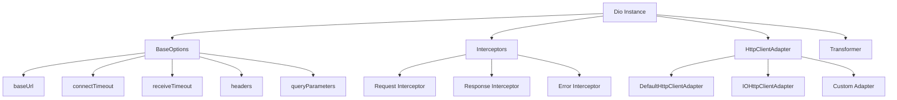

# HTTP客户端配置详解

> 深入掌握Dio和HTTP包的高级配置与优化技巧

## 🚀 Dio高级配置

### 基础配置架构



### 1. 完整的Dio配置

```dart
class HttpClient {
  static late Dio _dio;
  static const Duration _connectTimeout = Duration(seconds: 10);
  static const Duration _receiveTimeout = Duration(seconds: 15);
  static const Duration _sendTimeout = Duration(seconds: 10);
  
  static Dio get instance => _dio;
  
  static void initialize({
    required String baseUrl,
    Map<String, dynamic>? defaultHeaders,
    bool enableLogging = false,
  }) {
    final baseOptions = BaseOptions(
      baseUrl: baseUrl,
      connectTimeout: _connectTimeout,
      receiveTimeout: _receiveTimeout,
      sendTimeout: _sendTimeout,
      headers: {
        'Content-Type': 'application/json',
        'Accept': 'application/json',
        ...?defaultHeaders,
      },
      // 响应类型
      responseType: ResponseType.json,
      // 请求编码
      contentType: Headers.jsonContentType,
      // 验证状态码
      validateStatus: (status) {
        return status != null && status >= 200 && status < 300;
      },
      // 跟随重定向
      followRedirects: true,
      maxRedirects: 3,
      // 持久连接
      persistentConnection: true,
      // 接收数据时的缓冲区大小
      receiveDataWhenStatusError: true,
    );
    
    _dio = Dio(baseOptions);
    
    // 配置HTTP客户端适配器
    _configureHttpClientAdapter();
    
    // 添加拦截器
    _setupInterceptors(enableLogging);
  }
  
  static void _configureHttpClientAdapter() {
    (_dio.httpClientAdapter as DefaultHttpClientAdapter).onHttpClientCreate = (client) {
      // 配置连接池
      client.maxConnectionsPerHost = 5;
      client.connectionTimeout = _connectTimeout;
      client.idleTimeout = const Duration(seconds: 30);
      
      // 配置代理（仅在调试模式下）
      if (kDebugMode) {
        // client.findProxy = (uri) => 'PROXY localhost:8888';
        // client.badCertificateCallback = (cert, host, port) => true;
      }
      
      return client;
    };
  }
  
  static void _setupInterceptors(bool enableLogging) {
    // 请求/响应拦截器
    _dio.interceptors.addAll([
      // 认证拦截器
      AuthInterceptor(),
      
      // 缓存拦截器
      CacheInterceptor(),
      
      // 重试拦截器
      RetryInterceptor(),
      
      // 日志拦截器（仅在调试模式下）
      if (enableLogging && kDebugMode)
        LogInterceptor(
          requestBody: true,
          responseBody: true,
          requestHeader: true,
          responseHeader: false,
          error: true,
          logPrint: (object) => debugPrint('[HTTP] $object'),
        ),
      
      // 错误处理拦截器
      ErrorInterceptor(),
    ]);
  }
}
```

### 2. 环境配置管理

```dart
enum Environment {
  development,
  staging,
  production,
}

class ApiConfig {
  static Environment _currentEnvironment = Environment.development;
  
  static Environment get currentEnvironment => _currentEnvironment;
  
  static void setEnvironment(Environment environment) {
    _currentEnvironment = environment;
  }
  
  static String get baseUrl {
    switch (_currentEnvironment) {
      case Environment.development:
        return 'https://dev-api.example.com';
      case Environment.staging:
        return 'https://staging-api.example.com';
      case Environment.production:
        return 'https://api.example.com';
    }
  }
  
  static Duration get connectTimeout {
    switch (_currentEnvironment) {
      case Environment.development:
        return const Duration(seconds: 30); // 开发环境较长超时
      case Environment.staging:
        return const Duration(seconds: 15);
      case Environment.production:
        return const Duration(seconds: 10);
    }
  }
  
  static bool get enableLogging {
    return _currentEnvironment != Environment.production;
  }
  
  static Map<String, String> get defaultHeaders {
    final headers = <String, String>{
      'X-App-Version': '1.0.0',
      'X-Platform': Platform.isIOS ? 'iOS' : 'Android',
    };
    
    if (_currentEnvironment == Environment.development) {
      headers['X-Debug-Mode'] = 'true';
    }
    
    return headers;
  }
}
```

## 🔄 连接池管理

### 连接池优化配置

```dart
class ConnectionPoolManager {
  static void configureConnectionPool(Dio dio) {
    (dio.httpClientAdapter as DefaultHttpClientAdapter).onHttpClientCreate = (client) {
      // 最大连接数
      client.maxConnectionsPerHost = 6;
      
      // 连接超时
      client.connectionTimeout = const Duration(seconds: 10);
      
      // 空闲超时
      client.idleTimeout = const Duration(seconds: 30);
      
      // 启用HTTP/2
      client.autoUncompress = true;
      
      // 配置用户代理
      client.userAgent = 'Flutter App/1.0.0';
      
      return client;
    };
  }
  
  // 自定义HTTP客户端适配器
  static HttpClientAdapter createCustomAdapter() {
    return IOHttpClientAdapter(
      createHttpClient: () {
        final client = HttpClient();
        
        // 连接池配置
        client.maxConnectionsPerHost = 8;
        client.connectionTimeout = const Duration(seconds: 10);
        client.idleTimeout = const Duration(seconds: 30);
        
        // SSL配置
        client.badCertificateCallback = (cert, host, port) {
          // 在生产环境中应该进行适当的证书验证
          return kDebugMode;
        };
        
        return client;
      },
    );
  }
}
```

## ⏱️ 超时设置策略

### 智能超时配置

```dart
class TimeoutConfig {
  // 根据网络类型调整超时时间
  static Duration getConnectTimeout(ConnectivityResult connectivity) {
    switch (connectivity) {
      case ConnectivityResult.wifi:
        return const Duration(seconds: 10);
      case ConnectivityResult.mobile:
        return const Duration(seconds: 15);
      case ConnectivityResult.ethernet:
        return const Duration(seconds: 8);
      default:
        return const Duration(seconds: 20);
    }
  }
  
  static Duration getReceiveTimeout(ConnectivityResult connectivity) {
    switch (connectivity) {
      case ConnectivityResult.wifi:
        return const Duration(seconds: 15);
      case ConnectivityResult.mobile:
        return const Duration(seconds: 25);
      case ConnectivityResult.ethernet:
        return const Duration(seconds: 12);
      default:
        return const Duration(seconds: 30);
    }
  }
  
  // 动态调整超时时间
  static void adjustTimeouts(Dio dio) async {
    final connectivity = await Connectivity().checkConnectivity();
    
    dio.options.connectTimeout = getConnectTimeout(connectivity);
    dio.options.receiveTimeout = getReceiveTimeout(connectivity);
  }
}

// 网络状态监听器
class NetworkTimeoutManager {
  static StreamSubscription<ConnectivityResult>? _subscription;
  static final Dio _dio = HttpClient.instance;
  
  static void startMonitoring() {
    _subscription = Connectivity().onConnectivityChanged.listen((result) {
      _adjustTimeoutsForConnectivity(result);
    });
  }
  
  static void stopMonitoring() {
    _subscription?.cancel();
    _subscription = null;
  }
  
  static void _adjustTimeoutsForConnectivity(ConnectivityResult result) {
    _dio.options.connectTimeout = TimeoutConfig.getConnectTimeout(result);
    _dio.options.receiveTimeout = TimeoutConfig.getReceiveTimeout(result);
    
    debugPrint('网络类型变更: $result, 超时时间已调整');
  }
}
```

## 🔄 重试机制

### 智能重试策略

```dart
class RetryInterceptor extends Interceptor {
  final int maxRetries;
  final Duration baseDelay;
  final List<int> retryStatusCodes;
  final List<DioExceptionType> retryExceptionTypes;
  
  RetryInterceptor({
    this.maxRetries = 3,
    this.baseDelay = const Duration(seconds: 1),
    this.retryStatusCodes = const [408, 429, 500, 502, 503, 504],
    this.retryExceptionTypes = const [
      DioExceptionType.connectionTimeout,
      DioExceptionType.receiveTimeout,
      DioExceptionType.connectionError,
    ],
  });
  
  @override
  void onError(DioException err, ErrorInterceptorHandler handler) async {
    final shouldRetry = _shouldRetry(err);
    final retryCount = err.requestOptions.extra['retryCount'] ?? 0;
    
    if (shouldRetry && retryCount < maxRetries) {
      // 增加重试计数
      err.requestOptions.extra['retryCount'] = retryCount + 1;
      
      // 计算延迟时间（指数退避）
      final delay = _calculateDelay(retryCount);
      
      debugPrint('请求重试 ${retryCount + 1}/$maxRetries，延迟 ${delay.inMilliseconds}ms');
      
      // 等待后重试
      await Future.delayed(delay);
      
      try {
        final response = await err.requestOptions.dio.fetch(err.requestOptions);
        handler.resolve(response);
      } catch (e) {
        if (e is DioException) {
          onError(e, handler);
        } else {
          handler.reject(err);
        }
      }
    } else {
      handler.reject(err);
    }
  }
  
  bool _shouldRetry(DioException err) {
    // 检查异常类型
    if (retryExceptionTypes.contains(err.type)) {
      return true;
    }
    
    // 检查状态码
    if (err.response?.statusCode != null) {
      return retryStatusCodes.contains(err.response!.statusCode);
    }
    
    return false;
  }
  
  Duration _calculateDelay(int retryCount) {
    // 指数退避算法：baseDelay * 2^retryCount + 随机抖动
    final exponentialDelay = baseDelay * pow(2, retryCount);
    final jitter = Duration(
      milliseconds: Random().nextInt(1000), // 0-1秒随机抖动
    );
    
    return exponentialDelay + jitter;
  }
}
```

## 📊 请求优先级管理

### 请求队列与优先级

```dart
enum RequestPriority {
  low(0),
  normal(1),
  high(2),
  critical(3);
  
  const RequestPriority(this.value);
  final int value;
}

class PriorityInterceptor extends Interceptor {
  final PriorityQueue<_PriorityRequest> _requestQueue = PriorityQueue<_PriorityRequest>();
  final Map<String, CancelToken> _cancelTokens = {};
  int _activeRequests = 0;
  final int _maxConcurrentRequests = 5;
  
  @override
  void onRequest(RequestOptions options, RequestInterceptorHandler handler) {
    final priority = options.extra['priority'] as RequestPriority? ?? RequestPriority.normal;
    final requestId = options.extra['requestId'] as String? ?? _generateRequestId();
    
    // 创建取消令牌
    final cancelToken = CancelToken();
    _cancelTokens[requestId] = cancelToken;
    options.cancelToken = cancelToken;
    
    if (_activeRequests >= _maxConcurrentRequests) {
      // 添加到队列
      _requestQueue.add(_PriorityRequest(
        options: options,
        handler: handler,
        priority: priority,
        requestId: requestId,
      ));
    } else {
      // 直接执行
      _executeRequest(options, handler, requestId);
    }
  }
  
  @override
  void onResponse(Response response, ResponseInterceptorHandler handler) {
    _activeRequests--;
    _processQueue();
    handler.next(response);
  }
  
  @override
  void onError(DioException err, ErrorInterceptorHandler handler) {
    _activeRequests--;
    _processQueue();
    handler.next(err);
  }
  
  void _executeRequest(RequestOptions options, RequestInterceptorHandler handler, String requestId) {
    _activeRequests++;
    handler.next(options);
  }
  
  void _processQueue() {
    while (_requestQueue.isNotEmpty && _activeRequests < _maxConcurrentRequests) {
      final request = _requestQueue.removeFirst();
      _executeRequest(request.options, request.handler, request.requestId);
    }
  }
  
  String _generateRequestId() {
    return DateTime.now().millisecondsSinceEpoch.toString();
  }
  
  // 取消低优先级请求
  void cancelLowPriorityRequests() {
    _requestQueue.removeWhere((request) {
      if (request.priority == RequestPriority.low) {
        _cancelTokens[request.requestId]?.cancel('取消低优先级请求');
        return true;
      }
      return false;
    });
  }
}

class _PriorityRequest implements Comparable<_PriorityRequest> {
  final RequestOptions options;
  final RequestInterceptorHandler handler;
  final RequestPriority priority;
  final String requestId;
  
  _PriorityRequest({
    required this.options,
    required this.handler,
    required this.priority,
    required this.requestId,
  });
  
  @override
  int compareTo(_PriorityRequest other) {
    // 优先级高的排在前面
    return other.priority.value.compareTo(priority.value);
  }
}
```

## 🔧 HTTP/2 支持

### HTTP/2 配置

```dart
class Http2Client {
  static Dio createHttp2Client(String baseUrl) {
    final dio = Dio(BaseOptions(
      baseUrl: baseUrl,
      connectTimeout: const Duration(seconds: 10),
      receiveTimeout: const Duration(seconds: 15),
    ));
    
    // 配置HTTP/2支持
    (dio.httpClientAdapter as DefaultHttpClientAdapter).onHttpClientCreate = (client) {
      // 启用HTTP/2
      client.autoUncompress = true;
      
      // 配置ALPN协议
      client.supportedProtocols = ['h2', 'http/1.1'];
      
      return client;
    };
    
    return dio;
  }
  
  // 服务器推送处理
  static void handleServerPush(Dio dio) {
    dio.interceptors.add(InterceptorsWrapper(
      onResponse: (response, handler) {
        // 处理服务器推送的资源
        final pushedResources = response.headers['link'];
        if (pushedResources != null) {
          _processPushedResources(pushedResources);
        }
        handler.next(response);
      },
    ));
  }
  
  static void _processPushedResources(List<String> links) {
    for (final link in links) {
      if (link.contains('rel=preload')) {
        // 处理预加载资源
        debugPrint('服务器推送资源: $link');
      }
    }
  }
}
```

## 📱 移动端优化

### 网络状态适配

```dart
class MobileNetworkOptimizer {
  static void optimizeForMobile(Dio dio) {
    dio.interceptors.add(InterceptorsWrapper(
      onRequest: (options, handler) async {
        // 检查网络状态
        final connectivity = await Connectivity().checkConnectivity();
        
        // 根据网络状态调整请求
        switch (connectivity) {
          case ConnectivityResult.mobile:
            _optimizeForMobileNetwork(options);
            break;
          case ConnectivityResult.wifi:
            _optimizeForWifiNetwork(options);
            break;
          default:
            break;
        }
        
        handler.next(options);
      },
    ));
  }
  
  static void _optimizeForMobileNetwork(RequestOptions options) {
    // 移动网络优化
    options.headers['Accept-Encoding'] = 'gzip, deflate, br';
    options.headers['Cache-Control'] = 'max-age=300'; // 5分钟缓存
    
    // 减少超时时间
    options.connectTimeout = const Duration(seconds: 8);
    options.receiveTimeout = const Duration(seconds: 12);
  }
  
  static void _optimizeForWifiNetwork(RequestOptions options) {
    // WiFi网络优化
    options.headers['Cache-Control'] = 'max-age=60'; // 1分钟缓存
    
    // 正常超时时间
    options.connectTimeout = const Duration(seconds: 10);
    options.receiveTimeout = const Duration(seconds: 15);
  }
  
  // 数据压缩
  static void enableCompression(Dio dio) {
    dio.interceptors.add(InterceptorsWrapper(
      onRequest: (options, handler) {
        // 启用请求压缩
        options.headers['Accept-Encoding'] = 'gzip, deflate, br';
        
        // 对大型请求体进行压缩
        if (options.data is String && (options.data as String).length > 1024) {
          options.headers['Content-Encoding'] = 'gzip';
          options.data = gzip.encode(utf8.encode(options.data as String));
        }
        
        handler.next(options);
      },
    ));
  }
}
```

## 🧪 测试支持

### Mock HTTP客户端

```dart
class MockHttpClient {
  static Dio createMockClient(Map<String, dynamic> mockResponses) {
    final dio = Dio();
    
    dio.httpClientAdapter = MockAdapter();
    
    // 配置Mock响应
    for (final entry in mockResponses.entries) {
      final path = entry.key;
      final response = entry.value;
      
      (dio.httpClientAdapter as MockAdapter).onGet(
        path,
        (server) => server.reply(200, response),
      );
    }
    
    return dio;
  }
  
  // 网络延迟模拟
  static Dio createSlowNetworkClient(Duration delay) {
    final dio = Dio();
    
    dio.interceptors.add(InterceptorsWrapper(
      onRequest: (options, handler) async {
        await Future.delayed(delay);
        handler.next(options);
      },
    ));
    
    return dio;
  }
  
  // 网络错误模拟
  static Dio createUnstableNetworkClient(double errorRate) {
    final dio = Dio();
    
    dio.interceptors.add(InterceptorsWrapper(
      onRequest: (options, handler) {
        if (Random().nextDouble() < errorRate) {
          handler.reject(DioException(
            requestOptions: options,
            type: DioExceptionType.connectionError,
            message: '模拟网络错误',
          ));
        } else {
          handler.next(options);
        }
      },
    ));
    
    return dio;
  }
}
```

## 📊 性能监控

### 请求性能追踪

```dart
class PerformanceInterceptor extends Interceptor {
  final Map<String, DateTime> _requestStartTimes = {};
  
  @override
  void onRequest(RequestOptions options, RequestInterceptorHandler handler) {
    final requestId = options.hashCode.toString();
    _requestStartTimes[requestId] = DateTime.now();
    
    debugPrint('🚀 请求开始: ${options.method} ${options.uri}');
    handler.next(options);
  }
  
  @override
  void onResponse(Response response, ResponseInterceptorHandler handler) {
    final requestId = response.requestOptions.hashCode.toString();
    final startTime = _requestStartTimes.remove(requestId);
    
    if (startTime != null) {
      final duration = DateTime.now().difference(startTime);
      final size = _calculateResponseSize(response);
      
      debugPrint('✅ 请求完成: ${response.requestOptions.method} ${response.requestOptions.uri}');
      debugPrint('   耗时: ${duration.inMilliseconds}ms');
      debugPrint('   大小: ${_formatBytes(size)}');
      debugPrint('   状态: ${response.statusCode}');
      
      // 记录性能指标
      _recordPerformanceMetrics(response.requestOptions, duration, size);
    }
    
    handler.next(response);
  }
  
  @override
  void onError(DioException err, ErrorInterceptorHandler handler) {
    final requestId = err.requestOptions.hashCode.toString();
    final startTime = _requestStartTimes.remove(requestId);
    
    if (startTime != null) {
      final duration = DateTime.now().difference(startTime);
      
      debugPrint('❌ 请求失败: ${err.requestOptions.method} ${err.requestOptions.uri}');
      debugPrint('   耗时: ${duration.inMilliseconds}ms');
      debugPrint('   错误: ${err.message}');
    }
    
    handler.next(err);
  }
  
  int _calculateResponseSize(Response response) {
    if (response.data is String) {
      return utf8.encode(response.data as String).length;
    } else if (response.data is List<int>) {
      return (response.data as List<int>).length;
    }
    return 0;
  }
  
  String _formatBytes(int bytes) {
    if (bytes < 1024) return '${bytes}B';
    if (bytes < 1024 * 1024) return '${(bytes / 1024).toStringAsFixed(1)}KB';
    return '${(bytes / (1024 * 1024)).toStringAsFixed(1)}MB';
  }
  
  void _recordPerformanceMetrics(RequestOptions options, Duration duration, int size) {
    // 这里可以集成到分析服务
    // 例如：Firebase Analytics, Crashlytics等
  }
}
```

## 🔧 最佳实践总结

### 1. 配置检查清单

```dart
class HttpClientValidator {
  static List<String> validateConfiguration(Dio dio) {
    final issues = <String>[];
    
    // 检查超时配置
    if (dio.options.connectTimeout == null || 
        dio.options.connectTimeout!.inSeconds > 30) {
      issues.add('连接超时时间过长或未设置');
    }
    
    if (dio.options.receiveTimeout == null || 
        dio.options.receiveTimeout!.inSeconds > 60) {
      issues.add('接收超时时间过长或未设置');
    }
    
    // 检查基础URL
    if (dio.options.baseUrl.isEmpty) {
      issues.add('未设置基础URL');
    }
    
    // 检查必要的拦截器
    final hasErrorInterceptor = dio.interceptors
        .any((interceptor) => interceptor is ErrorInterceptor);
    if (!hasErrorInterceptor) {
      issues.add('缺少错误处理拦截器');
    }
    
    return issues;
  }
}
```

### 2. 性能优化建议

- ✅ **连接复用**：配置合适的连接池大小
- ✅ **超时设置**：根据网络环境动态调整
- ✅ **请求压缩**：启用Gzip压缩
- ✅ **HTTP/2**：在支持的服务器上启用
- ✅ **缓存策略**：合理设置缓存头
- ✅ **重试机制**：实现指数退避重试
- ✅ **请求优先级**：关键请求优先处理
- ✅ **性能监控**：追踪请求性能指标