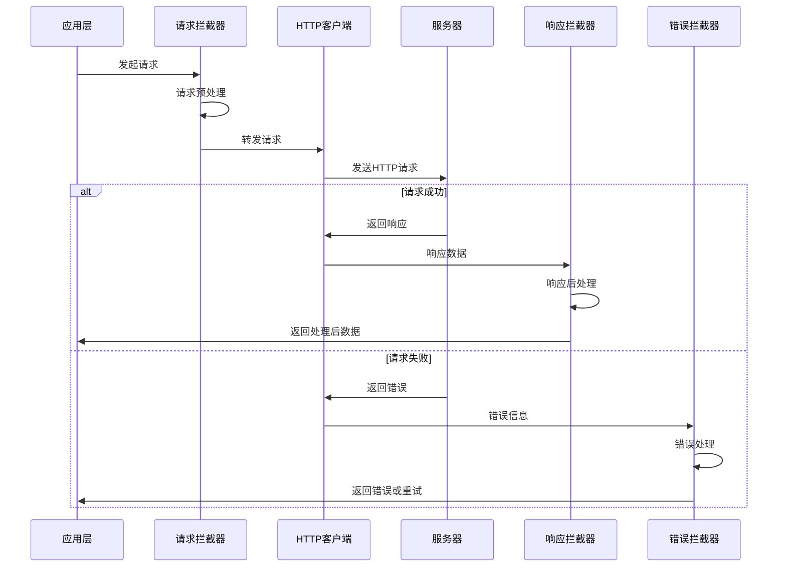

# 请求拦截器详解

> 掌握Dio拦截器的高级用法，实现请求预处理、响应后处理和错误统一处理

## 🔧 拦截器架构

### 拦截器执行流程



## 🔐 认证拦截器

### 1. JWT Token管理

```dart
class AuthInterceptor extends Interceptor {
  final TokenManager _tokenManager = GetIt.instance<TokenManager>();
  final AuthService _authService = GetIt.instance<AuthService>();
  
  @override
  void onRequest(
    RequestOptions options,
    RequestInterceptorHandler handler,
  ) async {
    // 获取访问令牌
    final accessToken = await _tokenManager.getAccessToken();
    
    if (accessToken != null && !_isAuthEndpoint(options.path)) {
      options.headers['Authorization'] = 'Bearer $accessToken';
    }
    
    // 添加请求ID用于追踪
    options.headers['X-Request-ID'] = _generateRequestId();
    
    // 添加设备信息
    options.headers.addAll(await _getDeviceHeaders());
    
    handler.next(options);
  }
  
  @override
  void onError(
    DioException err,
    ErrorInterceptorHandler handler,
  ) async {
    // 处理401未授权错误
    if (err.response?.statusCode == 401) {
      try {
        // 尝试刷新令牌
        final refreshed = await _refreshToken();
        if (refreshed) {
          // 重新发起原始请求
          final clonedRequest = await _cloneRequest(err.requestOptions);
          final response = await HttpClient.instance.fetch(clonedRequest);
          handler.resolve(response);
          return;
        }
      } catch (e) {
        // 刷新失败，跳转到登录页
        await _handleAuthFailure();
      }
    }
    
    handler.next(err);
  }
  
  bool _isAuthEndpoint(String path) {
    const authEndpoints = ['/auth/login', '/auth/register', '/auth/refresh'];
    return authEndpoints.any((endpoint) => path.contains(endpoint));
  }
  
  String _generateRequestId() {
    return '${DateTime.now().millisecondsSinceEpoch}_${Random().nextInt(9999)}';
  }
  
  Future<Map<String, String>> _getDeviceHeaders() async {
    final deviceInfo = await DeviceInfoPlugin().deviceInfo;
    return {
      'X-Device-Platform': Platform.operatingSystem,
      'X-Device-Version': Platform.operatingSystemVersion,
      'X-App-Version': await _getAppVersion(),
    };
  }
  
  Future<bool> _refreshToken() async {
    try {
      final refreshToken = await _tokenManager.getRefreshToken();
      if (refreshToken == null) return false;
      
      final response = await _authService.refreshToken(refreshToken);
      await _tokenManager.saveTokens(
        accessToken: response.accessToken,
        refreshToken: response.refreshToken,
      );
      
      return true;
    } catch (e) {
      return false;
    }
  }
  
  Future<RequestOptions> _cloneRequest(RequestOptions options) async {
    final accessToken = await _tokenManager.getAccessToken();
    return options.copyWith(
      headers: {
        ...options.headers,
        'Authorization': 'Bearer $accessToken',
      },
    );
  }
  
  Future<void> _handleAuthFailure() async {
    await _tokenManager.clearTokens();
    // 通知应用层跳转到登录页
    GetIt.instance<NavigationService>().navigateToLogin();
  }
}
```

### 2. Token管理器

```dart
class TokenManager {
  static const String _accessTokenKey = 'access_token';
  static const String _refreshTokenKey = 'refresh_token';
  static const String _tokenExpiryKey = 'token_expiry';
  
  final FlutterSecureStorage _secureStorage = const FlutterSecureStorage(
    aOptions: AndroidOptions(
      encryptedSharedPreferences: true,
    ),
    iOptions: IOSOptions(
      accessibility: IOSAccessibility.first_unlock_this_device,
    ),
  );
  
  Future<String?> getAccessToken() async {
    final token = await _secureStorage.read(key: _accessTokenKey);
    if (token == null) return null;
    
    // 检查令牌是否过期
    if (await _isTokenExpired()) {
      return null;
    }
    
    return token;
  }
  
  Future<String?> getRefreshToken() async {
    return await _secureStorage.read(key: _refreshTokenKey);
  }
  
  Future<void> saveTokens({
    required String accessToken,
    required String refreshToken,
    Duration? expiresIn,
  }) async {
    await Future.wait([
      _secureStorage.write(key: _accessTokenKey, value: accessToken),
      _secureStorage.write(key: _refreshTokenKey, value: refreshToken),
      if (expiresIn != null)
        _secureStorage.write(
          key: _tokenExpiryKey,
          value: DateTime.now().add(expiresIn).millisecondsSinceEpoch.toString(),
        ),
    ]);
  }
  
  Future<void> clearTokens() async {
    await Future.wait([
      _secureStorage.delete(key: _accessTokenKey),
      _secureStorage.delete(key: _refreshTokenKey),
      _secureStorage.delete(key: _tokenExpiryKey),
    ]);
  }
  
  Future<bool> _isTokenExpired() async {
    final expiryString = await _secureStorage.read(key: _tokenExpiryKey);
    if (expiryString == null) return false;
    
    final expiry = DateTime.fromMillisecondsSinceEpoch(int.parse(expiryString));
    return DateTime.now().isAfter(expiry.subtract(const Duration(minutes: 5)));
  }
}
```

## 🔄 重试拦截器

### 智能重试策略

```dart
class RetryInterceptor extends Interceptor {
  final int maxRetries;
  final Duration baseDelay;
  final List<int> retryStatusCodes;
  final List<DioExceptionType> retryExceptionTypes;
  
  RetryInterceptor({
    this.maxRetries = 3,
    this.baseDelay = const Duration(seconds: 1),
    this.retryStatusCodes = const [408, 429, 500, 502, 503, 504],
    this.retryExceptionTypes = const [
      DioExceptionType.connectionTimeout,
      DioExceptionType.sendTimeout,
      DioExceptionType.receiveTimeout,
      DioExceptionType.connectionError,
    ],
  });
  
  @override
  void onError(
    DioException err,
    ErrorInterceptorHandler handler,
  ) async {
    final shouldRetry = _shouldRetry(err);
    final retryCount = err.requestOptions.extra['retryCount'] as int? ?? 0;
    
    if (shouldRetry && retryCount < maxRetries) {
      // 计算延迟时间（指数退避）
      final delay = _calculateDelay(retryCount);
      await Future.delayed(delay);
      
      // 更新重试次数
      err.requestOptions.extra['retryCount'] = retryCount + 1;
      
      try {
        // 重新发起请求
        final response = await HttpClient.instance.fetch(err.requestOptions);
        handler.resolve(response);
        return;
      } catch (e) {
        // 重试失败，继续处理错误
      }
    }
    
    handler.next(err);
  }
  
  bool _shouldRetry(DioException err) {
    // 检查HTTP状态码
    if (err.response?.statusCode != null) {
      return retryStatusCodes.contains(err.response!.statusCode);
    }
    
    // 检查异常类型
    return retryExceptionTypes.contains(err.type);
  }
  
  Duration _calculateDelay(int retryCount) {
    // 指数退避算法：baseDelay * 2^retryCount + 随机抖动
    final exponentialDelay = baseDelay * math.pow(2, retryCount);
    final jitter = Duration(
      milliseconds: Random().nextInt(1000),
    );
    return exponentialDelay + jitter;
  }
}
```

## 📦 缓存拦截器

### HTTP缓存策略

```dart
class CacheInterceptor extends Interceptor {
  final CacheManager _cacheManager;
  final Duration defaultCacheDuration;
  
  CacheInterceptor({
    required CacheManager cacheManager,
    this.defaultCacheDuration = const Duration(minutes: 5),
  }) : _cacheManager = cacheManager;
  
  @override
  void onRequest(
    RequestOptions options,
    RequestInterceptorHandler handler,
  ) async {
    // 只缓存GET请求
    if (options.method.toUpperCase() != 'GET') {
      handler.next(options);
      return;
    }
    
    final cacheKey = _generateCacheKey(options);
    final cachePolicy = _getCachePolicy(options);
    
    switch (cachePolicy) {
      case CachePolicy.cacheFirst:
        final cachedResponse = await _getCachedResponse(cacheKey);
        if (cachedResponse != null) {
          handler.resolve(cachedResponse);
          return;
        }
        break;
        
      case CachePolicy.networkFirst:
        // 继续网络请求，在响应中处理缓存
        break;
        
      case CachePolicy.noCache:
        await _cacheManager.removeFile(cacheKey);
        break;
    }
    
    handler.next(options);
  }
  
  @override
  void onResponse(
    Response response,
    ResponseInterceptorHandler handler,
  ) async {
    final cachePolicy = _getCachePolicy(response.requestOptions);
    
    if (cachePolicy != CachePolicy.noCache && 
        response.requestOptions.method.toUpperCase() == 'GET') {
      await _cacheResponse(response);
    }
    
    handler.next(response);
  }
  
  String _generateCacheKey(RequestOptions options) {
    final uri = options.uri.toString();
    final headers = options.headers.entries
        .where((entry) => entry.key.startsWith('X-Cache-'))
        .map((entry) => '${entry.key}:${entry.value}')
        .join(',');
    
    return '${uri}_$headers'.hashCode.toString();
  }
  
  CachePolicy _getCachePolicy(RequestOptions options) {
    final policyHeader = options.headers['X-Cache-Policy'] as String?;
    return CachePolicy.values.firstWhere(
      (policy) => policy.name == policyHeader,
      orElse: () => CachePolicy.networkFirst,
    );
  }
  
  Future<Response?> _getCachedResponse(String cacheKey) async {
    try {
      final file = await _cacheManager.getFileFromCache(cacheKey);
      if (file?.file != null) {
        final content = await file!.file.readAsString();
        final data = jsonDecode(content);
        
        return Response(
          data: data['data'],
          statusCode: data['statusCode'],
          headers: Headers.fromMap(Map<String, List<String>>.from(data['headers'])),
          requestOptions: RequestOptions(path: ''),
        );
      }
    } catch (e) {
      debugPrint('Cache read error: $e');
    }
    return null;
  }
  
  Future<void> _cacheResponse(Response response) async {
    try {
      final cacheKey = _generateCacheKey(response.requestOptions);
      final cacheData = {
        'data': response.data,
        'statusCode': response.statusCode,
        'headers': response.headers.map,
        'timestamp': DateTime.now().millisecondsSinceEpoch,
      };
      
      final content = jsonEncode(cacheData);
      await _cacheManager.putFile(
        cacheKey,
        Uint8List.fromList(utf8.encode(content)),
        maxAge: defaultCacheDuration,
      );
    } catch (e) {
      debugPrint('Cache write error: $e');
    }
  }
}

enum CachePolicy {
  cacheFirst,
  networkFirst,
  noCache,
}
```

## 📊 性能监控拦截器

### 请求性能追踪

```dart
class PerformanceInterceptor extends Interceptor {
  final PerformanceTracker _tracker = GetIt.instance<PerformanceTracker>();
  
  @override
  void onRequest(
    RequestOptions options,
    RequestInterceptorHandler handler,
  ) {
    options.extra['startTime'] = DateTime.now();
    options.extra['requestId'] = _generateRequestId();
    
    _tracker.startRequest(
      requestId: options.extra['requestId'],
      url: options.uri.toString(),
      method: options.method,
    );
    
    handler.next(options);
  }
  
  @override
  void onResponse(
    Response response,
    ResponseInterceptorHandler handler,
  ) {
    final startTime = response.requestOptions.extra['startTime'] as DateTime?;
    final requestId = response.requestOptions.extra['requestId'] as String?;
    
    if (startTime != null && requestId != null) {
      final duration = DateTime.now().difference(startTime);
      
      _tracker.completeRequest(
        requestId: requestId,
        statusCode: response.statusCode ?? 0,
        duration: duration,
        responseSize: _calculateResponseSize(response),
      );
    }
    
    handler.next(response);
  }
  
  @override
  void onError(
    DioException err,
    ErrorInterceptorHandler handler,
  ) {
    final startTime = err.requestOptions.extra['startTime'] as DateTime?;
    final requestId = err.requestOptions.extra['requestId'] as String?;
    
    if (startTime != null && requestId != null) {
      final duration = DateTime.now().difference(startTime);
      
      _tracker.failRequest(
        requestId: requestId,
        error: err.toString(),
        duration: duration,
      );
    }
    
    handler.next(err);
  }
  
  String _generateRequestId() {
    return 'req_${DateTime.now().millisecondsSinceEpoch}_${Random().nextInt(9999)}';
  }
  
  int _calculateResponseSize(Response response) {
    if (response.data is String) {
      return utf8.encode(response.data).length;
    } else if (response.data is Map || response.data is List) {
      return utf8.encode(jsonEncode(response.data)).length;
    }
    return 0;
  }
}
```

## 🎯 最佳实践

### 拦截器配置建议

```dart
class InterceptorConfig {
  static List<Interceptor> getProductionInterceptors() {
    return [
      // 1. 认证拦截器（最高优先级）
      AuthInterceptor(),
      
      // 2. 缓存拦截器
      CacheInterceptor(
        cacheManager: DefaultCacheManager(),
        defaultCacheDuration: const Duration(minutes: 5),
      ),
      
      // 3. 重试拦截器
      RetryInterceptor(
        maxRetries: 3,
        baseDelay: const Duration(seconds: 1),
      ),
      
      // 4. 性能监控拦截器
      PerformanceInterceptor(),
      
      // 5. 错误处理拦截器（最低优先级）
      ErrorInterceptor(),
    ];
  }
  
  static List<Interceptor> getDevelopmentInterceptors() {
    return [
      ...getProductionInterceptors(),
      
      // 开发环境专用拦截器
      LogInterceptor(
        requestBody: true,
        responseBody: true,
        requestHeader: true,
        responseHeader: false,
        error: true,
        logPrint: (object) => debugPrint('[HTTP] $object'),
      ),
      
      // Mock拦截器（用于测试）
      if (kDebugMode) MockInterceptor(),
    ];
  }
}
```

### 性能优化要点

1. **拦截器顺序**：按重要性和依赖关系排序
2. **异步操作**：避免在拦截器中进行耗时操作
3. **错误处理**：确保拦截器不会抛出未捕获的异常
4. **内存管理**：及时清理缓存和临时数据
5. **条件执行**：根据请求类型和环境条件执行拦截器逻辑

### 调试技巧

```dart
class DebugInterceptor extends Interceptor {
  @override
  void onRequest(RequestOptions options, RequestInterceptorHandler handler) {
    debugPrint('🚀 Request: ${options.method} ${options.uri}');
    debugPrint('📤 Headers: ${options.headers}');
    if (options.data != null) {
      debugPrint('📦 Body: ${options.data}');
    }
    handler.next(options);
  }
  
  @override
  void onResponse(Response response, ResponseInterceptorHandler handler) {
    debugPrint('✅ Response: ${response.statusCode} ${response.requestOptions.uri}');
    debugPrint('📥 Data: ${response.data}');
    handler.next(response);
  }
  
  @override
  void onError(DioException err, ErrorInterceptorHandler handler) {
    debugPrint('❌ Error: ${err.message}');
    debugPrint('🔍 Request: ${err.requestOptions.uri}');
    if (err.response != null) {
      debugPrint('📄 Response: ${err.response?.data}');
    }
    handler.next(err);
  }
}
```