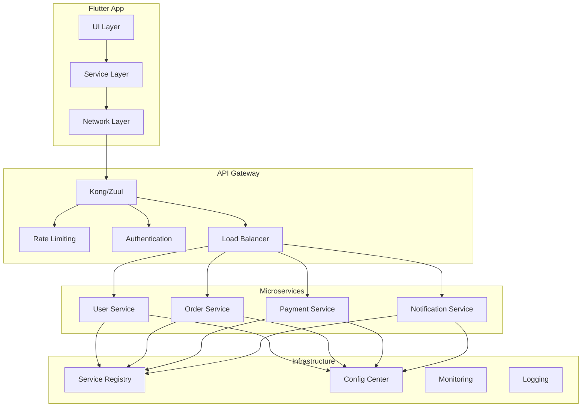

# Flutter 微服务架构与API网关集成

本文档详细介绍如何在 Flutter 应用中集成微服务架构，包括API网关、服务发现、负载均衡等企业级特性。

## 目录

1. [微服务架构概述](#1-微服务架构概述)
2. [API网关集成](#2-api网关集成)
3. [服务发现与注册](#3-服务发现与注册)
4. [负载均衡策略](#4-负载均衡策略)
5. [熔断器模式](#5-熔断器模式)
6. [分布式追踪](#6-分布式追踪)
7. [配置中心集成](#7-配置中心集成)

## 1. 微服务架构概述

### 1.1 架构设计



### 1.2 微服务客户端架构

```dart
abstract class MicroserviceClient {
  final String serviceName;
  final Dio dio;
  final ServiceDiscovery serviceDiscovery;
  final CircuitBreaker circuitBreaker;
  
  MicroserviceClient({
    required this.serviceName,
    required this.dio,
    required this.serviceDiscovery,
    required this.circuitBreaker,
  });
  
  Future<String> getServiceUrl() async {
    final instances = await serviceDiscovery.getInstances(serviceName);
    if (instances.isEmpty) {
      throw ServiceUnavailableException('No instances available for $serviceName');
    }
    
    // 负载均衡选择实例
    final selectedInstance = _selectInstance(instances);
    return selectedInstance.url;
  }
  
  ServiceInstance _selectInstance(List<ServiceInstance> instances) {
    // 轮询负载均衡
    final index = DateTime.now().millisecondsSinceEpoch % instances.length;
    return instances[index];
  }
  
  Future<T> executeRequest<T>(
    Future<T> Function(String baseUrl) request,
  ) async {
    return await circuitBreaker.execute(() async {
      final baseUrl = await getServiceUrl();
      return await request(baseUrl);
    });
  }
}

class UserServiceClient extends MicroserviceClient {
  UserServiceClient({
    required super.dio,
    required super.serviceDiscovery,
    required super.circuitBreaker,
  }) : super(serviceName: 'user-service');
  
  Future<User> getUser(int userId) async {
    return await executeRequest((baseUrl) async {
      final response = await dio.get('$baseUrl/users/$userId');
      return User.fromJson(response.data);
    });
  }
  
  Future<List<User>> getUsers({
    int page = 1,
    int limit = 20,
    String? search,
  }) async {
    return await executeRequest((baseUrl) async {
      final response = await dio.get(
        '$baseUrl/users',
        queryParameters: {
          'page': page,
          'limit': limit,
          if (search != null) 'search': search,
        },
      );
      
      final List<dynamic> data = response.data['data'];
      return data.map((json) => User.fromJson(json)).toList();
    });
  }
  
  Future<User> createUser(CreateUserRequest request) async {
    return await executeRequest((baseUrl) async {
      final response = await dio.post(
        '$baseUrl/users',
        data: request.toJson(),
      );
      return User.fromJson(response.data);
    });
  }
}
```

## 2. API网关集成

### 2.1 网关配置

```dart
class ApiGatewayConfig {
  final String gatewayUrl;
  final String apiKey;
  final String version;
  final Map<String, String> headers;
  
  const ApiGatewayConfig({
    required this.gatewayUrl,
    required this.apiKey,
    this.version = 'v1',
    this.headers = const {},
  });
}

class ApiGatewayClient {
  final ApiGatewayConfig config;
  final Dio dio;
  
  ApiGatewayClient({
    required this.config,
    required this.dio,
  }) {
    _setupInterceptors();
  }
  
  void _setupInterceptors() {
    dio.interceptors.addAll([
      // API网关认证拦截器
      InterceptorsWrapper(
        onRequest: (options, handler) {
          options.baseUrl = config.gatewayUrl;
          options.headers.addAll({
            'X-API-Key': config.apiKey,
            'X-API-Version': config.version,
            ...config.headers,
          });
          
          // 添加请求ID用于追踪
          options.headers['X-Request-ID'] = _generateRequestId();
          
          handler.next(options);
        },
      ),
      
      // 网关响应处理拦截器
      InterceptorsWrapper(
        onResponse: (response, handler) {
          // 处理网关级别的响应
          _handleGatewayResponse(response);
          handler.next(response);
        },
        onError: (error, handler) {
          // 处理网关级别的错误
          final gatewayError = _handleGatewayError(error);
          handler.next(gatewayError);
        },
      ),
    ]);
  }
  
  String _generateRequestId() {
    return '${DateTime.now().millisecondsSinceEpoch}-${Random().nextInt(10000)}';
  }
  
  void _handleGatewayResponse(Response response) {
    // 处理网关返回的元数据
    final gatewayHeaders = response.headers;
    
    if (gatewayHeaders['x-rate-limit-remaining'] != null) {
      final remaining = int.parse(gatewayHeaders['x-rate-limit-remaining']!.first);
      if (remaining < 10) {
        // 接近限流阈值，记录警告
        debugPrint('Warning: Rate limit remaining: $remaining');
      }
    }
    
    if (gatewayHeaders['x-response-time'] != null) {
      final responseTime = gatewayHeaders['x-response-time']!.first;
      debugPrint('Gateway response time: ${responseTime}ms');
    }
  }
  
  DioException _handleGatewayError(DioException error) {
    if (error.response?.statusCode == 429) {
      // 限流错误
      return DioException(
        requestOptions: error.requestOptions,
        response: error.response,
        type: DioExceptionType.unknown,
        error: 'Rate limit exceeded. Please try again later.',
      );
    }
    
    if (error.response?.statusCode == 502 || error.response?.statusCode == 503) {
      // 网关错误
      return DioException(
        requestOptions: error.requestOptions,
        response: error.response,
        type: DioExceptionType.unknown,
        error: 'Service temporarily unavailable. Please try again later.',
      );
    }
    
    return error;
  }
}
```

### 2.2 多环境网关配置

```dart
enum Environment { development, staging, production }

class EnvironmentConfig {
  static const Map<Environment, ApiGatewayConfig> configs = {
    Environment.development: ApiGatewayConfig(
      gatewayUrl: 'https://dev-api-gateway.example.com',
      apiKey: 'dev-api-key',
      version: 'v1',
      headers: {'X-Environment': 'development'},
    ),
    Environment.staging: ApiGatewayConfig(
      gatewayUrl: 'https://staging-api-gateway.example.com',
      apiKey: 'staging-api-key',
      version: 'v1',
      headers: {'X-Environment': 'staging'},
    ),
    Environment.production: ApiGatewayConfig(
      gatewayUrl: 'https://api-gateway.example.com',
      apiKey: 'prod-api-key',
      version: 'v1',
      headers: {'X-Environment': 'production'},
    ),
  };
  
  static ApiGatewayConfig getConfig(Environment env) {
    return configs[env]!;
  }
  
  static Environment getCurrentEnvironment() {
    // 根据构建配置或环境变量确定当前环境
    const envString = String.fromEnvironment('ENVIRONMENT', defaultValue: 'development');
    switch (envString) {
      case 'staging':
        return Environment.staging;
      case 'production':
        return Environment.production;
      default:
        return Environment.development;
    }
  }
}
```

## 3. 服务发现与注册

### 3.1 服务发现接口

```dart
abstract class ServiceDiscovery {
  Future<List<ServiceInstance>> getInstances(String serviceName);
  Future<void> registerInstance(ServiceInstance instance);
  Future<void> deregisterInstance(String instanceId);
  Stream<List<ServiceInstance>> watchService(String serviceName);
}

class ServiceInstance {
  final String id;
  final String serviceName;
  final String host;
  final int port;
  final String scheme;
  final Map<String, String> metadata;
  final bool healthy;
  
  const ServiceInstance({
    required this.id,
    required this.serviceName,
    required this.host,
    required this.port,
    this.scheme = 'https',
    this.metadata = const {},
    this.healthy = true,
  });
  
  String get url => '$scheme://$host:$port';
  
  factory ServiceInstance.fromJson(Map<String, dynamic> json) {
    return ServiceInstance(
      id: json['id'],
      serviceName: json['serviceName'],
      host: json['host'],
      port: json['port'],
      scheme: json['scheme'] ?? 'https',
      metadata: Map<String, String>.from(json['metadata'] ?? {}),
      healthy: json['healthy'] ?? true,
    );
  }
  
  Map<String, dynamic> toJson() {
    return {
      'id': id,
      'serviceName': serviceName,
      'host': host,
      'port': port,
      'scheme': scheme,
      'metadata': metadata,
      'healthy': healthy,
    };
  }
}
```

### 3.2 Consul服务发现实现

```dart
class ConsulServiceDiscovery implements ServiceDiscovery {
  final Dio dio;
  final String consulUrl;
  final Map<String, List<ServiceInstance>> _cache = {};
  final Map<String, Timer> _cacheTimers = {};
  
  ConsulServiceDiscovery({
    required this.dio,
    required this.consulUrl,
  });
  
  @override
  Future<List<ServiceInstance>> getInstances(String serviceName) async {
    // 先检查缓存
    if (_cache.containsKey(serviceName)) {
      return _cache[serviceName]!;
    }
    
    try {
      final response = await dio.get(
        '$consulUrl/v1/health/service/$serviceName',
        queryParameters: {'passing': true}, // 只获取健康的实例
      );
      
      final List<dynamic> data = response.data;
      final instances = data.map((json) {
        final service = json['Service'];
        return ServiceInstance(
          id: service['ID'],
          serviceName: service['Service'],
          host: service['Address'],
          port: service['Port'],
          metadata: Map<String, String>.from(service['Meta'] ?? {}),
          healthy: true,
        );
      }).toList();
      
      // 缓存结果
      _cacheInstances(serviceName, instances);
      
      return instances;
    } catch (e) {
      debugPrint('Failed to get instances for $serviceName: $e');
      return _cache[serviceName] ?? [];
    }
  }
  
  void _cacheInstances(String serviceName, List<ServiceInstance> instances) {
    _cache[serviceName] = instances;
    
    // 设置缓存过期时间
    _cacheTimers[serviceName]?.cancel();
    _cacheTimers[serviceName] = Timer(const Duration(seconds: 30), () {
      _cache.remove(serviceName);
      _cacheTimers.remove(serviceName);
    });
  }
  
  @override
  Future<void> registerInstance(ServiceInstance instance) async {
    final registration = {
      'ID': instance.id,
      'Name': instance.serviceName,
      'Address': instance.host,
      'Port': instance.port,
      'Meta': instance.metadata,
      'Check': {
        'HTTP': '${instance.url}/health',
        'Interval': '10s',
        'Timeout': '3s',
      },
    };
    
    await dio.put(
      '$consulUrl/v1/agent/service/register',
      data: registration,
    );
  }
  
  @override
  Future<void> deregisterInstance(String instanceId) async {
    await dio.put('$consulUrl/v1/agent/service/deregister/$instanceId');
  }
  
  @override
  Stream<List<ServiceInstance>> watchService(String serviceName) async* {
    while (true) {
      try {
        final instances = await getInstances(serviceName);
        yield instances;
        await Future.delayed(const Duration(seconds: 10));
      } catch (e) {
        debugPrint('Error watching service $serviceName: $e');
        await Future.delayed(const Duration(seconds: 5));
      }
    }
  }
}
```

## 4. 负载均衡策略

### 4.1 负载均衡器接口

```dart
abstract class LoadBalancer {
  ServiceInstance selectInstance(List<ServiceInstance> instances);
}

class RoundRobinLoadBalancer implements LoadBalancer {
  final Map<String, int> _counters = {};
  
  @override
  ServiceInstance selectInstance(List<ServiceInstance> instances) {
    if (instances.isEmpty) {
      throw Exception('No instances available');
    }
    
    final serviceName = instances.first.serviceName;
    final counter = _counters[serviceName] ?? 0;
    final selectedIndex = counter % instances.length;
    
    _counters[serviceName] = counter + 1;
    
    return instances[selectedIndex];
  }
}

class WeightedRoundRobinLoadBalancer implements LoadBalancer {
  final Map<String, int> _currentWeights = {};
  
  @override
  ServiceInstance selectInstance(List<ServiceInstance> instances) {
    if (instances.isEmpty) {
      throw Exception('No instances available');
    }
    
    // 获取权重，默认为1
    final weights = instances.map((instance) {
      final weightStr = instance.metadata['weight'] ?? '1';
      return int.tryParse(weightStr) ?? 1;
    }).toList();
    
    final serviceName = instances.first.serviceName;
    final key = '$serviceName-${instances.map((i) => i.id).join('-')}';
    
    if (!_currentWeights.containsKey(key)) {
      _currentWeights[key] = 0;
    }
    
    int totalWeight = weights.reduce((a, b) => a + b);
    int currentWeight = _currentWeights[key]!;
    
    for (int i = 0; i < instances.length; i++) {
      currentWeight += weights[i];
      if (currentWeight >= totalWeight) {
        _currentWeights[key] = currentWeight - totalWeight;
        return instances[i];
      }
    }
    
    _currentWeights[key] = currentWeight;
    return instances.first;
  }
}

class RandomLoadBalancer implements LoadBalancer {
  final Random _random = Random();
  
  @override
  ServiceInstance selectInstance(List<ServiceInstance> instances) {
    if (instances.isEmpty) {
      throw Exception('No instances available');
    }
    
    final index = _random.nextInt(instances.length);
    return instances[index];
  }
}

class LeastConnectionsLoadBalancer implements LoadBalancer {
  final Map<String, int> _connections = {};
  
  @override
  ServiceInstance selectInstance(List<ServiceInstance> instances) {
    if (instances.isEmpty) {
      throw Exception('No instances available');
    }
    
    ServiceInstance? selected;
    int minConnections = double.maxFinite.toInt();
    
    for (final instance in instances) {
      final connections = _connections[instance.id] ?? 0;
      if (connections < minConnections) {
        minConnections = connections;
        selected = instance;
      }
    }
    
    if (selected != null) {
      _connections[selected.id] = (_connections[selected.id] ?? 0) + 1;
    }
    
    return selected ?? instances.first;
  }
  
  void releaseConnection(String instanceId) {
    if (_connections.containsKey(instanceId)) {
      _connections[instanceId] = math.max(0, _connections[instanceId]! - 1);
    }
  }
}
```

## 5. 熔断器模式

### 5.1 熔断器实现

```dart
enum CircuitBreakerState { closed, open, halfOpen }

class CircuitBreakerConfig {
  final int failureThreshold;
  final Duration timeout;
  final int successThreshold;
  final Duration monitoringPeriod;
  
  const CircuitBreakerConfig({
    this.failureThreshold = 5,
    this.timeout = const Duration(seconds: 60),
    this.successThreshold = 3,
    this.monitoringPeriod = const Duration(seconds: 10),
  });
}

class CircuitBreaker {
  final String name;
  final CircuitBreakerConfig config;
  
  CircuitBreakerState _state = CircuitBreakerState.closed;
  int _failureCount = 0;
  int _successCount = 0;
  DateTime? _lastFailureTime;
  Timer? _monitoringTimer;
  
  final StreamController<CircuitBreakerState> _stateController = 
      StreamController<CircuitBreakerState>.broadcast();
  
  CircuitBreaker({
    required this.name,
    required this.config,
  }) {
    _startMonitoring();
  }
  
  Stream<CircuitBreakerState> get stateStream => _stateController.stream;
  CircuitBreakerState get state => _state;
  
  Future<T> execute<T>(Future<T> Function() operation) async {
    if (_state == CircuitBreakerState.open) {
      if (_shouldAttemptReset()) {
        _setState(CircuitBreakerState.halfOpen);
      } else {
        throw CircuitBreakerOpenException(
          'Circuit breaker $name is open. Last failure: $_lastFailureTime',
        );
      }
    }
    
    try {
      final result = await operation();
      _onSuccess();
      return result;
    } catch (e) {
      _onFailure();
      rethrow;
    }
  }
  
  bool _shouldAttemptReset() {
    if (_lastFailureTime == null) return false;
    return DateTime.now().difference(_lastFailureTime!) > config.timeout;
  }
  
  void _onSuccess() {
    _failureCount = 0;
    
    if (_state == CircuitBreakerState.halfOpen) {
      _successCount++;
      if (_successCount >= config.successThreshold) {
        _setState(CircuitBreakerState.closed);
        _successCount = 0;
      }
    }
  }
  
  void _onFailure() {
    _failureCount++;
    _lastFailureTime = DateTime.now();
    
    if (_state == CircuitBreakerState.halfOpen) {
      _setState(CircuitBreakerState.open);
      _successCount = 0;
    } else if (_state == CircuitBreakerState.closed &&
               _failureCount >= config.failureThreshold) {
      _setState(CircuitBreakerState.open);
    }
  }
  
  void _setState(CircuitBreakerState newState) {
    if (_state != newState) {
      debugPrint('Circuit breaker $name state changed: $_state -> $newState');
      _state = newState;
      _stateController.add(_state);
    }
  }
  
  void _startMonitoring() {
    _monitoringTimer = Timer.periodic(config.monitoringPeriod, (timer) {
      debugPrint('Circuit breaker $name status: '
          'State: $_state, Failures: $_failureCount, Successes: $_successCount');
    });
  }
  
  void dispose() {
    _monitoringTimer?.cancel();
    _stateController.close();
  }
}

class CircuitBreakerOpenException implements Exception {
  final String message;
  CircuitBreakerOpenException(this.message);
  
  @override
  String toString() => 'CircuitBreakerOpenException: $message';
}
```

## 6. 分布式追踪

### 6.1 追踪实现

```dart
class TraceContext {
  final String traceId;
  final String spanId;
  final String? parentSpanId;
  final Map<String, String> baggage;
  
  TraceContext({
    required this.traceId,
    required this.spanId,
    this.parentSpanId,
    this.baggage = const {},
  });
  
  factory TraceContext.generate() {
    return TraceContext(
      traceId: _generateId(),
      spanId: _generateId(),
    );
  }
  
  TraceContext createChildSpan() {
    return TraceContext(
      traceId: traceId,
      spanId: _generateId(),
      parentSpanId: spanId,
      baggage: baggage,
    );
  }
  
  static String _generateId() {
    return '${DateTime.now().millisecondsSinceEpoch}-${Random().nextInt(100000)}';
  }
  
  Map<String, String> toHeaders() {
    return {
      'X-Trace-ID': traceId,
      'X-Span-ID': spanId,
      if (parentSpanId != null) 'X-Parent-Span-ID': parentSpanId!,
      ...baggage.map((key, value) => MapEntry('X-Baggage-$key', value)),
    };
  }
}

class TracingInterceptor extends Interceptor {
  final String serviceName;
  
  TracingInterceptor({required this.serviceName});
  
  @override
  void onRequest(RequestOptions options, RequestInterceptorHandler handler) {
    // 获取或创建追踪上下文
    final traceContext = _getCurrentTraceContext() ?? TraceContext.generate();
    
    // 添加追踪头
    options.headers.addAll(traceContext.toHeaders());
    
    // 记录请求开始
    _recordSpanStart(traceContext, options);
    
    // 将追踪上下文存储到请求选项中
    options.extra['traceContext'] = traceContext;
    
    handler.next(options);
  }
  
  @override
  void onResponse(Response response, ResponseInterceptorHandler handler) {
    final traceContext = response.requestOptions.extra['traceContext'] as TraceContext?;
    if (traceContext != null) {
      _recordSpanEnd(traceContext, response);
    }
    
    handler.next(response);
  }
  
  @override
  void onError(DioException err, ErrorInterceptorHandler handler) {
    final traceContext = err.requestOptions.extra['traceContext'] as TraceContext?;
    if (traceContext != null) {
      _recordSpanError(traceContext, err);
    }
    
    handler.next(err);
  }
  
  TraceContext? _getCurrentTraceContext() {
    // 从当前上下文获取追踪信息
    // 这里可以从Zone、Provider或其他状态管理中获取
    return null;
  }
  
  void _recordSpanStart(TraceContext context, RequestOptions options) {
    debugPrint('Span started: ${context.spanId} - ${options.method} ${options.uri}');
    
    // 这里可以发送到追踪系统（如Jaeger、Zipkin）
    _sendToTracingSystem({
      'traceId': context.traceId,
      'spanId': context.spanId,
      'parentSpanId': context.parentSpanId,
      'operationName': '${options.method} ${options.path}',
      'startTime': DateTime.now().millisecondsSinceEpoch,
      'tags': {
        'http.method': options.method,
        'http.url': options.uri.toString(),
        'service.name': serviceName,
      },
    });
  }
  
  void _recordSpanEnd(TraceContext context, Response response) {
    debugPrint('Span ended: ${context.spanId} - Status: ${response.statusCode}');
    
    _sendToTracingSystem({
      'traceId': context.traceId,
      'spanId': context.spanId,
      'endTime': DateTime.now().millisecondsSinceEpoch,
      'tags': {
        'http.status_code': response.statusCode,
      },
    });
  }
  
  void _recordSpanError(TraceContext context, DioException error) {
    debugPrint('Span error: ${context.spanId} - Error: ${error.message}');
    
    _sendToTracingSystem({
      'traceId': context.traceId,
      'spanId': context.spanId,
      'endTime': DateTime.now().millisecondsSinceEpoch,
      'tags': {
        'error': true,
        'error.message': error.message,
        'error.type': error.type.toString(),
      },
    });
  }
  
  void _sendToTracingSystem(Map<String, dynamic> spanData) {
    // 发送到追踪系统的实现
    // 可以批量发送以提高性能
  }
}
```

## 7. 配置中心集成

### 7.1 配置管理

```dart
abstract class ConfigCenter {
  Future<String?> getString(String key);
  Future<int?> getInt(String key);
  Future<bool?> getBool(String key);
  Future<Map<String, dynamic>?> getConfig(String namespace);
  Stream<Map<String, dynamic>> watchConfig(String namespace);
}

class ApolloConfigCenter implements ConfigCenter {
  final String apolloUrl;
  final String appId;
  final String cluster;
  final String namespace;
  final Dio dio;
  
  final Map<String, dynamic> _cache = {};
  Timer? _refreshTimer;
  
  ApolloConfigCenter({
    required this.apolloUrl,
    required this.appId,
    required this.cluster,
    required this.namespace,
    required this.dio,
  }) {
    _startPeriodicRefresh();
  }
  
  @override
  Future<String?> getString(String key) async {
    final config = await _getConfigFromCache();
    return config[key]?.toString();
  }
  
  @override
  Future<int?> getInt(String key) async {
    final value = await getString(key);
    return value != null ? int.tryParse(value) : null;
  }
  
  @override
  Future<bool?> getBool(String key) async {
    final value = await getString(key);
    if (value == null) return null;
    return value.toLowerCase() == 'true';
  }
  
  @override
  Future<Map<String, dynamic>?> getConfig(String namespace) async {
    try {
      final response = await dio.get(
        '$apolloUrl/configs/$appId/$cluster/$namespace',
      );
      
      final config = Map<String, dynamic>.from(response.data['configurations']);
      _cache[namespace] = config;
      
      return config;
    } catch (e) {
      debugPrint('Failed to get config from Apollo: $e');
      return _cache[namespace] as Map<String, dynamic>?;
    }
  }
  
  @override
  Stream<Map<String, dynamic>> watchConfig(String namespace) async* {
    while (true) {
      try {
        final config = await getConfig(namespace);
        if (config != null) {
          yield config;
        }
        await Future.delayed(const Duration(seconds: 30));
      } catch (e) {
        debugPrint('Error watching config: $e');
        await Future.delayed(const Duration(seconds: 10));
      }
    }
  }
  
  Future<Map<String, dynamic>> _getConfigFromCache() async {
    if (_cache.containsKey(namespace)) {
      return _cache[namespace] as Map<String, dynamic>;
    }
    
    final config = await getConfig(namespace);
    return config ?? {};
  }
  
  void _startPeriodicRefresh() {
    _refreshTimer = Timer.periodic(const Duration(minutes: 5), (timer) {
      getConfig(namespace);
    });
  }
  
  void dispose() {
    _refreshTimer?.cancel();
  }
}

class ConfigManager {
  final ConfigCenter configCenter;
  final Map<String, dynamic> _localConfig = {};
  
  ConfigManager({required this.configCenter});
  
  Future<void> initialize() async {
    // 加载本地配置
    _loadLocalConfig();
    
    // 从配置中心获取配置
    try {
      final remoteConfig = await configCenter.getConfig('application');
      if (remoteConfig != null) {
        _localConfig.addAll(remoteConfig);
      }
    } catch (e) {
      debugPrint('Failed to load remote config: $e');
    }
  }
  
  T? get<T>(String key, {T? defaultValue}) {
    final value = _localConfig[key];
    if (value is T) {
      return value;
    }
    return defaultValue;
  }
  
  String getString(String key, {String defaultValue = ''}) {
    return get<String>(key, defaultValue: defaultValue) ?? defaultValue;
  }
  
  int getInt(String key, {int defaultValue = 0}) {
    final value = _localConfig[key];
    if (value is int) return value;
    if (value is String) return int.tryParse(value) ?? defaultValue;
    return defaultValue;
  }
  
  bool getBool(String key, {bool defaultValue = false}) {
    final value = _localConfig[key];
    if (value is bool) return value;
    if (value is String) return value.toLowerCase() == 'true';
    return defaultValue;
  }
  
  void _loadLocalConfig() {
    // 从本地文件或SharedPreferences加载配置
    _localConfig.addAll({
      'api.timeout': 30000,
      'api.retryCount': 3,
      'cache.enabled': true,
      'logging.level': 'info',
    });
  }
}
```

## 📚 总结

### 核心特性
- **微服务架构**: 服务拆分、独立部署、技术栈多样化
- **API网关**: 统一入口、认证授权、限流熔断
- **服务发现**: 动态注册、健康检查、负载均衡
- **熔断器**: 故障隔离、快速失败、自动恢复
- **分布式追踪**: 请求链路、性能监控、问题定位
- **配置中心**: 集中管理、动态更新、环境隔离

### 最佳实践
- **服务拆分**: 按业务领域拆分，避免过度拆分
- **容错设计**: 超时、重试、熔断、降级
- **监控告警**: 全链路监控、实时告警、性能分析
- **安全防护**: 认证授权、数据加密、访问控制

### 推荐工具
- **API网关**: Kong、Zuul、Spring Cloud Gateway
- **服务注册**: Consul、Eureka、Nacos
- **配置中心**: Apollo、Nacos、Spring Cloud Config
- **链路追踪**: Jaeger、Zipkin、SkyWalking