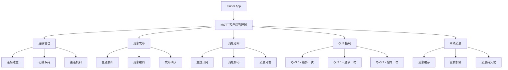

# Flutter MQTT 通信实现

## 概述

本文档详细介绍了 Flutter 中 MQTT 通信的实现方案，包括连接管理、消息发布订阅、QoS 控制、离线消息处理和实际应用案例。

## MQTT 通信架构



## 依赖配置

### pubspec.yaml

```yaml
dependencies:
  flutter:
    sdk: flutter

  # MQTT 通信
  mqtt_client: ^10.0.0

  # 数据处理
  convert: ^3.1.1
  crypto: ^3.0.3
  uuid: ^4.1.0

  # 状态管理
  provider: ^6.1.1
  rxdart: ^0.27.7

  # 本地存储
  shared_preferences: ^2.2.2
  sqflite: ^2.3.0

  # 网络检测
  connectivity_plus: ^5.0.1

dev_dependencies:
  flutter_test:
    sdk: flutter
  mockito: ^5.4.2
  build_runner: ^2.4.7
```

## MQTT 客户端管理器

### 核心实现

```dart
import 'package:flutter/foundation.dart';
import 'package:mqtt_client/mqtt_client.dart';
import 'package:mqtt_client/mqtt_server_client.dart';
import 'package:rxdart/rxdart.dart';
import 'package:uuid/uuid.dart';
import 'dart:convert';
import 'dart:async';

/// MQTT 连接状态
enum MqttConnectionState {
  disconnected,
  connecting,
  connected,
  disconnecting,
  error,
}

/// MQTT 消息
class MqttMessage {
  final String topic;
  final String payload;
  final MqttQos qos;
  final bool retain;
  final DateTime timestamp;
  final String messageId;

  const MqttMessage({
    required this.topic,
    required this.payload,
    required this.qos,
    required this.retain,
    required this.timestamp,
    required this.messageId,
  });

  Map<String, dynamic> toJson() {
    return {
      'topic': topic,
      'payload': payload,
      'qos': qos.index,
      'retain': retain,
      'timestamp': timestamp.millisecondsSinceEpoch,
      'messageId': messageId,
    };
  }

  factory MqttMessage.fromJson(Map<String, dynamic> json) {
    return MqttMessage(
      topic: json['topic'],
      payload: json['payload'],
      qos: MqttQos.values[json['qos']],
      retain: json['retain'],
      timestamp: DateTime.fromMillisecondsSinceEpoch(json['timestamp']),
      messageId: json['messageId'],
    );
  }
}

/// MQTT 订阅信息
class MqttSubscription {
  final String topic;
  final MqttQos qos;
  final StreamController<MqttMessage> controller;
  final DateTime subscribedAt;

  MqttSubscription({
    required this.topic,
    required this.qos,
    required this.controller,
    required this.subscribedAt,
  });

  Stream<MqttMessage> get stream => controller.stream;

  void dispose() {
    controller.close();
  }
}

/// MQTT 客户端管理器
class MqttClientManager {
  static final MqttClientManager _instance = MqttClientManager._internal();
  factory MqttClientManager() => _instance;
  MqttClientManager._internal();

  // MQTT 客户端
  MqttServerClient? _client;

  // 状态流
  final _connectionState = BehaviorSubject<MqttConnectionState>.seeded(MqttConnectionState.disconnected);
  final _messageStream = StreamController<MqttMessage>.broadcast();

  // 订阅管理
  final Map<String, MqttSubscription> _subscriptions = {};

  // 离线消息缓存
  final List<MqttMessage> _offlineMessages = [];

  // 配置参数
  String? _serverHost;
  int? _serverPort;
  String? _clientId;
  String? _username;
  String? _password;
  bool _useSSL = false;
  Duration _keepAlivePeriod = const Duration(seconds: 60);
  Duration _connectionTimeout = const Duration(seconds: 30);

  // Getters
  Stream<MqttConnectionState> get connectionState => _connectionState.stream;
  Stream<MqttMessage> get messageStream => _messageStream.stream;
  MqttConnectionState get currentState => _connectionState.value;
  bool get isConnected => currentState == MqttConnectionState.connected;

  /// 配置 MQTT 客户端
  void configure({
    required String serverHost,
    required int serverPort,
    String? clientId,
    String? username,
    String? password,
    bool useSSL = false,
    Duration keepAlivePeriod = const Duration(seconds: 60),
    Duration connectionTimeout = const Duration(seconds: 30),
  }) {
    _serverHost = serverHost;
    _serverPort = serverPort;
    _clientId = clientId ?? const Uuid().v4();
    _username = username;
    _password = password;
    _useSSL = useSSL;
    _keepAlivePeriod = keepAlivePeriod;
    _connectionTimeout = connectionTimeout;

    debugPrint('MQTT 客户端配置完成: $_serverHost:$_serverPort');
  }

  /// 连接到 MQTT 服务器
  Future<void> connect() async {
    try {
      if (_serverHost == null || _serverPort == null) {
        throw Exception('MQTT 客户端未配置');
      }

      if (isConnected) {
        debugPrint('MQTT 客户端已连接');
        return;
      }

      _connectionState.add(MqttConnectionState.connecting);

      // 创建客户端
      _client = MqttServerClient.withPort(_serverHost!, _clientId!, _serverPort!);

      // 配置客户端
      _client!.logging(on: kDebugMode);
      _client!.setProtocolV311();
      _client!.keepAlivePeriod = _keepAlivePeriod.inSeconds;
      _client!.connectTimeoutPeriod = _connectionTimeout.inMilliseconds;
      _client!.autoReconnect = true;
      _client!.resubscribeOnAutoReconnect = true;

      // SSL 配置
      if (_useSSL) {
        _client!.secure = true;
      }

      // 设置回调
      _client!.onConnected = _onConnected;
      _client!.onDisconnected = _onDisconnected;
      _client!.onSubscribed = _onSubscribed;
      _client!.onUnsubscribed = _onUnsubscribed;
      _client!.onAutoReconnect = _onAutoReconnect;
      _client!.onAutoReconnected = _onAutoReconnected;

      // 连接消息
      final connMessage = MqttConnectMessage()
          .withClientIdentifier(_clientId!)
          .withWillTopic('clients/$_clientId/status')
          .withWillMessage('offline')
          .withWillQos(MqttQos.atLeastOnce)
          .withWillRetain()
          .startClean();

      if (_username != null && _password != null) {
        connMessage.authenticateAs(_username!, _password!);
      }

      _client!.connectionMessage = connMessage;

      // 执行连接
      await _client!.connect();

      if (_client!.connectionStatus!.state == MqttConnectionState.connected) {
        _connectionState.add(MqttConnectionState.connected);

        // 设置消息监听
        _client!.updates!.listen(_onMessageReceived);

        // 发布上线状态
        await publishMessage(
          'clients/$_clientId/status',
          'online',
          qos: MqttQos.atLeastOnce,
          retain: true,
        );

        // 处理离线消息
        await _processOfflineMessages();

        debugPrint('MQTT 连接成功');
      } else {
        throw Exception('MQTT 连接失败: ${_client!.connectionStatus}');
      }
    } catch (e) {
      _connectionState.add(MqttConnectionState.error);
      debugPrint('MQTT 连接失败: $e');
      rethrow;
    }
  }

  /// 断开连接
  Future<void> disconnect() async {
    try {
      if (!isConnected) {
        debugPrint('MQTT 客户端未连接');
        return;
      }

      _connectionState.add(MqttConnectionState.disconnecting);

      // 发布离线状态
      await publishMessage(
        'clients/$_clientId/status',
        'offline',
        qos: MqttQos.atLeastOnce,
        retain: true,
      );

      // 断开连接
      _client?.disconnect();

      _connectionState.add(MqttConnectionState.disconnected);
      debugPrint('MQTT 断开连接');
    } catch (e) {
      debugPrint('MQTT 断开连接失败: $e');
      rethrow;
    }
  }

  /// 发布消息
  Future<void> publishMessage(
    String topic,
    String payload, {
    MqttQos qos = MqttQos.atMostOnce,
    bool retain = false,
  }) async {
    try {
      final message = MqttMessage(
        topic: topic,
        payload: payload,
        qos: qos,
        retain: retain,
        timestamp: DateTime.now(),
        messageId: const Uuid().v4(),
      );

      if (!isConnected) {
        // 缓存离线消息
        _offlineMessages.add(message);
        debugPrint('MQTT 离线，消息已缓存: $topic');
        return;
      }

      final builder = MqttClientPayloadBuilder();
      builder.addString(payload);

      _client!.publishMessage(topic, qos, builder.payload!, retain: retain);

      debugPrint('MQTT 消息发布成功: $topic');
    } catch (e) {
      debugPrint('MQTT 消息发布失败: $e');
      rethrow;
    }
  }

  /// 发布 JSON 消息
  Future<void> publishJson(
    String topic,
    Map<String, dynamic> data, {
    MqttQos qos = MqttQos.atMostOnce,
    bool retain = false,
  }) async {
    final payload = jsonEncode(data);
    await publishMessage(topic, payload, qos: qos, retain: retain);
  }

  /// 订阅主题
  Stream<MqttMessage> subscribe(
    String topic, {
    MqttQos qos = MqttQos.atMostOnce,
  }) {
    try {
      // 检查是否已订阅
      if (_subscriptions.containsKey(topic)) {
        debugPrint('主题已订阅: $topic');
        return _subscriptions[topic]!.stream;
      }

      // 创建订阅
      final controller = StreamController<MqttMessage>.broadcast();
      final subscription = MqttSubscription(
        topic: topic,
        qos: qos,
        controller: controller,
        subscribedAt: DateTime.now(),
      );

      _subscriptions[topic] = subscription;

      if (isConnected) {
        _client!.subscribe(topic, qos);
        debugPrint('MQTT 订阅成功: $topic');
      } else {
        debugPrint('MQTT 未连接，订阅将在连接后执行: $topic');
      }

      return subscription.stream;
    } catch (e) {
      debugPrint('MQTT 订阅失败: $e');
      rethrow;
    }
  }

  /// 取消订阅
  Future<void> unsubscribe(String topic) async {
    try {
      if (!_subscriptions.containsKey(topic)) {
        debugPrint('主题未订阅: $topic');
        return;
      }

      if (isConnected) {
        _client!.unsubscribe(topic);
      }

      _subscriptions[topic]?.dispose();
      _subscriptions.remove(topic);

      debugPrint('MQTT 取消订阅: $topic');
    } catch (e) {
      debugPrint('MQTT 取消订阅失败: $e');
      rethrow;
    }
  }

  /// 订阅 JSON 消息
  Stream<Map<String, dynamic>> subscribeJson(String topic, {MqttQos qos = MqttQos.atMostOnce}) {
    return subscribe(topic, qos: qos)
        .map((message) {
          try {
            return jsonDecode(message.payload) as Map<String, dynamic>;
          } catch (e) {
            debugPrint('JSON 解析失败: $e');
            return <String, dynamic>{};
          }
        })
        .where((data) => data.isNotEmpty);
  }

  /// 处理离线消息
  Future<void> _processOfflineMessages() async {
    if (_offlineMessages.isEmpty) return;

    debugPrint('处理 ${_offlineMessages.length} 条离线消息');

    for (final message in List.from(_offlineMessages)) {
      try {
        await publishMessage(
          message.topic,
          message.payload,
          qos: message.qos,
          retain: message.retain,
        );
        _offlineMessages.remove(message);
      } catch (e) {
        debugPrint('离线消息发送失败: $e');
        break; // 停止处理剩余消息
      }
    }
  }

  /// 重新订阅所有主题
  Future<void> _resubscribeAll() async {
    for (final subscription in _subscriptions.values) {
      try {
        _client!.subscribe(subscription.topic, subscription.qos);
        debugPrint('重新订阅: ${subscription.topic}');
      } catch (e) {
        debugPrint('重新订阅失败: $e');
      }
    }
  }

  // 回调函数
  void _onConnected() {
    debugPrint('MQTT 连接回调');
    _connectionState.add(MqttConnectionState.connected);
  }

  void _onDisconnected() {
    debugPrint('MQTT 断开回调');
    _connectionState.add(MqttConnectionState.disconnected);
  }

  void _onSubscribed(String topic) {
    debugPrint('MQTT 订阅回调: $topic');
  }

  void _onUnsubscribed(String? topic) {
    debugPrint('MQTT 取消订阅回调: $topic');
  }

  void _onAutoReconnect() {
    debugPrint('MQTT 自动重连中...');
    _connectionState.add(MqttConnectionState.connecting);
  }

  void _onAutoReconnected() {
    debugPrint('MQTT 自动重连成功');
    _connectionState.add(MqttConnectionState.connected);
    _resubscribeAll();
  }

  void _onMessageReceived(List<MqttReceivedMessage<MqttMessage>> messages) {
    for (final receivedMessage in messages) {
      final topic = receivedMessage.topic;
      final mqttMessage = receivedMessage.payload as MqttPublishMessage;
      final payload = MqttPublishPayload.bytesToStringAsString(mqttMessage.payload.message);

      final message = MqttMessage(
        topic: topic,
        payload: payload,
        qos: mqttMessage.header!.qos,
        retain: mqttMessage.header!.retain,
        timestamp: DateTime.now(),
        messageId: const Uuid().v4(),
      );

      // 分发到全局流
      _messageStream.add(message);

      // 分发到特定主题订阅
      for (final subscription in _subscriptions.values) {
        if (_isTopicMatch(subscription.topic, topic)) {
          subscription.controller.add(message);
        }
      }

      debugPrint('MQTT 消息接收: $topic');
    }
  }

  /// 主题匹配检查（支持通配符）
  bool _isTopicMatch(String subscriptionTopic, String messageTopic) {
    // 简单的通配符匹配实现
    if (subscriptionTopic == messageTopic) return true;

    // 支持 + 和 # 通配符
    final subscriptionParts = subscriptionTopic.split('/');
    final messageParts = messageTopic.split('/');

    int i = 0;
    for (i = 0; i < subscriptionParts.length && i < messageParts.length; i++) {
      final subPart = subscriptionParts[i];
      final msgPart = messageParts[i];

      if (subPart == '#') {
        return true; // # 匹配剩余所有层级
      } else if (subPart == '+') {
        continue; // + 匹配单个层级
      } else if (subPart != msgPart) {
        return false;
      }
    }

    // 检查长度匹配
    return i == subscriptionParts.length && i == messageParts.length;
  }

  /// 获取连接统计信息
  Map<String, dynamic> getConnectionStats() {
    return {
      'state': currentState.name,
      'clientId': _clientId,
      'serverHost': _serverHost,
      'serverPort': _serverPort,
      'subscriptions': _subscriptions.length,
      'offlineMessages': _offlineMessages.length,
      'useSSL': _useSSL,
      'keepAlivePeriod': _keepAlivePeriod.inSeconds,
    };
  }

  /// 清理离线消息
  void clearOfflineMessages() {
    _offlineMessages.clear();
    debugPrint('离线消息已清理');
  }

  /// 释放资源
  void dispose() {
    _client?.disconnect();
    _connectionState.close();
    _messageStream.close();

    for (final subscription in _subscriptions.values) {
      subscription.dispose();
    }
    _subscriptions.clear();
    _offlineMessages.clear();
  }
}
```

## 实际应用案例

### IoT 设备监控系统

```dart
import 'package:flutter/material.dart';
import 'package:provider/provider.dart';

/// IoT 设备数据模型
class IoTDevice {
  final String deviceId;
  final String name;
  final String type;
  final Map<String, dynamic> sensors;
  final bool isOnline;
  final DateTime lastUpdate;

  const IoTDevice({
    required this.deviceId,
    required this.name,
    required this.type,
    required this.sensors,
    required this.isOnline,
    required this.lastUpdate,
  });

  factory IoTDevice.fromJson(Map<String, dynamic> json) {
    return IoTDevice(
      deviceId: json['deviceId'],
      name: json['name'],
      type: json['type'],
      sensors: json['sensors'] ?? {},
      isOnline: json['isOnline'] ?? false,
      lastUpdate: DateTime.fromMillisecondsSinceEpoch(json['lastUpdate'] ?? 0),
    );
  }

  Map<String, dynamic> toJson() {
    return {
      'deviceId': deviceId,
      'name': name,
      'type': type,
      'sensors': sensors,
      'isOnline': isOnline,
      'lastUpdate': lastUpdate.millisecondsSinceEpoch,
    };
  }

  IoTDevice copyWith({
    String? deviceId,
    String? name,
    String? type,
    Map<String, dynamic>? sensors,
    bool? isOnline,
    DateTime? lastUpdate,
  }) {
    return IoTDevice(
      deviceId: deviceId ?? this.deviceId,
      name: name ?? this.name,
      type: type ?? this.type,
      sensors: sensors ?? this.sensors,
      isOnline: isOnline ?? this.isOnline,
      lastUpdate: lastUpdate ?? this.lastUpdate,
    );
  }
}

/// IoT 监控系统
class IoTMonitoringSystem extends StatefulWidget {
  const IoTMonitoringSystem({Key? key}) : super(key: key);

  @override
  State<IoTMonitoringSystem> createState() => _IoTMonitoringSystemState();
}

class _IoTMonitoringSystemState extends State<IoTMonitoringSystem> {
  final MqttClientManager _mqttManager = MqttClientManager();
  final Map<String, IoTDevice> _devices = {};
  MqttConnectionState _connectionState = MqttConnectionState.disconnected;

  @override
  void initState() {
    super.initState();
    _initializeMqtt();
  }

  Future<void> _initializeMqtt() async {
    try {
      // 配置 MQTT 客户端
      _mqttManager.configure(
        serverHost: 'broker.hivemq.com',
        serverPort: 1883,
        clientId: 'flutter_iot_monitor_${DateTime.now().millisecondsSinceEpoch}',
        keepAlivePeriod: const Duration(seconds: 30),
      );

      // 监听连接状态
      _mqttManager.connectionState.listen((state) {
        setState(() {
          _connectionState = state;
        });
      });

      // 连接到服务器
      await _mqttManager.connect();

      // 订阅设备主题
      _subscribeToDeviceTopics();

    } catch (e) {
      _showError('MQTT 初始化失败: $e');
    }
  }

  void _subscribeToDeviceTopics() {
    // 订阅设备数据主题
    _mqttManager.subscribeJson('iot/devices/+/data').listen((data) {
      _handleDeviceData(data);
    });

    // 订阅设备状态主题
    _mqttManager.subscribeJson('iot/devices/+/status').listen((data) {
      _handleDeviceStatus(data);
    });

    // 订阅设备列表主题
    _mqttManager.subscribeJson('iot/devices/list').listen((data) {
      _handleDeviceList(data);
    });

    // 请求设备列表
    _requestDeviceList();
  }

  void _handleDeviceData(Map<String, dynamic> data) {
    try {
      final deviceId = data['deviceId'] as String;
      final sensors = data['sensors'] as Map<String, dynamic>;

      setState(() {
        if (_devices.containsKey(deviceId)) {
          _devices[deviceId] = _devices[deviceId]!.copyWith(
            sensors: sensors,
            lastUpdate: DateTime.now(),
          );
        } else {
          _devices[deviceId] = IoTDevice(
            deviceId: deviceId,
            name: data['name'] ?? 'Unknown Device',
            type: data['type'] ?? 'sensor',
            sensors: sensors,
            isOnline: true,
            lastUpdate: DateTime.now(),
          );
        }
      });
    } catch (e) {
      debugPrint('处理设备数据失败: $e');
    }
  }

  void _handleDeviceStatus(Map<String, dynamic> data) {
    try {
      final deviceId = data['deviceId'] as String;
      final isOnline = data['isOnline'] as bool;

      setState(() {
        if (_devices.containsKey(deviceId)) {
          _devices[deviceId] = _devices[deviceId]!.copyWith(
            isOnline: isOnline,
            lastUpdate: DateTime.now(),
          );
        }
      });
    } catch (e) {
      debugPrint('处理设备状态失败: $e');
    }
  }

  void _handleDeviceList(Map<String, dynamic> data) {
    try {
      final devices = data['devices'] as List<dynamic>;

      setState(() {
        _devices.clear();
        for (final deviceData in devices) {
          final device = IoTDevice.fromJson(deviceData as Map<String, dynamic>);
          _devices[device.deviceId] = device;
        }
      });
    } catch (e) {
      debugPrint('处理设备列表失败: $e');
    }
  }

  Future<void> _requestDeviceList() async {
    try {
      await _mqttManager.publishJson('iot/devices/list/request', {
        'requestId': const Uuid().v4(),
        'timestamp': DateTime.now().millisecondsSinceEpoch,
      });
    } catch (e) {
      debugPrint('请求设备列表失败: $e');
    }
  }

  Future<void> _controlDevice(String deviceId, String command, dynamic value) async {
    try {
      await _mqttManager.publishJson('iot/devices/$deviceId/control', {
        'command': command,
        'value': value,
        'timestamp': DateTime.now().millisecondsSinceEpoch,
      });

      _showSuccess('控制命令已发送');
    } catch (e) {
      _showError('发送控制命令失败: $e');
    }
  }

  @override
  Widget build(BuildContext context) {
    return Scaffold(
      appBar: AppBar(
        title: const Text('IoT 设备监控'),
        actions: [
          IconButton(
            icon: Icon(
              _connectionState == MqttConnectionState.connected
                  ? Icons.cloud_done
                  : Icons.cloud_off,
              color: _connectionState == MqttConnectionState.connected
                  ? Colors.green
                  : Colors.red,
            ),
            onPressed: () => _showConnectionInfo(),
          ),
        ],
      ),
      body: Column(
        children: [
          // 连接状态栏
          Container(
            width: double.infinity,
            padding: const EdgeInsets.all(8.0),
            color: _getConnectionColor(),
            child: Text(
              'MQTT 状态: ${_getConnectionText()}',
              style: const TextStyle(color: Colors.white),
              textAlign: TextAlign.center,
            ),
          ),

          // 设备列表
          Expanded(
            child: _devices.isEmpty
                ? const Center(
                    child: Column(
                      mainAxisAlignment: MainAxisAlignment.center,
                      children: [
                        CircularProgressIndicator(),
                        SizedBox(height: 16),
                        Text('正在加载设备列表...'),
                      ],
                    ),
                  )
                : ListView.builder(
                    itemCount: _devices.length,
                    itemBuilder: (context, index) {
                      final device = _devices.values.elementAt(index);
                      return _buildDeviceCard(device);
                    },
                  ),
          ),
        ],
      ),
      floatingActionButton: FloatingActionButton(
        onPressed: _requestDeviceList,
        child: const Icon(Icons.refresh),
      ),
    );
  }

  Widget _buildDeviceCard(IoTDevice device) {
    return Card(
      margin: const EdgeInsets.all(8.0),
      child: ExpansionTile(
        leading: Icon(
          _getDeviceIcon(device.type),
          color: device.isOnline ? Colors.green : Colors.red,
        ),
        title: Text(device.name),
        subtitle: Text(
          '${device.type} • ${device.isOnline ? "在线" : "离线"} • ${_formatTime(device.lastUpdate)}',
        ),
        children: [
          // 传感器数据
          if (device.sensors.isNotEmpty)
            Padding(
              padding: const EdgeInsets.all(16.0),
              child: Column(
                crossAxisAlignment: CrossAxisAlignment.start,
                children: [
                  const Text(
                    '传感器数据',
                    style: TextStyle(fontWeight: FontWeight.bold),
                  ),
                  const SizedBox(height: 8),
                  ...device.sensors.entries.map((entry) =>
                    Padding(
                      padding: const EdgeInsets.symmetric(vertical: 2),
                      child: Row(
                        mainAxisAlignment: MainAxisAlignment.spaceBetween,
                        children: [
                          Text(entry.key),
                          Text(
                            entry.value.toString(),
                            style: const TextStyle(fontWeight: FontWeight.bold),
                          ),
                        ],
                      ),
                    ),
                  ),
                ],
              ),
            ),

          // 控制按钮
          if (device.isOnline)
            Padding(
              padding: const EdgeInsets.all(16.0),
              child: Wrap(
                spacing: 8,
                children: [
                  ElevatedButton(
                    onPressed: () => _controlDevice(device.deviceId, 'restart', null),
                    child: const Text('重启'),
                  ),
                  ElevatedButton(
                    onPressed: () => _controlDevice(device.deviceId, 'calibrate', null),
                    child: const Text('校准'),
                  ),
                  ElevatedButton(
                    onPressed: () => _showDeviceSettings(device),
                    child: const Text('设置'),
                  ),
                ],
              ),
            ),
        ],
      ),
    );
  }

  IconData _getDeviceIcon(String type) {
    switch (type.toLowerCase()) {
      case 'temperature':
        return Icons.thermostat;
      case 'humidity':
        return Icons.water_drop;
      case 'light':
        return Icons.lightbulb;
      case 'motion':
        return Icons.sensors;
      case 'camera':
        return Icons.camera_alt;
      default:
        return Icons.device_unknown;
    }
  }

  Color _getConnectionColor() {
    switch (_connectionState) {
      case MqttConnectionState.connected:
        return Colors.green;
      case MqttConnectionState.connecting:
        return Colors.orange;
      case MqttConnectionState.error:
        return Colors.red;
      default:
        return Colors.grey;
    }
  }

  String _getConnectionText() {
    switch (_connectionState) {
      case MqttConnectionState.connected:
        return '已连接';
      case MqttConnectionState.connecting:
        return '连接中';
      case MqttConnectionState.disconnecting:
        return '断开中';
      case MqttConnectionState.error:
        return '连接错误';
      default:
        return '未连接';
    }
  }

  String _formatTime(DateTime time) {
    final now = DateTime.now();
    final diff = now.difference(time);

    if (diff.inMinutes < 1) {
      return '刚刚';
    } else if (diff.inHours < 1) {
      return '${diff.inMinutes}分钟前';
    } else if (diff.inDays < 1) {
      return '${diff.inHours}小时前';
    } else {
      return '${diff.inDays}天前';
    }
  }

  void _showConnectionInfo() {
    final stats = _mqttManager.getConnectionStats();
    showDialog(
      context: context,
      builder: (context) => AlertDialog(
        title: const Text('连接信息'),
        content: Column(
          mainAxisSize: MainAxisSize.min,
          crossAxisAlignment: CrossAxisAlignment.start,
          children: stats.entries.map((entry) =>
            Padding(
              padding: const EdgeInsets.symmetric(vertical: 2),
              child: Row(
                mainAxisAlignment: MainAxisAlignment.spaceBetween,
                children: [
                  Text(entry.key),
                  Text(entry.value.toString()),
                ],
              ),
            ),
          ).toList(),
        ),
        actions: [
          TextButton(
            onPressed: () => Navigator.of(context).pop(),
            child: const Text('关闭'),
          ),
        ],
      ),
    );
  }

  void _showDeviceSettings(IoTDevice device) {
    showDialog(
      context: context,
      builder: (context) => AlertDialog(
        title: Text('${device.name} 设置'),
        content: Column(
          mainAxisSize: MainAxisSize.min,
          children: [
            ListTile(
              title: const Text('采样频率'),
              trailing: DropdownButton<int>(
                value: 60,
                items: const [
                  DropdownMenuItem(value: 30, child: Text('30秒')),
                  DropdownMenuItem(value: 60, child: Text('1分钟')),
                  DropdownMenuItem(value: 300, child: Text('5分钟')),
                ],
                onChanged: (value) {
                  if (value != null) {
                    _controlDevice(device.deviceId, 'setSampleRate', value);
                  }
                },
              ),
            ),
            ListTile(
              title: const Text('报警阈值'),
              trailing: SizedBox(
                width: 100,
                child: TextField(
                  decoration: const InputDecoration(hintText: '阈值'),
                  onSubmitted: (value) {
                    final threshold = double.tryParse(value);
                    if (threshold != null) {
                      _controlDevice(device.deviceId, 'setThreshold', threshold);
                    }
                  },
                ),
              ),
            ),
          ],
        ),
        actions: [
          TextButton(
            onPressed: () => Navigator.of(context).pop(),
            child: const Text('关闭'),
          ),
        ],
      ),
    );
  }

  void _showError(String message) {
    ScaffoldMessenger.of(context).showSnackBar(
      SnackBar(
        content: Text(message),
        backgroundColor: Colors.red,
      ),
    );
  }

  void _showSuccess(String message) {
    ScaffoldMessenger.of(context).showSnackBar(
      SnackBar(
        content: Text(message),
        backgroundColor: Colors.green,
      ),
    );
  }

  @override
  void dispose() {
    _mqttManager.dispose();
    super.dispose();
  }
}
```

### 实时聊天系统

```dart
/// 聊天消息模型
class ChatMessage {
  final String id;
  final String senderId;
  final String senderName;
  final String content;
  final DateTime timestamp;
  final String chatRoomId;

  const ChatMessage({
    required this.id,
    required this.senderId,
    required this.senderName,
    required this.content,
    required this.timestamp,
    required this.chatRoomId,
  });

  factory ChatMessage.fromJson(Map<String, dynamic> json) {
    return ChatMessage(
      id: json['id'],
      senderId: json['senderId'],
      senderName: json['senderName'],
      content: json['content'],
      timestamp: DateTime.fromMillisecondsSinceEpoch(json['timestamp']),
      chatRoomId: json['chatRoomId'],
    );
  }

  Map<String, dynamic> toJson() {
    return {
      'id': id,
      'senderId': senderId,
      'senderName': senderName,
      'content': content,
      'timestamp': timestamp.millisecondsSinceEpoch,
      'chatRoomId': chatRoomId,
    };
  }
}

/// 实时聊天系统
class RealtimeChatSystem extends StatefulWidget {
  final String userId;
  final String userName;
  final String chatRoomId;

  const RealtimeChatSystem({
    Key? key,
    required this.userId,
    required this.userName,
    required this.chatRoomId,
  }) : super(key: key);

  @override
  State<RealtimeChatSystem> createState() => _RealtimeChatSystemState();
}

class _RealtimeChatSystemState extends State<RealtimeChatSystem> {
  final MqttClientManager _mqttManager = MqttClientManager();
  final TextEditingController _messageController = TextEditingController();
  final ScrollController _scrollController = ScrollController();
  final List<ChatMessage> _messages = [];
  final Set<String> _onlineUsers = {};

  @override
  void initState() {
    super.initState();
    _initializeChat();
  }

  Future<void> _initializeChat() async {
    try {
      // 配置 MQTT
      _mqttManager.configure(
        serverHost: 'broker.hivemq.com',
        serverPort: 1883,
        clientId: 'chat_${widget.userId}_${DateTime.now().millisecondsSinceEpoch}',
      );

      // 连接
      await _mqttManager.connect();

      // 订阅聊天室消息
      _mqttManager.subscribeJson('chat/${widget.chatRoomId}/messages').listen((data) {
        final message = ChatMessage.fromJson(data);
        setState(() {
          _messages.add(message);
        });
        _scrollToBottom();
      });

      // 订阅用户状态
      _mqttManager.subscribeJson('chat/${widget.chatRoomId}/users/+/status').listen((data) {
        final userId = data['userId'] as String;
        final isOnline = data['isOnline'] as bool;

        setState(() {
          if (isOnline) {
            _onlineUsers.add(userId);
          } else {
            _onlineUsers.remove(userId);
          }
        });
      });

      // 发布用户上线状态
      await _publishUserStatus(true);

    } catch (e) {
      _showError('聊天初始化失败: $e');
    }
  }

  Future<void> _sendMessage() async {
    final content = _messageController.text.trim();
    if (content.isEmpty) return;

    try {
      final message = ChatMessage(
        id: const Uuid().v4(),
        senderId: widget.userId,
        senderName: widget.userName,
        content: content,
        timestamp: DateTime.now(),
        chatRoomId: widget.chatRoomId,
      );

      await _mqttManager.publishJson(
        'chat/${widget.chatRoomId}/messages',
        message.toJson(),
        qos: MqttQos.atLeastOnce,
      );

      _messageController.clear();
    } catch (e) {
      _showError('发送消息失败: $e');
    }
  }

  Future<void> _publishUserStatus(bool isOnline) async {
    try {
      await _mqttManager.publishJson(
        'chat/${widget.chatRoomId}/users/${widget.userId}/status',
        {
          'userId': widget.userId,
          'userName': widget.userName,
          'isOnline': isOnline,
          'timestamp': DateTime.now().millisecondsSinceEpoch,
        },
        qos: MqttQos.atLeastOnce,
        retain: true,
      );
    } catch (e) {
      debugPrint('发布用户状态失败: $e');
    }
  }

  void _scrollToBottom() {
    WidgetsBinding.instance.addPostFrameCallback((_) {
      if (_scrollController.hasClients) {
        _scrollController.animateTo(
          _scrollController.position.maxScrollExtent,
          duration: const Duration(milliseconds: 300),
          curve: Curves.easeOut,
        );
      }
    });
  }

  @override
  Widget build(BuildContext context) {
    return Scaffold(
      appBar: AppBar(
        title: Text('聊天室 ${widget.chatRoomId}'),
        subtitle: Text('${_onlineUsers.length} 人在线'),
      ),
      body: Column(
        children: [
          // 消息列表
          Expanded(
            child: ListView.builder(
              controller: _scrollController,
              itemCount: _messages.length,
              itemBuilder: (context, index) {
                final message = _messages[index];
                final isMe = message.senderId == widget.userId;

                return Align(
                  alignment: isMe ? Alignment.centerRight : Alignment.centerLeft,
                  child: Container(
                    margin: const EdgeInsets.symmetric(
                      horizontal: 8.0,
                      vertical: 4.0,
                    ),
                    padding: const EdgeInsets.all(12.0),
                    decoration: BoxDecoration(
                      color: isMe ? Colors.blue : Colors.grey[300],
                      borderRadius: BorderRadius.circular(12.0),
                    ),
                    constraints: BoxConstraints(
                      maxWidth: MediaQuery.of(context).size.width * 0.7,
                    ),
                    child: Column(
                      crossAxisAlignment: CrossAxisAlignment.start,
                      children: [
                        if (!isMe)
                          Text(
                            message.senderName,
                            style: const TextStyle(
                              fontWeight: FontWeight.bold,
                              fontSize: 12,
                            ),
                          ),
                        Text(
                          message.content,
                          style: TextStyle(
                            color: isMe ? Colors.white : Colors.black,
                          ),
                        ),
                        const SizedBox(height: 4),
                        Text(
                          _formatTime(message.timestamp),
                          style: TextStyle(
                            fontSize: 10,
                            color: isMe ? Colors.white70 : Colors.grey[600],
                          ),
                        ),
                      ],
                    ),
                  ),
                );
              },
            ),
          ),

          // 输入框
          Container(
            padding: const EdgeInsets.all(8.0),
            decoration: BoxDecoration(
              color: Colors.white,
              boxShadow: [
                BoxShadow(
                  color: Colors.grey.withOpacity(0.3),
                  spreadRadius: 1,
                  blurRadius: 3,
                  offset: const Offset(0, -1),
                ),
              ],
            ),
            child: Row(
              children: [
                Expanded(
                  child: TextField(
                    controller: _messageController,
                    decoration: const InputDecoration(
                      hintText: '输入消息...',
                      border: OutlineInputBorder(),
                      contentPadding: EdgeInsets.symmetric(
                        horizontal: 12,
                        vertical: 8,
                      ),
                    ),
                    onSubmitted: (_) => _sendMessage(),
                  ),
                ),
                const SizedBox(width: 8),
                IconButton(
                  onPressed: _sendMessage,
                  icon: const Icon(Icons.send),
                  color: Colors.blue,
                ),
              ],
            ),
          ),
        ],
      ),
    );
  }

  String _formatTime(DateTime time) {
    return '${time.hour.toString().padLeft(2, '0')}:${time.minute.toString().padLeft(2, '0')}';
  }

  void _showError(String message) {
    ScaffoldMessenger.of(context).showSnackBar(
      SnackBar(
        content: Text(message),
        backgroundColor: Colors.red,
      ),
    );
  }

  @override
  void dispose() {
    _publishUserStatus(false);
    _mqttManager.dispose();
    _messageController.dispose();
    _scrollController.dispose();
    super.dispose();
  }
}
```

## 最佳实践

### 设计原则

1. **连接管理**

   - 实现自动重连机制
   - 处理网络状态变化
   - 优化连接参数

2. **消息处理**

   - 合理选择 QoS 级别
   - 实现消息去重
   - 处理大消息分片

3. **主题设计**

   - 使用层次化主题结构
   - 合理使用通配符
   - 避免主题冲突

### 性能优化

1. **连接优化**

   - 复用 MQTT 连接
   - 优化心跳间隔
   - 使用持久会话

2. **消息优化**

   - 压缩大消息
   - 批量发送小消息
   - 使用二进制格式

3. **订阅优化**

   - 按需订阅主题
   - 及时取消无用订阅
   - 使用共享订阅

### 安全考虑

```dart
/// MQTT 安全配置
class MqttSecurityConfig {
  static void configureSSL(MqttClientManager manager) {
    manager.configure(
      serverHost: 'secure-broker.example.com',
      serverPort: 8883,
      useSSL: true,
      username: 'secure_user',
      password: 'secure_password',
    );
  }

  static String encryptMessage(String message, String key) {
    // 实现消息加密
    return message; // 简化实现
  }

  static String decryptMessage(String encryptedMessage, String key) {
    // 实现消息解密
    return encryptedMessage; // 简化实现
  }
}
```

### 测试策略

```dart
// MQTT 客户端测试
class MqttClientTest {
  static Future<void> runTests() async {
    await testConnection();
    await testPublishSubscribe();
    await testQoSLevels();
    await testOfflineMessages();
  }

  static Future<void> testConnection() async {
    final manager = MqttClientManager();
    manager.configure(
      serverHost: 'test.mosquitto.org',
      serverPort: 1883,
    );

    await manager.connect();
    assert(manager.isConnected, 'MQTT 应该已连接');

    await manager.disconnect();
    assert(!manager.isConnected, 'MQTT 应该已断开');

    manager.dispose();
  }

  static Future<void> testPublishSubscribe() async {
    final manager = MqttClientManager();
    manager.configure(
      serverHost: 'test.mosquitto.org',
      serverPort: 1883,
    );

    await manager.connect();

    // 测试发布订阅
    final completer = Completer<String>();
    manager.subscribe('test/topic').listen((message) {
      completer.complete(message.payload);
    });

    await manager.publishMessage('test/topic', 'Hello MQTT');

    final receivedMessage = await completer.future.timeout(
      const Duration(seconds: 5),
    );

    assert(receivedMessage == 'Hello MQTT', '消息应该匹配');

    manager.dispose();
  }

  static Future<void> testQoSLevels() async {
    // QoS 级别测试逻辑
  }

  static Future<void> testOfflineMessages() async {
    // 离线消息测试逻辑
  }
}
```

## 总结

MQTT 通信是 IoT 和实时应用中的核心技术，本文档提供了完整的 Flutter MQTT 通信解决方案：

### 关键要点

1. **完整的 MQTT 管理** - 连接管理、消息发布订阅、QoS 控制
2. **可靠的消息传输** - 离线消息缓存、自动重连、错误处理
3. **实用的应用案例** - IoT 监控系统、实时聊天系统
4. **最佳实践指导** - 性能优化、安全考虑、测试策略

### 最佳实践建议

- 合理设计主题层次结构
- 选择适当的 QoS 级别
- 实现健壮的错误处理机制
- 进行充分的连接稳定性测试

### 相关文档

- [MQTT 官方规范](https://mqtt.org/)
- [Eclipse Paho MQTT 客户端](https://www.eclipse.org/paho/)
- [HiveMQ MQTT 客户端库](https://www.hivemq.com/mqtt-client/)

```

```
