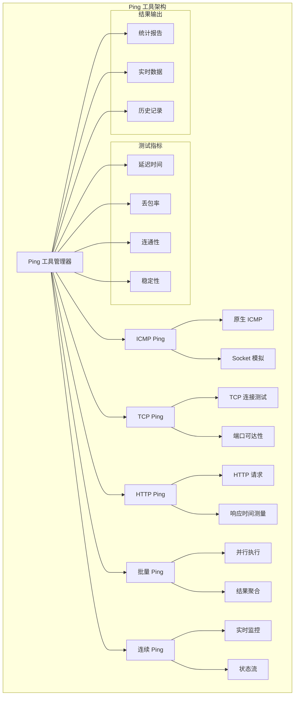

# Flutter Ping 工具实现

本文档详细介绍 Flutter 应用中 Ping 工具的实现方案，包括 ICMP Ping、TCP Ping、HTTP Ping 等多种实现方式。

## 📋 目录

- [Ping 工具基础](#ping-工具基础)
- [核心实现](#核心实现)
- [多种 Ping 方式](#多种-ping-方式)
- [高级功能](#高级功能)
- [实际应用案例](#实际应用案例)
- [最佳实践](#最佳实践)

## Ping 工具基础

### 架构图



### 核心依赖

```yaml
dependencies:
  dio: ^5.3.2
  logger: ^2.0.1
  connectivity_plus: ^4.0.2
```

## 核心实现

### 1. Ping 工具核心类

```dart
import 'dart:async';
import 'dart:io';
import 'dart:math';
import 'package:dio/dio.dart';
import 'package:logger/logger.dart';

class PingTool {
  static final Logger _logger = Logger();
  static final Dio _dio = Dio();

  /// 执行 Ping 测试
  static Future<PingResult> pingHost(
    String host, {
    int count = 4,
    Duration timeout = const Duration(seconds: 5),
    PingType type = PingType.http,
  }) async {
    final results = <PingResponse>[];
    final stopwatch = Stopwatch();

    _logger.i('Starting ping test for $host (count: $count, type: $type)');

    for (int i = 0; i < count; i++) {
      stopwatch.reset();
      stopwatch.start();

      try {
        final success = await _performPing(host, timeout, type);
        stopwatch.stop();

        results.add(PingResponse(
          sequenceNumber: i + 1,
          success: success,
          latency: stopwatch.elapsedMilliseconds,
          timestamp: DateTime.now(),
        ));
      } catch (e) {
        stopwatch.stop();
        
        results.add(PingResponse(
          sequenceNumber: i + 1,
          success: false,
          latency: stopwatch.elapsedMilliseconds,
          timestamp: DateTime.now(),
          error: e.toString(),
        ));
      }

      // 间隔1秒再进行下一次ping
      if (i < count - 1) {
        await Future.delayed(Duration(seconds: 1));
      }
    }

    return _calculatePingResult(host, results, type);
  }

  /// 执行单次 Ping
  static Future<bool> _performPing(
    String host,
    Duration timeout,
    PingType type,
  ) async {
    switch (type) {
      case PingType.tcp:
        return await _tcpPing(host, 80, timeout);
      case PingType.http:
        return await _httpPing(host, timeout);
      case PingType.https:
        return await _httpsPing(host, timeout);
      default:
        return await _httpPing(host, timeout);
    }
  }

  /// TCP Ping 实现
  static Future<bool> _tcpPing(
    String host,
    int port,
    Duration timeout,
  ) async {
    try {
      final socket = await Socket.connect(
        host,
        port,
        timeout: timeout,
      );
      socket.destroy();
      return true;
    } catch (e) {
      _logger.w('TCP ping failed for $host:$port: $e');
      return false;
    }
  }

  /// HTTP Ping 实现
  static Future<bool> _httpPing(String host, Duration timeout) async {
    try {
      final url = host.startsWith('http') ? host : 'http://$host';
      
      final response = await _dio.head(
        url,
        options: Options(
          receiveTimeout: timeout,
          sendTimeout: timeout,
          followRedirects: false,
          validateStatus: (status) => status != null && status < 500,
        ),
      );
      
      return response.statusCode != null && response.statusCode! < 500;
    } catch (e) {
      // 尝试 GET 请求作为备选
      try {
        final url = host.startsWith('http') ? host : 'http://$host';
        
        final response = await _dio.get(
          url,
          options: Options(
            receiveTimeout: timeout,
            sendTimeout: timeout,
            followRedirects: false,
            validateStatus: (status) => status != null && status < 500,
          ),
        );
        
        return response.statusCode != null && response.statusCode! < 500;
      } catch (httpError) {
        _logger.w('HTTP ping failed for $host: $e, $httpError');
        return false;
      }
    }
  }

  /// HTTPS Ping 实现
  static Future<bool> _httpsPing(String host, Duration timeout) async {
    try {
      final url = host.startsWith('https') ? host : 'https://$host';
      
      final response = await _dio.head(
        url,
        options: Options(
          receiveTimeout: timeout,
          sendTimeout: timeout,
          followRedirects: false,
          validateStatus: (status) => status != null && status < 500,
        ),
      );
      
      return response.statusCode != null && response.statusCode! < 500;
    } catch (e) {
      _logger.w('HTTPS ping failed for $host: $e');
      return false;
    }
  }

  /// 计算 Ping 结果统计
  static PingResult _calculatePingResult(
    String host,
    List<PingResponse> responses,
    PingType type,
  ) {
    final successfulPings = responses.where((r) => r.success).toList();
    final failedPings = responses.where((r) => !r.success).toList();

    double averageLatency = 0;
    int minLatency = 0;
    int maxLatency = 0;

    if (successfulPings.isNotEmpty) {
      final latencies = successfulPings.map((r) => r.latency).toList();
      averageLatency = latencies.reduce((a, b) => a + b) / latencies.length;
      minLatency = latencies.reduce((a, b) => a < b ? a : b);
      maxLatency = latencies.reduce((a, b) => a > b ? a : b);
    }

    final packetLoss = (failedPings.length / responses.length) * 100;

    return PingResult(
      host: host,
      type: type,
      successfulPackets: successfulPings.length,
      failedPackets: failedPings.length,
      totalPackets: responses.length,
      packetLoss: packetLoss,
      averageLatency: averageLatency,
      minLatency: minLatency,
      maxLatency: maxLatency,
      responses: responses,
      isReachable: successfulPings.isNotEmpty,
      timestamp: DateTime.now(),
    );
  }

  /// 批量 Ping 多个主机
  static Future<Map<String, PingResult>> pingMultipleHosts(
    List<String> hosts, {
    int count = 4,
    Duration timeout = const Duration(seconds: 5),
    PingType type = PingType.http,
  }) async {
    final results = <String, PingResult>{};

    // 并行执行 Ping
    final futures = hosts.map((host) => pingHost(
      host,
      count: count,
      timeout: timeout,
      type: type,
    ));

    final pingResults = await Future.wait(futures);

    for (int i = 0; i < hosts.length; i++) {
      results[hosts[i]] = pingResults[i];
    }

    return results;
  }

  /// 连续 Ping 监控
  static Stream<PingResponse> continuousPing(
    String host, {
    Duration interval = const Duration(seconds: 1),
    Duration timeout = const Duration(seconds: 5),
    PingType type = PingType.http,
  }) async* {
    int sequenceNumber = 1;

    while (true) {
      final stopwatch = Stopwatch()..start();

      try {
        final success = await _performPing(host, timeout, type);
        stopwatch.stop();

        yield PingResponse(
          sequenceNumber: sequenceNumber,
          success: success,
          latency: stopwatch.elapsedMilliseconds,
          timestamp: DateTime.now(),
        );
      } catch (e) {
        stopwatch.stop();
        
        yield PingResponse(
          sequenceNumber: sequenceNumber,
          success: false,
          latency: stopwatch.elapsedMilliseconds,
          timestamp: DateTime.now(),
          error: e.toString(),
        );
      }

      sequenceNumber++;
      await Future.delayed(interval);
    }
  }

  /// 网络质量评估
  static Future<NetworkQualityAssessment> assessNetworkQuality(
    List<String> testHosts, {
    int count = 10,
    Duration timeout = const Duration(seconds: 5),
  }) async {
    final hostResults = <String, PingResult>{};

    for (final host in testHosts) {
      final result = await pingHost(
        host,
        count: count,
        timeout: timeout,
        type: PingType.http,
      );
      hostResults[host] = result;
    }

    return NetworkQualityAssessment(
      testHosts: testHosts,
      hostResults: hostResults,
      timestamp: DateTime.now(),
    );
  }
}

/// Ping 类型枚举
enum PingType {
  tcp,
  http,
  https,
}

/// Ping 响应模型
class PingResponse {
  final int sequenceNumber;
  final bool success;
  final int latency;
  final DateTime timestamp;
  final String? error;

  PingResponse({
    required this.sequenceNumber,
    required this.success,
    required this.latency,
    required this.timestamp,
    this.error,
  });

  @override
  String toString() {
    if (success) {
      return 'Ping #$sequenceNumber: ${latency}ms';
    } else {
      return 'Ping #$sequenceNumber: Failed${error != null ? " ($error)" : ""}';
    }
  }

  Map<String, dynamic> toJson() {
    return {
      'sequenceNumber': sequenceNumber,
      'success': success,
      'latency': latency,
      'timestamp': timestamp.toIso8601String(),
      'error': error,
    };
  }
}

/// Ping 结果模型
class PingResult {
  final String host;
  final PingType type;
  final int successfulPackets;
  final int failedPackets;
  final int totalPackets;
  final double packetLoss;
  final double averageLatency;
  final int minLatency;
  final int maxLatency;
  final List<PingResponse> responses;
  final bool isReachable;
  final DateTime timestamp;

  PingResult({
    required this.host,
    required this.type,
    required this.successfulPackets,
    required this.failedPackets,
    required this.totalPackets,
    required this.packetLoss,
    required this.averageLatency,
    required this.minLatency,
    required this.maxLatency,
    required this.responses,
    required this.isReachable,
    required this.timestamp,
  });

  /// 连接质量等级
  String get qualityGrade {
    if (!isReachable) return '不可达';
    if (packetLoss > 10) return '很差';
    if (packetLoss > 5) return '较差';
    if (averageLatency > 200) return '一般';
    if (averageLatency > 100) return '良好';
    return '优秀';
  }

  /// 稳定性评分 (0-100)
  int get stabilityScore {
    if (!isReachable) return 0;
    
    int score = 100;
    
    // 丢包率影响 (最多扣50分)
    score -= (packetLoss * 5).round().clamp(0, 50);
    
    // 延迟影响 (最多扣30分)
    if (averageLatency > 500) {
      score -= 30;
    } else if (averageLatency > 200) {
      score -= 20;
    } else if (averageLatency > 100) {
      score -= 10;
    }
    
    // 延迟抖动影响 (最多扣20分)
    if (responses.length > 1) {
      final jitter = maxLatency - minLatency;
      if (jitter > 100) {
        score -= 20;
      } else if (jitter > 50) {
        score -= 10;
      }
    }
    
    return score.clamp(0, 100);
  }

  @override
  String toString() {
    return 'PingResult(host: $host, reachable: $isReachable, avgLatency: ${averageLatency.toStringAsFixed(1)}ms, packetLoss: ${packetLoss.toStringAsFixed(1)}%)';
  }

  Map<String, dynamic> toJson() {
    return {
      'host': host,
      'type': type.toString(),
      'successfulPackets': successfulPackets,
      'failedPackets': failedPackets,
      'totalPackets': totalPackets,
      'packetLoss': packetLoss,
      'averageLatency': averageLatency,
      'minLatency': minLatency,
      'maxLatency': maxLatency,
      'isReachable': isReachable,
      'qualityGrade': qualityGrade,
      'stabilityScore': stabilityScore,
      'timestamp': timestamp.toIso8601String(),
      'responses': responses.map((r) => r.toJson()).toList(),
    };
  }
}

/// 网络质量评估结果
class NetworkQualityAssessment {
  final List<String> testHosts;
  final Map<String, PingResult> hostResults;
  final DateTime timestamp;

  NetworkQualityAssessment({
    required this.testHosts,
    required this.hostResults,
    required this.timestamp,
  });

  /// 整体网络质量评分
  int get overallScore {
    if (hostResults.isEmpty) return 0;
    
    final scores = hostResults.values.map((r) => r.stabilityScore).toList();
    return (scores.reduce((a, b) => a + b) / scores.length).round();
  }

  /// 可达主机数量
  int get reachableHostsCount {
    return hostResults.values.where((r) => r.isReachable).length;
  }

  /// 平均延迟
  double get averageLatency {
    final reachableResults = hostResults.values.where((r) => r.isReachable);
    if (reachableResults.isEmpty) return 0;
    
    final latencies = reachableResults.map((r) => r.averageLatency);
    return latencies.reduce((a, b) => a + b) / latencies.length;
  }

  /// 平均丢包率
  double get averagePacketLoss {
    if (hostResults.isEmpty) return 100;
    
    final packetLosses = hostResults.values.map((r) => r.packetLoss);
    return packetLosses.reduce((a, b) => a + b) / packetLosses.length;
  }

  /// 网络质量等级
  String get qualityGrade {
    final score = overallScore;
    if (score >= 90) return '优秀';
    if (score >= 70) return '良好';
    if (score >= 50) return '一般';
    if (score >= 30) return '较差';
    return '很差';
  }

  /// 生成评估报告
  String generateReport() {
    final buffer = StringBuffer();
    buffer.writeln('=== 网络质量评估报告 ===');
    buffer.writeln('评估时间: $timestamp');
    buffer.writeln('测试主机数: ${testHosts.length}');
    buffer.writeln('可达主机数: $reachableHostsCount');
    buffer.writeln('整体评分: $overallScore ($qualityGrade)');
    buffer.writeln('平均延迟: ${averageLatency.toStringAsFixed(1)}ms');
    buffer.writeln('平均丢包率: ${averagePacketLoss.toStringAsFixed(1)}%');
    buffer.writeln();
    
    buffer.writeln('=== 各主机详情 ===');
    for (final entry in hostResults.entries) {
      final host = entry.key;
      final result = entry.value;
      buffer.writeln('$host:');
      buffer.writeln('  状态: ${result.isReachable ? "可达" : "不可达"}');
      if (result.isReachable) {
        buffer.writeln('  平均延迟: ${result.averageLatency.toStringAsFixed(1)}ms');
        buffer.writeln('  延迟范围: ${result.minLatency}-${result.maxLatency}ms');
        buffer.writeln('  丢包率: ${result.packetLoss.toStringAsFixed(1)}%');
        buffer.writeln('  质量等级: ${result.qualityGrade}');
        buffer.writeln('  稳定性评分: ${result.stabilityScore}');
      }
      buffer.writeln();
    }
    
    return buffer.toString();
  }

  Map<String, dynamic> toJson() {
    return {
      'testHosts': testHosts,
      'hostResults': hostResults.map((k, v) => MapEntry(k, v.toJson())),
      'overallScore': overallScore,
      'reachableHostsCount': reachableHostsCount,
      'averageLatency': averageLatency,
      'averagePacketLoss': averagePacketLoss,
      'qualityGrade': qualityGrade,
      'timestamp': timestamp.toIso8601String(),
    };
  }
}
```

## 多种 Ping 方式

### 1. 高级 TCP Ping

```dart
class AdvancedTcpPing {
  /// 多端口 TCP Ping
  static Future<Map<int, bool>> pingMultiplePorts(
    String host,
    List<int> ports, {
    Duration timeout = const Duration(seconds: 3),
  }) async {
    final results = <int, bool>{};
    
    final futures = ports.map((port) async {
      try {
        final socket = await Socket.connect(
          host,
          port,
          timeout: timeout,
        );
        socket.destroy();
        return MapEntry(port, true);
      } catch (e) {
        return MapEntry(port, false);
      }
    });
    
    final portResults = await Future.wait(futures);
    for (final entry in portResults) {
      results[entry.key] = entry.value;
    }
    
    return results;
  }

  /// 端口扫描式 Ping
  static Future<List<int>> scanOpenPorts(
    String host,
    int startPort,
    int endPort, {
    Duration timeout = const Duration(seconds: 1),
  }) async {
    final openPorts = <int>[];
    final futures = <Future<void>>[];
    
    for (int port = startPort; port <= endPort; port++) {
      futures.add(_checkPort(host, port, timeout).then((isOpen) {
        if (isOpen) {
          openPorts.add(port);
        }
      }));
    }
    
    await Future.wait(futures);
    openPorts.sort();
    
    return openPorts;
  }

  static Future<bool> _checkPort(
    String host,
    int port,
    Duration timeout,
  ) async {
    try {
      final socket = await Socket.connect(
        host,
        port,
        timeout: timeout,
      );
      socket.destroy();
      return true;
    } catch (e) {
      return false;
    }
  }
}
```

### 2. 智能 HTTP Ping

```dart
class SmartHttpPing {
  static final Dio _dio = Dio();

  /// 智能 HTTP Ping（自动检测协议）
  static Future<PingResponse> smartPing(
    String host, {
    Duration timeout = const Duration(seconds: 5),
    int sequenceNumber = 1,
  }) async {
    final stopwatch = Stopwatch()..start();
    
    try {
      // 首先尝试 HTTPS
      if (await _tryHttpsPing(host, timeout)) {
        stopwatch.stop();
        return PingResponse(
          sequenceNumber: sequenceNumber,
          success: true,
          latency: stopwatch.elapsedMilliseconds,
          timestamp: DateTime.now(),
        );
      }
      
      // 然后尝试 HTTP
      if (await _tryHttpPing(host, timeout)) {
        stopwatch.stop();
        return PingResponse(
          sequenceNumber: sequenceNumber,
          success: true,
          latency: stopwatch.elapsedMilliseconds,
          timestamp: DateTime.now(),
        );
      }
      
      // 最后尝试 TCP
      if (await _tryTcpPing(host, timeout)) {
        stopwatch.stop();
        return PingResponse(
          sequenceNumber: sequenceNumber,
          success: true,
          latency: stopwatch.elapsedMilliseconds,
          timestamp: DateTime.now(),
        );
      }
      
      stopwatch.stop();
      return PingResponse(
        sequenceNumber: sequenceNumber,
        success: false,
        latency: stopwatch.elapsedMilliseconds,
        timestamp: DateTime.now(),
        error: 'All ping methods failed',
      );
    } catch (e) {
      stopwatch.stop();
      return PingResponse(
        sequenceNumber: sequenceNumber,
        success: false,
        latency: stopwatch.elapsedMilliseconds,
        timestamp: DateTime.now(),
        error: e.toString(),
      );
    }
  }

  static Future<bool> _tryHttpsPing(String host, Duration timeout) async {
    try {
      final url = host.startsWith('https://') ? host : 'https://$host';
      final response = await _dio.head(
        url,
        options: Options(
          receiveTimeout: timeout,
          sendTimeout: timeout,
          validateStatus: (status) => status != null && status < 500,
        ),
      );
      return response.statusCode != null && response.statusCode! < 500;
    } catch (e) {
      return false;
    }
  }

  static Future<bool> _tryHttpPing(String host, Duration timeout) async {
    try {
      final url = host.startsWith('http://') ? host : 'http://$host';
      final response = await _dio.head(
        url,
        options: Options(
          receiveTimeout: timeout,
          sendTimeout: timeout,
          validateStatus: (status) => status != null && status < 500,
        ),
      );
      return response.statusCode != null && response.statusCode! < 500;
    } catch (e) {
      return false;
    }
  }

  static Future<bool> _tryTcpPing(String host, Duration timeout) async {
    try {
      // 尝试常见端口
      final commonPorts = [80, 443, 22, 21, 25];
      
      for (final port in commonPorts) {
        try {
          final socket = await Socket.connect(
            host,
            port,
            timeout: timeout,
          );
          socket.destroy();
          return true;
        } catch (e) {
          // 继续尝试下一个端口
        }
      }
      
      return false;
    } catch (e) {
      return false;
    }
  }
}
```

## 高级功能

### 1. Ping 统计分析

```dart
class PingStatistics {
  /// 计算延迟抖动
  static double calculateJitter(List<int> latencies) {
    if (latencies.length < 2) return 0;
    
    double sum = 0;
    for (int i = 1; i < latencies.length; i++) {
      sum += (latencies[i] - latencies[i - 1]).abs();
    }
    
    return sum / (latencies.length - 1);
  }

  /// 计算标准差
  static double calculateStandardDeviation(List<int> latencies) {
    if (latencies.isEmpty) return 0;
    
    final mean = latencies.reduce((a, b) => a + b) / latencies.length;
    final variance = latencies
        .map((latency) => pow(latency - mean, 2))
        .reduce((a, b) => a + b) / latencies.length;
    
    return sqrt(variance);
  }

  /// 检测网络异常
  static List<NetworkAnomaly> detectAnomalies(List<PingResponse> responses) {
    final anomalies = <NetworkAnomaly>[];
    
    if (responses.length < 3) return anomalies;
    
    final successfulResponses = responses.where((r) => r.success).toList();
    if (successfulResponses.length < 2) return anomalies;
    
    final latencies = successfulResponses.map((r) => r.latency).toList();
    final mean = latencies.reduce((a, b) => a + b) / latencies.length;
    final stdDev = calculateStandardDeviation(latencies);
    
    // 检测延迟异常（超过2个标准差）
    for (final response in successfulResponses) {
      if ((response.latency - mean).abs() > 2 * stdDev) {
        anomalies.add(NetworkAnomaly(
          type: AnomalyType.highLatency,
          timestamp: response.timestamp,
          value: response.latency.toDouble(),
          threshold: mean + 2 * stdDev,
          description: '延迟异常: ${response.latency}ms (正常范围: ${(mean - 2 * stdDev).toStringAsFixed(1)}-${(mean + 2 * stdDev).toStringAsFixed(1)}ms)',
        ));
      }
    }
    
    // 检测连续丢包
    int consecutiveFailures = 0;
    for (final response in responses) {
      if (!response.success) {
        consecutiveFailures++;
      } else {
        if (consecutiveFailures >= 3) {
          anomalies.add(NetworkAnomaly(
            type: AnomalyType.packetLoss,
            timestamp: response.timestamp,
            value: consecutiveFailures.toDouble(),
            threshold: 3,
            description: '连续丢包: $consecutiveFailures 次',
          ));
        }
        consecutiveFailures = 0;
      }
    }
    
    return anomalies;
  }
}

/// 网络异常类型
enum AnomalyType {
  highLatency,
  packetLoss,
  jitter,
  timeout,
}

/// 网络异常模型
class NetworkAnomaly {
  final AnomalyType type;
  final DateTime timestamp;
  final double value;
  final double threshold;
  final String description;

  NetworkAnomaly({
    required this.type,
    required this.timestamp,
    required this.value,
    required this.threshold,
    required this.description,
  });

  @override
  String toString() {
    return 'NetworkAnomaly(type: $type, time: $timestamp, description: $description)';
  }
}
```

### 2. Ping 监控器

```dart
class PingMonitor {
  final String host;
  final Duration interval;
  final Duration timeout;
  final PingType type;
  
  StreamController<PingResponse>? _responseController;
  StreamController<PingStatisticsSnapshot>? _statisticsController;
  Timer? _pingTimer;
  
  final List<PingResponse> _history = [];
  int _sequenceNumber = 1;
  
  PingMonitor({
    required this.host,
    this.interval = const Duration(seconds: 1),
    this.timeout = const Duration(seconds: 5),
    this.type = PingType.http,
  });

  /// 响应流
  Stream<PingResponse> get responseStream {
    _responseController ??= StreamController<PingResponse>.broadcast();
    return _responseController!.stream;
  }

  /// 统计流
  Stream<PingStatisticsSnapshot> get statisticsStream {
    _statisticsController ??= StreamController<PingStatisticsSnapshot>.broadcast();
    return _statisticsController!.stream;
  }

  /// 开始监控
  void start() {
    if (_pingTimer != null) return;
    
    _responseController ??= StreamController<PingResponse>.broadcast();
    _statisticsController ??= StreamController<PingStatisticsSnapshot>.broadcast();
    
    _pingTimer = Timer.periodic(interval, (_) => _performPing());
    
    // 立即执行一次
    _performPing();
  }

  /// 停止监控
  void stop() {
    _pingTimer?.cancel();
    _pingTimer = null;
  }

  /// 清除历史数据
  void clearHistory() {
    _history.clear();
    _sequenceNumber = 1;
  }

  /// 获取当前统计
  PingStatisticsSnapshot getCurrentStatistics() {
    return _calculateStatistics();
  }

  /// 释放资源
  void dispose() {
    stop();
    _responseController?.close();
    _statisticsController?.close();
  }

  Future<void> _performPing() async {
    final stopwatch = Stopwatch()..start();
    
    try {
      final success = await PingTool._performPing(host, timeout, type);
      stopwatch.stop();
      
      final response = PingResponse(
        sequenceNumber: _sequenceNumber++,
        success: success,
        latency: stopwatch.elapsedMilliseconds,
        timestamp: DateTime.now(),
      );
      
      _history.add(response);
      
      // 保持历史记录在合理范围内
      if (_history.length > 1000) {
        _history.removeAt(0);
      }
      
      _responseController?.add(response);
      
      // 每10次ping发送一次统计更新
      if (_sequenceNumber % 10 == 0) {
        _statisticsController?.add(_calculateStatistics());
      }
    } catch (e) {
      stopwatch.stop();
      
      final response = PingResponse(
        sequenceNumber: _sequenceNumber++,
        success: false,
        latency: stopwatch.elapsedMilliseconds,
        timestamp: DateTime.now(),
        error: e.toString(),
      );
      
      _history.add(response);
      _responseController?.add(response);
    }
  }

  PingStatisticsSnapshot _calculateStatistics() {
    if (_history.isEmpty) {
      return PingStatisticsSnapshot(
        totalPings: 0,
        successfulPings: 0,
        failedPings: 0,
        packetLoss: 0,
        averageLatency: 0,
        minLatency: 0,
        maxLatency: 0,
        jitter: 0,
        standardDeviation: 0,
        recentAnomalies: [],
        timestamp: DateTime.now(),
      );
    }
    
    final successful = _history.where((r) => r.success).toList();
    final failed = _history.where((r) => !r.success).toList();
    
    double averageLatency = 0;
    int minLatency = 0;
    int maxLatency = 0;
    double jitter = 0;
    double standardDeviation = 0;
    
    if (successful.isNotEmpty) {
      final latencies = successful.map((r) => r.latency).toList();
      averageLatency = latencies.reduce((a, b) => a + b) / latencies.length;
      minLatency = latencies.reduce((a, b) => a < b ? a : b);
      maxLatency = latencies.reduce((a, b) => a > b ? a : b);
      jitter = PingStatistics.calculateJitter(latencies);
      standardDeviation = PingStatistics.calculateStandardDeviation(latencies);
    }
    
    final packetLoss = (failed.length / _history.length) * 100;
    
    // 检测最近的异常（最近100次ping）
    final recentHistory = _history.length > 100 
        ? _history.sublist(_history.length - 100)
        : _history;
    final recentAnomalies = PingStatistics.detectAnomalies(recentHistory);
    
    return PingStatisticsSnapshot(
      totalPings: _history.length,
      successfulPings: successful.length,
      failedPings: failed.length,
      packetLoss: packetLoss,
      averageLatency: averageLatency,
      minLatency: minLatency,
      maxLatency: maxLatency,
      jitter: jitter,
      standardDeviation: standardDeviation,
      recentAnomalies: recentAnomalies,
      timestamp: DateTime.now(),
    );
  }
}

/// Ping 统计快照
class PingStatisticsSnapshot {
  final int totalPings;
  final int successfulPings;
  final int failedPings;
  final double packetLoss;
  final double averageLatency;
  final int minLatency;
  final int maxLatency;
  final double jitter;
  final double standardDeviation;
  final List<NetworkAnomaly> recentAnomalies;
  final DateTime timestamp;

  PingStatisticsSnapshot({
    required this.totalPings,
    required this.successfulPings,
    required this.failedPings,
    required this.packetLoss,
    required this.averageLatency,
    required this.minLatency,
    required this.maxLatency,
    required this.jitter,
    required this.standardDeviation,
    required this.recentAnomalies,
    required this.timestamp,
  });

  /// 连接质量等级
  String get qualityGrade {
    if (packetLoss > 10) return '很差';
    if (packetLoss > 5) return '较差';
    if (averageLatency > 200) return '一般';
    if (averageLatency > 100) return '良好';
    return '优秀';
  }

  @override
  String toString() {
    return 'PingStatistics(total: $totalPings, success: $successfulPings, loss: ${packetLoss.toStringAsFixed(1)}%, avg: ${averageLatency.toStringAsFixed(1)}ms)';
  }
}
```

## 实际应用案例

### 1. Ping 测试界面

```dart
class PingTestPage extends StatefulWidget {
  final String? initialHost;
  
  const PingTestPage({Key? key, this.initialHost}) : super(key: key);

  @override
  _PingTestPageState createState() => _PingTestPageState();
}

class _PingTestPageState extends State<PingTestPage> {
  final TextEditingController _hostController = TextEditingController();
  final TextEditingController _countController = TextEditingController(text: '4');
  
  PingResult? _result;
  bool _isRunning = false;
  PingType _selectedType = PingType.http;
  
  @override
  void initState() {
    super.initState();
    if (widget.initialHost != null) {
      _hostController.text = widget.initialHost!;
    }
  }

  @override
  Widget build(BuildContext context) {
    return Scaffold(
      appBar: AppBar(
        title: Text('Ping 测试'),
        actions: [
          IconButton(
            icon: Icon(Icons.monitor),
            onPressed: _openMonitor,
          ),
        ],
      ),
      body: Padding(
        padding: EdgeInsets.all(16),
        child: Column(
          children: [
            _buildInputSection(),
            SizedBox(height: 16),
            _buildControlSection(),
            SizedBox(height: 16),
            Expanded(child: _buildResultSection()),
          ],
        ),
      ),
    );
  }

  Widget _buildInputSection() {
    return Card(
      child: Padding(
        padding: EdgeInsets.all(16),
        child: Column(
          children: [
            TextField(
              controller: _hostController,
              decoration: InputDecoration(
                labelText: '目标主机',
                hintText: '例如: google.com 或 8.8.8.8',
                border: OutlineInputBorder(),
              ),
            ),
            SizedBox(height: 12),
            Row(
              children: [
                Expanded(
                  child: TextField(
                    controller: _countController,
                    decoration: InputDecoration(
                      labelText: 'Ping 次数',
                      border: OutlineInputBorder(),
                    ),
                    keyboardType: TextInputType.number,
                  ),
                ),
                SizedBox(width: 12),
                Expanded(
                  child: DropdownButtonFormField<PingType>(
                    value: _selectedType,
                    decoration: InputDecoration(
                      labelText: 'Ping 类型',
                      border: OutlineInputBorder(),
                    ),
                    items: PingType.values.map((type) {
                      return DropdownMenuItem(
                        value: type,
                        child: Text(_getPingTypeDisplayName(type)),
                      );
                    }).toList(),
                    onChanged: (value) {
                      setState(() {
                        _selectedType = value!;
                      });
                    },
                  ),
                ),
              ],
            ),
          ],
        ),
      ),
    );
  }

  Widget _buildControlSection() {
    return Row(
      children: [
        Expanded(
          child: ElevatedButton(
            onPressed: _isRunning ? null : _startPing,
            child: _isRunning 
                ? Row(
                    mainAxisAlignment: MainAxisAlignment.center,
                    children: [
                      SizedBox(
                        width: 16,
                        height: 16,
                        child: CircularProgressIndicator(strokeWidth: 2),
                      ),
                      SizedBox(width: 8),
                      Text('测试中...'),
                    ],
                  )
                : Text('开始 Ping'),
          ),
        ),
        SizedBox(width: 12),
        ElevatedButton(
          onPressed: _result != null ? _clearResult : null,
          child: Text('清除'),
        ),
      ],
    );
  }

  Widget _buildResultSection() {
    if (_result == null) {
      return Center(
        child: Column(
          mainAxisAlignment: MainAxisAlignment.center,
          children: [
            Icon(
              Icons.network_ping,
              size: 64,
              color: Colors.grey,
            ),
            SizedBox(height: 16),
            Text(
              '输入主机地址并点击开始测试',
              style: TextStyle(
                fontSize: 16,
                color: Colors.grey[600],
              ),
            ),
          ],
        ),
      );
    }

    return SingleChildScrollView(
      child: Column(
        children: [
          _buildSummaryCard(),
          SizedBox(height: 16),
          _buildDetailCard(),
        ],
      ),
    );
  }

  Widget _buildSummaryCard() {
    final result = _result!;
    
    return Card(
      child: Padding(
        padding: EdgeInsets.all(16),
        child: Column(
          crossAxisAlignment: CrossAxisAlignment.start,
          children: [
            Row(
              children: [
                Icon(
                  result.isReachable ? Icons.check_circle : Icons.error,
                  color: result.isReachable ? Colors.green : Colors.red,
                ),
                SizedBox(width: 8),
                Text(
                  result.host,
                  style: TextStyle(
                    fontSize: 18,
                    fontWeight: FontWeight.bold,
                  ),
                ),
                Spacer(),
                Chip(
                  label: Text(result.qualityGrade),
                  backgroundColor: _getQualityColor(result.qualityGrade),
                ),
              ],
            ),
            SizedBox(height: 16),
            Row(
              children: [
                Expanded(
                  child: _buildStatItem(
                    '平均延迟',
                    '${result.averageLatency.toStringAsFixed(1)} ms',
                    Icons.timer,
                  ),
                ),
                Expanded(
                  child: _buildStatItem(
                    '丢包率',
                    '${result.packetLoss.toStringAsFixed(1)}%',
                    Icons.signal_wifi_off,
                  ),
                ),
              ],
            ),
            SizedBox(height: 8),
            Row(
              children: [
                Expanded(
                  child: _buildStatItem(
                    '成功/总数',
                    '${result.successfulPackets}/${result.totalPackets}',
                    Icons.analytics,
                  ),
                ),
                Expanded(
                  child: _buildStatItem(
                    '稳定性评分',
                    '${result.stabilityScore}',
                    Icons.speed,
                  ),
                ),
              ],
            ),
          ],
        ),
      ),
    );
  }

  Widget _buildStatItem(String label, String value, IconData icon) {
    return Column(
      children: [
        Icon(icon, size: 24, color: Colors.blue),
        SizedBox(height: 4),
        Text(
          value,
          style: TextStyle(
            fontSize: 16,
            fontWeight: FontWeight.bold,
          ),
        ),
        Text(
          label,
          style: TextStyle(
            fontSize: 12,
            color: Colors.grey[600],
          ),
        ),
      ],
    );
  }

  Widget _buildDetailCard() {
    final result = _result!;
    
    return Card(
      child: Padding(
        padding: EdgeInsets.all(16),
        child: Column(
          crossAxisAlignment: CrossAxisAlignment.start,
          children: [
            Text(
              '详细结果',
              style: TextStyle(
                fontSize: 16,
                fontWeight: FontWeight.bold,
              ),
            ),
            SizedBox(height: 12),
            Container(
              height: 200,
              child: ListView.builder(
                itemCount: result.responses.length,
                itemBuilder: (context, index) {
                  final response = result.responses[index];
                  return ListTile(
                    dense: true,
                    leading: Icon(
                      response.success ? Icons.check : Icons.close,
                      color: response.success ? Colors.green : Colors.red,
                      size: 16,
                    ),
                    title: Text(
                      'Ping #${response.sequenceNumber}',
                      style: TextStyle(fontSize: 14),
                    ),
                    trailing: Text(
                      response.success 
                          ? '${response.latency}ms'
                          : '超时',
                      style: TextStyle(
                        fontSize: 12,
                        color: response.success ? Colors.green : Colors.red,
                      ),
                    ),
                  );
                },
              ),
            ),
          ],
        ),
      ),
    );
  }

  String _getPingTypeDisplayName(PingType type) {
    switch (type) {
      case PingType.tcp:
        return 'TCP';
      case PingType.http:
        return 'HTTP';
      case PingType.https:
        return 'HTTPS';
    }
  }

  Color _getQualityColor(String grade) {
    switch (grade) {
      case '优秀':
        return Colors.green.shade100;
      case '良好':
        return Colors.lightGreen.shade100;
      case '一般':
        return Colors.orange.shade100;
      case '较差':
        return Colors.deepOrange.shade100;
      default:
        return Colors.red.shade100;
    }
  }

  Future<void> _startPing() async {
    final host = _hostController.text.trim();
    if (host.isEmpty) {
      ScaffoldMessenger.of(context).showSnackBar(
        SnackBar(content: Text('请输入目标主机')),
      );
      return;
    }

    final count = int.tryParse(_countController.text) ?? 4;
    if (count <= 0 || count > 100) {
      ScaffoldMessenger.of(context).showSnackBar(
        SnackBar(content: Text('Ping次数必须在1-100之间')),
      );
      return;
    }

    setState(() {
      _isRunning = true;
      _result = null;
    });

    try {
      final result = await PingTool.pingHost(
        host,
        count: count,
        type: _selectedType,
      );

      setState(() {
        _result = result;
      });
    } catch (e) {
      ScaffoldMessenger.of(context).showSnackBar(
        SnackBar(content: Text('Ping测试失败: $e')),
      );
    } finally {
      setState(() {
        _isRunning = false;
      });
    }
  }

  void _clearResult() {
    setState(() {
      _result = null;
    });
  }

  void _openMonitor() {
    final host = _hostController.text.trim();
    if (host.isEmpty) {
      ScaffoldMessenger.of(context).showSnackBar(
        SnackBar(content: Text('请先输入目标主机')),
      );
      return;
    }

    Navigator.push(
      context,
      MaterialPageRoute(
        builder: (context) => PingMonitorPage(host: host),
      ),
    );
  }
}
```

### 2. Ping 监控页面

```dart
class PingMonitorPage extends StatefulWidget {
  final String host;
  
  const PingMonitorPage({Key? key, required this.host}) : super(key: key);

  @override
  _PingMonitorPageState createState() => _PingMonitorPageState();
}

class _PingMonitorPageState extends State<PingMonitorPage> {
  PingMonitor? _monitor;
  StreamSubscription<PingResponse>? _responseSubscription;
  StreamSubscription<PingStatisticsSnapshot>? _statisticsSubscription;
  
  final List<PingResponse> _recentResponses = [];
  PingStatisticsSnapshot? _currentStatistics;
  bool _isMonitoring = false;
  
  @override
  void initState() {
    super.initState();
    _initializeMonitor();
  }

  @override
  void dispose() {
    _stopMonitoring();
    _monitor?.dispose();
    super.dispose();
  }

  void _initializeMonitor() {
    _monitor = PingMonitor(
      host: widget.host,
      interval: Duration(seconds: 1),
    );
    
    _responseSubscription = _monitor!.responseStream.listen(
      (response) {
        setState(() {
          _recentResponses.add(response);
          
          // 保持最近50条记录
          if (_recentResponses.length > 50) {
            _recentResponses.removeAt(0);
          }
        });
      },
    );
    
    _statisticsSubscription = _monitor!.statisticsStream.listen(
      (statistics) {
        setState(() {
          _currentStatistics = statistics;
        });
      },
    );
  }

  @override
  Widget build(BuildContext context) {
    return Scaffold(
      appBar: AppBar(
        title: Text('Ping 监控 - ${widget.host}'),
        actions: [
          IconButton(
            icon: Icon(_isMonitoring ? Icons.stop : Icons.play_arrow),
            onPressed: _isMonitoring ? _stopMonitoring : _startMonitoring,
          ),
          IconButton(
            icon: Icon(Icons.clear),
            onPressed: _clearHistory,
          ),
        ],
      ),
      body: Column(
        children: [
          _buildStatisticsCard(),
          _buildLatencyChart(),
          Expanded(child: _buildResponseList()),
        ],
      ),
    );
  }

  Widget _buildStatisticsCard() {
    if (_currentStatistics == null) {
      return Card(
        margin: EdgeInsets.all(8),
        child: Padding(
          padding: EdgeInsets.all(16),
          child: Text('暂无统计数据'),
        ),
      );
    }
    
    final stats = _currentStatistics!;
    
    return Card(
      margin: EdgeInsets.all(8),
      child: Padding(
        padding: EdgeInsets.all(16),
        child: Column(
          children: [
            Row(
              children: [
                Expanded(
                  child: _buildStatColumn(
                    '总计',
                    '${stats.totalPings}',
                    Icons.analytics,
                  ),
                ),
                Expanded(
                  child: _buildStatColumn(
                    '成功率',
                    '${(100 - stats.packetLoss).toStringAsFixed(1)}%',
                    Icons.check_circle,
                  ),
                ),
                Expanded(
                  child: _buildStatColumn(
                    '平均延迟',
                    '${stats.averageLatency.toStringAsFixed(1)}ms',
                    Icons.timer,
                  ),
                ),
                Expanded(
                  child: _buildStatColumn(
                    '质量等级',
                    stats.qualityGrade,
                    Icons.grade,
                  ),
                ),
              ],
            ),
            if (stats.recentAnomalies.isNotEmpty) ..[
              SizedBox(height: 12),
              Container(
                padding: EdgeInsets.all(8),
                decoration: BoxDecoration(
                  color: Colors.orange.shade50,
                  borderRadius: BorderRadius.circular(4),
                  border: Border.all(color: Colors.orange.shade200),
                ),
                child: Row(
                  children: [
                    Icon(Icons.warning, color: Colors.orange, size: 16),
                    SizedBox(width: 8),
                    Expanded(
                      child: Text(
                        '检测到 ${stats.recentAnomalies.length} 个网络异常',
                        style: TextStyle(
                          fontSize: 12,
                          color: Colors.orange.shade800,
                        ),
                      ),
                    ),
                  ],
                ),
              ),
            ],
          ],
        ),
      ),
    );
  }

  Widget _buildStatColumn(String label, String value, IconData icon) {
    return Column(
      children: [
        Icon(icon, size: 20, color: Colors.blue),
        SizedBox(height: 4),
        Text(
          value,
          style: TextStyle(
            fontSize: 14,
            fontWeight: FontWeight.bold,
          ),
        ),
        Text(
          label,
          style: TextStyle(
            fontSize: 10,
            color: Colors.grey[600],
          ),
        ),
      ],
    );
  }

  Widget _buildLatencyChart() {
    if (_recentResponses.isEmpty) {
      return Container(
        height: 120,
        margin: EdgeInsets.symmetric(horizontal: 8),
        child: Card(
          child: Center(
            child: Text('暂无数据'),
          ),
        ),
      );
    }
    
    final successfulResponses = _recentResponses
        .where((r) => r.success)
        .toList();
    
    if (successfulResponses.isEmpty) {
      return Container(
        height: 120,
        margin: EdgeInsets.symmetric(horizontal: 8),
        child: Card(
          child: Center(
            child: Text('无成功的Ping响应'),
          ),
        ),
      );
    }
    
    return Container(
      height: 120,
      margin: EdgeInsets.symmetric(horizontal: 8),
      child: Card(
        child: Padding(
          padding: EdgeInsets.all(8),
          child: CustomPaint(
            painter: LatencyChartPainter(successfulResponses),
            child: Container(),
          ),
        ),
      ),
    );
  }

  Widget _buildResponseList() {
    return Card(
      margin: EdgeInsets.all(8),
      child: Column(
        children: [
          Padding(
            padding: EdgeInsets.all(12),
            child: Row(
              children: [
                Icon(Icons.list, size: 20),
                SizedBox(width: 8),
                Text(
                  '实时响应',
                  style: TextStyle(
                    fontSize: 16,
                    fontWeight: FontWeight.bold,
                  ),
                ),
                Spacer(),
                Text(
                  '最近 ${_recentResponses.length} 条',
                  style: TextStyle(
                    fontSize: 12,
                    color: Colors.grey[600],
                  ),
                ),
              ],
            ),
          ),
          Expanded(
            child: _recentResponses.isEmpty
                ? Center(child: Text('暂无数据'))
                : ListView.builder(
                    reverse: true,
                    itemCount: _recentResponses.length,
                    itemBuilder: (context, index) {
                      final response = _recentResponses[
                          _recentResponses.length - 1 - index];
                      return ListTile(
                        dense: true,
                        leading: Icon(
                          response.success ? Icons.check : Icons.close,
                          color: response.success ? Colors.green : Colors.red,
                          size: 16,
                        ),
                        title: Text(
                          'Ping #${response.sequenceNumber}',
                          style: TextStyle(fontSize: 14),
                        ),
                        subtitle: Text(
                          DateFormat('HH:mm:ss').format(response.timestamp),
                          style: TextStyle(fontSize: 12),
                        ),
                        trailing: Text(
                          response.success
                              ? '${response.latency}ms'
                              : '失败',
                          style: TextStyle(
                            fontSize: 12,
                            color: response.success ? Colors.green : Colors.red,
                            fontWeight: FontWeight.bold,
                          ),
                        ),
                      );
                    },
                  ),
          ),
        ],
      ),
    );
  }

  void _startMonitoring() {
    setState(() {
      _isMonitoring = true;
    });
    _monitor?.start();
  }

  void _stopMonitoring() {
    setState(() {
      _isMonitoring = false;
    });
    _monitor?.stop();
  }

  void _clearHistory() {
    setState(() {
      _recentResponses.clear();
      _currentStatistics = null;
    });
    _monitor?.clearHistory();
  }
}

/// 延迟图表绘制器
class LatencyChartPainter extends CustomPainter {
  final List<PingResponse> responses;
  
  LatencyChartPainter(this.responses);

  @override
  void paint(Canvas canvas, Size size) {
    if (responses.isEmpty) return;
    
    final paint = Paint()
      ..color = Colors.blue
      ..strokeWidth = 2
      ..style = PaintingStyle.stroke;
    
    final path = Path();
    
    final maxLatency = responses
        .map((r) => r.latency)
        .reduce((a, b) => a > b ? a : b)
        .toDouble();
    
    final minLatency = responses
        .map((r) => r.latency)
        .reduce((a, b) => a < b ? a : b)
        .toDouble();
    
    final latencyRange = maxLatency - minLatency;
    
    for (int i = 0; i < responses.length; i++) {
      final x = (i / (responses.length - 1)) * size.width;
      final normalizedLatency = latencyRange > 0
          ? (responses[i].latency - minLatency) / latencyRange
          : 0.5;
      final y = size.height - (normalizedLatency * size.height);
      
      if (i == 0) {
        path.moveTo(x, y);
      } else {
        path.lineTo(x, y);
      }
    }
    
    canvas.drawPath(path, paint);
    
    // 绘制数据点
    final pointPaint = Paint()
      ..color = Colors.blue
      ..style = PaintingStyle.fill;
    
    for (int i = 0; i < responses.length; i++) {
      final x = (i / (responses.length - 1)) * size.width;
      final normalizedLatency = latencyRange > 0
          ? (responses[i].latency - minLatency) / latencyRange
          : 0.5;
      final y = size.height - (normalizedLatency * size.height);
      
      canvas.drawCircle(Offset(x, y), 2, pointPaint);
    }
  }

  @override
  bool shouldRepaint(covariant CustomPainter oldDelegate) {
    return true;
  }
}
```

## 最佳实践

### 1. 性能优化

```dart
class OptimizedPingTool {
  // 连接池复用
  static final Map<String, Socket> _connectionPool = {};
  
  /// 使用连接池的TCP Ping
  static Future<bool> tcpPingWithPool(
    String host,
    int port,
    Duration timeout,
  ) async {
    final key = '$host:$port';
    
    try {
      Socket? socket = _connectionPool[key];
      
      if (socket == null) {
        socket = await Socket.connect(
          host,
          port,
          timeout: timeout,
        );
        _connectionPool[key] = socket;
      }
      
      // 测试连接是否仍然有效
      socket.write([0]);
      await socket.flush();
      
      return true;
    } catch (e) {
      // 连接失败，从池中移除
      _connectionPool.remove(key)?.destroy();
      return false;
    }
  }
  
  /// 清理连接池
  static void clearConnectionPool() {
    for (final socket in _connectionPool.values) {
      socket.destroy();
    }
    _connectionPool.clear();
  }
}
```

### 2. 错误处理

```dart
class RobustPingTool {
  /// 带重试机制的Ping
  static Future<PingResult> pingWithRetry(
    String host, {
    int maxRetries = 3,
    Duration retryDelay = const Duration(seconds: 1),
    int count = 4,
    Duration timeout = const Duration(seconds: 5),
    PingType type = PingType.http,
  }) async {
    Exception? lastException;
    
    for (int attempt = 0; attempt <= maxRetries; attempt++) {
      try {
        return await PingTool.pingHost(
          host,
          count: count,
          timeout: timeout,
          type: type,
        );
      } catch (e) {
        lastException = e is Exception ? e : Exception(e.toString());
        
        if (attempt < maxRetries) {
          await Future.delayed(retryDelay);
        }
      }
    }
    
    throw lastException ?? Exception('Ping failed after $maxRetries retries');
  }
}
```

### 3. 配置管理

```dart
class PingConfiguration {
  final Duration defaultTimeout;
  final int defaultCount;
  final PingType defaultType;
  final Duration monitorInterval;
  final int maxHistorySize;
  
  const PingConfiguration({
    this.defaultTimeout = const Duration(seconds: 5),
    this.defaultCount = 4,
    this.defaultType = PingType.http,
    this.monitorInterval = const Duration(seconds: 1),
    this.maxHistorySize = 1000,
  });
  
  static const PingConfiguration standard = PingConfiguration();
  
  static const PingConfiguration fast = PingConfiguration(
    defaultTimeout: Duration(seconds: 2),
    defaultCount: 3,
    monitorInterval: Duration(milliseconds: 500),
  );
  
  static const PingConfiguration thorough = PingConfiguration(
    defaultTimeout: Duration(seconds: 10),
    defaultCount: 10,
    monitorInterval: Duration(seconds: 2),
  );
}
```

### 4. 测试支持

```dart
class MockPingTool implements PingTool {
  final bool shouldSucceed;
  final int latency;
  
  MockPingTool({
    this.shouldSucceed = true,
    this.latency = 50,
  });
  
  @override
  Future<PingResult> pingHost(
    String host, {
    int count = 4,
    Duration timeout = const Duration(seconds: 5),
    PingType type = PingType.http,
  }) async {
    final responses = <PingResponse>[];
    
    for (int i = 0; i < count; i++) {
      await Future.delayed(Duration(milliseconds: latency));
      
      responses.add(PingResponse(
        sequenceNumber: i + 1,
        success: shouldSucceed,
        latency: latency + Random().nextInt(20) - 10,
        timestamp: DateTime.now(),
      ));
    }
    
    return PingResult(
      host: host,
      type: type,
      successfulPackets: shouldSucceed ? count : 0,
      failedPackets: shouldSucceed ? 0 : count,
      totalPackets: count,
      packetLoss: shouldSucceed ? 0 : 100,
      averageLatency: shouldSucceed ? latency.toDouble() : 0,
      minLatency: shouldSucceed ? latency - 10 : 0,
      maxLatency: shouldSucceed ? latency + 10 : 0,
      responses: responses,
      isReachable: shouldSucceed,
      timestamp: DateTime.now(),
    );
  }
}
```

## 总结

Flutter Ping 工具提供了完整的网络连通性测试解决方案：

1. **多种实现方式**：支持 TCP、HTTP、HTTPS 等多种 Ping 方式
2. **实时监控**：提供连续监控和统计分析功能
3. **智能检测**：自动检测网络异常和质量评估
4. **用户友好**：提供直观的界面和详细的统计信息
5. **高性能**：优化的实现确保测试的准确性和效率

通过合理使用这些工具，可以有效监控和诊断网络连接问题，提升应用的网络体验。