# 实时通信

> 构建高效稳定的WebSocket和Server-Sent Events实时通信系统

## 🔌 WebSocket架构设计

### 连接管理架构

```mermaid
sequenceDiagram
    participant App as 应用层
    participant WM as WebSocket管理器
    participant WS as WebSocket连接
    participant Server as 服务器
    
    App->>WM: 建立连接
    WM->>WS: 创建WebSocket
    WS->>Server: 握手请求
    Server->>WS: 握手响应
    WS->>WM: 连接成功
    WM->>App: 连接状态更新
    
    loop 心跳检测
        WM->>WS: 发送ping
        WS->>Server: ping消息
        Server->>WS: pong响应
        WS->>WM: 心跳确认
    end
    
    App->>WM: 发送消息
    WM->>WS: 转发消息
    WS->>Server: 发送数据
    
    Server->>WS: 推送消息
    WS->>WM: 接收消息
    WM->>App: 消息回调
```



## 🌐 WebSocket管理器

### 1. 核心WebSocket管理器

```dart
class WebSocketManager {
  static final WebSocketManager _instance = WebSocketManager._internal();
  factory WebSocketManager() => _instance;
  WebSocketManager._internal();
  
  WebSocketChannel? _channel;
  Timer? _heartbeatTimer;
  Timer? _reconnectTimer;
  
  final StreamController<WebSocketMessage> _messageController = 
      StreamController<WebSocketMessage>.broadcast();
  final StreamController<WebSocketState> _stateController = 
      StreamController<WebSocketState>.broadcast();
  
  // 配置参数
  String? _url;
  Map<String, String>? _headers;
  Duration _heartbeatInterval = const Duration(seconds: 30);
  Duration _reconnectDelay = const Duration(seconds: 5);
  int _maxReconnectAttempts = 5;
  int _reconnectAttempts = 0;
  
  // 状态管理
  WebSocketState _state = WebSocketState.disconnected;
  final Queue<String> _messageQueue = Queue<String>();
  bool _shouldReconnect = true;
  
  // 流
  Stream<WebSocketMessage> get messageStream => _messageController.stream;
  Stream<WebSocketState> get stateStream => _stateController.stream;
  WebSocketState get state => _state;
  
  Future<void> connect({
    required String url,
    Map<String, String>? headers,
    Duration? heartbeatInterval,
    Duration? reconnectDelay,
    int? maxReconnectAttempts,
  }) async {
    _url = url;
    _headers = headers;
    _heartbeatInterval = heartbeatInterval ?? _heartbeatInterval;
    _reconnectDelay = reconnectDelay ?? _reconnectDelay;
    _maxReconnectAttempts = maxReconnectAttempts ?? _maxReconnectAttempts;
    
    await _connect();
  }
  
  Future<void> _connect() async {
    if (_state == WebSocketState.connecting || _state == WebSocketState.connected) {
      return;
    }
    
    try {
      _updateState(WebSocketState.connecting);
      
      _channel = WebSocketChannel.connect(
        Uri.parse(_url!),
        protocols: ['websocket'],
      );
      
      // 监听连接状态
      _channel!.ready.then((_) {
        _updateState(WebSocketState.connected);
        _reconnectAttempts = 0;
        _startHeartbeat();
        _processMessageQueue();
      }).catchError((error) {
        _handleConnectionError(error);
      });
      
      // 监听消息
      _channel!.stream.listen(
        _handleMessage,
        onError: _handleConnectionError,
        onDone: _handleConnectionClosed,
      );
      
    } catch (error) {
      _handleConnectionError(error);
    }
  }
  
  void _handleMessage(dynamic data) {
    try {
      final message = WebSocketMessage.fromJson(jsonDecode(data));
      
      // 处理特殊消息类型
      switch (message.type) {
        case MessageType.pong:
          _handlePong();
          break;
        case MessageType.ping:
          _sendPong();
          break;
        default:
          _messageController.add(message);
      }
    } catch (e) {
      debugPrint('Failed to parse WebSocket message: $e');
    }
  }
  
  void _handleConnectionError(dynamic error) {
    debugPrint('WebSocket connection error: $error');
    _updateState(WebSocketState.error);
    _stopHeartbeat();
    
    if (_shouldReconnect && _reconnectAttempts < _maxReconnectAttempts) {
      _scheduleReconnect();
    } else {
      _updateState(WebSocketState.disconnected);
    }
  }
  
  void _handleConnectionClosed() {
    debugPrint('WebSocket connection closed');
    _updateState(WebSocketState.disconnected);
    _stopHeartbeat();
    
    if (_shouldReconnect && _reconnectAttempts < _maxReconnectAttempts) {
      _scheduleReconnect();
    }
  }
  
  void _scheduleReconnect() {
    _reconnectAttempts++;
    final delay = _reconnectDelay * _reconnectAttempts; // 指数退避
    
    debugPrint('Scheduling reconnect attempt $_reconnectAttempts in ${delay.inSeconds}s');
    
    _reconnectTimer?.cancel();
    _reconnectTimer = Timer(delay, () {
      if (_shouldReconnect) {
        _connect();
      }
    });
  }
  
  void _startHeartbeat() {
    _stopHeartbeat();
    _heartbeatTimer = Timer.periodic(_heartbeatInterval, (timer) {
      _sendPing();
    });
  }
  
  void _stopHeartbeat() {
    _heartbeatTimer?.cancel();
    _heartbeatTimer = null;
  }
  
  void _sendPing() {
    if (_state == WebSocketState.connected) {
      final pingMessage = WebSocketMessage(
        type: MessageType.ping,
        data: {'timestamp': DateTime.now().millisecondsSinceEpoch},
      );
      _sendMessage(pingMessage.toJson());
    }
  }
  
  void _sendPong() {
    if (_state == WebSocketState.connected) {
      final pongMessage = WebSocketMessage(
        type: MessageType.pong,
        data: {'timestamp': DateTime.now().millisecondsSinceEpoch},
      );
      _sendMessage(pongMessage.toJson());
    }
  }
  
  void _handlePong() {
    // 心跳响应处理
    debugPrint('Received pong from server');
  }
  
  void send(WebSocketMessage message) {
    final jsonString = jsonEncode(message.toJson());
    
    if (_state == WebSocketState.connected) {
      _sendMessage(jsonString);
    } else {
      // 添加到队列，连接恢复后发送
      _messageQueue.add(jsonString);
    }
  }
  
  void _sendMessage(String message) {
    try {
      _channel?.sink.add(message);
    } catch (e) {
      debugPrint('Failed to send WebSocket message: $e');
    }
  }
  
  void _processMessageQueue() {
    while (_messageQueue.isNotEmpty && _state == WebSocketState.connected) {
      final message = _messageQueue.removeFirst();
      _sendMessage(message);
    }
  }
  
  void _updateState(WebSocketState newState) {
    if (_state != newState) {
      _state = newState;
      _stateController.add(newState);
    }
  }
  
  Future<void> disconnect() async {
    _shouldReconnect = false;
    _stopHeartbeat();
    _reconnectTimer?.cancel();
    
    await _channel?.sink.close();
    _channel = null;
    
    _updateState(WebSocketState.disconnected);
  }
  
  void dispose() {
    disconnect();
    _messageController.close();
    _stateController.close();
  }
}
```

### 2. WebSocket消息模型

```dart
enum MessageType {
  ping,
  pong,
  chat,
  notification,
  userStatus,
  systemMessage,
  error,
}

class WebSocketMessage {
  final MessageType type;
  final Map<String, dynamic> data;
  final String? id;
  final DateTime timestamp;
  
  WebSocketMessage({
    required this.type,
    required this.data,
    this.id,
    DateTime? timestamp,
  }) : timestamp = timestamp ?? DateTime.now();
  
  factory WebSocketMessage.fromJson(Map<String, dynamic> json) {
    return WebSocketMessage(
      type: MessageType.values.firstWhere(
        (type) => type.name == json['type'],
        orElse: () => MessageType.systemMessage,
      ),
      data: Map<String, dynamic>.from(json['data'] ?? {}),
      id: json['id'],
      timestamp: json['timestamp'] != null 
          ? DateTime.parse(json['timestamp'])
          : DateTime.now(),
    );
  }
  
  Map<String, dynamic> toJson() {
    return {
      'type': type.name,
      'data': data,
      'id': id,
      'timestamp': timestamp.toIso8601String(),
    };
  }
}

enum WebSocketState {
  disconnected,
  connecting,
  connected,
  error,
}
```

## 📡 Server-Sent Events (SSE)

### 1. SSE客户端实现

```dart
class SSEClient {
  final String url;
  final Map<String, String>? headers;
  final Duration reconnectDelay;
  final int maxReconnectAttempts;
  
  StreamSubscription? _subscription;
  final StreamController<SSEEvent> _eventController = 
      StreamController<SSEEvent>.broadcast();
  final StreamController<SSEState> _stateController = 
      StreamController<SSEState>.broadcast();
  
  SSEState _state = SSEState.disconnected;
  int _reconnectAttempts = 0;
  bool _shouldReconnect = true;
  Timer? _reconnectTimer;
  
  SSEClient({
    required this.url,
    this.headers,
    this.reconnectDelay = const Duration(seconds: 5),
    this.maxReconnectAttempts = 5,
  });
  
  Stream<SSEEvent> get eventStream => _eventController.stream;
  Stream<SSEState> get stateStream => _stateController.stream;
  SSEState get state => _state;
  
  Future<void> connect() async {
    if (_state == SSEState.connecting || _state == SSEState.connected) {
      return;
    }
    
    try {
      _updateState(SSEState.connecting);
      
      final client = HttpClient();
      final request = await client.getUrl(Uri.parse(url));
      
      // 设置SSE请求头
      request.headers.set('Accept', 'text/event-stream');
      request.headers.set('Cache-Control', 'no-cache');
      
      // 添加自定义头
      headers?.forEach((key, value) {
        request.headers.set(key, value);
      });
      
      final response = await request.close();
      
      if (response.statusCode == 200) {
        _updateState(SSEState.connected);
        _reconnectAttempts = 0;
        
        _subscription = response
            .transform(utf8.decoder)
            .transform(const LineSplitter())
            .listen(
              _handleData,
              onError: _handleError,
              onDone: _handleDone,
            );
      } else {
        throw Exception('SSE connection failed: ${response.statusCode}');
      }
    } catch (error) {
      _handleError(error);
    }
  }
  
  void _handleData(String line) {
    if (line.isEmpty) return;
    
    try {
      final event = _parseSSELine(line);
      if (event != null) {
        _eventController.add(event);
      }
    } catch (e) {
      debugPrint('Failed to parse SSE line: $e');
    }
  }
  
  SSEEvent? _parseSSELine(String line) {
    if (line.startsWith('data: ')) {
      final data = line.substring(6);
      return SSEEvent(
        type: 'message',
        data: data,
        timestamp: DateTime.now(),
      );
    } else if (line.startsWith('event: ')) {
      final eventType = line.substring(7);
      return SSEEvent(
        type: eventType,
        data: '',
        timestamp: DateTime.now(),
      );
    } else if (line.startsWith('id: ')) {
      final id = line.substring(4);
      return SSEEvent(
        type: 'id',
        data: id,
        timestamp: DateTime.now(),
      );
    }
    return null;
  }
  
  void _handleError(dynamic error) {
    debugPrint('SSE connection error: $error');
    _updateState(SSEState.error);
    
    if (_shouldReconnect && _reconnectAttempts < maxReconnectAttempts) {
      _scheduleReconnect();
    } else {
      _updateState(SSEState.disconnected);
    }
  }
  
  void _handleDone() {
    debugPrint('SSE connection closed');
    _updateState(SSEState.disconnected);
    
    if (_shouldReconnect && _reconnectAttempts < maxReconnectAttempts) {
      _scheduleReconnect();
    }
  }
  
  void _scheduleReconnect() {
    _reconnectAttempts++;
    final delay = reconnectDelay * _reconnectAttempts;
    
    debugPrint('Scheduling SSE reconnect attempt $_reconnectAttempts in ${delay.inSeconds}s');
    
    _reconnectTimer?.cancel();
    _reconnectTimer = Timer(delay, () {
      if (_shouldReconnect) {
        connect();
      }
    });
  }
  
  void _updateState(SSEState newState) {
    if (_state != newState) {
      _state = newState;
      _stateController.add(newState);
    }
  }
  
  void disconnect() {
    _shouldReconnect = false;
    _subscription?.cancel();
    _reconnectTimer?.cancel();
    _updateState(SSEState.disconnected);
  }
  
  void dispose() {
    disconnect();
    _eventController.close();
    _stateController.close();
  }
}
```

### 2. SSE事件模型

```dart
class SSEEvent {
  final String type;
  final String data;
  final String? id;
  final DateTime timestamp;
  
  SSEEvent({
    required this.type,
    required this.data,
    this.id,
    required this.timestamp,
  });
  
  factory SSEEvent.fromJson(Map<String, dynamic> json) {
    return SSEEvent(
      type: json['type'] ?? 'message',
      data: json['data'] ?? '',
      id: json['id'],
      timestamp: json['timestamp'] != null 
          ? DateTime.parse(json['timestamp'])
          : DateTime.now(),
    );
  }
  
  Map<String, dynamic> toJson() {
    return {
      'type': type,
      'data': data,
      'id': id,
      'timestamp': timestamp.toIso8601String(),
    };
  }
}

enum SSEState {
  disconnected,
  connecting,
  connected,
  error,
}
```

## 🔄 实时数据同步

### 1. 数据同步管理器

```dart
class RealtimeDataSync {
  final WebSocketManager _wsManager = WebSocketManager();
  final Map<String, StreamController<dynamic>> _dataStreams = {};
  final Map<String, dynamic> _localData = {};
  
  Future<void> initialize(String wsUrl) async {
    await _wsManager.connect(url: wsUrl);
    
    // 监听WebSocket消息
    _wsManager.messageStream.listen(_handleRealtimeMessage);
  }
  
  void _handleRealtimeMessage(WebSocketMessage message) {
    switch (message.type) {
      case MessageType.userStatus:
        _handleUserStatusUpdate(message.data);
        break;
      case MessageType.notification:
        _handleNotificationUpdate(message.data);
        break;
      case MessageType.chat:
        _handleChatMessage(message.data);
        break;
      default:
        break;
    }
  }
  
  void _handleUserStatusUpdate(Map<String, dynamic> data) {
    final userId = data['userId'] as String;
    final status = data['status'];
    
    _updateLocalData('user_status_$userId', status);
    _notifyDataChange('user_status_$userId', status);
  }
  
  void _handleNotificationUpdate(Map<String, dynamic> data) {
    final notification = NotificationModel.fromJson(data);
    
    _updateLocalData('notifications', notification);
    _notifyDataChange('notifications', notification);
  }
  
  void _handleChatMessage(Map<String, dynamic> data) {
    final message = ChatMessage.fromJson(data);
    final channelId = message.channelId;
    
    _updateLocalData('chat_$channelId', message);
    _notifyDataChange('chat_$channelId', message);
  }
  
  void _updateLocalData(String key, dynamic data) {
    _localData[key] = data;
  }
  
  void _notifyDataChange(String key, dynamic data) {
    final controller = _dataStreams[key];
    if (controller != null && !controller.isClosed) {
      controller.add(data);
    }
  }
  
  Stream<T> getDataStream<T>(String key) {
    if (!_dataStreams.containsKey(key)) {
      _dataStreams[key] = StreamController<T>.broadcast();
    }
    return _dataStreams[key]!.stream.cast<T>();
  }
  
  T? getLocalData<T>(String key) {
    return _localData[key] as T?;
  }
  
  void subscribeToChannel(String channel) {
    final message = WebSocketMessage(
      type: MessageType.systemMessage,
      data: {
        'action': 'subscribe',
        'channel': channel,
      },
    );
    _wsManager.send(message);
  }
  
  void unsubscribeFromChannel(String channel) {
    final message = WebSocketMessage(
      type: MessageType.systemMessage,
      data: {
        'action': 'unsubscribe',
        'channel': channel,
      },
    );
    _wsManager.send(message);
  }
  
  void dispose() {
    _wsManager.dispose();
    for (final controller in _dataStreams.values) {
      controller.close();
    }
    _dataStreams.clear();
  }
}
```

## 🎯 最佳实践

### 连接管理策略

```dart
class ConnectionStrategy {
  static const Duration shortReconnectDelay = Duration(seconds: 1);
  static const Duration mediumReconnectDelay = Duration(seconds: 5);
  static const Duration longReconnectDelay = Duration(seconds: 30);
  
  static Duration getReconnectDelay(int attemptCount) {
    if (attemptCount <= 3) {
      return shortReconnectDelay;
    } else if (attemptCount <= 10) {
      return mediumReconnectDelay;
    } else {
      return longReconnectDelay;
    }
  }
  
  static bool shouldReconnect(int attemptCount, Duration totalTime) {
    // 最多重连30次，或者总时间超过1小时
    return attemptCount < 30 && totalTime.inHours < 1;
  }
}
```

### 消息队列管理

```dart
class MessageQueue {
  final Queue<WebSocketMessage> _queue = Queue<WebSocketMessage>();
  final int _maxQueueSize;
  
  MessageQueue({int maxQueueSize = 100}) : _maxQueueSize = maxQueueSize;
  
  void enqueue(WebSocketMessage message) {
    if (_queue.length >= _maxQueueSize) {
      _queue.removeFirst(); // 移除最旧的消息
    }
    _queue.addLast(message);
  }
  
  WebSocketMessage? dequeue() {
    return _queue.isNotEmpty ? _queue.removeFirst() : null;
  }
  
  List<WebSocketMessage> dequeueAll() {
    final messages = List<WebSocketMessage>.from(_queue);
    _queue.clear();
    return messages;
  }
  
  bool get isEmpty => _queue.isEmpty;
  int get length => _queue.length;
}
```

### 性能监控

```dart
class RealtimeMetrics {
  static int _messagesSent = 0;
  static int _messagesReceived = 0;
  static int _reconnectCount = 0;
  static DateTime? _lastConnectionTime;
  
  static void recordMessageSent() {
    _messagesSent++;
  }
  
  static void recordMessageReceived() {
    _messagesReceived++;
  }
  
  static void recordReconnect() {
    _reconnectCount++;
  }
  
  static void recordConnection() {
    _lastConnectionTime = DateTime.now();
  }
  
  static Map<String, dynamic> getMetrics() {
    return {
      'messagesSent': _messagesSent,
      'messagesReceived': _messagesReceived,
      'reconnectCount': _reconnectCount,
      'lastConnectionTime': _lastConnectionTime?.toIso8601String(),
      'connectionDuration': _lastConnectionTime != null 
          ? DateTime.now().difference(_lastConnectionTime!).inSeconds
          : 0,
    };
  }
  
  static void reset() {
    _messagesSent = 0;
    _messagesReceived = 0;
    _reconnectCount = 0;
    _lastConnectionTime = null;
  }
}
```