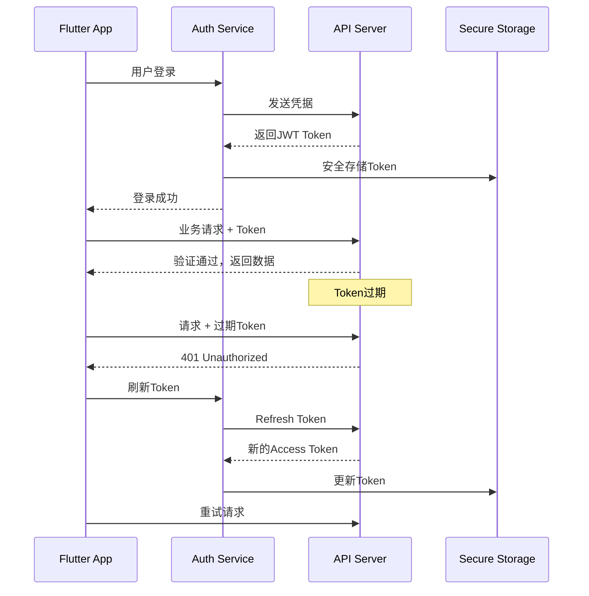

# 安全与认证

> 构建安全可靠的网络通信，保护用户数据和应用安全

## 🔐 认证架构设计

### JWT 认证流程



## 🛡️ 认证管理器

### 核心认证服务

```dart
import 'dart:convert';
import 'package:flutter_secure_storage/flutter_secure_storage.dart';
import 'package:dio/dio.dart';
import 'package:crypto/crypto.dart';

class AuthenticationManager {
  static const String _accessTokenKey = 'access_token';
  static const String _refreshTokenKey = 'refresh_token';
  static const String _userInfoKey = 'user_info';
  
  final FlutterSecureStorage _secureStorage;
  final Dio _dio;
  
  // Token状态流
  final StreamController<AuthState> _authStateController = 
      StreamController<AuthState>.broadcast();
  
  Stream<AuthState> get authStateStream => _authStateController.stream;
  
  AuthenticationManager({
    required Dio dio,
    FlutterSecureStorage? secureStorage,
  }) : _dio = dio,
       _secureStorage = secureStorage ?? const FlutterSecureStorage(
         aOptions: AndroidOptions(
           encryptedSharedPreferences: true,
         ),
         iOptions: IOSOptions(
           accessibility: IOSAccessibility.first_unlock_this_device,
         ),
       );
  
  /// 用户登录
  Future<AuthResult> login({
    required String email,
    required String password,
    String? deviceId,
  }) async {
    try {
      // 生成设备指纹
      final deviceFingerprint = await _generateDeviceFingerprint();
      
      final response = await _dio.post('/auth/login', data: {
        'email': email,
        'password': _hashPassword(password),
        'device_id': deviceId ?? deviceFingerprint,
        'device_info': await _getDeviceInfo(),
      });
      
      final authData = AuthData.fromJson(response.data);
      
      // 安全存储认证信息
      await _storeAuthData(authData);
      
      // 更新认证状态
      _authStateController.add(AuthState.authenticated(authData.user));
      
      return AuthResult.success(authData);
    } on DioException catch (e) {
      return _handleAuthError(e);
    } catch (e) {
      return AuthResult.failure('登录失败: $e');
    }
  }
  
  /// 刷新Token
  Future<bool> refreshToken() async {
    try {
      final refreshToken = await _secureStorage.read(key: _refreshTokenKey);
      if (refreshToken == null) {
        await logout();
        return false;
      }
      
      final response = await _dio.post('/auth/refresh', data: {
        'refresh_token': refreshToken,
      });
      
      final authData = AuthData.fromJson(response.data);
      await _storeAuthData(authData);
      
      return true;
    } catch (e) {
      await logout();
      return false;
    }
  }
  
  /// 获取当前访问Token
  Future<String?> getAccessToken() async {
    return await _secureStorage.read(key: _accessTokenKey);
  }
  
  /// 验证Token有效性
  Future<bool> isTokenValid() async {
    final token = await getAccessToken();
    if (token == null) return false;
    
    try {
      // 解析JWT payload
      final parts = token.split('.');
      if (parts.length != 3) return false;
      
      final payload = json.decode(
        utf8.decode(base64Url.decode(base64Url.normalize(parts[1])))
      );
      
      final exp = payload['exp'] as int;
      final now = DateTime.now().millisecondsSinceEpoch ~/ 1000;
      
      // 提前5分钟刷新
      return exp > (now + 300);
    } catch (e) {
      return false;
    }
  }
  
  /// 用户登出
  Future<void> logout() async {
    try {
      final refreshToken = await _secureStorage.read(key: _refreshTokenKey);
      if (refreshToken != null) {
        // 通知服务器撤销Token
        await _dio.post('/auth/logout', data: {
          'refresh_token': refreshToken,
        });
      }
    } catch (e) {
      // 忽略登出错误
    } finally {
      // 清除本地存储
      await _clearAuthData();
      _authStateController.add(AuthState.unauthenticated());
    }
  }
  
  /// 生成设备指纹
  Future<String> _generateDeviceFingerprint() async {
    final deviceInfo = await _getDeviceInfo();
    final fingerprint = '${deviceInfo['model']}_${deviceInfo['id']}';
    return sha256.convert(utf8.encode(fingerprint)).toString();
  }
  
  /// 获取设备信息
  Future<Map<String, dynamic>> _getDeviceInfo() async {
    // 实际实现中使用 device_info_plus 包
    return {
      'platform': 'flutter',
      'model': 'unknown',
      'id': 'device_id',
      'version': '1.0.0',
    };
  }
  
  /// 密码哈希
  String _hashPassword(String password) {
    return sha256.convert(utf8.encode(password)).toString();
  }
  
  /// 存储认证数据
  Future<void> _storeAuthData(AuthData authData) async {
    await Future.wait([
      _secureStorage.write(key: _accessTokenKey, value: authData.accessToken),
      _secureStorage.write(key: _refreshTokenKey, value: authData.refreshToken),
      _secureStorage.write(key: _userInfoKey, value: json.encode(authData.user.toJson())),
    ]);
  }
  
  /// 清除认证数据
  Future<void> _clearAuthData() async {
    await Future.wait([
      _secureStorage.delete(key: _accessTokenKey),
      _secureStorage.delete(key: _refreshTokenKey),
      _secureStorage.delete(key: _userInfoKey),
    ]);
  }
  
  /// 处理认证错误
  AuthResult _handleAuthError(DioException e) {
    switch (e.response?.statusCode) {
      case 401:
        return AuthResult.failure('用户名或密码错误');
      case 403:
        return AuthResult.failure('账户已被禁用');
      case 429:
        return AuthResult.failure('登录尝试过于频繁，请稍后再试');
      default:
        return AuthResult.failure('网络错误，请检查网络连接');
    }
  }
  
  void dispose() {
    _authStateController.close();
  }
}
```

### 认证数据模型

```dart
// 认证数据模型
class AuthData {
  final String accessToken;
  final String refreshToken;
  final User user;
  final DateTime expiresAt;
  
  const AuthData({
    required this.accessToken,
    required this.refreshToken,
    required this.user,
    required this.expiresAt,
  });
  
  factory AuthData.fromJson(Map<String, dynamic> json) {
    return AuthData(
      accessToken: json['access_token'],
      refreshToken: json['refresh_token'],
      user: User.fromJson(json['user']),
      expiresAt: DateTime.fromMillisecondsSinceEpoch(
        json['expires_at'] * 1000,
      ),
    );
  }
}

// 认证状态
sealed class AuthState {
  const AuthState();
  
  factory AuthState.authenticated(User user) = AuthenticatedState;
  factory AuthState.unauthenticated() = UnauthenticatedState;
  factory AuthState.loading() = LoadingState;
}

class AuthenticatedState extends AuthState {
  final User user;
  const AuthenticatedState(this.user);
}

class UnauthenticatedState extends AuthState {
  const UnauthenticatedState();
}

class LoadingState extends AuthState {
  const LoadingState();
}

// 认证结果
sealed class AuthResult {
  const AuthResult();
  
  factory AuthResult.success(AuthData data) = AuthSuccess;
  factory AuthResult.failure(String message) = AuthFailure;
}

class AuthSuccess extends AuthResult {
  final AuthData data;
  const AuthSuccess(this.data);
}

class AuthFailure extends AuthResult {
  final String message;
  const AuthFailure(this.message);
}
```

## 🔒 认证拦截器

### 自动Token管理拦截器

```dart
class AuthInterceptor extends Interceptor {
  final AuthenticationManager _authManager;
  final Dio _dio;
  
  // 正在刷新Token的Future，避免并发刷新
  Future<bool>? _refreshFuture;
  
  AuthInterceptor({
    required AuthenticationManager authManager,
    required Dio dio,
  }) : _authManager = authManager,
       _dio = dio;
  
  @override
  void onRequest(
    RequestOptions options,
    RequestInterceptorHandler handler,
  ) async {
    // 跳过认证相关的请求
    if (_isAuthRequest(options.path)) {
      return handler.next(options);
    }
    
    try {
      // 检查Token有效性
      if (!await _authManager.isTokenValid()) {
        // 尝试刷新Token
        final refreshed = await _refreshTokenIfNeeded();
        if (!refreshed) {
          return handler.reject(
            DioException(
              requestOptions: options,
              type: DioExceptionType.cancel,
              error: 'Token已过期，请重新登录',
            ),
          );
        }
      }
      
      // 添加Authorization头
      final token = await _authManager.getAccessToken();
      if (token != null) {
        options.headers['Authorization'] = 'Bearer $token';
      }
      
      handler.next(options);
    } catch (e) {
      handler.reject(
        DioException(
          requestOptions: options,
          type: DioExceptionType.unknown,
          error: e,
        ),
      );
    }
  }
  
  @override
  void onError(
    DioException err,
    ErrorInterceptorHandler handler,
  ) async {
    // 处理401未授权错误
    if (err.response?.statusCode == 401 && 
        !_isAuthRequest(err.requestOptions.path)) {
      
      try {
        // 尝试刷新Token
        final refreshed = await _refreshTokenIfNeeded();
        if (refreshed) {
          // 重试原始请求
          final retryResponse = await _retryRequest(err.requestOptions);
          return handler.resolve(retryResponse);
        }
      } catch (e) {
        // 刷新失败，清除认证状态
        await _authManager.logout();
      }
    }
    
    handler.next(err);
  }
  
  /// 刷新Token（防止并发）
  Future<bool> _refreshTokenIfNeeded() async {
    // 如果已经在刷新，等待结果
    if (_refreshFuture != null) {
      return await _refreshFuture!;
    }
    
    // 开始刷新
    _refreshFuture = _authManager.refreshToken();
    
    try {
      final result = await _refreshFuture!;
      return result;
    } finally {
      _refreshFuture = null;
    }
  }
  
  /// 重试请求
  Future<Response> _retryRequest(RequestOptions options) async {
    // 更新Authorization头
    final token = await _authManager.getAccessToken();
    if (token != null) {
      options.headers['Authorization'] = 'Bearer $token';
    }
    
    return await _dio.fetch(options);
  }
  
  /// 判断是否为认证相关请求
  bool _isAuthRequest(String path) {
    return path.contains('/auth/') || 
           path.contains('/login') || 
           path.contains('/register');
  }
}
```

## 🛡️ 网络安全措施

### SSL/TLS 证书固定

```dart
class CertificatePinningInterceptor extends Interceptor {
  final List<String> _pinnedCertificates;
  
  CertificatePinningInterceptor({
    required List<String> pinnedCertificates,
  }) : _pinnedCertificates = pinnedCertificates;
  
  @override
  void onRequest(
    RequestOptions options,
    RequestInterceptorHandler handler,
  ) {
    // 配置证书固定
    (options.extra['dio_certificate_pinning_interceptor'] as HttpClientAdapter?)
        ?.onHttpClientCreate = (client) {
      client.badCertificateCallback = (cert, host, port) {
        // 验证证书指纹
        final certFingerprint = _getCertificateFingerprint(cert);
        return _pinnedCertificates.contains(certFingerprint);
      };
      return client;
    };
    
    handler.next(options);
  }
  
  String _getCertificateFingerprint(X509Certificate cert) {
    final bytes = cert.der;
    final digest = sha256.convert(bytes);
    return digest.toString();
  }
}
```

### 请求签名验证

```dart
class RequestSignatureInterceptor extends Interceptor {
  final String _secretKey;
  final String _appId;
  
  RequestSignatureInterceptor({
    required String secretKey,
    required String appId,
  }) : _secretKey = secretKey,
       _appId = appId;
  
  @override
  void onRequest(
    RequestOptions options,
    RequestInterceptorHandler handler,
  ) {
    final timestamp = DateTime.now().millisecondsSinceEpoch.toString();
    final nonce = _generateNonce();
    
    // 构建签名字符串
    final signatureString = _buildSignatureString(
      method: options.method,
      path: options.path,
      timestamp: timestamp,
      nonce: nonce,
      body: options.data?.toString() ?? '',
    );
    
    // 生成签名
    final signature = _generateSignature(signatureString);
    
    // 添加签名头
    options.headers.addAll({
      'X-App-Id': _appId,
      'X-Timestamp': timestamp,
      'X-Nonce': nonce,
      'X-Signature': signature,
    });
    
    handler.next(options);
  }
  
  String _buildSignatureString({
    required String method,
    required String path,
    required String timestamp,
    required String nonce,
    required String body,
  }) {
    return '$method\n$path\n$timestamp\n$nonce\n$body';
  }
  
  String _generateSignature(String data) {
    final key = utf8.encode(_secretKey);
    final bytes = utf8.encode(data);
    final hmac = Hmac(sha256, key);
    final digest = hmac.convert(bytes);
    return base64.encode(digest.bytes);
  }
  
  String _generateNonce() {
    final random = Random.secure();
    final bytes = List<int>.generate(16, (i) => random.nextInt(256));
    return base64.encode(bytes);
  }
}
```

## 🔐 数据加密

### 敏感数据加密服务

```dart
class EncryptionService {
  static const String _algorithm = 'AES';
  static const int _keyLength = 32; // 256 bits
  static const int _ivLength = 16;  // 128 bits
  
  final String _encryptionKey;
  
  EncryptionService({required String encryptionKey}) 
      : _encryptionKey = encryptionKey;
  
  /// 加密数据
  String encrypt(String plainText) {
    try {
      final key = _deriveKey(_encryptionKey);
      final iv = _generateIV();
      
      final encrypter = Encrypter(AES(key));
      final encrypted = encrypter.encrypt(plainText, iv: iv);
      
      // 组合IV和加密数据
      final combined = iv.bytes + encrypted.bytes;
      return base64.encode(combined);
    } catch (e) {
      throw EncryptionException('加密失败: $e');
    }
  }
  
  /// 解密数据
  String decrypt(String encryptedData) {
    try {
      final combined = base64.decode(encryptedData);
      
      // 分离IV和加密数据
      final iv = IV(combined.sublist(0, _ivLength));
      final encrypted = Encrypted(combined.sublist(_ivLength));
      
      final key = _deriveKey(_encryptionKey);
      final encrypter = Encrypter(AES(key));
      
      return encrypter.decrypt(encrypted, iv: iv);
    } catch (e) {
      throw EncryptionException('解密失败: $e');
    }
  }
  
  /// 派生密钥
  Key _deriveKey(String password) {
    final salt = utf8.encode('flutter_app_salt'); // 实际应用中使用随机盐
    final pbkdf2 = PBKDF2KeyDerivator(HMac(SHA256Digest(), 64));
    
    pbkdf2.init(Pbkdf2Parameters(salt, 10000, _keyLength));
    
    final key = pbkdf2.process(utf8.encode(password));
    return Key(key);
  }
  
  /// 生成随机IV
  IV _generateIV() {
    final random = Random.secure();
    final bytes = List<int>.generate(_ivLength, (i) => random.nextInt(256));
    return IV(Uint8List.fromList(bytes));
  }
}

class EncryptionException implements Exception {
  final String message;
  const EncryptionException(this.message);
  
  @override
  String toString() => 'EncryptionException: $message';
}
```

### 敏感数据传输拦截器

```dart
class DataEncryptionInterceptor extends Interceptor {
  final EncryptionService _encryptionService;
  final List<String> _encryptedFields;
  
  DataEncryptionInterceptor({
    required EncryptionService encryptionService,
    required List<String> encryptedFields,
  }) : _encryptionService = encryptionService,
       _encryptedFields = encryptedFields;
  
  @override
  void onRequest(
    RequestOptions options,
    RequestInterceptorHandler handler,
  ) {
    // 加密请求数据
    if (options.data is Map<String, dynamic>) {
      options.data = _encryptSensitiveFields(options.data);
    }
    
    handler.next(options);
  }
  
  @override
  void onResponse(
    Response response,
    ResponseInterceptorHandler handler,
  ) {
    // 解密响应数据
    if (response.data is Map<String, dynamic>) {
      response.data = _decryptSensitiveFields(response.data);
    }
    
    handler.next(response);
  }
  
  Map<String, dynamic> _encryptSensitiveFields(Map<String, dynamic> data) {
    final result = Map<String, dynamic>.from(data);
    
    for (final field in _encryptedFields) {
      if (result.containsKey(field) && result[field] is String) {
        result[field] = _encryptionService.encrypt(result[field]);
      }
    }
    
    return result;
  }
  
  Map<String, dynamic> _decryptSensitiveFields(Map<String, dynamic> data) {
    final result = Map<String, dynamic>.from(data);
    
    for (final field in _encryptedFields) {
      if (result.containsKey(field) && result[field] is String) {
        try {
          result[field] = _encryptionService.decrypt(result[field]);
        } catch (e) {
          // 解密失败，保持原值
        }
      }
    }
    
    return result;
  }
}
```

## 🔍 安全审计

### 安全事件记录器

```dart
class SecurityAuditLogger {
  final List<SecurityEvent> _events = [];
  final StreamController<SecurityEvent> _eventController = 
      StreamController<SecurityEvent>.broadcast();
  
  Stream<SecurityEvent> get eventStream => _eventController.stream;
  
  /// 记录安全事件
  void logEvent(SecurityEventType type, {
    String? description,
    Map<String, dynamic>? metadata,
    SecurityLevel level = SecurityLevel.info,
  }) {
    final event = SecurityEvent(
      type: type,
      description: description,
      metadata: metadata,
      level: level,
      timestamp: DateTime.now(),
    );
    
    _events.add(event);
    _eventController.add(event);
    
    // 高风险事件立即上报
    if (level == SecurityLevel.critical) {
      _reportCriticalEvent(event);
    }
  }
  
  /// 获取安全事件历史
  List<SecurityEvent> getEvents({
    SecurityEventType? type,
    SecurityLevel? level,
    DateTime? since,
  }) {
    return _events.where((event) {
      if (type != null && event.type != type) return false;
      if (level != null && event.level != level) return false;
      if (since != null && event.timestamp.isBefore(since)) return false;
      return true;
    }).toList();
  }
  
  /// 上报关键安全事件
  Future<void> _reportCriticalEvent(SecurityEvent event) async {
    try {
      // 发送到安全监控服务
      await Dio().post('/security/events', data: event.toJson());
    } catch (e) {
      // 记录上报失败
    }
  }
  
  void dispose() {
    _eventController.close();
  }
}

// 安全事件模型
class SecurityEvent {
  final SecurityEventType type;
  final String? description;
  final Map<String, dynamic>? metadata;
  final SecurityLevel level;
  final DateTime timestamp;
  
  const SecurityEvent({
    required this.type,
    this.description,
    this.metadata,
    required this.level,
    required this.timestamp,
  });
  
  Map<String, dynamic> toJson() => {
    'type': type.name,
    'description': description,
    'metadata': metadata,
    'level': level.name,
    'timestamp': timestamp.toIso8601String(),
  };
}

enum SecurityEventType {
  login,
  logout,
  tokenRefresh,
  authFailure,
  suspiciousActivity,
  dataAccess,
  encryptionFailure,
}

enum SecurityLevel {
  info,
  warning,
  error,
  critical,
}
```

## 📋 最佳实践

### 安全配置检查清单

```dart
class SecurityConfigValidator {
  static List<SecurityIssue> validateConfiguration({
    required AuthenticationManager authManager,
    required List<Interceptor> interceptors,
    required Map<String, dynamic> networkConfig,
  }) {
    final issues = <SecurityIssue>[];
    
    // 检查认证配置
    _validateAuthConfig(authManager, issues);
    
    // 检查拦截器配置
    _validateInterceptors(interceptors, issues);
    
    // 检查网络配置
    _validateNetworkConfig(networkConfig, issues);
    
    return issues;
  }
  
  static void _validateAuthConfig(
    AuthenticationManager authManager,
    List<SecurityIssue> issues,
  ) {
    // 检查Token存储安全性
    if (!_isSecureStorageEnabled()) {
      issues.add(SecurityIssue(
        type: SecurityIssueType.insecureStorage,
        message: '未启用安全存储，Token可能被恶意应用访问',
        severity: SecuritySeverity.high,
      ));
    }
  }
  
  static void _validateInterceptors(
    List<Interceptor> interceptors,
    List<SecurityIssue> issues,
  ) {
    // 检查是否有认证拦截器
    final hasAuthInterceptor = interceptors
        .any((interceptor) => interceptor is AuthInterceptor);
    
    if (!hasAuthInterceptor) {
      issues.add(SecurityIssue(
        type: SecurityIssueType.missingAuthInterceptor,
        message: '缺少认证拦截器，可能导致未授权访问',
        severity: SecuritySeverity.critical,
      ));
    }
    
    // 检查是否有证书固定
    final hasCertPinning = interceptors
        .any((interceptor) => interceptor is CertificatePinningInterceptor);
    
    if (!hasCertPinning) {
      issues.add(SecurityIssue(
        type: SecurityIssueType.noCertificatePinning,
        message: '未配置证书固定，可能受到中间人攻击',
        severity: SecuritySeverity.medium,
      ));
    }
  }
  
  static void _validateNetworkConfig(
    Map<String, dynamic> config,
    List<SecurityIssue> issues,
  ) {
    // 检查HTTPS使用
    final baseUrl = config['baseUrl'] as String?;
    if (baseUrl != null && !baseUrl.startsWith('https://')) {
      issues.add(SecurityIssue(
        type: SecurityIssueType.insecureProtocol,
        message: '使用HTTP协议，数据传输不安全',
        severity: SecuritySeverity.critical,
      ));
    }
    
    // 检查超时配置
    final connectTimeout = config['connectTimeout'] as int?;
    if (connectTimeout == null || connectTimeout > 30000) {
      issues.add(SecurityIssue(
        type: SecurityIssueType.longTimeout,
        message: '连接超时时间过长，可能导致资源耗尽',
        severity: SecuritySeverity.low,
      ));
    }
  }
  
  static bool _isSecureStorageEnabled() {
    // 检查是否使用了安全存储
    return true; // 简化实现
  }
}

class SecurityIssue {
  final SecurityIssueType type;
  final String message;
  final SecuritySeverity severity;
  
  const SecurityIssue({
    required this.type,
    required this.message,
    required this.severity,
  });
}

enum SecurityIssueType {
  insecureStorage,
  missingAuthInterceptor,
  noCertificatePinning,
  insecureProtocol,
  longTimeout,
}

enum SecuritySeverity {
  low,
  medium,
  high,
  critical,
}
```

### 性能与安全平衡

```dart
// 安全配置建议
class SecurityRecommendations {
  static const Map<String, dynamic> recommendedConfig = {
    // 认证配置
    'auth': {
      'tokenRefreshThreshold': 300, // 5分钟前刷新
      'maxRetryAttempts': 3,
      'lockoutDuration': 900, // 15分钟锁定
    },
    
    // 加密配置
    'encryption': {
      'algorithm': 'AES-256-GCM',
      'keyDerivationIterations': 10000,
      'saltLength': 32,
    },
    
    // 网络配置
    'network': {
      'connectTimeout': 15000,
      'receiveTimeout': 30000,
      'maxRedirects': 3,
      'validateCertificate': true,
    },
    
    // 审计配置
    'audit': {
      'logLevel': 'warning',
      'maxEventHistory': 1000,
      'criticalEventUpload': true,
    },
  };
}
```

## 🔧 调试与监控

### 安全调试工具

```dart
class SecurityDebugger {
  static void enableSecurityDebugging() {
    if (kDebugMode) {
      // 启用详细的安全日志
      Logger.root.level = Level.ALL;
      Logger.root.onRecord.listen((record) {
        if (record.loggerName.contains('security')) {
          print('🔒 ${record.level.name}: ${record.message}');
        }
      });
    }
  }
  
  static void logTokenInfo(String token) {
    if (kDebugMode) {
      try {
        final parts = token.split('.');
        final payload = json.decode(
          utf8.decode(base64Url.decode(base64Url.normalize(parts[1])))
        );
        
        print('🔑 Token Info:');
        print('  - Issuer: ${payload['iss']}');
        print('  - Subject: ${payload['sub']}');
        print('  - Expires: ${DateTime.fromMillisecondsSinceEpoch(payload['exp'] * 1000)}');
        print('  - Issued: ${DateTime.fromMillisecondsSinceEpoch(payload['iat'] * 1000)}');
      } catch (e) {
        print('❌ Invalid token format');
      }
    }
  }
}
```

---

## 📚 总结

本章详细介绍了Flutter应用的安全与认证实现：

### 核心特性
- **JWT认证管理**：完整的Token生命周期管理
- **自动Token刷新**：无感知的认证状态维护
- **安全存储**：使用加密存储保护敏感数据
- **证书固定**：防止中间人攻击
- **数据加密**：端到端数据保护
- **安全审计**：完整的安全事件追踪

### 最佳实践
- 使用HTTPS协议进行所有网络通信
- 实施证书固定防止中间人攻击
- 加密存储所有敏感数据
- 实现自动Token刷新机制
- 建立完善的安全审计体系
- 定期进行安全配置检查

通过这些安全措施，可以构建一个安全可靠的网络通信系统，保护用户数据和应用安全。