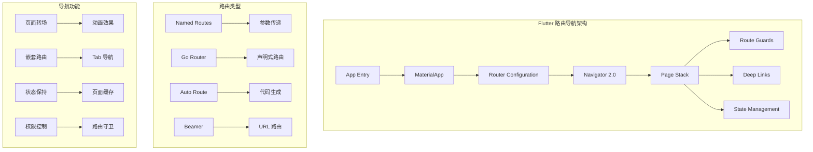
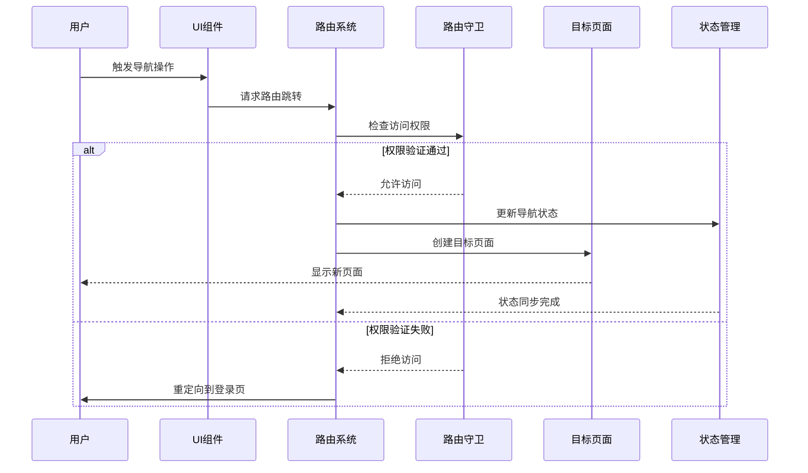
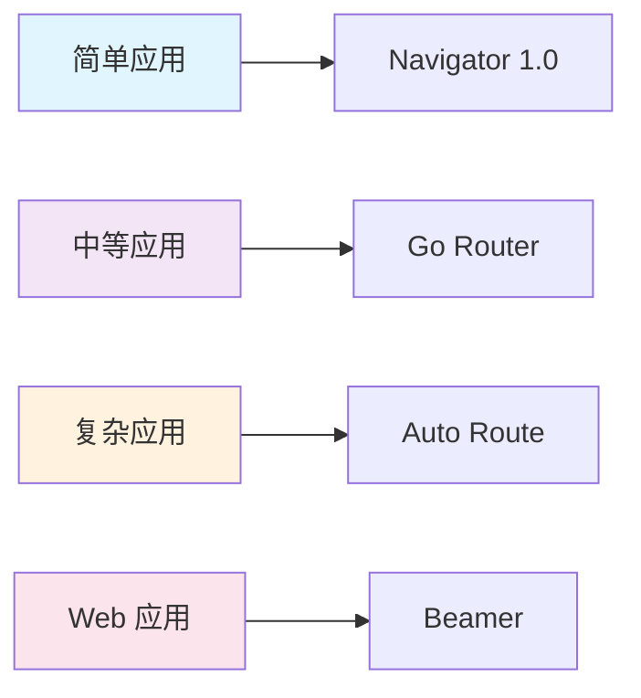
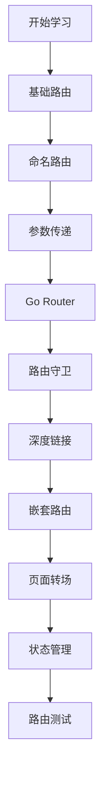

# 🧭 Flutter 路由导航深度指南

> 掌握 Flutter 路由系统，构建流畅的页面导航体验，实现复杂的应用导航架构


## 📋 目录导航

<details>
<summary>🎯 快速导航</summary>

### 🚀 基础篇

- [🧭 基础路由系统](basic-routing.md) - Navigator 1.0 和命名路由
- [📱 声明式路由](declarative-routing.md) - Navigator 2.0 和 Go Router
- [🛡️ 路由守卫](route-guards.md) - 权限控制和页面保护

### 🎨 高级篇

- [🔗 深度链接](deep-linking.md) - URL 路由和外部链接处理
- [🎬 页面转场](page-transitions.md) - 自定义转场动画效果
- [🏗️ 嵌套路由](nested-routing.md) - 复杂页面结构的路由管理

### 🛠️ 实战篇

- [💾 状态管理](navigation-state.md) - 页面状态的保存和恢复
- [🧪 路由测试](routing-testing.md) - 导航逻辑的单元测试

</details>

## 🏗️ 路由导航架构总览

### 整体架构图



### 导航流程图



## 🎯 核心学习目标

### 📚 理论知识

- ✅ 深入理解 Flutter 路由系统架构
- ✅ 掌握 Navigator 1.0 和 2.0 的区别
- ✅ 了解声明式路由的优势和实现
- ✅ 学会路由守卫和权限控制机制

### 🛠️ 实践技能

- ✅ 熟练使用 Go Router 和 Auto Route
- ✅ 掌握深度链接和 URL 路由处理
- ✅ 学会自定义页面转场动画
- ✅ 能够设计复杂的嵌套路由架构

### 🎨 架构能力

- ✅ 理解路由状态管理策略
- ✅ 掌握路由测试方法
- ✅ 学会性能优化技巧
- ✅ 能够处理复杂业务场景

## 🚀 快速开始

### 1. 环境准备

```bash
# 检查 Flutter 环境
flutter doctor

# 创建新项目
flutter create routing_demo
cd routing_demo

# 添加路由依赖
flutter pub add go_router auto_route beamer
flutter pub add --dev auto_route_generator build_runner
```

### 2. 基础路由配置

```dart
import 'package:flutter/material.dart';
import 'package:go_router/go_router.dart';

void main() {
  runApp(MyApp());
}

class MyApp extends StatelessWidget {
  MyApp({super.key});

  // 定义路由配置
  final GoRouter _router = GoRouter(
    initialLocation: '/',
    routes: [
      GoRoute(
        path: '/',
        name: 'home',
        builder: (context, state) => const HomePage(),
        routes: [
          GoRoute(
            path: 'profile/:userId',
            name: 'profile',
            builder: (context, state) {
              final userId = state.pathParameters['userId']!;
              return ProfilePage(userId: userId);
            },
          ),
          GoRoute(
            path: 'settings',
            name: 'settings',
            builder: (context, state) => const SettingsPage(),
          ),
        ],
      ),
      GoRoute(
        path: '/login',
        name: 'login',
        builder: (context, state) => const LoginPage(),
      ),
    ],
    // 路由守卫
    redirect: (context, state) {
      final isLoggedIn = AuthService.instance.isLoggedIn;
      final isLoggingIn = state.location == '/login';

      if (!isLoggedIn && !isLoggingIn) {
        return '/login';
      }

      if (isLoggedIn && isLoggingIn) {
        return '/';
      }

      return null;
    },
  );

  @override
  Widget build(BuildContext context) {
    return MaterialApp.router(
      title: '路由导航示例',
      theme: ThemeData(
        primarySwatch: Colors.blue,
        visualDensity: VisualDensity.adaptivePlatformDensity,
      ),
      routerConfig: _router,
    );
  }
}
```

### 3. 页面组件示例

```dart
// 首页组件
class HomePage extends StatelessWidget {
  const HomePage({super.key});

  @override
  Widget build(BuildContext context) {
    return Scaffold(
      appBar: AppBar(
        title: const Text('首页'),
        actions: [
          IconButton(
            icon: const Icon(Icons.settings),
            onPressed: () => context.pushNamed('settings'),
          ),
        ],
      ),
      body: Center(
        child: Column(
          mainAxisAlignment: MainAxisAlignment.center,
          children: [
            const Text(
              '欢迎来到首页',
              style: TextStyle(fontSize: 24),
            ),
            const SizedBox(height: 20),

            // 导航到个人资料页
            ElevatedButton(
              onPressed: () => context.pushNamed(
                'profile',
                pathParameters: {'userId': '123'},
              ),
              child: const Text('查看个人资料'),
            ),

            const SizedBox(height: 10),

            // 导航到设置页
            ElevatedButton(
              onPressed: () => context.pushNamed('settings'),
              child: const Text('设置'),
            ),
          ],
        ),
      ),
    );
  }
}

// 个人资料页组件
class ProfilePage extends StatelessWidget {
  final String userId;

  const ProfilePage({super.key, required this.userId});

  @override
  Widget build(BuildContext context) {
    return Scaffold(
      appBar: AppBar(
        title: Text('用户 $userId 的资料'),
        leading: IconButton(
          icon: const Icon(Icons.arrow_back),
          onPressed: () => context.pop(),
        ),
      ),
      body: Center(
        child: Column(
          mainAxisAlignment: MainAxisAlignment.center,
          children: [
            CircleAvatar(
              radius: 50,
              backgroundImage: NetworkImage(
                'https://via.placeholder.com/100x100?text=User$userId',
              ),
            ),
            const SizedBox(height: 20),
            Text(
              '用户 ID: $userId',
              style: const TextStyle(fontSize: 18),
            ),
            const SizedBox(height: 10),
            const Text('这是用户的详细资料页面'),
          ],
        ),
      ),
    );
  }
}
```

## 📊 路由方案对比

### 路由库特性对比

| 特性     | Navigator 1.0 | Go Router  | Auto Route | Beamer     |
| -------- | ------------- | ---------- | ---------- | ---------- |
| 学习成本 | ⭐⭐⭐⭐⭐    | ⭐⭐⭐⭐   | ⭐⭐⭐     | ⭐⭐⭐⭐   |
| 类型安全 | ⭐⭐          | ⭐⭐⭐⭐   | ⭐⭐⭐⭐⭐ | ⭐⭐⭐     |
| 代码生成 | ❌            | ❌         | ✅         | ❌         |
| 深度链接 | ⭐⭐⭐        | ⭐⭐⭐⭐⭐ | ⭐⭐⭐⭐   | ⭐⭐⭐⭐⭐ |
| 嵌套路由 | ⭐⭐⭐        | ⭐⭐⭐⭐⭐ | ⭐⭐⭐⭐⭐ | ⭐⭐⭐⭐   |
| 路由守卫 | ⭐⭐          | ⭐⭐⭐⭐⭐ | ⭐⭐⭐⭐   | ⭐⭐⭐⭐   |
| 性能     | ⭐⭐⭐⭐      | ⭐⭐⭐⭐⭐ | ⭐⭐⭐⭐   | ⭐⭐⭐⭐   |

### 使用场景建议



### 选择指南

#### 🎯 选择 Navigator 1.0 的场景

- 简单的页面导航需求
- 快速原型开发
- 团队对传统路由熟悉
- 不需要复杂的路由功能

#### ⚡ 选择 Go Router 的场景

- 需要深度链接支持
- 复杂的嵌套路由结构
- 路由守卫和权限控制
- 现代化的路由解决方案

#### 🚀 选择 Auto Route 的场景

- 需要类型安全的路由
- 大型企业级应用
- 复杂的路由参数处理
- 代码生成的优势

#### 🌐 选择 Beamer 的场景

- Web 应用开发
- URL 驱动的路由
- 需要 SEO 优化
- 多平台路由一致性

## 🎨 设计模式应用

### 1. 策略模式 (Strategy Pattern)

```dart
// 路由策略
abstract class RoutingStrategy {
  Future<void> navigate(String route, {Map<String, dynamic>? arguments});
  void pop();
  bool canPop();
}

class GoRouterStrategy implements RoutingStrategy {
  final GoRouter router;

  GoRouterStrategy(this.router);

  @override
  Future<void> navigate(String route, {Map<String, dynamic>? arguments}) async {
    await router.push(route, extra: arguments);
  }

  @override
  void pop() {
    router.pop();
  }

  @override
  bool canPop() {
    return router.canPop();
  }
}

class NavigatorStrategy implements RoutingStrategy {
  final NavigatorState navigator;

  NavigatorStrategy(this.navigator);

  @override
  Future<void> navigate(String route, {Map<String, dynamic>? arguments}) async {
    await navigator.pushNamed(route, arguments: arguments);
  }

  @override
  void pop() {
    navigator.pop();
  }

  @override
  bool canPop() {
    return navigator.canPop();
  }
}
```

### 2. 观察者模式 (Observer Pattern)

```dart
// 路由状态监听
class RouteObserver extends NavigatorObserver {
  @override
  void didPush(Route<dynamic> route, Route<dynamic>? previousRoute) {
    super.didPush(route, previousRoute);
    print('🔄 页面推入: ${route.settings.name}');

    // 通知路由状态变化
    RouteStateManager.instance.notifyRouteChanged(
      currentRoute: route.settings.name,
      previousRoute: previousRoute?.settings.name,
      action: RouteAction.push,
    );
  }

  @override
  void didPop(Route<dynamic> route, Route<dynamic>? previousRoute) {
    super.didPop(route, previousRoute);
    print('🔄 页面弹出: ${route.settings.name}');

    RouteStateManager.instance.notifyRouteChanged(
      currentRoute: previousRoute?.settings.name,
      previousRoute: route.settings.name,
      action: RouteAction.pop,
    );
  }
}

class RouteStateManager extends ChangeNotifier {
  static RouteStateManager? _instance;
  static RouteStateManager get instance => _instance ??= RouteStateManager._();

  RouteStateManager._();

  String? _currentRoute;
  String? get currentRoute => _currentRoute;

  void notifyRouteChanged({
    String? currentRoute,
    String? previousRoute,
    required RouteAction action,
  }) {
    _currentRoute = currentRoute;
    notifyListeners();

    // 记录路由历史
    _addToHistory(currentRoute, action);
  }

  final List<RouteHistory> _history = [];
  List<RouteHistory> get history => List.unmodifiable(_history);

  void _addToHistory(String? route, RouteAction action) {
    _history.add(RouteHistory(
      route: route,
      action: action,
      timestamp: DateTime.now(),
    ));
  }
}

enum RouteAction { push, pop, replace, remove }

class RouteHistory {
  final String? route;
  final RouteAction action;
  final DateTime timestamp;

  RouteHistory({
    required this.route,
    required this.action,
    required this.timestamp,
  });
}
```

### 3. 工厂模式 (Factory Pattern)

```dart
// 路由工厂
class RouteFactory {
  static Route<dynamic> createRoute({
    required String routeName,
    required WidgetBuilder builder,
    RouteSettings? settings,
    bool fullscreenDialog = false,
    bool maintainState = true,
    bool opaque = true,
  }) {
    return MaterialPageRoute(
      builder: builder,
      settings: settings ?? RouteSettings(name: routeName),
      fullscreenDialog: fullscreenDialog,
      maintainState: maintainState,
      opaque: opaque,
    );
  }

  static Route<dynamic> createCustomRoute({
    required String routeName,
    required WidgetBuilder builder,
    RouteSettings? settings,
    Duration transitionDuration = const Duration(milliseconds: 300),
  }) {
    return PageRouteBuilder(
      pageBuilder: (context, animation, secondaryAnimation) => builder(context),
      transitionsBuilder: (context, animation, secondaryAnimation, child) {
        const begin = Offset(1.0, 0.0);
        const end = Offset.zero;
        const curve = Curves.easeInOut;

        var tween = Tween(begin: begin, end: end).chain(
          CurveTween(curve: curve),
        );

        return SlideTransition(
          position: animation.drive(tween),
          child: child,
        );
      },
      settings: settings ?? RouteSettings(name: routeName),
      transitionDuration: transitionDuration,
    );
  }
}
```

## 🔧 开发工具推荐

### 📱 调试工具

- **Flutter Inspector**: 查看路由栈和页面结构
- **Go Router Inspector**: Go Router 专用调试工具
- **Route Debugger**: 路由调试和日志工具

### 🎨 设计工具

- **Figma**: 页面流程设计
- **Draw.io**: 路由架构图绘制
- **Mermaid**: 代码中的流程图

### 📚 学习资源

- **官方文档**: 各路由库的官方文档
- **GitHub 示例**: 官方示例项目
- **社区博客**: 技术博客和教程

## 📈 学习路径建议



### 🎯 阶段目标

#### 第一阶段：基础掌握

- [ ] 理解 Flutter 路由系统基础概念
- [ ] 掌握 Navigator 1.0 的使用方法
- [ ] 学会命名路由和参数传递
- [ ] 完成简单的页面导航应用

#### 第二阶段：进阶学习

- [ ] 深入学习 Go Router 配置
- [ ] 掌握路由守卫和权限控制
- [ ] 学会深度链接处理
- [ ] 完成中等复杂度的路由应用

#### 第三阶段：高级应用

- [ ] 掌握嵌套路由和复杂导航
- [ ] 学会自定义页面转场动画
- [ ] 理解路由状态管理
- [ ] 完成大型应用的路由架构

#### 第四阶段：实战项目

- [ ] 完成完整的商业级应用
- [ ] 掌握路由测试方法
- [ ] 学会性能优化技巧
- [ ] 参与开源项目贡献

## 🏆 最佳实践

### 📝 代码规范

```dart
// ✅ 推荐：使用常量定义路由名称
class AppRoutes {
  static const String home = '/';
  static const String profile = '/profile';
  static const String settings = '/settings';
  static const String login = '/login';

  // 动态路由参数
  static String profileWithId(String userId) => '/profile/$userId';
  static String productDetail(String productId) => '/product/$productId';
}

// ✅ 推荐：类型安全的路由参数
class RouteParams {
  final String? userId;
  final String? productId;
  final Map<String, dynamic>? extra;

  const RouteParams({
    this.userId,
    this.productId,
    this.extra,
  });
}

// ✅ 推荐：路由服务封装
class NavigationService {
  static final GlobalKey<NavigatorState> navigatorKey =
      GlobalKey<NavigatorState>();

  static Future<T?> pushNamed<T>(
    String routeName, {
    Object? arguments,
  }) {
    return navigatorKey.currentState!.pushNamed<T>(
      routeName,
      arguments: arguments,
    );
  }

  static void pop<T>([T? result]) {
    return navigatorKey.currentState!.pop<T>(result);
  }

  static Future<T?> pushReplacementNamed<T, TO>(
    String routeName, {
    Object? arguments,
  }) {
    return navigatorKey.currentState!.pushReplacementNamed<T, TO>(
      routeName,
      arguments: arguments,
    );
  }
}
```

### 🎨 架构原则

- **单一职责**: 每个路由只负责一个页面
- **开闭原则**: 对扩展开放，对修改关闭
- **依赖倒置**: 依赖抽象而非具体实现
- **接口隔离**: 使用小而精确的接口

### ⚡ 性能优化

- 使用懒加载减少初始包大小
- 合理使用页面缓存
- 优化页面转场动画性能
- 避免不必要的路由重建

### 🧪 测试策略

- 路由单元测试覆盖率 ≥ 90%
- 集成测试覆盖关键用户流程
- 自动化测试集成 CI/CD
- 路由性能基准测试

## 📚 相关资源

### 🔗 官方资源

- [Flutter Navigation 官方文档](https://docs.flutter.dev/development/ui/navigation)
- [Go Router 官方文档](https://pub.dev/packages/go_router)
- [Auto Route 官方文档](https://pub.dev/packages/auto_route)
- [Beamer 官方文档](https://pub.dev/packages/beamer)

### 📖 推荐书籍

- 《Flutter 实战》
- 《Flutter 开发实战详解》
- 《Flutter 技术入门与实战》

### 🎥 视频教程

- [Flutter 官方 YouTube 频道](https://www.youtube.com/c/FlutterDev)
- [B 站 Flutter 教程](https://www.bilibili.com/video/BV1S4411E7LY)

---

## 🎉 开始你的路由导航之旅

现在你已经了解了 Flutter 路由导航的整体架构和学习路径。接下来，让我们从[基础路由系统](basic-routing.md)开始，逐步掌握各种路由技术的使用方法。

记住：**选择合适的路由方案比使用最流行的方案更重要**，根据项目需求和团队能力做出明智的选择！

---

<div align="center">

**🌟 如果这个指南对你有帮助，请给个 Star 支持一下！ 🌟**

[](https://github.com/1989allen126/language-tutorial)
[](https://github.com/1989allen126/language-tutorial)

</div>
