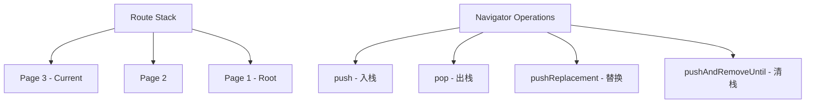

# 基础路由系统

> 掌握Flutter基础路由，构建简单高效的页面导航

## 🧭 Navigator 1.0 基础

### 路由栈概念



### 基础导航操作

```dart
class BasicNavigationExample extends StatelessWidget {
  @override
  Widget build(BuildContext context) {
    return Scaffold(
      appBar: AppBar(title: Text('基础导航')),
      body: Column(
        children: [
          // 基础页面跳转
          ElevatedButton(
            onPressed: () {
              Navigator.push(
                context,
                MaterialPageRoute(
                  builder: (context) => SecondPage(),
                ),
              );
            },
            child: Text('跳转到第二页'),
          ),
          
          // 带返回值的页面跳转
          ElevatedButton(
            onPressed: () async {
              final result = await Navigator.push<String>(
                context,
                MaterialPageRoute(
                  builder: (context) => SelectionPage(),
                ),
              );
              
              if (result != null) {
                ScaffoldMessenger.of(context).showSnackBar(
                  SnackBar(content: Text('选择了: $result')),
                );
              }
            },
            child: Text('选择页面'),
          ),
          
          // 替换当前页面
          ElevatedButton(
            onPressed: () {
              Navigator.pushReplacement(
                context,
                MaterialPageRoute(
                  builder: (context) => ReplacementPage(),
                ),
              );
            },
            child: Text('替换当前页面'),
          ),
          
          // 清空栈并跳转
          ElevatedButton(
            onPressed: () {
              Navigator.pushAndRemoveUntil(
                context,
                MaterialPageRoute(
                  builder: (context) => HomePage(),
                ),
                (route) => false, // 清空所有页面
              );
            },
            child: Text('返回首页'),
          ),
        ],
      ),
    );
  }
}
```

## 📝 命名路由

### 路由表配置

```dart
class AppRoutes {
  // 路由名称常量
  static const String home = '/';
  static const String profile = '/profile';
  static const String settings = '/settings';
  static const String productDetail = '/product';
  static const String checkout = '/checkout';
  
  // 路由生成器
  static Route<dynamic> generateRoute(RouteSettings settings) {
    switch (settings.name) {
      case home:
        return _buildRoute(HomePage(), settings);
        
      case profile:
        final args = settings.arguments as Map<String, dynamic>?;
        return _buildRoute(
          ProfilePage(
            userId: args?['userId'] ?? '',
            isEditable: args?['isEditable'] ?? false,
          ),
          settings,
        );
        
      case settings:
        return _buildRoute(SettingsPage(), settings);
        
      case productDetail:
        final productId = settings.arguments as String?;
        if (productId == null) {
          return _buildRoute(ErrorPage(message: '产品ID不能为空'), settings);
        }
        return _buildRoute(ProductDetailPage(productId: productId), settings);
        
      case checkout:
        final cartItems = settings.arguments as List<CartItem>?;
        if (cartItems == null || cartItems.isEmpty) {
          return _buildRoute(
            ErrorPage(message: '购物车为空'),
            settings,
          );
        }
        return _buildRoute(CheckoutPage(items: cartItems), settings);
        
      default:
        return _buildRoute(
          NotFoundPage(routeName: settings.name ?? 'unknown'),
          settings,
        );
    }
  }
  
  // 统一的路由构建方法
  static Route<dynamic> _buildRoute(Widget page, RouteSettings settings) {
    return PageRouteBuilder(
      settings: settings,
      pageBuilder: (context, animation, secondaryAnimation) => page,
      transitionsBuilder: (context, animation, secondaryAnimation, child) {
        // 自定义转场动画
        const begin = Offset(1.0, 0.0);
        const end = Offset.zero;
        const curve = Curves.easeInOut;
        
        var tween = Tween(begin: begin, end: end).chain(
          CurveTween(curve: curve),
        );
        
        return SlideTransition(
          position: animation.drive(tween),
          child: child,
        );
      },
      transitionDuration: Duration(milliseconds: 300),
    );
  }
}
```

### MaterialApp 配置

```dart
class MyApp extends StatelessWidget {
  @override
  Widget build(BuildContext context) {
    return MaterialApp(
      title: 'Flutter 路由示例',
      
      // 初始路由
      initialRoute: AppRoutes.home,
      
      // 路由生成器
      onGenerateRoute: AppRoutes.generateRoute,
      
      // 未知路由处理
      onUnknownRoute: (settings) {
        return MaterialPageRoute(
          builder: (context) => NotFoundPage(
            routeName: settings.name ?? 'unknown',
          ),
        );
      },
      
      // 导航观察器
      navigatorObservers: [
        RouteObserver<PageRoute>(),
        AnalyticsNavigatorObserver(),
      ],
    );
  }
}
```

## 🔄 参数传递

### 多种参数传递方式

```dart
class ParameterPassingExamples {
  // 1. 通过构造函数传递参数
  static void navigateWithConstructor(BuildContext context) {
    Navigator.push(
      context,
      MaterialPageRoute(
        builder: (context) => UserDetailPage(
          userId: '12345',
          userName: 'John Doe',
          isVip: true,
        ),
      ),
    );
  }
  
  // 2. 通过 arguments 传递参数
  static void navigateWithArguments(BuildContext context) {
    Navigator.pushNamed(
      context,
      AppRoutes.profile,
      arguments: {
        'userId': '12345',
        'userName': 'John Doe',
        'isVip': true,
        'preferences': UserPreferences(
          theme: 'dark',
          language: 'zh-CN',
        ),
      },
    );
  }
  
  // 3. 通过 RouteSettings 传递参数
  static void navigateWithRouteSettings(BuildContext context) {
    Navigator.pushNamed(
      context,
      AppRoutes.productDetail,
      arguments: ProductDetailArgs(
        productId: 'prod_123',
        categoryId: 'cat_456',
        source: 'search_results',
      ),
    );
  }
}

// 类型安全的参数模型
class ProductDetailArgs {
  final String productId;
  final String categoryId;
  final String source;
  
  const ProductDetailArgs({
    required this.productId,
    required this.categoryId,
    required this.source,
  });
  
  // 从 RouteSettings 中提取参数
  static ProductDetailArgs? fromRouteSettings(RouteSettings settings) {
    final args = settings.arguments;
    if (args is ProductDetailArgs) {
      return args;
    }
    return null;
  }
}

// 参数接收页面
class ProductDetailPage extends StatelessWidget {
  final String? productId;
  
  const ProductDetailPage({Key? key, this.productId}) : super(key: key);
  
  @override
  Widget build(BuildContext context) {
    // 从路由参数中获取数据
    final args = ProductDetailArgs.fromRouteSettings(
      ModalRoute.of(context)!.settings,
    );
    
    final actualProductId = productId ?? args?.productId;
    
    if (actualProductId == null) {
      return Scaffold(
        body: Center(
          child: Text('产品ID不能为空'),
        ),
      );
    }
    
    return Scaffold(
      appBar: AppBar(
        title: Text('产品详情'),
      ),
      body: Column(
        children: [
          Text('产品ID: $actualProductId'),
          if (args != null) ..[
            Text('分类ID: ${args.categoryId}'),
            Text('来源: ${args.source}'),
          ],
          
          // 返回结果给上一页
          ElevatedButton(
            onPressed: () {
              Navigator.pop(context, {
                'action': 'add_to_cart',
                'productId': actualProductId,
                'quantity': 1,
              });
            },
            child: Text('添加到购物车'),
          ),
        ],
      ),
    );
  }
}
```

## 🔙 返回值处理

### 页面返回值管理

```dart
class ReturnValueExamples {
  // 等待页面返回值
  static Future<void> handlePageResult(BuildContext context) async {
    final result = await Navigator.push<Map<String, dynamic>>(
      context,
      MaterialPageRoute(
        builder: (context) => SelectionPage(),
      ),
    );
    
    if (result != null) {
      final action = result['action'] as String?;
      
      switch (action) {
        case 'save':
          _handleSaveAction(result);
          break;
        case 'delete':
          _handleDeleteAction(result);
          break;
        case 'cancel':
          _handleCancelAction();
          break;
        default:
          _handleUnknownAction(action);
      }
    }
  }
  
  static void _handleSaveAction(Map<String, dynamic> data) {
    // 处理保存操作
    print('保存数据: ${data['data']}');
  }
  
  static void _handleDeleteAction(Map<String, dynamic> data) {
    // 处理删除操作
    print('删除项目: ${data['itemId']}');
  }
  
  static void _handleCancelAction() {
    // 处理取消操作
    print('用户取消了操作');
  }
  
  static void _handleUnknownAction(String? action) {
    // 处理未知操作
    print('未知操作: $action');
  }
}

// 返回值类型定义
class PageResult<T> {
  final bool success;
  final T? data;
  final String? error;
  
  const PageResult.success(this.data) 
      : success = true, error = null;
  
  const PageResult.failure(this.error) 
      : success = false, data = null;
  
  const PageResult.cancelled() 
      : success = false, data = null, error = null;
}

// 选择页面示例
class SelectionPage extends StatefulWidget {
  @override
  _SelectionPageState createState() => _SelectionPageState();
}

class _SelectionPageState extends State<SelectionPage> {
  String? selectedItem;
  
  @override
  Widget build(BuildContext context) {
    return Scaffold(
      appBar: AppBar(
        title: Text('选择项目'),
        actions: [
          TextButton(
            onPressed: () {
              Navigator.pop(
                context,
                PageResult<String>.cancelled(),
              );
            },
            child: Text('取消'),
          ),
        ],
      ),
      body: Column(
        children: [
          Expanded(
            child: ListView(
              children: [
                _buildSelectionTile('选项 1', 'option_1'),
                _buildSelectionTile('选项 2', 'option_2'),
                _buildSelectionTile('选项 3', 'option_3'),
              ],
            ),
          ),
          
          Padding(
            padding: EdgeInsets.all(16),
            child: Row(
              children: [
                Expanded(
                  child: ElevatedButton(
                    onPressed: selectedItem != null ? () {
                      Navigator.pop(
                        context,
                        PageResult<String>.success(selectedItem!),
                      );
                    } : null,
                    child: Text('确认选择'),
                  ),
                ),
              ],
            ),
          ),
        ],
      ),
    );
  }
  
  Widget _buildSelectionTile(String title, String value) {
    return RadioListTile<String>(
      title: Text(title),
      value: value,
      groupValue: selectedItem,
      onChanged: (value) {
        setState(() {
          selectedItem = value;
        });
      },
    );
  }
}
```

## 🔍 路由栈管理

### 高级栈操作

```dart
class StackManagementService {
  // 获取当前路由栈信息
  static List<Route> getCurrentStack(BuildContext context) {
    final navigator = Navigator.of(context);
    final routes = <Route>[];
    
    navigator.popUntil((route) {
      routes.add(route);
      return route.isFirst;
    });
    
    return routes.reversed.toList();
  }
  
  // 检查特定路由是否在栈中
  static bool isRouteInStack(BuildContext context, String routeName) {
    bool found = false;
    
    Navigator.of(context).popUntil((route) {
      if (route.settings.name == routeName) {
        found = true;
      }
      return route.isFirst;
    });
    
    return found;
  }
  
  // 弹出到特定路由
  static void popToRoute(BuildContext context, String routeName) {
    Navigator.of(context).popUntil((route) {
      return route.settings.name == routeName;
    });
  }
  
  // 清空栈并导航到新页面
  static void clearStackAndNavigate(
    BuildContext context,
    String routeName, {
    Object? arguments,
  }) {
    Navigator.of(context).pushNamedAndRemoveUntil(
      routeName,
      (route) => false,
      arguments: arguments,
    );
  }
  
  // 替换栈中的特定路由
  static void replaceRouteInStack(
    BuildContext context,
    String oldRouteName,
    String newRouteName, {
    Object? arguments,
  }) {
    // 先弹出到目标路由的上一级
    Navigator.of(context).popUntil((route) {
      return route.settings.name != oldRouteName;
    });
    
    // 然后推入新路由
    Navigator.of(context).pushNamed(
      newRouteName,
      arguments: arguments,
    );
  }
}

// 路由栈监控器
class RouteStackMonitor extends NavigatorObserver {
  final List<Route> _routeStack = [];
  
  List<Route> get routeStack => List.unmodifiable(_routeStack);
  
  @override
  void didPush(Route route, Route? previousRoute) {
    super.didPush(route, previousRoute);
    _routeStack.add(route);
    _logStackChange('PUSH', route);
  }
  
  @override
  void didPop(Route route, Route? previousRoute) {
    super.didPop(route, previousRoute);
    _routeStack.remove(route);
    _logStackChange('POP', route);
  }
  
  @override
  void didReplace({Route? newRoute, Route? oldRoute}) {
    super.didReplace(newRoute: newRoute, oldRoute: oldRoute);
    if (oldRoute != null) {
      _routeStack.remove(oldRoute);
    }
    if (newRoute != null) {
      _routeStack.add(newRoute);
    }
    _logStackChange('REPLACE', newRoute, oldRoute: oldRoute);
  }
  
  @override
  void didRemove(Route route, Route? previousRoute) {
    super.didRemove(route, previousRoute);
    _routeStack.remove(route);
    _logStackChange('REMOVE', route);
  }
  
  void _logStackChange(String operation, Route? route, {Route? oldRoute}) {
    if (kDebugMode) {
      print('🧭 Route Stack $operation:');
      print('  Current: ${route?.settings.name}');
      if (oldRoute != null) {
        print('  Previous: ${oldRoute.settings.name}');
      }
      print('  Stack size: ${_routeStack.length}');
      print('  Stack: ${_routeStack.map((r) => r.settings.name).join(' -> ')}');
    }
  }
  
  // 获取栈深度
  int get stackDepth => _routeStack.length;
  
  // 获取当前路由
  Route? get currentRoute => _routeStack.isNotEmpty ? _routeStack.last : null;
  
  // 获取根路由
  Route? get rootRoute => _routeStack.isNotEmpty ? _routeStack.first : null;
}
```

## 🎯 路由中间件

### 路由拦截器

```dart
class RouteInterceptor {
  static final List<RouteGuard> _guards = [];
  
  // 注册路由守卫
  static void registerGuard(RouteGuard guard) {
    _guards.add(guard);
  }
  
  // 检查路由权限
  static Future<RouteResult> checkRoute(
    BuildContext context,
    RouteSettings settings,
  ) async {
    for (final guard in _guards) {
      final result = await guard.canActivate(context, settings);
      if (!result.allowed) {
        return result;
      }
    }
    
    return RouteResult.allow();
  }
}

// 路由守卫接口
abstract class RouteGuard {
  Future<RouteResult> canActivate(
    BuildContext context,
    RouteSettings settings,
  );
}

// 路由结果
class RouteResult {
  final bool allowed;
  final String? redirectTo;
  final String? reason;
  
  const RouteResult._({
    required this.allowed,
    this.redirectTo,
    this.reason,
  });
  
  factory RouteResult.allow() {
    return RouteResult._(allowed: true);
  }
  
  factory RouteResult.deny({String? reason}) {
    return RouteResult._(
      allowed: false,
      reason: reason,
    );
  }
  
  factory RouteResult.redirect(String routeName, {String? reason}) {
    return RouteResult._(
      allowed: false,
      redirectTo: routeName,
      reason: reason,
    );
  }
}

// 认证守卫示例
class AuthGuard implements RouteGuard {
  final AuthService _authService;
  
  AuthGuard(this._authService);
  
  @override
  Future<RouteResult> canActivate(
    BuildContext context,
    RouteSettings settings,
  ) async {
    // 检查是否需要认证
    if (!_requiresAuth(settings.name)) {
      return RouteResult.allow();
    }
    
    // 检查用户是否已登录
    final isLoggedIn = await _authService.isLoggedIn();
    if (!isLoggedIn) {
      return RouteResult.redirect(
        '/login',
        reason: '需要登录才能访问此页面',
      );
    }
    
    return RouteResult.allow();
  }
  
  bool _requiresAuth(String? routeName) {
    const protectedRoutes = [
      '/profile',
      '/settings',
      '/orders',
      '/checkout',
    ];
    
    return protectedRoutes.contains(routeName);
  }
}

// 权限守卫示例
class PermissionGuard implements RouteGuard {
  final PermissionService _permissionService;
  
  PermissionGuard(this._permissionService);
  
  @override
  Future<RouteResult> canActivate(
    BuildContext context,
    RouteSettings settings,
  ) async {
    final requiredPermission = _getRequiredPermission(settings.name);
    if (requiredPermission == null) {
      return RouteResult.allow();
    }
    
    final hasPermission = await _permissionService.hasPermission(
      requiredPermission,
    );
    
    if (!hasPermission) {
      return RouteResult.deny(
        reason: '没有访问此页面的权限',
      );
    }
    
    return RouteResult.allow();
  }
  
  String? _getRequiredPermission(String? routeName) {
    const routePermissions = {
      '/admin': 'admin_access',
      '/users': 'user_management',
      '/reports': 'view_reports',
    };
    
    return routePermissions[routeName];
  }
}
```

## 📊 性能优化

### 路由性能监控

```dart
class RoutePerformanceMonitor extends NavigatorObserver {
  final Map<String, DateTime> _routeStartTimes = {};
  final Map<String, Duration> _routeLoadTimes = {};
  
  @override
  void didPush(Route route, Route? previousRoute) {
    super.didPush(route, previousRoute);
    
    final routeName = route.settings.name;
    if (routeName != null) {
      _routeStartTimes[routeName] = DateTime.now();
    }
  }
  
  @override
  void didPop(Route route, Route? previousRoute) {
    super.didPop(route, previousRoute);
    
    final routeName = route.settings.name;
    if (routeName != null && _routeStartTimes.containsKey(routeName)) {
      final startTime = _routeStartTimes[routeName]!;
      final loadTime = DateTime.now().difference(startTime);
      _routeLoadTimes[routeName] = loadTime;
      
      // 记录性能数据
      _logPerformance(routeName, loadTime);
      
      // 清理数据
      _routeStartTimes.remove(routeName);
    }
  }
  
  void _logPerformance(String routeName, Duration loadTime) {
    if (kDebugMode) {
      print('📊 Route Performance:');
      print('  Route: $routeName');
      print('  Load Time: ${loadTime.inMilliseconds}ms');
      
      // 性能警告
      if (loadTime.inMilliseconds > 1000) {
        print('  ⚠️ Slow route detected!');
      }
    }
    
    // 发送到分析服务
    AnalyticsService.trackRoutePerformance(
      routeName: routeName,
      loadTime: loadTime,
    );
  }
  
  // 获取性能统计
  Map<String, Duration> getPerformanceStats() {
    return Map.unmodifiable(_routeLoadTimes);
  }
  
  // 获取平均加载时间
  Duration? getAverageLoadTime() {
    if (_routeLoadTimes.isEmpty) return null;
    
    final totalMs = _routeLoadTimes.values
        .map((d) => d.inMilliseconds)
        .reduce((a, b) => a + b);
    
    return Duration(milliseconds: totalMs ~/ _routeLoadTimes.length);
  }
}

// 路由预加载
class RoutePreloader {
  static final Map<String, Widget> _preloadedPages = {};
  
  // 预加载页面
  static void preloadPage(String routeName, Widget page) {
    _preloadedPages[routeName] = page;
  }
  
  // 获取预加载的页面
  static Widget? getPreloadedPage(String routeName) {
    return _preloadedPages[routeName];
  }
  
  // 清理预加载的页面
  static void clearPreloadedPage(String routeName) {
    _preloadedPages.remove(routeName);
  }
  
  // 预加载关键页面
  static void preloadCriticalPages() {
    // 预加载首页
    preloadPage('/home', HomePage());
    
    // 预加载用户页面
    preloadPage('/profile', ProfilePage());
    
    // 预加载设置页面
    preloadPage('/settings', SettingsPage());
  }
}
```

## 🧪 测试支持

### 路由测试工具

```dart
class RouteTestHelper {
  // 创建测试用的 Navigator
  static Widget createTestNavigator({
    required Widget home,
    Map<String, WidgetBuilder>? routes,
    RouteFactory? onGenerateRoute,
    List<NavigatorObserver>? observers,
  }) {
    return MaterialApp(
      home: home,
      routes: routes ?? {},
      onGenerateRoute: onGenerateRoute,
      navigatorObservers: observers ?? [],
    );
  }
  
  // 模拟路由导航
  static Future<void> navigateAndSettle(
    WidgetTester tester,
    String routeName, {
    Object? arguments,
  }) async {
    await tester.tap(find.byKey(Key('navigate_$routeName')));
    await tester.pumpAndSettle();
  }
  
  // 验证当前路由
  static void expectCurrentRoute(
    WidgetTester tester,
    String expectedRoute,
  ) {
    final context = tester.element(find.byType(MaterialApp));
    final route = ModalRoute.of(context);
    expect(route?.settings.name, equals(expectedRoute));
  }
  
  // 验证路由栈深度
  static void expectStackDepth(
    WidgetTester tester,
    int expectedDepth,
  ) {
    final navigator = Navigator.of(
      tester.element(find.byType(MaterialApp)),
    );
    
    int depth = 0;
    navigator.popUntil((route) {
      depth++;
      return route.isFirst;
    });
    
    expect(depth, equals(expectedDepth));
  }
}

// 路由测试示例
class RouteTest {
  static void runBasicRouteTests() {
    group('基础路由测试', () {
      testWidgets('应该能够导航到第二页', (tester) async {
        await tester.pumpWidget(
          RouteTestHelper.createTestNavigator(
            home: HomePage(),
            onGenerateRoute: AppRoutes.generateRoute,
          ),
        );
        
        // 点击导航按钮
        await tester.tap(find.text('跳转到第二页'));
        await tester.pumpAndSettle();
        
        // 验证导航成功
        expect(find.byType(SecondPage), findsOneWidget);
      });
      
      testWidgets('应该能够返回上一页', (tester) async {
        await tester.pumpWidget(
          RouteTestHelper.createTestNavigator(
            home: HomePage(),
            onGenerateRoute: AppRoutes.generateRoute,
          ),
        );
        
        // 导航到第二页
        await RouteTestHelper.navigateAndSettle(tester, 'second');
        
        // 点击返回按钮
        await tester.tap(find.byIcon(Icons.arrow_back));
        await tester.pumpAndSettle();
        
        // 验证返回成功
        expect(find.byType(HomePage), findsOneWidget);
      });
      
      testWidgets('应该能够传递参数', (tester) async {
        const testUserId = 'test_user_123';
        
        await tester.pumpWidget(
          RouteTestHelper.createTestNavigator(
            home: HomePage(),
            onGenerateRoute: AppRoutes.generateRoute,
          ),
        );
        
        // 导航到用户页面并传递参数
        final context = tester.element(find.byType(HomePage));
        Navigator.pushNamed(
          context,
          AppRoutes.profile,
          arguments: {'userId': testUserId},
        );
        await tester.pumpAndSettle();
        
        // 验证参数传递成功
        expect(find.text('用户ID: $testUserId'), findsOneWidget);
      });
    });
  }
}
```

## 📋 最佳实践

### 路由设计原则

```dart
// 路由配置最佳实践
class RouteBestPractices {
  // 1. 使用常量定义路由名称
  static const String home = '/';
  static const String login = '/login';
  static const String profile = '/profile';
  
  // 2. 统一的路由参数验证
  static bool validateRouteArgs(String routeName, Object? arguments) {
    switch (routeName) {
      case profile:
        return arguments is Map && arguments.containsKey('userId');
      default:
        return true;
    }
  }
  
  // 3. 错误处理
  static Widget buildErrorPage(String routeName, String error) {
    return Scaffold(
      appBar: AppBar(title: Text('页面错误')),
      body: Center(
        child: Column(
          mainAxisAlignment: MainAxisAlignment.center,
          children: [
            Icon(Icons.error, size: 64, color: Colors.red),
            SizedBox(height: 16),
            Text('路由错误: $routeName'),
            Text('错误信息: $error'),
            SizedBox(height: 16),
            ElevatedButton(
              onPressed: () => Navigator.pushReplacementNamed(
                context,
                home,
              ),
              child: Text('返回首页'),
            ),
          ],
        ),
      ),
    );
  }
  
  // 4. 路由日志记录
  static void logRouteChange(String from, String to) {
    if (kDebugMode) {
      print('🧭 Route: $from -> $to');
    }
    
    // 发送到分析服务
    AnalyticsService.trackNavigation(
      from: from,
      to: to,
      timestamp: DateTime.now(),
    );
  }
}

// 性能优化建议
class RoutePerformanceTips {
  // 1. 懒加载页面
  static Widget lazyLoadPage(Widget Function() builder) {
    return Builder(
      builder: (context) {
        return FutureBuilder<Widget>(
          future: Future.microtask(builder),
          builder: (context, snapshot) {
            if (snapshot.hasData) {
              return snapshot.data!;
            }
            return Center(child: CircularProgressIndicator());
          },
        );
      },
    );
  }
  
  // 2. 页面缓存
  static final Map<String, Widget> _pageCache = {};
  
  static Widget getCachedPage(String routeName, Widget Function() builder) {
    return _pageCache.putIfAbsent(routeName, builder);
  }
  
  // 3. 内存管理
  static void clearPageCache() {
    _pageCache.clear();
  }
}
```

---

## 📚 总结

本章详细介绍了Flutter基础路由系统的核心概念和实践：

### 核心特性
- **Navigator 1.0**：基础的命令式导航
- **命名路由**：结构化的路由管理
- **参数传递**：类型安全的数据传递
- **返回值处理**：页面间的数据回传
- **路由栈管理**：灵活的页面栈操作
- **性能监控**：路由性能的追踪和优化

### 最佳实践
- 使用常量定义路由名称
- 实现统一的参数验证
- 添加完善的错误处理
- 监控路由性能指标
- 合理使用页面缓存
- 编写全面的路由测试

通过掌握这些基础路由概念，你可以构建出结构清晰、性能优良的页面导航系统。