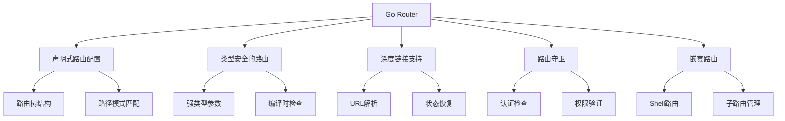

# 声明式路由 (Go Router)

> 使用Go Router构建现代化的声明式路由系统

## 🚀 Go Router 简介

### 架构优势



### 基础配置

```dart
// pubspec.yaml
dependencies:
  go_router: ^13.2.0
  flutter_riverpod: ^2.4.9 # 状态管理
```

```dart
// lib/router/app_router.dart
import 'package:go_router/go_router.dart';
import 'package:flutter/material.dart';
import 'package:flutter_riverpod/flutter_riverpod.dart';

// 路由配置提供者
final routerProvider = Provider<GoRouter>((ref) {
  final authState = ref.watch(authStateProvider);
  
  return GoRouter(
    initialLocation: '/',
    debugLogDiagnostics: true,
    
    // 路由重定向逻辑
    redirect: (context, state) {
      final isLoggedIn = authState.isAuthenticated;
      final isLoggingIn = state.matchedLocation == '/login';
      
      // 未登录用户访问受保护页面
      if (!isLoggedIn && !isLoggingIn) {
        return '/login';
      }
      
      // 已登录用户访问登录页面
      if (isLoggedIn && isLoggingIn) {
        return '/';
      }
      
      return null; // 无需重定向
    },
    
    // 路由配置
    routes: [
      // Shell路由 - 带底部导航栏的主框架
      ShellRoute(
        builder: (context, state, child) {
          return MainShell(child: child);
        },
        routes: [
          // 首页路由
          GoRoute(
            path: '/',
            name: 'home',
            builder: (context, state) => const HomePage(),
            routes: [
              // 产品详情页
              GoRoute(
                path: '/product/:productId',
                name: 'product-detail',
                builder: (context, state) {
                  final productId = state.pathParameters['productId']!;
                  final category = state.uri.queryParameters['category'];
                  
                  return ProductDetailPage(
                    productId: productId,
                    category: category,
                  );
                },
              ),
            ],
          ),
          
          // 分类页面
          GoRoute(
            path: '/categories',
            name: 'categories',
            builder: (context, state) => const CategoriesPage(),
            routes: [
              GoRoute(
                path: '/:categoryId',
                name: 'category-products',
                builder: (context, state) {
                  final categoryId = state.pathParameters['categoryId']!;
                  return CategoryProductsPage(categoryId: categoryId);
                },
              ),
            ],
          ),
          
          // 购物车页面
          GoRoute(
            path: '/cart',
            name: 'cart',
            builder: (context, state) => const CartPage(),
          ),
          
          // 个人中心
          GoRoute(
            path: '/profile',
            name: 'profile',
            builder: (context, state) => const ProfilePage(),
            routes: [
              // 设置页面
              GoRoute(
                path: '/settings',
                name: 'settings',
                builder: (context, state) => const SettingsPage(),
              ),
              // 订单历史
              GoRoute(
                path: '/orders',
                name: 'orders',
                builder: (context, state) => const OrdersPage(),
                routes: [
                  GoRoute(
                    path: '/:orderId',
                    name: 'order-detail',
                    builder: (context, state) {
                      final orderId = state.pathParameters['orderId']!;
                      return OrderDetailPage(orderId: orderId);
                    },
                  ),
                ],
              ),
            ],
          ),
        ],
      ),
      
      // 独立页面路由（无Shell）
      GoRoute(
        path: '/login',
        name: 'login',
        builder: (context, state) => const LoginPage(),
      ),
      
      GoRoute(
        path: '/register',
        name: 'register',
        builder: (context, state) => const RegisterPage(),
      ),
      
      // 全屏页面
      GoRoute(
        path: '/checkout',
        name: 'checkout',
        builder: (context, state) {
          final cartItems = state.extra as List<CartItem>?;
          return CheckoutPage(items: cartItems ?? []);
        },
      ),
    ],
    
    // 错误页面处理
    errorBuilder: (context, state) {
      return ErrorPage(
        error: state.error.toString(),
        location: state.matchedLocation,
      );
    },
  );
});
```

## 🏗️ 主框架Shell

### Shell路由实现

```dart
// lib/widgets/main_shell.dart
class MainShell extends ConsumerWidget {
  final Widget child;
  
  const MainShell({Key? key, required this.child}) : super(key: key);
  
  @override
  Widget build(BuildContext context, WidgetRef ref) {
    final currentLocation = GoRouterState.of(context).matchedLocation;
    
    return Scaffold(
      body: child,
      bottomNavigationBar: _buildBottomNavigation(context, currentLocation),
      floatingActionButton: _buildFloatingActionButton(currentLocation),
    );
  }
  
  Widget _buildBottomNavigation(BuildContext context, String location) {
    final currentIndex = _getBottomNavIndex(location);
    
    return BottomNavigationBar(
      type: BottomNavigationBarType.fixed,
      currentIndex: currentIndex,
      onTap: (index) => _onBottomNavTap(context, index),
      items: const [
        BottomNavigationBarItem(
          icon: Icon(Icons.home),
          label: '首页',
        ),
        BottomNavigationBarItem(
          icon: Icon(Icons.category),
          label: '分类',
        ),
        BottomNavigationBarItem(
          icon: Icon(Icons.shopping_cart),
          label: '购物车',
        ),
        BottomNavigationBarItem(
          icon: Icon(Icons.person),
          label: '我的',
        ),
      ],
    );
  }
  
  int _getBottomNavIndex(String location) {
    if (location.startsWith('/categories')) return 1;
    if (location.startsWith('/cart')) return 2;
    if (location.startsWith('/profile')) return 3;
    return 0; // 默认首页
  }
  
  void _onBottomNavTap(BuildContext context, int index) {
    switch (index) {
      case 0:
        context.goNamed('home');
        break;
      case 1:
        context.goNamed('categories');
        break;
      case 2:
        context.goNamed('cart');
        break;
      case 3:
        context.goNamed('profile');
        break;
    }
  }
  
  Widget? _buildFloatingActionButton(String location) {
    // 只在特定页面显示悬浮按钮
    if (location == '/') {
      return FloatingActionButton(
        onPressed: () {
          // 快速添加商品到购物车
        },
        child: const Icon(Icons.add_shopping_cart),
      );
    }
    return null;
  }
}
```

## 🔐 路由守卫与权限

### 认证状态管理

```dart
// lib/providers/auth_provider.dart
@freezed
class AuthState with _$AuthState {
  const factory AuthState({
    @Default(false) bool isAuthenticated,
    @Default(false) bool isLoading,
    User? user,
    String? token,
  }) = _AuthState;
}

class AuthNotifier extends StateNotifier<AuthState> {
  AuthNotifier() : super(const AuthState());
  
  Future<void> login(String email, String password) async {
    state = state.copyWith(isLoading: true);
    
    try {
      final result = await _authService.login(email, password);
      state = state.copyWith(
        isAuthenticated: true,
        isLoading: false,
        user: result.user,
        token: result.token,
      );
    } catch (e) {
      state = state.copyWith(isLoading: false);
      rethrow;
    }
  }
  
  Future<void> logout() async {
    await _authService.logout();
    state = const AuthState();
  }
}

final authStateProvider = StateNotifierProvider<AuthNotifier, AuthState>(
  (ref) => AuthNotifier(),
);
```

### 权限检查路由

```dart
// lib/router/route_guards.dart
class RouteGuard {
  static String? checkAuth(BuildContext context, GoRouterState state) {
    final container = ProviderScope.containerOf(context);
    final authState = container.read(authStateProvider);
    
    final protectedRoutes = [
      '/profile',
      '/orders',
      '/checkout',
      '/settings',
    ];
    
    final isProtectedRoute = protectedRoutes.any(
      (route) => state.matchedLocation.startsWith(route),
    );
    
    if (isProtectedRoute && !authState.isAuthenticated) {
      return '/login?redirect=${Uri.encodeComponent(state.matchedLocation)}';
    }
    
    return null;
  }
  
  static String? checkRole(BuildContext context, GoRouterState state, List<String> requiredRoles) {
    final container = ProviderScope.containerOf(context);
    final authState = container.read(authStateProvider);
    
    if (!authState.isAuthenticated) {
      return '/login';
    }
    
    final userRoles = authState.user?.roles ?? [];
    final hasRequiredRole = requiredRoles.any((role) => userRoles.contains(role));
    
    if (!hasRequiredRole) {
      return '/unauthorized';
    }
    
    return null;
  }
}
```

## 🔗 深度链接处理

### URL参数解析

```dart
// lib/router/route_parser.dart
class RouteParser {
  // 解析产品详情URL
  static ProductDetailParams parseProductDetail(GoRouterState state) {
    final productId = state.pathParameters['productId']!;
    final queryParams = state.uri.queryParameters;
    
    return ProductDetailParams(
      productId: productId,
      category: queryParams['category'],
      variant: queryParams['variant'],
      referrer: queryParams['ref'],
      utm: UtmParams.fromQuery(queryParams),
    );
  }
  
  // 解析搜索URL
  static SearchParams parseSearch(GoRouterState state) {
    final queryParams = state.uri.queryParameters;
    
    return SearchParams(
      query: queryParams['q'] ?? '',
      category: queryParams['category'],
      minPrice: double.tryParse(queryParams['min_price'] ?? ''),
      maxPrice: double.tryParse(queryParams['max_price'] ?? ''),
      sortBy: queryParams['sort'],
      page: int.tryParse(queryParams['page'] ?? '1') ?? 1,
    );
  }
}

@freezed
class ProductDetailParams with _$ProductDetailParams {
  const factory ProductDetailParams({
    required String productId,
    String? category,
    String? variant,
    String? referrer,
    UtmParams? utm,
  }) = _ProductDetailParams;
}

@freezed
class UtmParams with _$UtmParams {
  const factory UtmParams({
    String? source,
    String? medium,
    String? campaign,
    String? term,
    String? content,
  }) = _UtmParams;
  
  factory UtmParams.fromQuery(Map<String, String> query) {
    return UtmParams(
      source: query['utm_source'],
      medium: query['utm_medium'],
      campaign: query['utm_campaign'],
      term: query['utm_term'],
      content: query['utm_content'],
    );
  }
}
```

### 状态恢复

```dart
// lib/router/state_restoration.dart
class RouteStateManager {
  static const String _stateKey = 'route_state';
  
  // 保存路由状态
  static Future<void> saveRouteState(String location, Map<String, dynamic> state) async {
    final prefs = await SharedPreferences.getInstance();
    final stateData = {
      'location': location,
      'timestamp': DateTime.now().millisecondsSinceEpoch,
      'state': state,
    };
    
    await prefs.setString(_stateKey, jsonEncode(stateData));
  }
  
  // 恢复路由状态
  static Future<RouteState?> restoreRouteState() async {
    final prefs = await SharedPreferences.getInstance();
    final stateJson = prefs.getString(_stateKey);
    
    if (stateJson == null) return null;
    
    try {
      final stateData = jsonDecode(stateJson) as Map<String, dynamic>;
      final timestamp = stateData['timestamp'] as int;
      
      // 检查状态是否过期（24小时）
      final now = DateTime.now().millisecondsSinceEpoch;
      if (now - timestamp > 24 * 60 * 60 * 1000) {
        await clearRouteState();
        return null;
      }
      
      return RouteState(
        location: stateData['location'] as String,
        state: stateData['state'] as Map<String, dynamic>,
      );
    } catch (e) {
      await clearRouteState();
      return null;
    }
  }
  
  // 清除路由状态
  static Future<void> clearRouteState() async {
    final prefs = await SharedPreferences.getInstance();
    await prefs.remove(_stateKey);
  }
}

@freezed
class RouteState with _$RouteState {
  const factory RouteState({
    required String location,
    required Map<String, dynamic> state,
  }) = _RouteState;
}
```

## 🎯 类型安全的导航

### 路由扩展方法

```dart
// lib/router/navigation_extensions.dart
extension AppNavigation on BuildContext {
  // 类型安全的导航方法
  void goToProductDetail(String productId, {String? category}) {
    goNamed(
      'product-detail',
      pathParameters: {'productId': productId},
      queryParameters: category != null ? {'category': category} : null,
    );
  }
  
  void goToCategoryProducts(String categoryId) {
    goNamed(
      'category-products',
      pathParameters: {'categoryId': categoryId},
    );
  }
  
  void goToOrderDetail(String orderId) {
    goNamed(
      'order-detail',
      pathParameters: {'orderId': orderId},
    );
  }
  
  Future<T?> pushCheckout<T>(List<CartItem> items) {
    return pushNamed<T>(
      'checkout',
      extra: items,
    );
  }
  
  // 带返回值的导航
  Future<String?> selectCategory() {
    return pushNamed<String>('category-selector');
  }
  
  // 条件导航
  void goToProfileOrLogin() {
    final container = ProviderScope.containerOf(this);
    final isAuthenticated = container.read(authStateProvider).isAuthenticated;
    
    if (isAuthenticated) {
      goNamed('profile');
    } else {
      goNamed('login');
    }
  }
}
```

### 路由常量管理

```dart
// lib/router/route_names.dart
class RouteNames {
  // 主要页面
  static const String home = 'home';
  static const String categories = 'categories';
  static const String cart = 'cart';
  static const String profile = 'profile';
  
  // 详情页面
  static const String productDetail = 'product-detail';
  static const String categoryProducts = 'category-products';
  static const String orderDetail = 'order-detail';
  
  // 功能页面
  static const String login = 'login';
  static const String register = 'register';
  static const String checkout = 'checkout';
  static const String settings = 'settings';
  static const String orders = 'orders';
  
  // 路径常量
  static const String homePath = '/';
  static const String categoriesPath = '/categories';
  static const String cartPath = '/cart';
  static const String profilePath = '/profile';
  static const String loginPath = '/login';
  static const String registerPath = '/register';
  static const String checkoutPath = '/checkout';
  static const String settingsPath = '/profile/settings';
  static const String ordersPath = '/profile/orders';
}
```

## 🔄 路由状态管理

### 路由状态提供者

```dart
// lib/providers/router_provider.dart
@freezed
class RouterState with _$RouterState {
  const factory RouterState({
    @Default('') String currentLocation,
    @Default([]) List<String> history,
    @Default({}) Map<String, dynamic> routeData,
    @Default(false) bool canPop,
  }) = _RouterState;
}

class RouterNotifier extends StateNotifier<RouterState> {
  RouterNotifier() : super(const RouterState());
  
  void updateLocation(String location) {
    state = state.copyWith(
      currentLocation: location,
      history: [...state.history, location],
    );
  }
  
  void setRouteData(Map<String, dynamic> data) {
    state = state.copyWith(routeData: data);
  }
  
  void updateCanPop(bool canPop) {
    state = state.copyWith(canPop: canPop);
  }
  
  void clearHistory() {
    state = state.copyWith(history: []);
  }
}

final routerStateProvider = StateNotifierProvider<RouterNotifier, RouterState>(
  (ref) => RouterNotifier(),
);
```

## 📱 移动端优化

### 页面预加载

```dart
// lib/router/preloader.dart
class RoutePreloader {
  static final Map<String, Widget> _preloadedPages = {};
  
  // 预加载常用页面
  static void preloadCommonPages() {
    _preloadedPages['categories'] = const CategoriesPage();
    _preloadedPages['cart'] = const CartPage();
    _preloadedPages['profile'] = const ProfilePage();
  }
  
  // 智能预加载
  static void smartPreload(String currentRoute) {
    switch (currentRoute) {
      case '/':
        // 首页用户可能访问分类或购物车
        _preloadIfNeeded('categories', () => const CategoriesPage());
        _preloadIfNeeded('cart', () => const CartPage());
        break;
        
      case '/categories':
        // 分类页用户可能查看购物车
        _preloadIfNeeded('cart', () => const CartPage());
        break;
        
      case '/product':
        // 产品页用户可能添加到购物车
        _preloadIfNeeded('cart', () => const CartPage());
        break;
    }
  }
  
  static void _preloadIfNeeded(String key, Widget Function() builder) {
    if (!_preloadedPages.containsKey(key)) {
      _preloadedPages[key] = builder();
    }
  }
  
  static Widget? getPreloadedPage(String key) {
    return _preloadedPages[key];
  }
  
  static void clearPreloadedPages() {
    _preloadedPages.clear();
  }
}
```

### 路由性能监控

```dart
// lib/router/performance_monitor.dart
class RoutePerformanceMonitor {
  static final Map<String, DateTime> _navigationStartTimes = {};
  static final List<NavigationMetric> _metrics = [];
  
  static void startNavigation(String route) {
    _navigationStartTimes[route] = DateTime.now();
  }
  
  static void endNavigation(String route) {
    final startTime = _navigationStartTimes[route];
    if (startTime != null) {
      final duration = DateTime.now().difference(startTime);
      
      _metrics.add(NavigationMetric(
        route: route,
        duration: duration,
        timestamp: DateTime.now(),
      ));
      
      _navigationStartTimes.remove(route);
      
      // 记录慢导航
      if (duration.inMilliseconds > 1000) {
        _logSlowNavigation(route, duration);
      }
    }
  }
  
  static void _logSlowNavigation(String route, Duration duration) {
    print('慢导航警告: $route 耗时 ${duration.inMilliseconds}ms');
    
    // 发送到分析服务
    AnalyticsService.trackEvent('slow_navigation', {
      'route': route,
      'duration_ms': duration.inMilliseconds,
    });
  }
  
  static List<NavigationMetric> getMetrics() => List.from(_metrics);
  
  static double getAverageNavigationTime(String route) {
    final routeMetrics = _metrics.where((m) => m.route == route);
    if (routeMetrics.isEmpty) return 0.0;
    
    final totalMs = routeMetrics
        .map((m) => m.duration.inMilliseconds)
        .reduce((a, b) => a + b);
    
    return totalMs / routeMetrics.length;
  }
}

@freezed
class NavigationMetric with _$NavigationMetric {
  const factory NavigationMetric({
    required String route,
    required Duration duration,
    required DateTime timestamp,
  }) = _NavigationMetric;
}
```

## 🧪 路由测试

### 路由测试工具

```dart
// test/router/router_test.dart
class RouterTestHelper {
  static GoRouter createTestRouter({
    String initialLocation = '/',
    bool isAuthenticated = false,
  }) {
    return GoRouter(
      initialLocation: initialLocation,
      routes: [
        GoRoute(
          path: '/',
          builder: (context, state) => const HomePage(),
        ),
        GoRoute(
          path: '/login',
          builder: (context, state) => const LoginPage(),
        ),
        GoRoute(
          path: '/profile',
          builder: (context, state) => const ProfilePage(),
          redirect: (context, state) {
            return isAuthenticated ? null : '/login';
          },
        ),
      ],
    );
  }
  
  static Widget createTestApp({
    required GoRouter router,
    List<Override> overrides = const [],
  }) {
    return ProviderScope(
      overrides: overrides,
      child: MaterialApp.router(
        routerConfig: router,
      ),
    );
  }
}

void main() {
  group('Go Router Tests', () {
    testWidgets('should navigate to login when not authenticated', (tester) async {
      final router = RouterTestHelper.createTestRouter(
        initialLocation: '/profile',
        isAuthenticated: false,
      );
      
      await tester.pumpWidget(
        RouterTestHelper.createTestApp(router: router),
      );
      
      expect(find.byType(LoginPage), findsOneWidget);
    });
    
    testWidgets('should show profile when authenticated', (tester) async {
      final router = RouterTestHelper.createTestRouter(
        initialLocation: '/profile',
        isAuthenticated: true,
      );
      
      await tester.pumpWidget(
        RouterTestHelper.createTestApp(router: router),
      );
      
      expect(find.byType(ProfilePage), findsOneWidget);
    });
  });
}
```

## 🎯 最佳实践

### 路由设计原则

1. **URL设计规范**
   ```dart
   // ✅ 好的URL设计
   /products/123
   /categories/electronics/products
   /users/456/orders/789
   
   // ❌ 避免的URL设计
   /page1
   /screen_product_detail
   /user_order_detail_page
   ```

2. **路由层次结构**
   ```dart
   // ✅ 清晰的层次结构
   /
   ├── /products
   │   └── /:productId
   ├── /categories
   │   └── /:categoryId
   │       └── /products
   └── /users
       └── /:userId
           ├── /profile
           └── /orders
               └── /:orderId
   ```

3. **状态管理集成**
   ```dart
   // ✅ 路由与状态管理的良好集成
   final router = GoRouter(
     redirect: (context, state) {
       final authState = context.read<AuthState>();
       // 基于状态进行路由决策
     },
   );
   ```

### 性能优化建议

1. **懒加载页面**
2. **预加载关键页面**
3. **路由缓存策略**
4. **减少重建次数**
5. **监控导航性能**

### 调试技巧

```dart
// 启用路由调试
GoRouter(
  debugLogDiagnostics: true,
  // ...
);

// 自定义路由日志
class RouteLogger {
  static void logNavigation(String from, String to) {
    print('导航: $from -> $to');
  }
  
  static void logRedirect(String from, String to) {
    print('重定向: $from -> $to');
  }
}
```

---

## 📚 相关资源

- [Go Router 官方文档](https://pub.dev/packages/go_router)
- [Flutter 路由最佳实践](https://docs.flutter.dev/development/ui/navigation)
- [深度链接配置指南](https://docs.flutter.dev/development/ui/navigation/deep-linking)