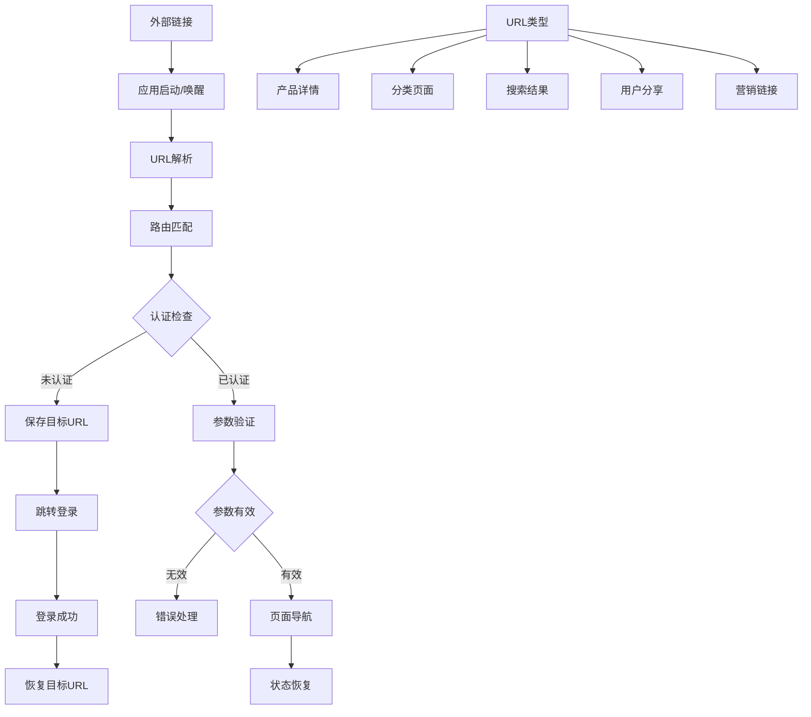

# 深度链接与URL处理

> 构建完整的深度链接系统，支持复杂的URL解析和状态恢复

## 🔗 深度链接架构

### 链接处理流程



### 配置深度链接

```yaml
# android/app/src/main/AndroidManifest.xml
<activity
    android:name=".MainActivity"
    android:exported="true"
    android:launchMode="singleTop"
    android:theme="@style/LaunchTheme">
    
    <!-- 标准启动 -->
    <intent-filter android:autoVerify="true">
        <action android:name="android.intent.action.MAIN"/>
        <category android:name="android.intent.category.LAUNCHER"/>
    </intent-filter>
    
    <!-- 自定义URL Scheme -->
    <intent-filter android:autoVerify="true">
        <action android:name="android.intent.action.VIEW" />
        <category android:name="android.intent.category.DEFAULT" />
        <category android:name="android.intent.category.BROWSABLE" />
        <data android:scheme="myapp" />
    </intent-filter>
    
    <!-- HTTP/HTTPS 深度链接 -->
    <intent-filter android:autoVerify="true">
        <action android:name="android.intent.action.VIEW" />
        <category android:name="android.intent.category.DEFAULT" />
        <category android:name="android.intent.category.BROWSABLE" />
        <data android:scheme="https"
              android:host="myapp.com" />
    </intent-filter>
    
    <!-- 通用链接 -->
    <intent-filter android:autoVerify="true">
        <action android:name="android.intent.action.VIEW" />
        <category android:name="android.intent.category.DEFAULT" />
        <category android:name="android.intent.category.BROWSABLE" />
        <data android:scheme="https"
              android:host="app.myapp.com" />
    </intent-filter>
</activity>
```

```xml
<!-- ios/Runner/Info.plist -->
<key>CFBundleURLTypes</key>
<array>
    <!-- 自定义URL Scheme -->
    <dict>
        <key>CFBundleURLName</key>
        <string>myapp.deeplink</string>
        <key>CFBundleURLSchemes</key>
        <array>
            <string>myapp</string>
        </array>
    </dict>
    
    <!-- Universal Links -->
    <dict>
        <key>CFBundleURLName</key>
        <string>myapp.universal</string>
        <key>CFBundleURLSchemes</key>
        <array>
            <string>https</string>
        </array>
    </dict>
</array>

<!-- Associated Domains -->
<key>com.apple.developer.associated-domains</key>
<array>
    <string>applinks:myapp.com</string>
    <string>applinks:app.myapp.com</string>
</array>
```

## 📱 URL解析器

### 核心URL解析器

```dart
// lib/router/url_parser.dart
class UrlParser {
  static const String _customScheme = 'myapp';
  static const List<String> _supportedHosts = [
    'myapp.com',
    'app.myapp.com',
    'www.myapp.com',
  ];
  
  /// 解析深度链接URL
  static DeepLinkResult parseDeepLink(String url) {
    try {
      final uri = Uri.parse(url);
      
      // 验证URL格式
      if (!_isValidUrl(uri)) {
        return DeepLinkResult.invalid('不支持的URL格式: $url');
      }
      
      // 解析路径和参数
      final pathSegments = uri.pathSegments;
      final queryParams = uri.queryParameters;
      
      // 根据路径类型解析
      return _parseByPath(pathSegments, queryParams, uri);
      
    } catch (e) {
      return DeepLinkResult.invalid('URL解析失败: $e');
    }
  }
  
  static bool _isValidUrl(Uri uri) {
    // 检查自定义scheme
    if (uri.scheme == _customScheme) {
      return true;
    }
    
    // 检查HTTP/HTTPS
    if (uri.scheme == 'http' || uri.scheme == 'https') {
      return _supportedHosts.contains(uri.host);
    }
    
    return false;
  }
  
  static DeepLinkResult _parseByPath(
    List<String> pathSegments,
    Map<String, String> queryParams,
    Uri uri,
  ) {
    if (pathSegments.isEmpty) {
      return DeepLinkResult.home();
    }
    
    final firstSegment = pathSegments.first;
    
    switch (firstSegment) {
      case 'product':
      case 'p':
        return _parseProductLink(pathSegments, queryParams);
        
      case 'category':
      case 'c':
        return _parseCategoryLink(pathSegments, queryParams);
        
      case 'search':
        return _parseSearchLink(queryParams);
        
      case 'user':
      case 'profile':
        return _parseUserLink(pathSegments, queryParams);
        
      case 'share':
        return _parseShareLink(pathSegments, queryParams);
        
      case 'invite':
        return _parseInviteLink(queryParams);
        
      case 'reset-password':
        return _parseResetPasswordLink(queryParams);
        
      case 'verify-email':
        return _parseEmailVerificationLink(queryParams);
        
      default:
        return DeepLinkResult.invalid('未知的路径: $firstSegment');
    }
  }
  
  // 产品详情链接解析
  static DeepLinkResult _parseProductLink(
    List<String> pathSegments,
    Map<String, String> queryParams,
  ) {
    if (pathSegments.length < 2) {
      return DeepLinkResult.invalid('产品ID缺失');
    }
    
    final productId = pathSegments[1];
    
    return DeepLinkResult.product(
      ProductLinkData(
        productId: productId,
        variant: queryParams['variant'],
        color: queryParams['color'],
        size: queryParams['size'],
        referrer: queryParams['ref'],
        utm: UtmParameters.fromQuery(queryParams),
        shareId: queryParams['share_id'],
      ),
    );
  }
  
  // 分类链接解析
  static DeepLinkResult _parseCategoryLink(
    List<String> pathSegments,
    Map<String, String> queryParams,
  ) {
    if (pathSegments.length < 2) {
      return DeepLinkResult.invalid('分类ID缺失');
    }
    
    final categoryId = pathSegments[1];
    
    return DeepLinkResult.category(
      CategoryLinkData(
        categoryId: categoryId,
        sortBy: queryParams['sort'],
        filterBy: queryParams['filter'],
        page: int.tryParse(queryParams['page'] ?? '1') ?? 1,
        utm: UtmParameters.fromQuery(queryParams),
      ),
    );
  }
  
  // 搜索链接解析
  static DeepLinkResult _parseSearchLink(
    Map<String, String> queryParams,
  ) {
    final query = queryParams['q'] ?? queryParams['query'];
    
    if (query == null || query.isEmpty) {
      return DeepLinkResult.invalid('搜索关键词缺失');
    }
    
    return DeepLinkResult.search(
      SearchLinkData(
        query: query,
        category: queryParams['category'],
        minPrice: double.tryParse(queryParams['min_price'] ?? ''),
        maxPrice: double.tryParse(queryParams['max_price'] ?? ''),
        sortBy: queryParams['sort'],
        page: int.tryParse(queryParams['page'] ?? '1') ?? 1,
        utm: UtmParameters.fromQuery(queryParams),
      ),
    );
  }
  
  // 用户链接解析
  static DeepLinkResult _parseUserLink(
    List<String> pathSegments,
    Map<String, String> queryParams,
  ) {
    if (pathSegments.length < 2) {
      return DeepLinkResult.profile();
    }
    
    final userId = pathSegments[1];
    
    return DeepLinkResult.user(
      UserLinkData(
        userId: userId,
        tab: queryParams['tab'],
        utm: UtmParameters.fromQuery(queryParams),
      ),
    );
  }
  
  // 分享链接解析
  static DeepLinkResult _parseShareLink(
    List<String> pathSegments,
    Map<String, String> queryParams,
  ) {
    if (pathSegments.length < 2) {
      return DeepLinkResult.invalid('分享ID缺失');
    }
    
    final shareId = pathSegments[1];
    
    return DeepLinkResult.share(
      ShareLinkData(
        shareId: shareId,
        type: queryParams['type'],
        utm: UtmParameters.fromQuery(queryParams),
      ),
    );
  }
  
  // 邀请链接解析
  static DeepLinkResult _parseInviteLink(
    Map<String, String> queryParams,
  ) {
    final inviteCode = queryParams['code'];
    
    if (inviteCode == null || inviteCode.isEmpty) {
      return DeepLinkResult.invalid('邀请码缺失');
    }
    
    return DeepLinkResult.invite(
      InviteLinkData(
        inviteCode: inviteCode,
        referrerId: queryParams['referrer'],
        utm: UtmParameters.fromQuery(queryParams),
      ),
    );
  }
  
  // 密码重置链接解析
  static DeepLinkResult _parseResetPasswordLink(
    Map<String, String> queryParams,
  ) {
    final token = queryParams['token'];
    final email = queryParams['email'];
    
    if (token == null || email == null) {
      return DeepLinkResult.invalid('重置密码参数缺失');
    }
    
    return DeepLinkResult.resetPassword(
      ResetPasswordLinkData(
        token: token,
        email: email,
      ),
    );
  }
  
  // 邮箱验证链接解析
  static DeepLinkResult _parseEmailVerificationLink(
    Map<String, String> queryParams,
  ) {
    final token = queryParams['token'];
    final email = queryParams['email'];
    
    if (token == null || email == null) {
      return DeepLinkResult.invalid('邮箱验证参数缺失');
    }
    
    return DeepLinkResult.emailVerification(
      EmailVerificationLinkData(
        token: token,
        email: email,
      ),
    );
  }
}
```

### 深度链接数据模型

```dart
// lib/router/models/deep_link_models.dart
@freezed
class DeepLinkResult with _$DeepLinkResult {
  const factory DeepLinkResult.home() = _Home;
  const factory DeepLinkResult.product(ProductLinkData data) = _Product;
  const factory DeepLinkResult.category(CategoryLinkData data) = _Category;
  const factory DeepLinkResult.search(SearchLinkData data) = _Search;
  const factory DeepLinkResult.user(UserLinkData data) = _User;
  const factory DeepLinkResult.profile() = _Profile;
  const factory DeepLinkResult.share(ShareLinkData data) = _Share;
  const factory DeepLinkResult.invite(InviteLinkData data) = _Invite;
  const factory DeepLinkResult.resetPassword(ResetPasswordLinkData data) = _ResetPassword;
  const factory DeepLinkResult.emailVerification(EmailVerificationLinkData data) = _EmailVerification;
  const factory DeepLinkResult.invalid(String reason) = _Invalid;
}

@freezed
class ProductLinkData with _$ProductLinkData {
  const factory ProductLinkData({
    required String productId,
    String? variant,
    String? color,
    String? size,
    String? referrer,
    UtmParameters? utm,
    String? shareId,
  }) = _ProductLinkData;
}

@freezed
class CategoryLinkData with _$CategoryLinkData {
  const factory CategoryLinkData({
    required String categoryId,
    String? sortBy,
    String? filterBy,
    @Default(1) int page,
    UtmParameters? utm,
  }) = _CategoryLinkData;
}

@freezed
class SearchLinkData with _$SearchLinkData {
  const factory SearchLinkData({
    required String query,
    String? category,
    double? minPrice,
    double? maxPrice,
    String? sortBy,
    @Default(1) int page,
    UtmParameters? utm,
  }) = _SearchLinkData;
}

@freezed
class UserLinkData with _$UserLinkData {
  const factory UserLinkData({
    required String userId,
    String? tab,
    UtmParameters? utm,
  }) = _UserLinkData;
}

@freezed
class ShareLinkData with _$ShareLinkData {
  const factory ShareLinkData({
    required String shareId,
    String? type,
    UtmParameters? utm,
  }) = _ShareLinkData;
}

@freezed
class InviteLinkData with _$InviteLinkData {
  const factory InviteLinkData({
    required String inviteCode,
    String? referrerId,
    UtmParameters? utm,
  }) = _InviteLinkData;
}

@freezed
class ResetPasswordLinkData with _$ResetPasswordLinkData {
  const factory ResetPasswordLinkData({
    required String token,
    required String email,
  }) = _ResetPasswordLinkData;
}

@freezed
class EmailVerificationLinkData with _$EmailVerificationLinkData {
  const factory EmailVerificationLinkData({
    required String token,
    required String email,
  }) = _EmailVerificationLinkData;
}

@freezed
class UtmParameters with _$UtmParameters {
  const factory UtmParameters({
    String? source,
    String? medium,
    String? campaign,
    String? term,
    String? content,
  }) = _UtmParameters;
  
  factory UtmParameters.fromQuery(Map<String, String> query) {
    return UtmParameters(
      source: query['utm_source'],
      medium: query['utm_medium'],
      campaign: query['utm_campaign'],
      term: query['utm_term'],
      content: query['utm_content'],
    );
  }
  
  Map<String, String> toQuery() {
    final query = <String, String>{};
    
    if (source != null) query['utm_source'] = source!;
    if (medium != null) query['utm_medium'] = medium!;
    if (campaign != null) query['utm_campaign'] = campaign!;
    if (term != null) query['utm_term'] = term!;
    if (content != null) query['utm_content'] = content!;
    
    return query;
  }
}
```

## 🔄 深度链接处理器

### 链接处理服务

```dart
// lib/router/deep_link_handler.dart
class DeepLinkHandler {
  final GoRouter _router;
  final AuthService _authService;
  final AnalyticsService _analyticsService;
  final ShareService _shareService;
  
  DeepLinkHandler({
    required GoRouter router,
    required AuthService authService,
    required AnalyticsService analyticsService,
    required ShareService shareService,
  }) : _router = router,
       _authService = authService,
       _analyticsService = analyticsService,
       _shareService = shareService;
  
  /// 处理深度链接
  Future<void> handleDeepLink(String url) async {
    try {
      // 解析URL
      final result = UrlParser.parseDeepLink(url);
      
      // 记录分析数据
      await _trackDeepLink(url, result);
      
      // 处理不同类型的链接
      await result.when(
        home: () => _handleHome(),
        product: (data) => _handleProduct(data),
        category: (data) => _handleCategory(data),
        search: (data) => _handleSearch(data),
        user: (data) => _handleUser(data),
        profile: () => _handleProfile(),
        share: (data) => _handleShare(data),
        invite: (data) => _handleInvite(data),
        resetPassword: (data) => _handleResetPassword(data),
        emailVerification: (data) => _handleEmailVerification(data),
        invalid: (reason) => _handleInvalid(reason),
      );
      
    } catch (e, stackTrace) {
      await _handleError(url, e, stackTrace);
    }
  }
  
  Future<void> _handleHome() async {
    _router.go('/');
  }
  
  Future<void> _handleProduct(ProductLinkData data) async {
    // 记录UTM参数
    if (data.utm != null) {
      await _analyticsService.trackUtm(data.utm!);
    }
    
    // 构建路由参数
    final queryParams = <String, String>{};
    if (data.variant != null) queryParams['variant'] = data.variant!;
    if (data.color != null) queryParams['color'] = data.color!;
    if (data.size != null) queryParams['size'] = data.size!;
    if (data.referrer != null) queryParams['ref'] = data.referrer!;
    if (data.shareId != null) queryParams['share_id'] = data.shareId!;
    
    // 导航到产品页面
    _router.goNamed(
      'product-detail',
      pathParameters: {'productId': data.productId},
      queryParameters: queryParams.isNotEmpty ? queryParams : null,
    );
  }
  
  Future<void> _handleCategory(CategoryLinkData data) async {
    if (data.utm != null) {
      await _analyticsService.trackUtm(data.utm!);
    }
    
    final queryParams = <String, String>{};
    if (data.sortBy != null) queryParams['sort'] = data.sortBy!;
    if (data.filterBy != null) queryParams['filter'] = data.filterBy!;
    if (data.page > 1) queryParams['page'] = data.page.toString();
    
    _router.goNamed(
      'category-products',
      pathParameters: {'categoryId': data.categoryId},
      queryParameters: queryParams.isNotEmpty ? queryParams : null,
    );
  }
  
  Future<void> _handleSearch(SearchLinkData data) async {
    if (data.utm != null) {
      await _analyticsService.trackUtm(data.utm!);
    }
    
    final queryParams = <String, String>{
      'q': data.query,
    };
    
    if (data.category != null) queryParams['category'] = data.category!;
    if (data.minPrice != null) queryParams['min_price'] = data.minPrice.toString();
    if (data.maxPrice != null) queryParams['max_price'] = data.maxPrice.toString();
    if (data.sortBy != null) queryParams['sort'] = data.sortBy!;
    if (data.page > 1) queryParams['page'] = data.page.toString();
    
    _router.goNamed(
      'search',
      queryParameters: queryParams,
    );
  }
  
  Future<void> _handleUser(UserLinkData data) async {
    if (data.utm != null) {
      await _analyticsService.trackUtm(data.utm!);
    }
    
    final queryParams = <String, String>{};
    if (data.tab != null) queryParams['tab'] = data.tab!;
    
    _router.goNamed(
      'user-profile',
      pathParameters: {'userId': data.userId},
      queryParameters: queryParams.isNotEmpty ? queryParams : null,
    );
  }
  
  Future<void> _handleProfile() async {
    final isAuthenticated = await _authService.isAuthenticated();
    
    if (isAuthenticated) {
      _router.goNamed('profile');
    } else {
      _router.goNamed('login', queryParameters: {
        'redirect': Uri.encodeComponent('/profile'),
      });
    }
  }
  
  Future<void> _handleShare(ShareLinkData data) async {
    if (data.utm != null) {
      await _analyticsService.trackUtm(data.utm!);
    }
    
    try {
      // 解析分享内容
      final shareContent = await _shareService.getSharedContent(data.shareId);
      
      if (shareContent != null) {
        // 根据分享类型导航
        await shareContent.when(
          product: (productId) => _handleProduct(
            ProductLinkData(
              productId: productId,
              shareId: data.shareId,
              utm: data.utm,
            ),
          ),
          category: (categoryId) => _handleCategory(
            CategoryLinkData(
              categoryId: categoryId,
              utm: data.utm,
            ),
          ),
          user: (userId) => _handleUser(
            UserLinkData(
              userId: userId,
              utm: data.utm,
            ),
          ),
        );
      } else {
        _handleInvalid('分享内容不存在');
      }
    } catch (e) {
      _handleInvalid('分享内容加载失败');
    }
  }
  
  Future<void> _handleInvite(InviteLinkData data) async {
    if (data.utm != null) {
      await _analyticsService.trackUtm(data.utm!);
    }
    
    final isAuthenticated = await _authService.isAuthenticated();
    
    if (isAuthenticated) {
      // 已登录用户直接处理邀请
      _router.goNamed('invite-accept', queryParameters: {
        'code': data.inviteCode,
        if (data.referrerId != null) 'referrer': data.referrerId!,
      });
    } else {
      // 未登录用户先注册
      _router.goNamed('register', queryParameters: {
        'invite_code': data.inviteCode,
        if (data.referrerId != null) 'referrer': data.referrerId!,
      });
    }
  }
  
  Future<void> _handleResetPassword(ResetPasswordLinkData data) async {
    _router.goNamed('reset-password', queryParameters: {
      'token': data.token,
      'email': data.email,
    });
  }
  
  Future<void> _handleEmailVerification(EmailVerificationLinkData data) async {
    _router.goNamed('verify-email', queryParameters: {
      'token': data.token,
      'email': data.email,
    });
  }
  
  Future<void> _handleInvalid(String reason) async {
    _router.goNamed('error', queryParameters: {
      'message': reason,
      'type': 'invalid_deep_link',
    });
  }
  
  Future<void> _handleError(String url, Object error, StackTrace stackTrace) async {
    // 记录错误
    await _analyticsService.trackError(
      'deep_link_error',
      error,
      stackTrace,
      {'url': url},
    );
    
    // 导航到错误页面
    _router.goNamed('error', queryParameters: {
      'message': '深度链接处理失败',
      'type': 'deep_link_error',
    });
  }
  
  Future<void> _trackDeepLink(String url, DeepLinkResult result) async {
    await _analyticsService.trackEvent('deep_link_opened', {
      'url': url,
      'type': result.runtimeType.toString(),
      'timestamp': DateTime.now().toIso8601String(),
    });
  }
}
```

## 🔄 状态恢复

### 应用状态管理

```dart
// lib/router/app_state_manager.dart
class AppStateManager {
  static const String _stateKey = 'app_state';
  static const String _pendingLinkKey = 'pending_deep_link';
  
  /// 保存应用状态
  static Future<void> saveAppState(AppState state) async {
    final prefs = await SharedPreferences.getInstance();
    final stateJson = jsonEncode(state.toJson());
    await prefs.setString(_stateKey, stateJson);
  }
  
  /// 恢复应用状态
  static Future<AppState?> restoreAppState() async {
    final prefs = await SharedPreferences.getInstance();
    final stateJson = prefs.getString(_stateKey);
    
    if (stateJson == null) return null;
    
    try {
      final stateData = jsonDecode(stateJson) as Map<String, dynamic>;
      return AppState.fromJson(stateData);
    } catch (e) {
      // 状态恢复失败，清除无效数据
      await clearAppState();
      return null;
    }
  }
  
  /// 清除应用状态
  static Future<void> clearAppState() async {
    final prefs = await SharedPreferences.getInstance();
    await prefs.remove(_stateKey);
  }
  
  /// 保存待处理的深度链接
  static Future<void> savePendingDeepLink(String url) async {
    final prefs = await SharedPreferences.getInstance();
    await prefs.setString(_pendingLinkKey, url);
  }
  
  /// 获取并清除待处理的深度链接
  static Future<String?> getPendingDeepLink() async {
    final prefs = await SharedPreferences.getInstance();
    final url = prefs.getString(_pendingLinkKey);
    
    if (url != null) {
      await prefs.remove(_pendingLinkKey);
    }
    
    return url;
  }
}

@freezed
class AppState with _$AppState {
  const factory AppState({
    required String currentRoute,
    required Map<String, dynamic> routeData,
    required DateTime timestamp,
    String? userId,
    Map<String, dynamic>? userPreferences,
  }) = _AppState;
  
  factory AppState.fromJson(Map<String, dynamic> json) => _$AppStateFromJson(json);
}
```

### 启动时状态恢复

```dart
// lib/router/app_startup.dart
class AppStartup {
  final DeepLinkHandler _deepLinkHandler;
  final AuthService _authService;
  
  AppStartup({
    required DeepLinkHandler deepLinkHandler,
    required AuthService authService,
  }) : _deepLinkHandler = deepLinkHandler,
       _authService = authService;
  
  /// 应用启动初始化
  Future<void> initialize() async {
    // 恢复应用状态
    final appState = await AppStateManager.restoreAppState();
    if (appState != null) {
      await _restoreAppState(appState);
    }
    
    // 处理待处理的深度链接
    final pendingLink = await AppStateManager.getPendingDeepLink();
    if (pendingLink != null) {
      await _deepLinkHandler.handleDeepLink(pendingLink);
    }
    
    // 监听新的深度链接
    _setupDeepLinkListener();
  }
  
  Future<void> _restoreAppState(AppState state) async {
    // 检查状态是否过期（24小时）
    final now = DateTime.now();
    if (now.difference(state.timestamp) > const Duration(hours: 24)) {
      await AppStateManager.clearAppState();
      return;
    }
    
    // 验证用户状态
    if (state.userId != null) {
      final isAuthenticated = await _authService.isAuthenticated();
      final currentUser = await _authService.getCurrentUser();
      
      if (!isAuthenticated || currentUser?.id != state.userId) {
        // 用户状态不匹配，清除状态
        await AppStateManager.clearAppState();
        return;
      }
    }
    
    // 恢复路由状态
    // 这里可以根据需要恢复特定的路由状态
  }
  
  void _setupDeepLinkListener() {
    // 监听应用从后台恢复时的深度链接
    // 这里的实现取决于具体的深度链接插件
  }
}
```

## 📊 链接分析与追踪

### UTM参数追踪

```dart
// lib/router/utm_tracker.dart
class UtmTracker {
  final AnalyticsService _analyticsService;
  final Map<String, UtmSession> _activeSessions = {};
  
  UtmTracker({required AnalyticsService analyticsService})
      : _analyticsService = analyticsService;
  
  /// 开始UTM会话
  Future<void> startUtmSession(UtmParameters utm) async {
    final sessionId = _generateSessionId();
    final session = UtmSession(
      id: sessionId,
      utm: utm,
      startTime: DateTime.now(),
      events: [],
    );
    
    _activeSessions[sessionId] = session;
    
    // 记录UTM会话开始
    await _analyticsService.trackEvent('utm_session_start', {
      'session_id': sessionId,
      'utm_source': utm.source,
      'utm_medium': utm.medium,
      'utm_campaign': utm.campaign,
      'utm_term': utm.term,
      'utm_content': utm.content,
    });
  }
  
  /// 记录UTM事件
  Future<void> trackUtmEvent(
    String sessionId,
    String eventName,
    Map<String, dynamic> properties,
  ) async {
    final session = _activeSessions[sessionId];
    if (session == null) return;
    
    final event = UtmEvent(
      name: eventName,
      properties: properties,
      timestamp: DateTime.now(),
    );
    
    session.events.add(event);
    
    // 记录事件
    await _analyticsService.trackEvent(eventName, {
      ...properties,
      'utm_session_id': sessionId,
      'utm_source': session.utm.source,
      'utm_medium': session.utm.medium,
      'utm_campaign': session.utm.campaign,
    });
  }
  
  /// 结束UTM会话
  Future<void> endUtmSession(String sessionId) async {
    final session = _activeSessions.remove(sessionId);
    if (session == null) return;
    
    final duration = DateTime.now().difference(session.startTime);
    
    await _analyticsService.trackEvent('utm_session_end', {
      'session_id': sessionId,
      'duration_seconds': duration.inSeconds,
      'event_count': session.events.length,
      'utm_source': session.utm.source,
      'utm_medium': session.utm.medium,
      'utm_campaign': session.utm.campaign,
    });
  }
  
  String _generateSessionId() {
    return '${DateTime.now().millisecondsSinceEpoch}_${Random().nextInt(10000)}';
  }
}

@freezed
class UtmSession with _$UtmSession {
  const factory UtmSession({
    required String id,
    required UtmParameters utm,
    required DateTime startTime,
    required List<UtmEvent> events,
  }) = _UtmSession;
}

@freezed
class UtmEvent with _$UtmEvent {
  const factory UtmEvent({
    required String name,
    required Map<String, dynamic> properties,
    required DateTime timestamp,
  }) = _UtmEvent;
}
```

### 链接性能监控

```dart
// lib/router/link_performance_monitor.dart
class LinkPerformanceMonitor {
  static final Map<String, LinkMetrics> _metrics = {};
  
  /// 开始监控链接处理
  static String startLinkProcessing(String url) {
    final id = _generateId();
    _metrics[id] = LinkMetrics(
      id: id,
      url: url,
      startTime: DateTime.now(),
    );
    return id;
  }
  
  /// 记录解析完成
  static void markParsingComplete(String id, DeepLinkResult result) {
    final metrics = _metrics[id];
    if (metrics != null) {
      _metrics[id] = metrics.copyWith(
        parseEndTime: DateTime.now(),
        parseResult: result,
      );
    }
  }
  
  /// 记录导航完成
  static void markNavigationComplete(String id) {
    final metrics = _metrics[id];
    if (metrics != null) {
      _metrics[id] = metrics.copyWith(
        navigationEndTime: DateTime.now(),
      );
      
      // 计算性能指标
      _calculateAndReportMetrics(id);
    }
  }
  
  /// 记录错误
  static void markError(String id, String error) {
    final metrics = _metrics[id];
    if (metrics != null) {
      _metrics[id] = metrics.copyWith(
        error: error,
        navigationEndTime: DateTime.now(),
      );
      
      _calculateAndReportMetrics(id);
    }
  }
  
  static void _calculateAndReportMetrics(String id) {
    final metrics = _metrics.remove(id);
    if (metrics == null) return;
    
    final totalDuration = metrics.navigationEndTime != null
        ? metrics.navigationEndTime!.difference(metrics.startTime)
        : null;
    
    final parseDuration = metrics.parseEndTime != null
        ? metrics.parseEndTime!.difference(metrics.startTime)
        : null;
    
    final navigationDuration = metrics.parseEndTime != null && 
                              metrics.navigationEndTime != null
        ? metrics.navigationEndTime!.difference(metrics.parseEndTime!)
        : null;
    
    // 报告性能数据
    AnalyticsService.trackEvent('deep_link_performance', {
      'url': metrics.url,
      'total_duration_ms': totalDuration?.inMilliseconds,
      'parse_duration_ms': parseDuration?.inMilliseconds,
      'navigation_duration_ms': navigationDuration?.inMilliseconds,
      'success': metrics.error == null,
      'error': metrics.error,
      'result_type': metrics.parseResult?.runtimeType.toString(),
    });
  }
  
  static String _generateId() {
    return '${DateTime.now().millisecondsSinceEpoch}_${Random().nextInt(10000)}';
  }
}

@freezed
class LinkMetrics with _$LinkMetrics {
  const factory LinkMetrics({
    required String id,
    required String url,
    required DateTime startTime,
    DateTime? parseEndTime,
    DateTime? navigationEndTime,
    DeepLinkResult? parseResult,
    String? error,
  }) = _LinkMetrics;
}
```

## 🧪 深度链接测试

### 测试工具

```dart
// test/router/deep_link_test_helper.dart
class DeepLinkTestHelper {
  /// 创建测试用的深度链接处理器
  static DeepLinkHandler createTestHandler({
    GoRouter? router,
    AuthService? authService,
    AnalyticsService? analyticsService,
    ShareService? shareService,
  }) {
    return DeepLinkHandler(
      router: router ?? createMockRouter(),
      authService: authService ?? MockAuthService(),
      analyticsService: analyticsService ?? MockAnalyticsService(),
      shareService: shareService ?? MockShareService(),
    );
  }
  
  /// 创建模拟路由器
  static GoRouter createMockRouter() {
    return GoRouter(
      routes: [
        GoRoute(
          path: '/',
          builder: (context, state) => const HomePage(),
        ),
        GoRoute(
          path: '/product/:productId',
          name: 'product-detail',
          builder: (context, state) => ProductDetailPage(
            productId: state.pathParameters['productId']!,
          ),
        ),
        // 其他测试路由...
      ],
    );
  }
  
  /// 测试URL解析
  static void testUrlParsing() {
    group('URL Parsing Tests', () {
      test('should parse product URL correctly', () {
        const url = 'https://myapp.com/product/123?variant=red&utm_source=email';
        final result = UrlParser.parseDeepLink(url);
        
        expect(result, isA<_Product>());
        result.whenOrNull(
          product: (data) {
            expect(data.productId, equals('123'));
            expect(data.variant, equals('red'));
            expect(data.utm?.source, equals('email'));
          },
        );
      });
      
      test('should handle invalid URLs', () {
        const url = 'invalid-url';
        final result = UrlParser.parseDeepLink(url);
        
        expect(result, isA<_Invalid>());
      });
    });
  }
}
```

### 集成测试

```dart
// test/router/deep_link_integration_test.dart
void main() {
  group('Deep Link Integration Tests', () {
    late DeepLinkHandler handler;
    late MockAuthService authService;
    late MockAnalyticsService analyticsService;
    
    setUp(() {
      authService = MockAuthService();
      analyticsService = MockAnalyticsService();
      handler = DeepLinkTestHelper.createTestHandler(
        authService: authService,
        analyticsService: analyticsService,
      );
    });
    
    testWidgets('should handle product deep link', (tester) async {
      const url = 'https://myapp.com/product/123';
      
      await handler.handleDeepLink(url);
      
      // 验证导航是否正确
      // 验证分析事件是否被触发
      verify(analyticsService.trackEvent('deep_link_opened', any)).called(1);
    });
    
    testWidgets('should handle authentication flow', (tester) async {
      when(authService.isAuthenticated()).thenAnswer((_) async => false);
      
      const url = 'https://myapp.com/profile';
      
      await handler.handleDeepLink(url);
      
      // 验证是否重定向到登录页面
      // 验证是否保存了目标URL
    });
  });
}
```

## 🎯 最佳实践

### URL设计规范

1. **简洁明了**：URL应该简短且易于理解
2. **层次清晰**：使用合理的路径层次结构
3. **参数规范**：使用标准的查询参数格式
4. **向后兼容**：保持URL格式的稳定性
5. **SEO友好**：使用有意义的路径和参数名

### 性能优化

```dart
// URL解析缓存
class UrlParserCache {
  static final Map<String, DeepLinkResult> _cache = {};
  static const int _maxCacheSize = 100;
  
  static DeepLinkResult? getCached(String url) {
    return _cache[url];
  }
  
  static void setCached(String url, DeepLinkResult result) {
    if (_cache.length >= _maxCacheSize) {
      // 清除最旧的缓存项
      final firstKey = _cache.keys.first;
      _cache.remove(firstKey);
    }
    _cache[url] = result;
  }
}
```

### 错误处理策略

1. **优雅降级**：无法处理的链接应该有合理的回退方案
2. **用户友好**：提供清晰的错误信息
3. **日志记录**：记录所有深度链接处理的详细信息
4. **监控告警**：对异常情况进行监控和告警

---

## 📚 相关资源

- [Flutter 深度链接官方文档](https://docs.flutter.dev/development/ui/navigation/deep-linking)
- [Android App Links](https://developer.android.com/training/app-links)
- [iOS Universal Links](https://developer.apple.com/ios/universal-links/)
- [URL设计最佳实践](https://restfulapi.net/resource-naming/)