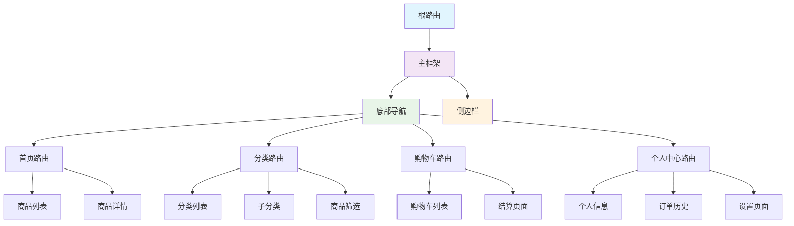
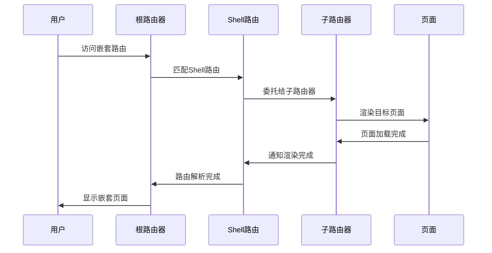

# 嵌套路由与子路由

> 构建复杂的多层级路由结构，支持嵌套导航和子页面管理

## 🏗️ 嵌套路由架构

### 路由层次结构



### 嵌套路由流程



## 🎯 Go Router 嵌套配置

### 基础嵌套路由

```dart
// lib/core/routing/nested_router.dart
class NestedRouter {
  static final GoRouter router = GoRouter(
    initialLocation: '/home',
    routes: [
      // Shell路由 - 主框架
      ShellRoute(
        builder: (context, state, child) {
          return MainShell(child: child);
        },
        routes: [
          // 首页嵌套路由
          GoRoute(
            path: '/home',
            builder: (context, state) => const HomePage(),
            routes: [
              GoRoute(
                path: 'products/:categoryId',
                builder: (context, state) {
                  final categoryId = state.pathParameters['categoryId']!;
                  return ProductListPage(categoryId: categoryId);
                },
                routes: [
                  GoRoute(
                    path: 'detail/:productId',
                    builder: (context, state) {
                      final productId = state.pathParameters['productId']!;
                      final categoryId = state.pathParameters['categoryId']!;
                      return ProductDetailPage(
                        productId: productId,
                        categoryId: categoryId,
                      );
                    },
                  ),
                ],
              ),
            ],
          ),
          
          // 分类嵌套路由
          GoRoute(
            path: '/category',
            builder: (context, state) => const CategoryPage(),
            routes: [
              GoRoute(
                path: ':categoryId',
                builder: (context, state) {
                  final categoryId = state.pathParameters['categoryId']!;
                  return CategoryDetailPage(categoryId: categoryId);
                },
                routes: [
                  GoRoute(
                    path: 'subcategory/:subId',
                    builder: (context, state) {
                      final categoryId = state.pathParameters['categoryId']!;
                      final subId = state.pathParameters['subId']!;
                      return SubCategoryPage(
                        categoryId: categoryId,
                        subCategoryId: subId,
                      );
                    },
                  ),
                ],
              ),
            ],
          ),
          
          // 购物车嵌套路由
          GoRoute(
            path: '/cart',
            builder: (context, state) => const CartPage(),
            routes: [
              GoRoute(
                path: 'checkout',
                builder: (context, state) => const CheckoutPage(),
                routes: [
                  GoRoute(
                    path: 'payment',
                    builder: (context, state) => const PaymentPage(),
                  ),
                  GoRoute(
                    path: 'confirmation',
                    builder: (context, state) => const OrderConfirmationPage(),
                  ),
                ],
              ),
            ],
          ),
          
          // 个人中心嵌套路由
          GoRoute(
            path: '/profile',
            builder: (context, state) => const ProfilePage(),
            routes: [
              GoRoute(
                path: 'orders',
                builder: (context, state) => const OrderHistoryPage(),
                routes: [
                  GoRoute(
                    path: ':orderId',
                    builder: (context, state) {
                      final orderId = state.pathParameters['orderId']!;
                      return OrderDetailPage(orderId: orderId);
                    },
                  ),
                ],
              ),
              GoRoute(
                path: 'settings',
                builder: (context, state) => const SettingsPage(),
                routes: [
                  GoRoute(
                    path: 'account',
                    builder: (context, state) => const AccountSettingsPage(),
                  ),
                  GoRoute(
                    path: 'privacy',
                    builder: (context, state) => const PrivacySettingsPage(),
                  ),
                  GoRoute(
                    path: 'notifications',
                    builder: (context, state) => const NotificationSettingsPage(),
                  ),
                ],
              ),
            ],
          ),
        ],
      ),
      
      // 独立路由（不在Shell中）
      GoRoute(
        path: '/login',
        builder: (context, state) => const LoginPage(),
      ),
      GoRoute(
        path: '/register',
        builder: (context, state) => const RegisterPage(),
      ),
    ],
  );
}
```

### 主框架Shell实现

```dart
// lib/widgets/shells/main_shell.dart
class MainShell extends StatefulWidget {
  final Widget child;
  
  const MainShell({super.key, required this.child});
  
  @override
  State<MainShell> createState() => _MainShellState();
}

class _MainShellState extends State<MainShell> {
  int _currentIndex = 0;
  
  @override
  Widget build(BuildContext context) {
    return Scaffold(
      body: widget.child,
      bottomNavigationBar: BottomNavigationBar(
        type: BottomNavigationBarType.fixed,
        currentIndex: _getCurrentIndex(context),
        onTap: _onTabTapped,
        items: const [
          BottomNavigationBarItem(
            icon: Icon(Icons.home),
            label: '首页',
          ),
          BottomNavigationBarItem(
            icon: Icon(Icons.category),
            label: '分类',
          ),
          BottomNavigationBarItem(
            icon: Icon(Icons.shopping_cart),
            label: '购物车',
          ),
          BottomNavigationBarItem(
            icon: Icon(Icons.person),
            label: '我的',
          ),
        ],
      ),
    );
  }
  
  int _getCurrentIndex(BuildContext context) {
    final location = GoRouterState.of(context).location;
    
    if (location.startsWith('/home')) return 0;
    if (location.startsWith('/category')) return 1;
    if (location.startsWith('/cart')) return 2;
    if (location.startsWith('/profile')) return 3;
    
    return 0;
  }
  
  void _onTabTapped(int index) {
    switch (index) {
      case 0:
        context.go('/home');
        break;
      case 1:
        context.go('/category');
        break;
      case 2:
        context.go('/cart');
        break;
      case 3:
        context.go('/profile');
        break;
    }
  }
}
```

## 🔄 多级嵌套路由

### 复杂嵌套结构

```dart
// lib/core/routing/complex_nested_router.dart
class ComplexNestedRouter {
  static final GoRouter router = GoRouter(
    routes: [
      // 主应用Shell
      ShellRoute(
        builder: (context, state, child) => AppShell(child: child),
        routes: [
          // 工作台Shell
          ShellRoute(
            builder: (context, state, child) => WorkspaceShell(child: child),
            routes: [
              GoRoute(
                path: '/workspace',
                builder: (context, state) => const WorkspacePage(),
                routes: [
                  // 项目管理嵌套
                  GoRoute(
                    path: 'projects',
                    builder: (context, state) => const ProjectsPage(),
                    routes: [
                      GoRoute(
                        path: ':projectId',
                        builder: (context, state) {
                          final projectId = state.pathParameters['projectId']!;
                          return ProjectDetailPage(projectId: projectId);
                        },
                        routes: [
                          // 任务管理嵌套
                          GoRoute(
                            path: 'tasks',
                            builder: (context, state) {
                              final projectId = state.pathParameters['projectId']!;
                              return TasksPage(projectId: projectId);
                            },
                            routes: [
                              GoRoute(
                                path: ':taskId',
                                builder: (context, state) {
                                  final projectId = state.pathParameters['projectId']!;
                                  final taskId = state.pathParameters['taskId']!;
                                  return TaskDetailPage(
                                    projectId: projectId,
                                    taskId: taskId,
                                  );
                                },
                                routes: [
                                  // 子任务嵌套
                                  GoRoute(
                                    path: 'subtasks/:subtaskId',
                                    builder: (context, state) {
                                      final projectId = state.pathParameters['projectId']!;
                                      final taskId = state.pathParameters['taskId']!;
                                      final subtaskId = state.pathParameters['subtaskId']!;
                                      return SubtaskDetailPage(
                                        projectId: projectId,
                                        taskId: taskId,
                                        subtaskId: subtaskId,
                                      );
                                    },
                                  ),
                                ],
                              ),
                            ],
                          ),
                          // 文件管理嵌套
                          GoRoute(
                            path: 'files',
                            builder: (context, state) {
                              final projectId = state.pathParameters['projectId']!;
                              return FilesPage(projectId: projectId);
                            },
                            routes: [
                              GoRoute(
                                path: 'folder/:folderId',
                                builder: (context, state) {
                                  final projectId = state.pathParameters['projectId']!;
                                  final folderId = state.pathParameters['folderId']!;
                                  return FolderPage(
                                    projectId: projectId,
                                    folderId: folderId,
                                  );
                                },
                              ),
                            ],
                          ),
                        ],
                      ),
                    ],
                  ),
                ],
              ),
            ],
          ),
        ],
      ),
    ],
  );
}
```

### 嵌套路由状态管理

```dart
// lib/core/routing/nested_route_state.dart
class NestedRouteState extends ChangeNotifier {
  final Map<String, dynamic> _routeData = {};
  final Map<String, ScrollController> _scrollControllers = {};
  
  // 保存路由数据
  void setRouteData(String routePath, dynamic data) {
    _routeData[routePath] = data;
    notifyListeners();
  }
  
  // 获取路由数据
  T? getRouteData<T>(String routePath) {
    return _routeData[routePath] as T?;
  }
  
  // 清除路由数据
  void clearRouteData(String routePath) {
    _routeData.remove(routePath);
    notifyListeners();
  }
  
  // 获取滚动控制器
  ScrollController getScrollController(String routePath) {
    return _scrollControllers.putIfAbsent(
      routePath,
      () => ScrollController(),
    );
  }
  
  // 保存滚动位置
  void saveScrollPosition(String routePath) {
    final controller = _scrollControllers[routePath];
    if (controller != null && controller.hasClients) {
      setRouteData('${routePath}_scroll', controller.offset);
    }
  }
  
  // 恢复滚动位置
  void restoreScrollPosition(String routePath) {
    final controller = _scrollControllers[routePath];
    final savedOffset = getRouteData<double>('${routePath}_scroll');
    
    if (controller != null && savedOffset != null) {
      WidgetsBinding.instance.addPostFrameCallback((_) {
        if (controller.hasClients) {
          controller.jumpTo(savedOffset);
        }
      });
    }
  }
  
  @override
  void dispose() {
    for (final controller in _scrollControllers.values) {
      controller.dispose();
    }
    super.dispose();
  }
}
```

## 🎨 嵌套导航组件

### 面包屑导航

```dart
// lib/widgets/navigation/breadcrumb_navigation.dart
class BreadcrumbNavigation extends StatelessWidget {
  final List<BreadcrumbItem> items;
  final VoidCallback? onHomeTap;
  
  const BreadcrumbNavigation({
    super.key,
    required this.items,
    this.onHomeTap,
  });
  
  @override
  Widget build(BuildContext context) {
    return Container(
      padding: const EdgeInsets.symmetric(horizontal: 16, vertical: 8),
      child: Row(
        children: [
          if (onHomeTap != null)
            GestureDetector(
              onTap: onHomeTap,
              child: const Icon(Icons.home, size: 20),
            ),
          if (onHomeTap != null)
            const SizedBox(width: 8),
          Expanded(
            child: SingleChildScrollView(
              scrollDirection: Axis.horizontal,
              child: Row(
                children: _buildBreadcrumbItems(context),
              ),
            ),
          ),
        ],
      ),
    );
  }
  
  List<Widget> _buildBreadcrumbItems(BuildContext context) {
    final widgets = <Widget>[];
    
    for (int i = 0; i < items.length; i++) {
      final item = items[i];
      final isLast = i == items.length - 1;
      
      // 添加面包屑项
      widgets.add(
        GestureDetector(
          onTap: isLast ? null : item.onTap,
          child: Text(
            item.title,
            style: TextStyle(
              color: isLast 
                  ? Theme.of(context).textTheme.bodyLarge?.color
                  : Theme.of(context).primaryColor,
              fontWeight: isLast ? FontWeight.bold : FontWeight.normal,
            ),
          ),
        ),
      );
      
      // 添加分隔符
      if (!isLast) {
        widgets.add(
          const Padding(
            padding: EdgeInsets.symmetric(horizontal: 8),
            child: Icon(Icons.chevron_right, size: 16),
          ),
        );
      }
    }
    
    return widgets;
  }
}

class BreadcrumbItem {
  final String title;
  final VoidCallback? onTap;
  
  const BreadcrumbItem({
    required this.title,
    this.onTap,
  });
}
```

### 侧边栏导航

```dart
// lib/widgets/navigation/sidebar_navigation.dart
class SidebarNavigation extends StatefulWidget {
  final List<NavigationItem> items;
  final String? currentPath;
  final ValueChanged<String>? onItemTap;
  
  const SidebarNavigation({
    super.key,
    required this.items,
    this.currentPath,
    this.onItemTap,
  });
  
  @override
  State<SidebarNavigation> createState() => _SidebarNavigationState();
}

class _SidebarNavigationState extends State<SidebarNavigation> {
  final Set<String> _expandedItems = {};
  
  @override
  Widget build(BuildContext context) {
    return Container(
      width: 250,
      decoration: BoxDecoration(
        color: Theme.of(context).cardColor,
        border: Border(
          right: BorderSide(
            color: Theme.of(context).dividerColor,
            width: 1,
          ),
        ),
      ),
      child: ListView(
        children: widget.items.map(_buildNavigationItem).toList(),
      ),
    );
  }
  
  Widget _buildNavigationItem(NavigationItem item) {
    final isSelected = widget.currentPath?.startsWith(item.path) ?? false;
    final hasChildren = item.children.isNotEmpty;
    final isExpanded = _expandedItems.contains(item.path);
    
    return Column(
      children: [
        ListTile(
          leading: Icon(item.icon),
          title: Text(item.title),
          trailing: hasChildren
              ? Icon(
                  isExpanded ? Icons.expand_less : Icons.expand_more,
                )
              : null,
          selected: isSelected,
          onTap: () {
            if (hasChildren) {
              setState(() {
                if (isExpanded) {
                  _expandedItems.remove(item.path);
                } else {
                  _expandedItems.add(item.path);
                }
              });
            } else {
              widget.onItemTap?.call(item.path);
            }
          },
        ),
        if (hasChildren && isExpanded)
          ...item.children.map(
            (child) => Padding(
              padding: const EdgeInsets.only(left: 32),
              child: _buildNavigationItem(child),
            ),
          ),
      ],
    );
  }
}

class NavigationItem {
  final String title;
  final String path;
  final IconData icon;
  final List<NavigationItem> children;
  
  const NavigationItem({
    required this.title,
    required this.path,
    required this.icon,
    this.children = const [],
  });
}
```

## 🔧 路由参数传递

### 嵌套路由参数管理

```dart
// lib/core/routing/nested_route_params.dart
class NestedRouteParams {
  static Map<String, String> extractParams(GoRouterState state) {
    final params = <String, String>{};
    
    // 提取路径参数
    params.addAll(state.pathParameters);
    
    // 提取查询参数
    params.addAll(state.uri.queryParameters);
    
    return params;
  }
  
  // 构建嵌套路由路径
  static String buildNestedPath({
    required String basePath,
    required Map<String, String> pathParams,
    Map<String, String>? queryParams,
  }) {
    String path = basePath;
    
    // 替换路径参数
    pathParams.forEach((key, value) {
      path = path.replaceAll(':$key', value);
    });
    
    // 添加查询参数
    if (queryParams != null && queryParams.isNotEmpty) {
      final query = queryParams.entries
          .map((e) => '${e.key}=${Uri.encodeComponent(e.value)}')
          .join('&');
      path += '?$query';
    }
    
    return path;
  }
  
  // 验证必需参数
  static bool validateRequiredParams(
    Map<String, String> params,
    List<String> requiredParams,
  ) {
    for (final param in requiredParams) {
      if (!params.containsKey(param) || params[param]!.isEmpty) {
        return false;
      }
    }
    return true;
  }
}
```

### 类型安全的路由参数

```dart
// lib/core/routing/typed_route_params.dart
abstract class TypedRouteParams {
  Map<String, String> toPathParams();
  Map<String, String> toQueryParams();
}

class ProductRouteParams extends TypedRouteParams {
  final String categoryId;
  final String productId;
  final String? variant;
  final int? quantity;
  
  const ProductRouteParams({
    required this.categoryId,
    required this.productId,
    this.variant,
    this.quantity,
  });
  
  factory ProductRouteParams.fromState(GoRouterState state) {
    return ProductRouteParams(
      categoryId: state.pathParameters['categoryId']!,
      productId: state.pathParameters['productId']!,
      variant: state.uri.queryParameters['variant'],
      quantity: int.tryParse(state.uri.queryParameters['quantity'] ?? ''),
    );
  }
  
  @override
  Map<String, String> toPathParams() {
    return {
      'categoryId': categoryId,
      'productId': productId,
    };
  }
  
  @override
  Map<String, String> toQueryParams() {
    final params = <String, String>{};
    
    if (variant != null) params['variant'] = variant!;
    if (quantity != null) params['quantity'] = quantity.toString();
    
    return params;
  }
  
  String toPath() {
    return NestedRouteParams.buildNestedPath(
      basePath: '/home/products/:categoryId/detail/:productId',
      pathParams: toPathParams(),
      queryParams: toQueryParams(),
    );
  }
}
```

## 🧪 嵌套路由测试

### 嵌套路由测试工具

```dart
// test/routing/nested_routing_test_helper.dart
class NestedRoutingTestHelper {
  static Future<void> testNestedNavigation(
    WidgetTester tester,
    List<String> navigationPath,
  ) async {
    // 构建应用
    await tester.pumpWidget(
      MaterialApp.router(
        routerConfig: NestedRouter.router,
      ),
    );
    
    // 逐步导航到嵌套路由
    for (final path in navigationPath) {
      NestedRouter.router.go(path);
      await tester.pumpAndSettle();
      
      // 验证路由状态
      expect(
        NestedRouter.router.routerDelegate.currentConfiguration.location,
        equals(path),
      );
    }
  }
  
  static Future<void> testBreadcrumbNavigation(
    WidgetTester tester,
    String deepPath,
  ) async {
    // 导航到深层路由
    NestedRouter.router.go(deepPath);
    await tester.pumpAndSettle();
    
    // 查找面包屑导航
    final breadcrumb = find.byType(BreadcrumbNavigation);
    expect(breadcrumb, findsOneWidget);
    
    // 测试面包屑点击
    final breadcrumbItems = find.descendant(
      of: breadcrumb,
      matching: find.byType(GestureDetector),
    );
    
    if (breadcrumbItems.evaluate().length > 1) {
      await tester.tap(breadcrumbItems.first);
      await tester.pumpAndSettle();
      
      // 验证导航回到上级路由
      expect(
        NestedRouter.router.routerDelegate.currentConfiguration.location,
        isNot(equals(deepPath)),
      );
    }
  }
}
```

### 嵌套路由单元测试

```dart
// test/routing/nested_routing_test.dart
void main() {
  group('Nested Routing', () {
    testWidgets('navigates through nested routes correctly', (tester) async {
      await NestedRoutingTestHelper.testNestedNavigation(
        tester,
        [
          '/home',
          '/home/products/electronics',
          '/home/products/electronics/detail/phone123',
        ],
      );
    });
    
    testWidgets('breadcrumb navigation works', (tester) async {
      await NestedRoutingTestHelper.testBreadcrumbNavigation(
        tester,
        '/home/products/electronics/detail/phone123',
      );
    });
    
    testWidgets('preserves state in nested routes', (tester) async {
      // 测试嵌套路由状态保持
      await tester.pumpWidget(
        MaterialApp.router(
          routerConfig: NestedRouter.router,
        ),
      );
      
      // 导航到列表页面
      NestedRouter.router.go('/home/products/electronics');
      await tester.pumpAndSettle();
      
      // 滚动列表
      final listView = find.byType(ListView);
      await tester.drag(listView, const Offset(0, -200));
      await tester.pumpAndSettle();
      
      // 导航到详情页面
      NestedRouter.router.go('/home/products/electronics/detail/phone123');
      await tester.pumpAndSettle();
      
      // 返回列表页面
      NestedRouter.router.go('/home/products/electronics');
      await tester.pumpAndSettle();
      
      // 验证滚动位置是否保持
      final scrollController = find.byType(ListView).evaluate().first.widget as ListView;
      // 这里可以添加更具体的滚动位置验证
    });
  });
}
```

## 📚 最佳实践

### 嵌套路由设计原则

1. **层次清晰**
   - 路由层次不超过4层
   - 每层路由职责明确
   - 避免过度嵌套

2. **状态管理**
   - 合理保存页面状态
   - 及时清理无用状态
   - 使用Provider管理共享状态

3. **性能优化**
   - 懒加载嵌套页面
   - 合理使用Shell路由
   - 避免不必要的重建

### 嵌套路由配置建议

```dart
// lib/core/routing/nested_route_config.dart
class NestedRouteConfig {
  // 推荐的嵌套深度
  static const int maxNestingDepth = 4;
  
  // Shell路由配置
  static const List<String> shellRoutes = [
    '/home',
    '/category',
    '/cart',
    '/profile',
  ];
  
  // 需要保持状态的路由
  static const List<String> statefulRoutes = [
    '/home/products',
    '/category',
    '/cart',
  ];
  
  // 验证路由配置
  static bool validateRouteConfig(List<GoRoute> routes) {
    for (final route in routes) {
      if (_getRouteDepth(route.path) > maxNestingDepth) {
        return false;
      }
    }
    return true;
  }
  
  static int _getRouteDepth(String path) {
    return path.split('/').where((segment) => segment.isNotEmpty).length;
  }
}
```

## 🔗 相关资源

- [Go Router Nested Routes](https://pub.dev/packages/go_router)
- [Flutter Navigation 2.0](https://flutter.dev/docs/development/ui/navigation)
- [Nested Navigation Best Practices](https://docs.flutter.dev/cookbook/navigation)
- [Shell Routes Documentation](https://pub.dev/documentation/go_router/latest/)