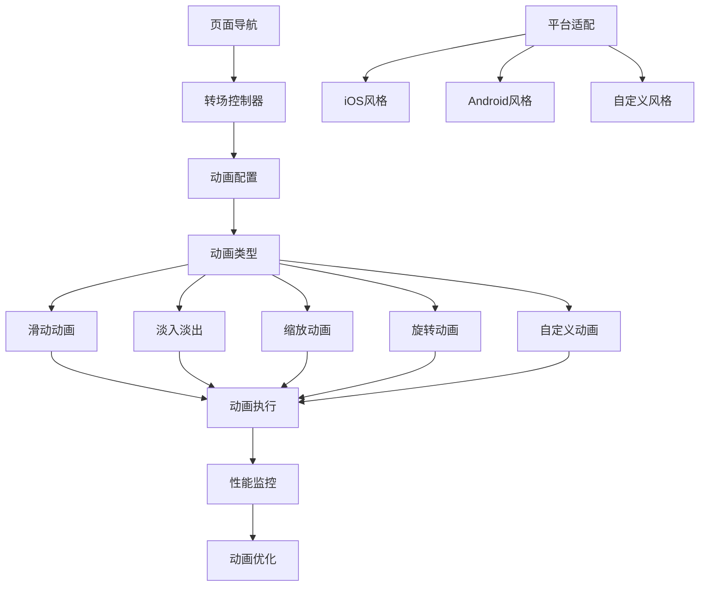
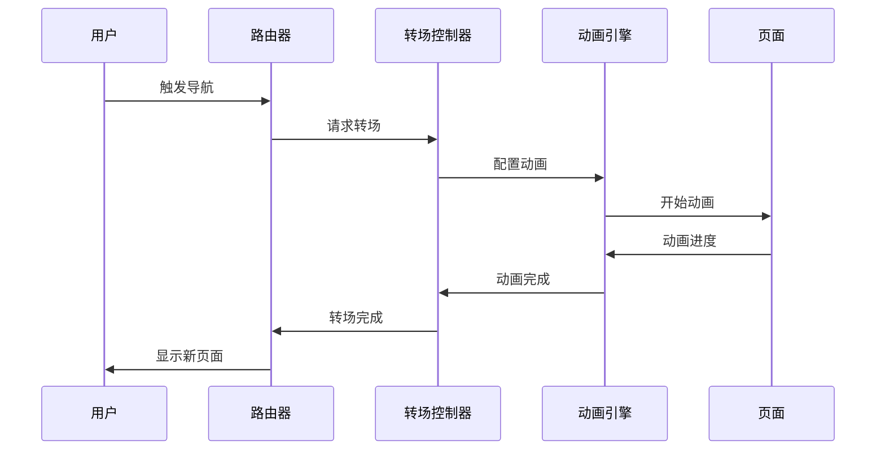

# 页面转场动画

> 创建流畅的页面转场效果，提升用户体验

## 🎬 转场动画架构

### 动画系统概览



### 转场动画流程



## 🎯 核心转场动画

### 基础转场配置

```dart
// lib/core/routing/transitions/page_transition_config.dart
class PageTransitionConfig {
  final Duration duration;
  final Duration reverseDuration;
  final Curve curve;
  final Curve reverseCurve;
  final PageTransitionType type;
  final Alignment alignment;
  final bool maintainState;
  final bool opaque;
  final bool barrierDismissible;
  final Color? barrierColor;
  final String? barrierLabel;
  
  const PageTransitionConfig({
    this.duration = const Duration(milliseconds: 300),
    this.reverseDuration = const Duration(milliseconds: 300),
    this.curve = Curves.easeInOut,
    this.reverseCurve = Curves.easeInOut,
    this.type = PageTransitionType.slide,
    this.alignment = Alignment.centerRight,
    this.maintainState = true,
    this.opaque = true,
    this.barrierDismissible = false,
    this.barrierColor,
    this.barrierLabel,
  });
  
  // 预定义配置
  static const PageTransitionConfig slideFromRight = PageTransitionConfig(
    type: PageTransitionType.slide,
    alignment: Alignment.centerRight,
  );
  
  static const PageTransitionConfig slideFromBottom = PageTransitionConfig(
    type: PageTransitionType.slide,
    alignment: Alignment.bottomCenter,
  );
  
  static const PageTransitionConfig fadeIn = PageTransitionConfig(
    type: PageTransitionType.fade,
    duration: Duration(milliseconds: 250),
  );
  
  static const PageTransitionConfig scaleIn = PageTransitionConfig(
    type: PageTransitionType.scale,
    curve: Curves.elasticOut,
    duration: Duration(milliseconds: 400),
  );
}

enum PageTransitionType {
  slide,
  fade,
  scale,
  rotation,
  slideScale,
  custom,
}
```

### 自定义转场动画

```dart
// lib/core/routing/transitions/custom_page_transition.dart
class CustomPageTransition extends PageRouteBuilder {
  final Widget child;
  final PageTransitionConfig config;
  final RouteSettings settings;
  
  CustomPageTransition({
    required this.child,
    required this.config,
    required this.settings,
  }) : super(
    settings: settings,
    pageBuilder: (context, animation, secondaryAnimation) => child,
    transitionDuration: config.duration,
    reverseTransitionDuration: config.reverseDuration,
    maintainState: config.maintainState,
    opaque: config.opaque,
    barrierDismissible: config.barrierDismissible,
    barrierColor: config.barrierColor,
    barrierLabel: config.barrierLabel,
    transitionsBuilder: (context, animation, secondaryAnimation, child) {
      return _buildTransition(
        context,
        animation,
        secondaryAnimation,
        child,
        config,
      );
    },
  );
  
  static Widget _buildTransition(
    BuildContext context,
    Animation<double> animation,
    Animation<double> secondaryAnimation,
    Widget child,
    PageTransitionConfig config,
  ) {
    switch (config.type) {
      case PageTransitionType.slide:
        return _buildSlideTransition(animation, secondaryAnimation, child, config);
      case PageTransitionType.fade:
        return _buildFadeTransition(animation, child, config);
      case PageTransitionType.scale:
        return _buildScaleTransition(animation, child, config);
      case PageTransitionType.rotation:
        return _buildRotationTransition(animation, child, config);
      case PageTransitionType.slideScale:
        return _buildSlideScaleTransition(animation, secondaryAnimation, child, config);
      case PageTransitionType.custom:
        return _buildCustomTransition(animation, secondaryAnimation, child, config);
    }
  }
  
  // 滑动转场
  static Widget _buildSlideTransition(
    Animation<double> animation,
    Animation<double> secondaryAnimation,
    Widget child,
    PageTransitionConfig config,
  ) {
    final curvedAnimation = CurvedAnimation(
      parent: animation,
      curve: config.curve,
      reverseCurve: config.reverseCurve,
    );
    
    Offset begin;
    switch (config.alignment) {
      case Alignment.centerRight:
        begin = const Offset(1.0, 0.0);
        break;
      case Alignment.centerLeft:
        begin = const Offset(-1.0, 0.0);
        break;
      case Alignment.topCenter:
        begin = const Offset(0.0, -1.0);
        break;
      case Alignment.bottomCenter:
        begin = const Offset(0.0, 1.0);
        break;
      default:
        begin = const Offset(1.0, 0.0);
    }
    
    final slideAnimation = Tween<Offset>(
      begin: begin,
      end: Offset.zero,
    ).animate(curvedAnimation);
    
    // 添加退出动画
    final exitSlideAnimation = Tween<Offset>(
      begin: Offset.zero,
      end: Offset(-0.3, 0.0),
    ).animate(secondaryAnimation);
    
    return SlideTransition(
      position: slideAnimation,
      child: SlideTransition(
        position: exitSlideAnimation,
        child: child,
      ),
    );
  }
  
  // 淡入淡出转场
  static Widget _buildFadeTransition(
    Animation<double> animation,
    Widget child,
    PageTransitionConfig config,
  ) {
    final curvedAnimation = CurvedAnimation(
      parent: animation,
      curve: config.curve,
      reverseCurve: config.reverseCurve,
    );
    
    return FadeTransition(
      opacity: curvedAnimation,
      child: child,
    );
  }
  
  // 缩放转场
  static Widget _buildScaleTransition(
    Animation<double> animation,
    Widget child,
    PageTransitionConfig config,
  ) {
    final curvedAnimation = CurvedAnimation(
      parent: animation,
      curve: config.curve,
      reverseCurve: config.reverseCurve,
    );
    
    final scaleAnimation = Tween<double>(
      begin: 0.0,
      end: 1.0,
    ).animate(curvedAnimation);
    
    return ScaleTransition(
      scale: scaleAnimation,
      alignment: config.alignment,
      child: child,
    );
  }
  
  // 旋转转场
  static Widget _buildRotationTransition(
    Animation<double> animation,
    Widget child,
    PageTransitionConfig config,
  ) {
    final curvedAnimation = CurvedAnimation(
      parent: animation,
      curve: config.curve,
      reverseCurve: config.reverseCurve,
    );
    
    final rotationAnimation = Tween<double>(
      begin: 0.0,
      end: 1.0,
    ).animate(curvedAnimation);
    
    return RotationTransition(
      turns: rotationAnimation,
      alignment: config.alignment,
      child: child,
    );
  }
  
  // 滑动+缩放组合转场
  static Widget _buildSlideScaleTransition(
    Animation<double> animation,
    Animation<double> secondaryAnimation,
    Widget child,
    PageTransitionConfig config,
  ) {
    final curvedAnimation = CurvedAnimation(
      parent: animation,
      curve: config.curve,
      reverseCurve: config.reverseCurve,
    );
    
    final slideAnimation = Tween<Offset>(
      begin: const Offset(1.0, 0.0),
      end: Offset.zero,
    ).animate(curvedAnimation);
    
    final scaleAnimation = Tween<double>(
      begin: 0.8,
      end: 1.0,
    ).animate(curvedAnimation);
    
    return SlideTransition(
      position: slideAnimation,
      child: ScaleTransition(
        scale: scaleAnimation,
        child: child,
      ),
    );
  }
  
  // 自定义转场
  static Widget _buildCustomTransition(
    Animation<double> animation,
    Animation<double> secondaryAnimation,
    Widget child,
    PageTransitionConfig config,
  ) {
    // 可以在这里实现更复杂的自定义动画
    return FadeTransition(
      opacity: animation,
      child: child,
    );
  }
}
```

### 转场管理器

```dart
// lib/core/routing/transitions/transition_manager.dart
class TransitionManager {
  static final Map<String, PageTransitionConfig> _routeTransitions = {};
  static PageTransitionConfig _defaultTransition = PageTransitionConfig.slideFromRight;
  
  // 设置默认转场
  static void setDefaultTransition(PageTransitionConfig config) {
    _defaultTransition = config;
  }
  
  // 为特定路由设置转场
  static void setRouteTransition(String routeName, PageTransitionConfig config) {
    _routeTransitions[routeName] = config;
  }
  
  // 批量设置路由转场
  static void setRouteTransitions(Map<String, PageTransitionConfig> transitions) {
    _routeTransitions.addAll(transitions);
  }
  
  // 获取路由转场配置
  static PageTransitionConfig getTransitionConfig(String? routeName) {
    if (routeName != null && _routeTransitions.containsKey(routeName)) {
      return _routeTransitions[routeName]!;
    }
    return _defaultTransition;
  }
  
  // 创建转场路由
  static Route<T> createRoute<T extends Object?>(
    Widget child,
    RouteSettings settings,
    PageTransitionConfig? config,
  ) {
    final transitionConfig = config ?? getTransitionConfig(settings.name);
    
    return CustomPageTransition(
      child: child,
      config: transitionConfig,
      settings: settings,
    );
  }
  
  // 预定义转场配置
  static void setupDefaultTransitions() {
    setRouteTransitions({
      '/login': PageTransitionConfig.slideFromBottom,
      '/profile': PageTransitionConfig.slideFromRight,
      '/settings': PageTransitionConfig.slideFromRight,
      '/modal': PageTransitionConfig.fadeIn,
      '/dialog': PageTransitionConfig.scaleIn,
    });
  }
}
```

## 🎨 高级转场效果

### 共享元素转场

```dart
// lib/core/routing/transitions/hero_transition.dart
class HeroTransitionRoute<T> extends PageRoute<T> {
  final WidgetBuilder builder;
  final String heroTag;
  final PageTransitionConfig config;
  
  HeroTransitionRoute({
    required this.builder,
    required this.heroTag,
    required this.config,
    required RouteSettings settings,
  }) : super(settings: settings);
  
  @override
  bool get opaque => config.opaque;
  
  @override
  bool get barrierDismissible => config.barrierDismissible;
  
  @override
  Duration get transitionDuration => config.duration;
  
  @override
  Duration get reverseTransitionDuration => config.reverseDuration;
  
  @override
  bool get maintainState => config.maintainState;
  
  @override
  Color? get barrierColor => config.barrierColor;
  
  @override
  String? get barrierLabel => config.barrierLabel;
  
  @override
  Widget buildPage(
    BuildContext context,
    Animation<double> animation,
    Animation<double> secondaryAnimation,
  ) {
    return builder(context);
  }
  
  @override
  Widget buildTransitions(
    BuildContext context,
    Animation<double> animation,
    Animation<double> secondaryAnimation,
    Widget child,
  ) {
    // 组合Hero动画和自定义转场
    return Hero(
      tag: heroTag,
      child: CustomPageTransition._buildTransition(
        context,
        animation,
        secondaryAnimation,
        child,
        config,
      ),
    );
  }
}
```

### 页面转场装饰器

```dart
// lib/core/routing/transitions/transition_decorator.dart
class TransitionDecorator {
  // 添加阴影效果
  static Widget withShadow(Widget child, Animation<double> animation) {
    return AnimatedBuilder(
      animation: animation,
      builder: (context, child) {
        return Container(
          decoration: BoxDecoration(
            boxShadow: [
              BoxShadow(
                color: Colors.black.withOpacity(0.3 * animation.value),
                blurRadius: 10.0 * animation.value,
                offset: Offset(-5.0 * animation.value, 0),
              ),
            ],
          ),
          child: child,
        );
      },
      child: child,
    );
  }
  
  // 添加模糊效果
  static Widget withBlur(Widget child, Animation<double> animation) {
    return AnimatedBuilder(
      animation: animation,
      builder: (context, child) {
        return BackdropFilter(
          filter: ImageFilter.blur(
            sigmaX: 5.0 * (1 - animation.value),
            sigmaY: 5.0 * (1 - animation.value),
          ),
          child: child,
        );
      },
      child: child,
    );
  }
  
  // 添加颜色叠加
  static Widget withColorOverlay(
    Widget child,
    Animation<double> animation,
    Color overlayColor,
  ) {
    return AnimatedBuilder(
      animation: animation,
      builder: (context, child) {
        return Stack(
          children: [
            child!,
            Positioned.fill(
              child: Container(
                color: overlayColor.withOpacity(
                  0.5 * (1 - animation.value),
                ),
              ),
            ),
          ],
        );
      },
      child: child,
    );
  }
}
```

## 🎯 Go Router 集成

### Go Router 转场配置

```dart
// lib/core/routing/app_router.dart
class AppRouter {
  static final GoRouter router = GoRouter(
    routes: [
      GoRoute(
        path: '/',
        pageBuilder: (context, state) => _buildPage(
          context,
          state,
          const HomePage(),
          PageTransitionConfig.fadeIn,
        ),
      ),
      GoRoute(
        path: '/profile',
        pageBuilder: (context, state) => _buildPage(
          context,
          state,
          const ProfilePage(),
          PageTransitionConfig.slideFromRight,
        ),
      ),
      GoRoute(
        path: '/settings',
        pageBuilder: (context, state) => _buildPage(
          context,
          state,
          const SettingsPage(),
          PageTransitionConfig.slideFromBottom,
        ),
      ),
    ],
  );
  
  static Page<T> _buildPage<T extends Object?>(
    BuildContext context,
    GoRouterState state,
    Widget child,
    PageTransitionConfig config,
  ) {
    return CustomTransitionPage<T>(
      key: state.pageKey,
      child: child,
      transitionConfig: config,
      transitionsBuilder: (context, animation, secondaryAnimation, child) {
        return CustomPageTransition._buildTransition(
          context,
          animation,
          secondaryAnimation,
          child,
          config,
        );
      },
    );
  }
}

class CustomTransitionPage<T> extends Page<T> {
  final Widget child;
  final PageTransitionConfig transitionConfig;
  final RouteTransitionsBuilder transitionsBuilder;
  
  const CustomTransitionPage({
    required this.child,
    required this.transitionConfig,
    required this.transitionsBuilder,
    super.key,
    super.name,
    super.arguments,
    super.restorationId,
  });
  
  @override
  Route<T> createRoute(BuildContext context) {
    return PageRouteBuilder<T>(
      settings: this,
      pageBuilder: (context, animation, secondaryAnimation) => child,
      transitionDuration: transitionConfig.duration,
      reverseTransitionDuration: transitionConfig.reverseDuration,
      transitionsBuilder: transitionsBuilder,
    );
  }
}
```

## 📱 平台适配

### iOS 风格转场

```dart
// lib/core/routing/transitions/ios_transitions.dart
class IOSTransitions {
  // iOS 风格滑动转场
  static PageTransitionConfig get cupertinoSlide => const PageTransitionConfig(
    type: PageTransitionType.slide,
    alignment: Alignment.centerRight,
    curve: Curves.linearToEaseOut,
    reverseCurve: Curves.easeInToLinear,
    duration: Duration(milliseconds: 400),
  );
  
  // iOS 风格模态转场
  static PageTransitionConfig get cupertinoModal => const PageTransitionConfig(
    type: PageTransitionType.slide,
    alignment: Alignment.bottomCenter,
    curve: Curves.easeOut,
    reverseCurve: Curves.easeIn,
    duration: Duration(milliseconds: 300),
  );
  
  // 创建 iOS 风格路由
  static Route<T> createCupertinoRoute<T extends Object?>(
    Widget child,
    RouteSettings settings,
  ) {
    return CupertinoPageRoute<T>(
      builder: (context) => child,
      settings: settings,
    );
  }
}
```

### Android 风格转场

```dart
// lib/core/routing/transitions/android_transitions.dart
class AndroidTransitions {
  // Material 风格转场
  static PageTransitionConfig get materialSlide => const PageTransitionConfig(
    type: PageTransitionType.slide,
    alignment: Alignment.centerRight,
    curve: Curves.fastOutSlowIn,
    reverseCurve: Curves.fastOutSlowIn,
    duration: Duration(milliseconds: 300),
  );
  
  // Material 风格淡入
  static PageTransitionConfig get materialFade => const PageTransitionConfig(
    type: PageTransitionType.fade,
    curve: Curves.easeIn,
    reverseCurve: Curves.easeOut,
    duration: Duration(milliseconds: 200),
  );
  
  // 创建 Material 风格路由
  static Route<T> createMaterialRoute<T extends Object?>(
    Widget child,
    RouteSettings settings,
  ) {
    return MaterialPageRoute<T>(
      builder: (context) => child,
      settings: settings,
    );
  }
}
```

## 🔧 性能优化

### 动画性能监控

```dart
// lib/core/routing/transitions/performance_monitor.dart
class TransitionPerformanceMonitor {
  static final List<TransitionMetrics> _metrics = [];
  static bool _isEnabled = false;
  
  static void enable() {
    _isEnabled = true;
  }
  
  static void disable() {
    _isEnabled = false;
  }
  
  static void recordTransition({
    required String routeName,
    required Duration duration,
    required int frameCount,
    required double averageFPS,
  }) {
    if (!_isEnabled) return;
    
    _metrics.add(TransitionMetrics(
      routeName: routeName,
      duration: duration,
      frameCount: frameCount,
      averageFPS: averageFPS,
      timestamp: DateTime.now(),
    ));
    
    // 保持最近100条记录
    if (_metrics.length > 100) {
      _metrics.removeAt(0);
    }
  }
  
  static List<TransitionMetrics> getMetrics() => List.from(_metrics);
  
  static TransitionMetrics? getWorstPerformance() {
    if (_metrics.isEmpty) return null;
    
    return _metrics.reduce((a, b) => a.averageFPS < b.averageFPS ? a : b);
  }
  
  static double getAverageFPS() {
    if (_metrics.isEmpty) return 0.0;
    
    final totalFPS = _metrics.fold<double>(0.0, (sum, metric) => sum + metric.averageFPS);
    return totalFPS / _metrics.length;
  }
}

class TransitionMetrics {
  final String routeName;
  final Duration duration;
  final int frameCount;
  final double averageFPS;
  final DateTime timestamp;
  
  const TransitionMetrics({
    required this.routeName,
    required this.duration,
    required this.frameCount,
    required this.averageFPS,
    required this.timestamp,
  });
}
```

### 动画优化策略

```dart
// lib/core/routing/transitions/optimization_strategies.dart
class TransitionOptimization {
  // 减少重绘的转场
  static Widget optimizedTransition(
    Animation<double> animation,
    Widget child,
  ) {
    return AnimatedBuilder(
      animation: animation,
      builder: (context, child) {
        return Transform.translate(
          offset: Offset(100 * (1 - animation.value), 0),
          child: child,
        );
      },
      child: child,
    );
  }
  
  // 使用 RepaintBoundary 优化
  static Widget withRepaintBoundary(Widget child) {
    return RepaintBoundary(
      child: child,
    );
  }
  
  // 预加载转场动画
  static void preloadTransitions(BuildContext context) {
    // 预热动画控制器
    final controller = AnimationController(
      duration: const Duration(milliseconds: 300),
      vsync: Scaffold.of(context),
    );
    
    // 运行一次空动画来预热
    controller.forward().then((_) {
      controller.dispose();
    });
  }
}
```

## 🧪 转场测试

### 转场测试工具

```dart
// test/routing/transitions/transition_test_helper.dart
class TransitionTestHelper {
  static Future<void> testTransition(
    WidgetTester tester,
    Widget fromPage,
    Widget toPage,
    PageTransitionConfig config,
  ) async {
    // 构建初始页面
    await tester.pumpWidget(
      MaterialApp(
        home: fromPage,
      ),
    );
    
    // 触发转场
    await tester.tap(find.byType(ElevatedButton));
    await tester.pump();
    
    // 验证转场开始
    expect(find.byWidget(toPage), findsOneWidget);
    
    // 等待转场完成
    await tester.pumpAndSettle(config.duration);
    
    // 验证转场完成
    expect(find.byWidget(fromPage), findsNothing);
    expect(find.byWidget(toPage), findsOneWidget);
  }
  
  static Future<void> testTransitionPerformance(
    WidgetTester tester,
    Widget fromPage,
    Widget toPage,
    PageTransitionConfig config,
  ) async {
    final stopwatch = Stopwatch()..start();
    
    await testTransition(tester, fromPage, toPage, config);
    
    stopwatch.stop();
    
    // 验证性能
    expect(stopwatch.elapsedMilliseconds, lessThan(config.duration.inMilliseconds + 100));
  }
}
```

### 转场单元测试

```dart
// test/routing/transitions/page_transition_test.dart
void main() {
  group('Page Transitions', () {
    testWidgets('slide transition works correctly', (tester) async {
      await TransitionTestHelper.testTransition(
        tester,
        const Text('From Page'),
        const Text('To Page'),
        PageTransitionConfig.slideFromRight,
      );
    });
    
    testWidgets('fade transition works correctly', (tester) async {
      await TransitionTestHelper.testTransition(
        tester,
        const Text('From Page'),
        const Text('To Page'),
        PageTransitionConfig.fadeIn,
      );
    });
    
    testWidgets('transition performance is acceptable', (tester) async {
      await TransitionTestHelper.testTransitionPerformance(
        tester,
        const Text('From Page'),
        const Text('To Page'),
        PageTransitionConfig.slideFromRight,
      );
    });
  });
}
```

## 📚 最佳实践

### 转场设计原则

1. **一致性原则**
   - 同类型页面使用相同转场
   - 保持平台风格一致性
   - 遵循Material/Cupertino设计规范

2. **性能优先**
   - 避免复杂的转场动画
   - 使用硬件加速的变换
   - 合理使用RepaintBoundary

3. **用户体验**
   - 转场时长适中（200-400ms）
   - 提供视觉连续性
   - 支持手势中断

### 转场配置建议

```dart
// lib/core/routing/transitions/transition_presets.dart
class TransitionPresets {
  // 主要页面转场
  static const PageTransitionConfig primaryPage = PageTransitionConfig(
    type: PageTransitionType.slide,
    alignment: Alignment.centerRight,
    duration: Duration(milliseconds: 300),
    curve: Curves.easeOutCubic,
  );
  
  // 模态页面转场
  static const PageTransitionConfig modal = PageTransitionConfig(
    type: PageTransitionType.slide,
    alignment: Alignment.bottomCenter,
    duration: Duration(milliseconds: 250),
    curve: Curves.easeOut,
  );
  
  // 对话框转场
  static const PageTransitionConfig dialog = PageTransitionConfig(
    type: PageTransitionType.scale,
    duration: Duration(milliseconds: 200),
    curve: Curves.easeOutBack,
  );
  
  // 快速转场
  static const PageTransitionConfig quick = PageTransitionConfig(
    type: PageTransitionType.fade,
    duration: Duration(milliseconds: 150),
    curve: Curves.easeOut,
  );
}
```

## 🔗 相关资源

- [Flutter Animation Documentation](https://flutter.dev/docs/development/ui/animations)
- [Go Router Transitions](https://pub.dev/packages/go_router)
- [Material Design Motion](https://material.io/design/motion/)
- [iOS Human Interface Guidelines - Animation](https://developer.apple.com/design/human-interface-guidelines/ios/visual-design/animation/)