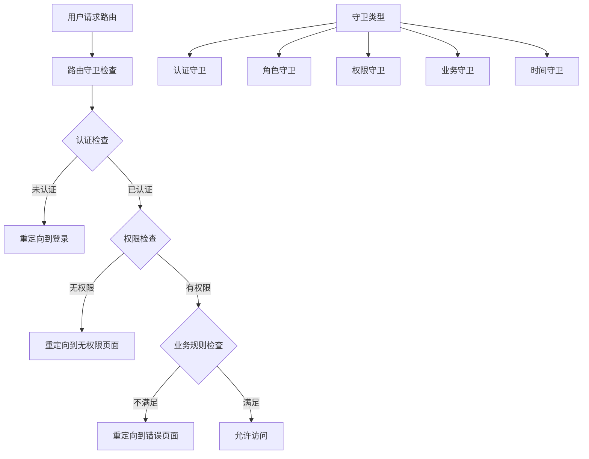

# 路由守卫与权限管理

> 构建安全可靠的路由访问控制系统

## 🛡️ 路由守卫架构

### 守卫系统概览



### 守卫接口定义

```dart
// lib/router/guards/route_guard.dart
abstract class RouteGuard {
  /// 检查路由访问权限
  /// 返回null表示允许访问，返回字符串表示重定向路径
  Future<String?> canActivate(
    BuildContext context,
    GoRouterState state,
  );
  
  /// 守卫优先级，数字越小优先级越高
  int get priority => 0;
  
  /// 守卫名称，用于调试
  String get name;
}

// 守卫结果
@freezed
class GuardResult with _$GuardResult {
  const factory GuardResult.allow() = _Allow;
  const factory GuardResult.redirect(String path) = _Redirect;
  const factory GuardResult.deny(String reason) = _Deny;
}
```

## 🔐 认证守卫

### 基础认证守卫

```dart
// lib/router/guards/auth_guard.dart
class AuthGuard implements RouteGuard {
  final AuthService _authService;
  final List<String> _protectedRoutes;
  final List<String> _guestOnlyRoutes;
  
  const AuthGuard({
    required AuthService authService,
    List<String> protectedRoutes = const [],
    List<String> guestOnlyRoutes = const [],
  }) : _authService = authService,
       _protectedRoutes = protectedRoutes,
       _guestOnlyRoutes = guestOnlyRoutes;
  
  @override
  Future<String?> canActivate(
    BuildContext context,
    GoRouterState state,
  ) async {
    final isAuthenticated = await _authService.isAuthenticated();
    final currentPath = state.matchedLocation;
    
    // 检查受保护的路由
    if (_isProtectedRoute(currentPath) && !isAuthenticated) {
      return _buildLoginRedirect(currentPath);
    }
    
    // 检查仅游客访问的路由
    if (_isGuestOnlyRoute(currentPath) && isAuthenticated) {
      return '/';
    }
    
    return null;
  }
  
  bool _isProtectedRoute(String path) {
    return _protectedRoutes.any((route) => path.startsWith(route));
  }
  
  bool _isGuestOnlyRoute(String path) {
    return _guestOnlyRoutes.any((route) => path.startsWith(route));
  }
  
  String _buildLoginRedirect(String originalPath) {
    final encodedPath = Uri.encodeComponent(originalPath);
    return '/login?redirect=$encodedPath';
  }
  
  @override
  int get priority => 100;
  
  @override
  String get name => 'AuthGuard';
}
```

### Token验证守卫

```dart
// lib/router/guards/token_guard.dart
class TokenGuard implements RouteGuard {
  final TokenService _tokenService;
  final Duration _refreshThreshold;
  
  const TokenGuard({
    required TokenService tokenService,
    Duration refreshThreshold = const Duration(minutes: 5),
  }) : _tokenService = tokenService,
       _refreshThreshold = refreshThreshold;
  
  @override
  Future<String?> canActivate(
    BuildContext context,
    GoRouterState state,
  ) async {
    final token = await _tokenService.getAccessToken();
    
    if (token == null) {
      return '/login';
    }
    
    // 检查token是否即将过期
    final expiresAt = await _tokenService.getTokenExpiration();
    if (expiresAt != null) {
      final timeUntilExpiry = expiresAt.difference(DateTime.now());
      
      if (timeUntilExpiry < _refreshThreshold) {
        try {
          await _tokenService.refreshToken();
        } catch (e) {
          // 刷新失败，重定向到登录
          return '/login';
        }
      }
    }
    
    return null;
  }
  
  @override
  int get priority => 90;
  
  @override
  String get name => 'TokenGuard';
}
```

## 👥 角色与权限守卫

### 角色守卫

```dart
// lib/router/guards/role_guard.dart
class RoleGuard implements RouteGuard {
  final UserService _userService;
  final Map<String, List<String>> _routeRoles;
  
  const RoleGuard({
    required UserService userService,
    required Map<String, List<String>> routeRoles,
  }) : _userService = userService,
       _routeRoles = routeRoles;
  
  @override
  Future<String?> canActivate(
    BuildContext context,
    GoRouterState state,
  ) async {
    final currentPath = state.matchedLocation;
    final requiredRoles = _getRequiredRoles(currentPath);
    
    if (requiredRoles.isEmpty) {
      return null; // 无角色要求
    }
    
    final user = await _userService.getCurrentUser();
    if (user == null) {
      return '/login';
    }
    
    final userRoles = user.roles;
    final hasRequiredRole = requiredRoles.any(
      (role) => userRoles.contains(role),
    );
    
    if (!hasRequiredRole) {
      return '/unauthorized?reason=insufficient_role';
    }
    
    return null;
  }
  
  List<String> _getRequiredRoles(String path) {
    for (final entry in _routeRoles.entries) {
      if (path.startsWith(entry.key)) {
        return entry.value;
      }
    }
    return [];
  }
  
  @override
  int get priority => 80;
  
  @override
  String get name => 'RoleGuard';
}
```

### 权限守卫

```dart
// lib/router/guards/permission_guard.dart
class PermissionGuard implements RouteGuard {
  final PermissionService _permissionService;
  final Map<String, List<Permission>> _routePermissions;
  
  const PermissionGuard({
    required PermissionService permissionService,
    required Map<String, List<Permission>> routePermissions,
  }) : _permissionService = permissionService,
       _routePermissions = routePermissions;
  
  @override
  Future<String?> canActivate(
    BuildContext context,
    GoRouterState state,
  ) async {
    final currentPath = state.matchedLocation;
    final requiredPermissions = _getRequiredPermissions(currentPath);
    
    if (requiredPermissions.isEmpty) {
      return null;
    }
    
    final hasPermissions = await _permissionService.hasPermissions(
      requiredPermissions,
    );
    
    if (!hasPermissions) {
      return '/unauthorized?reason=insufficient_permission';
    }
    
    return null;
  }
  
  List<Permission> _getRequiredPermissions(String path) {
    for (final entry in _routePermissions.entries) {
      if (path.startsWith(entry.key)) {
        return entry.value;
      }
    }
    return [];
  }
  
  @override
  int get priority => 70;
  
  @override
  String get name => 'PermissionGuard';
}

// 权限枚举
enum Permission {
  readUsers,
  writeUsers,
  deleteUsers,
  readOrders,
  writeOrders,
  deleteOrders,
  readProducts,
  writeProducts,
  deleteProducts,
  manageSystem,
}
```

## 🏢 业务规则守卫

### 订阅状态守卫

```dart
// lib/router/guards/subscription_guard.dart
class SubscriptionGuard implements RouteGuard {
  final SubscriptionService _subscriptionService;
  final List<String> _premiumRoutes;
  
  const SubscriptionGuard({
    required SubscriptionService subscriptionService,
    required List<String> premiumRoutes,
  }) : _subscriptionService = subscriptionService,
       _premiumRoutes = premiumRoutes;
  
  @override
  Future<String?> canActivate(
    BuildContext context,
    GoRouterState state,
  ) async {
    final currentPath = state.matchedLocation;
    
    if (!_isPremiumRoute(currentPath)) {
      return null;
    }
    
    final subscription = await _subscriptionService.getCurrentSubscription();
    
    if (subscription == null || !subscription.isActive) {
      return '/subscription/upgrade?feature=${Uri.encodeComponent(currentPath)}';
    }
    
    // 检查功能是否在订阅计划中
    if (!subscription.plan.features.contains(_getFeatureForRoute(currentPath))) {
      return '/subscription/upgrade?feature=${Uri.encodeComponent(currentPath)}';
    }
    
    return null;
  }
  
  bool _isPremiumRoute(String path) {
    return _premiumRoutes.any((route) => path.startsWith(route));
  }
  
  String _getFeatureForRoute(String path) {
    // 根据路径映射到功能名称
    if (path.startsWith('/analytics')) return 'advanced_analytics';
    if (path.startsWith('/export')) return 'data_export';
    if (path.startsWith('/api')) return 'api_access';
    return 'premium_feature';
  }
  
  @override
  int get priority => 60;
  
  @override
  String get name => 'SubscriptionGuard';
}
```

### 设备限制守卫

```dart
// lib/router/guards/device_guard.dart
class DeviceGuard implements RouteGuard {
  final DeviceService _deviceService;
  final List<String> _mobileOnlyRoutes;
  final List<String> _desktopOnlyRoutes;
  
  const DeviceGuard({
    required DeviceService deviceService,
    List<String> mobileOnlyRoutes = const [],
    List<String> desktopOnlyRoutes = const [],
  }) : _deviceService = deviceService,
       _mobileOnlyRoutes = mobileOnlyRoutes,
       _desktopOnlyRoutes = desktopOnlyRoutes;
  
  @override
  Future<String?> canActivate(
    BuildContext context,
    GoRouterState state,
  ) async {
    final currentPath = state.matchedLocation;
    final deviceType = _deviceService.getDeviceType();
    
    // 检查移动端专用路由
    if (_isMobileOnlyRoute(currentPath) && deviceType != DeviceType.mobile) {
      return '/device-not-supported?type=mobile';
    }
    
    // 检查桌面端专用路由
    if (_isDesktopOnlyRoute(currentPath) && deviceType == DeviceType.mobile) {
      return '/device-not-supported?type=desktop';
    }
    
    return null;
  }
  
  bool _isMobileOnlyRoute(String path) {
    return _mobileOnlyRoutes.any((route) => path.startsWith(route));
  }
  
  bool _isDesktopOnlyRoute(String path) {
    return _desktopOnlyRoutes.any((route) => path.startsWith(route));
  }
  
  @override
  int get priority => 50;
  
  @override
  String get name => 'DeviceGuard';
}
```

## ⏰ 时间与频率守卫

### 时间窗口守卫

```dart
// lib/router/guards/time_window_guard.dart
class TimeWindowGuard implements RouteGuard {
  final Map<String, TimeWindow> _routeTimeWindows;
  
  const TimeWindowGuard({
    required Map<String, TimeWindow> routeTimeWindows,
  }) : _routeTimeWindows = routeTimeWindows;
  
  @override
  Future<String?> canActivate(
    BuildContext context,
    GoRouterState state,
  ) async {
    final currentPath = state.matchedLocation;
    final timeWindow = _getTimeWindow(currentPath);
    
    if (timeWindow == null) {
      return null;
    }
    
    final now = DateTime.now();
    
    if (!timeWindow.isWithinWindow(now)) {
      return '/service-unavailable?reason=outside_hours';
    }
    
    return null;
  }
  
  TimeWindow? _getTimeWindow(String path) {
    for (final entry in _routeTimeWindows.entries) {
      if (path.startsWith(entry.key)) {
        return entry.value;
      }
    }
    return null;
  }
  
  @override
  int get priority => 40;
  
  @override
  String get name => 'TimeWindowGuard';
}

@freezed
class TimeWindow with _$TimeWindow {
  const factory TimeWindow({
    required TimeOfDay startTime,
    required TimeOfDay endTime,
    List<int>? allowedWeekdays, // 1-7, Monday-Sunday
    List<DateTime>? excludedDates,
  }) = _TimeWindow;
  
  bool isWithinWindow(DateTime dateTime) {
    // 检查星期几
    if (allowedWeekdays != null && 
        !allowedWeekdays!.contains(dateTime.weekday)) {
      return false;
    }
    
    // 检查排除日期
    if (excludedDates != null) {
      final date = DateTime(dateTime.year, dateTime.month, dateTime.day);
      if (excludedDates!.any((excluded) => 
          excluded.year == date.year &&
          excluded.month == date.month &&
          excluded.day == date.day)) {
        return false;
      }
    }
    
    // 检查时间窗口
    final currentTime = TimeOfDay.fromDateTime(dateTime);
    return _isTimeInRange(currentTime, startTime, endTime);
  }
  
  bool _isTimeInRange(TimeOfDay current, TimeOfDay start, TimeOfDay end) {
    final currentMinutes = current.hour * 60 + current.minute;
    final startMinutes = start.hour * 60 + start.minute;
    final endMinutes = end.hour * 60 + end.minute;
    
    if (startMinutes <= endMinutes) {
      // 同一天内的时间范围
      return currentMinutes >= startMinutes && currentMinutes <= endMinutes;
    } else {
      // 跨天的时间范围
      return currentMinutes >= startMinutes || currentMinutes <= endMinutes;
    }
  }
}
```

### 访问频率守卫

```dart
// lib/router/guards/rate_limit_guard.dart
class RateLimitGuard implements RouteGuard {
  final Map<String, RateLimit> _routeRateLimits;
  final Map<String, List<DateTime>> _accessHistory = {};
  
  RateLimitGuard({
    required Map<String, RateLimit> routeRateLimits,
  }) : _routeRateLimits = routeRateLimits;
  
  @override
  Future<String?> canActivate(
    BuildContext context,
    GoRouterState state,
  ) async {
    final currentPath = state.matchedLocation;
    final rateLimit = _getRateLimit(currentPath);
    
    if (rateLimit == null) {
      return null;
    }
    
    final userId = await _getCurrentUserId();
    final key = '${userId}_$currentPath';
    
    if (_isRateLimited(key, rateLimit)) {
      return '/rate-limited?retry_after=${rateLimit.windowDuration.inSeconds}';
    }
    
    _recordAccess(key);
    return null;
  }
  
  RateLimit? _getRateLimit(String path) {
    for (final entry in _routeRateLimits.entries) {
      if (path.startsWith(entry.key)) {
        return entry.value;
      }
    }
    return null;
  }
  
  bool _isRateLimited(String key, RateLimit rateLimit) {
    final history = _accessHistory[key] ?? [];
    final now = DateTime.now();
    final windowStart = now.subtract(rateLimit.windowDuration);
    
    // 清理过期记录
    history.removeWhere((time) => time.isBefore(windowStart));
    
    return history.length >= rateLimit.maxRequests;
  }
  
  void _recordAccess(String key) {
    _accessHistory[key] ??= [];
    _accessHistory[key]!.add(DateTime.now());
  }
  
  Future<String> _getCurrentUserId() async {
    // 获取当前用户ID或设备ID
    return 'user_123'; // 示例
  }
  
  @override
  int get priority => 30;
  
  @override
  String get name => 'RateLimitGuard';
}

@freezed
class RateLimit with _$RateLimit {
  const factory RateLimit({
    required int maxRequests,
    required Duration windowDuration,
  }) = _RateLimit;
}
```

## 🔧 守卫管理器

### 守卫执行器

```dart
// lib/router/guards/guard_manager.dart
class GuardManager {
  final List<RouteGuard> _guards;
  final bool _stopOnFirstFailure;
  
  const GuardManager({
    required List<RouteGuard> guards,
    bool stopOnFirstFailure = true,
  }) : _guards = guards,
       _stopOnFirstFailure = stopOnFirstFailure;
  
  /// 执行所有守卫检查
  Future<String?> executeGuards(
    BuildContext context,
    GoRouterState state,
  ) async {
    // 按优先级排序守卫
    final sortedGuards = List<RouteGuard>.from(_guards)
      ..sort((a, b) => b.priority.compareTo(a.priority));
    
    final results = <String, String?>{};
    
    for (final guard in sortedGuards) {
      try {
        final result = await guard.canActivate(context, state);
        results[guard.name] = result;
        
        if (result != null && _stopOnFirstFailure) {
          _logGuardResult(guard.name, result, state.matchedLocation);
          return result;
        }
      } catch (e, stackTrace) {
        _logGuardError(guard.name, e, stackTrace);
        
        if (_stopOnFirstFailure) {
          return '/error?reason=guard_error';
        }
      }
    }
    
    // 如果不是在第一个失败时停止，检查是否有任何重定向
    final redirects = results.values.where((result) => result != null);
    if (redirects.isNotEmpty) {
      return redirects.first;
    }
    
    return null;
  }
  
  void _logGuardResult(String guardName, String redirect, String originalPath) {
    print('守卫 $guardName 阻止访问 $originalPath，重定向到 $redirect');
  }
  
  void _logGuardError(String guardName, Object error, StackTrace stackTrace) {
    print('守卫 $guardName 执行错误: $error');
    print('堆栈跟踪: $stackTrace');
  }
}
```

### 守卫配置

```dart
// lib/router/guards/guard_config.dart
class GuardConfig {
  static GuardManager createGuardManager({
    required AuthService authService,
    required UserService userService,
    required PermissionService permissionService,
    required SubscriptionService subscriptionService,
    required DeviceService deviceService,
  }) {
    final guards = <RouteGuard>[
      // 认证守卫
      AuthGuard(
        authService: authService,
        protectedRoutes: [
          '/profile',
          '/orders',
          '/settings',
          '/admin',
        ],
        guestOnlyRoutes: [
          '/login',
          '/register',
        ],
      ),
      
      // Token守卫
      TokenGuard(
        tokenService: authService.tokenService,
        refreshThreshold: const Duration(minutes: 5),
      ),
      
      // 角色守卫
      RoleGuard(
        userService: userService,
        routeRoles: {
          '/admin': ['admin', 'super_admin'],
          '/analytics': ['admin', 'analyst'],
          '/users': ['admin', 'user_manager'],
        },
      ),
      
      // 权限守卫
      PermissionGuard(
        permissionService: permissionService,
        routePermissions: {
          '/admin/users': [Permission.readUsers, Permission.writeUsers],
          '/admin/orders': [Permission.readOrders],
          '/admin/products': [Permission.readProducts],
        },
      ),
      
      // 订阅守卫
      SubscriptionGuard(
        subscriptionService: subscriptionService,
        premiumRoutes: [
          '/analytics',
          '/export',
          '/api',
        ],
      ),
      
      // 设备守卫
      DeviceGuard(
        deviceService: deviceService,
        mobileOnlyRoutes: ['/mobile-scanner'],
        desktopOnlyRoutes: ['/admin/bulk-operations'],
      ),
      
      // 时间窗口守卫
      TimeWindowGuard(
        routeTimeWindows: {
          '/maintenance': TimeWindow(
            startTime: const TimeOfDay(hour: 2, minute: 0),
            endTime: const TimeOfDay(hour: 4, minute: 0),
          ),
        },
      ),
      
      // 频率限制守卫
      RateLimitGuard(
        routeRateLimits: {
          '/api': const RateLimit(
            maxRequests: 100,
            windowDuration: Duration(minutes: 1),
          ),
          '/export': const RateLimit(
            maxRequests: 5,
            windowDuration: Duration(hours: 1),
          ),
        },
      ),
    ];
    
    return GuardManager(
      guards: guards,
      stopOnFirstFailure: true,
    );
  }
}
```

## 🧪 守卫测试

### 守卫单元测试

```dart
// test/router/guards/auth_guard_test.dart
void main() {
  group('AuthGuard Tests', () {
    late MockAuthService mockAuthService;
    late AuthGuard authGuard;
    
    setUp(() {
      mockAuthService = MockAuthService();
      authGuard = AuthGuard(
        authService: mockAuthService,
        protectedRoutes: ['/profile', '/admin'],
        guestOnlyRoutes: ['/login'],
      );
    });
    
    testWidgets('should redirect to login for protected route when not authenticated', 
        (tester) async {
      // Arrange
      when(mockAuthService.isAuthenticated()).thenAnswer((_) async => false);
      final state = GoRouterState(
        location: '/profile',
        matchedLocation: '/profile',
        name: 'profile',
        path: '/profile',
        fullPath: '/profile',
        pathParameters: {},
        queryParameters: {},
        extra: null,
      );
      
      // Act
      final result = await authGuard.canActivate(
        tester.element(find.byType(MaterialApp)),
        state,
      );
      
      // Assert
      expect(result, equals('/login?redirect=%2Fprofile'));
    });
    
    testWidgets('should allow access to protected route when authenticated', 
        (tester) async {
      // Arrange
      when(mockAuthService.isAuthenticated()).thenAnswer((_) async => true);
      final state = GoRouterState(
        location: '/profile',
        matchedLocation: '/profile',
        name: 'profile',
        path: '/profile',
        fullPath: '/profile',
        pathParameters: {},
        queryParameters: {},
        extra: null,
      );
      
      // Act
      final result = await authGuard.canActivate(
        tester.element(find.byType(MaterialApp)),
        state,
      );
      
      // Assert
      expect(result, isNull);
    });
  });
}
```

### 集成测试

```dart
// test/router/guards/guard_integration_test.dart
void main() {
  group('Guard Integration Tests', () {
    testWidgets('should execute guards in correct order', (tester) async {
      final executionOrder = <String>[];
      
      final guard1 = MockGuard('Guard1', priority: 100, onExecute: () {
        executionOrder.add('Guard1');
      });
      
      final guard2 = MockGuard('Guard2', priority: 200, onExecute: () {
        executionOrder.add('Guard2');
      });
      
      final guardManager = GuardManager(guards: [guard1, guard2]);
      
      final state = createMockGoRouterState('/test');
      
      await guardManager.executeGuards(
        tester.element(find.byType(MaterialApp)),
        state,
      );
      
      expect(executionOrder, equals(['Guard2', 'Guard1']));
    });
  });
}
```

## 🎯 最佳实践

### 守卫设计原则

1. **单一职责**：每个守卫只负责一种类型的检查
2. **优先级设计**：合理设置守卫优先级，确保执行顺序正确
3. **错误处理**：妥善处理守卫执行中的异常
4. **性能优化**：避免在守卫中执行耗时操作
5. **可测试性**：设计易于测试的守卫接口

### 性能优化建议

```dart
// 缓存守卫结果
class CachedGuard implements RouteGuard {
  final RouteGuard _delegate;
  final Map<String, GuardCacheEntry> _cache = {};
  final Duration _cacheDuration;
  
  CachedGuard(this._delegate, {Duration? cacheDuration})
      : _cacheDuration = cacheDuration ?? const Duration(minutes: 5);
  
  @override
  Future<String?> canActivate(BuildContext context, GoRouterState state) async {
    final cacheKey = '${state.matchedLocation}_${_getUserId()}';
    final cached = _cache[cacheKey];
    
    if (cached != null && !cached.isExpired) {
      return cached.result;
    }
    
    final result = await _delegate.canActivate(context, state);
    
    _cache[cacheKey] = GuardCacheEntry(
      result: result,
      timestamp: DateTime.now(),
    );
    
    return result;
  }
  
  String _getUserId() {
    // 获取用户ID用于缓存键
    return 'user_123';
  }
  
  @override
  int get priority => _delegate.priority;
  
  @override
  String get name => '${_delegate.name}(Cached)';
}

class GuardCacheEntry {
  final String? result;
  final DateTime timestamp;
  
  GuardCacheEntry({required this.result, required this.timestamp});
  
  bool get isExpired => DateTime.now().difference(timestamp) > const Duration(minutes: 5);
}
```

### 调试工具

```dart
// lib/router/guards/guard_debugger.dart
class GuardDebugger {
  static bool _isEnabled = false;
  static final List<GuardExecutionLog> _logs = [];
  
  static void enable() {
    _isEnabled = true;
  }
  
  static void disable() {
    _isEnabled = false;
  }
  
  static void logExecution({
    required String guardName,
    required String route,
    required String? result,
    required Duration duration,
  }) {
    if (!_isEnabled) return;
    
    _logs.add(GuardExecutionLog(
      guardName: guardName,
      route: route,
      result: result,
      duration: duration,
      timestamp: DateTime.now(),
    ));
    
    print('守卫执行: $guardName on $route -> ${result ?? "允许"} (${duration.inMilliseconds}ms)');
  }
  
  static List<GuardExecutionLog> getLogs() => List.from(_logs);
  
  static void clearLogs() {
    _logs.clear();
  }
}

@freezed
class GuardExecutionLog with _$GuardExecutionLog {
  const factory GuardExecutionLog({
    required String guardName,
    required String route,
    required String? result,
    required Duration duration,
    required DateTime timestamp,
  }) = _GuardExecutionLog;
}
```

---

## 📚 相关资源

- [Flutter 路由安全最佳实践](https://docs.flutter.dev/development/ui/navigation/security)
- [Go Router 高级用法](https://pub.dev/packages/go_router)
- [权限管理设计模式](https://flutter.dev/docs/development/accessibility-and-localization/accessibility)