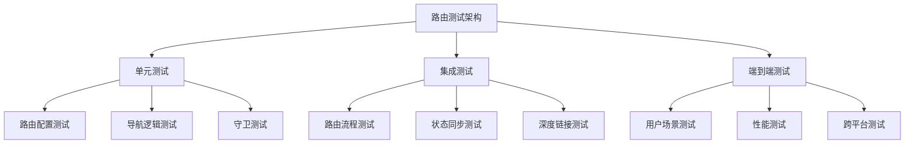

# 路由测试

> Flutter 路由系统的全面测试策略，包括单元测试、集成测试和端到端测试。

## 测试架构概览



## 测试工具配置

### 依赖配置

```yaml:pubspec.yaml
dev_dependencies:
  flutter_test:
    sdk: flutter
  integration_test:
    sdk: flutter
  mockito: ^5.4.2
  build_runner: ^2.4.7
  go_router_builder: ^2.3.4
  patrol: ^3.0.0
  golden_toolkit: ^0.15.0
```

### 测试工具类

```dart:test%2Fhelpers%2Frouter_test_helper.dart
import 'package:flutter/material.dart';
import 'package:flutter_test/flutter_test.dart';
import 'package:go_router/go_router.dart';
import 'package:mockito/mockito.dart';

class RouterTestHelper {
  static GoRouter createTestRouter({
    List<RouteBase>? routes,
    String? initialLocation,
    GoRouterRedirect? redirect,
  }) {
    return GoRouter(
      routes: routes ?? _defaultRoutes,
      initialLocation: initialLocation ?? '/',
      redirect: redirect,
      debugLogDiagnostics: true,
    );
  }

  static List<RouteBase> get _defaultRoutes => [
    GoRoute(
      path: '/',
      builder: (context, state) => const HomePage(),
    ),
    GoRoute(
      path: '/profile',
      builder: (context, state) => const ProfilePage(),
    ),
    GoRoute(
      path: '/login',
      builder: (context, state) => const LoginPage(),
    ),
  ];

  static Widget createTestApp(GoRouter router) {
    return MaterialApp.router(
      routerConfig: router,
    );
  }

  static Future<void> pumpRouterApp(
    WidgetTester tester,
    GoRouter router,
  ) async {
    await tester.pumpWidget(createTestApp(router));
    await tester.pumpAndSettle();
  }

  static void expectCurrentRoute(GoRouter router, String expectedPath) {
    expect(router.routerDelegate.currentConfiguration.uri.path, expectedPath);
  }
}

// Mock 类
class MockAuthService extends Mock implements AuthService {}
class MockUserRepository extends Mock implements UserRepository {}
```

## 单元测试

### 路由配置测试

```dart:test%2Funit%2Frouter_config_test.dart
import 'package:flutter_test/flutter_test.dart';
import 'package:go_router/go_router.dart';
import '../helpers/router_test_helper.dart';

void main() {
  group('Router Configuration Tests', () {
    late GoRouter router;

    setUp(() {
      router = RouterTestHelper.createTestRouter();
    });

    test('should have correct initial route', () {
      expect(router.routerDelegate.currentConfiguration.uri.path, '/');
    });

    test('should match route patterns correctly', () {
      final routes = router.configuration.routes;
      expect(routes.length, 3);
      
      final homeRoute = routes[0] as GoRoute;
      expect(homeRoute.path, '/');
      
      final profileRoute = routes[1] as GoRoute;
      expect(profileRoute.path, '/profile');
    });

    test('should handle route parameters', () {
      final router = RouterTestHelper.createTestRouter(
        routes: [
          GoRoute(
            path: '/user/:id',
            builder: (context, state) {
              final id = state.pathParameters['id'];
              return UserPage(userId: id!);
            },
          ),
        ],
      );

      router.go('/user/123');
      expect(router.routerDelegate.currentConfiguration.uri.path, '/user/123');
    });
  });
}
```

### 导航逻辑测试

```dart:test%2Funit%2Fnavigation_test.dart
import 'package:flutter/material.dart';
import 'package:flutter_test/flutter_test.dart';
import 'package:go_router/go_router.dart';
import '../helpers/router_test_helper.dart';

void main() {
  group('Navigation Logic Tests', () {
    testWidgets('should navigate to profile page', (tester) async {
      final router = RouterTestHelper.createTestRouter();
      await RouterTestHelper.pumpRouterApp(tester, router);

      // 验证初始页面
      expect(find.byType(HomePage), findsOneWidget);
      RouterTestHelper.expectCurrentRoute(router, '/');

      // 导航到 profile 页面
      router.go('/profile');
      await tester.pumpAndSettle();

      expect(find.byType(ProfilePage), findsOneWidget);
      RouterTestHelper.expectCurrentRoute(router, '/profile');
    });

    testWidgets('should handle back navigation', (tester) async {
      final router = RouterTestHelper.createTestRouter();
      await RouterTestHelper.pumpRouterApp(tester, router);

      // 导航到 profile
      router.push('/profile');
      await tester.pumpAndSettle();
      RouterTestHelper.expectCurrentRoute(router, '/profile');

      // 返回上一页
      router.pop();
      await tester.pumpAndSettle();
      RouterTestHelper.expectCurrentRoute(router, '/');
    });

    testWidgets('should replace current route', (tester) async {
      final router = RouterTestHelper.createTestRouter();
      await RouterTestHelper.pumpRouterApp(tester, router);

      // 替换当前路由
      router.pushReplacement('/login');
      await tester.pumpAndSettle();

      expect(find.byType(LoginPage), findsOneWidget);
      RouterTestHelper.expectCurrentRoute(router, '/login');

      // 尝试返回，应该无法返回到首页
      expect(router.canPop(), false);
    });
  });
}
```

### 路由守卫测试

```dart:test%2Funit%2Froute_guards_test.dart
import 'package:flutter_test/flutter_test.dart';
import 'package:mockito/mockito.dart';
import 'package:go_router/go_router.dart';
import '../helpers/router_test_helper.dart';

void main() {
  group('Route Guards Tests', () {
    late MockAuthService mockAuthService;
    late GoRouter router;

    setUp(() {
      mockAuthService = MockAuthService();
      router = GoRouter(
        routes: [
          GoRoute(
            path: '/',
            builder: (context, state) => const HomePage(),
          ),
          GoRoute(
            path: '/profile',
            builder: (context, state) => const ProfilePage(),
          ),
          GoRoute(
            path: '/login',
            builder: (context, state) => const LoginPage(),
          ),
        ],
        redirect: (context, state) {
          final isLoggedIn = mockAuthService.isAuthenticated;
          final isLoginRoute = state.uri.path == '/login';

          if (!isLoggedIn && !isLoginRoute) {
            return '/login';
          }
          if (isLoggedIn && isLoginRoute) {
            return '/';
          }
          return null;
        },
      );
    });

    test('should redirect to login when not authenticated', () {
      when(mockAuthService.isAuthenticated).thenReturn(false);
      
      router.go('/profile');
      expect(router.routerDelegate.currentConfiguration.uri.path, '/login');
    });

    test('should allow access when authenticated', () {
      when(mockAuthService.isAuthenticated).thenReturn(true);
      
      router.go('/profile');
      expect(router.routerDelegate.currentConfiguration.uri.path, '/profile');
    });

    test('should redirect from login when already authenticated', () {
      when(mockAuthService.isAuthenticated).thenReturn(true);
      
      router.go('/login');
      expect(router.routerDelegate.currentConfiguration.uri.path, '/');
    });
  });
}
```

## 集成测试

### 路由流程测试

```dart:integration_test%2Frouter_flow_test.dart
import 'package:flutter/material.dart';
import 'package:flutter_test/flutter_test.dart';
import 'package:integration_test/integration_test.dart';
import 'package:myapp/main.dart' as app;

void main() {
  IntegrationTestWidgetsFlutterBinding.ensureInitialized();

  group('Router Flow Integration Tests', () {
    testWidgets('complete user journey flow', (tester) async {
      app.main();
      await tester.pumpAndSettle();

      // 1. 验证启动页面
      expect(find.text('Welcome'), findsOneWidget);

      // 2. 导航到登录页面
      await tester.tap(find.text('Login'));
      await tester.pumpAndSettle();
      expect(find.text('Login Form'), findsOneWidget);

      // 3. 执行登录
      await tester.enterText(find.byKey(const Key('email')), 'test@example.com');
      await tester.enterText(find.byKey(const Key('password')), 'password');
      await tester.tap(find.text('Submit'));
      await tester.pumpAndSettle();

      // 4. 验证登录后重定向
      expect(find.text('Dashboard'), findsOneWidget);

      // 5. 导航到用户资料
      await tester.tap(find.byIcon(Icons.person));
      await tester.pumpAndSettle();
      expect(find.text('User Profile'), findsOneWidget);

      // 6. 测试深度链接
      // 模拟深度链接导航
      await tester.binding.defaultBinaryMessenger.handlePlatformMessage(
        'flutter/navigation',
        const StandardMethodCodec().encodeMethodCall(
          const MethodCall('routeUpdated', {
            'location': '/settings/notifications',
            'state': null,
          }),
        ),
        (data) {},
      );
      await tester.pumpAndSettle();
      expect(find.text('Notification Settings'), findsOneWidget);
    });

    testWidgets('error handling flow', (tester) async {
      app.main();
      await tester.pumpAndSettle();

      // 导航到不存在的路由
      await tester.binding.defaultBinaryMessenger.handlePlatformMessage(
        'flutter/navigation',
        const StandardMethodCodec().encodeMethodCall(
          const MethodCall('routeUpdated', {
            'location': '/nonexistent',
            'state': null,
          }),
        ),
        (data) {},
      );
      await tester.pumpAndSettle();

      // 验证错误页面
      expect(find.text('Page Not Found'), findsOneWidget);
      expect(find.text('Go Home'), findsOneWidget);

      // 点击返回首页
      await tester.tap(find.text('Go Home'));
      await tester.pumpAndSettle();
      expect(find.text('Welcome'), findsOneWidget);
    });
  });
}
```

### 状态同步测试

```dart:integration_test%2Fstate_sync_test.dart
import 'package:flutter_test/flutter_test.dart';
import 'package:integration_test/integration_test.dart';
import 'package:provider/provider.dart';
import 'package:myapp/main.dart' as app;
import 'package:myapp/providers/auth_provider.dart';

void main() {
  IntegrationTestWidgetsFlutterBinding.ensureInitialized();

  group('State Synchronization Tests', () {
    testWidgets('auth state and routing sync', (tester) async {
      app.main();
      await tester.pumpAndSettle();

      final authProvider = Provider.of<AuthProvider>(
        tester.element(find.byType(MaterialApp)),
        listen: false,
      );

      // 1. 验证未登录状态
      expect(authProvider.isAuthenticated, false);
      expect(find.text('Login'), findsOneWidget);

      // 2. 执行登录
      await tester.tap(find.text('Login'));
      await tester.pumpAndSettle();
      
      await tester.enterText(find.byKey(const Key('email')), 'test@example.com');
      await tester.enterText(find.byKey(const Key('password')), 'password');
      await tester.tap(find.text('Submit'));
      await tester.pumpAndSettle();

      // 3. 验证状态同步
      expect(authProvider.isAuthenticated, true);
      expect(find.text('Dashboard'), findsOneWidget);

      // 4. 测试登出
      await tester.tap(find.byIcon(Icons.logout));
      await tester.pumpAndSettle();

      // 5. 验证登出后状态
      expect(authProvider.isAuthenticated, false);
      expect(find.text('Login'), findsOneWidget);
    });
  });
}
```

## 端到端测试

### Patrol 测试配置

```dart:integration_test%2Fpatrol_test.dart
import 'package:patrol/patrol.dart';
import 'package:flutter/material.dart';
import 'package:myapp/main.dart' as app;

void main() {
  patrolTest(
    'complete app navigation flow',
    (PatrolTester $) async {
      app.main();
      await $.pumpAndSettle();

      // 测试底部导航
      await $(Icons.home).tap();
      await $.pumpAndSettle();
      expect($(#homeTab), findsOneWidget);

      await $(Icons.search).tap();
      await $.pumpAndSettle();
      expect($(#searchTab), findsOneWidget);

      // 测试深度链接
      await $.native.openUrl('myapp://profile/123');
      await $.pumpAndSettle();
      expect($('User Profile'), findsOneWidget);
      expect($('User ID: 123'), findsOneWidget);

      // 测试系统返回按钮
      await $.native.pressBack();
      await $.pumpAndSettle();
      expect($(#homeTab), findsOneWidget);
    },
  );

  patrolTest(
    'cross-platform navigation',
    (PatrolTester $) async {
      app.main();
      await $.pumpAndSettle();

      // iOS 特定测试
      if ($.native.platform == TargetPlatform.iOS) {
        // 测试 iOS 滑动返回
        await $(Icons.person).tap();
        await $.pumpAndSettle();
        
        await $.native.swipeToGoBack();
        await $.pumpAndSettle();
        expect($(#homeTab), findsOneWidget);
      }

      // Android 特定测试
      if ($.native.platform == TargetPlatform.android) {
        // 测试 Android 返回按钮
        await $(Icons.person).tap();
        await $.pumpAndSettle();
        
        await $.native.pressBack();
        await $.pumpAndSettle();
        expect($(#homeTab), findsOneWidget);
      }
    },
  );
}
```

## 性能测试

### 路由性能监控

```dart:test%2Fperformance%2Frouter_performance_test.dart
import 'package:flutter/material.dart';
import 'package:flutter_test/flutter_test.dart';
import 'package:go_router/go_router.dart';

void main() {
  group('Router Performance Tests', () {
    testWidgets('navigation performance benchmark', (tester) async {
      final router = GoRouter(
        routes: List.generate(100, (index) => GoRoute(
          path: '/page$index',
          builder: (context, state) => Scaffold(
            body: Text('Page $index'),
          ),
        )),
      );

      await tester.pumpWidget(MaterialApp.router(
        routerConfig: router,
      ));

      // 测量导航性能
      final stopwatch = Stopwatch()..start();
      
      for (int i = 0; i < 10; i++) {
        router.go('/page$i');
        await tester.pumpAndSettle();
      }
      
      stopwatch.stop();
      
      // 验证性能指标
      expect(stopwatch.elapsedMilliseconds, lessThan(1000));
      print('Navigation time: ${stopwatch.elapsedMilliseconds}ms');
    });

    testWidgets('memory usage during navigation', (tester) async {
      final router = GoRouter(
        routes: [
          GoRoute(
            path: '/',
            builder: (context, state) => const HomePage(),
          ),
          GoRoute(
            path: '/heavy',
            builder: (context, state) => const HeavyPage(),
          ),
        ],
      );

      await tester.pumpWidget(MaterialApp.router(
        routerConfig: router,
      ));

      // 记录初始内存
      await tester.binding.reassembleApplication();
      final initialMemory = await tester.binding.getMemoryUsage();

      // 导航到重页面
      router.go('/heavy');
      await tester.pumpAndSettle();

      // 返回首页
      router.go('/');
      await tester.pumpAndSettle();

      // 强制垃圾回收
      await tester.binding.reassembleApplication();
      final finalMemory = await tester.binding.getMemoryUsage();

      // 验证内存泄漏
      expect(finalMemory.rasterCacheBytes, lessThanOrEqualTo(initialMemory.rasterCacheBytes * 1.1));
    });
  });
}
```

## 测试工具与调试

### 路由调试器

```dart:lib%2Futils%2Frouter_debugger.dart
import 'package:flutter/foundation.dart';
import 'package:go_router/go_router.dart';

class RouterDebugger {
  static void logNavigation(GoRouterState state) {
    if (kDebugMode) {
      print('🚀 Navigation: ${state.uri}');
      print('📍 Path: ${state.path}');
      print('🔗 Parameters: ${state.pathParameters}');
      print('❓ Query: ${state.uri.queryParameters}');
      print('📊 Extra: ${state.extra}');
      print('---');
    }
  }

  static void logRedirect(String from, String? to) {
    if (kDebugMode) {
      print('🔄 Redirect: $from -> ${to ?? "null"}');
    }
  }

  static void logError(String error, StackTrace? stackTrace) {
    if (kDebugMode) {
      print('❌ Router Error: $error');
      if (stackTrace != null) {
        print('📚 Stack Trace: $stackTrace');
      }
    }
  }
}
```

### 测试数据生成器

```dart:test%2Fhelpers%2Ftest_data_generator.dart
import 'package:go_router/go_router.dart';
import 'package:flutter/material.dart';

class TestDataGenerator {
  static List<GoRoute> generateRoutes(int count) {
    return List.generate(count, (index) => GoRoute(
      path: '/test$index',
      builder: (context, state) => TestPage(index: index),
    ));
  }

  static Map<String, dynamic> generateRouteParams() {
    return {
      'id': '123',
      'category': 'test',
      'page': '1',
    };
  }

  static Map<String, String> generateQueryParams() {
    return {
      'search': 'flutter',
      'sort': 'date',
      'filter': 'active',
    };
  }
}

class TestPage extends StatelessWidget {
  final int index;
  
  const TestPage({Key? key, required this.index}) : super(key: key);

  @override
  Widget build(BuildContext context) {
    return Scaffold(
      appBar: AppBar(title: Text('Test Page $index')),
      body: Center(
        child: Text('This is test page $index'),
      ),
    );
  }
}
```

## 最佳实践

### 测试设计原则

1. **测试金字塔**
   - 70% 单元测试
   - 20% 集成测试
   - 10% 端到端测试

2. **测试隔离**
   - 每个测试独立运行
   - 使用 Mock 隔离外部依赖
   - 清理测试状态

3. **测试覆盖率**
   - 路由配置覆盖率 100%
   - 导航逻辑覆盖率 90%+
   - 守卫逻辑覆盖率 100%

### 测试配置建议

```dart:test%2Ftest_config.dart
class TestConfig {
  static const Duration defaultTimeout = Duration(seconds: 30);
  static const Duration animationTimeout = Duration(milliseconds: 500);
  
  static const Map<String, String> testRoutes = {
    'home': '/',
    'profile': '/profile',
    'settings': '/settings',
    'login': '/login',
  };
  
  static const List<String> protectedRoutes = [
    '/profile',
    '/settings',
    '/admin',
  ];
}
```

### CI/CD 集成

```yaml:.github%2Fworkflows%2Ftest.yml
name: Router Tests

on: [push, pull_request]

jobs:
  test:
    runs-on: ubuntu-latest
    steps:
      - uses: actions/checkout@v3
      - uses: subosito/flutter-action@v2
        with:
          flutter-version: '3.16.0'
      
      - name: Install dependencies
        run: flutter pub get
      
      - name: Run unit tests
        run: flutter test --coverage
      
      - name: Run integration tests
        run: flutter test integration_test/
      
      - name: Upload coverage
        uses: codecov/codecov-action@v3
        with:
          file: coverage/lcov.info
```

## 相关资源

- [Flutter Testing Documentation](https://docs.flutter.dev/testing)
- [Go Router Testing Guide](https://pub.dev/packages/go_router#testing)
- [Integration Testing](https://docs.flutter.dev/testing/integration-tests)
- [Patrol Testing Framework](https://pub.dev/packages/patrol)
- [Golden Toolkit](https://pub.dev/packages/golden_toolkit)