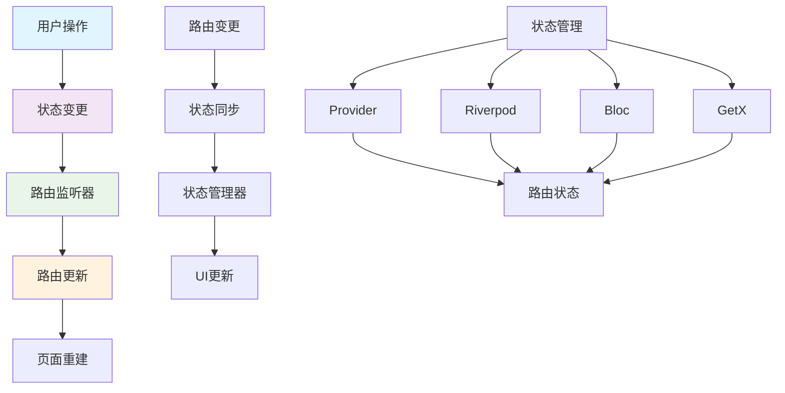
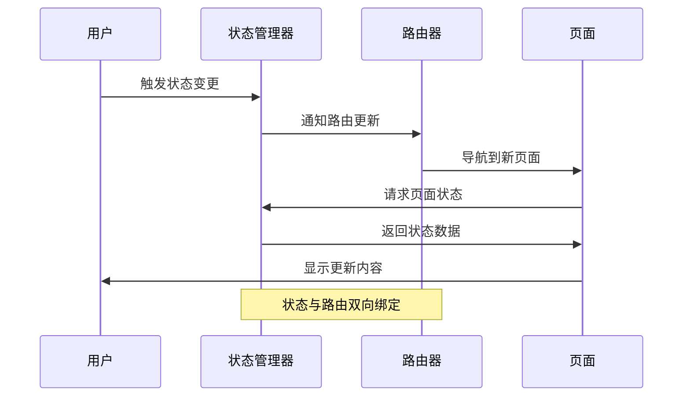

# 状态管理与路由集成

> 将路由系统与状态管理完美结合，实现响应式导航和状态同步

## 🔄 状态路由架构

### 状态路由集成概览



### 状态路由同步流程



## 🎯 Provider + Go Router 集成

### 路由状态Provider

```dart
// lib/providers/router_state_provider.dart
class RouterStateProvider extends ChangeNotifier {
  String _currentLocation = '/';
  final Map<String, dynamic> _routeData = {};
  final List<String> _navigationHistory = [];
  
  String get currentLocation => _currentLocation;
  Map<String, dynamic> get routeData => Map.unmodifiable(_routeData);
  List<String> get navigationHistory => List.unmodifiable(_navigationHistory);
  
  // 更新当前路由
  void updateLocation(String location) {
    if (_currentLocation != location) {
      _navigationHistory.add(_currentLocation);
      _currentLocation = location;
      notifyListeners();
    }
  }
  
  // 设置路由数据
  void setRouteData(String key, dynamic value) {
    _routeData[key] = value;
    notifyListeners();
  }
  
  // 获取路由数据
  T? getRouteData<T>(String key) {
    return _routeData[key] as T?;
  }
  
  // 清除路由数据
  void clearRouteData([String? key]) {
    if (key != null) {
      _routeData.remove(key);
    } else {
      _routeData.clear();
    }
    notifyListeners();
  }
  
  // 返回上一页
  bool canGoBack() => _navigationHistory.isNotEmpty;
  
  String? getLastLocation() {
    return _navigationHistory.isNotEmpty ? _navigationHistory.last : null;
  }
  
  void goBack() {
    if (_navigationHistory.isNotEmpty) {
      final lastLocation = _navigationHistory.removeLast();
      _currentLocation = lastLocation;
      notifyListeners();
    }
  }
}
```

### 认证状态Provider

```dart
// lib/providers/auth_provider.dart
class AuthProvider extends ChangeNotifier {
  User? _user;
  bool _isLoading = false;
  String? _redirectPath;
  
  User? get user => _user;
  bool get isAuthenticated => _user != null;
  bool get isLoading => _isLoading;
  String? get redirectPath => _redirectPath;
  
  // 登录
  Future<bool> login(String email, String password) async {
    _isLoading = true;
    notifyListeners();
    
    try {
      final user = await AuthService.login(email, password);
      _user = user;
      _isLoading = false;
      notifyListeners();
      return true;
    } catch (e) {
      _isLoading = false;
      notifyListeners();
      return false;
    }
  }
  
  // 登出
  Future<void> logout() async {
    _user = null;
    _redirectPath = null;
    notifyListeners();
    await AuthService.logout();
  }
  
  // 设置重定向路径
  void setRedirectPath(String path) {
    _redirectPath = path;
    notifyListeners();
  }
  
  // 清除重定向路径
  void clearRedirectPath() {
    _redirectPath = null;
    notifyListeners();
  }
  
  // 检查权限
  bool hasPermission(String permission) {
    return _user?.permissions.contains(permission) ?? false;
  }
}
```

### 集成路由配置

```dart
// lib/core/routing/provider_router.dart
class ProviderRouter {
  static GoRouter createRouter({
    required AuthProvider authProvider,
    required RouterStateProvider routerStateProvider,
  }) {
    return GoRouter(
      refreshListenable: Listenable.merge([
        authProvider,
        routerStateProvider,
      ]),
      redirect: (context, state) {
        final isAuthenticated = authProvider.isAuthenticated;
        final isLoginRoute = state.location == '/login';
        final isPublicRoute = _publicRoutes.contains(state.location);
        
        // 更新路由状态
        routerStateProvider.updateLocation(state.location);
        
        // 认证重定向逻辑
        if (!isAuthenticated && !isLoginRoute && !isPublicRoute) {
          authProvider.setRedirectPath(state.location);
          return '/login';
        }
        
        if (isAuthenticated && isLoginRoute) {
          final redirectPath = authProvider.redirectPath;
          authProvider.clearRedirectPath();
          return redirectPath ?? '/';
        }
        
        return null;
      },
      routes: [
        GoRoute(
          path: '/',
          builder: (context, state) => const HomePage(),
        ),
        GoRoute(
          path: '/login',
          builder: (context, state) => const LoginPage(),
        ),
        GoRoute(
          path: '/profile',
          builder: (context, state) {
            // 检查权限
            if (!authProvider.hasPermission('view_profile')) {
              return const UnauthorizedPage();
            }
            return const ProfilePage();
          },
        ),
        // 更多路由...
      ],
    );
  }
  
  static const List<String> _publicRoutes = [
    '/login',
    '/register',
    '/forgot-password',
  ];
}
```

## 🎯 Riverpod + Go Router 集成

### Riverpod 路由Provider

```dart
// lib/providers/riverpod_router_providers.dart

// 路由状态Provider
final routerStateProvider = StateNotifierProvider<RouterStateNotifier, RouterState>(
  (ref) => RouterStateNotifier(),
);

class RouterState {
  final String currentLocation;
  final Map<String, dynamic> routeData;
  final List<String> navigationHistory;
  
  const RouterState({
    required this.currentLocation,
    required this.routeData,
    required this.navigationHistory,
  });
  
  RouterState copyWith({
    String? currentLocation,
    Map<String, dynamic>? routeData,
    List<String>? navigationHistory,
  }) {
    return RouterState(
      currentLocation: currentLocation ?? this.currentLocation,
      routeData: routeData ?? this.routeData,
      navigationHistory: navigationHistory ?? this.navigationHistory,
    );
  }
}

class RouterStateNotifier extends StateNotifier<RouterState> {
  RouterStateNotifier() : super(
    const RouterState(
      currentLocation: '/',
      routeData: {},
      navigationHistory: [],
    ),
  );
  
  void updateLocation(String location) {
    if (state.currentLocation != location) {
      state = state.copyWith(
        currentLocation: location,
        navigationHistory: [...state.navigationHistory, state.currentLocation],
      );
    }
  }
  
  void setRouteData(String key, dynamic value) {
    final newRouteData = Map<String, dynamic>.from(state.routeData);
    newRouteData[key] = value;
    state = state.copyWith(routeData: newRouteData);
  }
  
  void clearRouteData([String? key]) {
    final newRouteData = Map<String, dynamic>.from(state.routeData);
    if (key != null) {
      newRouteData.remove(key);
    } else {
      newRouteData.clear();
    }
    state = state.copyWith(routeData: newRouteData);
  }
}

// 认证Provider
final authProvider = StateNotifierProvider<AuthNotifier, AuthState>(
  (ref) => AuthNotifier(),
);

class AuthState {
  final User? user;
  final bool isLoading;
  final String? redirectPath;
  final String? error;
  
  const AuthState({
    this.user,
    this.isLoading = false,
    this.redirectPath,
    this.error,
  });
  
  bool get isAuthenticated => user != null;
  
  AuthState copyWith({
    User? user,
    bool? isLoading,
    String? redirectPath,
    String? error,
  }) {
    return AuthState(
      user: user ?? this.user,
      isLoading: isLoading ?? this.isLoading,
      redirectPath: redirectPath ?? this.redirectPath,
      error: error ?? this.error,
    );
  }
}

class AuthNotifier extends StateNotifier<AuthState> {
  AuthNotifier() : super(const AuthState());
  
  Future<bool> login(String email, String password) async {
    state = state.copyWith(isLoading: true, error: null);
    
    try {
      final user = await AuthService.login(email, password);
      state = state.copyWith(user: user, isLoading: false);
      return true;
    } catch (e) {
      state = state.copyWith(isLoading: false, error: e.toString());
      return false;
    }
  }
  
  Future<void> logout() async {
    state = const AuthState();
    await AuthService.logout();
  }
  
  void setRedirectPath(String path) {
    state = state.copyWith(redirectPath: path);
  }
  
  void clearRedirectPath() {
    state = state.copyWith(redirectPath: null);
  }
}

// 路由器Provider
final routerProvider = Provider<GoRouter>((ref) {
  final authState = ref.watch(authProvider);
  final routerStateNotifier = ref.read(routerStateProvider.notifier);
  
  return GoRouter(
    refreshListenable: RouterRefreshListenable(ref),
    redirect: (context, state) {
      final isAuthenticated = authState.isAuthenticated;
      final isLoginRoute = state.location == '/login';
      final isPublicRoute = _publicRoutes.contains(state.location);
      
      // 更新路由状态
      routerStateNotifier.updateLocation(state.location);
      
      // 认证重定向逻辑
      if (!isAuthenticated && !isLoginRoute && !isPublicRoute) {
        ref.read(authProvider.notifier).setRedirectPath(state.location);
        return '/login';
      }
      
      if (isAuthenticated && isLoginRoute) {
        final redirectPath = authState.redirectPath;
        ref.read(authProvider.notifier).clearRedirectPath();
        return redirectPath ?? '/';
      }
      
      return null;
    },
    routes: [
      GoRoute(
        path: '/',
        builder: (context, state) => const HomePage(),
      ),
      GoRoute(
        path: '/login',
        builder: (context, state) => const LoginPage(),
      ),
      GoRoute(
        path: '/profile',
        builder: (context, state) => const ProfilePage(),
      ),
    ],
  );
});

class RouterRefreshListenable extends ChangeNotifier {
  final Ref _ref;
  late final List<ProviderSubscription> _subscriptions;
  
  RouterRefreshListenable(this._ref) {
    _subscriptions = [
      _ref.listen(authProvider, (_, __) => notifyListeners()),
      _ref.listen(routerStateProvider, (_, __) => notifyListeners()),
    ];
  }
  
  @override
  void dispose() {
    for (final subscription in _subscriptions) {
      subscription.close();
    }
    super.dispose();
  }
}

const List<String> _publicRoutes = [
  '/login',
  '/register',
  '/forgot-password',
];
```

## 🎯 Bloc + Go Router 集成

### 认证Bloc

```dart
// lib/blocs/auth/auth_bloc.dart
abstract class AuthEvent {}

class AuthLoginRequested extends AuthEvent {
  final String email;
  final String password;
  
  AuthLoginRequested({required this.email, required this.password});
}

class AuthLogoutRequested extends AuthEvent {}

class AuthRedirectPathSet extends AuthEvent {
  final String path;
  
  AuthRedirectPathSet(this.path);
}

class AuthRedirectPathCleared extends AuthEvent {}

abstract class AuthState {
  const AuthState();
}

class AuthInitial extends AuthState {}

class AuthLoading extends AuthState {}

class AuthAuthenticated extends AuthState {
  final User user;
  final String? redirectPath;
  
  const AuthAuthenticated({required this.user, this.redirectPath});
}

class AuthUnauthenticated extends AuthState {
  final String? redirectPath;
  
  const AuthUnauthenticated({this.redirectPath});
}

class AuthError extends AuthState {
  final String message;
  
  const AuthError(this.message);
}

class AuthBloc extends Bloc<AuthEvent, AuthState> {
  final AuthService _authService;
  
  AuthBloc({required AuthService authService})
      : _authService = authService,
        super(AuthInitial()) {
    on<AuthLoginRequested>(_onLoginRequested);
    on<AuthLogoutRequested>(_onLogoutRequested);
    on<AuthRedirectPathSet>(_onRedirectPathSet);
    on<AuthRedirectPathCleared>(_onRedirectPathCleared);
  }
  
  Future<void> _onLoginRequested(
    AuthLoginRequested event,
    Emitter<AuthState> emit,
  ) async {
    emit(AuthLoading());
    
    try {
      final user = await _authService.login(event.email, event.password);
      emit(AuthAuthenticated(user: user));
    } catch (e) {
      emit(AuthError(e.toString()));
    }
  }
  
  Future<void> _onLogoutRequested(
    AuthLogoutRequested event,
    Emitter<AuthState> emit,
  ) async {
    await _authService.logout();
    emit(const AuthUnauthenticated());
  }
  
  void _onRedirectPathSet(
    AuthRedirectPathSet event,
    Emitter<AuthState> emit,
  ) {
    final currentState = state;
    if (currentState is AuthAuthenticated) {
      emit(AuthAuthenticated(
        user: currentState.user,
        redirectPath: event.path,
      ));
    } else if (currentState is AuthUnauthenticated) {
      emit(AuthUnauthenticated(redirectPath: event.path));
    }
  }
  
  void _onRedirectPathCleared(
    AuthRedirectPathCleared event,
    Emitter<AuthState> emit,
  ) {
    final currentState = state;
    if (currentState is AuthAuthenticated) {
      emit(AuthAuthenticated(user: currentState.user));
    } else if (currentState is AuthUnauthenticated) {
      emit(const AuthUnauthenticated());
    }
  }
}
```

### Bloc路由集成

```dart
// lib/core/routing/bloc_router.dart
class BlocRouter {
  static GoRouter createRouter(AuthBloc authBloc) {
    return GoRouter(
      refreshListenable: GoRouterRefreshStream(authBloc.stream),
      redirect: (context, state) {
        final authState = authBloc.state;
        final isAuthenticated = authState is AuthAuthenticated;
        final isLoginRoute = state.location == '/login';
        final isPublicRoute = _publicRoutes.contains(state.location);
        
        // 认证重定向逻辑
        if (!isAuthenticated && !isLoginRoute && !isPublicRoute) {
          authBloc.add(AuthRedirectPathSet(state.location));
          return '/login';
        }
        
        if (isAuthenticated && isLoginRoute) {
          String? redirectPath;
          if (authState is AuthAuthenticated) {
            redirectPath = authState.redirectPath;
          }
          authBloc.add(AuthRedirectPathCleared());
          return redirectPath ?? '/';
        }
        
        return null;
      },
      routes: [
        GoRoute(
          path: '/',
          builder: (context, state) => const HomePage(),
        ),
        GoRoute(
          path: '/login',
          builder: (context, state) => BlocProvider.value(
            value: authBloc,
            child: const LoginPage(),
          ),
        ),
        GoRoute(
          path: '/profile',
          builder: (context, state) => BlocProvider.value(
            value: authBloc,
            child: const ProfilePage(),
          ),
        ),
      ],
    );
  }
  
  static const List<String> _publicRoutes = [
    '/login',
    '/register',
    '/forgot-password',
  ];
}

class GoRouterRefreshStream extends ChangeNotifier {
  late final StreamSubscription _subscription;
  
  GoRouterRefreshStream(Stream stream) {
    _subscription = stream.listen((_) => notifyListeners());
  }
  
  @override
  void dispose() {
    _subscription.cancel();
    super.dispose();
  }
}
```

## 🎯 GetX + Go Router 集成

### GetX控制器

```dart
// lib/controllers/auth_controller.dart
class AuthController extends GetxController {
  final AuthService _authService = Get.find<AuthService>();
  
  final Rx<User?> _user = Rx<User?>(null);
  final RxBool _isLoading = false.obs;
  final RxString _redirectPath = ''.obs;
  
  User? get user => _user.value;
  bool get isAuthenticated => _user.value != null;
  bool get isLoading => _isLoading.value;
  String get redirectPath => _redirectPath.value;
  
  @override
  void onInit() {
    super.onInit();
    _checkAuthStatus();
  }
  
  Future<void> _checkAuthStatus() async {
    final user = await _authService.getCurrentUser();
    _user.value = user;
  }
  
  Future<bool> login(String email, String password) async {
    _isLoading.value = true;
    
    try {
      final user = await _authService.login(email, password);
      _user.value = user;
      _isLoading.value = false;
      return true;
    } catch (e) {
      _isLoading.value = false;
      Get.snackbar('错误', e.toString());
      return false;
    }
  }
  
  Future<void> logout() async {
    _user.value = null;
    _redirectPath.value = '';
    await _authService.logout();
  }
  
  void setRedirectPath(String path) {
    _redirectPath.value = path;
  }
  
  void clearRedirectPath() {
    _redirectPath.value = '';
  }
  
  bool hasPermission(String permission) {
    return _user.value?.permissions.contains(permission) ?? false;
  }
}

// lib/controllers/router_controller.dart
class RouterController extends GetxController {
  final RxString _currentLocation = '/'.obs;
  final RxMap<String, dynamic> _routeData = <String, dynamic>{}.obs;
  final RxList<String> _navigationHistory = <String>[].obs;
  
  String get currentLocation => _currentLocation.value;
  Map<String, dynamic> get routeData => _routeData;
  List<String> get navigationHistory => _navigationHistory;
  
  void updateLocation(String location) {
    if (_currentLocation.value != location) {
      _navigationHistory.add(_currentLocation.value);
      _currentLocation.value = location;
    }
  }
  
  void setRouteData(String key, dynamic value) {
    _routeData[key] = value;
  }
  
  T? getRouteData<T>(String key) {
    return _routeData[key] as T?;
  }
  
  void clearRouteData([String? key]) {
    if (key != null) {
      _routeData.remove(key);
    } else {
      _routeData.clear();
    }
  }
  
  bool canGoBack() => _navigationHistory.isNotEmpty;
  
  String? getLastLocation() {
    return _navigationHistory.isNotEmpty ? _navigationHistory.last : null;
  }
  
  void goBack() {
    if (_navigationHistory.isNotEmpty) {
      final lastLocation = _navigationHistory.removeLast();
      _currentLocation.value = lastLocation;
    }
  }
}
```

### GetX路由集成

```dart
// lib/core/routing/getx_router.dart
class GetXRouter {
  static GoRouter createRouter() {
    final authController = Get.find<AuthController>();
    final routerController = Get.find<RouterController>();
    
    return GoRouter(
      refreshListenable: GetXRouterRefreshListenable(),
      redirect: (context, state) {
        final isAuthenticated = authController.isAuthenticated;
        final isLoginRoute = state.location == '/login';
        final isPublicRoute = _publicRoutes.contains(state.location);
        
        // 更新路由状态
        routerController.updateLocation(state.location);
        
        // 认证重定向逻辑
        if (!isAuthenticated && !isLoginRoute && !isPublicRoute) {
          authController.setRedirectPath(state.location);
          return '/login';
        }
        
        if (isAuthenticated && isLoginRoute) {
          final redirectPath = authController.redirectPath;
          authController.clearRedirectPath();
          return redirectPath.isNotEmpty ? redirectPath : '/';
        }
        
        return null;
      },
      routes: [
        GoRoute(
          path: '/',
          builder: (context, state) => const HomePage(),
        ),
        GoRoute(
          path: '/login',
          builder: (context, state) => const LoginPage(),
        ),
        GoRoute(
          path: '/profile',
          builder: (context, state) {
            // 检查权限
            if (!authController.hasPermission('view_profile')) {
              return const UnauthorizedPage();
            }
            return const ProfilePage();
          },
        ),
      ],
    );
  }
  
  static const List<String> _publicRoutes = [
    '/login',
    '/register',
    '/forgot-password',
  ];
}

class GetXRouterRefreshListenable extends ChangeNotifier {
  late final Worker _authWorker;
  late final Worker _routerWorker;
  
  GetXRouterRefreshListenable() {
    final authController = Get.find<AuthController>();
    final routerController = Get.find<RouterController>();
    
    _authWorker = ever(authController._user, (_) => notifyListeners());
    _routerWorker = ever(routerController._currentLocation, (_) => notifyListeners());
  }
  
  @override
  void dispose() {
    _authWorker.dispose();
    _routerWorker.dispose();
    super.dispose();
  }
}
```

## 🔧 状态持久化

### 路由状态持久化

```dart
// lib/core/routing/route_state_persistence.dart
class RouteStatePersistence {
  static const String _routeStateKey = 'route_state';
  static const String _authStateKey = 'auth_state';
  
  // 保存路由状态
  static Future<void> saveRouteState({
    required String currentLocation,
    required Map<String, dynamic> routeData,
    required List<String> navigationHistory,
  }) async {
    final prefs = await SharedPreferences.getInstance();
    
    final routeState = {
      'currentLocation': currentLocation,
      'routeData': routeData,
      'navigationHistory': navigationHistory,
      'timestamp': DateTime.now().millisecondsSinceEpoch,
    };
    
    await prefs.setString(_routeStateKey, jsonEncode(routeState));
  }
  
  // 恢复路由状态
  static Future<Map<String, dynamic>?> restoreRouteState() async {
    final prefs = await SharedPreferences.getInstance();
    final routeStateJson = prefs.getString(_routeStateKey);
    
    if (routeStateJson != null) {
      final routeState = jsonDecode(routeStateJson) as Map<String, dynamic>;
      final timestamp = routeState['timestamp'] as int;
      
      // 检查状态是否过期（24小时）
      if (DateTime.now().millisecondsSinceEpoch - timestamp < 24 * 60 * 60 * 1000) {
        return routeState;
      }
    }
    
    return null;
  }
  
  // 保存认证状态
  static Future<void> saveAuthState({
    required bool isAuthenticated,
    String? userId,
    String? token,
  }) async {
    final prefs = await SharedPreferences.getInstance();
    
    final authState = {
      'isAuthenticated': isAuthenticated,
      'userId': userId,
      'token': token,
      'timestamp': DateTime.now().millisecondsSinceEpoch,
    };
    
    await prefs.setString(_authStateKey, jsonEncode(authState));
  }
  
  // 恢复认证状态
  static Future<Map<String, dynamic>?> restoreAuthState() async {
    final prefs = await SharedPreferences.getInstance();
    final authStateJson = prefs.getString(_authStateKey);
    
    if (authStateJson != null) {
      final authState = jsonDecode(authStateJson) as Map<String, dynamic>;
      final timestamp = authState['timestamp'] as int;
      
      // 检查token是否过期（7天）
      if (DateTime.now().millisecondsSinceEpoch - timestamp < 7 * 24 * 60 * 60 * 1000) {
        return authState;
      }
    }
    
    return null;
  }
  
  // 清除所有状态
  static Future<void> clearAllState() async {
    final prefs = await SharedPreferences.getInstance();
    await prefs.remove(_routeStateKey);
    await prefs.remove(_authStateKey);
  }
}
```

### 状态恢复服务

```dart
// lib/services/state_restoration_service.dart
class StateRestorationService {
  static Future<void> restoreAppState() async {
    await _restoreAuthState();
    await _restoreRouteState();
  }
  
  static Future<void> _restoreAuthState() async {
    final authState = await RouteStatePersistence.restoreAuthState();
    
    if (authState != null && authState['isAuthenticated'] == true) {
      final token = authState['token'] as String?;
      if (token != null) {
        // 验证token有效性
        try {
          await AuthService.validateToken(token);
          // 恢复用户状态
          final user = await AuthService.getCurrentUser();
          // 更新状态管理器
          // 这里根据使用的状态管理方案来更新
        } catch (e) {
          // Token无效，清除状态
          await RouteStatePersistence.clearAllState();
        }
      }
    }
  }
  
  static Future<void> _restoreRouteState() async {
    final routeState = await RouteStatePersistence.restoreRouteState();
    
    if (routeState != null) {
      final currentLocation = routeState['currentLocation'] as String;
      final routeData = routeState['routeData'] as Map<String, dynamic>;
      final navigationHistory = List<String>.from(routeState['navigationHistory']);
      
      // 恢复路由状态
      // 这里根据使用的状态管理方案来恢复状态
    }
  }
}
```

## 🧪 状态路由测试

### 状态路由测试工具

```dart
// test/routing/state_routing_test_helper.dart
class StateRoutingTestHelper {
  static Future<void> testAuthenticationFlow(
    WidgetTester tester,
    AuthProvider authProvider,
  ) async {
    // 构建应用
    await tester.pumpWidget(
      ChangeNotifierProvider.value(
        value: authProvider,
        child: MaterialApp.router(
          routerConfig: ProviderRouter.createRouter(
            authProvider: authProvider,
            routerStateProvider: RouterStateProvider(),
          ),
        ),
      ),
    );
    
    // 验证初始状态（未认证）
    expect(find.byType(LoginPage), findsOneWidget);
    
    // 模拟登录
    await authProvider.login('test@example.com', 'password');
    await tester.pumpAndSettle();
    
    // 验证登录后状态
    expect(find.byType(HomePage), findsOneWidget);
    
    // 模拟登出
    await authProvider.logout();
    await tester.pumpAndSettle();
    
    // 验证登出后状态
    expect(find.byType(LoginPage), findsOneWidget);
  }
  
  static Future<void> testRouteDataPersistence(
    WidgetTester tester,
    RouterStateProvider routerStateProvider,
  ) async {
    // 设置路由数据
    routerStateProvider.setRouteData('testKey', 'testValue');
    
    // 验证数据存在
    expect(routerStateProvider.getRouteData('testKey'), equals('testValue'));
    
    // 清除数据
    routerStateProvider.clearRouteData('testKey');
    
    // 验证数据已清除
    expect(routerStateProvider.getRouteData('testKey'), isNull);
  }
}
```

### 状态路由单元测试

```dart
// test/routing/state_routing_test.dart
void main() {
  group('State Routing Integration', () {
    late AuthProvider authProvider;
    late RouterStateProvider routerStateProvider;
    
    setUp(() {
      authProvider = AuthProvider();
      routerStateProvider = RouterStateProvider();
    });
    
    testWidgets('authentication flow works correctly', (tester) async {
      await StateRoutingTestHelper.testAuthenticationFlow(
        tester,
        authProvider,
      );
    });
    
    testWidgets('route data persistence works', (tester) async {
      await StateRoutingTestHelper.testRouteDataPersistence(
        tester,
        routerStateProvider,
      );
    });
    
    test('redirect logic works correctly', () {
      // 测试重定向逻辑
      authProvider.setRedirectPath('/profile');
      expect(authProvider.redirectPath, equals('/profile'));
      
      authProvider.clearRedirectPath();
      expect(authProvider.redirectPath, isNull);
    });
  });
}
```

## 📚 最佳实践

### 状态路由设计原则

1. **单一数据源**
   - 状态管理器作为唯一数据源
   - 路由状态与业务状态分离
   - 避免状态重复和不一致

2. **响应式更新**
   - 状态变更自动触发路由更新
   - 路由变更同步更新状态
   - 使用监听器实现双向绑定

3. **性能优化**
   - 避免不必要的重建
   - 合理使用状态选择器
   - 及时清理无用状态

### 状态路由配置建议

```dart
// lib/core/routing/state_routing_config.dart
class StateRoutingConfig {
  // 需要认证的路由
  static const List<String> protectedRoutes = [
    '/profile',
    '/settings',
    '/orders',
    '/admin',
  ];
  
  // 公开路由
  static const List<String> publicRoutes = [
    '/login',
    '/register',
    '/forgot-password',
    '/about',
  ];
  
  // 需要特定权限的路由
  static const Map<String, List<String>> permissionRoutes = {
    '/admin': ['admin'],
    '/settings': ['user', 'admin'],
    '/orders': ['user', 'admin'],
  };
  
  // 状态持久化配置
  static const Duration statePersistenceDuration = Duration(days: 7);
  static const Duration routeStatePersistenceDuration = Duration(hours: 24);
  
  // 验证路由权限
  static bool hasRoutePermission(String route, List<String> userPermissions) {
    final requiredPermissions = permissionRoutes[route];
    if (requiredPermissions == null) return true;
    
    return requiredPermissions.any((permission) => userPermissions.contains(permission));
  }
}
```

## 🔗 相关资源

- [Provider Documentation](https://pub.dev/packages/provider)
- [Riverpod Documentation](https://pub.dev/packages/riverpod)
- [Bloc Documentation](https://pub.dev/packages/bloc)
- [GetX Documentation](https://pub.dev/packages/get)
- [Go Router State Management](https://pub.dev/packages/go_router)