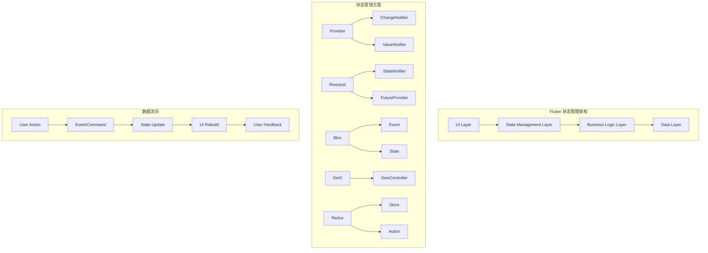
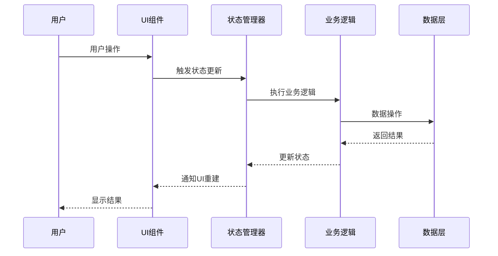
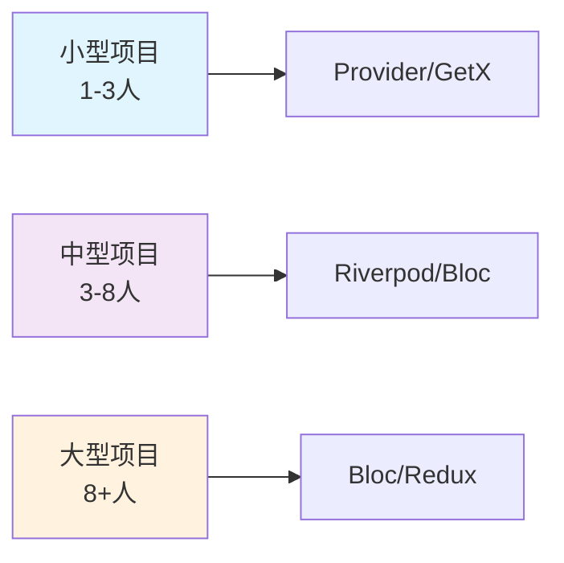
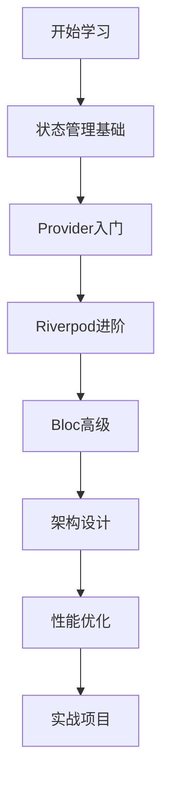

# 🔄 Flutter 状态管理深度指南

> 全面的 Flutter 状态管理解决方案指南，涵盖主流状态管理框架的使用、最佳实践和性能优化


## 📋 目录导航

<details>
<summary>🎯 快速导航</summary>

### 🏗️ 基础篇
- [🔄 状态管理基础](state-basics.md) - Flutter 状态管理核心概念
- [📱 局部状态管理](local-state.md) - StatefulWidget、ValueNotifier 等
- [🎯 Provider 状态管理](provider.md) - Provider 生态系统详解

### 🚀 进阶篇
- [⚡ Riverpod 状态管理](riverpod.md) - 下一代 Provider 解决方案
- [🏢 Bloc 状态管理](bloc.md) - 业务逻辑组件模式
- [⚡ GetX 状态管理](getx.md) - 轻量级响应式状态管理

### 🎯 高级篇
- [🔄 Redux 状态管理](redux.md) - 可预测的状态容器
- [📊 MobX 状态管理](mobx.md) - 响应式状态管理
- [💾 状态持久化](state-persistence.md) - 状态的存储与恢复

### 🏆 实战篇
- [🏗️ 状态管理架构](architecture.md) - 企业级状态管理架构
- [⚡ 性能优化](performance.md) - 状态管理性能优化策略
- [🧪 状态测试](testing.md) - 状态管理的测试方法

</details>

## 🏗️ 状态管理架构总览

### 整体架构图



### 数据流架构



## 🎯 核心学习目标

### 📚 理论知识
- ✅ 深入理解Flutter状态管理核心概念
- ✅ 掌握不同状态管理方案的适用场景
- ✅ 了解状态管理架构设计原则
- ✅ 学会状态持久化和同步策略

### 🛠️ 实践技能
- ✅ 熟练使用Provider、Riverpod、Bloc等框架
- ✅ 掌握状态管理性能优化技巧
- ✅ 学会编写可测试的状态管理代码
- ✅ 能够设计企业级状态管理架构

### 🎨 架构能力
- ✅ 理解MVVM、BLoC、Redux等架构模式
- ✅ 掌握状态管理分层设计
- ✅ 学会状态管理方案选型
- ✅ 能够处理复杂业务场景

## 🚀 快速开始

### 1. 环境准备

```bash
# 创建新项目
flutter create state_management_demo
cd state_management_demo

# 添加依赖
flutter pub add provider riverpod flutter_riverpod flutter_bloc get
```

### 2. Provider 基础示例

```dart
import 'package:flutter/material.dart';
import 'package:provider/provider.dart';

void main() {
  runApp(
    ChangeNotifierProvider(
      create: (_) => CounterModel(),
      child: MyApp(),
    ),
  );
}

// 状态模型
class CounterModel extends ChangeNotifier {
  int _count = 0;
  int get count => _count;
  
  void increment() {
    _count++;
    notifyListeners();
  }
  
  void decrement() {
    _count--;
    notifyListeners();
  }
}

// 主应用
class MyApp extends StatelessWidget {
  @override
  Widget build(BuildContext context) {
    return MaterialApp(
      title: '状态管理示例',
      theme: ThemeData(primarySwatch: Colors.blue),
      home: CounterPage(),
    );
  }
}

// 计数器页面
class CounterPage extends StatelessWidget {
  @override
  Widget build(BuildContext context) {
    return Scaffold(
      appBar: AppBar(title: Text('Provider 示例')),
      body: Center(
        child: Column(
          mainAxisAlignment: MainAxisAlignment.center,
          children: [
            // 显示计数
            Consumer<CounterModel>(
              builder: (context, counter, child) {
                return Text(
                  '计数: ${counter.count}',
                  style: TextStyle(fontSize: 32),
                );
              },
            ),
            SizedBox(height: 20),
            
            // 操作按钮
            Row(
              mainAxisAlignment: MainAxisAlignment.center,
              children: [
                ElevatedButton(
                  onPressed: () {
                    context.read<CounterModel>().decrement();
                  },
                  child: Text('-'),
                ),
                SizedBox(width: 20),
                ElevatedButton(
                  onPressed: () {
                    context.read<CounterModel>().increment();
                  },
                  child: Text('+'),
                ),
              ],
            ),
          ],
        ),
      ),
    );
  }
}
```

### 3. Riverpod 基础示例

```dart
import 'package:flutter/material.dart';
import 'package:flutter_riverpod/flutter_riverpod.dart';

void main() {
  runApp(ProviderScope(child: MyApp()));
}

// 状态提供者
final counterProvider = StateNotifierProvider<CounterNotifier, int>(
  (ref) => CounterNotifier(),
);

// 状态控制器
class CounterNotifier extends StateNotifier<int> {
  CounterNotifier() : super(0);
  
  void increment() => state++;
  void decrement() => state--;
}

// 主应用
class MyApp extends StatelessWidget {
  @override
  Widget build(BuildContext context) {
    return MaterialApp(
      title: 'Riverpod 示例',
      theme: ThemeData(primarySwatch: Colors.blue),
      home: CounterPage(),
    );
  }
}

// 计数器页面
class CounterPage extends ConsumerWidget {
  @override
  Widget build(BuildContext context, WidgetRef ref) {
    final count = ref.watch(counterProvider);
    final counterNotifier = ref.read(counterProvider.notifier);
    
    return Scaffold(
      appBar: AppBar(title: Text('Riverpod 示例')),
      body: Center(
        child: Column(
          mainAxisAlignment: MainAxisAlignment.center,
          children: [
            Text(
              '计数: $count',
              style: TextStyle(fontSize: 32),
            ),
            SizedBox(height: 20),
            Row(
              mainAxisAlignment: MainAxisAlignment.center,
              children: [
                ElevatedButton(
                  onPressed: () => counterNotifier.decrement(),
                  child: Text('-'),
                ),
                SizedBox(width: 20),
                ElevatedButton(
                  onPressed: () => counterNotifier.increment(),
                  child: Text('+'),
                ),
              ],
            ),
          ],
        ),
      ),
    );
  }
}
```

## 📊 状态管理方案对比

### 功能特性对比

| 特性 | Provider | Riverpod | Bloc | GetX | Redux | MobX |
|------|----------|----------|------|------|-------|------|
| 学习成本 | ⭐⭐⭐⭐⭐ | ⭐⭐⭐⭐ | ⭐⭐ | ⭐⭐⭐⭐⭐ | ⭐⭐ | ⭐⭐⭐ |
| 类型安全 | ⭐⭐⭐ | ⭐⭐⭐⭐⭐ | ⭐⭐⭐⭐⭐ | ⭐⭐⭐ | ⭐⭐⭐⭐ | ⭐⭐⭐⭐ |
| 代码生成 | ❌ | ✅ | ✅ | ❌ | ✅ | ✅ |
| 依赖注入 | ⭐⭐⭐ | ⭐⭐⭐⭐⭐ | ⭐⭐⭐ | ⭐⭐⭐⭐⭐ | ⭐⭐ | ⭐⭐⭐ |
| 测试友好 | ⭐⭐⭐ | ⭐⭐⭐⭐⭐ | ⭐⭐⭐⭐⭐ | ⭐⭐⭐ | ⭐⭐⭐⭐ | ⭐⭐⭐⭐ |
| 性能 | ⭐⭐⭐⭐ | ⭐⭐⭐⭐⭐ | ⭐⭐⭐⭐⭐ | ⭐⭐⭐⭐ | ⭐⭐⭐⭐ | ⭐⭐⭐⭐ |

### 项目规模建议



### 选择指南

#### 🎯 选择 Provider 的场景
- 初学者学习状态管理
- 简单的状态管理需求
- 快速原型开发
- 团队对Provider熟悉

#### ⚡ 选择 Riverpod 的场景
- 需要类型安全
- 复杂的依赖注入需求
- 需要代码生成
- 现代化Flutter项目

#### 🏢 选择 Bloc 的场景
- 复杂的业务逻辑
- 需要事件驱动架构
- 大型企业级应用
- 团队有Bloc经验

#### 🚀 选择 GetX 的场景
- 快速开发
- 简单状态管理
- 需要路由管理
- 小型到中型项目

## 🎨 设计模式应用

### 1. 观察者模式 (Observer Pattern)

```dart
// Provider 中的观察者模式
class CounterModel extends ChangeNotifier {
  int _count = 0;
  int get count => _count;
  
  void increment() {
    _count++;
    notifyListeners(); // 通知所有观察者
  }
}

// UI 组件作为观察者
Consumer<CounterModel>(
  builder: (context, counter, child) {
    return Text('${counter.count}'); // 自动重建
  },
)
```

### 2. 命令模式 (Command Pattern)

```dart
// Bloc 中的命令模式
abstract class CounterEvent {}

class IncrementEvent extends CounterEvent {}
class DecrementEvent extends CounterEvent {}

class CounterBloc extends Bloc<CounterEvent, int> {
  CounterBloc() : super(0) {
    on<IncrementEvent>((event, emit) => emit(state + 1));
    on<DecrementEvent>((event, emit) => emit(state - 1));
  }
}
```

### 3. 单例模式 (Singleton Pattern)

```dart
// 全局状态管理
class AppState {
  static AppState? _instance;
  static AppState get instance => _instance ??= AppState._();
  
  AppState._();
  
  String _theme = 'light';
  String get theme => _theme;
  
  void toggleTheme() {
    _theme = _theme == 'light' ? 'dark' : 'light';
    notifyListeners();
  }
}
```

## 🔧 开发工具推荐

### 📱 调试工具
- **Flutter Inspector**: 查看Widget树和状态
- **Provider Inspector**: Provider状态调试
- **Bloc Inspector**: Bloc状态和事件调试
- **Riverpod Inspector**: Riverpod状态调试

### 🎨 设计工具
- **Figma**: 状态流程图设计
- **Draw.io**: 架构图绘制
- **Mermaid**: 代码中的图表

### 📚 学习资源
- **官方文档**: 各框架的官方文档
- **GitHub示例**: 官方示例项目
- **社区博客**: 技术博客和教程

## 📈 学习路径建议



### 🎯 阶段目标

#### 第一阶段：基础掌握
- [ ] 理解Flutter状态管理核心概念
- [ ] 掌握StatefulWidget和ValueNotifier
- [ ] 学会Provider基础用法
- [ ] 完成简单计数器应用

#### 第二阶段：进阶学习
- [ ] 深入学习Provider高级特性
- [ ] 掌握Riverpod或Bloc
- [ ] 学会状态持久化
- [ ] 完成中等复杂度应用

#### 第三阶段：高级应用
- [ ] 掌握多种状态管理方案
- [ ] 学习企业级架构设计
- [ ] 掌握性能优化技巧
- [ ] 完成大型应用状态管理

#### 第四阶段：实战项目
- [ ] 完成完整的商业项目
- [ ] 掌握团队协作开发
- [ ] 学会代码重构和优化
- [ ] 参与开源项目贡献

## 🏆 最佳实践

### 📝 代码规范

```dart
// ✅ 推荐：使用不可变状态
class UserState {
  final String name;
  final int age;
  
  const UserState({required this.name, required this.age});
  
  UserState copyWith({String? name, int? age}) {
    return UserState(
      name: name ?? this.name,
      age: age ?? this.age,
    );
  }
}

// ❌ 避免：可变状态
class UserState {
  String name = '';
  int age = 0;
}
```

### 🎨 架构原则
- **单一职责**: 每个状态类只负责一个功能域
- **开闭原则**: 对扩展开放，对修改关闭
- **依赖倒置**: 依赖抽象而非具体实现
- **接口隔离**: 使用小而精确的接口

### ⚡ 性能优化
- 使用Selector减少不必要的重建
- 合理使用const构造函数
- 避免在build方法中创建对象
- 使用懒加载和缓存策略

## 📚 相关资源

### 🔗 官方资源
- [Provider官方文档](https://pub.dev/packages/provider)
- [Riverpod官方文档](https://riverpod.dev/)
- [Bloc官方文档](https://bloclibrary.dev/)
- [GetX官方文档](https://pub.dev/packages/get)

### 📖 推荐书籍
- 《Flutter状态管理实战》
- 《Flutter架构模式》
- 《响应式编程实战》

### 🎥 视频教程
- [Flutter官方YouTube频道](https://www.youtube.com/c/FlutterDev)
- [B站Flutter教程](https://www.bilibili.com/video/BV1S4411E7LY)

---

## 🎉 开始你的状态管理之旅

现在你已经了解了Flutter状态管理的整体架构和学习路径。接下来，让我们从[状态管理基础](state-basics.md)开始，逐步掌握各种状态管理方案的使用方法。

记住：**选择合适的状态管理方案比使用最流行的方案更重要**，根据项目需求和团队能力做出明智的选择！

---

<div align="center">

**🌟 如果这个指南对你有帮助，请给个Star支持一下！ 🌟**

[](https://github.com/your-repo/flutter-state-management)
[](https://github.com/your-repo/flutter-state-management)

</div>