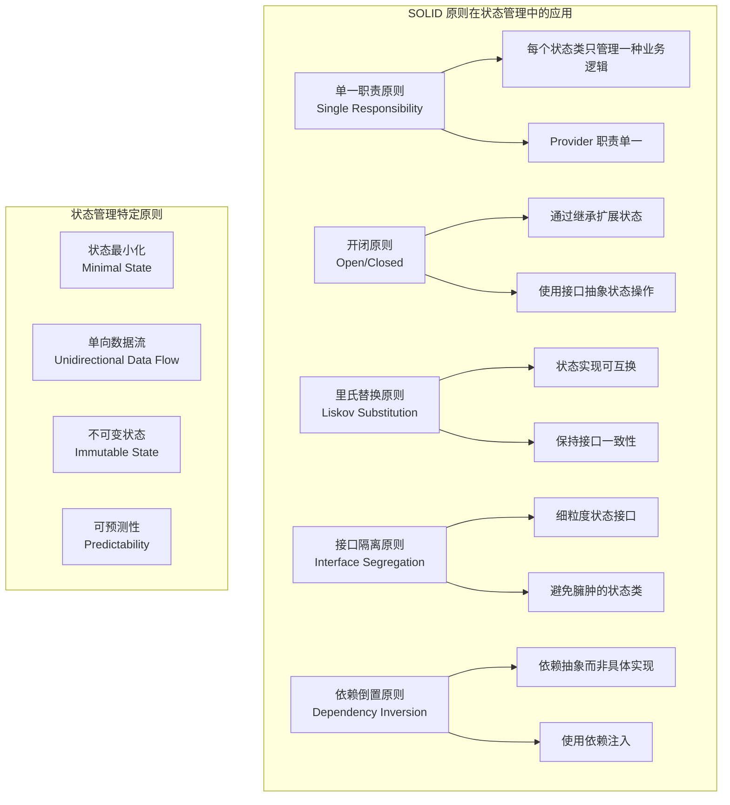

# 状态管理最佳实践

本文档总结了 Flutter 状态管理的最佳实践，包括设计原则、架构模式、代码规范和常见陷阱的避免方法。

## 1. 设计原则



### 1.1 单一职责原则

```dart
// ❌ 违反单一职责原则
class AppState extends ChangeNotifier {
  // 用户管理
  User? user;
  bool isUserLoading = false;
  
  // 待办事项管理
  List<Todo> todos = [];
  bool isTodosLoading = false;
  
  // 设置管理
  AppSettings settings = AppSettings();
  
  // 网络状态管理
  bool isOnline = true;
  
  // 主题管理
  ThemeMode themeMode = ThemeMode.system;
  
  // 太多职责混在一起
  void updateUser(User newUser) { /* ... */ }
  void addTodo(String title) { /* ... */ }
  void updateSettings(AppSettings newSettings) { /* ... */ }
  void updateNetworkStatus(bool online) { /* ... */ }
  void updateTheme(ThemeMode mode) { /* ... */ }
}

// ✅ 遵循单一职责原则
class UserProvider extends ChangeNotifier {
  User? _user;
  bool _isLoading = false;
  String? _error;
  
  User? get user => _user;
  bool get isLoading => _isLoading;
  String? get error => _error;
  bool get isLoggedIn => _user != null;
  
  Future<void> login(String email, String password) async {
    _setLoading(true);
    _clearError();
    
    try {
      _user = await authService.login(email, password);
    } catch (e) {
      _error = e.toString();
    } finally {
      _setLoading(false);
    }
  }
  
  Future<void> logout() async {
    _user = null;
    await authService.logout();
    notifyListeners();
  }
  
  void _setLoading(bool loading) {
    _isLoading = loading;
    notifyListeners();
  }
  
  void _clearError() {
    _error = null;
    notifyListeners();
  }
}

class TodoProvider extends ChangeNotifier {
  List<Todo> _todos = [];
  bool _isLoading = false;
  String? _error;
  
  List<Todo> get todos => List.unmodifiable(_todos);
  bool get isLoading => _isLoading;
  String? get error => _error;
  
  int get completedCount => _todos.where((t) => t.isCompleted).length;
  int get pendingCount => _todos.where((t) => !t.isCompleted).length;
  
  Future<void> loadTodos() async {
    _setLoading(true);
    _clearError();
    
    try {
      _todos = await todoRepository.getTodos();
    } catch (e) {
      _error = e.toString();
    } finally {
      _setLoading(false);
    }
  }
  
  Future<void> addTodo(String title) async {
    try {
      final todo = await todoRepository.createTodo(title);
      _todos.add(todo);
      notifyListeners();
    } catch (e) {
      _error = e.toString();
      notifyListeners();
    }
  }
  
  void _setLoading(bool loading) {
    _isLoading = loading;
    notifyListeners();
  }
  
  void _clearError() {
    _error = null;
    notifyListeners();
  }
}
```

### 1.2 状态最小化

```dart
// ❌ 冗余状态
class BadTodoState {
  final List<Todo> todos;
  final List<Todo> completedTodos; // 可以从 todos 计算得出
  final List<Todo> pendingTodos;   // 可以从 todos 计算得出
  final int totalCount;            // 可以从 todos 计算得出
  final int completedCount;        // 可以从 todos 计算得出
  final int pendingCount;          // 可以从 todos 计算得出
  
  const BadTodoState({
    required this.todos,
    required this.completedTodos,
    required this.pendingTodos,
    required this.totalCount,
    required this.completedCount,
    required this.pendingCount,
  });
}

// ✅ 最小化状态
class GoodTodoState {
  final List<Todo> todos;
  final bool isLoading;
  final String? error;
  final TodoFilter filter;
  
  const GoodTodoState({
    required this.todos,
    this.isLoading = false,
    this.error,
    this.filter = TodoFilter.all,
  });
  
  // 计算属性
  List<Todo> get completedTodos => 
      todos.where((todo) => todo.isCompleted).toList();
  
  List<Todo> get pendingTodos => 
      todos.where((todo) => !todo.isCompleted).toList();
  
  List<Todo> get filteredTodos {
    switch (filter) {
      case TodoFilter.all:
        return todos;
      case TodoFilter.completed:
        return completedTodos;
      case TodoFilter.pending:
        return pendingTodos;
    }
  }
  
  int get totalCount => todos.length;
  int get completedCount => completedTodos.length;
  int get pendingCount => pendingTodos.length;
  
  GoodTodoState copyWith({
    List<Todo>? todos,
    bool? isLoading,
    String? error,
    TodoFilter? filter,
  }) {
    return GoodTodoState(
      todos: todos ?? this.todos,
      isLoading: isLoading ?? this.isLoading,
      error: error ?? this.error,
      filter: filter ?? this.filter,
    );
  }
}
```

### 1.3 不可变状态

```dart
// ❌ 可变状态
class MutableTodo {
  String id;
  String title;
  bool isCompleted;
  DateTime createdAt;
  
  MutableTodo({
    required this.id,
    required this.title,
    required this.isCompleted,
    required this.createdAt,
  });
  
  // 直接修改状态，难以追踪变化
  void toggle() {
    isCompleted = !isCompleted;
  }
  
  void updateTitle(String newTitle) {
    title = newTitle;
  }
}

// ✅ 不可变状态
@immutable
class ImmutableTodo {
  final String id;
  final String title;
  final bool isCompleted;
  final DateTime createdAt;
  final DateTime? completedAt;
  
  const ImmutableTodo({
    required this.id,
    required this.title,
    required this.isCompleted,
    required this.createdAt,
    this.completedAt,
  });
  
  // 返回新实例而不是修改当前实例
  ImmutableTodo toggle() {
    return copyWith(
      isCompleted: !isCompleted,
      completedAt: !isCompleted ? DateTime.now() : null,
    );
  }
  
  ImmutableTodo updateTitle(String newTitle) {
    return copyWith(title: newTitle);
  }
  
  ImmutableTodo copyWith({
    String? id,
    String? title,
    bool? isCompleted,
    DateTime? createdAt,
    DateTime? completedAt,
  }) {
    return ImmutableTodo(
      id: id ?? this.id,
      title: title ?? this.title,
      isCompleted: isCompleted ?? this.isCompleted,
      createdAt: createdAt ?? this.createdAt,
      completedAt: completedAt ?? this.completedAt,
    );
  }
  
  @override
  bool operator ==(Object other) {
    if (identical(this, other)) return true;
    
    return other is ImmutableTodo &&
        other.id == id &&
        other.title == title &&
        other.isCompleted == isCompleted &&
        other.createdAt == createdAt &&
        other.completedAt == completedAt;
  }
  
  @override
  int get hashCode {
    return id.hashCode ^
        title.hashCode ^
        isCompleted.hashCode ^
        createdAt.hashCode ^
        completedAt.hashCode;
  }
}
```

## 2. 架构模式

### 2.1 分层架构

```dart
// 数据层 (Data Layer)
abstract class TodoRepository {
  Future<List<Todo>> getTodos();
  Future<Todo> createTodo(String title);
  Future<Todo> updateTodo(Todo todo);
  Future<void> deleteTodo(String id);
}

class TodoRepositoryImpl implements TodoRepository {
  final TodoApiService _apiService;
  final TodoLocalStorage _localStorage;
  
  TodoRepositoryImpl(this._apiService, this._localStorage);
  
  @override
  Future<List<Todo>> getTodos() async {
    try {
      // 先尝试从网络获取
      final todos = await _apiService.getTodos();
      // 缓存到本地
      await _localStorage.saveTodos(todos);
      return todos;
    } catch (e) {
      // 网络失败时从本地获取
      return await _localStorage.getTodos();
    }
  }
  
  @override
  Future<Todo> createTodo(String title) async {
    final todo = Todo(
      id: DateTime.now().millisecondsSinceEpoch.toString(),
      title: title,
      isCompleted: false,
      createdAt: DateTime.now(),
    );
    
    try {
      final createdTodo = await _apiService.createTodo(todo);
      await _localStorage.saveTodo(createdTodo);
      return createdTodo;
    } catch (e) {
      // 离线时先保存到本地
      await _localStorage.saveTodo(todo);
      return todo;
    }
  }
  
  // 其他方法实现...
}

// 业务逻辑层 (Business Logic Layer)
class TodoUseCase {
  final TodoRepository _repository;
  
  TodoUseCase(this._repository);
  
  Future<List<Todo>> getTodos() async {
    return await _repository.getTodos();
  }
  
  Future<Todo> createTodo(String title) async {
    if (title.trim().isEmpty) {
      throw ArgumentError('标题不能为空');
    }
    
    if (title.length > 100) {
      throw ArgumentError('标题不能超过100个字符');
    }
    
    return await _repository.createTodo(title.trim());
  }
  
  Future<Todo> toggleTodo(Todo todo) async {
    final updatedTodo = todo.toggle();
    return await _repository.updateTodo(updatedTodo);
  }
  
  Future<void> deleteTodo(String id) async {
    await _repository.deleteTodo(id);
  }
  
  List<Todo> filterTodos(List<Todo> todos, TodoFilter filter) {
    switch (filter) {
      case TodoFilter.all:
        return todos;
      case TodoFilter.completed:
        return todos.where((todo) => todo.isCompleted).toList();
      case TodoFilter.pending:
        return todos.where((todo) => !todo.isCompleted).toList();
    }
  }
}

// 表现层 (Presentation Layer)
class TodoBloc extends Bloc<TodoEvent, TodoState> {
  final TodoUseCase _todoUseCase;
  
  TodoBloc(this._todoUseCase) : super(const TodoState.initial()) {
    on<TodosRequested>(_onTodosRequested);
    on<TodoAdded>(_onTodoAdded);
    on<TodoToggled>(_onTodoToggled);
    on<TodoDeleted>(_onTodoDeleted);
    on<TodoFilterChanged>(_onTodoFilterChanged);
  }
  
  Future<void> _onTodosRequested(
    TodosRequested event,
    Emitter<TodoState> emit,
  ) async {
    emit(state.copyWith(isLoading: true));
    
    try {
      final todos = await _todoUseCase.getTodos();
      emit(state.copyWith(
        isLoading: false,
        todos: todos,
        error: null,
      ));
    } catch (error) {
      emit(state.copyWith(
        isLoading: false,
        error: error.toString(),
      ));
    }
  }
  
  Future<void> _onTodoAdded(
    TodoAdded event,
    Emitter<TodoState> emit,
  ) async {
    try {
      final todo = await _todoUseCase.createTodo(event.title);
      final updatedTodos = [...state.todos, todo];
      emit(state.copyWith(
        todos: updatedTodos,
        error: null,
      ));
    } catch (error) {
      emit(state.copyWith(error: error.toString()));
    }
  }
  
  // 其他事件处理...
}
```

### 2.2 依赖注入

```dart
// 使用 get_it 进行依赖注入
class DependencyInjection {
  static final GetIt _getIt = GetIt.instance;
  
  static void setup() {
    // 注册数据源
    _getIt.registerLazySingleton<TodoApiService>(
      () => TodoApiServiceImpl(),
    );
    
    _getIt.registerLazySingleton<TodoLocalStorage>(
      () => TodoLocalStorageImpl(),
    );
    
    // 注册仓库
    _getIt.registerLazySingleton<TodoRepository>(
      () => TodoRepositoryImpl(
        _getIt<TodoApiService>(),
        _getIt<TodoLocalStorage>(),
      ),
    );
    
    // 注册用例
    _getIt.registerLazySingleton<TodoUseCase>(
      () => TodoUseCase(_getIt<TodoRepository>()),
    );
    
    // 注册 Bloc
    _getIt.registerFactory<TodoBloc>(
      () => TodoBloc(_getIt<TodoUseCase>()),
    );
  }
  
  static T get<T extends Object>() => _getIt<T>();
  
  static void reset() {
    _getIt.reset();
  }
}

// 在 main.dart 中初始化
void main() {
  DependencyInjection.setup();
  runApp(MyApp());
}

// 在 Widget 中使用
class TodoPage extends StatelessWidget {
  @override
  Widget build(BuildContext context) {
    return BlocProvider(
      create: (context) => DependencyInjection.get<TodoBloc>()
        ..add(const TodosRequested()),
      child: const TodoView(),
    );
  }
}
```

## 3. 代码规范

### 3.1 命名规范

```dart
// ✅ 好的命名
class UserAuthenticationProvider extends ChangeNotifier {
  User? _currentUser;
  bool _isAuthenticating = false;
  AuthenticationError? _lastError;
  
  // 清晰的 getter 名称
  User? get currentUser => _currentUser;
  bool get isAuthenticating => _isAuthenticating;
  bool get isAuthenticated => _currentUser != null;
  AuthenticationError? get lastError => _lastError;
  
  // 清晰的方法名称
  Future<void> authenticateWithEmailAndPassword(
    String email,
    String password,
  ) async {
    // 实现...
  }
  
  Future<void> authenticateWithGoogle() async {
    // 实现...
  }
  
  Future<void> signOut() async {
    // 实现...
  }
  
  void clearAuthenticationError() {
    _lastError = null;
    notifyListeners();
  }
}

// ❌ 不好的命名
class UserProvider extends ChangeNotifier {
  User? u;
  bool loading = false;
  String? err;
  
  User? get user => u;
  bool get isLoading => loading;
  String? get error => err;
  
  Future<void> login(String e, String p) async {
    // 实现...
  }
  
  void clear() {
    err = null;
    notifyListeners();
  }
}
```

### 3.2 文件组织

```
lib/
├── core/
│   ├── constants/
│   │   ├── app_constants.dart
│   │   └── api_constants.dart
│   ├── errors/
│   │   ├── exceptions.dart
│   │   └── failures.dart
│   ├── utils/
│   │   ├── validators.dart
│   │   └── formatters.dart
│   └── dependency_injection.dart
├── data/
│   ├── datasources/
│   │   ├── local/
│   │   │   └── todo_local_datasource.dart
│   │   └── remote/
│   │       └── todo_remote_datasource.dart
│   ├── models/
│   │   └── todo_model.dart
│   └── repositories/
│       └── todo_repository_impl.dart
├── domain/
│   ├── entities/
│   │   └── todo.dart
│   ├── repositories/
│   │   └── todo_repository.dart
│   └── usecases/
│       ├── create_todo.dart
│       ├── get_todos.dart
│       ├── update_todo.dart
│       └── delete_todo.dart
├── presentation/
│   ├── bloc/
│   │   ├── todo_bloc.dart
│   │   ├── todo_event.dart
│   │   └── todo_state.dart
│   ├── pages/
│   │   ├── todo_list_page.dart
│   │   └── todo_detail_page.dart
│   └── widgets/
│       ├── todo_item.dart
│       ├── todo_form.dart
│       └── todo_filter.dart
└── main.dart
```

### 3.3 状态类设计

```dart
// ✅ 好的状态设计
@immutable
abstract class TodoState extends Equatable {
  const TodoState();
  
  @override
  List<Object?> get props => [];
}

class TodoInitial extends TodoState {
  const TodoInitial();
}

class TodoLoading extends TodoState {
  const TodoLoading();
}

class TodoLoaded extends TodoState {
  final List<Todo> todos;
  final TodoFilter filter;
  final String? searchQuery;
  
  const TodoLoaded({
    required this.todos,
    this.filter = TodoFilter.all,
    this.searchQuery,
  });
  
  List<Todo> get filteredTodos {
    var result = todos;
    
    // 应用筛选
    switch (filter) {
      case TodoFilter.completed:
        result = result.where((todo) => todo.isCompleted).toList();
        break;
      case TodoFilter.pending:
        result = result.where((todo) => !todo.isCompleted).toList();
        break;
      case TodoFilter.all:
        break;
    }
    
    // 应用搜索
    if (searchQuery != null && searchQuery!.isNotEmpty) {
      result = result
          .where((todo) => todo.title.toLowerCase()
              .contains(searchQuery!.toLowerCase()))
          .toList();
    }
    
    return result;
  }
  
  TodoLoaded copyWith({
    List<Todo>? todos,
    TodoFilter? filter,
    String? searchQuery,
  }) {
    return TodoLoaded(
      todos: todos ?? this.todos,
      filter: filter ?? this.filter,
      searchQuery: searchQuery ?? this.searchQuery,
    );
  }
  
  @override
  List<Object?> get props => [todos, filter, searchQuery];
}

class TodoError extends TodoState {
  final String message;
  final List<Todo>? previousTodos; // 保留之前的数据
  
  const TodoError({
    required this.message,
    this.previousTodos,
  });
  
  @override
  List<Object?> get props => [message, previousTodos];
}
```

## 4. 错误处理

### 4.1 统一错误处理

```dart
// 定义错误类型
abstract class AppError {
  final String message;
  final String? code;
  
  const AppError(this.message, {this.code});
}

class NetworkError extends AppError {
  const NetworkError(String message) : super(message, code: 'NETWORK_ERROR');
}

class ValidationError extends AppError {
  const ValidationError(String message) : super(message, code: 'VALIDATION_ERROR');
}

class AuthenticationError extends AppError {
  const AuthenticationError(String message) : super(message, code: 'AUTH_ERROR');
}

class ServerError extends AppError {
  final int statusCode;
  
  const ServerError(String message, this.statusCode) 
      : super(message, code: 'SERVER_ERROR');
}

// 错误处理器
class ErrorHandler {
  static AppError handleError(dynamic error) {
    if (error is AppError) {
      return error;
    }
    
    if (error is SocketException) {
      return const NetworkError('网络连接失败，请检查网络设置');
    }
    
    if (error is TimeoutException) {
      return const NetworkError('请求超时，请稍后重试');
    }
    
    if (error is FormatException) {
      return const ServerError('数据格式错误', 500);
    }
    
    return AppError('未知错误: ${error.toString()}');
  }
  
  static void showError(BuildContext context, AppError error) {
    String title;
    IconData icon;
    Color color;
    
    switch (error.runtimeType) {
      case NetworkError:
        title = '网络错误';
        icon = Icons.wifi_off;
        color = Colors.orange;
        break;
      case ValidationError:
        title = '输入错误';
        icon = Icons.error_outline;
        color = Colors.red;
        break;
      case AuthenticationError:
        title = '认证错误';
        icon = Icons.lock_outline;
        color = Colors.red;
        break;
      default:
        title = '错误';
        icon = Icons.error;
        color = Colors.red;
    }
    
    ScaffoldMessenger.of(context).showSnackBar(
      SnackBar(
        content: Row(
          children: [
            Icon(icon, color: Colors.white),
            const SizedBox(width: 8),
            Expanded(
              child: Column(
                crossAxisAlignment: CrossAxisAlignment.start,
                mainAxisSize: MainAxisSize.min,
                children: [
                  Text(
                    title,
                    style: const TextStyle(
                      fontWeight: FontWeight.bold,
                      color: Colors.white,
                    ),
                  ),
                  Text(
                    error.message,
                    style: const TextStyle(color: Colors.white),
                  ),
                ],
              ),
            ),
          ],
        ),
        backgroundColor: color,
        duration: const Duration(seconds: 4),
        action: SnackBarAction(
          label: '关闭',
          textColor: Colors.white,
          onPressed: () {
            ScaffoldMessenger.of(context).hideCurrentSnackBar();
          },
        ),
      ),
    );
  }
}

// 在 Bloc 中使用
class TodoBloc extends Bloc<TodoEvent, TodoState> {
  final TodoUseCase _todoUseCase;
  
  TodoBloc(this._todoUseCase) : super(const TodoInitial()) {
    on<TodosRequested>(_onTodosRequested);
  }
  
  Future<void> _onTodosRequested(
    TodosRequested event,
    Emitter<TodoState> emit,
  ) async {
    emit(const TodoLoading());
    
    try {
      final todos = await _todoUseCase.getTodos();
      emit(TodoLoaded(todos: todos));
    } catch (error) {
      final appError = ErrorHandler.handleError(error);
      emit(TodoError(message: appError.message));
    }
  }
}
```

### 4.2 重试机制

```dart
class RetryableOperation<T> {
  final Future<T> Function() operation;
  final int maxRetries;
  final Duration delay;
  final bool Function(dynamic error)? shouldRetry;
  
  const RetryableOperation({
    required this.operation,
    this.maxRetries = 3,
    this.delay = const Duration(seconds: 1),
    this.shouldRetry,
  });
  
  Future<T> execute() async {
    int attempts = 0;
    
    while (attempts < maxRetries) {
      try {
        return await operation();
      } catch (error) {
        attempts++;
        
        if (attempts >= maxRetries) {
          rethrow;
        }
        
        if (shouldRetry != null && !shouldRetry!(error)) {
          rethrow;
        }
        
        await Future.delayed(delay * attempts);
      }
    }
    
    throw StateError('Should not reach here');
  }
}

// 使用示例
class TodoRepository {
  final TodoApiService _apiService;
  
  TodoRepository(this._apiService);
  
  Future<List<Todo>> getTodos() async {
    final operation = RetryableOperation<List<Todo>>(
      operation: () => _apiService.getTodos(),
      maxRetries: 3,
      delay: const Duration(seconds: 2),
      shouldRetry: (error) => error is SocketException || error is TimeoutException,
    );
    
    return await operation.execute();
  }
}
```

## 5. 测试策略

### 5.1 单元测试

```dart
// 测试状态类
void main() {
  group('TodoState', () {
    test('TodoLoaded equality', () {
      const todo1 = Todo(id: '1', title: 'Test', isCompleted: false);
      const todo2 = Todo(id: '2', title: 'Test 2', isCompleted: true);
      
      const state1 = TodoLoaded(todos: [todo1, todo2]);
      const state2 = TodoLoaded(todos: [todo1, todo2]);
      const state3 = TodoLoaded(todos: [todo1]);
      
      expect(state1, equals(state2));
      expect(state1, isNot(equals(state3)));
    });
    
    test('TodoLoaded filteredTodos', () {
      const todo1 = Todo(id: '1', title: 'Test', isCompleted: false);
      const todo2 = Todo(id: '2', title: 'Test 2', isCompleted: true);
      
      const state = TodoLoaded(
        todos: [todo1, todo2],
        filter: TodoFilter.completed,
      );
      
      expect(state.filteredTodos, equals([todo2]));
    });
  });
}

// 测试 Bloc
void main() {
  group('TodoBloc', () {
    late TodoUseCase mockTodoUseCase;
    late TodoBloc todoBloc;
    
    setUp(() {
      mockTodoUseCase = MockTodoUseCase();
      todoBloc = TodoBloc(mockTodoUseCase);
    });
    
    tearDown(() {
      todoBloc.close();
    });
    
    test('initial state is TodoInitial', () {
      expect(todoBloc.state, equals(const TodoInitial()));
    });
    
    blocTest<TodoBloc, TodoState>(
      'emits [TodoLoading, TodoLoaded] when TodosRequested is added',
      build: () {
        when(() => mockTodoUseCase.getTodos())
            .thenAnswer((_) async => [testTodo]);
        return todoBloc;
      },
      act: (bloc) => bloc.add(const TodosRequested()),
      expect: () => [
        const TodoLoading(),
        TodoLoaded(todos: [testTodo]),
      ],
    );
    
    blocTest<TodoBloc, TodoState>(
      'emits [TodoLoading, TodoError] when getTodos throws',
      build: () {
        when(() => mockTodoUseCase.getTodos())
            .thenThrow(const NetworkError('Network error'));
        return todoBloc;
      },
      act: (bloc) => bloc.add(const TodosRequested()),
      expect: () => [
        const TodoLoading(),
        const TodoError(message: 'Network error'),
      ],
    );
  });
}
```

### 5.2 Widget 测试

```dart
void main() {
  group('TodoPage', () {
    late MockTodoBloc mockTodoBloc;
    
    setUp(() {
      mockTodoBloc = MockTodoBloc();
    });
    
    testWidgets('displays loading indicator when state is TodoLoading', (tester) async {
      when(() => mockTodoBloc.state).thenReturn(const TodoLoading());
      when(() => mockTodoBloc.stream).thenAnswer((_) => const Stream.empty());
      
      await tester.pumpWidget(
        MaterialApp(
          home: BlocProvider<TodoBloc>.value(
            value: mockTodoBloc,
            child: const TodoPage(),
          ),
        ),
      );
      
      expect(find.byType(CircularProgressIndicator), findsOneWidget);
    });
    
    testWidgets('displays todos when state is TodoLoaded', (tester) async {
      const todos = [
        Todo(id: '1', title: 'Test Todo 1', isCompleted: false),
        Todo(id: '2', title: 'Test Todo 2', isCompleted: true),
      ];
      
      when(() => mockTodoBloc.state).thenReturn(const TodoLoaded(todos: todos));
      when(() => mockTodoBloc.stream).thenAnswer((_) => const Stream.empty());
      
      await tester.pumpWidget(
        MaterialApp(
          home: BlocProvider<TodoBloc>.value(
            value: mockTodoBloc,
            child: const TodoPage(),
          ),
        ),
      );
      
      expect(find.text('Test Todo 1'), findsOneWidget);
      expect(find.text('Test Todo 2'), findsOneWidget);
    });
    
    testWidgets('shows error snackbar when state is TodoError', (tester) async {
      when(() => mockTodoBloc.state).thenReturn(const TodoError(message: 'Error message'));
      when(() => mockTodoBloc.stream).thenAnswer(
        (_) => Stream.fromIterable([const TodoError(message: 'Error message')]),
      );
      
      await tester.pumpWidget(
        MaterialApp(
          home: BlocProvider<TodoBloc>.value(
            value: mockTodoBloc,
            child: const TodoPage(),
          ),
        ),
      );
      
      await tester.pump();
      
      expect(find.text('Error message'), findsOneWidget);
    });
  });
}
```

## 6. 性能优化

### 6.1 避免不必要的重建

```dart
// ✅ 使用 Selector 避免不必要的重建
class TodoCountWidget extends StatelessWidget {
  @override
  Widget build(BuildContext context) {
    return BlocSelector<TodoBloc, TodoState, int>(
      selector: (state) {
        if (state is TodoLoaded) {
          return state.todos.length;
        }
        return 0;
      },
      builder: (context, count) {
        return Text('总计: $count');
      },
    );
  }
}

// ✅ 使用 const 构造函数
class StaticHeader extends StatelessWidget {
  const StaticHeader({Key? key}) : super(key: key);
  
  @override
  Widget build(BuildContext context) {
    return const Padding(
      padding: EdgeInsets.all(16.0),
      child: Text(
        '我的待办事项',
        style: TextStyle(
          fontSize: 24,
          fontWeight: FontWeight.bold,
        ),
      ),
    );
  }
}

// ✅ 提取静态 Widget
class TodoListView extends StatelessWidget {
  const TodoListView({Key? key, required this.todos}) : super(key: key);
  
  final List<Todo> todos;
  
  @override
  Widget build(BuildContext context) {
    return Column(
      children: [
        const StaticHeader(), // 不会重建
        Expanded(
          child: ListView.builder(
            itemCount: todos.length,
            itemBuilder: (context, index) {
              return TodoItem(
                key: ValueKey(todos[index].id),
                todo: todos[index],
              );
            },
          ),
        ),
      ],
    );
  }
}
```

### 6.2 状态缓存

```dart
class CachedTodoProvider extends ChangeNotifier {
  final TodoRepository _repository;
  final Duration _cacheTimeout;
  
  List<Todo>? _cachedTodos;
  DateTime? _lastFetchTime;
  
  CachedTodoProvider(
    this._repository, {
    this.cacheTimeout = const Duration(minutes: 5),
  });
  
  List<Todo> get todos => _cachedTodos ?? [];
  
  bool get _isCacheValid {
    if (_lastFetchTime == null || _cachedTodos == null) {
      return false;
    }
    
    return DateTime.now().difference(_lastFetchTime!) < _cacheTimeout;
  }
  
  Future<void> loadTodos({bool forceRefresh = false}) async {
    if (!forceRefresh && _isCacheValid) {
      return; // 使用缓存
    }
    
    try {
      _cachedTodos = await _repository.getTodos();
      _lastFetchTime = DateTime.now();
      notifyListeners();
    } catch (e) {
      // 如果有缓存数据，保持不变
      if (_cachedTodos == null) {
        rethrow;
      }
    }
  }
  
  void invalidateCache() {
    _cachedTodos = null;
    _lastFetchTime = null;
  }
}
```

## 7. 常见陷阱和解决方案

### 7.1 内存泄漏

```dart
// ❌ 内存泄漏示例
class BadTodoProvider extends ChangeNotifier {
  Timer? _timer;
  StreamSubscription? _subscription;
  
  BadTodoProvider() {
    // 忘记取消定时器
    _timer = Timer.periodic(const Duration(seconds: 1), (_) {
      // 定期更新
    });
    
    // 忘记取消订阅
    _subscription = someStream.listen((data) {
      // 处理数据
    });
  }
  
  // 没有正确清理资源
}

// ✅ 正确的资源管理
class GoodTodoProvider extends ChangeNotifier {
  Timer? _timer;
  StreamSubscription? _subscription;
  
  GoodTodoProvider() {
    _initializeResources();
  }
  
  void _initializeResources() {
    _timer = Timer.periodic(const Duration(seconds: 1), (_) {
      // 定期更新
    });
    
    _subscription = someStream.listen((data) {
      // 处理数据
    });
  }
  
  @override
  void dispose() {
    _timer?.cancel();
    _subscription?.cancel();
    super.dispose();
  }
}
```

### 7.2 状态不一致

```dart
// ❌ 状态不一致
class BadTodoProvider extends ChangeNotifier {
  List<Todo> _todos = [];
  bool _isLoading = false;
  
  Future<void> addTodo(String title) async {
    // 忘记设置加载状态
    try {
      final todo = await todoRepository.createTodo(title);
      _todos.add(todo);
      notifyListeners();
    } catch (e) {
      // 错误处理不完整
    }
  }
}

// ✅ 状态一致性
class GoodTodoProvider extends ChangeNotifier {
  List<Todo> _todos = [];
  bool _isLoading = false;
  String? _error;
  
  List<Todo> get todos => List.unmodifiable(_todos);
  bool get isLoading => _isLoading;
  String? get error => _error;
  
  Future<void> addTodo(String title) async {
    _setLoading(true);
    _clearError();
    
    try {
      final todo = await todoRepository.createTodo(title);
      _todos = [..._todos, todo]; // 创建新列表
      _setLoading(false);
    } catch (e) {
      _setError(e.toString());
      _setLoading(false);
    }
  }
  
  void _setLoading(bool loading) {
    _isLoading = loading;
    notifyListeners();
  }
  
  void _setError(String error) {
    _error = error;
    notifyListeners();
  }
  
  void _clearError() {
    _error = null;
    notifyListeners();
  }
}
```

### 7.3 过度重建

```dart
// ❌ 过度重建
class BadTodoWidget extends StatelessWidget {
  @override
  Widget build(BuildContext context) {
    return Consumer<TodoProvider>(
      builder: (context, provider, child) {
        // 整个 Widget 都会重建
        return Column(
          children: [
            Text('总计: ${provider.todos.length}'),
            Text('已完成: ${provider.completedCount}'),
            Text('待完成: ${provider.pendingCount}'),
            if (provider.isLoading)
              const CircularProgressIndicator(),
            Expanded(
              child: ListView.builder(
                itemCount: provider.todos.length,
                itemBuilder: (context, index) {
                  return TodoItem(todo: provider.todos[index]);
                },
              ),
            ),
          ],
        );
      },
    );
  }
}

// ✅ 精确重建
class GoodTodoWidget extends StatelessWidget {
  @override
  Widget build(BuildContext context) {
    return Column(
      children: [
        // 只监听计数变化
        Selector<TodoProvider, int>(
          selector: (context, provider) => provider.todos.length,
          builder: (context, count, child) {
            return Text('总计: $count');
          },
        ),
        
        // 只监听已完成数量变化
        Selector<TodoProvider, int>(
          selector: (context, provider) => provider.completedCount,
          builder: (context, count, child) {
            return Text('已完成: $count');
          },
        ),
        
        // 只监听加载状态
        Selector<TodoProvider, bool>(
          selector: (context, provider) => provider.isLoading,
          builder: (context, isLoading, child) {
            return isLoading
                ? const CircularProgressIndicator()
                : const SizedBox.shrink();
          },
        ),
        
        // 只监听待办事项列表
        Expanded(
          child: Consumer<TodoProvider>(
            builder: (context, provider, child) {
              return ListView.builder(
                itemCount: provider.todos.length,
                itemBuilder: (context, index) {
                  return TodoItem(
                    key: ValueKey(provider.todos[index].id),
                    todo: provider.todos[index],
                  );
                },
              );
            },
          ),
        ),
      ],
    );
  }
}
```

## 8. 总结

### 8.1 核心原则
1. **单一职责**：每个状态类只负责一种业务逻辑
2. **状态最小化**：只存储必要的状态，其他通过计算得出
3. **不可变性**：使用不可变状态，便于调试和测试
4. **可预测性**：状态变化应该是可预测和可追踪的

### 8.2 架构建议
1. **分层架构**：清晰的数据层、业务层、表现层分离
2. **依赖注入**：使用依赖注入提高可测试性
3. **错误处理**：统一的错误处理机制
4. **资源管理**：正确管理资源生命周期

### 8.3 性能优化
1. **精确监听**：只监听需要的状态变化
2. **缓存策略**：合理使用缓存减少不必要的计算
3. **Widget 优化**：使用 const 构造函数和静态 Widget
4. **内存管理**：避免内存泄漏和过度内存使用

### 8.4 开发建议
1. **测试驱动**：编写全面的单元测试和 Widget 测试
2. **代码规范**：遵循一致的命名和组织规范
3. **文档完善**：为复杂的状态逻辑编写文档
4. **持续重构**：定期重构和优化代码结构

通过遵循这些最佳实践，可以构建出高质量、可维护、高性能的 Flutter 应用。

## 相关资源

- [Flutter 官方文档 - 状态管理](https://flutter.dev/docs/development/data-and-backend/state-mgmt)
- [Provider 官方文档](https://pub.dev/packages/provider)
- [Riverpod 官方文档](https://riverpod.dev/)
- [Bloc 官方文档](https://bloclibrary.dev/)
- [GetX 官方文档](https://github.com/jonataslaw/getx)
- [Flutter 架构示例](https://github.com/brianegan/flutter_architecture_samples)
- [Clean Architecture in Flutter](https://blog.cleancoder.com/uncle-bob/2012/08/13/the-clean-architecture.html)