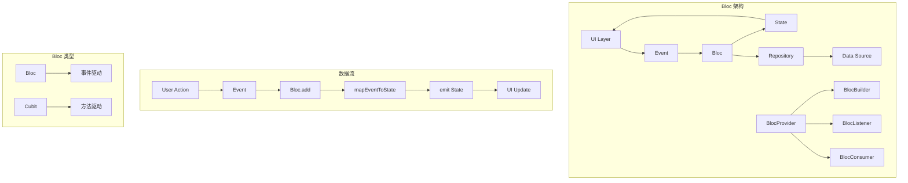

# Bloc 状态管理

Bloc（Business Logic Component）是一个强大的状态管理库，基于流（Stream）和事件驱动的架构。它将业务逻辑与UI完全分离，提供了可预测的状态管理和优秀的测试支持。

## 1. Bloc 架构概览



## 2. 基础概念

### 2.1 Cubit（简单状态管理）

```dart
import 'package:flutter_bloc/flutter_bloc.dart';

// 计数器 Cubit
class CounterCubit extends Cubit<int> {
  CounterCubit() : super(0);
  
  void increment() => emit(state + 1);
  void decrement() => emit(state - 1);
  void reset() => emit(0);
}

// 使用 Cubit
class CounterPage extends StatelessWidget {
  @override
  Widget build(BuildContext context) {
    return BlocProvider(
      create: (context) => CounterCubit(),
      child: CounterView(),
    );
  }
}

class CounterView extends StatelessWidget {
  @override
  Widget build(BuildContext context) {
    return Scaffold(
      appBar: AppBar(title: const Text('计数器')),
      body: BlocBuilder<CounterCubit, int>(
        builder: (context, count) {
          return Center(
            child: Text(
              '$count',
              style: Theme.of(context).textTheme.headlineLarge,
            ),
          );
        },
      ),
      floatingActionButton: Column(
        mainAxisAlignment: MainAxisAlignment.end,
        children: [
          FloatingActionButton(
            onPressed: () => context.read<CounterCubit>().increment(),
            child: const Icon(Icons.add),
          ),
          const SizedBox(height: 8),
          FloatingActionButton(
            onPressed: () => context.read<CounterCubit>().decrement(),
            child: const Icon(Icons.remove),
          ),
        ],
      ),
    );
  }
}
```

### 2.2 复杂状态管理

```dart
// 待办事项状态
enum TodoStatus { initial, loading, success, failure }

class TodoState {
  final TodoStatus status;
  final List<Todo> todos;
  final String? errorMessage;
  
  const TodoState({
    this.status = TodoStatus.initial,
    this.todos = const [],
    this.errorMessage,
  });
  
  TodoState copyWith({
    TodoStatus? status,
    List<Todo>? todos,
    String? errorMessage,
  }) {
    return TodoState(
      status: status ?? this.status,
      todos: todos ?? this.todos,
      errorMessage: errorMessage ?? this.errorMessage,
    );
  }
}

// 待办事项 Cubit
class TodoCubit extends Cubit<TodoState> {
  final TodoRepository _todoRepository;
  
  TodoCubit(this._todoRepository) : super(const TodoState());
  
  Future<void> loadTodos() async {
    emit(state.copyWith(status: TodoStatus.loading));
    
    try {
      final todos = await _todoRepository.getTodos();
      emit(state.copyWith(
        status: TodoStatus.success,
        todos: todos,
      ));
    } catch (error) {
      emit(state.copyWith(
        status: TodoStatus.failure,
        errorMessage: error.toString(),
      ));
    }
  }
  
  Future<void> addTodo(String title) async {
    try {
      final todo = await _todoRepository.createTodo(title);
      emit(state.copyWith(
        todos: [...state.todos, todo],
      ));
    } catch (error) {
      emit(state.copyWith(
        status: TodoStatus.failure,
        errorMessage: error.toString(),
      ));
    }
  }
  
  Future<void> toggleTodo(String id) async {
    try {
      final updatedTodos = state.todos.map((todo) {
        if (todo.id == id) {
          return todo.copyWith(isCompleted: !todo.isCompleted);
        }
        return todo;
      }).toList();
      
      emit(state.copyWith(todos: updatedTodos));
      
      await _todoRepository.updateTodo(
        updatedTodos.firstWhere((todo) => todo.id == id),
      );
    } catch (error) {
      // 回滚状态
      emit(state.copyWith(
        status: TodoStatus.failure,
        errorMessage: error.toString(),
      ));
    }
  }
  
  Future<void> deleteTodo(String id) async {
    try {
      await _todoRepository.deleteTodo(id);
      emit(state.copyWith(
        todos: state.todos.where((todo) => todo.id != id).toList(),
      ));
    } catch (error) {
      emit(state.copyWith(
        status: TodoStatus.failure,
        errorMessage: error.toString(),
      ));
    }
  }
}
```

### 2.3 Bloc（事件驱动）

```dart
// 认证事件
abstract class AuthEvent {}

class AuthLoginRequested extends AuthEvent {
  final String email;
  final String password;
  
  AuthLoginRequested({required this.email, required this.password});
}

class AuthLogoutRequested extends AuthEvent {}

class AuthStatusChanged extends AuthEvent {
  final AuthStatus status;
  
  AuthStatusChanged(this.status);
}

// 认证状态
enum AuthStatus { unknown, authenticated, unauthenticated }

class AuthState {
  final AuthStatus status;
  final User? user;
  final String? errorMessage;
  
  const AuthState({
    this.status = AuthStatus.unknown,
    this.user,
    this.errorMessage,
  });
  
  AuthState copyWith({
    AuthStatus? status,
    User? user,
    String? errorMessage,
  }) {
    return AuthState(
      status: status ?? this.status,
      user: user ?? this.user,
      errorMessage: errorMessage ?? this.errorMessage,
    );
  }
}

// 认证 Bloc
class AuthBloc extends Bloc<AuthEvent, AuthState> {
  final AuthRepository _authRepository;
  late final StreamSubscription<AuthStatus> _authStatusSubscription;
  
  AuthBloc(this._authRepository) : super(const AuthState()) {
    // 监听认证状态变化
    _authStatusSubscription = _authRepository.status.listen(
      (status) => add(AuthStatusChanged(status)),
    );
    
    // 注册事件处理器
    on<AuthStatusChanged>(_onAuthStatusChanged);
    on<AuthLoginRequested>(_onAuthLoginRequested);
    on<AuthLogoutRequested>(_onAuthLogoutRequested);
  }
  
  void _onAuthStatusChanged(
    AuthStatusChanged event,
    Emitter<AuthState> emit,
  ) async {
    switch (event.status) {
      case AuthStatus.unauthenticated:
        emit(const AuthState(status: AuthStatus.unauthenticated));
        break;
      case AuthStatus.authenticated:
        final user = await _authRepository.getCurrentUser();
        emit(AuthState(
          status: AuthStatus.authenticated,
          user: user,
        ));
        break;
      case AuthStatus.unknown:
        emit(const AuthState(status: AuthStatus.unknown));
        break;
    }
  }
  
  void _onAuthLoginRequested(
    AuthLoginRequested event,
    Emitter<AuthState> emit,
  ) async {
    try {
      await _authRepository.login(
        email: event.email,
        password: event.password,
      );
    } catch (error) {
      emit(state.copyWith(
        status: AuthStatus.unauthenticated,
        errorMessage: error.toString(),
      ));
    }
  }
  
  void _onAuthLogoutRequested(
    AuthLogoutRequested event,
    Emitter<AuthState> emit,
  ) async {
    await _authRepository.logout();
  }
  
  @override
  Future<void> close() {
    _authStatusSubscription.cancel();
    return super.close();
  }
}
```

## 3. UI 集成

### 3.1 BlocBuilder

```dart
class TodoListWidget extends StatelessWidget {
  @override
  Widget build(BuildContext context) {
    return BlocBuilder<TodoCubit, TodoState>(
      builder: (context, state) {
        switch (state.status) {
          case TodoStatus.initial:
            return const Center(child: Text('请加载待办事项'));
          case TodoStatus.loading:
            return const Center(child: CircularProgressIndicator());
          case TodoStatus.success:
            return ListView.builder(
              itemCount: state.todos.length,
              itemBuilder: (context, index) {
                final todo = state.todos[index];
                return TodoTile(todo: todo);
              },
            );
          case TodoStatus.failure:
            return Center(
              child: Column(
                mainAxisAlignment: MainAxisAlignment.center,
                children: [
                  Text('错误: ${state.errorMessage}'),
                  ElevatedButton(
                    onPressed: () {
                      context.read<TodoCubit>().loadTodos();
                    },
                    child: const Text('重试'),
                  ),
                ],
              ),
            );
        }
      },
    );
  }
}
```

### 3.2 BlocListener

```dart
class TodoPage extends StatelessWidget {
  @override
  Widget build(BuildContext context) {
    return BlocListener<TodoCubit, TodoState>(
      listener: (context, state) {
        if (state.status == TodoStatus.failure) {
          ScaffoldMessenger.of(context).showSnackBar(
            SnackBar(
              content: Text(state.errorMessage ?? '未知错误'),
              backgroundColor: Colors.red,
            ),
          );
        }
      },
      child: Scaffold(
        appBar: AppBar(title: const Text('待办事项')),
        body: TodoListWidget(),
        floatingActionButton: FloatingActionButton(
          onPressed: () => _showAddTodoDialog(context),
          child: const Icon(Icons.add),
        ),
      ),
    );
  }
  
  void _showAddTodoDialog(BuildContext context) {
    showDialog(
      context: context,
      builder: (dialogContext) => BlocProvider.value(
        value: context.read<TodoCubit>(),
        child: AddTodoDialog(),
      ),
    );
  }
}
```

### 3.3 BlocConsumer

```dart
class AuthPage extends StatelessWidget {
  @override
  Widget build(BuildContext context) {
    return BlocConsumer<AuthBloc, AuthState>(
      listener: (context, state) {
        // 监听状态变化
        if (state.status == AuthStatus.authenticated) {
          Navigator.of(context).pushReplacementNamed('/home');
        } else if (state.errorMessage != null) {
          ScaffoldMessenger.of(context).showSnackBar(
            SnackBar(
              content: Text(state.errorMessage!),
              backgroundColor: Colors.red,
            ),
          );
        }
      },
      builder: (context, state) {
        // 构建UI
        return Scaffold(
          appBar: AppBar(title: const Text('登录')),
          body: Padding(
            padding: const EdgeInsets.all(16.0),
            child: LoginForm(),
          ),
        );
      },
    );
  }
}
```

### 3.4 条件重建

```dart
// 只在特定条件下重建
class OptimizedTodoCounter extends StatelessWidget {
  @override
  Widget build(BuildContext context) {
    return BlocBuilder<TodoCubit, TodoState>(
      buildWhen: (previous, current) {
        // 只在待办事项数量变化时重建
        return previous.todos.length != current.todos.length;
      },
      builder: (context, state) {
        return Text('待办事项: ${state.todos.length}');
      },
    );
  }
}

// 只监听特定状态变化
class ErrorListener extends StatelessWidget {
  final Widget child;
  
  const ErrorListener({required this.child});
  
  @override
  Widget build(BuildContext context) {
    return BlocListener<TodoCubit, TodoState>(
      listenWhen: (previous, current) {
        // 只在错误状态变化时监听
        return previous.status != current.status &&
               current.status == TodoStatus.failure;
      },
      listener: (context, state) {
        ScaffoldMessenger.of(context).showSnackBar(
          SnackBar(content: Text(state.errorMessage ?? '操作失败')),
        );
      },
      child: child,
    );
  }
}
```

## 4. 高级用法

### 4.1 Bloc 组合

```dart
// 多个 Bloc 的组合使用
class AppPage extends StatelessWidget {
  @override
  Widget build(BuildContext context) {
    return MultiBlocProvider(
      providers: [
        BlocProvider<AuthBloc>(
          create: (context) => AuthBloc(
            RepositoryProvider.of<AuthRepository>(context),
          ),
        ),
        BlocProvider<TodoCubit>(
          create: (context) => TodoCubit(
            RepositoryProvider.of<TodoRepository>(context),
          ),
        ),
        BlocProvider<SettingsCubit>(
          create: (context) => SettingsCubit(),
        ),
      ],
      child: AppView(),
    );
  }
}

// Bloc 之间的通信
class TodoBloc extends Bloc<TodoEvent, TodoState> {
  final AuthBloc _authBloc;
  late final StreamSubscription _authSubscription;
  
  TodoBloc(this._authBloc) : super(const TodoState()) {
    // 监听认证状态变化
    _authSubscription = _authBloc.stream.listen((authState) {
      if (authState.status == AuthStatus.unauthenticated) {
        add(TodoClearRequested());
      } else if (authState.status == AuthStatus.authenticated) {
        add(TodoLoadRequested());
      }
    });
    
    on<TodoLoadRequested>(_onTodoLoadRequested);
    on<TodoClearRequested>(_onTodoClearRequested);
  }
  
  @override
  Future<void> close() {
    _authSubscription.cancel();
    return super.close();
  }
}
```

### 4.2 状态持久化

```dart
// 使用 HydratedBloc 进行状态持久化
import 'package:hydrated_bloc/hydrated_bloc.dart';

class SettingsCubit extends HydratedCubit<Settings> {
  SettingsCubit() : super(const Settings());
  
  void updateTheme(ThemeMode theme) {
    emit(state.copyWith(theme: theme));
  }
  
  void updateLanguage(String language) {
    emit(state.copyWith(language: language));
  }
  
  @override
  Settings? fromJson(Map<String, dynamic> json) {
    try {
      return Settings.fromJson(json);
    } catch (_) {
      return null;
    }
  }
  
  @override
  Map<String, dynamic>? toJson(Settings state) {
    try {
      return state.toJson();
    } catch (_) {
      return null;
    }
  }
}

// 在 main.dart 中初始化
void main() async {
  WidgetsFlutterBinding.ensureInitialized();
  
  HydratedBloc.storage = await HydratedStorage.build(
    storageDirectory: await getApplicationDocumentsDirectory(),
  );
  
  runApp(MyApp());
}
```

### 4.3 异步事件处理

```dart
class SearchBloc extends Bloc<SearchEvent, SearchState> {
  final SearchRepository _searchRepository;
  Timer? _debounceTimer;
  
  SearchBloc(this._searchRepository) : super(const SearchState()) {
    on<SearchQueryChanged>(
      _onSearchQueryChanged,
      transformer: debounce(const Duration(milliseconds: 300)),
    );
    on<SearchResultsRequested>(_onSearchResultsRequested);
  }
  
  void _onSearchQueryChanged(
    SearchQueryChanged event,
    Emitter<SearchState> emit,
  ) {
    emit(state.copyWith(query: event.query));
    
    if (event.query.isNotEmpty) {
      add(SearchResultsRequested(event.query));
    } else {
      emit(state.copyWith(
        status: SearchStatus.initial,
        results: [],
      ));
    }
  }
  
  void _onSearchResultsRequested(
    SearchResultsRequested event,
    Emitter<SearchState> emit,
  ) async {
    emit(state.copyWith(status: SearchStatus.loading));
    
    try {
      final results = await _searchRepository.search(event.query);
      emit(state.copyWith(
        status: SearchStatus.success,
        results: results,
      ));
    } catch (error) {
      emit(state.copyWith(
        status: SearchStatus.failure,
        errorMessage: error.toString(),
      ));
    }
  }
  
  @override
  Future<void> close() {
    _debounceTimer?.cancel();
    return super.close();
  }
}

// 防抖转换器
EventTransformer<T> debounce<T>(Duration duration) {
  return (events, mapper) => events.debounceTime(duration).flatMap(mapper);
}
```

## 5. 性能优化

### 5.1 状态分割

```dart
// 避免大状态对象
class BadAppState {
  final User? user;
  final List<Todo> todos;
  final Settings settings;
  final List<Notification> notifications;
  // ... 更多状态
}

// 好的做法：分割状态
class UserCubit extends Cubit<User?> {
  UserCubit() : super(null);
  // 只管理用户相关状态
}

class TodoCubit extends Cubit<TodoState> {
  TodoCubit() : super(const TodoState());
  // 只管理待办事项状态
}

class SettingsCubit extends Cubit<Settings> {
  SettingsCubit() : super(const Settings());
  // 只管理设置状态
}
```

### 5.2 选择性监听

```dart
// 使用 BlocSelector 进行精确监听
class TodoCounterWidget extends StatelessWidget {
  @override
  Widget build(BuildContext context) {
    return BlocSelector<TodoCubit, TodoState, int>(
      selector: (state) => state.todos.length,
      builder: (context, count) {
        return Text('待办事项: $count');
      },
    );
  }
}

// 使用 buildWhen 控制重建
class OptimizedTodoList extends StatelessWidget {
  @override
  Widget build(BuildContext context) {
    return BlocBuilder<TodoCubit, TodoState>(
      buildWhen: (previous, current) {
        // 只在待办事项列表变化时重建
        return !listEquals(previous.todos, current.todos);
      },
      builder: (context, state) {
        return ListView.builder(
          itemCount: state.todos.length,
          itemBuilder: (context, index) {
            return TodoTile(todo: state.todos[index]);
          },
        );
      },
    );
  }
}
```

### 5.3 内存管理

```dart
// 自动释放 Bloc
class AutoDisposePage extends StatelessWidget {
  @override
  Widget build(BuildContext context) {
    return BlocProvider(
      create: (context) => TempCubit(),
      child: TempView(),
    ); // Bloc 会在页面销毁时自动释放
  }
}

// 手动管理 Bloc 生命周期
class ManualDisposePage extends StatefulWidget {
  @override
  _ManualDisposePageState createState() => _ManualDisposePageState();
}

class _ManualDisposePageState extends State<ManualDisposePage> {
  late final TempCubit _tempCubit;
  
  @override
  void initState() {
    super.initState();
    _tempCubit = TempCubit();
  }
  
  @override
  void dispose() {
    _tempCubit.close();
    super.dispose();
  }
  
  @override
  Widget build(BuildContext context) {
    return BlocProvider.value(
      value: _tempCubit,
      child: TempView(),
    );
  }
}
```

## 6. 测试

### 6.1 Cubit 测试

```dart
import 'package:bloc_test/bloc_test.dart';
import 'package:flutter_test/flutter_test.dart';

void main() {
  group('CounterCubit', () {
    late CounterCubit counterCubit;
    
    setUp(() {
      counterCubit = CounterCubit();
    });
    
    tearDown(() {
      counterCubit.close();
    });
    
    test('初始状态为0', () {
      expect(counterCubit.state, 0);
    });
    
    blocTest<CounterCubit, int>(
      '增加计数',
      build: () => CounterCubit(),
      act: (cubit) => cubit.increment(),
      expect: () => [1],
    );
    
    blocTest<CounterCubit, int>(
      '减少计数',
      build: () => CounterCubit(),
      seed: () => 3,
      act: (cubit) => cubit.decrement(),
      expect: () => [2],
    );
    
    blocTest<CounterCubit, int>(
      '重置计数',
      build: () => CounterCubit(),
      seed: () => 5,
      act: (cubit) => cubit.reset(),
      expect: () => [0],
    );
  });
}
```

### 6.2 Bloc 测试

```dart
void main() {
  group('AuthBloc', () {
    late AuthRepository mockAuthRepository;
    late AuthBloc authBloc;
    
    setUp(() {
      mockAuthRepository = MockAuthRepository();
      authBloc = AuthBloc(mockAuthRepository);
    });
    
    tearDown(() {
      authBloc.close();
    });
    
    test('初始状态正确', () {
      expect(authBloc.state.status, AuthStatus.unknown);
    });
    
    blocTest<AuthBloc, AuthState>(
      '登录成功',
      build: () {
        when(() => mockAuthRepository.login(
          email: any(named: 'email'),
          password: any(named: 'password'),
        )).thenAnswer((_) async {});
        
        when(() => mockAuthRepository.status)
            .thenAnswer((_) => Stream.value(AuthStatus.authenticated));
        
        when(() => mockAuthRepository.getCurrentUser())
            .thenAnswer((_) async => User(id: '1', email: 'test@example.com'));
        
        return AuthBloc(mockAuthRepository);
      },
      act: (bloc) => bloc.add(AuthLoginRequested(
        email: 'test@example.com',
        password: 'password',
      )),
      expect: () => [
        const AuthState(status: AuthStatus.authenticated, user: User(
          id: '1',
          email: 'test@example.com',
        )),
      ],
    );
    
    blocTest<AuthBloc, AuthState>(
      '登录失败',
      build: () {
        when(() => mockAuthRepository.login(
          email: any(named: 'email'),
          password: any(named: 'password'),
        )).thenThrow(Exception('登录失败'));
        
        return AuthBloc(mockAuthRepository);
      },
      act: (bloc) => bloc.add(AuthLoginRequested(
        email: 'test@example.com',
        password: 'wrong_password',
      )),
      expect: () => [
        const AuthState(
          status: AuthStatus.unauthenticated,
          errorMessage: 'Exception: 登录失败',
        ),
      ],
    );
  });
}
```

### 6.3 Widget 测试

```dart
void main() {
  group('CounterPage', () {
    testWidgets('显示初始计数', (WidgetTester tester) async {
      await tester.pumpWidget(
        MaterialApp(
          home: BlocProvider(
            create: (context) => CounterCubit(),
            child: CounterPage(),
          ),
        ),
      );
      
      expect(find.text('0'), findsOneWidget);
    });
    
    testWidgets('点击增加按钮', (WidgetTester tester) async {
      await tester.pumpWidget(
        MaterialApp(
          home: BlocProvider(
            create: (context) => CounterCubit(),
            child: CounterPage(),
          ),
        ),
      );
      
      await tester.tap(find.byIcon(Icons.add));
      await tester.pump();
      
      expect(find.text('1'), findsOneWidget);
    });
    
    testWidgets('使用模拟 Cubit 测试', (WidgetTester tester) async {
      final mockCubit = MockCounterCubit();
      
      when(() => mockCubit.state).thenReturn(42);
      when(() => mockCubit.stream).thenAnswer((_) => Stream.value(42));
      
      await tester.pumpWidget(
        MaterialApp(
          home: BlocProvider<CounterCubit>.value(
            value: mockCubit,
            child: CounterPage(),
          ),
        ),
      );
      
      expect(find.text('42'), findsOneWidget);
    });
  });
}
```

## 7. 调试与监控

### 7.1 BlocObserver

```dart
class AppBlocObserver extends BlocObserver {
  @override
  void onCreate(BlocBase bloc) {
    super.onCreate(bloc);
    debugPrint('创建: ${bloc.runtimeType}');
  }
  
  @override
  void onChange(BlocBase bloc, Change change) {
    super.onChange(bloc, change);
    debugPrint('${bloc.runtimeType} 状态变化: $change');
  }
  
  @override
  void onTransition(Bloc bloc, Transition transition) {
    super.onTransition(bloc, transition);
    debugPrint('${bloc.runtimeType} 转换: $transition');
  }
  
  @override
  void onEvent(Bloc bloc, Object? event) {
    super.onEvent(bloc, event);
    debugPrint('${bloc.runtimeType} 事件: $event');
  }
  
  @override
  void onError(BlocBase bloc, Object error, StackTrace stackTrace) {
    super.onError(bloc, error, stackTrace);
    debugPrint('${bloc.runtimeType} 错误: $error\n$stackTrace');
  }
  
  @override
  void onClose(BlocBase bloc) {
    super.onClose(bloc);
    debugPrint('关闭: ${bloc.runtimeType}');
  }
}

// 在 main.dart 中设置
void main() {
  Bloc.observer = AppBlocObserver();
  runApp(MyApp());
}
```

### 7.2 状态日志

```dart
// 带日志的 Cubit
class LoggingCubit<T> extends Cubit<T> {
  LoggingCubit(T initialState) : super(initialState);
  
  @override
  void emit(T state) {
    debugPrint('${runtimeType}: $state');
    super.emit(state);
  }
  
  @override
  void onChange(Change<T> change) {
    super.onChange(change);
    debugPrint('${runtimeType} 变化: ${change.currentState} -> ${change.nextState}');
  }
}

// 使用示例
class CounterCubit extends LoggingCubit<int> {
  CounterCubit() : super(0);
  
  void increment() => emit(state + 1);
  void decrement() => emit(state - 1);
}
```

## 8. 最佳实践

### 8.1 状态设计原则

#### 不可变状态
```dart
// 好的做法：不可变状态
class TodoState {
  final List<Todo> todos;
  final TodoStatus status;
  
  const TodoState({
    this.todos = const [],
    this.status = TodoStatus.initial,
  });
  
  TodoState copyWith({
    List<Todo>? todos,
    TodoStatus? status,
  }) {
    return TodoState(
      todos: todos ?? this.todos,
      status: status ?? this.status,
    );
  }
}

// 避免：可变状态
class BadTodoState {
  List<Todo> todos = [];
  TodoStatus status = TodoStatus.initial;
  
  // 直接修改状态可能导致问题
  void addTodo(Todo todo) {
    todos.add(todo); // 危险！
  }
}
```

#### 单一职责
```dart
// 好的做法：每个 Bloc 只负责一个领域
class UserBloc extends Bloc<UserEvent, UserState> {
  // 只管理用户相关逻辑
}

class TodoBloc extends Bloc<TodoEvent, TodoState> {
  // 只管理待办事项逻辑
}

// 避免：一个 Bloc 管理多个不相关的状态
class AppBloc extends Bloc<AppEvent, AppState> {
  // 管理用户、待办事项、设置等所有状态
}
```

### 8.2 错误处理

```dart
// 统一错误处理
abstract class AppState {
  final String? errorMessage;
  final bool isLoading;
  
  const AppState({
    this.errorMessage,
    this.isLoading = false,
  });
}

class TodoState extends AppState {
  final List<Todo> todos;
  
  const TodoState({
    this.todos = const [],
    String? errorMessage,
    bool isLoading = false,
  }) : super(errorMessage: errorMessage, isLoading: isLoading);
  
  TodoState copyWith({
    List<Todo>? todos,
    String? errorMessage,
    bool? isLoading,
  }) {
    return TodoState(
      todos: todos ?? this.todos,
      errorMessage: errorMessage ?? this.errorMessage,
      isLoading: isLoading ?? this.isLoading,
    );
  }
}

// 错误处理 Mixin
mixin ErrorHandlingMixin<T extends AppState> on Cubit<T> {
  void handleError(Object error) {
    emit(state.copyWith(errorMessage: error.toString()) as T);
  }
  
  void clearError() {
    emit(state.copyWith(errorMessage: null) as T);
  }
}

class TodoCubit extends Cubit<TodoState> with ErrorHandlingMixin {
  TodoCubit() : super(const TodoState());
  
  Future<void> loadTodos() async {
    try {
      emit(state.copyWith(isLoading: true));
      final todos = await _repository.getTodos();
      emit(state.copyWith(todos: todos, isLoading: false));
    } catch (error) {
      emit(state.copyWith(isLoading: false));
      handleError(error);
    }
  }
}
```

### 8.3 依赖注入

```dart
// 使用 RepositoryProvider 进行依赖注入
class App extends StatelessWidget {
  @override
  Widget build(BuildContext context) {
    return MultiRepositoryProvider(
      providers: [
        RepositoryProvider<AuthRepository>(
          create: (context) => AuthRepository(),
        ),
        RepositoryProvider<TodoRepository>(
          create: (context) => TodoRepository(),
        ),
      ],
      child: MultiBlocProvider(
        providers: [
          BlocProvider<AuthBloc>(
            create: (context) => AuthBloc(
              RepositoryProvider.of<AuthRepository>(context),
            ),
          ),
          BlocProvider<TodoCubit>(
            create: (context) => TodoCubit(
              RepositoryProvider.of<TodoRepository>(context),
            ),
          ),
        ],
        child: MaterialApp(
          home: HomePage(),
        ),
      ),
    );
  }
}
```

## 9. 总结

Bloc 提供了强大的状态管理解决方案：

### 核心优势

1. **清晰的架构**：业务逻辑与UI完全分离
2. **可预测性**：单向数据流，状态变化可追踪
3. **可测试性**：优秀的测试支持和工具
4. **可扩展性**：适合大型应用开发
5. **丰富的生态**：完整的工具链和插件

### 选择指南

| 场景 | 推荐方案 | 特点 |
|------|----------|------|
| 简单状态 | Cubit | 直接、易用 |
| 复杂业务逻辑 | Bloc | 事件驱动、可追踪 |
| 状态持久化 | HydratedBloc | 自动保存恢复 |
| 异步操作 | Bloc + Repository | 清晰的数据层 |

### 最佳实践要点

1. **保持状态不可变**
2. **单一职责原则**
3. **合理的状态分割**
4. **统一的错误处理**
5. **完整的测试覆盖**
6. **适当的性能优化**
7. **清晰的依赖注入**

## 相关资源

- [Bloc 官方文档](https://bloclibrary.dev/)
- [Bloc GitHub](https://github.com/felangel/bloc)
- [Flutter Bloc 示例](https://github.com/felangel/bloc/tree/master/examples)
- [Bloc 测试库](https://pub.dev/packages/bloc_test)
- [HydratedBloc](https://pub.dev/packages/hydrated_bloc)
- [Bloc 最佳实践](https://bloclibrary.dev/#/architecture)