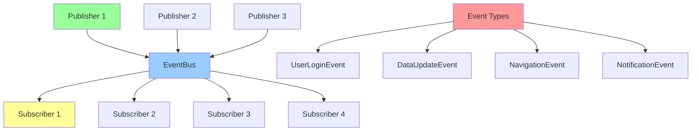

# EventBus 事件总线模式

> EventBus 是一种发布-订阅模式的实现，用于组件间的解耦通信，特别适合跨页面、跨组件的事件传递

## 📋 概要

EventBus 是一种基于发布-订阅模式（Publish-Subscribe Pattern）的事件通信机制，用于实现组件间的解耦通信。在 Flutter 开发中，[event_bus](https://pub.dev/packages/event_bus/install) 是一个常用的第三方库，它基于 Dart 的 Stream 实现，提供了简洁易用的 API 来处理跨组件、跨页面的事件传递。

### 核心原理

1. **定义事件**：创建一个类来表示特定的事件（可以携带数据）
2. **发布事件**：当某个操作发生时，通过 EventBus 实例发布一个事件
3. **订阅事件**：在需要响应事件的地方，订阅该事件并定义回调处理

### 适用场景

- 跨页面通信（如：A 页面操作需要通知 B 页面更新）
- 深层嵌套组件通信（避免回调地狱）
- 全局状态变化通知（如：用户登录状态变化、主题切换）
- 用户登录状态变更
- 数据更新通知
- 导航事件传递
- 全局消息通知
- 组件间解耦通信

### 优点

- **解耦**：组件之间无需直接引用，通过事件间接通信
- **灵活**：可以在应用的任何地方发布和订阅事件
- **轻量**：使用简单，学习成本低
- **支持数据流**：基于 Dart 的 Stream 实现，可结合 StreamBuilder 使用
- **类型安全**：基于事件类型的强类型订阅
- **异步处理**：支持异步事件处理
- **生命周期管理**：自动管理订阅和取消订阅

### 注意事项

- **内存泄漏**：必须在组件销毁时取消订阅，否则会导致内存泄漏
- **事件命名**：建议给事件类起清晰的名字，方便维护
- **事件滥用**：不要过度使用事件总线，简单的父子组件通信建议用回调或 Provider
- **线程安全**：默认情况下，事件处理在发布事件的同一线程执行

## 📋 EventBus 架构图



## 🎯 基础概念

### EventBus 特点

- **解耦通信**: 发布者和订阅者无需直接引用
- **一对多**: 一个事件可以有多个订阅者
- **类型安全**: 基于事件类型的强类型订阅
- **异步处理**: 支持异步事件处理
- **生命周期管理**: 自动管理订阅和取消订阅

## 📦 第三方库 event_bus 使用

### 1. 添加依赖

```yaml
dependencies:
  flutter:
    sdk: flutter
  event_bus: ^2.0.0 # 请使用最新版本
```

### 2. 创建 EventBus 实例

通常会创建一个全局单例，方便在应用各处使用：

```dart
import 'package:event_bus/event_bus.dart';

// 创建全局事件总线
final EventBus eventBus = EventBus();
```

### 3. 定义事件类

事件可以是简单的标记，也可以携带数据：

```dart
// 无数据的事件
class LoginEvent {}

// 带数据的事件
class UserUpdateEvent {
  final String username;
  final int age;

  UserUpdateEvent({required this.username, required this.age});
}

// 复杂事件
class DataSyncEvent {
  final String dataType;
  final dynamic data;
  final bool success;
  final String? error;

  DataSyncEvent({
    required this.dataType,
    this.data,
    required this.success,
    this.error,
  });
}
```

### 4. 发布事件

在需要触发事件的地方发布：

```dart
// 发布登录事件
eventBus.fire(LoginEvent());

// 发布带数据的事件
eventBus.fire(UserUpdateEvent(username: "张三", age: 25));

// 发布复杂事件
eventBus.fire(DataSyncEvent(
  dataType: 'user_profile',
  data: {'name': 'John', 'email': 'john@example.com'},
  success: true,
));
```

### 5. 订阅事件

```dart
class MyWidget extends StatefulWidget {
  @override
  _MyWidgetState createState() => _MyWidgetState();
}

class _MyWidgetState extends State<MyWidget> {
  StreamSubscription<LoginEvent>? loginSubscription;
  StreamSubscription<UserUpdateEvent>? userUpdateSubscription;
  StreamSubscription<DataSyncEvent>? dataSyncSubscription;

  @override
  void initState() {
    super.initState();
    _setupEventListeners();
  }

  void _setupEventListeners() {
    // 订阅登录事件
    loginSubscription = eventBus.on<LoginEvent>().listen((event) {
      print("收到登录事件，执行相关操作");
      // 例如：更新UI、跳转页面等
      _handleLogin();
    });

    // 订阅用户更新事件
    userUpdateSubscription = eventBus.on<UserUpdateEvent>().listen((event) {
      print("用户更新：${event.username}, ${event.age}");
      // 处理用户信息更新逻辑
      _updateUserInfo(event);
    });

    // 订阅数据同步事件
    dataSyncSubscription = eventBus.on<DataSyncEvent>().listen((event) {
      if (event.success) {
        print("数据同步成功: ${event.dataType}");
        _handleDataSyncSuccess(event);
      } else {
        print("数据同步失败: ${event.error}");
        _handleDataSyncError(event);
      }
    });
  }

  void _handleLogin() {
    // 处理登录逻辑
    setState(() {
      // 更新UI状态
    });
  }

  void _updateUserInfo(UserUpdateEvent event) {
    // 更新用户信息
    setState(() {
      // 更新UI
    });
  }

  void _handleDataSyncSuccess(DataSyncEvent event) {
    // 处理数据同步成功
  }

  void _handleDataSyncError(DataSyncEvent event) {
    // 处理数据同步失败
  }

  @override
  void dispose() {
    // 取消订阅，避免内存泄漏
    loginSubscription?.cancel();
    userUpdateSubscription?.cancel();
    dataSyncSubscription?.cancel();
    super.dispose();
  }

  @override
  Widget build(BuildContext context) {
    return Container(
      child: Text('EventBus 示例'),
    );
  }
}
```

### 6. 结合 StreamBuilder 使用

```dart
class EventStreamWidget extends StatelessWidget {
  @override
  Widget build(BuildContext context) {
    return StreamBuilder<UserUpdateEvent>(
      stream: eventBus.on<UserUpdateEvent>(),
      builder: (context, snapshot) {
        if (snapshot.hasData) {
          final event = snapshot.data!;
          return Text('用户: ${event.username}, 年龄: ${event.age}');
        }
        return Text('等待用户更新...');
      },
    );
  }
}
```

### 7. 全局事件总线管理

```dart
// lib/services/event_bus_service.dart
import 'package:event_bus/event_bus.dart';

class EventBusService {
  static final EventBusService _instance = EventBusService._internal();
  factory EventBusService() => _instance;
  EventBusService._internal();

  final EventBus _eventBus = EventBus();

  EventBus get eventBus => _eventBus;

  // 便捷方法
  void fire<T>(T event) => _eventBus.fire(event);

  Stream<T> on<T>() => _eventBus.on<T>();

  // 清理资源
  void dispose() {
    // event_bus 库会自动管理资源，这里可以添加自定义清理逻辑
  }
}

// 全局实例
final eventBusService = EventBusService();
```

## 🚀 基础实现

### 1. 简单 EventBus 实现

```dart
import 'dart:async';

// 事件基类
abstract class BaseEvent {
  final DateTime timestamp;
  final String eventId;

  BaseEvent()
    : timestamp = DateTime.now(),
      eventId = DateTime.now().millisecondsSinceEpoch.toString();
}

// 简单EventBus实现
class SimpleEventBus {
  static final SimpleEventBus _instance = SimpleEventBus._internal();
  factory SimpleEventBus() => _instance;
  SimpleEventBus._internal();

  final Map<Type, List<StreamController>> _controllers = {};
  final Map<Type, List<Function>> _listeners = {};

  // 发布事件
  void fire<T extends BaseEvent>(T event) {
    final type = T;

    // 通知Stream订阅者
    if (_controllers.containsKey(type)) {
      for (final controller in _controllers[type]!) {
        if (!controller.isClosed) {
          controller.add(event);
        }
      }
    }

    // 通知Function订阅者
    if (_listeners.containsKey(type)) {
      for (final listener in _listeners[type]!) {
        try {
          listener(event);
        } catch (e) {
          print('EventBus listener error: $e');
        }
      }
    }
  }

  // 订阅事件（Stream方式）
  Stream<T> on<T extends BaseEvent>() {
    final type = T;
    final controller = StreamController<T>.broadcast();

    _controllers.putIfAbsent(type, () => []).add(controller);

    return controller.stream;
  }

  // 订阅事件（Function方式）
  void listen<T extends BaseEvent>(void Function(T event) listener) {
    final type = T;
    _listeners.putIfAbsent(type, () => []).add(listener);
  }

  // 取消订阅
  void unlisten<T extends BaseEvent>(void Function(T event) listener) {
    final type = T;
    _listeners[type]?.remove(listener);
  }

  // 清理资源
  void dispose() {
    for (final controllerList in _controllers.values) {
      for (final controller in controllerList) {
        controller.close();
      }
    }
    _controllers.clear();
    _listeners.clear();
  }
}

// 使用示例事件
class UserLoginEvent extends BaseEvent {
  final String userId;
  final String username;
  final Map<String, dynamic> userInfo;

  UserLoginEvent({
    required this.userId,
    required this.username,
    required this.userInfo,
  });
}

class DataUpdateEvent extends BaseEvent {
  final String dataType;
  final dynamic data;
  final String operation; // 'create', 'update', 'delete'

  DataUpdateEvent({
    required this.dataType,
    required this.data,
    required this.operation,
  });
}

// 使用示例
void main() {
  final eventBus = SimpleEventBus();

  // 订阅用户登录事件
  eventBus.listen<UserLoginEvent>((event) {
    print('用户登录: ${event.username}');
  });

  // 订阅数据更新事件
  final subscription = eventBus.on<DataUpdateEvent>().listen((event) {
    print('数据更新: ${event.dataType} - ${event.operation}');
  });

  // 发布事件
  eventBus.fire(UserLoginEvent(
    userId: '123',
    username: 'john_doe',
    userInfo: {'email': 'john@example.com'},
  ));

  eventBus.fire(DataUpdateEvent(
    dataType: 'user_profile',
    data: {'name': 'John Updated'},
    operation: 'update',
  ));

  // 清理
  subscription.cancel();
}
```

### 2. 高级 EventBus 实现

```dart
// 高级EventBus实现
class AdvancedEventBus {
  static final AdvancedEventBus _instance = AdvancedEventBus._internal();
  factory AdvancedEventBus() => _instance;
  AdvancedEventBus._internal();

  final Map<Type, Set<EventSubscription>> _subscriptions = {};
  final List<EventInterceptor> _interceptors = [];
  final StreamController<BaseEvent> _globalStream = StreamController.broadcast();

  // 全局事件流
  Stream<BaseEvent> get globalStream => _globalStream.stream;

  // 添加拦截器
  void addInterceptor(EventInterceptor interceptor) {
    _interceptors.add(interceptor);
  }

  // 移除拦截器
  void removeInterceptor(EventInterceptor interceptor) {
    _interceptors.remove(interceptor);
  }

  // 发布事件
  Future<void> fire<T extends BaseEvent>(T event) async {
    // 执行前置拦截器
    for (final interceptor in _interceptors) {
      final shouldContinue = await interceptor.onBeforePublish(event);
      if (!shouldContinue) {
        return;
      }
    }

    // 发布到全局流
    _globalStream.add(event);

    // 发布到特定类型订阅者
    final type = T;
    final subscriptions = _subscriptions[type];

    if (subscriptions != null) {
      final futures = <Future>[];

      for (final subscription in subscriptions.toList()) {
        if (subscription.isActive) {
          try {
            final future = subscription.handle(event);
            if (future != null) {
              futures.add(future);
            }
          } catch (e) {
            print('EventBus subscription error: $e');
            // 可选择移除出错的订阅
            if (subscription.removeOnError) {
              subscriptions.remove(subscription);
            }
          }
        }
      }

      // 等待所有异步处理完成
      if (futures.isNotEmpty) {
        await Future.wait(futures, eagerError: false);
      }
    }

    // 执行后置拦截器
    for (final interceptor in _interceptors) {
      await interceptor.onAfterPublish(event);
    }
  }

  // 订阅事件
  EventSubscription subscribe<T extends BaseEvent>({
    required EventHandler<T> handler,
    EventFilter<T>? filter,
    int priority = 0,
    bool removeOnError = false,
    Duration? timeout,
  }) {
    final type = T;
    final subscription = EventSubscription<T>(
      handler: handler,
      filter: filter,
      priority: priority,
      removeOnError: removeOnError,
      timeout: timeout,
    );

    _subscriptions.putIfAbsent(type, () => <EventSubscription>{}).add(subscription);

    // 按优先级排序
    final sortedList = _subscriptions[type]!.toList()
      ..sort((a, b) => b.priority.compareTo(a.priority));
    _subscriptions[type] = sortedList.toSet();

    return subscription;
  }

  // 取消订阅
  void unsubscribe(EventSubscription subscription) {
    for (final subscriptions in _subscriptions.values) {
      subscriptions.remove(subscription);
    }
    subscription.cancel();
  }

  // 取消所有订阅
  void unsubscribeAll<T extends BaseEvent>() {
    final type = T;
    final subscriptions = _subscriptions[type];
    if (subscriptions != null) {
      for (final subscription in subscriptions) {
        subscription.cancel();
      }
      subscriptions.clear();
    }
  }

  // 获取统计信息
  Map<String, dynamic> getStatistics() {
    final stats = <String, dynamic>{};

    for (final entry in _subscriptions.entries) {
      final typeName = entry.key.toString();
      final activeCount = entry.value.where((s) => s.isActive).length;
      stats[typeName] = {
        'total': entry.value.length,
        'active': activeCount,
        'inactive': entry.value.length - activeCount,
      };
    }

    return {
      'subscriptions': stats,
      'interceptors': _interceptors.length,
      'totalEvents': _subscriptions.values.fold(0, (sum, subs) => sum + subs.length),
    };
  }

  // 清理资源
  void dispose() {
    for (final subscriptions in _subscriptions.values) {
      for (final subscription in subscriptions) {
        subscription.cancel();
      }
    }
    _subscriptions.clear();
    _interceptors.clear();
    _globalStream.close();
  }
}

// 事件订阅
class EventSubscription<T extends BaseEvent> {
  final EventHandler<T> handler;
  final EventFilter<T>? filter;
  final int priority;
  final bool removeOnError;
  final Duration? timeout;

  bool _isActive = true;
  Timer? _timeoutTimer;

  EventSubscription({
    required this.handler,
    this.filter,
    this.priority = 0,
    this.removeOnError = false,
    this.timeout,
  }) {
    if (timeout != null) {
      _timeoutTimer = Timer(timeout!, () {
        cancel();
      });
    }
  }

  bool get isActive => _isActive;

  Future<void>? handle(BaseEvent event) {
    if (!_isActive || event is! T) return null;

    // 应用过滤器
    if (filter != null && !filter!(event)) {
      return null;
    }

    return handler(event);
  }

  void cancel() {
    _isActive = false;
    _timeoutTimer?.cancel();
  }
}

// 类型定义
typedef EventHandler<T extends BaseEvent> = Future<void> Function(T event);
typedef EventFilter<T extends BaseEvent> = bool Function(T event);

// 事件拦截器
abstract class EventInterceptor {
  Future<bool> onBeforePublish(BaseEvent event);
  Future<void> onAfterPublish(BaseEvent event);
}

// 日志拦截器
class LoggingInterceptor extends EventInterceptor {
  @override
  Future<bool> onBeforePublish(BaseEvent event) async {
    print('[EventBus] Publishing: ${event.runtimeType} at ${event.timestamp}');
    return true;
  }

  @override
  Future<void> onAfterPublish(BaseEvent event) async {
    print('[EventBus] Published: ${event.runtimeType} with ID ${event.eventId}');
  }
}

// 性能监控拦截器
class PerformanceInterceptor extends EventInterceptor {
  final Map<String, Stopwatch> _timers = {};

  @override
  Future<bool> onBeforePublish(BaseEvent event) async {
    final timer = Stopwatch()..start();
    _timers[event.eventId] = timer;
    return true;
  }

  @override
  Future<void> onAfterPublish(BaseEvent event) async {
    final timer = _timers.remove(event.eventId);
    if (timer != null) {
      timer.stop();
      final duration = timer.elapsedMicroseconds;

      if (duration > 1000) { // 超过1ms的事件
        print('[EventBus] Slow event: ${event.runtimeType} took ${duration}μs');
      }
    }
  }
}
```

## 🔧 实际应用场景

### 1. 用户状态管理

```dart
// 用户相关事件
class UserLoginEvent extends BaseEvent {
  final User user;
  final String token;

  UserLoginEvent({required this.user, required this.token});
}

class UserLogoutEvent extends BaseEvent {
  final String reason;

  UserLogoutEvent({required this.reason});
}

class UserProfileUpdateEvent extends BaseEvent {
  final User updatedUser;
  final List<String> changedFields;

  UserProfileUpdateEvent({
    required this.updatedUser,
    required this.changedFields,
  });
}

// 用户状态管理器
class UserStateManager {
  static final UserStateManager _instance = UserStateManager._internal();
  factory UserStateManager() => _instance;
  UserStateManager._internal() {
    _initializeEventListeners();
  }

  final AdvancedEventBus _eventBus = AdvancedEventBus();
  User? _currentUser;
  String? _authToken;

  User? get currentUser => _currentUser;
  String? get authToken => _authToken;
  bool get isLoggedIn => _currentUser != null && _authToken != null;

  void _initializeEventListeners() {
    // 监听登录事件
    _eventBus.subscribe<UserLoginEvent>(
      handler: (event) async {
        _currentUser = event.user;
        _authToken = event.token;

        // 保存到本地存储
        await _saveUserToStorage(event.user, event.token);

        // 初始化用户相关服务
        await _initializeUserServices();

        print('用户登录成功: ${event.user.name}');
      },
      priority: 100, // 高优先级
    );

    // 监听登出事件
    _eventBus.subscribe<UserLogoutEvent>(
      handler: (event) async {
        final oldUser = _currentUser;

        _currentUser = null;
        _authToken = null;

        // 清理本地存储
        await _clearUserStorage();

        // 清理用户相关服务
        await _cleanupUserServices();

        print('用户登出: ${event.reason}');

        // 可能需要导航到登录页
        if (event.reason == 'token_expired') {
          _eventBus.fire(NavigationEvent(
            route: '/login',
            arguments: {'message': '登录已过期，请重新登录'},
          ));
        }
      },
    );

    // 监听用户信息更新事件
    _eventBus.subscribe<UserProfileUpdateEvent>(
      handler: (event) async {
        _currentUser = event.updatedUser;

        // 更新本地存储
        await _updateUserInStorage(event.updatedUser);

        print('用户信息已更新: ${event.changedFields.join(", ")}');
      },
    );
  }

  // 登录
  Future<void> login(String username, String password) async {
    try {
      // 调用登录API
      final response = await AuthService.login(username, password);

      // 发布登录事件
      _eventBus.fire(UserLoginEvent(
        user: response.user,
        token: response.token,
      ));
    } catch (e) {
      print('登录失败: $e');
      rethrow;
    }
  }

  // 登出
  Future<void> logout({String reason = 'user_action'}) async {
    _eventBus.fire(UserLogoutEvent(reason: reason));
  }

  // 更新用户信息
  Future<void> updateProfile(Map<String, dynamic> updates) async {
    if (_currentUser == null) return;

    try {
      final updatedUser = await UserService.updateProfile(_currentUser!.id, updates);

      _eventBus.fire(UserProfileUpdateEvent(
        updatedUser: updatedUser,
        changedFields: updates.keys.toList(),
      ));
    } catch (e) {
      print('更新用户信息失败: $e');
      rethrow;
    }
  }

  Future<void> _saveUserToStorage(User user, String token) async {
    // 实现本地存储逻辑
  }

  Future<void> _clearUserStorage() async {
    // 实现清理逻辑
  }

  Future<void> _updateUserInStorage(User user) async {
    // 实现更新逻辑
  }

  Future<void> _initializeUserServices() async {
    // 初始化用户相关服务
  }

  Future<void> _cleanupUserServices() async {
    // 清理用户相关服务
  }
}

// 模拟的类
class User {
  final String id;
  final String name;
  final String email;

  User({required this.id, required this.name, required this.email});
}

class AuthService {
  static Future<LoginResponse> login(String username, String password) async {
    // 模拟API调用
    await Future.delayed(Duration(seconds: 1));
    return LoginResponse(
      user: User(id: '1', name: username, email: '$username@example.com'),
      token: 'mock_token_${DateTime.now().millisecondsSinceEpoch}',
    );
  }
}

class LoginResponse {
  final User user;
  final String token;

  LoginResponse({required this.user, required this.token});
}

class UserService {
  static Future<User> updateProfile(String userId, Map<String, dynamic> updates) async {
    // 模拟API调用
    await Future.delayed(Duration(milliseconds: 500));
    return User(
      id: userId,
      name: updates['name'] ?? 'Updated User',
      email: updates['email'] ?? 'updated@example.com',
    );
  }
}

class NavigationEvent extends BaseEvent {
  final String route;
  final Map<String, dynamic>? arguments;

  NavigationEvent({required this.route, this.arguments});
}
```

### 2. 数据同步和缓存

```dart
// 数据相关事件
class DataCacheUpdateEvent extends BaseEvent {
  final String cacheKey;
  final dynamic data;
  final CacheOperation operation;

  DataCacheUpdateEvent({
    required this.cacheKey,
    required this.data,
    required this.operation,
  });
}

class DataSyncEvent extends BaseEvent {
  final String dataType;
  final SyncStatus status;
  final dynamic data;
  final String? error;

  DataSyncEvent({
    required this.dataType,
    required this.status,
    this.data,
    this.error,
  });
}

enum CacheOperation { set, delete, clear }
enum SyncStatus { started, progress, completed, failed }

// 数据管理器
class DataManager {
  static final DataManager _instance = DataManager._internal();
  factory DataManager() => _instance;
  DataManager._internal() {
    _initializeEventListeners();
  }

  final AdvancedEventBus _eventBus = AdvancedEventBus();
  final Map<String, dynamic> _cache = {};
  final Map<String, DateTime> _cacheTimestamps = {};
  final Duration _cacheExpiry = Duration(minutes: 30);

  void _initializeEventListeners() {
    // 监听缓存更新事件
    _eventBus.subscribe<DataCacheUpdateEvent>(
      handler: (event) async {
        switch (event.operation) {
          case CacheOperation.set:
            _cache[event.cacheKey] = event.data;
            _cacheTimestamps[event.cacheKey] = DateTime.now();
            break;
          case CacheOperation.delete:
            _cache.remove(event.cacheKey);
            _cacheTimestamps.remove(event.cacheKey);
            break;
          case CacheOperation.clear:
            _cache.clear();
            _cacheTimestamps.clear();
            break;
        }

        print('缓存${event.operation.name}: ${event.cacheKey}');
      },
    );

    // 监听数据同步事件
    _eventBus.subscribe<DataSyncEvent>(
      handler: (event) async {
        switch (event.status) {
          case SyncStatus.started:
            print('开始同步 ${event.dataType}');
            break;
          case SyncStatus.progress:
            print('同步进行中 ${event.dataType}');
            break;
          case SyncStatus.completed:
            print('同步完成 ${event.dataType}');
            // 更新缓存
            if (event.data != null) {
              _eventBus.fire(DataCacheUpdateEvent(
                cacheKey: event.dataType,
                data: event.data,
                operation: CacheOperation.set,
              ));
            }
            break;
          case SyncStatus.failed:
            print('同步失败 ${event.dataType}: ${event.error}');
            break;
        }
      },
    );
  }

  // 获取数据
  Future<T?> getData<T>(String key, {bool forceRefresh = false}) async {
    // 检查缓存
    if (!forceRefresh && _cache.containsKey(key)) {
      final timestamp = _cacheTimestamps[key];
      if (timestamp != null &&
          DateTime.now().difference(timestamp) < _cacheExpiry) {
        return _cache[key] as T?;
      }
    }

    // 从远程获取数据
    try {
      _eventBus.fire(DataSyncEvent(
        dataType: key,
        status: SyncStatus.started,
      ));

      final data = await _fetchDataFromRemote<T>(key);

      _eventBus.fire(DataSyncEvent(
        dataType: key,
        status: SyncStatus.completed,
        data: data,
      ));

      return data;
    } catch (e) {
      _eventBus.fire(DataSyncEvent(
        dataType: key,
        status: SyncStatus.failed,
        error: e.toString(),
      ));

      // 返回缓存数据（如果有）
      return _cache[key] as T?;
    }
  }

  // 设置数据
  void setData(String key, dynamic data) {
    _eventBus.fire(DataCacheUpdateEvent(
      cacheKey: key,
      data: data,
      operation: CacheOperation.set,
    ));
  }

  // 删除数据
  void removeData(String key) {
    _eventBus.fire(DataCacheUpdateEvent(
      cacheKey: key,
      data: null,
      operation: CacheOperation.delete,
    ));
  }

  // 清空缓存
  void clearCache() {
    _eventBus.fire(DataCacheUpdateEvent(
      cacheKey: '',
      data: null,
      operation: CacheOperation.clear,
    ));
  }

  Future<T?> _fetchDataFromRemote<T>(String key) async {
    // 模拟网络请求
    await Future.delayed(Duration(seconds: 1));

    // 模拟数据
    switch (key) {
      case 'user_list':
        return List.generate(10, (i) => {
          'id': i,
          'name': 'User $i',
          'email': 'user$i@example.com',
        }) as T?;
      case 'app_config':
        return {
          'version': '1.0.0',
          'features': ['feature1', 'feature2'],
          'settings': {'theme': 'dark'},
        } as T?;
      default:
        return null;
    }
  }
}
```

### 3. Flutter Widget 中的使用

```dart
// EventBus在Widget中的使用
class EventBusWidget extends StatefulWidget {
  @override
  _EventBusWidgetState createState() => _EventBusWidgetState();
}

class _EventBusWidgetState extends State<EventBusWidget> {
  final AdvancedEventBus _eventBus = AdvancedEventBus();
  final List<EventSubscription> _subscriptions = [];

  String _status = '等待事件...';
  List<String> _eventLog = [];

  @override
  void initState() {
    super.initState();
    _setupEventListeners();
  }

  void _setupEventListeners() {
    // 订阅用户登录事件
    final loginSubscription = _eventBus.subscribe<UserLoginEvent>(
      handler: (event) async {
        setState(() {
          _status = '用户已登录: ${event.user.name}';
          _eventLog.add('${DateTime.now()}: 用户登录 - ${event.user.name}');
        });
      },
    );

    // 订阅数据同步事件
    final syncSubscription = _eventBus.subscribe<DataSyncEvent>(
      handler: (event) async {
        setState(() {
          _status = '数据同步: ${event.dataType} - ${event.status.name}';
          _eventLog.add('${DateTime.now()}: 数据同步 - ${event.dataType}');
        });
      },
      filter: (event) => event.status == SyncStatus.completed, // 只关注完成的同步
    );

    // 订阅导航事件
    final navSubscription = _eventBus.subscribe<NavigationEvent>(
      handler: (event) async {
        // 执行导航
        Navigator.of(context).pushNamed(
          event.route,
          arguments: event.arguments,
        );

        setState(() {
          _eventLog.add('${DateTime.now()}: 导航到 - ${event.route}');
        });
      },
    );

    _subscriptions.addAll([
      loginSubscription,
      syncSubscription,
      navSubscription,
    ]);
  }

  @override
  void dispose() {
    // 取消所有订阅
    for (final subscription in _subscriptions) {
      _eventBus.unsubscribe(subscription);
    }
    super.dispose();
  }

  @override
  Widget build(BuildContext context) {
    return Scaffold(
      appBar: AppBar(
        title: Text('EventBus 示例'),
      ),
      body: Column(
        children: [
          // 状态显示
          Container(
            padding: EdgeInsets.all(16),
            width: double.infinity,
            color: Colors.blue.shade100,
            child: Text(
              _status,
              style: TextStyle(fontSize: 16, fontWeight: FontWeight.bold),
            ),
          ),

          // 操作按钮
          Padding(
            padding: EdgeInsets.all(16),
            child: Wrap(
              spacing: 8,
              children: [
                ElevatedButton(
                  onPressed: _simulateLogin,
                  child: Text('模拟登录'),
                ),
                ElevatedButton(
                  onPressed: _simulateDataSync,
                  child: Text('模拟数据同步'),
                ),
                ElevatedButton(
                  onPressed: _simulateNavigation,
                  child: Text('模拟导航'),
                ),
                ElevatedButton(
                  onPressed: _clearLog,
                  child: Text('清空日志'),
                ),
              ],
            ),
          ),

          // 事件日志
          Expanded(
            child: Container(
              margin: EdgeInsets.all(16),
              padding: EdgeInsets.all(8),
              decoration: BoxDecoration(
                border: Border.all(color: Colors.grey),
                borderRadius: BorderRadius.circular(8),
              ),
              child: ListView.builder(
                itemCount: _eventLog.length,
                itemBuilder: (context, index) {
                  return Padding(
                    padding: EdgeInsets.symmetric(vertical: 2),
                    child: Text(
                      _eventLog[index],
                      style: TextStyle(fontSize: 12, fontFamily: 'monospace'),
                    ),
                  );
                },
              ),
            ),
          ),
        ],
      ),
    );
  }

  void _simulateLogin() {
    final user = User(
      id: DateTime.now().millisecondsSinceEpoch.toString(),
      name: 'Test User',
      email: 'test@example.com',
    );

    _eventBus.fire(UserLoginEvent(
      user: user,
      token: 'mock_token_${DateTime.now().millisecondsSinceEpoch}',
    ));
  }

  void _simulateDataSync() {
    final dataType = 'user_data_${DateTime.now().millisecondsSinceEpoch}';

    // 开始同步
    _eventBus.fire(DataSyncEvent(
      dataType: dataType,
      status: SyncStatus.started,
    ));

    // 模拟同步过程
    Future.delayed(Duration(seconds: 1), () {
      _eventBus.fire(DataSyncEvent(
        dataType: dataType,
        status: SyncStatus.progress,
      ));
    });

    Future.delayed(Duration(seconds: 2), () {
      _eventBus.fire(DataSyncEvent(
        dataType: dataType,
        status: SyncStatus.completed,
        data: {'result': 'success', 'count': 100},
      ));
    });
  }

  void _simulateNavigation() {
    _eventBus.fire(NavigationEvent(
      route: '/profile',
      arguments: {'userId': '123'},
    ));
  }

  void _clearLog() {
    setState(() {
      _eventLog.clear();
      _status = '日志已清空';
    });
  }
}
```

## 🧪 测试和调试

### 1. EventBus 单元测试

```dart
// test/eventbus_test.dart
import 'package:flutter_test/flutter_test.dart';
import 'package:myapp/eventbus.dart';

void main() {
  group('EventBus Tests', () {
    late AdvancedEventBus eventBus;

    setUp(() {
      eventBus = AdvancedEventBus();
    });

    tearDown(() {
      eventBus.dispose();
    });

    test('应该正确发布和订阅事件', () async {
      final completer = Completer<UserLoginEvent>();

      // 订阅事件
      eventBus.subscribe<UserLoginEvent>(
        handler: (event) async {
          completer.complete(event);
        },
      );

      // 发布事件
      final testUser = User(id: '1', name: 'Test', email: 'test@example.com');
      final loginEvent = UserLoginEvent(user: testUser, token: 'token123');

      await eventBus.fire(loginEvent);

      // 验证事件被正确接收
      final receivedEvent = await completer.future;
      expect(receivedEvent.user.id, equals('1'));
      expect(receivedEvent.token, equals('token123'));
    });

    test('应该支持事件过滤', () async {
      int eventCount = 0;

      // 订阅带过滤器的事件
      eventBus.subscribe<DataSyncEvent>(
        handler: (event) async {
          eventCount++;
        },
        filter: (event) => event.status == SyncStatus.completed,
      );

      // 发布不同状态的事件
      await eventBus.fire(DataSyncEvent(dataType: 'test', status: SyncStatus.started));
      await eventBus.fire(DataSyncEvent(dataType: 'test', status: SyncStatus.progress));
      await eventBus.fire(DataSyncEvent(dataType: 'test', status: SyncStatus.completed));
      await eventBus.fire(DataSyncEvent(dataType: 'test', status: SyncStatus.failed));

      // 只有completed状态的事件应该被处理
      expect(eventCount, equals(1));
    });

    test('应该支持优先级排序', () async {
      final executionOrder = <int>[];

      // 订阅不同优先级的处理器
      eventBus.subscribe<UserLoginEvent>(
        handler: (event) async {
          executionOrder.add(1);
        },
        priority: 1,
      );

      eventBus.subscribe<UserLoginEvent>(
        handler: (event) async {
          executionOrder.add(3);
        },
        priority: 3,
      );

      eventBus.subscribe<UserLoginEvent>(
        handler: (event) async {
          executionOrder.add(2);
        },
        priority: 2,
      );

      // 发布事件
      final testUser = User(id: '1', name: 'Test', email: 'test@example.com');
      await eventBus.fire(UserLoginEvent(user: testUser, token: 'token'));

      // 验证执行顺序（高优先级先执行）
      expect(executionOrder, equals([3, 2, 1]));
    });

    test('应该正确处理拦截器', () async {
      bool beforeCalled = false;
      bool afterCalled = false;

      // 添加测试拦截器
      eventBus.addInterceptor(TestInterceptor(
        onBefore: () => beforeCalled = true,
        onAfter: () => afterCalled = true,
      ));

      // 发布事件
      final testUser = User(id: '1', name: 'Test', email: 'test@example.com');
      await eventBus.fire(UserLoginEvent(user: testUser, token: 'token'));

      expect(beforeCalled, isTrue);
      expect(afterCalled, isTrue);
    });
  });
}

class TestInterceptor extends EventInterceptor {
  final VoidCallback onBefore;
  final VoidCallback onAfter;

  TestInterceptor({required this.onBefore, required this.onAfter});

  @override
  Future<bool> onBeforePublish(BaseEvent event) async {
    onBefore();
    return true;
  }

  @override
  Future<void> onAfterPublish(BaseEvent event) async {
    onAfter();
  }
}
```

### 2. 性能测试

```dart
// benchmark/eventbus_benchmark.dart
class EventBusBenchmark {
  static Future<void> runPerformanceTests() async {
    print('=== EventBus 性能测试 ===');

    await _testEventPublishingPerformance();
    await _testSubscriptionPerformance();
    await _testMemoryUsage();
  }

  static Future<void> _testEventPublishingPerformance() async {
    final eventBus = AdvancedEventBus();
    const eventCount = 10000;

    // 添加多个订阅者
    for (int i = 0; i < 100; i++) {
      eventBus.subscribe<TestEvent>(
        handler: (event) async {
          // 模拟处理时间
          await Future.delayed(Duration(microseconds: 1));
        },
      );
    }

    // 测试发布性能
    final stopwatch = Stopwatch()..start();

    for (int i = 0; i < eventCount; i++) {
      await eventBus.fire(TestEvent(data: 'test_$i'));
    }

    stopwatch.stop();

    final avgTime = stopwatch.elapsedMicroseconds / eventCount;
    print('发布 $eventCount 个事件平均耗时: ${avgTime.toStringAsFixed(2)}μs');

    eventBus.dispose();
  }

  static Future<void> _testSubscriptionPerformance() async {
    final eventBus = AdvancedEventBus();
    const subscriptionCount = 1000;

    final stopwatch = Stopwatch()..start();

    // 创建大量订阅
    for (int i = 0; i < subscriptionCount; i++) {
      eventBus.subscribe<TestEvent>(
        handler: (event) async {},
        priority: i % 10,
      );
    }

    stopwatch.stop();

    print('创建 $subscriptionCount 个订阅耗时: ${stopwatch.elapsedMilliseconds}ms');

    // 测试事件分发性能
    final publishStopwatch = Stopwatch()..start();
    await eventBus.fire(TestEvent(data: 'performance_test'));
    publishStopwatch.stop();

    print('向 $subscriptionCount 个订阅者分发事件耗时: ${publishStopwatch.elapsedMicroseconds}μs');

    eventBus.dispose();
  }

  static Future<void> _testMemoryUsage() async {
    final eventBus = AdvancedEventBus();

    // 创建大量订阅和事件
    for (int i = 0; i < 1000; i++) {
      eventBus.subscribe<TestEvent>(
        handler: (event) async {},
      );
    }

    // 发布大量事件
    for (int i = 0; i < 1000; i++) {
      await eventBus.fire(TestEvent(data: 'memory_test_$i'));
    }

    final stats = eventBus.getStatistics();
    print('内存使用统计: $stats');

    eventBus.dispose();
  }
}

class TestEvent extends BaseEvent {
  final String data;

  TestEvent({required this.data});
}

void main() async {
  await EventBusBenchmark.runPerformanceTests();
}
```

## 📚 最佳实践

### 1. 设计原则

- **事件命名**: 使用清晰、描述性的事件名称
- **事件粒度**: 保持事件的单一职责和适当粒度
- **类型安全**: 充分利用 Dart 的类型系统
- **文档化**: 为事件和处理器添加详细文档

### 2. 性能优化

- **订阅管理**: 及时取消不需要的订阅
- **批量处理**: 对于频繁事件考虑批量处理
- **异步处理**: 使用异步处理避免阻塞
- **内存管理**: 定期清理无用的订阅和事件

### 3. 错误处理

- **异常隔离**: 确保一个处理器的异常不影响其他处理器
- **重试机制**: 为关键事件实现重试逻辑
- **降级策略**: 提供事件处理失败时的备选方案
- **监控告警**: 监控事件处理的成功率和性能

### 4. 调试技巧

- **事件日志**: 记录事件的发布和处理过程
- **性能监控**: 监控事件处理的耗时
- **订阅统计**: 跟踪订阅者的数量和状态
- **可视化工具**: 开发事件流的可视化调试工具

## 🎯 小结

EventBus 是 Flutter 中实现松耦合通信的优秀方案，尤其适合中小型应用。对于大型应用，可能需要更完善的状态管理方案（如 Bloc、Provider），但 EventBus 仍可作为补充。

### 选择建议

- **小型应用**: 直接使用 `event_bus` 第三方库
- **中型应用**: 结合自定义 EventBus 实现和第三方库
- **大型应用**: 使用高级 EventBus 实现，配合其他状态管理方案

### 关键要点

1. **正确使用**: 在真正需要跨组件通信时使用，避免过度使用
2. **生命周期管理**: 及时取消订阅，避免内存泄漏
3. **类型安全**: 充分利用 Dart 的类型系统确保类型安全
4. **性能考虑**: 合理设计事件粒度，避免性能问题
5. **测试覆盖**: 为事件处理逻辑编写充分的测试用例

---

> 💡 **提示**: EventBus 是实现组件解耦的强大工具，但要避免过度使用。建议在真正需要跨组件通信时使用，并注意管理订阅的生命周期以避免内存泄漏。
