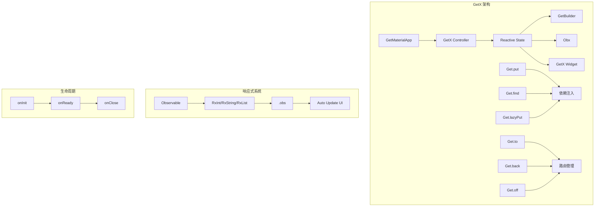

# GetX 状态管理

GetX 是一个轻量级且强大的 Flutter 解决方案，集成了状态管理、依赖注入和路由管理。它提供了简单的API、高性能和最小的样板代码。

## 1. GetX 架构概览



## 2. 基础概念

### 2.1 简单状态管理

```dart
import 'package:get/get.dart';

// 计数器控制器
class CounterController extends GetxController {
  var count = 0.obs; // 响应式变量
  
  void increment() {
    count++; // 自动更新UI
  }
  
  void decrement() {
    count--;
  }
  
  void reset() {
    count.value = 0;
  }
}

// 使用 Obx 自动更新
class CounterPage extends StatelessWidget {
  final CounterController controller = Get.put(CounterController());
  
  @override
  Widget build(BuildContext context) {
    return Scaffold(
      appBar: AppBar(title: const Text('计数器')),
      body: Center(
        child: Obx(() => Text(
          '${controller.count}',
          style: const TextStyle(fontSize: 48),
        )),
      ),
      floatingActionButton: Column(
        mainAxisAlignment: MainAxisAlignment.end,
        children: [
          FloatingActionButton(
            onPressed: controller.increment,
            child: const Icon(Icons.add),
          ),
          const SizedBox(height: 8),
          FloatingActionButton(
            onPressed: controller.decrement,
            child: const Icon(Icons.remove),
          ),
        ],
      ),
    );
  }
}
```

### 2.2 复杂状态管理

```dart
// 待办事项模型
class Todo {
  final String id;
  final String title;
  final bool isCompleted;
  
  Todo({
    required this.id,
    required this.title,
    this.isCompleted = false,
  });
  
  Todo copyWith({
    String? id,
    String? title,
    bool? isCompleted,
  }) {
    return Todo(
      id: id ?? this.id,
      title: title ?? this.title,
      isCompleted: isCompleted ?? this.isCompleted,
    );
  }
}

// 待办事项控制器
class TodoController extends GetxController {
  // 响应式列表
  var todos = <Todo>[].obs;
  var isLoading = false.obs;
  var errorMessage = ''.obs;
  
  // 计算属性
  List<Todo> get completedTodos => todos.where((todo) => todo.isCompleted).toList();
  List<Todo> get pendingTodos => todos.where((todo) => !todo.isCompleted).toList();
  int get totalCount => todos.length;
  int get completedCount => completedTodos.length;
  int get pendingCount => pendingTodos.length;
  
  @override
  void onInit() {
    super.onInit();
    loadTodos();
  }
  
  Future<void> loadTodos() async {
    try {
      isLoading.value = true;
      errorMessage.value = '';
      
      // 模拟API调用
      await Future.delayed(const Duration(seconds: 1));
      
      todos.value = [
        Todo(id: '1', title: '学习 Flutter'),
        Todo(id: '2', title: '使用 GetX', isCompleted: true),
        Todo(id: '3', title: '构建应用'),
      ];
    } catch (error) {
      errorMessage.value = error.toString();
    } finally {
      isLoading.value = false;
    }
  }
  
  void addTodo(String title) {
    if (title.trim().isEmpty) return;
    
    final todo = Todo(
      id: DateTime.now().millisecondsSinceEpoch.toString(),
      title: title.trim(),
    );
    
    todos.add(todo);
  }
  
  void toggleTodo(String id) {
    final index = todos.indexWhere((todo) => todo.id == id);
    if (index != -1) {
      todos[index] = todos[index].copyWith(
        isCompleted: !todos[index].isCompleted,
      );
      todos.refresh(); // 手动刷新
    }
  }
  
  void removeTodo(String id) {
    todos.removeWhere((todo) => todo.id == id);
  }
  
  void clearCompleted() {
    todos.removeWhere((todo) => todo.isCompleted);
  }
}
```

### 2.3 UI 集成

```dart
class TodoPage extends StatelessWidget {
  final TodoController controller = Get.put(TodoController());
  
  @override
  Widget build(BuildContext context) {
    return Scaffold(
      appBar: AppBar(
        title: const Text('待办事项'),
        actions: [
          Obx(() => Chip(
            label: Text('${controller.totalCount}'),
            backgroundColor: Colors.blue,
          )),
        ],
      ),
      body: Obx(() {
        if (controller.isLoading.value) {
          return const Center(child: CircularProgressIndicator());
        }
        
        if (controller.errorMessage.value.isNotEmpty) {
          return Center(
            child: Column(
              mainAxisAlignment: MainAxisAlignment.center,
              children: [
                Text('错误: ${controller.errorMessage.value}'),
                ElevatedButton(
                  onPressed: controller.loadTodos,
                  child: const Text('重试'),
                ),
              ],
            ),
          );
        }
        
        if (controller.todos.isEmpty) {
          return const Center(
            child: Text('暂无待办事项'),
          );
        }
        
        return ListView.builder(
          itemCount: controller.todos.length,
          itemBuilder: (context, index) {
            final todo = controller.todos[index];
            return TodoTile(
              todo: todo,
              onToggle: () => controller.toggleTodo(todo.id),
              onDelete: () => controller.removeTodo(todo.id),
            );
          },
        );
      }),
      floatingActionButton: FloatingActionButton(
        onPressed: () => _showAddTodoDialog(context),
        child: const Icon(Icons.add),
      ),
      bottomNavigationBar: Obx(() => BottomAppBar(
        child: Padding(
          padding: const EdgeInsets.all(16.0),
          child: Row(
            mainAxisAlignment: MainAxisAlignment.spaceAround,
            children: [
              Text('总计: ${controller.totalCount}'),
              Text('已完成: ${controller.completedCount}'),
              Text('待完成: ${controller.pendingCount}'),
            ],
          ),
        ),
      )),
    );
  }
  
  void _showAddTodoDialog(BuildContext context) {
    final textController = TextEditingController();
    
    Get.dialog(
      AlertDialog(
        title: const Text('添加待办事项'),
        content: TextField(
          controller: textController,
          decoration: const InputDecoration(
            hintText: '请输入待办事项',
          ),
          autofocus: true,
        ),
        actions: [
          TextButton(
            onPressed: () => Get.back(),
            child: const Text('取消'),
          ),
          ElevatedButton(
            onPressed: () {
              controller.addTodo(textController.text);
              Get.back();
            },
            child: const Text('添加'),
          ),
        ],
      ),
    );
  }
}

class TodoTile extends StatelessWidget {
  final Todo todo;
  final VoidCallback onToggle;
  final VoidCallback onDelete;
  
  const TodoTile({
    required this.todo,
    required this.onToggle,
    required this.onDelete,
  });
  
  @override
  Widget build(BuildContext context) {
    return ListTile(
      leading: Checkbox(
        value: todo.isCompleted,
        onChanged: (_) => onToggle(),
      ),
      title: Text(
        todo.title,
        style: TextStyle(
          decoration: todo.isCompleted
              ? TextDecoration.lineThrough
              : TextDecoration.none,
        ),
      ),
      trailing: IconButton(
        icon: const Icon(Icons.delete),
        onPressed: onDelete,
      ),
    );
  }
}
```

## 3. 响应式编程

### 3.1 响应式变量类型

```dart
class ReactiveController extends GetxController {
  // 基础类型
  var count = 0.obs;
  var name = ''.obs;
  var isLoading = false.obs;
  var price = 0.0.obs;
  
  // 集合类型
  var items = <String>[].obs;
  var userMap = <String, dynamic>{}.obs;
  var numberSet = <int>{}.obs;
  
  // 自定义对象
  var user = User().obs;
  
  // Rx 类型（另一种写法）
  final RxInt rxCount = 0.obs;
  final RxString rxName = ''.obs;
  final RxBool rxIsLoading = false.obs;
  final RxList<String> rxItems = <String>[].obs;
  
  void updateValues() {
    // 直接赋值
    count.value = 10;
    name.value = 'GetX';
    
    // 操作符重载
    count++;
    count += 5;
    
    // 集合操作
    items.add('新项目');
    items.addAll(['项目1', '项目2']);
    items.removeAt(0);
    
    // 对象更新
    user.update((val) {
      val?.name = '新名称';
      val?.age = 25;
    });
    
    // 手动刷新（通常不需要）
    user.refresh();
  }
}
```

### 3.2 Workers（响应式监听器）

```dart
class WorkerController extends GetxController {
  var count = 0.obs;
  var name = ''.obs;
  var items = <String>[].obs;
  
  @override
  void onInit() {
    super.onInit();
    
    // ever: 每次变化都触发
    ever(count, (value) {
      print('计数变化: $value');
      if (value > 10) {
        Get.snackbar('提示', '计数超过10了！');
      }
    });
    
    // once: 只触发一次
    once(name, (value) {
      print('名称首次设置: $value');
    });
    
    // debounce: 防抖，延迟触发
    debounce(name, (value) {
      print('名称防抖更新: $value');
      // 适合搜索输入
    }, time: const Duration(milliseconds: 500));
    
    // interval: 间隔触发
    interval(count, (value) {
      print('计数间隔更新: $value');
      // 适合频繁更新的数据
    }, time: const Duration(seconds: 1));
    
    // 监听多个变量
    everAll([count, name], (values) {
      print('多个值变化: $values');
    });
  }
  
  void increment() => count++;
  void updateName(String newName) => name.value = newName;
}
```

### 3.3 GetBuilder（非响应式更新）

```dart
class BuilderController extends GetxController {
  int count = 0;
  String message = 'Hello';
  
  void increment() {
    count++;
    update(); // 手动更新UI
  }
  
  void updateMessage(String newMessage) {
    message = newMessage;
    update(['message']); // 只更新特定ID的Widget
  }
  
  void updateAll() {
    count++;
    message = 'Updated';
    update(); // 更新所有监听的Widget
  }
}

class BuilderPage extends StatelessWidget {
  final BuilderController controller = Get.put(BuilderController());
  
  @override
  Widget build(BuildContext context) {
    return Scaffold(
      appBar: AppBar(title: const Text('GetBuilder 示例')),
      body: Column(
        children: [
          // 监听所有更新
          GetBuilder<BuilderController>(
            builder: (controller) => Text('计数: ${controller.count}'),
          ),
          
          // 只监听特定ID的更新
          GetBuilder<BuilderController>(
            id: 'message',
            builder: (controller) => Text('消息: ${controller.message}'),
          ),
          
          // 条件更新
          GetBuilder<BuilderController>(
            filter: (controller) => controller.count % 2 == 0,
            builder: (controller) => Text('偶数计数: ${controller.count}'),
          ),
        ],
      ),
      floatingActionButton: Column(
        mainAxisAlignment: MainAxisAlignment.end,
        children: [
          FloatingActionButton(
            onPressed: controller.increment,
            child: const Icon(Icons.add),
          ),
          const SizedBox(height: 8),
          FloatingActionButton(
            onPressed: () => controller.updateMessage('新消息'),
            child: const Icon(Icons.message),
          ),
        ],
      ),
    );
  }
}
```

## 4. 依赖注入

### 4.1 基础依赖注入

```dart
// 服务类
class ApiService {
  Future<List<String>> fetchData() async {
    await Future.delayed(const Duration(seconds: 1));
    return ['数据1', '数据2', '数据3'];
  }
}

class DatabaseService {
  void saveData(String data) {
    print('保存数据: $data');
  }
}

// 控制器
class DataController extends GetxController {
  final ApiService _apiService = Get.find();
  final DatabaseService _dbService = Get.find();
  
  var data = <String>[].obs;
  var isLoading = false.obs;
  
  @override
  void onInit() {
    super.onInit();
    loadData();
  }
  
  Future<void> loadData() async {
    isLoading.value = true;
    try {
      data.value = await _apiService.fetchData();
    } finally {
      isLoading.value = false;
    }
  }
  
  void saveItem(String item) {
    _dbService.saveData(item);
    data.add(item);
  }
}

// 在 main.dart 中注册依赖
void main() {
  // 立即注册
  Get.put(ApiService());
  Get.put(DatabaseService());
  
  // 懒加载注册
  Get.lazyPut(() => DataController());
  
  runApp(MyApp());
}

// 使用
class DataPage extends StatelessWidget {
  @override
  Widget build(BuildContext context) {
    // 获取控制器（如果不存在会自动创建）
    final DataController controller = Get.find();
    
    return Scaffold(
      appBar: AppBar(title: const Text('数据页面')),
      body: Obx(() {
        if (controller.isLoading.value) {
          return const Center(child: CircularProgressIndicator());
        }
        
        return ListView.builder(
          itemCount: controller.data.length,
          itemBuilder: (context, index) {
            return ListTile(
              title: Text(controller.data[index]),
            );
          },
        );
      }),
    );
  }
}
```

### 4.2 高级依赖注入

```dart
// 抽象接口
abstract class IUserRepository {
  Future<User> getUser(String id);
  Future<void> saveUser(User user);
}

// 实现类
class ApiUserRepository implements IUserRepository {
  @override
  Future<User> getUser(String id) async {
    // API 实现
    return User(id: id, name: 'API User');
  }
  
  @override
  Future<void> saveUser(User user) async {
    // API 保存
  }
}

class LocalUserRepository implements IUserRepository {
  @override
  Future<User> getUser(String id) async {
    // 本地存储实现
    return User(id: id, name: 'Local User');
  }
  
  @override
  Future<void> saveUser(User user) async {
    // 本地保存
  }
}

// 依赖注入配置
class DependencyInjection {
  static void init() {
    // 根据环境选择实现
    if (kDebugMode) {
      Get.put<IUserRepository>(LocalUserRepository());
    } else {
      Get.put<IUserRepository>(ApiUserRepository());
    }
    
    // 单例模式
    Get.put(UserController(), permanent: true);
    
    // 懒加载
    Get.lazyPut(() => SettingsController());
    
    // 工厂模式
    Get.create(() => TempController());
  }
}

// 使用接口的控制器
class UserController extends GetxController {
  final IUserRepository _repository = Get.find();
  
  var user = Rxn<User>();
  
  Future<void> loadUser(String id) async {
    user.value = await _repository.getUser(id);
  }
}
```

### 4.3 生命周期管理

```dart
class LifecycleController extends GetxController {
  var data = ''.obs;
  Timer? _timer;
  
  @override
  void onInit() {
    super.onInit();
    print('控制器初始化');
    
    // 初始化数据
    data.value = '初始数据';
    
    // 启动定时器
    _timer = Timer.periodic(const Duration(seconds: 1), (timer) {
      data.value = '更新时间: ${DateTime.now()}';
    });
  }
  
  @override
  void onReady() {
    super.onReady();
    print('控制器准备就绪');
    
    // 在这里执行需要等待UI完成的操作
    loadInitialData();
  }
  
  @override
  void onClose() {
    print('控制器关闭');
    
    // 清理资源
    _timer?.cancel();
    
    super.onClose();
  }
  
  Future<void> loadInitialData() async {
    // 加载初始数据
  }
}

// 手动管理生命周期
class ManualLifecyclePage extends StatefulWidget {
  @override
  _ManualLifecyclePageState createState() => _ManualLifecyclePageState();
}

class _ManualLifecyclePageState extends State<ManualLifecyclePage> {
  late LifecycleController controller;
  
  @override
  void initState() {
    super.initState();
    controller = Get.put(LifecycleController());
  }
  
  @override
  void dispose() {
    Get.delete<LifecycleController>();
    super.dispose();
  }
  
  @override
  Widget build(BuildContext context) {
    return Scaffold(
      appBar: AppBar(title: const Text('生命周期管理')),
      body: Obx(() => Center(
        child: Text(controller.data.value),
      )),
    );
  }
}
```

## 5. 路由管理

### 5.1 基础路由

```dart
// 在 main.dart 中配置
class MyApp extends StatelessWidget {
  @override
  Widget build(BuildContext context) {
    return GetMaterialApp(
      title: 'GetX 路由示例',
      initialRoute: '/',
      getPages: [
        GetPage(name: '/', page: () => HomePage()),
        GetPage(name: '/second', page: () => SecondPage()),
        GetPage(name: '/third', page: () => ThirdPage()),
        GetPage(
          name: '/user/:id',
          page: () => UserPage(),
          binding: UserBinding(),
        ),
      ],
    );
  }
}

// 路由导航
class HomePage extends StatelessWidget {
  @override
  Widget build(BuildContext context) {
    return Scaffold(
      appBar: AppBar(title: const Text('首页')),
      body: Column(
        children: [
          ElevatedButton(
            onPressed: () => Get.to(() => SecondPage()),
            child: const Text('跳转到第二页'),
          ),
          ElevatedButton(
            onPressed: () => Get.toNamed('/second'),
            child: const Text('命名路由跳转'),
          ),
          ElevatedButton(
            onPressed: () => Get.off(() => ThirdPage()),
            child: const Text('替换当前页面'),
          ),
          ElevatedButton(
            onPressed: () => Get.offAll(() => ThirdPage()),
            child: const Text('清空栈并跳转'),
          ),
          ElevatedButton(
            onPressed: () => Get.toNamed('/user/123'),
            child: const Text('带参数跳转'),
          ),
        ],
      ),
    );
  }
}

// 接收参数
class UserPage extends StatelessWidget {
  @override
  Widget build(BuildContext context) {
    final String userId = Get.parameters['id'] ?? '';
    final Map<String, dynamic> arguments = Get.arguments ?? {};
    
    return Scaffold(
      appBar: AppBar(title: Text('用户页面 - $userId')),
      body: Column(
        children: [
          Text('用户ID: $userId'),
          Text('参数: $arguments'),
          ElevatedButton(
            onPressed: () => Get.back(result: '返回数据'),
            child: const Text('返回'),
          ),
        ],
      ),
    );
  }
}
```

### 5.2 路由绑定

```dart
// 绑定类
class UserBinding extends Bindings {
  @override
  void dependencies() {
    Get.lazyPut(() => UserController());
    Get.lazyPut(() => UserRepository());
  }
}

// 全局绑定
class GlobalBinding extends Bindings {
  @override
  void dependencies() {
    Get.put(GlobalController(), permanent: true);
    Get.put(ThemeController(), permanent: true);
  }
}

// 在 GetMaterialApp 中使用
GetMaterialApp(
  initialBinding: GlobalBinding(),
  getPages: [
    GetPage(
      name: '/user',
      page: () => UserPage(),
      binding: UserBinding(),
    ),
  ],
)
```

## 6. 中间件和拦截器

### 6.1 路由中间件

```dart
class AuthMiddleware extends GetMiddleware {
  @override
  RouteSettings? redirect(String? route) {
    final authController = Get.find<AuthController>();
    
    if (!authController.isLoggedIn.value) {
      return const RouteSettings(name: '/login');
    }
    
    return null;
  }
  
  @override
  GetPage? onPageCalled(GetPage? page) {
    print('页面调用: ${page?.name}');
    return super.onPageCalled(page);
  }
  
  @override
  List<Bindings>? onBindingsStart(List<Bindings>? bindings) {
    print('绑定开始');
    return super.onBindingsStart(bindings);
  }
  
  @override
  GetPageBuilder? onPageBuildStart(GetPageBuilder? page) {
    print('页面构建开始');
    return super.onPageBuildStart(page);
  }
}

// 使用中间件
GetPage(
  name: '/protected',
  page: () => ProtectedPage(),
  middlewares: [AuthMiddleware()],
)
```

### 6.2 HTTP 拦截器

```dart
class ApiInterceptor extends GetConnect {
  @override
  void onInit() {
    super.onInit();
    
    // 基础配置
    httpClient.baseUrl = 'https://api.example.com';
    httpClient.timeout = const Duration(seconds: 30);
    
    // 请求拦截器
    httpClient.addRequestModifier<dynamic>((request) {
      request.headers['Authorization'] = 'Bearer ${getToken()}';
      request.headers['Content-Type'] = 'application/json';
      print('请求: ${request.method} ${request.url}');
      return request;
    });
    
    // 响应拦截器
    httpClient.addResponseModifier((request, response) {
      print('响应: ${response.statusCode} ${response.body}');
      
      if (response.statusCode == 401) {
        Get.offAllNamed('/login');
      }
      
      return response;
    });
    
    // 认证拦截器
    httpClient.addAuthenticator<dynamic>((request) async {
      final newToken = await refreshToken();
      request.headers['Authorization'] = 'Bearer $newToken';
      return request;
    });
  }
  
  String getToken() {
    // 获取存储的token
    return Get.find<AuthController>().token.value;
  }
  
  Future<String> refreshToken() async {
    // 刷新token逻辑
    return 'new_token';
  }
}
```

## 7. 性能优化

### 7.1 内存管理

```dart
// 自动释放控制器
class AutoDisposeController extends GetxController {
  var data = ''.obs;
  
  @override
  void onClose() {
    print('控制器自动释放');
    super.onClose();
  }
}

// 永久控制器
class PermanentController extends GetxController {
  var globalData = ''.obs;
}

// 注册方式
void registerControllers() {
  // 自动释放（页面销毁时释放）
  Get.put(AutoDisposeController());
  
  // 永久保存（应用生命周期内保持）
  Get.put(PermanentController(), permanent: true);
  
  // 懒加载（首次使用时创建）
  Get.lazyPut(() => LazyController());
  
  // 工厂模式（每次获取都创建新实例）
  Get.create(() => FactoryController());
}

// 手动释放
void manualDispose() {
  // 删除特定控制器
  Get.delete<AutoDisposeController>();
  
  // 删除所有非永久控制器
  Get.deleteAll();
  
  // 强制删除（包括永久控制器）
  Get.deleteAll(force: true);
}
```

### 7.2 性能监控

```dart
class PerformanceController extends GetxController {
  var updateCount = 0.obs;
  var lastUpdateTime = DateTime.now().obs;
  
  @override
  void onInit() {
    super.onInit();
    
    // 监控更新频率
    ever(updateCount, (count) {
      final now = DateTime.now();
      final diff = now.difference(lastUpdateTime.value).inMilliseconds;
      
      if (diff < 16) { // 60 FPS
        print('警告: 更新过于频繁 ${diff}ms');
      }
      
      lastUpdateTime.value = now;
    });
  }
  
  void performanceUpdate() {
    updateCount++;
  }
}

// 使用 GetBuilder 减少重建
class OptimizedWidget extends StatelessWidget {
  @override
  Widget build(BuildContext context) {
    return GetBuilder<PerformanceController>(
      id: 'specific_widget',
      builder: (controller) {
        return Text('优化的Widget: ${controller.updateCount}');
      },
    );
  }
}
```

## 8. 测试

### 8.1 单元测试

```dart
import 'package:flutter_test/flutter_test.dart';
import 'package:get/get.dart';

void main() {
  group('CounterController Tests', () {
    late CounterController controller;
    
    setUp(() {
      controller = CounterController();
    });
    
    tearDown(() {
      Get.reset();
    });
    
    test('初始计数为0', () {
      expect(controller.count.value, 0);
    });
    
    test('增加计数', () {
      controller.increment();
      expect(controller.count.value, 1);
    });
    
    test('减少计数', () {
      controller.count.value = 5;
      controller.decrement();
      expect(controller.count.value, 4);
    });
    
    test('重置计数', () {
      controller.count.value = 10;
      controller.reset();
      expect(controller.count.value, 0);
    });
  });
  
  group('TodoController Tests', () {
    late TodoController controller;
    
    setUp(() {
      controller = TodoController();
    });
    
    tearDown(() {
      Get.reset();
    });
    
    test('添加待办事项', () {
      controller.addTodo('测试任务');
      
      expect(controller.todos.length, 1);
      expect(controller.todos.first.title, '测试任务');
      expect(controller.todos.first.isCompleted, false);
    });
    
    test('切换待办事项状态', () {
      controller.addTodo('测试任务');
      final todoId = controller.todos.first.id;
      
      controller.toggleTodo(todoId);
      
      expect(controller.todos.first.isCompleted, true);
    });
    
    test('删除待办事项', () {
      controller.addTodo('测试任务');
      final todoId = controller.todos.first.id;
      
      controller.removeTodo(todoId);
      
      expect(controller.todos.length, 0);
    });
  });
}
```

### 8.2 Widget 测试

```dart
import 'package:flutter/material.dart';
import 'package:flutter_test/flutter_test.dart';
import 'package:get/get.dart';

void main() {
  group('CounterPage Widget Tests', () {
    testWidgets('显示初始计数', (WidgetTester tester) async {
      Get.put(CounterController());
      
      await tester.pumpWidget(
        GetMaterialApp(
          home: CounterPage(),
        ),
      );
      
      expect(find.text('0'), findsOneWidget);
      
      Get.reset();
    });
    
    testWidgets('点击增加按钮', (WidgetTester tester) async {
      Get.put(CounterController());
      
      await tester.pumpWidget(
        GetMaterialApp(
          home: CounterPage(),
        ),
      );
      
      await tester.tap(find.byIcon(Icons.add));
      await tester.pump();
      
      expect(find.text('1'), findsOneWidget);
      
      Get.reset();
    });
  });
}
```

### 8.3 集成测试

```dart
import 'package:flutter/material.dart';
import 'package:flutter_test/flutter_test.dart';
import 'package:integration_test/integration_test.dart';
import 'package:get/get.dart';

void main() {
  IntegrationTestWidgetsFlutterBinding.ensureInitialized();
  
  group('App Integration Tests', () {
    testWidgets('完整的待办事项流程', (WidgetTester tester) async {
      await tester.pumpWidget(MyApp());
      
      // 等待应用加载
      await tester.pumpAndSettle();
      
      // 点击添加按钮
      await tester.tap(find.byIcon(Icons.add));
      await tester.pumpAndSettle();
      
      // 输入待办事项
      await tester.enterText(find.byType(TextField), '集成测试任务');
      await tester.tap(find.text('添加'));
      await tester.pumpAndSettle();
      
      // 验证任务已添加
      expect(find.text('集成测试任务'), findsOneWidget);
      
      // 切换任务状态
      await tester.tap(find.byType(Checkbox));
      await tester.pumpAndSettle();
      
      // 验证任务已完成
      final checkbox = tester.widget<Checkbox>(find.byType(Checkbox));
      expect(checkbox.value, true);
    });
  });
}
```

## 9. 最佳实践

### 9.1 项目结构

```
lib/
├── app/
│   ├── bindings/
│   │   ├── global_binding.dart
│   │   └── home_binding.dart
│   ├── controllers/
│   │   ├── auth_controller.dart
│   │   └── home_controller.dart
│   ├── middleware/
│   │   └── auth_middleware.dart
│   ├── routes/
│   │   ├── app_pages.dart
│   │   └── app_routes.dart
│   └── services/
│       ├── api_service.dart
│       └── storage_service.dart
├── data/
│   ├── models/
│   ├── providers/
│   └── repositories/
├── presentation/
│   ├── pages/
│   └── widgets/
└── main.dart
```

### 9.2 代码规范

```dart
// 控制器命名规范
class UserController extends GetxController {} // ✓
class UserCtrl extends GetxController {}       // ✗

// 响应式变量命名
var isLoading = false.obs;  // ✓
var loading = false.obs;    // ✗

// 方法命名
void loadUserData() {}      // ✓
void getUserData() {}       // ✗

// 依赖注入最佳实践
class UserController extends GetxController {
  // 使用接口而不是具体实现
  final IUserRepository _repository = Get.find();
  
  // 私有变量，公开getter
  final _user = Rxn<User>();
  User? get user => _user.value;
  
  // 清晰的方法名
  Future<void> loadCurrentUser() async {
    try {
      _user.value = await _repository.getCurrentUser();
    } catch (error) {
      _handleError(error);
    }
  }
  
  void _handleError(Object error) {
    // 统一错误处理
  }
}
```

### 9.3 性能优化建议

```dart
// 1. 合理使用 Obx 和 GetBuilder
class OptimizedPage extends StatelessWidget {
  @override
  Widget build(BuildContext context) {
    return Scaffold(
      appBar: AppBar(title: const Text('优化页面')),
      body: Column(
        children: [
          // 频繁更新的部分使用 Obx
          Obx(() => Text('计数: ${Get.find<CounterController>().count}')),
          
          // 不频繁更新的部分使用 GetBuilder
          GetBuilder<UserController>(
            builder: (controller) => Text('用户: ${controller.user?.name}'),
          ),
          
          // 静态内容不包装
          const Text('静态文本'),
        ],
      ),
    );
  }
}

// 2. 避免在 build 方法中创建控制器
class BadPage extends StatelessWidget {
  @override
  Widget build(BuildContext context) {
    final controller = Get.put(BadController()); // ✗ 每次build都创建
    return Container();
  }
}

class GoodPage extends StatelessWidget {
  final controller = Get.put(GoodController()); // ✓ 只创建一次
  
  @override
  Widget build(BuildContext context) {
    return Container();
  }
}

// 3. 合理使用 Workers
class WorkerController extends GetxController {
  var searchText = ''.obs;
  
  @override
  void onInit() {
    super.onInit();
    
    // 使用 debounce 避免频繁搜索
    debounce(searchText, (text) {
      if (text.isNotEmpty) {
        performSearch(text);
      }
    }, time: const Duration(milliseconds: 500));
  }
  
  void performSearch(String text) {
    // 搜索逻辑
  }
}
```

## 10. 总结

GetX 提供了简洁而强大的状态管理解决方案：

### 核心优势

1. **简单易用**：最少的样板代码
2. **高性能**：智能的重建机制
3. **功能丰富**：状态管理、依赖注入、路由一体化
4. **响应式**：强大的响应式编程支持
5. **轻量级**：小的包体积

### 适用场景

| 项目类型 | 推荐程度 | 原因 |
|---------|----------|------|
| 小型项目 | ⭐⭐⭐⭐⭐ | 快速开发，代码简洁 |
| 中型项目 | ⭐⭐⭐⭐ | 功能完整，易于维护 |
| 大型项目 | ⭐⭐⭐ | 需要更严格的架构约束 |
| 团队开发 | ⭐⭐⭐ | 学习成本低，但需要规范 |

### 最佳实践要点

1. **合理使用响应式变量**
2. **正确的依赖注入**
3. **适当的生命周期管理**
4. **性能优化意识**
5. **代码规范和结构**
6. **充分的测试覆盖**

## 相关资源

- [GetX 官方文档](https://github.com/jonataslaw/getx)
- [GetX 中文文档](https://github.com/jonataslaw/getx/blob/master/README.zh-cn.md)
- [GetX 示例项目](https://github.com/jonataslaw/getx/tree/master/example)
- [GetX CLI 工具](https://github.com/jonataslaw/get_cli)
- [GetX 最佳实践](https://github.com/kauemurakami/getx_pattern)
- [GetX vs 其他状态管理对比](https://docs.flutter.dev/development/data-and-backend/state-mgmt/options)