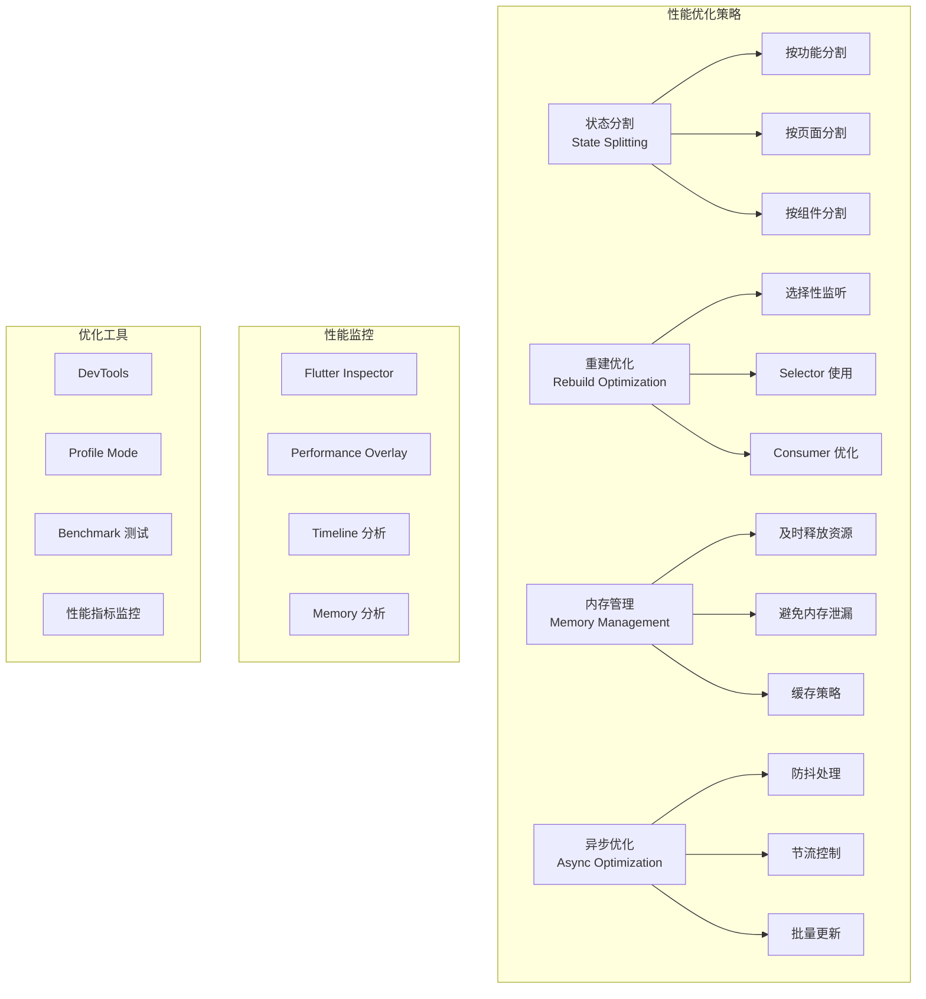

# 状态管理性能优化

本文档详细介绍如何优化 Flutter 应用中不同状态管理方案的性能，包括性能分析、优化策略和最佳实践。

## 1. 性能优化概览



## 2. Provider 性能优化

### 2.1 状态分割优化

```dart
// 不好的做法：单一大状态
class AppState extends ChangeNotifier {
  // 用户相关状态
  User? user;
  bool isUserLoading = false;
  
  // 待办事项相关状态
  List<Todo> todos = [];
  bool isTodosLoading = false;
  
  // 设置相关状态
  AppSettings settings = AppSettings();
  
  // 所有状态变化都会通知所有监听者
  void updateUser(User newUser) {
    user = newUser;
    notifyListeners(); // 所有 Widget 都会重建
  }
  
  void updateTodos(List<Todo> newTodos) {
    todos = newTodos;
    notifyListeners(); // 所有 Widget 都会重建
  }
}

// 好的做法：状态分割
class UserProvider extends ChangeNotifier {
  User? _user;
  bool _isLoading = false;
  
  User? get user => _user;
  bool get isLoading => _isLoading;
  
  Future<void> loadUser() async {
    _isLoading = true;
    notifyListeners();
    
    try {
      _user = await userRepository.getCurrentUser();
    } finally {
      _isLoading = false;
      notifyListeners();
    }
  }
}

class TodoProvider extends ChangeNotifier {
  List<Todo> _todos = [];
  bool _isLoading = false;
  
  List<Todo> get todos => List.unmodifiable(_todos);
  bool get isLoading => _isLoading;
  
  Future<void> loadTodos() async {
    _isLoading = true;
    notifyListeners();
    
    try {
      _todos = await todoRepository.getTodos();
    } finally {
      _isLoading = false;
      notifyListeners();
    }
  }
}

class SettingsProvider extends ChangeNotifier {
  AppSettings _settings = AppSettings();
  
  AppSettings get settings => _settings;
  
  void updateTheme(ThemeMode theme) {
    _settings = _settings.copyWith(theme: theme);
    notifyListeners();
  }
}
```

### 2.2 选择性监听优化

```dart
// 使用 Selector 进行选择性监听
class UserProfileWidget extends StatelessWidget {
  @override
  Widget build(BuildContext context) {
    return Column(
      children: [
        // 只监听用户名变化
        Selector<UserProvider, String?>(
          selector: (context, provider) => provider.user?.name,
          builder: (context, userName, child) {
            return Text(userName ?? '未登录');
          },
        ),
        
        // 只监听头像变化
        Selector<UserProvider, String?>(
          selector: (context, provider) => provider.user?.avatar,
          builder: (context, avatar, child) {
            return CircleAvatar(
              backgroundImage: avatar != null 
                  ? NetworkImage(avatar) 
                  : null,
            );
          },
        ),
        
        // 只监听加载状态
        Selector<UserProvider, bool>(
          selector: (context, provider) => provider.isLoading,
          builder: (context, isLoading, child) {
            return isLoading 
                ? const CircularProgressIndicator()
                : const SizedBox.shrink();
          },
        ),
      ],
    );
  }
}

// 使用 Consumer 的 child 参数优化
class TodoListWidget extends StatelessWidget {
  @override
  Widget build(BuildContext context) {
    return Consumer<TodoProvider>(
      // child 不会重建
      child: const Padding(
        padding: EdgeInsets.all(16.0),
        child: Text(
          '我的待办事项',
          style: TextStyle(fontSize: 24, fontWeight: FontWeight.bold),
        ),
      ),
      builder: (context, provider, child) {
        return Column(
          children: [
            child!, // 静态内容
            Expanded(
              child: ListView.builder(
                itemCount: provider.todos.length,
                itemBuilder: (context, index) {
                  return TodoItem(todo: provider.todos[index]);
                },
              ),
            ),
          ],
        );
      },
    );
  }
}
```

### 2.3 Provider 缓存优化

```dart
// 使用 ProxyProvider 进行依赖注入和缓存
class FilteredTodoProvider extends ChangeNotifier {
  final TodoProvider _todoProvider;
  final SettingsProvider _settingsProvider;
  
  List<Todo>? _cachedFilteredTodos;
  TodoFilter? _lastFilter;
  List<Todo>? _lastTodos;
  
  FilteredTodoProvider(this._todoProvider, this._settingsProvider) {
    _todoProvider.addListener(_onTodosChanged);
    _settingsProvider.addListener(_onSettingsChanged);
  }
  
  List<Todo> get filteredTodos {
    final currentFilter = _settingsProvider.settings.todoFilter;
    final currentTodos = _todoProvider.todos;
    
    // 缓存检查
    if (_cachedFilteredTodos != null &&
        _lastFilter == currentFilter &&
        _lastTodos == currentTodos) {
      return _cachedFilteredTodos!;
    }
    
    // 重新计算
    _cachedFilteredTodos = _filterTodos(currentTodos, currentFilter);
    _lastFilter = currentFilter;
    _lastTodos = currentTodos;
    
    return _cachedFilteredTodos!;
  }
  
  List<Todo> _filterTodos(List<Todo> todos, TodoFilter filter) {
    switch (filter) {
      case TodoFilter.all:
        return todos;
      case TodoFilter.completed:
        return todos.where((todo) => todo.isCompleted).toList();
      case TodoFilter.pending:
        return todos.where((todo) => !todo.isCompleted).toList();
    }
  }
  
  void _onTodosChanged() {
    _invalidateCache();
    notifyListeners();
  }
  
  void _onSettingsChanged() {
    _invalidateCache();
    notifyListeners();
  }
  
  void _invalidateCache() {
    _cachedFilteredTodos = null;
    _lastFilter = null;
    _lastTodos = null;
  }
  
  @override
  void dispose() {
    _todoProvider.removeListener(_onTodosChanged);
    _settingsProvider.removeListener(_onSettingsChanged);
    super.dispose();
  }
}

// 在 main.dart 中设置
class MyApp extends StatelessWidget {
  @override
  Widget build(BuildContext context) {
    return MultiProvider(
      providers: [
        ChangeNotifierProvider(create: (_) => UserProvider()),
        ChangeNotifierProvider(create: (_) => TodoProvider()),
        ChangeNotifierProvider(create: (_) => SettingsProvider()),
        
        // 使用 ProxyProvider 进行依赖注入
        ChangeNotifierProxyProvider2<TodoProvider, SettingsProvider, FilteredTodoProvider>(
          create: (context) => FilteredTodoProvider(
            context.read<TodoProvider>(),
            context.read<SettingsProvider>(),
          ),
          update: (context, todoProvider, settingsProvider, previous) {
            return previous ?? FilteredTodoProvider(todoProvider, settingsProvider);
          },
        ),
      ],
      child: MaterialApp(
        home: HomePage(),
      ),
    );
  }
}
```

## 3. Riverpod 性能优化

### 3.1 Provider 优化

```dart
// 使用 family 进行参数化缓存
final todoProvider = FutureProvider.family<Todo, String>((ref, id) async {
  // 每个 ID 都会被单独缓存
  return await todoRepository.getTodo(id);
});

// 使用 autoDispose 自动清理
final userSearchProvider = FutureProvider.family.autoDispose<List<User>, String>(
  (ref, query) async {
    // 当没有监听者时自动清理
    if (query.isEmpty) return [];
    
    return await userRepository.searchUsers(query);
  },
);

// 使用 keepAlive 保持缓存
final expensiveComputationProvider = FutureProvider.autoDispose<String>((ref) async {
  // 保持缓存 5 分钟
  ref.keepAlive();
  
  Timer(const Duration(minutes: 5), () {
    ref.invalidateSelf();
  });
  
  return await performExpensiveComputation();
});

// 选择性监听
final userNameProvider = Provider<String?>((ref) {
  final user = ref.watch(userProvider);
  return user.when(
    data: (user) => user?.name,
    loading: () => null,
    error: (_, __) => null,
  );
});

class UserNameWidget extends ConsumerWidget {
  @override
  Widget build(BuildContext context, WidgetRef ref) {
    // 只监听用户名变化
    final userName = ref.watch(userNameProvider);
    
    return Text(userName ?? '加载中...');
  }
}
```

### 3.2 状态组合优化

```dart
// 使用 combine 组合多个 Provider
final todoStatsProvider = Provider<TodoStats>((ref) {
  final todos = ref.watch(todosProvider);
  final filter = ref.watch(todoFilterProvider);
  
  return todos.when(
    data: (todoList) {
      final filteredTodos = _filterTodos(todoList, filter);
      return TodoStats(
        total: todoList.length,
        completed: todoList.where((t) => t.isCompleted).length,
        pending: todoList.where((t) => !t.isCompleted).length,
        filtered: filteredTodos.length,
      );
    },
    loading: () => const TodoStats.loading(),
    error: (error, stack) => TodoStats.error(error),
  );
});

// 使用 select 进行精确监听
class TodoCountWidget extends ConsumerWidget {
  @override
  Widget build(BuildContext context, WidgetRef ref) {
    // 只监听总数变化
    final totalCount = ref.watch(
      todoStatsProvider.select((stats) => stats.total),
    );
    
    return Text('总计: $totalCount');
  }
}

// 使用 listen 进行副作用处理
class TodoPage extends ConsumerWidget {
  @override
  Widget build(BuildContext context, WidgetRef ref) {
    // 监听错误状态并显示 SnackBar
    ref.listen<AsyncValue<List<Todo>>>(
      todosProvider,
      (previous, next) {
        next.whenOrNull(
          error: (error, stack) {
            ScaffoldMessenger.of(context).showSnackBar(
              SnackBar(content: Text('错误: $error')),
            );
          },
        );
      },
    );
    
    return Scaffold(
      body: Consumer(
        builder: (context, ref, child) {
          final todosAsync = ref.watch(todosProvider);
          
          return todosAsync.when(
            data: (todos) => TodoList(todos: todos),
            loading: () => const CircularProgressIndicator(),
            error: (error, stack) => ErrorWidget(error),
          );
        },
      ),
    );
  }
}
```

### 3.3 异步状态优化

```dart
// 防抖搜索
final searchQueryProvider = StateProvider<String>((ref) => '');

final debouncedSearchProvider = FutureProvider<List<User>>((ref) async {
  final query = ref.watch(searchQueryProvider);
  
  // 防抖延迟
  await Future.delayed(const Duration(milliseconds: 500));
  
  // 检查查询是否仍然有效
  if (ref.read(searchQueryProvider) != query) {
    throw const CancellationException();
  }
  
  if (query.isEmpty) return [];
  
  return await userRepository.searchUsers(query);
});

// 分页加载优化
class PaginatedTodosNotifier extends StateNotifier<AsyncValue<List<Todo>>> {
  PaginatedTodosNotifier(this._repository) : super(const AsyncValue.loading()) {
    loadFirstPage();
  }
  
  final TodoRepository _repository;
  int _currentPage = 0;
  bool _hasMore = true;
  
  Future<void> loadFirstPage() async {
    state = const AsyncValue.loading();
    
    try {
      final todos = await _repository.getTodos(page: 0);
      _currentPage = 0;
      _hasMore = todos.length >= 20; // 假设每页 20 条
      state = AsyncValue.data(todos);
    } catch (error, stack) {
      state = AsyncValue.error(error, stack);
    }
  }
  
  Future<void> loadNextPage() async {
    if (!_hasMore || state.isLoading) return;
    
    final currentTodos = state.value ?? [];
    
    try {
      final newTodos = await _repository.getTodos(page: _currentPage + 1);
      
      if (newTodos.isEmpty) {
        _hasMore = false;
      } else {
        _currentPage++;
        state = AsyncValue.data([...currentTodos, ...newTodos]);
      }
    } catch (error, stack) {
      // 保持当前数据，只显示错误
      state = AsyncValue.error(error, stack);
    }
  }
  
  bool get hasMore => _hasMore;
}

final paginatedTodosProvider = 
    StateNotifierProvider<PaginatedTodosNotifier, AsyncValue<List<Todo>>>((ref) {
  return PaginatedTodosNotifier(ref.read(todoRepositoryProvider));
});
```

## 4. Bloc 性能优化

### 4.1 事件处理优化

```dart
// 使用 transformer 进行事件处理优化
class SearchBloc extends Bloc<SearchEvent, SearchState> {
  SearchBloc() : super(const SearchState.initial()) {
    on<SearchQueryChanged>(
      _onSearchQueryChanged,
      // 防抖处理
      transformer: debounce(const Duration(milliseconds: 300)),
    );
    
    on<SearchResultsRequested>(
      _onSearchResultsRequested,
      // 切换到最新事件
      transformer: switchMap(),
    );
  }
  
  Future<void> _onSearchQueryChanged(
    SearchQueryChanged event,
    Emitter<SearchState> emit,
  ) async {
    if (event.query.isEmpty) {
      emit(const SearchState.initial());
      return;
    }
    
    emit(SearchState.loading(query: event.query));
    add(SearchResultsRequested(event.query));
  }
  
  Future<void> _onSearchResultsRequested(
    SearchResultsRequested event,
    Emitter<SearchState> emit,
  ) async {
    try {
      final results = await searchRepository.search(event.query);
      emit(SearchState.success(query: event.query, results: results));
    } catch (error) {
      emit(SearchState.error(query: event.query, error: error));
    }
  }
}

// 自定义 transformer
EventTransformer<T> debounce<T>(Duration duration) {
  return (events, mapper) => events.debounceTime(duration).switchMap(mapper);
}

EventTransformer<T> switchMap<T>() {
  return (events, mapper) => events.switchMap(mapper);
}

EventTransformer<T> throttle<T>(Duration duration) {
  return (events, mapper) => events.throttleTime(duration).asyncExpand(mapper);
}
```

### 4.2 状态优化

```dart
// 使用 Equatable 优化状态比较
abstract class TodoState extends Equatable {
  const TodoState();
  
  @override
  List<Object?> get props => [];
}

class TodoInitial extends TodoState {
  const TodoInitial();
}

class TodoLoading extends TodoState {
  const TodoLoading();
}

class TodoLoaded extends TodoState {
  final List<Todo> todos;
  final TodoFilter filter;
  
  const TodoLoaded({
    required this.todos,
    this.filter = TodoFilter.all,
  });
  
  // 计算属性缓存
  List<Todo>? _filteredTodos;
  TodoFilter? _lastFilter;
  
  List<Todo> get filteredTodos {
    if (_filteredTodos == null || _lastFilter != filter) {
      _filteredTodos = _filterTodos(todos, filter);
      _lastFilter = filter;
    }
    return _filteredTodos!;
  }
  
  List<Todo> _filterTodos(List<Todo> todos, TodoFilter filter) {
    switch (filter) {
      case TodoFilter.all:
        return todos;
      case TodoFilter.completed:
        return todos.where((todo) => todo.isCompleted).toList();
      case TodoFilter.pending:
        return todos.where((todo) => !todo.isCompleted).toList();
    }
  }
  
  TodoLoaded copyWith({
    List<Todo>? todos,
    TodoFilter? filter,
  }) {
    return TodoLoaded(
      todos: todos ?? this.todos,
      filter: filter ?? this.filter,
    );
  }
  
  @override
  List<Object?> get props => [todos, filter];
}

class TodoError extends TodoState {
  final String message;
  
  const TodoError(this.message);
  
  @override
  List<Object?> get props => [message];
}
```

### 4.3 UI 优化

```dart
// 使用 BlocSelector 进行选择性监听
class TodoStatsWidget extends StatelessWidget {
  @override
  Widget build(BuildContext context) {
    return Row(
      children: [
        // 只监听总数
        BlocSelector<TodoBloc, TodoState, int>(
          selector: (state) {
            if (state is TodoLoaded) {
              return state.todos.length;
            }
            return 0;
          },
          builder: (context, totalCount) {
            return Text('总计: $totalCount');
          },
        ),
        
        const SizedBox(width: 16),
        
        // 只监听已完成数量
        BlocSelector<TodoBloc, TodoState, int>(
          selector: (state) {
            if (state is TodoLoaded) {
              return state.todos.where((t) => t.isCompleted).length;
            }
            return 0;
          },
          builder: (context, completedCount) {
            return Text('已完成: $completedCount');
          },
        ),
      ],
    );
  }
}

// 使用 BlocConsumer 处理副作用
class TodoPage extends StatelessWidget {
  @override
  Widget build(BuildContext context) {
    return Scaffold(
      body: BlocConsumer<TodoBloc, TodoState>(
        // 只在错误时执行副作用
        listenWhen: (previous, current) => current is TodoError,
        listener: (context, state) {
          if (state is TodoError) {
            ScaffoldMessenger.of(context).showSnackBar(
              SnackBar(content: Text(state.message)),
            );
          }
        },
        // 只在数据变化时重建
        buildWhen: (previous, current) => 
            current is TodoLoading || current is TodoLoaded,
        builder: (context, state) {
          if (state is TodoLoading) {
            return const Center(child: CircularProgressIndicator());
          }
          
          if (state is TodoLoaded) {
            return TodoListView(todos: state.filteredTodos);
          }
          
          return const SizedBox.shrink();
        },
      ),
    );
  }
}
```

## 5. GetX 性能优化

### 5.1 响应式变量优化

```dart
class OptimizedTodoController extends GetxController {
  // 使用 RxList 而不是 List<Todo>.obs
  final RxList<Todo> _todos = <Todo>[].obs;
  final RxBool _isLoading = false.obs;
  final Rx<TodoFilter> _filter = TodoFilter.all.obs;
  
  // 缓存计算结果
  List<Todo>? _cachedFilteredTodos;
  TodoFilter? _lastFilter;
  List<Todo>? _lastTodos;
  
  List<Todo> get todos => _todos;
  bool get isLoading => _isLoading.value;
  TodoFilter get filter => _filter.value;
  
  // 使用 getter 进行懒加载计算
  List<Todo> get filteredTodos {
    if (_cachedFilteredTodos == null ||
        _lastFilter != _filter.value ||
        _lastTodos != _todos) {
      _cachedFilteredTodos = _filterTodos(_todos, _filter.value);
      _lastFilter = _filter.value;
      _lastTodos = List.from(_todos);
    }
    return _cachedFilteredTodos!;
  }
  
  List<Todo> _filterTodos(List<Todo> todos, TodoFilter filter) {
    switch (filter) {
      case TodoFilter.all:
        return todos;
      case TodoFilter.completed:
        return todos.where((todo) => todo.isCompleted).toList();
      case TodoFilter.pending:
        return todos.where((todo) => !todo.isCompleted).toList();
    }
  }
  
  void setFilter(TodoFilter newFilter) {
    if (_filter.value != newFilter) {
      _filter.value = newFilter;
      _invalidateCache();
    }
  }
  
  void addTodo(String title) {
    final todo = Todo(
      id: DateTime.now().millisecondsSinceEpoch.toString(),
      title: title,
      isCompleted: false,
    );
    _todos.add(todo);
    _invalidateCache();
  }
  
  void toggleTodo(String id) {
    final index = _todos.indexWhere((todo) => todo.id == id);
    if (index != -1) {
      _todos[index] = _todos[index].copyWith(
        isCompleted: !_todos[index].isCompleted,
      );
      _invalidateCache();
    }
  }
  
  void _invalidateCache() {
    _cachedFilteredTodos = null;
    _lastFilter = null;
    _lastTodos = null;
  }
  
  // 使用 debounce 进行搜索优化
  final RxString _searchQuery = ''.obs;
  Worker? _searchWorker;
  
  String get searchQuery => _searchQuery.value;
  
  @override
  void onInit() {
    super.onInit();
    
    // 设置防抖搜索
    _searchWorker = debounce(
      _searchQuery,
      (query) => _performSearch(query),
      time: const Duration(milliseconds: 500),
    );
  }
  
  void updateSearchQuery(String query) {
    _searchQuery.value = query;
  }
  
  void _performSearch(String query) {
    if (query.isEmpty) {
      // 清空搜索结果
      return;
    }
    
    // 执行搜索逻辑
    print('搜索: $query');
  }
  
  @override
  void onClose() {
    _searchWorker?.dispose();
    super.onClose();
  }
}
```

### 5.2 Widget 优化

```dart
// 使用 GetBuilder 进行精确控制
class TodoStatsWidget extends StatelessWidget {
  @override
  Widget build(BuildContext context) {
    return Row(
      children: [
        // 只监听 todos 变化
        GetBuilder<OptimizedTodoController>(
          id: 'todos', // 指定更新 ID
          builder: (controller) {
            return Text('总计: ${controller.todos.length}');
          },
        ),
        
        const SizedBox(width: 16),
        
        // 只监听 filter 变化
        GetBuilder<OptimizedTodoController>(
          id: 'filter',
          builder: (controller) {
            return Text('筛选: ${controller.filter.name}');
          },
        ),
      ],
    );
  }
}

// 在 Controller 中指定更新
class OptimizedTodoController extends GetxController {
  void addTodo(String title) {
    // ... 添加逻辑
    update(['todos']); // 只更新指定 ID 的 Widget
  }
  
  void setFilter(TodoFilter newFilter) {
    // ... 设置筛选逻辑
    update(['filter']); // 只更新筛选相关的 Widget
  }
}

// 使用 Obx 进行响应式监听
class TodoListWidget extends StatelessWidget {
  @override
  Widget build(BuildContext context) {
    final controller = Get.find<OptimizedTodoController>();
    
    return Column(
      children: [
        // 只监听 isLoading
        Obx(() => controller.isLoading
            ? const LinearProgressIndicator()
            : const SizedBox.shrink()),
        
        // 只监听 filteredTodos
        Expanded(
          child: Obx(() => ListView.builder(
            itemCount: controller.filteredTodos.length,
            itemBuilder: (context, index) {
              final todo = controller.filteredTodos[index];
              return TodoItem(todo: todo);
            },
          )),
        ),
      ],
    );
  }
}
```

## 6. 通用性能优化策略

### 6.1 Widget 优化

```dart
// 使用 const 构造函数
class StaticWidget extends StatelessWidget {
  const StaticWidget({Key? key}) : super(key: key);
  
  @override
  Widget build(BuildContext context) {
    return const Column(
      children: [
        Text('静态文本'),
        Icon(Icons.star),
        SizedBox(height: 16),
      ],
    );
  }
}

// 提取静态 Widget
class OptimizedListItem extends StatelessWidget {
  const OptimizedListItem({
    Key? key,
    required this.todo,
  }) : super(key: key);
  
  final Todo todo;
  
  // 静态图标
  static const Widget _deleteIcon = Icon(Icons.delete, color: Colors.red);
  static const Widget _editIcon = Icon(Icons.edit, color: Colors.blue);
  
  @override
  Widget build(BuildContext context) {
    return ListTile(
      title: Text(todo.title),
      leading: Checkbox(
        value: todo.isCompleted,
        onChanged: (value) => _toggleTodo(context),
      ),
      trailing: Row(
        mainAxisSize: MainAxisSize.min,
        children: [
          IconButton(
            icon: _editIcon, // 使用静态图标
            onPressed: () => _editTodo(context),
          ),
          IconButton(
            icon: _deleteIcon, // 使用静态图标
            onPressed: () => _deleteTodo(context),
          ),
        ],
      ),
    );
  }
  
  void _toggleTodo(BuildContext context) {
    // 切换逻辑
  }
  
  void _editTodo(BuildContext context) {
    // 编辑逻辑
  }
  
  void _deleteTodo(BuildContext context) {
    // 删除逻辑
  }
}

// 使用 RepaintBoundary 隔离重绘
class IsolatedWidget extends StatelessWidget {
  const IsolatedWidget({Key? key, required this.child}) : super(key: key);
  
  final Widget child;
  
  @override
  Widget build(BuildContext context) {
    return RepaintBoundary(
      child: child,
    );
  }
}
```

### 6.2 列表优化

```dart
// 使用 ListView.builder 进行懒加载
class OptimizedTodoList extends StatelessWidget {
  const OptimizedTodoList({Key? key, required this.todos}) : super(key: key);
  
  final List<Todo> todos;
  
  @override
  Widget build(BuildContext context) {
    return ListView.builder(
      // 设置缓存范围
      cacheExtent: 1000,
      itemCount: todos.length,
      itemBuilder: (context, index) {
        final todo = todos[index];
        
        // 使用 RepaintBoundary 隔离每个项目
        return RepaintBoundary(
          child: OptimizedListItem(
            key: ValueKey(todo.id), // 使用稳定的 key
            todo: todo,
          ),
        );
      },
    );
  }
}

// 虚拟滚动（大数据量）
class VirtualizedTodoList extends StatelessWidget {
  const VirtualizedTodoList({Key? key, required this.todos}) : super(key: key);
  
  final List<Todo> todos;
  
  @override
  Widget build(BuildContext context) {
    return CustomScrollView(
      slivers: [
        SliverList(
          delegate: SliverChildBuilderDelegate(
            (context, index) {
              if (index >= todos.length) return null;
              
              final todo = todos[index];
              return OptimizedListItem(
                key: ValueKey(todo.id),
                todo: todo,
              );
            },
            childCount: todos.length,
            // 添加语义信息
            addAutomaticKeepAlives: false,
            addRepaintBoundaries: true,
            addSemanticIndexes: true,
          ),
        ),
      ],
    );
  }
}
```

### 6.3 内存管理

```dart
// 图片缓存优化
class OptimizedImageWidget extends StatelessWidget {
  const OptimizedImageWidget({
    Key? key,
    required this.imageUrl,
    this.width,
    this.height,
  }) : super(key: key);
  
  final String imageUrl;
  final double? width;
  final double? height;
  
  @override
  Widget build(BuildContext context) {
    return Image.network(
      imageUrl,
      width: width,
      height: height,
      // 设置缓存策略
      cacheWidth: width?.toInt(),
      cacheHeight: height?.toInt(),
      // 错误处理
      errorBuilder: (context, error, stackTrace) {
        return Container(
          width: width,
          height: height,
          color: Colors.grey[300],
          child: const Icon(Icons.error),
        );
      },
      // 加载指示器
      loadingBuilder: (context, child, loadingProgress) {
        if (loadingProgress == null) return child;
        
        return Container(
          width: width,
          height: height,
          child: Center(
            child: CircularProgressIndicator(
              value: loadingProgress.expectedTotalBytes != null
                  ? loadingProgress.cumulativeBytesLoaded /
                      loadingProgress.expectedTotalBytes!
                  : null,
            ),
          ),
        );
      },
    );
  }
}

// 资源清理
class ResourceManager {
  static final Map<String, Timer> _timers = {};
  static final Map<String, StreamSubscription> _subscriptions = {};
  
  static void addTimer(String key, Timer timer) {
    cancelTimer(key);
    _timers[key] = timer;
  }
  
  static void cancelTimer(String key) {
    _timers[key]?.cancel();
    _timers.remove(key);
  }
  
  static void addSubscription(String key, StreamSubscription subscription) {
    cancelSubscription(key);
    _subscriptions[key] = subscription;
  }
  
  static void cancelSubscription(String key) {
    _subscriptions[key]?.cancel();
    _subscriptions.remove(key);
  }
  
  static void cleanup() {
    for (final timer in _timers.values) {
      timer.cancel();
    }
    _timers.clear();
    
    for (final subscription in _subscriptions.values) {
      subscription.cancel();
    }
    _subscriptions.clear();
  }
}
```

## 7. 性能监控和分析

### 7.1 性能指标收集

```dart
// 性能监控器
class PerformanceMonitor {
  static final Map<String, Stopwatch> _stopwatches = {};
  static final List<PerformanceMetric> _metrics = [];
  
  static void startTimer(String name) {
    _stopwatches[name] = Stopwatch()..start();
  }
  
  static void endTimer(String name) {
    final stopwatch = _stopwatches[name];
    if (stopwatch != null) {
      stopwatch.stop();
      _metrics.add(PerformanceMetric(
        name: name,
        duration: stopwatch.elapsedMilliseconds,
        timestamp: DateTime.now(),
      ));
      _stopwatches.remove(name);
    }
  }
  
  static void logMetric(String name, double value) {
    _metrics.add(PerformanceMetric(
      name: name,
      value: value,
      timestamp: DateTime.now(),
    ));
  }
  
  static List<PerformanceMetric> getMetrics() {
    return List.unmodifiable(_metrics);
  }
  
  static void clearMetrics() {
    _metrics.clear();
  }
}

class PerformanceMetric {
  final String name;
  final int? duration;
  final double? value;
  final DateTime timestamp;
  
  const PerformanceMetric({
    required this.name,
    this.duration,
    this.value,
    required this.timestamp,
  });
}

// 使用示例
class MonitoredTodoProvider extends ChangeNotifier {
  List<Todo> _todos = [];
  
  List<Todo> get todos => _todos;
  
  Future<void> loadTodos() async {
    PerformanceMonitor.startTimer('loadTodos');
    
    try {
      _todos = await todoRepository.getTodos();
      notifyListeners();
    } finally {
      PerformanceMonitor.endTimer('loadTodos');
    }
  }
  
  void addTodo(String title) {
    PerformanceMonitor.startTimer('addTodo');
    
    final todo = Todo(
      id: DateTime.now().millisecondsSinceEpoch.toString(),
      title: title,
      isCompleted: false,
    );
    
    _todos.add(todo);
    notifyListeners();
    
    PerformanceMonitor.endTimer('addTodo');
    PerformanceMonitor.logMetric('todoCount', _todos.length.toDouble());
  }
}
```

### 7.2 内存使用监控

```dart
// 内存监控器
class MemoryMonitor {
  static Timer? _timer;
  static final List<MemoryInfo> _memoryHistory = [];
  
  static void startMonitoring() {
    _timer = Timer.periodic(const Duration(seconds: 5), (_) {
      _recordMemoryUsage();
    });
  }
  
  static void stopMonitoring() {
    _timer?.cancel();
    _timer = null;
  }
  
  static void _recordMemoryUsage() {
    final info = ProcessInfo.currentRss;
    _memoryHistory.add(MemoryInfo(
      rss: info,
      timestamp: DateTime.now(),
    ));
    
    // 保持最近 100 条记录
    if (_memoryHistory.length > 100) {
      _memoryHistory.removeAt(0);
    }
  }
  
  static List<MemoryInfo> getMemoryHistory() {
    return List.unmodifiable(_memoryHistory);
  }
  
  static MemoryInfo? getCurrentMemoryInfo() {
    return _memoryHistory.isNotEmpty ? _memoryHistory.last : null;
  }
}

class MemoryInfo {
  final int rss;
  final DateTime timestamp;
  
  const MemoryInfo({
    required this.rss,
    required this.timestamp,
  });
  
  double get rssMB => rss / (1024 * 1024);
}
```

## 8. 总结

性能优化是一个持续的过程，需要根据具体应用场景选择合适的策略：

### 8.1 核心原则
- **测量优先**：先测量，再优化
- **渐进优化**：从最影响性能的地方开始
- **平衡取舍**：在性能和代码复杂度之间找平衡
- **持续监控**：建立性能监控体系

### 8.2 优化策略
- **状态分割**：避免不必要的重建
- **选择性监听**：只监听需要的状态变化
- **缓存计算**：避免重复计算
- **资源管理**：及时清理资源

### 8.3 最佳实践
- 使用 Profile 模式进行性能测试
- 利用 Flutter DevTools 分析性能
- 建立性能基准和监控
- 定期进行性能回归测试

通过系统的性能优化，可以显著提升 Flutter 应用的用户体验和运行效率。