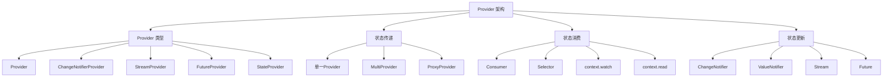

# Provider 状态管理

> Provider 是 Flutter 官方推荐的状态管理解决方案，基于 InheritedWidget 构建，提供了简单而强大的状态管理能力。

## Provider 架构概览



## Provider 基础概念

### 核心组件

```dart
// 1. 状态模型
class CounterModel extends ChangeNotifier {
  int _count = 0;
  
  int get count => _count;
  
  void increment() {
    _count++;
    notifyListeners(); // 通知监听者状态已更改
  }
  
  void decrement() {
    _count--;
    notifyListeners();
  }
  
  void reset() {
    _count = 0;
    notifyListeners();
  }
}

// 2. 提供状态
class MyApp extends StatelessWidget {
  @override
  Widget build(BuildContext context) {
    return ChangeNotifierProvider(
      create: (context) => CounterModel(),
      child: MaterialApp(
        home: HomePage(),
      ),
    );
  }
}

// 3. 消费状态
class HomePage extends StatelessWidget {
  @override
  Widget build(BuildContext context) {
    return Scaffold(
      appBar: AppBar(title: Text('Provider Demo')),
      body: Center(
        child: Column(
          mainAxisAlignment: MainAxisAlignment.center,
          children: [
            // 方式1: Consumer
            Consumer<CounterModel>(
              builder: (context, counter, child) {
                return Text(
                  'Count: ${counter.count}',
                  style: Theme.of(context).textTheme.headlineMedium,
                );
              },
            ),
            SizedBox(height: 20),
            // 方式2: context.watch
            Text(
              'Double: ${context.watch<CounterModel>().count * 2}',
              style: Theme.of(context).textTheme.bodyLarge,
            ),
          ],
        ),
      ),
      floatingActionButton: Column(
        mainAxisAlignment: MainAxisAlignment.end,
        children: [
          FloatingActionButton(
            onPressed: () {
              // 方式3: context.read
              context.read<CounterModel>().increment();
            },
            child: Icon(Icons.add),
          ),
          SizedBox(height: 10),
          FloatingActionButton(
            onPressed: () {
              context.read<CounterModel>().decrement();
            },
            child: Icon(Icons.remove),
          ),
        ],
      ),
    );
  }
}
```

## Provider 类型详解

### 1. ChangeNotifierProvider

最常用的 Provider，适用于可变状态管理。

```dart
// 用户状态管理
class UserModel extends ChangeNotifier {
  User? _user;
  bool _isLoading = false;
  String? _error;
  
  User? get user => _user;
  bool get isLoading => _isLoading;
  String? get error => _error;
  bool get isLoggedIn => _user != null;
  
  Future<void> login(String email, String password) async {
    _setLoading(true);
    _setError(null);
    
    try {
      final user = await AuthService.login(email, password);
      _user = user;
      notifyListeners();
    } catch (e) {
      _setError(e.toString());
    } finally {
      _setLoading(false);
    }
  }
  
  void logout() {
    _user = null;
    notifyListeners();
  }
  
  void _setLoading(bool loading) {
    _isLoading = loading;
    notifyListeners();
  }
  
  void _setError(String? error) {
    _error = error;
    notifyListeners();
  }
}

// 使用示例
ChangeNotifierProvider(
  create: (context) => UserModel(),
  child: LoginPage(),
)
```

### 2. StreamProvider

适用于处理异步数据流。

```dart
// 实时数据流
class ChatService {
  static Stream<List<Message>> getMessages(String chatId) {
    return FirebaseFirestore.instance
        .collection('chats')
        .doc(chatId)
        .collection('messages')
        .orderBy('timestamp', descending: true)
        .snapshots()
        .map((snapshot) => snapshot.docs
            .map((doc) => Message.fromJson(doc.data()))
            .toList());
  }
}

// 提供流数据
StreamProvider<List<Message>>(
  create: (context) => ChatService.getMessages('chat123'),
  initialData: [],
  child: ChatPage(),
)

// 消费流数据
class ChatPage extends StatelessWidget {
  @override
  Widget build(BuildContext context) {
    final messages = context.watch<List<Message>>();
    
    return Scaffold(
      appBar: AppBar(title: Text('Chat')),
      body: ListView.builder(
        itemCount: messages.length,
        itemBuilder: (context, index) {
          final message = messages[index];
          return MessageTile(message: message);
        },
      ),
    );
  }
}
```

### 3. FutureProvider

适用于处理一次性异步操作。

```dart
// 异步数据获取
class ApiService {
  static Future<UserProfile> getUserProfile(String userId) async {
    final response = await http.get(
      Uri.parse('https://api.example.com/users/$userId'),
    );
    
    if (response.statusCode == 200) {
      return UserProfile.fromJson(json.decode(response.body));
    } else {
      throw Exception('Failed to load user profile');
    }
  }
}

// 提供异步数据
FutureProvider<UserProfile>(
  create: (context) => ApiService.getUserProfile('user123'),
  initialData: UserProfile.empty(),
  child: ProfilePage(),
)

// 消费异步数据
class ProfilePage extends StatelessWidget {
  @override
  Widget build(BuildContext context) {
    return Consumer<UserProfile>(
      builder: (context, profile, child) {
        if (profile.isEmpty) {
          return Center(child: CircularProgressIndicator());
        }
        
        return Scaffold(
          appBar: AppBar(title: Text(profile.name)),
          body: Column(
            children: [
              CircleAvatar(
                backgroundImage: NetworkImage(profile.avatar),
                radius: 50,
              ),
              SizedBox(height: 16),
              Text(
                profile.name,
                style: Theme.of(context).textTheme.headlineSmall,
              ),
              Text(
                profile.email,
                style: Theme.of(context).textTheme.bodyMedium,
              ),
            ],
          ),
        );
      },
    );
  }
}
```

### 4. MultiProvider

管理多个 Provider。

```dart
class MyApp extends StatelessWidget {
  @override
  Widget build(BuildContext context) {
    return MultiProvider(
      providers: [
        ChangeNotifierProvider(create: (_) => AuthModel()),
        ChangeNotifierProvider(create: (_) => ThemeModel()),
        ChangeNotifierProvider(create: (_) => CartModel()),
        StreamProvider<ConnectivityResult>(
          create: (_) => Connectivity().onConnectivityChanged,
          initialData: ConnectivityResult.none,
        ),
        FutureProvider<AppConfig>(
          create: (_) => ConfigService.loadConfig(),
          initialData: AppConfig.defaultConfig(),
        ),
      ],
      child: MaterialApp(
        home: HomePage(),
      ),
    );
  }
}
```

### 5. ProxyProvider

依赖其他 Provider 的 Provider。

```dart
// 依赖认证状态的购物车
class CartModel extends ChangeNotifier {
  final AuthModel _authModel;
  List<CartItem> _items = [];
  
  CartModel(this._authModel) {
    _authModel.addListener(_onAuthChanged);
  }
  
  List<CartItem> get items => _items;
  
  void _onAuthChanged() {
    if (!_authModel.isLoggedIn) {
      _items.clear();
      notifyListeners();
    }
  }
  
  void addItem(Product product) {
    if (_authModel.isLoggedIn) {
      _items.add(CartItem.fromProduct(product));
      notifyListeners();
    }
  }
  
  @override
  void dispose() {
    _authModel.removeListener(_onAuthChanged);
    super.dispose();
  }
}

// 使用 ProxyProvider
MultiProvider(
  providers: [
    ChangeNotifierProvider(create: (_) => AuthModel()),
    ChangeNotifierProxyProvider<AuthModel, CartModel>(
      create: (context) => CartModel(
        Provider.of<AuthModel>(context, listen: false),
      ),
      update: (context, auth, cart) => cart ?? CartModel(auth),
    ),
  ],
  child: MyApp(),
)
```

## 状态消费方式

### 1. Consumer

最灵活的消费方式，可以精确控制重建范围。

```dart
Consumer<UserModel>(
  builder: (context, user, child) {
    return Column(
      children: [
        Text('Welcome, ${user.name}'),
        if (child != null) child, // 不会重建的子组件
      ],
    );
  },
  child: ExpensiveWidget(), // 这个组件不会因为状态变化而重建
)
```

### 2. Consumer2, Consumer3...

消费多个 Provider。

```dart
Consumer2<AuthModel, ThemeModel>(
  builder: (context, auth, theme, child) {
    return Container(
      color: theme.backgroundColor,
      child: Text(
        'Hello, ${auth.user?.name ?? "Guest"}',
        style: TextStyle(color: theme.textColor),
      ),
    );
  },
)
```

### 3. Selector

只监听状态的特定部分，优化性能。

```dart
// 只监听用户名变化
Selector<UserModel, String>(
  selector: (context, user) => user.name,
  builder: (context, name, child) {
    return Text('Name: $name');
  },
)

// 监听多个属性
Selector<UserModel, ({String name, String email})>(
  selector: (context, user) => (name: user.name, email: user.email),
  builder: (context, data, child) {
    return Column(
      children: [
        Text('Name: ${data.name}'),
        Text('Email: ${data.email}'),
      ],
    );
  },
)
```

### 4. context.watch vs context.read

```dart
class MyWidget extends StatelessWidget {
  @override
  Widget build(BuildContext context) {
    // watch: 监听状态变化，会触发重建
    final counter = context.watch<CounterModel>();
    
    return Column(
      children: [
        Text('Count: ${counter.count}'),
        ElevatedButton(
          onPressed: () {
            // read: 不监听状态变化，只获取当前值
            context.read<CounterModel>().increment();
          },
          child: Text('Increment'),
        ),
      ],
    );
  }
}
```

## 高级用法

### 1. 状态组合

```dart
// 组合多个状态
class AppStateModel extends ChangeNotifier {
  final AuthModel _authModel;
  final CartModel _cartModel;
  final ThemeModel _themeModel;
  
  AppStateModel(this._authModel, this._cartModel, this._themeModel) {
    _authModel.addListener(notifyListeners);
    _cartModel.addListener(notifyListeners);
    _themeModel.addListener(notifyListeners);
  }
  
  AuthModel get auth => _authModel;
  CartModel get cart => _cartModel;
  ThemeModel get theme => _themeModel;
  
  // 组合操作
  Future<void> logout() async {
    await _authModel.logout();
    _cartModel.clear();
    _themeModel.resetToDefault();
  }
  
  @override
  void dispose() {
    _authModel.removeListener(notifyListeners);
    _cartModel.removeListener(notifyListeners);
    _themeModel.removeListener(notifyListeners);
    super.dispose();
  }
}
```

### 2. 状态持久化

```dart
class PersistentCounterModel extends ChangeNotifier {
  int _count = 0;
  final SharedPreferences _prefs;
  
  PersistentCounterModel(this._prefs) {
    _loadCount();
  }
  
  int get count => _count;
  
  void _loadCount() {
    _count = _prefs.getInt('counter') ?? 0;
    notifyListeners();
  }
  
  void increment() {
    _count++;
    _saveCount();
    notifyListeners();
  }
  
  void _saveCount() {
    _prefs.setInt('counter', _count);
  }
}

// 使用
FutureProvider<SharedPreferences>(
  create: (_) => SharedPreferences.getInstance(),
  child: Consumer<SharedPreferences>(
    builder: (context, prefs, child) {
      if (prefs == null) {
        return CircularProgressIndicator();
      }
      
      return ChangeNotifierProvider(
        create: (_) => PersistentCounterModel(prefs),
        child: MyApp(),
      );
    },
  ),
)
```

### 3. 异步状态管理

```dart
class AsyncDataModel extends ChangeNotifier {
  AsyncValue<List<Item>> _items = AsyncValue.loading();
  
  AsyncValue<List<Item>> get items => _items;
  
  Future<void> loadItems() async {
    _items = AsyncValue.loading();
    notifyListeners();
    
    try {
      final items = await ApiService.getItems();
      _items = AsyncValue.data(items);
    } catch (error, stackTrace) {
      _items = AsyncValue.error(error, stackTrace);
    }
    
    notifyListeners();
  }
  
  Future<void> refreshItems() async {
    try {
      final items = await ApiService.getItems();
      _items = AsyncValue.data(items);
      notifyListeners();
    } catch (error, stackTrace) {
      _items = AsyncValue.error(error, stackTrace);
      notifyListeners();
    }
  }
}

// AsyncValue 辅助类
class AsyncValue<T> {
  final T? data;
  final Object? error;
  final StackTrace? stackTrace;
  final bool isLoading;
  
  const AsyncValue._(
    this.data,
    this.error,
    this.stackTrace,
    this.isLoading,
  );
  
  const AsyncValue.data(T data)
      : this._(data, null, null, false);
  
  const AsyncValue.error(Object error, StackTrace stackTrace)
      : this._(null, error, stackTrace, false);
  
  const AsyncValue.loading()
      : this._(null, null, null, true);
  
  bool get hasData => data != null;
  bool get hasError => error != null;
  
  R when<R>({
    required R Function(T data) data,
    required R Function(Object error, StackTrace stackTrace) error,
    required R Function() loading,
  }) {
    if (isLoading) return loading();
    if (hasError) return error(this.error!, stackTrace!);
    return data(this.data as T);
  }
}
```

## 性能优化

### 1. 状态分割

```dart
// 不好的做法：大状态对象
class BadAppState extends ChangeNotifier {
  User? user;
  List<Product> products;
  ShoppingCart cart;
  AppSettings settings;
  
  // 任何属性变化都会通知所有监听者
  void updateUser(User newUser) {
    user = newUser;
    notifyListeners(); // 所有监听者都会重建
  }
}

// 好的做法：分离状态
class UserState extends ChangeNotifier {
  User? _user;
  User? get user => _user;
  
  void updateUser(User newUser) {
    _user = newUser;
    notifyListeners(); // 只有用户相关的监听者重建
  }
}

class ProductState extends ChangeNotifier {
  List<Product> _products = [];
  List<Product> get products => _products;
  
  void updateProducts(List<Product> newProducts) {
    _products = newProducts;
    notifyListeners();
  }
}
```

### 2. 使用 Selector 优化

```dart
// 不好的做法：监听整个对象
Consumer<UserModel>(
  builder: (context, user, child) {
    return Text(user.name); // 即使只需要 name，user 的任何变化都会重建
  },
)

// 好的做法：只监听需要的属性
Selector<UserModel, String>(
  selector: (context, user) => user.name,
  builder: (context, name, child) {
    return Text(name); // 只有 name 变化才会重建
  },
)
```

### 3. 避免不必要的 Provider 创建

```dart
// 不好的做法：在 build 方法中创建
class BadWidget extends StatelessWidget {
  @override
  Widget build(BuildContext context) {
    return ChangeNotifierProvider(
      create: (_) => CounterModel(), // 每次重建都会创建新实例
      child: CounterWidget(),
    );
  }
}

// 好的做法：在适当的位置创建
class GoodApp extends StatelessWidget {
  @override
  Widget build(BuildContext context) {
    return ChangeNotifierProvider(
      create: (_) => CounterModel(), // 只创建一次
      child: MaterialApp(
        home: HomePage(),
      ),
    );
  }
}
```

## 测试

### 1. 单元测试

```dart
void main() {
  group('CounterModel Tests', () {
    late CounterModel counter;
    
    setUp(() {
      counter = CounterModel();
    });
    
    test('initial count should be 0', () {
      expect(counter.count, 0);
    });
    
    test('increment should increase count', () {
      counter.increment();
      expect(counter.count, 1);
    });
    
    test('should notify listeners on increment', () {
      bool notified = false;
      counter.addListener(() {
        notified = true;
      });
      
      counter.increment();
      expect(notified, true);
    });
  });
}
```

### 2. Widget 测试

```dart
void main() {
  testWidgets('CounterWidget should display count', (tester) async {
    await tester.pumpWidget(
      ChangeNotifierProvider(
        create: (_) => CounterModel(),
        child: MaterialApp(
          home: CounterWidget(),
        ),
      ),
    );
    
    // 验证初始状态
    expect(find.text('Count: 0'), findsOneWidget);
    
    // 点击增加按钮
    await tester.tap(find.byIcon(Icons.add));
    await tester.pump();
    
    // 验证状态更新
    expect(find.text('Count: 1'), findsOneWidget);
  });
}
```

## 最佳实践

### 1. 状态设计原则

- **单一职责**：每个 Model 只负责一个功能域
- **不可变性**：尽量使用不可变的数据结构
- **最小化状态**：只存储必要的状态，派生状态通过 getter 计算
- **清晰的接口**：提供清晰的方法来修改状态

### 2. Provider 使用建议

```dart
// 好的实践
class UserModel extends ChangeNotifier {
  User? _user;
  bool _isLoading = false;
  String? _error;
  
  // 只读访问器
  User? get user => _user;
  bool get isLoading => _isLoading;
  String? get error => _error;
  bool get isLoggedIn => _user != null;
  
  // 清晰的操作方法
  Future<void> login(String email, String password) async {
    _setLoading(true);
    _clearError();
    
    try {
      final user = await AuthService.login(email, password);
      _setUser(user);
    } catch (e) {
      _setError(e.toString());
    } finally {
      _setLoading(false);
    }
  }
  
  void logout() {
    _setUser(null);
  }
  
  // 私有辅助方法
  void _setUser(User? user) {
    _user = user;
    notifyListeners();
  }
  
  void _setLoading(bool loading) {
    _isLoading = loading;
    notifyListeners();
  }
  
  void _setError(String? error) {
    _error = error;
    notifyListeners();
  }
  
  void _clearError() {
    _error = null;
  }
}
```

### 3. 错误处理

```dart
class ErrorHandlingModel extends ChangeNotifier {
  String? _error;
  String? get error => _error;
  
  Future<void> performAction() async {
    try {
      _clearError();
      await someAsyncOperation();
    } on NetworkException catch (e) {
      _setError('网络连接失败，请检查网络设置');
    } on AuthException catch (e) {
      _setError('认证失败，请重新登录');
    } catch (e) {
      _setError('操作失败，请稍后重试');
      // 记录详细错误信息
      debugPrint('Unexpected error: $e');
    }
  }
  
  void _setError(String error) {
    _error = error;
    notifyListeners();
  }
  
  void _clearError() {
    _error = null;
    notifyListeners();
  }
  
  void clearError() {
    _clearError();
  }
}
```

## 相关资源

- [Provider 官方文档](https://pub.dev/packages/provider)
- [Flutter 状态管理指南](https://docs.flutter.dev/development/data-and-backend/state-mgmt)
- [Provider 最佳实践](https://flutter.dev/docs/development/data-and-backend/state-mgmt/simple)
- [Provider 示例项目](https://github.com/flutter/samples/tree/master/provider_shopper)