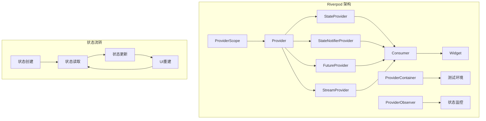

# Riverpod 状态管理

Riverpod 是 Provider 的进化版本，提供了更强大、更安全的状态管理解决方案。它解决了 Provider 的一些限制，提供了编译时安全、更好的测试支持和更灵活的依赖注入。

## 1. Riverpod 架构概览



## 2. 基础概念

### 2.1 Provider 类型

#### Provider（不可变状态）
```dart
import 'package:flutter_riverpod/flutter_riverpod.dart';

// 简单值 Provider
final nameProvider = Provider<String>((ref) => 'Flutter');

// 计算属性 Provider
final greetingProvider = Provider<String>((ref) {
  final name = ref.watch(nameProvider);
  return 'Hello, $name!';
});

// 使用示例
class GreetingWidget extends ConsumerWidget {
  @override
  Widget build(BuildContext context, WidgetRef ref) {
    final greeting = ref.watch(greetingProvider);
    
    return Text(greeting);
  }
}
```

#### StateProvider（可变状态）
```dart
// 计数器状态
final counterProvider = StateProvider<int>((ref) => 0);

// 主题模式状态
final themeProvider = StateProvider<bool>((ref) => false);

class CounterWidget extends ConsumerWidget {
  @override
  Widget build(BuildContext context, WidgetRef ref) {
    final count = ref.watch(counterProvider);
    
    return Column(
      children: [
        Text('计数: $count'),
        ElevatedButton(
          onPressed: () {
            // 更新状态
            ref.read(counterProvider.notifier).state++;
          },
          child: const Text('增加'),
        ),
        ElevatedButton(
          onPressed: () {
            // 重置状态
            ref.read(counterProvider.notifier).state = 0;
          },
          child: const Text('重置'),
        ),
      ],
    );
  }
}
```

### 2.2 StateNotifierProvider（复杂状态）

```dart
// 待办事项模型
class Todo {
  final String id;
  final String title;
  final bool isCompleted;
  
  Todo({
    required this.id,
    required this.title,
    this.isCompleted = false,
  });
  
  Todo copyWith({
    String? id,
    String? title,
    bool? isCompleted,
  }) {
    return Todo(
      id: id ?? this.id,
      title: title ?? this.title,
      isCompleted: isCompleted ?? this.isCompleted,
    );
  }
}

// StateNotifier 实现
class TodoNotifier extends StateNotifier<List<Todo>> {
  TodoNotifier() : super([]);
  
  void addTodo(String title) {
    final todo = Todo(
      id: DateTime.now().millisecondsSinceEpoch.toString(),
      title: title,
    );
    state = [...state, todo];
  }
  
  void toggleTodo(String id) {
    state = [
      for (final todo in state)
        if (todo.id == id)
          todo.copyWith(isCompleted: !todo.isCompleted)
        else
          todo,
    ];
  }
  
  void removeTodo(String id) {
    state = state.where((todo) => todo.id != id).toList();
  }
  
  void clearCompleted() {
    state = state.where((todo) => !todo.isCompleted).toList();
  }
}

// Provider 定义
final todoProvider = StateNotifierProvider<TodoNotifier, List<Todo>>(
  (ref) => TodoNotifier(),
);

// 派生状态
final completedTodosProvider = Provider<List<Todo>>((ref) {
  final todos = ref.watch(todoProvider);
  return todos.where((todo) => todo.isCompleted).toList();
});

final pendingTodosProvider = Provider<List<Todo>>((ref) {
  final todos = ref.watch(todoProvider);
  return todos.where((todo) => !todo.isCompleted).toList();
});

final todoStatsProvider = Provider<Map<String, int>>((ref) {
  final todos = ref.watch(todoProvider);
  final completed = ref.watch(completedTodosProvider);
  final pending = ref.watch(pendingTodosProvider);
  
  return {
    'total': todos.length,
    'completed': completed.length,
    'pending': pending.length,
  };
});
```

### 2.3 异步状态管理

#### FutureProvider
```dart
// 用户信息获取
final userProvider = FutureProvider<User>((ref) async {
  final userId = ref.watch(currentUserIdProvider);
  return await UserRepository().getUser(userId);
});

// 配置信息获取
final configProvider = FutureProvider<AppConfig>((ref) async {
  final response = await http.get(Uri.parse('/api/config'));
  return AppConfig.fromJson(json.decode(response.body));
});

class UserProfileWidget extends ConsumerWidget {
  @override
  Widget build(BuildContext context, WidgetRef ref) {
    final userAsync = ref.watch(userProvider);
    
    return userAsync.when(
      data: (user) => Column(
        children: [
          Text('姓名: ${user.name}'),
          Text('邮箱: ${user.email}'),
        ],
      ),
      loading: () => const CircularProgressIndicator(),
      error: (error, stack) => Text('错误: $error'),
    );
  }
}
```

#### StreamProvider
```dart
// 实时消息流
final messagesProvider = StreamProvider<List<Message>>((ref) {
  final chatId = ref.watch(currentChatIdProvider);
  return MessageRepository().getMessagesStream(chatId);
});

// 网络状态监听
final connectivityProvider = StreamProvider<ConnectivityResult>((ref) {
  return Connectivity().onConnectivityChanged;
});

class MessagesWidget extends ConsumerWidget {
  @override
  Widget build(BuildContext context, WidgetRef ref) {
    final messagesAsync = ref.watch(messagesProvider);
    
    return messagesAsync.when(
      data: (messages) => ListView.builder(
        itemCount: messages.length,
        itemBuilder: (context, index) {
          final message = messages[index];
          return MessageTile(message: message);
        },
      ),
      loading: () => const Center(
        child: CircularProgressIndicator(),
      ),
      error: (error, stack) => Center(
        child: Text('加载失败: $error'),
      ),
    );
  }
}
```

## 3. 高级用法

### 3.1 Provider 组合与依赖

```dart
// 基础 Provider
final apiKeyProvider = Provider<String>((ref) => 'your-api-key');
final baseUrlProvider = Provider<String>((ref) => 'https://api.example.com');

// HTTP 客户端 Provider
final httpClientProvider = Provider<http.Client>((ref) {
  final apiKey = ref.watch(apiKeyProvider);
  final baseUrl = ref.watch(baseUrlProvider);
  
  return http.Client()..interceptors.add(
    ApiKeyInterceptor(apiKey: apiKey, baseUrl: baseUrl),
  );
});

// Repository Provider
final userRepositoryProvider = Provider<UserRepository>((ref) {
  final client = ref.watch(httpClientProvider);
  return UserRepository(client: client);
});

// Service Provider
final authServiceProvider = Provider<AuthService>((ref) {
  final repository = ref.watch(userRepositoryProvider);
  return AuthService(repository: repository);
});

// 当前用户 Provider
final currentUserProvider = StateNotifierProvider<CurrentUserNotifier, AsyncValue<User?>>(
  (ref) {
    final authService = ref.watch(authServiceProvider);
    return CurrentUserNotifier(authService);
  },
);

class CurrentUserNotifier extends StateNotifier<AsyncValue<User?>> {
  final AuthService _authService;
  
  CurrentUserNotifier(this._authService) : super(const AsyncValue.loading()) {
    _loadCurrentUser();
  }
  
  Future<void> _loadCurrentUser() async {
    try {
      final user = await _authService.getCurrentUser();
      state = AsyncValue.data(user);
    } catch (error, stack) {
      state = AsyncValue.error(error, stack);
    }
  }
  
  Future<void> login(String email, String password) async {
    state = const AsyncValue.loading();
    try {
      final user = await _authService.login(email, password);
      state = AsyncValue.data(user);
    } catch (error, stack) {
      state = AsyncValue.error(error, stack);
    }
  }
  
  Future<void> logout() async {
    await _authService.logout();
    state = const AsyncValue.data(null);
  }
}
```

### 3.2 状态持久化

```dart
// 持久化 Provider
final sharedPreferencesProvider = Provider<SharedPreferences>((ref) {
  throw UnimplementedError('需要在 main 中覆盖');
});

// 设置状态管理
class SettingsNotifier extends StateNotifier<Settings> {
  final SharedPreferences _prefs;
  
  SettingsNotifier(this._prefs) : super(Settings()) {
    _loadSettings();
  }
  
  void _loadSettings() {
    final isDarkMode = _prefs.getBool('isDarkMode') ?? false;
    final language = _prefs.getString('language') ?? 'zh';
    final fontSize = _prefs.getDouble('fontSize') ?? 14.0;
    
    state = Settings(
      isDarkMode: isDarkMode,
      language: language,
      fontSize: fontSize,
    );
  }
  
  Future<void> updateDarkMode(bool isDarkMode) async {
    await _prefs.setBool('isDarkMode', isDarkMode);
    state = state.copyWith(isDarkMode: isDarkMode);
  }
  
  Future<void> updateLanguage(String language) async {
    await _prefs.setString('language', language);
    state = state.copyWith(language: language);
  }
  
  Future<void> updateFontSize(double fontSize) async {
    await _prefs.setDouble('fontSize', fontSize);
    state = state.copyWith(fontSize: fontSize);
  }
}

final settingsProvider = StateNotifierProvider<SettingsNotifier, Settings>(
  (ref) {
    final prefs = ref.watch(sharedPreferencesProvider);
    return SettingsNotifier(prefs);
  },
);

// 设置模型
class Settings {
  final bool isDarkMode;
  final String language;
  final double fontSize;
  
  const Settings({
    this.isDarkMode = false,
    this.language = 'zh',
    this.fontSize = 14.0,
  });
  
  Settings copyWith({
    bool? isDarkMode,
    String? language,
    double? fontSize,
  }) {
    return Settings(
      isDarkMode: isDarkMode ?? this.isDarkMode,
      language: language ?? this.language,
      fontSize: fontSize ?? this.fontSize,
    );
  }
}
```

### 3.3 Provider 作用域

```dart
// 全局 Provider
final globalCounterProvider = StateProvider<int>((ref) => 0);

// 作用域 Provider
final scopedCounterProvider = StateProvider.family<int, String>(
  (ref, scope) => 0,
);

class ScopedCounterWidget extends ConsumerWidget {
  final String scope;
  
  const ScopedCounterWidget({required this.scope});
  
  @override
  Widget build(BuildContext context, WidgetRef ref) {
    final counter = ref.watch(scopedCounterProvider(scope));
    
    return Column(
      children: [
        Text('作用域 $scope 计数: $counter'),
        ElevatedButton(
          onPressed: () {
            ref.read(scopedCounterProvider(scope).notifier).state++;
          },
          child: const Text('增加'),
        ),
      ],
    );
  }
}

// 使用不同作用域
class MultiScopeWidget extends StatelessWidget {
  @override
  Widget build(BuildContext context) {
    return Column(
      children: [
        ScopedCounterWidget(scope: 'A'),
        ScopedCounterWidget(scope: 'B'),
        ScopedCounterWidget(scope: 'C'),
      ],
    );
  }
}
```

## 4. 状态监听与调试

### 4.1 ProviderObserver

```dart
class AppProviderObserver extends ProviderObserver {
  @override
  void didAddProvider(
    ProviderBase provider,
    Object? value,
    ProviderContainer container,
  ) {
    debugPrint('Provider 添加: ${provider.name ?? provider.runtimeType}');
  }
  
  @override
  void didUpdateProvider(
    ProviderBase provider,
    Object? previousValue,
    Object? newValue,
    ProviderContainer container,
  ) {
    debugPrint(
      'Provider 更新: ${provider.name ?? provider.runtimeType}\n'
      '  旧值: $previousValue\n'
      '  新值: $newValue',
    );
  }
  
  @override
  void didDisposeProvider(
    ProviderBase provider,
    ProviderContainer container,
  ) {
    debugPrint('Provider 释放: ${provider.name ?? provider.runtimeType}');
  }
  
  @override
  void providerDidFail(
    ProviderBase provider,
    Object error,
    StackTrace stackTrace,
    ProviderContainer container,
  ) {
    debugPrint(
      'Provider 错误: ${provider.name ?? provider.runtimeType}\n'
      '  错误: $error\n'
      '  堆栈: $stackTrace',
    );
  }
}

// 在 main.dart 中使用
void main() async {
  WidgetsFlutterBinding.ensureInitialized();
  
  final sharedPreferences = await SharedPreferences.getInstance();
  
  runApp(
    ProviderScope(
      observers: [AppProviderObserver()],
      overrides: [
        sharedPreferencesProvider.overrideWithValue(sharedPreferences),
      ],
      child: MyApp(),
    ),
  );
}
```

### 4.2 状态监听

```dart
class StateListenerWidget extends ConsumerStatefulWidget {
  @override
  ConsumerState<StateListenerWidget> createState() => _StateListenerWidgetState();
}

class _StateListenerWidgetState extends ConsumerState<StateListenerWidget> {
  @override
  void initState() {
    super.initState();
    
    // 监听状态变化
    ref.listenManual(counterProvider, (previous, next) {
      if (next > 10) {
        ScaffoldMessenger.of(context).showSnackBar(
          const SnackBar(content: Text('计数超过10了！')),
        );
      }
    });
  }
  
  @override
  Widget build(BuildContext context) {
    // 使用 ref.listen 在 build 中监听
    ref.listen<AsyncValue<User?>>(currentUserProvider, (previous, next) {
      next.whenOrNull(
        error: (error, stack) {
          ScaffoldMessenger.of(context).showSnackBar(
            SnackBar(content: Text('用户加载失败: $error')),
          );
        },
      );
    });
    
    final counter = ref.watch(counterProvider);
    
    return Scaffold(
      appBar: AppBar(title: const Text('状态监听')),
      body: Center(
        child: Text('计数: $counter'),
      ),
      floatingActionButton: FloatingActionButton(
        onPressed: () {
          ref.read(counterProvider.notifier).state++;
        },
        child: const Icon(Icons.add),
      ),
    );
  }
}
```

## 5. 性能优化

### 5.1 选择性重建

```dart
// 使用 select 只监听特定字段
class OptimizedUserWidget extends ConsumerWidget {
  @override
  Widget build(BuildContext context, WidgetRef ref) {
    // 只在用户名变化时重建
    final userName = ref.watch(
      userProvider.select((user) => user.name),
    );
    
    return Text('用户名: $userName');
  }
}

// 使用 Consumer 局部重建
class PartialRebuildWidget extends StatelessWidget {
  @override
  Widget build(BuildContext context) {
    return Scaffold(
      appBar: AppBar(title: const Text('局部重建')),
      body: Column(
        children: [
          const Text('这部分不会重建'),
          Consumer(
            builder: (context, ref, child) {
              final counter = ref.watch(counterProvider);
              return Text('计数: $counter'); // 只有这部分重建
            },
          ),
          const Text('这部分也不会重建'),
        ],
      ),
    );
  }
}
```

### 5.2 Provider 缓存

```dart
// 自动释放的 Provider
final autoDisposeCounterProvider = StateProvider.autoDispose<int>((ref) => 0);

// 保持活跃的 Provider
final keepAliveCounterProvider = StateProvider.autoDispose<int>((ref) {
  ref.keepAlive(); // 防止自动释放
  return 0;
});

// 条件性保持活跃
final conditionalKeepAliveProvider = StateProvider.autoDispose<int>((ref) {
  final shouldKeepAlive = ref.watch(someConditionProvider);
  
  if (shouldKeepAlive) {
    ref.keepAlive();
  }
  
  return 0;
});
```

### 5.3 异步状态优化

```dart
// 缓存异步结果
final cachedUserProvider = FutureProvider.autoDispose.family<User, String>(
  (ref, userId) async {
    // 设置缓存时间
    final timer = Timer(const Duration(minutes: 5), () {
      ref.invalidateSelf();
    });
    
    ref.onDispose(() {
      timer.cancel();
    });
    
    return await UserRepository().getUser(userId);
  },
);

// 预加载数据
class PreloadDataWidget extends ConsumerStatefulWidget {
  @override
  ConsumerState<PreloadDataWidget> createState() => _PreloadDataWidgetState();
}

class _PreloadDataWidgetState extends ConsumerState<PreloadDataWidget> {
  @override
  void initState() {
    super.initState();
    
    // 预加载数据
    WidgetsBinding.instance.addPostFrameCallback((_) {
      ref.read(userProvider.future);
      ref.read(settingsProvider.future);
    });
  }
  
  @override
  Widget build(BuildContext context) {
    return Container();
  }
}
```

## 6. 测试

### 6.1 单元测试

```dart
import 'package:flutter_test/flutter_test.dart';
import 'package:flutter_riverpod/flutter_riverpod.dart';

void main() {
  group('TodoNotifier Tests', () {
    late ProviderContainer container;
    late TodoNotifier notifier;
    
    setUp(() {
      container = ProviderContainer();
      notifier = container.read(todoProvider.notifier);
    });
    
    tearDown(() {
      container.dispose();
    });
    
    test('初始状态为空列表', () {
      final todos = container.read(todoProvider);
      expect(todos, isEmpty);
    });
    
    test('添加待办事项', () {
      notifier.addTodo('测试任务');
      
      final todos = container.read(todoProvider);
      expect(todos.length, 1);
      expect(todos.first.title, '测试任务');
      expect(todos.first.isCompleted, false);
    });
    
    test('切换待办事项状态', () {
      notifier.addTodo('测试任务');
      final todoId = container.read(todoProvider).first.id;
      
      notifier.toggleTodo(todoId);
      
      final todos = container.read(todoProvider);
      expect(todos.first.isCompleted, true);
    });
    
    test('删除待办事项', () {
      notifier.addTodo('测试任务');
      final todoId = container.read(todoProvider).first.id;
      
      notifier.removeTodo(todoId);
      
      final todos = container.read(todoProvider);
      expect(todos, isEmpty);
    });
    
    test('派生状态正确计算', () {
      notifier.addTodo('任务1');
      notifier.addTodo('任务2');
      
      final todoId = container.read(todoProvider).first.id;
      notifier.toggleTodo(todoId);
      
      final stats = container.read(todoStatsProvider);
      expect(stats['total'], 2);
      expect(stats['completed'], 1);
      expect(stats['pending'], 1);
    });
  });
}
```

### 6.2 Widget 测试

```dart
import 'package:flutter/material.dart';
import 'package:flutter_test/flutter_test.dart';
import 'package:flutter_riverpod/flutter_riverpod.dart';

void main() {
  group('CounterWidget Tests', () {
    testWidgets('显示初始计数', (WidgetTester tester) async {
      await tester.pumpWidget(
        ProviderScope(
          child: MaterialApp(
            home: CounterWidget(),
          ),
        ),
      );
      
      expect(find.text('计数: 0'), findsOneWidget);
    });
    
    testWidgets('点击按钮增加计数', (WidgetTester tester) async {
      await tester.pumpWidget(
        ProviderScope(
          child: MaterialApp(
            home: CounterWidget(),
          ),
        ),
      );
      
      await tester.tap(find.text('增加'));
      await tester.pump();
      
      expect(find.text('计数: 1'), findsOneWidget);
    });
    
    testWidgets('使用覆盖测试', (WidgetTester tester) async {
      await tester.pumpWidget(
        ProviderScope(
          overrides: [
            counterProvider.overrideWith((ref) => 10),
          ],
          child: MaterialApp(
            home: CounterWidget(),
          ),
        ),
      );
      
      expect(find.text('计数: 10'), findsOneWidget);
    });
  });
}
```

### 6.3 异步测试

```dart
void main() {
  group('Async Provider Tests', () {
    testWidgets('FutureProvider 测试', (WidgetTester tester) async {
      final container = ProviderContainer(
        overrides: [
          userProvider.overrideWith((ref) async {
            await Future.delayed(const Duration(milliseconds: 100));
            return User(id: '1', name: '测试用户');
          }),
        ],
      );
      
      await tester.pumpWidget(
        UncontrolledProviderScope(
          container: container,
          child: MaterialApp(
            home: UserProfileWidget(),
          ),
        ),
      );
      
      // 初始加载状态
      expect(find.byType(CircularProgressIndicator), findsOneWidget);
      
      // 等待异步操作完成
      await tester.pump(const Duration(milliseconds: 100));
      
      // 验证数据显示
      expect(find.text('姓名: 测试用户'), findsOneWidget);
      
      container.dispose();
    });
    
    testWidgets('错误状态测试', (WidgetTester tester) async {
      final container = ProviderContainer(
        overrides: [
          userProvider.overrideWith((ref) async {
            throw Exception('网络错误');
          }),
        ],
      );
      
      await tester.pumpWidget(
        UncontrolledProviderScope(
          container: container,
          child: MaterialApp(
            home: UserProfileWidget(),
          ),
        ),
      );
      
      await tester.pump();
      
      expect(find.textContaining('错误: Exception: 网络错误'), findsOneWidget);
      
      container.dispose();
    });
  });
}
```

## 7. 最佳实践

### 7.1 Provider 设计原则

#### 单一职责
```dart
// 好的做法：每个 Provider 只负责一个领域
final userAuthProvider = StateNotifierProvider<AuthNotifier, AuthState>(
  (ref) => AuthNotifier(),
);

final shoppingCartProvider = StateNotifierProvider<CartNotifier, CartState>(
  (ref) => CartNotifier(),
);

// 避免：一个 Provider 管理多个不相关的状态
final appStateProvider = StateNotifierProvider<AppNotifier, AppState>(
  (ref) => AppNotifier(), // 管理用户、购物车、设置等所有状态
);
```

#### 依赖注入
```dart
// 使用 Provider 进行依赖注入
final databaseProvider = Provider<Database>((ref) => Database());

final userRepositoryProvider = Provider<UserRepository>((ref) {
  final database = ref.watch(databaseProvider);
  return UserRepository(database: database);
});

final userServiceProvider = Provider<UserService>((ref) {
  final repository = ref.watch(userRepositoryProvider);
  return UserService(repository: repository);
});
```

### 7.2 错误处理

```dart
// 统一错误处理
class ErrorHandlerNotifier extends StateNotifier<String?> {
  ErrorHandlerNotifier() : super(null);
  
  void showError(String message) {
    state = message;
  }
  
  void clearError() {
    state = null;
  }
}

final errorHandlerProvider = StateNotifierProvider<ErrorHandlerNotifier, String?>(
  (ref) => ErrorHandlerNotifier(),
);

// 在异步 Provider 中使用
final dataProvider = FutureProvider<Data>((ref) async {
  try {
    return await DataRepository().fetchData();
  } catch (error) {
    ref.read(errorHandlerProvider.notifier).showError(error.toString());
    rethrow;
  }
});

// 全局错误显示
class ErrorDisplayWidget extends ConsumerWidget {
  @override
  Widget build(BuildContext context, WidgetRef ref) {
    final error = ref.watch(errorHandlerProvider);
    
    if (error != null) {
      WidgetsBinding.instance.addPostFrameCallback((_) {
        ScaffoldMessenger.of(context).showSnackBar(
          SnackBar(
            content: Text(error),
            action: SnackBarAction(
              label: '关闭',
              onPressed: () {
                ref.read(errorHandlerProvider.notifier).clearError();
              },
            ),
          ),
        );
      });
    }
    
    return const SizedBox.shrink();
  }
}
```

### 7.3 状态持久化策略

```dart
// 自动持久化 Mixin
mixin AutoPersistMixin<T> on StateNotifier<T> {
  String get key;
  SharedPreferences get prefs;
  
  T fromJson(Map<String, dynamic> json);
  Map<String, dynamic> toJson(T state);
  
  @override
  set state(T value) {
    super.state = value;
    _saveState();
  }
  
  void _saveState() {
    final json = toJson(state);
    prefs.setString(key, jsonEncode(json));
  }
  
  void loadState() {
    final jsonString = prefs.getString(key);
    if (jsonString != null) {
      final json = jsonDecode(jsonString) as Map<String, dynamic>;
      state = fromJson(json);
    }
  }
}

// 使用示例
class PersistentSettingsNotifier extends StateNotifier<Settings>
    with AutoPersistMixin<Settings> {
  final SharedPreferences _prefs;
  
  PersistentSettingsNotifier(this._prefs) : super(const Settings()) {
    loadState();
  }
  
  @override
  String get key => 'settings';
  
  @override
  SharedPreferences get prefs => _prefs;
  
  @override
  Settings fromJson(Map<String, dynamic> json) => Settings.fromJson(json);
  
  @override
  Map<String, dynamic> toJson(Settings state) => state.toJson();
  
  void updateTheme(bool isDarkMode) {
    state = state.copyWith(isDarkMode: isDarkMode);
  }
}
```

## 8. 总结

Riverpod 提供了强大而灵活的状态管理解决方案：

### 核心优势

1. **编译时安全**：避免运行时错误
2. **更好的测试支持**：易于模拟和覆盖
3. **自动资源管理**：防止内存泄漏
4. **强大的依赖注入**：清晰的依赖关系
5. **优秀的开发体验**：丰富的调试工具

### 选择指南

| Provider 类型 | 使用场景 | 特点 |
|--------------|----------|------|
| Provider | 不可变数据、计算属性 | 简单、高效 |
| StateProvider | 简单可变状态 | 易用、直接 |
| StateNotifierProvider | 复杂状态逻辑 | 强大、可测试 |
| FutureProvider | 异步数据获取 | 自动处理加载状态 |
| StreamProvider | 实时数据流 | 响应式更新 |

### 最佳实践要点

1. **合理选择 Provider 类型**
2. **保持状态不可变性**
3. **使用依赖注入**
4. **编写全面的测试**
5. **合理使用 autoDispose**
6. **统一错误处理**
7. **适当的状态持久化**

## 相关资源

- [Riverpod 官方文档](https://riverpod.dev/)
- [Riverpod GitHub](https://github.com/rrousselGit/riverpod)
- [Flutter Riverpod 示例](https://github.com/rrousselGit/riverpod/tree/master/examples)
- [状态管理对比](https://docs.flutter.dev/development/data-and-backend/state-mgmt/options)
- [Riverpod 最佳实践](https://riverpod.dev/docs/concepts/reading#using-ref-to-interact-with-providers)