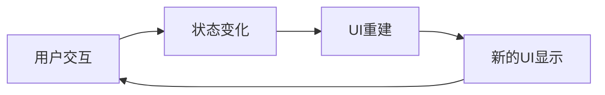
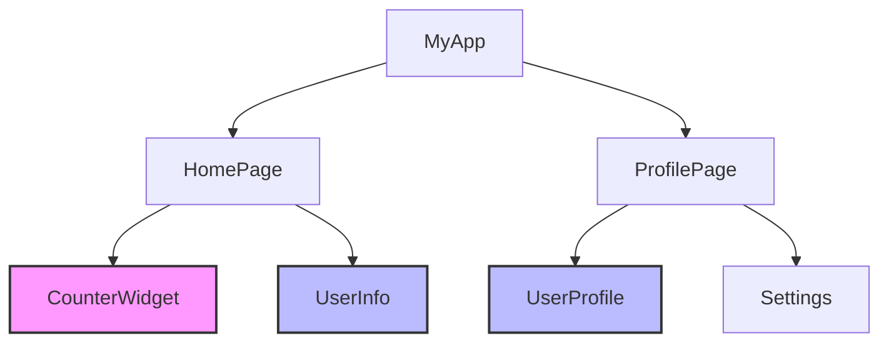

# 状态管理基础

> Flutter 状态管理的核心概念和基础原理，为深入学习各种状态管理方案打下坚实基础。

## 状态的概念

### 什么是状态

在 Flutter 中，状态（State）是指应用程序在特定时间点的数据快照。状态决定了 UI 的外观和行为。



### 状态的分类

```dart
// 1. 局部状态 (Local State)
class CounterWidget extends StatefulWidget {
  @override
  _CounterWidgetState createState() => _CounterWidgetState();
}

class _CounterWidgetState extends State<CounterWidget> {
  int _counter = 0; // 局部状态
  
  void _increment() {
    setState(() {
      _counter++;
    });
  }
  
  @override
  Widget build(BuildContext context) {
    return Column(
      children: [
        Text('Count: $_counter'),
        ElevatedButton(
          onPressed: _increment,
          child: Text('Increment'),
        ),
      ],
    );
  }
}

// 2. 全局状态 (Global State)
class AppState {
  static final AppState _instance = AppState._internal();
  factory AppState() => _instance;
  AppState._internal();
  
  String _userName = '';
  bool _isLoggedIn = false;
  
  String get userName => _userName;
  bool get isLoggedIn => _isLoggedIn;
  
  void login(String name) {
    _userName = name;
    _isLoggedIn = true;
  }
  
  void logout() {
    _userName = '';
    _isLoggedIn = false;
  }
}
```

## Flutter 状态管理机制

### Widget 树和状态



### setState 机制

```dart
class StateExample extends StatefulWidget {
  @override
  _StateExampleState createState() => _StateExampleState();
}

class _StateExampleState extends State<StateExample> {
  String _message = 'Hello';
  
  void _updateMessage() {
    setState(() {
      // 1. 修改状态
      _message = 'Hello Flutter!';
      
      // 2. Flutter 框架会：
      // - 标记当前 Widget 为 dirty
      // - 在下一帧重建 Widget
      // - 调用 build 方法
    });
  }
  
  @override
  Widget build(BuildContext context) {
    print('build called'); // 每次状态变化都会调用
    
    return Column(
      children: [
        Text(_message),
        ElevatedButton(
          onPressed: _updateMessage,
          child: Text('Update'),
        ),
      ],
    );
  }
}
```

### 状态生命周期

```dart
class LifecycleExample extends StatefulWidget {
  @override
  _LifecycleExampleState createState() => _LifecycleExampleState();
}

class _LifecycleExampleState extends State<LifecycleExample> {
  @override
  void initState() {
    super.initState();
    print('1. initState - 初始化状态');
    // 初始化数据、订阅流、启动动画等
  }
  
  @override
  void didChangeDependencies() {
    super.didChangeDependencies();
    print('2. didChangeDependencies - 依赖变化');
    // 当 InheritedWidget 依赖变化时调用
  }
  
  @override
  Widget build(BuildContext context) {
    print('3. build - 构建UI');
    return Container(
      child: Text('Lifecycle Example'),
    );
  }
  
  @override
  void didUpdateWidget(LifecycleExample oldWidget) {
    super.didUpdateWidget(oldWidget);
    print('4. didUpdateWidget - Widget更新');
    // 当父 Widget 重建且配置发生变化时调用
  }
  
  @override
  void deactivate() {
    print('5. deactivate - 停用');
    super.deactivate();
    // Widget 从树中移除时调用
  }
  
  @override
  void dispose() {
    print('6. dispose - 销毁');
    // 清理资源、取消订阅、停止动画等
    super.dispose();
  }
}
```

## 状态管理的挑战

### 状态共享问题

```dart
// 问题：如何在多个 Widget 之间共享状态？
class ParentWidget extends StatefulWidget {
  @override
  _ParentWidgetState createState() => _ParentWidgetState();
}

class _ParentWidgetState extends State<ParentWidget> {
  int _sharedCounter = 0;
  
  void _increment() {
    setState(() {
      _sharedCounter++;
    });
  }
  
  @override
  Widget build(BuildContext context) {
    return Column(
      children: [
        // 如何将 _sharedCounter 传递给子组件？
        ChildWidgetA(counter: _sharedCounter),
        ChildWidgetB(counter: _sharedCounter, onIncrement: _increment),
      ],
    );
  }
}

class ChildWidgetA extends StatelessWidget {
  final int counter;
  
  const ChildWidgetA({Key? key, required this.counter}) : super(key: key);
  
  @override
  Widget build(BuildContext context) {
    return Text('Counter A: $counter');
  }
}

class ChildWidgetB extends StatelessWidget {
  final int counter;
  final VoidCallback onIncrement;
  
  const ChildWidgetB({
    Key? key,
    required this.counter,
    required this.onIncrement,
  }) : super(key: key);
  
  @override
  Widget build(BuildContext context) {
    return Column(
      children: [
        Text('Counter B: $counter'),
        ElevatedButton(
          onPressed: onIncrement,
          child: Text('Increment'),
        ),
      ],
    );
  }
}
```

### 状态提升问题

```dart
// 状态提升：将状态移动到共同的父组件
class StateHoistingExample extends StatefulWidget {
  @override
  _StateHoistingExampleState createState() => _StateHoistingExampleState();
}

class _StateHoistingExampleState extends State<StateHoistingExample> {
  String _selectedItem = '';
  
  void _onItemSelected(String item) {
    setState(() {
      _selectedItem = item;
    });
  }
  
  @override
  Widget build(BuildContext context) {
    return Column(
      children: [
        ItemList(onItemSelected: _onItemSelected),
        ItemDetail(selectedItem: _selectedItem),
      ],
    );
  }
}

class ItemList extends StatelessWidget {
  final Function(String) onItemSelected;
  
  const ItemList({Key? key, required this.onItemSelected}) : super(key: key);
  
  @override
  Widget build(BuildContext context) {
    return Column(
      children: [
        ListTile(
          title: Text('Item 1'),
          onTap: () => onItemSelected('Item 1'),
        ),
        ListTile(
          title: Text('Item 2'),
          onTap: () => onItemSelected('Item 2'),
        ),
      ],
    );
  }
}

class ItemDetail extends StatelessWidget {
  final String selectedItem;
  
  const ItemDetail({Key? key, required this.selectedItem}) : super(key: key);
  
  @override
  Widget build(BuildContext context) {
    return Container(
      padding: EdgeInsets.all(16),
      child: Text(
        selectedItem.isEmpty ? 'No item selected' : 'Selected: $selectedItem',
      ),
    );
  }
}
```

## InheritedWidget 基础

### 什么是 InheritedWidget

```dart
// InheritedWidget 允许数据在 Widget 树中向下传递
class CounterInheritedWidget extends InheritedWidget {
  final int counter;
  final VoidCallback increment;
  
  const CounterInheritedWidget({
    Key? key,
    required this.counter,
    required this.increment,
    required Widget child,
  }) : super(key: key, child: child);
  
  // 获取最近的 CounterInheritedWidget 实例
  static CounterInheritedWidget? of(BuildContext context) {
    return context.dependOnInheritedWidgetOfExactType<CounterInheritedWidget>();
  }
  
  // 决定是否通知依赖的 Widget 重建
  @override
  bool updateShouldNotify(CounterInheritedWidget oldWidget) {
    return counter != oldWidget.counter;
  }
}

// 使用 InheritedWidget
class CounterApp extends StatefulWidget {
  @override
  _CounterAppState createState() => _CounterAppState();
}

class _CounterAppState extends State<CounterApp> {
  int _counter = 0;
  
  void _increment() {
    setState(() {
      _counter++;
    });
  }
  
  @override
  Widget build(BuildContext context) {
    return CounterInheritedWidget(
      counter: _counter,
      increment: _increment,
      child: MaterialApp(
        home: Scaffold(
          appBar: AppBar(title: Text('Counter App')),
          body: Column(
            children: [
              CounterDisplay(),
              CounterButton(),
            ],
          ),
        ),
      ),
    );
  }
}

class CounterDisplay extends StatelessWidget {
  @override
  Widget build(BuildContext context) {
    final counterWidget = CounterInheritedWidget.of(context);
    return Text(
      'Count: ${counterWidget?.counter ?? 0}',
      style: Theme.of(context).textTheme.headlineMedium,
    );
  }
}

class CounterButton extends StatelessWidget {
  @override
  Widget build(BuildContext context) {
    final counterWidget = CounterInheritedWidget.of(context);
    return ElevatedButton(
      onPressed: counterWidget?.increment,
      child: Text('Increment'),
    );
  }
}
```

### InheritedNotifier

```dart
// 结合 ChangeNotifier 使用
class CounterModel extends ChangeNotifier {
  int _counter = 0;
  
  int get counter => _counter;
  
  void increment() {
    _counter++;
    notifyListeners(); // 通知监听者
  }
  
  void decrement() {
    _counter--;
    notifyListeners();
  }
}

class CounterInheritedNotifier extends InheritedNotifier<CounterModel> {
  const CounterInheritedNotifier({
    Key? key,
    required CounterModel notifier,
    required Widget child,
  }) : super(key: key, notifier: notifier, child: child);
  
  static CounterModel? of(BuildContext context) {
    return context
        .dependOnInheritedWidgetOfExactType<CounterInheritedNotifier>()
        ?.notifier;
  }
}

// 使用示例
class CounterAppWithNotifier extends StatelessWidget {
  final CounterModel _counterModel = CounterModel();
  
  @override
  Widget build(BuildContext context) {
    return CounterInheritedNotifier(
      notifier: _counterModel,
      child: MaterialApp(
        home: Scaffold(
          appBar: AppBar(title: Text('Counter with Notifier')),
          body: Column(
            children: [
              CounterDisplayWithNotifier(),
              CounterButtonsWithNotifier(),
            ],
          ),
        ),
      ),
    );
  }
}

class CounterDisplayWithNotifier extends StatelessWidget {
  @override
  Widget build(BuildContext context) {
    final counter = CounterInheritedNotifier.of(context);
    return Text(
      'Count: ${counter?.counter ?? 0}',
      style: Theme.of(context).textTheme.headlineMedium,
    );
  }
}

class CounterButtonsWithNotifier extends StatelessWidget {
  @override
  Widget build(BuildContext context) {
    final counter = CounterInheritedNotifier.of(context);
    return Row(
      mainAxisAlignment: MainAxisAlignment.spaceEvenly,
      children: [
        ElevatedButton(
          onPressed: counter?.increment,
          child: Text('Increment'),
        ),
        ElevatedButton(
          onPressed: counter?.decrement,
          child: Text('Decrement'),
        ),
      ],
    );
  }
}
```

## 状态管理最佳实践

### 状态设计原则

```dart
// 1. 单一数据源原则
class UserState {
  final String id;
  final String name;
  final String email;
  final bool isActive;
  
  const UserState({
    required this.id,
    required this.name,
    required this.email,
    required this.isActive,
  });
  
  // 不可变更新
  UserState copyWith({
    String? id,
    String? name,
    String? email,
    bool? isActive,
  }) {
    return UserState(
      id: id ?? this.id,
      name: name ?? this.name,
      email: email ?? this.email,
      isActive: isActive ?? this.isActive,
    );
  }
  
  @override
  bool operator ==(Object other) {
    if (identical(this, other)) return true;
    return other is UserState &&
        other.id == id &&
        other.name == name &&
        other.email == email &&
        other.isActive == isActive;
  }
  
  @override
  int get hashCode {
    return id.hashCode ^
        name.hashCode ^
        email.hashCode ^
        isActive.hashCode;
  }
}

// 2. 状态分离原则
class AppState {
  final UserState user;
  final ThemeState theme;
  final NavigationState navigation;
  
  const AppState({
    required this.user,
    required this.theme,
    required this.navigation,
  });
  
  AppState copyWith({
    UserState? user,
    ThemeState? theme,
    NavigationState? navigation,
  }) {
    return AppState(
      user: user ?? this.user,
      theme: theme ?? this.theme,
      navigation: navigation ?? this.navigation,
    );
  }
}

class ThemeState {
  final bool isDarkMode;
  final String primaryColor;
  
  const ThemeState({
    required this.isDarkMode,
    required this.primaryColor,
  });
  
  ThemeState copyWith({
    bool? isDarkMode,
    String? primaryColor,
  }) {
    return ThemeState(
      isDarkMode: isDarkMode ?? this.isDarkMode,
      primaryColor: primaryColor ?? this.primaryColor,
    );
  }
}

class NavigationState {
  final String currentRoute;
  final Map<String, dynamic> routeParams;
  
  const NavigationState({
    required this.currentRoute,
    required this.routeParams,
  });
  
  NavigationState copyWith({
    String? currentRoute,
    Map<String, dynamic>? routeParams,
  }) {
    return NavigationState(
      currentRoute: currentRoute ?? this.currentRoute,
      routeParams: routeParams ?? this.routeParams,
    );
  }
}
```

### 状态更新模式

```dart
// 命令模式
abstract class StateCommand {
  void execute();
}

class IncrementCommand implements StateCommand {
  final CounterModel counter;
  
  IncrementCommand(this.counter);
  
  @override
  void execute() {
    counter.increment();
  }
}

class DecrementCommand implements StateCommand {
  final CounterModel counter;
  
  DecrementCommand(this.counter);
  
  @override
  void execute() {
    counter.decrement();
  }
}

// 状态机模式
enum LoadingState {
  idle,
  loading,
  success,
  error,
}

class DataState {
  final LoadingState status;
  final List<String> data;
  final String? error;
  
  const DataState({
    required this.status,
    required this.data,
    this.error,
  });
  
  factory DataState.idle() {
    return const DataState(
      status: LoadingState.idle,
      data: [],
    );
  }
  
  factory DataState.loading() {
    return const DataState(
      status: LoadingState.loading,
      data: [],
    );
  }
  
  factory DataState.success(List<String> data) {
    return DataState(
      status: LoadingState.success,
      data: data,
    );
  }
  
  factory DataState.error(String error) {
    return DataState(
      status: LoadingState.error,
      data: [],
      error: error,
    );
  }
}
```

## 性能考虑

### 避免不必要的重建

```dart
// 使用 const 构造函数
class OptimizedWidget extends StatelessWidget {
  final String title;
  final int count;
  
  const OptimizedWidget({
    Key? key,
    required this.title,
    required this.count,
  }) : super(key: key);
  
  @override
  Widget build(BuildContext context) {
    return Column(
      children: [
        // const 构造函数避免重建
        const HeaderWidget(),
        Text('$title: $count'),
        // 使用 Builder 限制重建范围
        Builder(
          builder: (context) {
            return ExpensiveWidget(count: count);
          },
        ),
      ],
    );
  }
}

class HeaderWidget extends StatelessWidget {
  const HeaderWidget({Key? key}) : super(key: key);
  
  @override
  Widget build(BuildContext context) {
    return Container(
      padding: EdgeInsets.all(16),
      child: Text(
        'Header',
        style: Theme.of(context).textTheme.headlineLarge,
      ),
    );
  }
}

// 使用 ValueListenableBuilder 优化
class ValueListenableExample extends StatefulWidget {
  @override
  _ValueListenableExampleState createState() => _ValueListenableExampleState();
}

class _ValueListenableExampleState extends State<ValueListenableExample> {
  final ValueNotifier<int> _counter = ValueNotifier<int>(0);
  
  @override
  void dispose() {
    _counter.dispose();
    super.dispose();
  }
  
  @override
  Widget build(BuildContext context) {
    return Column(
      children: [
        // 只有这部分会重建
        ValueListenableBuilder<int>(
          valueListenable: _counter,
          builder: (context, value, child) {
            return Text('Count: $value');
          },
        ),
        // 这部分不会重建
        const ExpensiveStaticWidget(),
        ElevatedButton(
          onPressed: () => _counter.value++,
          child: Text('Increment'),
        ),
      ],
    );
  }
}

class ExpensiveStaticWidget extends StatelessWidget {
  const ExpensiveStaticWidget({Key? key}) : super(key: key);
  
  @override
  Widget build(BuildContext context) {
    print('ExpensiveStaticWidget built'); // 不应该频繁打印
    return Container(
      height: 200,
      color: Colors.blue,
      child: Center(
        child: Text('Expensive Widget'),
      ),
    );
  }
}
```

## 调试技巧

### 状态调试工具

```dart
class StateDebugger {
  static bool _debugMode = kDebugMode;
  
  static void logStateChange(String stateName, dynamic oldValue, dynamic newValue) {
    if (_debugMode) {
      print('🔄 State Change: $stateName');
      print('   Old: $oldValue');
      print('   New: $newValue');
      print('   Time: ${DateTime.now()}');
    }
  }
  
  static void logWidgetRebuild(String widgetName) {
    if (_debugMode) {
      print('🔄 Widget Rebuild: $widgetName at ${DateTime.now()}');
    }
  }
  
  static void enableDebug() {
    _debugMode = true;
  }
  
  static void disableDebug() {
    _debugMode = false;
  }
}

// 使用示例
class DebuggableCounter extends ChangeNotifier {
  int _count = 0;
  
  int get count => _count;
  
  void increment() {
    final oldValue = _count;
    _count++;
    StateDebugger.logStateChange('Counter', oldValue, _count);
    notifyListeners();
  }
}
```

## 总结

状态管理是 Flutter 开发的核心概念，理解以下要点：

1. **状态分类** - 区分局部状态和全局状态
2. **生命周期** - 掌握 StatefulWidget 的生命周期
3. **数据流** - 理解数据在 Widget 树中的流动
4. **性能优化** - 避免不必要的重建
5. **调试技巧** - 使用合适的调试工具

接下来我们将学习具体的状态管理解决方案，从简单的局部状态管理开始。