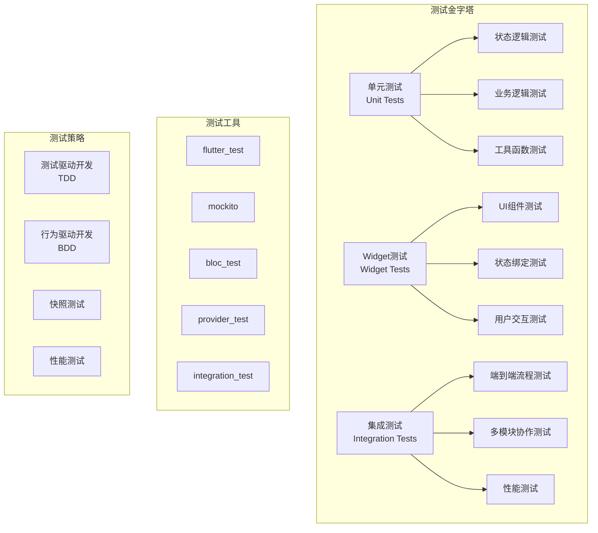

# 状态管理测试

本文档详细介绍如何为不同的状态管理方案编写全面的测试，包括单元测试、Widget测试和集成测试。

## 1. 测试架构概览



## 2. Provider 测试

### 2.1 基础 Provider 测试

```dart
import 'package:flutter_test/flutter_test.dart';
import 'package:provider/provider.dart';
import 'package:flutter/material.dart';

// 被测试的 Provider
class CounterProvider extends ChangeNotifier {
  int _count = 0;
  int get count => _count;
  
  void increment() {
    _count++;
    notifyListeners();
  }
  
  void decrement() {
    _count--;
    notifyListeners();
  }
  
  void reset() {
    _count = 0;
    notifyListeners();
  }
}

void main() {
  group('CounterProvider Tests', () {
    late CounterProvider provider;
    
    setUp(() {
      provider = CounterProvider();
    });
    
    test('初始计数应该为0', () {
      expect(provider.count, 0);
    });
    
    test('增加计数应该正确工作', () {
      provider.increment();
      expect(provider.count, 1);
      
      provider.increment();
      expect(provider.count, 2);
    });
    
    test('减少计数应该正确工作', () {
      provider.increment();
      provider.increment();
      provider.decrement();
      
      expect(provider.count, 1);
    });
    
    test('重置计数应该正确工作', () {
      provider.increment();
      provider.increment();
      provider.reset();
      
      expect(provider.count, 0);
    });
    
    test('应该正确通知监听者', () {
      bool notified = false;
      provider.addListener(() {
        notified = true;
      });
      
      provider.increment();
      expect(notified, true);
    });
  });
}
```

### 2.2 复杂 Provider 测试

```dart
// 复杂的 Provider 示例
class TodoProvider extends ChangeNotifier {
  final List<Todo> _todos = [];
  bool _isLoading = false;
  String? _error;
  
  List<Todo> get todos => List.unmodifiable(_todos);
  bool get isLoading => _isLoading;
  String? get error => _error;
  
  List<Todo> get completedTodos => 
      _todos.where((todo) => todo.isCompleted).toList();
  
  List<Todo> get pendingTodos => 
      _todos.where((todo) => !todo.isCompleted).toList();
  
  Future<void> loadTodos() async {
    _isLoading = true;
    _error = null;
    notifyListeners();
    
    try {
      // 模拟API调用
      await Future.delayed(const Duration(seconds: 1));
      _todos.addAll([
        Todo(id: '1', title: '学习Flutter', isCompleted: false),
        Todo(id: '2', title: '写测试', isCompleted: true),
      ]);
    } catch (e) {
      _error = e.toString();
    } finally {
      _isLoading = false;
      notifyListeners();
    }
  }
  
  void addTodo(String title) {
    final todo = Todo(
      id: DateTime.now().millisecondsSinceEpoch.toString(),
      title: title,
      isCompleted: false,
    );
    _todos.add(todo);
    notifyListeners();
  }
  
  void toggleTodo(String id) {
    final index = _todos.indexWhere((todo) => todo.id == id);
    if (index != -1) {
      _todos[index] = _todos[index].copyWith(
        isCompleted: !_todos[index].isCompleted,
      );
      notifyListeners();
    }
  }
  
  void removeTodo(String id) {
    _todos.removeWhere((todo) => todo.id == id);
    notifyListeners();
  }
}

// 测试
void main() {
  group('TodoProvider Tests', () {
    late TodoProvider provider;
    
    setUp(() {
      provider = TodoProvider();
    });
    
    test('初始状态应该正确', () {
      expect(provider.todos, isEmpty);
      expect(provider.isLoading, false);
      expect(provider.error, null);
    });
    
    test('添加待办事项应该正确工作', () {
      provider.addTodo('测试任务');
      
      expect(provider.todos.length, 1);
      expect(provider.todos.first.title, '测试任务');
      expect(provider.todos.first.isCompleted, false);
    });
    
    test('切换待办事项状态应该正确工作', () {
      provider.addTodo('测试任务');
      final todoId = provider.todos.first.id;
      
      provider.toggleTodo(todoId);
      
      expect(provider.todos.first.isCompleted, true);
    });
    
    test('删除待办事项应该正确工作', () {
      provider.addTodo('测试任务');
      final todoId = provider.todos.first.id;
      
      provider.removeTodo(todoId);
      
      expect(provider.todos, isEmpty);
    });
    
    test('计算属性应该正确工作', () {
      provider.addTodo('任务1');
      provider.addTodo('任务2');
      provider.toggleTodo(provider.todos.first.id);
      
      expect(provider.completedTodos.length, 1);
      expect(provider.pendingTodos.length, 1);
    });
    
    test('加载待办事项应该正确处理状态', () async {
      final future = provider.loadTodos();
      
      // 检查加载状态
      expect(provider.isLoading, true);
      expect(provider.error, null);
      
      await future;
      
      // 检查完成状态
      expect(provider.isLoading, false);
      expect(provider.todos.length, 2);
    });
  });
}
```

### 2.3 Provider Widget 测试

```dart
import 'package:flutter/material.dart';
import 'package:flutter_test/flutter_test.dart';
import 'package:provider/provider.dart';

// 被测试的 Widget
class CounterWidget extends StatelessWidget {
  @override
  Widget build(BuildContext context) {
    return Scaffold(
      appBar: AppBar(title: const Text('计数器')),
      body: Center(
        child: Consumer<CounterProvider>(
          builder: (context, provider, child) {
            return Column(
              mainAxisAlignment: MainAxisAlignment.center,
              children: [
                Text(
                  '${provider.count}',
                  style: const TextStyle(fontSize: 48),
                ),
                if (provider.count > 10)
                  const Text(
                    '计数很大！',
                    style: TextStyle(color: Colors.red),
                  ),
              ],
            );
          },
        ),
      ),
      floatingActionButton: Column(
        mainAxisAlignment: MainAxisAlignment.end,
        children: [
          FloatingActionButton(
            key: const Key('increment'),
            onPressed: () => context.read<CounterProvider>().increment(),
            child: const Icon(Icons.add),
          ),
          const SizedBox(height: 8),
          FloatingActionButton(
            key: const Key('decrement'),
            onPressed: () => context.read<CounterProvider>().decrement(),
            child: const Icon(Icons.remove),
          ),
        ],
      ),
    );
  }
}

void main() {
  group('CounterWidget Tests', () {
    testWidgets('应该显示初始计数', (WidgetTester tester) async {
      await tester.pumpWidget(
        ChangeNotifierProvider(
          create: (_) => CounterProvider(),
          child: MaterialApp(home: CounterWidget()),
        ),
      );
      
      expect(find.text('0'), findsOneWidget);
      expect(find.text('计数很大！'), findsNothing);
    });
    
    testWidgets('点击增加按钮应该增加计数', (WidgetTester tester) async {
      await tester.pumpWidget(
        ChangeNotifierProvider(
          create: (_) => CounterProvider(),
          child: MaterialApp(home: CounterWidget()),
        ),
      );
      
      await tester.tap(find.byKey(const Key('increment')));
      await tester.pump();
      
      expect(find.text('1'), findsOneWidget);
    });
    
    testWidgets('计数大于10时应该显示警告', (WidgetTester tester) async {
      final provider = CounterProvider();
      
      await tester.pumpWidget(
        ChangeNotifierProvider.value(
          value: provider,
          child: MaterialApp(home: CounterWidget()),
        ),
      );
      
      // 设置计数为11
      for (int i = 0; i < 11; i++) {
        provider.increment();
      }
      await tester.pump();
      
      expect(find.text('11'), findsOneWidget);
      expect(find.text('计数很大！'), findsOneWidget);
    });
    
    testWidgets('点击减少按钮应该减少计数', (WidgetTester tester) async {
      final provider = CounterProvider();
      provider.increment();
      provider.increment();
      
      await tester.pumpWidget(
        ChangeNotifierProvider.value(
          value: provider,
          child: MaterialApp(home: CounterWidget()),
        ),
      );
      
      expect(find.text('2'), findsOneWidget);
      
      await tester.tap(find.byKey(const Key('decrement')));
      await tester.pump();
      
      expect(find.text('1'), findsOneWidget);
    });
  });
}
```

## 3. Riverpod 测试

### 3.1 基础 Riverpod 测试

```dart
import 'package:flutter_test/flutter_test.dart';
import 'package:flutter_riverpod/flutter_riverpod.dart';

// 被测试的 Providers
final counterProvider = StateProvider<int>((ref) => 0);

final doubledCounterProvider = Provider<int>((ref) {
  final count = ref.watch(counterProvider);
  return count * 2;
});

class CounterNotifier extends StateNotifier<int> {
  CounterNotifier() : super(0);
  
  void increment() => state++;
  void decrement() => state--;
  void reset() => state = 0;
}

final counterNotifierProvider = 
    StateNotifierProvider<CounterNotifier, int>((ref) {
  return CounterNotifier();
});

void main() {
  group('Riverpod Provider Tests', () {
    test('StateProvider 应该有正确的初始值', () {
      final container = ProviderContainer();
      addTearDown(container.dispose);
      
      expect(container.read(counterProvider), 0);
    });
    
    test('StateProvider 应该能够更新状态', () {
      final container = ProviderContainer();
      addTearDown(container.dispose);
      
      container.read(counterProvider.notifier).state = 5;
      
      expect(container.read(counterProvider), 5);
    });
    
    test('计算 Provider 应该正确计算值', () {
      final container = ProviderContainer();
      addTearDown(container.dispose);
      
      container.read(counterProvider.notifier).state = 3;
      
      expect(container.read(doubledCounterProvider), 6);
    });
    
    test('StateNotifier 应该正确管理状态', () {
      final container = ProviderContainer();
      addTearDown(container.dispose);
      
      final notifier = container.read(counterNotifierProvider.notifier);
      
      expect(container.read(counterNotifierProvider), 0);
      
      notifier.increment();
      expect(container.read(counterNotifierProvider), 1);
      
      notifier.decrement();
      expect(container.read(counterNotifierProvider), 0);
      
      notifier.reset();
      expect(container.read(counterNotifierProvider), 0);
    });
    
    test('应该能够监听状态变化', () {
      final container = ProviderContainer();
      addTearDown(container.dispose);
      
      final states = <int>[];
      
      container.listen<int>(
        counterProvider,
        (previous, next) {
          states.add(next);
        },
      );
      
      container.read(counterProvider.notifier).state = 1;
      container.read(counterProvider.notifier).state = 2;
      
      expect(states, [1, 2]);
    });
  });
}
```

### 3.2 异步 Provider 测试

```dart
// 异步 Provider 示例
final userRepositoryProvider = Provider<UserRepository>((ref) {
  return UserRepository();
});

final userProvider = FutureProvider.family<User, String>((ref, userId) async {
  final repository = ref.read(userRepositoryProvider);
  return repository.getUser(userId);
});

final usersProvider = StreamProvider<List<User>>((ref) {
  final repository = ref.read(userRepositoryProvider);
  return repository.getUsersStream();
});

class UserRepository {
  Future<User> getUser(String id) async {
    await Future.delayed(const Duration(milliseconds: 100));
    return User(id: id, name: 'User $id');
  }
  
  Stream<List<User>> getUsersStream() async* {
    yield [];
    await Future.delayed(const Duration(milliseconds: 100));
    yield [User(id: '1', name: 'User 1')];
    await Future.delayed(const Duration(milliseconds: 100));
    yield [User(id: '1', name: 'User 1'), User(id: '2', name: 'User 2')];
  }
}

void main() {
  group('异步 Riverpod Provider Tests', () {
    test('FutureProvider 应该正确加载数据', () async {
      final container = ProviderContainer();
      addTearDown(container.dispose);
      
      final future = container.read(userProvider('123').future);
      final user = await future;
      
      expect(user.id, '123');
      expect(user.name, 'User 123');
    });
    
    test('FutureProvider 应该处理加载状态', () async {
      final container = ProviderContainer();
      addTearDown(container.dispose);
      
      final asyncValue = container.read(userProvider('123'));
      
      expect(asyncValue, const AsyncValue<User>.loading());
      
      await container.read(userProvider('123').future);
      
      final completedValue = container.read(userProvider('123'));
      expect(completedValue.hasValue, true);
      expect(completedValue.value?.id, '123');
    });
    
    test('StreamProvider 应该正确处理流数据', () async {
      final container = ProviderContainer();
      addTearDown(container.dispose);
      
      final states = <AsyncValue<List<User>>>[];
      
      container.listen<AsyncValue<List<User>>>(
        usersProvider,
        (previous, next) {
          states.add(next);
        },
      );
      
      // 等待流完成
      await Future.delayed(const Duration(milliseconds: 300));
      
      expect(states.length, greaterThan(0));
      expect(states.last.hasValue, true);
      expect(states.last.value?.length, 2);
    });
  });
}
```

### 3.3 Riverpod Widget 测试

```dart
import 'package:flutter/material.dart';
import 'package:flutter_test/flutter_test.dart';
import 'package:flutter_riverpod/flutter_riverpod.dart';

// 被测试的 Widget
class CounterWidget extends ConsumerWidget {
  @override
  Widget build(BuildContext context, WidgetRef ref) {
    final count = ref.watch(counterProvider);
    
    return Scaffold(
      appBar: AppBar(title: const Text('计数器')),
      body: Center(
        child: Text(
          '$count',
          style: const TextStyle(fontSize: 48),
        ),
      ),
      floatingActionButton: FloatingActionButton(
        onPressed: () => ref.read(counterProvider.notifier).state++,
        child: const Icon(Icons.add),
      ),
    );
  }
}

void main() {
  group('Riverpod CounterWidget Tests', () {
    testWidgets('应该显示初始计数', (WidgetTester tester) async {
      await tester.pumpWidget(
        ProviderScope(
          child: MaterialApp(home: CounterWidget()),
        ),
      );
      
      expect(find.text('0'), findsOneWidget);
    });
    
    testWidgets('点击按钮应该增加计数', (WidgetTester tester) async {
      await tester.pumpWidget(
        ProviderScope(
          child: MaterialApp(home: CounterWidget()),
        ),
      );
      
      await tester.tap(find.byType(FloatingActionButton));
      await tester.pump();
      
      expect(find.text('1'), findsOneWidget);
    });
    
    testWidgets('应该能够覆盖 Provider 进行测试', (WidgetTester tester) async {
      await tester.pumpWidget(
        ProviderScope(
          overrides: [
            counterProvider.overrideWith((ref) => 42),
          ],
          child: MaterialApp(home: CounterWidget()),
        ),
      );
      
      expect(find.text('42'), findsOneWidget);
    });
  });
}
```

## 4. Bloc 测试

### 4.1 基础 Bloc 测试

```dart
import 'package:bloc_test/bloc_test.dart';
import 'package:flutter_test/flutter_test.dart';

// 被测试的 Bloc
abstract class CounterEvent {}
class CounterIncremented extends CounterEvent {}
class CounterDecremented extends CounterEvent {}
class CounterReset extends CounterEvent {}

class CounterBloc extends Bloc<CounterEvent, int> {
  CounterBloc() : super(0) {
    on<CounterIncremented>((event, emit) => emit(state + 1));
    on<CounterDecremented>((event, emit) => emit(state - 1));
    on<CounterReset>((event, emit) => emit(0));
  }
}

void main() {
  group('CounterBloc Tests', () {
    late CounterBloc counterBloc;
    
    setUp(() {
      counterBloc = CounterBloc();
    });
    
    tearDown(() {
      counterBloc.close();
    });
    
    test('初始状态应该为0', () {
      expect(counterBloc.state, 0);
    });
    
    blocTest<CounterBloc, int>(
      '增加事件应该发出 [1]',
      build: () => CounterBloc(),
      act: (bloc) => bloc.add(CounterIncremented()),
      expect: () => [1],
    );
    
    blocTest<CounterBloc, int>(
      '多个增加事件应该发出 [1, 2, 3]',
      build: () => CounterBloc(),
      act: (bloc) {
        bloc.add(CounterIncremented());
        bloc.add(CounterIncremented());
        bloc.add(CounterIncremented());
      },
      expect: () => [1, 2, 3],
    );
    
    blocTest<CounterBloc, int>(
      '减少事件应该发出 [2, 1]',
      build: () => CounterBloc(),
      seed: () => 2,
      act: (bloc) => bloc.add(CounterDecremented()),
      expect: () => [1],
    );
    
    blocTest<CounterBloc, int>(
      '重置事件应该发出 [0]',
      build: () => CounterBloc(),
      seed: () => 5,
      act: (bloc) => bloc.add(CounterReset()),
      expect: () => [0],
    );
  });
}
```

### 4.2 复杂 Bloc 测试

```dart
// 复杂的 Bloc 示例
abstract class TodoEvent {}
class TodosLoaded extends TodoEvent {}
class TodoAdded extends TodoEvent {
  final String title;
  TodoAdded(this.title);
}
class TodoToggled extends TodoEvent {
  final String id;
  TodoToggled(this.id);
}
class TodoDeleted extends TodoEvent {
  final String id;
  TodoDeleted(this.id);
}

class TodoState {
  final List<Todo> todos;
  final bool isLoading;
  final String? error;
  
  const TodoState({
    this.todos = const [],
    this.isLoading = false,
    this.error,
  });
  
  TodoState copyWith({
    List<Todo>? todos,
    bool? isLoading,
    String? error,
  }) {
    return TodoState(
      todos: todos ?? this.todos,
      isLoading: isLoading ?? this.isLoading,
      error: error ?? this.error,
    );
  }
  
  @override
  bool operator ==(Object other) {
    if (identical(this, other)) return true;
    return other is TodoState &&
        listEquals(other.todos, todos) &&
        other.isLoading == isLoading &&
        other.error == error;
  }
  
  @override
  int get hashCode => todos.hashCode ^ isLoading.hashCode ^ error.hashCode;
}

class TodoBloc extends Bloc<TodoEvent, TodoState> {
  final TodoRepository repository;
  
  TodoBloc({required this.repository}) : super(const TodoState()) {
    on<TodosLoaded>(_onTodosLoaded);
    on<TodoAdded>(_onTodoAdded);
    on<TodoToggled>(_onTodoToggled);
    on<TodoDeleted>(_onTodoDeleted);
  }
  
  Future<void> _onTodosLoaded(
    TodosLoaded event,
    Emitter<TodoState> emit,
  ) async {
    emit(state.copyWith(isLoading: true));
    
    try {
      final todos = await repository.getTodos();
      emit(state.copyWith(
        todos: todos,
        isLoading: false,
      ));
    } catch (error) {
      emit(state.copyWith(
        isLoading: false,
        error: error.toString(),
      ));
    }
  }
  
  void _onTodoAdded(
    TodoAdded event,
    Emitter<TodoState> emit,
  ) {
    final todo = Todo(
      id: DateTime.now().millisecondsSinceEpoch.toString(),
      title: event.title,
      isCompleted: false,
    );
    
    emit(state.copyWith(
      todos: [...state.todos, todo],
    ));
  }
  
  void _onTodoToggled(
    TodoToggled event,
    Emitter<TodoState> emit,
  ) {
    final updatedTodos = state.todos.map((todo) {
      if (todo.id == event.id) {
        return todo.copyWith(isCompleted: !todo.isCompleted);
      }
      return todo;
    }).toList();
    
    emit(state.copyWith(todos: updatedTodos));
  }
  
  void _onTodoDeleted(
    TodoDeleted event,
    Emitter<TodoState> emit,
  ) {
    final updatedTodos = state.todos
        .where((todo) => todo.id != event.id)
        .toList();
    
    emit(state.copyWith(todos: updatedTodos));
  }
}

void main() {
  group('TodoBloc Tests', () {
    late TodoRepository mockRepository;
    late TodoBloc todoBloc;
    
    setUp(() {
      mockRepository = MockTodoRepository();
      todoBloc = TodoBloc(repository: mockRepository);
    });
    
    tearDown(() {
      todoBloc.close();
    });
    
    test('初始状态应该正确', () {
      expect(todoBloc.state, const TodoState());
    });
    
    group('TodosLoaded', () {
      blocTest<TodoBloc, TodoState>(
        '成功加载待办事项',
        build: () {
          when(() => mockRepository.getTodos())
              .thenAnswer((_) async => [
                    Todo(id: '1', title: '测试', isCompleted: false),
                  ]);
          return todoBloc;
        },
        act: (bloc) => bloc.add(TodosLoaded()),
        expect: () => [
          const TodoState(isLoading: true),
          TodoState(
            todos: [Todo(id: '1', title: '测试', isCompleted: false)],
            isLoading: false,
          ),
        ],
      );
      
      blocTest<TodoBloc, TodoState>(
        '加载失败时应该设置错误',
        build: () {
          when(() => mockRepository.getTodos())
              .thenThrow(Exception('网络错误'));
          return todoBloc;
        },
        act: (bloc) => bloc.add(TodosLoaded()),
        expect: () => [
          const TodoState(isLoading: true),
          const TodoState(
            isLoading: false,
            error: 'Exception: 网络错误',
          ),
        ],
      );
    });
    
    blocTest<TodoBloc, TodoState>(
      '添加待办事项应该正确工作',
      build: () => todoBloc,
      act: (bloc) => bloc.add(TodoAdded('新任务')),
      expect: () => [
        TodoState(
          todos: [
            Todo(
              id: any(named: 'id'),
              title: '新任务',
              isCompleted: false,
            ),
          ],
        ),
      ],
    );
    
    blocTest<TodoBloc, TodoState>(
      '切换待办事项状态应该正确工作',
      build: () => todoBloc,
      seed: () => TodoState(
        todos: [Todo(id: '1', title: '测试', isCompleted: false)],
      ),
      act: (bloc) => bloc.add(TodoToggled('1')),
      expect: () => [
        TodoState(
          todos: [Todo(id: '1', title: '测试', isCompleted: true)],
        ),
      ],
    );
    
    blocTest<TodoBloc, TodoState>(
      '删除待办事项应该正确工作',
      build: () => todoBloc,
      seed: () => TodoState(
        todos: [
          Todo(id: '1', title: '测试1', isCompleted: false),
          Todo(id: '2', title: '测试2', isCompleted: false),
        ],
      ),
      act: (bloc) => bloc.add(TodoDeleted('1')),
      expect: () => [
        TodoState(
          todos: [Todo(id: '2', title: '测试2', isCompleted: false)],
        ),
      ],
    );
  });
}
```

### 4.3 Bloc Widget 测试

```dart
import 'package:flutter/material.dart';
import 'package:flutter_test/flutter_test.dart';
import 'package:flutter_bloc/flutter_bloc.dart';
import 'package:mocktail/mocktail.dart';

// 被测试的 Widget
class CounterPage extends StatelessWidget {
  @override
  Widget build(BuildContext context) {
    return Scaffold(
      appBar: AppBar(title: const Text('计数器')),
      body: BlocBuilder<CounterBloc, int>(
        builder: (context, count) {
          return Center(
            child: Text(
              '$count',
              style: const TextStyle(fontSize: 48),
            ),
          );
        },
      ),
      floatingActionButton: Column(
        mainAxisAlignment: MainAxisAlignment.end,
        children: [
          FloatingActionButton(
            key: const Key('increment'),
            onPressed: () => context.read<CounterBloc>().add(CounterIncremented()),
            child: const Icon(Icons.add),
          ),
          const SizedBox(height: 8),
          FloatingActionButton(
            key: const Key('decrement'),
            onPressed: () => context.read<CounterBloc>().add(CounterDecremented()),
            child: const Icon(Icons.remove),
          ),
        ],
      ),
    );
  }
}

class MockCounterBloc extends MockBloc<CounterEvent, int>
    implements CounterBloc {}

void main() {
  group('CounterPage Widget Tests', () {
    late MockCounterBloc mockCounterBloc;
    
    setUp(() {
      mockCounterBloc = MockCounterBloc();
    });
    
    testWidgets('应该显示当前计数', (WidgetTester tester) async {
      when(() => mockCounterBloc.state).thenReturn(42);
      
      await tester.pumpWidget(
        MaterialApp(
          home: BlocProvider.value(
            value: mockCounterBloc,
            child: CounterPage(),
          ),
        ),
      );
      
      expect(find.text('42'), findsOneWidget);
    });
    
    testWidgets('点击增加按钮应该添加增加事件', (WidgetTester tester) async {
      when(() => mockCounterBloc.state).thenReturn(0);
      
      await tester.pumpWidget(
        MaterialApp(
          home: BlocProvider.value(
            value: mockCounterBloc,
            child: CounterPage(),
          ),
        ),
      );
      
      await tester.tap(find.byKey(const Key('increment')));
      
      verify(() => mockCounterBloc.add(any(that: isA<CounterIncremented>())))
          .called(1);
    });
    
    testWidgets('点击减少按钮应该添加减少事件', (WidgetTester tester) async {
      when(() => mockCounterBloc.state).thenReturn(0);
      
      await tester.pumpWidget(
        MaterialApp(
          home: BlocProvider.value(
            value: mockCounterBloc,
            child: CounterPage(),
          ),
        ),
      );
      
      await tester.tap(find.byKey(const Key('decrement')));
      
      verify(() => mockCounterBloc.add(any(that: isA<CounterDecremented>())))
          .called(1);
    });
  });
}
```

## 5. GetX 测试

### 5.1 基础 GetX 测试

```dart
import 'package:flutter_test/flutter_test.dart';
import 'package:get/get.dart';

// 被测试的 Controller
class CounterController extends GetxController {
  var count = 0.obs;
  
  void increment() => count++;
  void decrement() => count--;
  void reset() => count.value = 0;
}

void main() {
  group('CounterController Tests', () {
    late CounterController controller;
    
    setUp(() {
      controller = CounterController();
    });
    
    tearDown(() {
      Get.reset();
    });
    
    test('初始计数应该为0', () {
      expect(controller.count.value, 0);
    });
    
    test('增加计数应该正确工作', () {
      controller.increment();
      expect(controller.count.value, 1);
      
      controller.increment();
      expect(controller.count.value, 2);
    });
    
    test('减少计数应该正确工作', () {
      controller.increment();
      controller.increment();
      controller.decrement();
      
      expect(controller.count.value, 1);
    });
    
    test('重置计数应该正确工作', () {
      controller.increment();
      controller.increment();
      controller.reset();
      
      expect(controller.count.value, 0);
    });
    
    test('响应式变量应该能够监听变化', () {
      final values = <int>[];
      
      controller.count.listen((value) {
        values.add(value);
      });
      
      controller.increment();
      controller.increment();
      
      expect(values, [1, 2]);
    });
  });
}
```

### 5.2 复杂 GetX 测试

```dart
// 复杂的 Controller 示例
class TodoController extends GetxController {
  var todos = <Todo>[].obs;
  var isLoading = false.obs;
  var errorMessage = ''.obs;
  
  List<Todo> get completedTodos => todos.where((todo) => todo.isCompleted).toList();
  List<Todo> get pendingTodos => todos.where((todo) => !todo.isCompleted).toList();
  
  @override
  void onInit() {
    super.onInit();
    loadTodos();
  }
  
  Future<void> loadTodos() async {
    try {
      isLoading.value = true;
      errorMessage.value = '';
      
      // 模拟API调用
      await Future.delayed(const Duration(milliseconds: 100));
      
      todos.value = [
        Todo(id: '1', title: '学习Flutter', isCompleted: false),
        Todo(id: '2', title: '写测试', isCompleted: true),
      ];
    } catch (error) {
      errorMessage.value = error.toString();
    } finally {
      isLoading.value = false;
    }
  }
  
  void addTodo(String title) {
    if (title.trim().isEmpty) return;
    
    final todo = Todo(
      id: DateTime.now().millisecondsSinceEpoch.toString(),
      title: title.trim(),
      isCompleted: false,
    );
    
    todos.add(todo);
  }
  
  void toggleTodo(String id) {
    final index = todos.indexWhere((todo) => todo.id == id);
    if (index != -1) {
      todos[index] = todos[index].copyWith(
        isCompleted: !todos[index].isCompleted,
      );
      todos.refresh();
    }
  }
  
  void removeTodo(String id) {
    todos.removeWhere((todo) => todo.id == id);
  }
}

void main() {
  group('TodoController Tests', () {
    late TodoController controller;
    
    setUp(() {
      controller = TodoController();
    });
    
    tearDown(() {
      Get.reset();
    });
    
    test('初始状态应该正确', () {
      expect(controller.todos, isEmpty);
      expect(controller.isLoading.value, false);
      expect(controller.errorMessage.value, '');
    });
    
    test('onInit 应该加载待办事项', () async {
      // 等待 onInit 中的异步操作完成
      await Future.delayed(const Duration(milliseconds: 150));
      
      expect(controller.todos.length, 2);
      expect(controller.isLoading.value, false);
    });
    
    test('添加待办事项应该正确工作', () {
      controller.addTodo('新任务');
      
      expect(controller.todos.length, 1);
      expect(controller.todos.first.title, '新任务');
      expect(controller.todos.first.isCompleted, false);
    });
    
    test('不应该添加空的待办事项', () {
      controller.addTodo('');
      controller.addTodo('   ');
      
      expect(controller.todos, isEmpty);
    });
    
    test('切换待办事项状态应该正确工作', () {
      controller.addTodo('测试任务');
      final todoId = controller.todos.first.id;
      
      controller.toggleTodo(todoId);
      
      expect(controller.todos.first.isCompleted, true);
    });
    
    test('删除待办事项应该正确工作', () {
      controller.addTodo('测试任务');
      final todoId = controller.todos.first.id;
      
      controller.removeTodo(todoId);
      
      expect(controller.todos, isEmpty);
    });
    
    test('计算属性应该正确工作', () {
      controller.addTodo('任务1');
      controller.addTodo('任务2');
      controller.toggleTodo(controller.todos.first.id);
      
      expect(controller.completedTodos.length, 1);
      expect(controller.pendingTodos.length, 1);
    });
  });
}
```

### 5.3 GetX Widget 测试

```dart
import 'package:flutter/material.dart';
import 'package:flutter_test/flutter_test.dart';
import 'package:get/get.dart';

// 被测试的 Widget
class CounterPage extends StatelessWidget {
  final CounterController controller = Get.put(CounterController());
  
  @override
  Widget build(BuildContext context) {
    return Scaffold(
      appBar: AppBar(title: const Text('计数器')),
      body: Center(
        child: Obx(() => Text(
          '${controller.count}',
          style: const TextStyle(fontSize: 48),
        )),
      ),
      floatingActionButton: FloatingActionButton(
        onPressed: controller.increment,
        child: const Icon(Icons.add),
      ),
    );
  }
}

void main() {
  group('CounterPage Widget Tests', () {
    setUp(() {
      Get.testMode = true;
    });
    
    tearDown(() {
      Get.reset();
    });
    
    testWidgets('应该显示初始计数', (WidgetTester tester) async {
      await tester.pumpWidget(
        GetMaterialApp(home: CounterPage()),
      );
      
      expect(find.text('0'), findsOneWidget);
    });
    
    testWidgets('点击按钮应该增加计数', (WidgetTester tester) async {
      await tester.pumpWidget(
        GetMaterialApp(home: CounterPage()),
      );
      
      await tester.tap(find.byType(FloatingActionButton));
      await tester.pump();
      
      expect(find.text('1'), findsOneWidget);
    });
    
    testWidgets('应该能够注入模拟控制器', (WidgetTester tester) async {
      final mockController = CounterController();
      mockController.count.value = 42;
      
      Get.put<CounterController>(mockController);
      
      await tester.pumpWidget(
        GetMaterialApp(home: CounterPage()),
      );
      
      expect(find.text('42'), findsOneWidget);
    });
  });
}
```

## 6. 集成测试

### 6.1 端到端测试

```dart
import 'package:flutter/material.dart';
import 'package:flutter_test/flutter_test.dart';
import 'package:integration_test/integration_test.dart';

void main() {
  IntegrationTestWidgetsFlutterBinding.ensureInitialized();
  
  group('待办事项应用集成测试', () {
    testWidgets('完整的待办事项流程', (WidgetTester tester) async {
      // 启动应用
      await tester.pumpWidget(MyApp());
      await tester.pumpAndSettle();
      
      // 验证初始状态
      expect(find.text('待办事项'), findsOneWidget);
      expect(find.byType(FloatingActionButton), findsOneWidget);
      
      // 添加新的待办事项
      await tester.tap(find.byType(FloatingActionButton));
      await tester.pumpAndSettle();
      
      // 输入待办事项标题
      await tester.enterText(find.byType(TextField), '集成测试任务');
      await tester.tap(find.text('添加'));
      await tester.pumpAndSettle();
      
      // 验证任务已添加
      expect(find.text('集成测试任务'), findsOneWidget);
      expect(find.byType(Checkbox), findsOneWidget);
      
      // 切换任务状态
      await tester.tap(find.byType(Checkbox));
      await tester.pumpAndSettle();
      
      // 验证任务已完成
      final checkbox = tester.widget<Checkbox>(find.byType(Checkbox));
      expect(checkbox.value, true);
      
      // 删除任务
      await tester.tap(find.byIcon(Icons.delete));
      await tester.pumpAndSettle();
      
      // 验证任务已删除
      expect(find.text('集成测试任务'), findsNothing);
    });
    
    testWidgets('网络错误处理', (WidgetTester tester) async {
      // 模拟网络错误
      await tester.pumpWidget(MyApp(simulateNetworkError: true));
      await tester.pumpAndSettle();
      
      // 等待错误显示
      await tester.pump(const Duration(seconds: 2));
      
      // 验证错误消息
      expect(find.text('网络错误'), findsOneWidget);
      expect(find.text('重试'), findsOneWidget);
      
      // 点击重试
      await tester.tap(find.text('重试'));
      await tester.pumpAndSettle();
      
      // 验证重新加载
      expect(find.byType(CircularProgressIndicator), findsOneWidget);
    });
  });
}
```

### 6.2 性能测试

```dart
import 'package:flutter/material.dart';
import 'package:flutter_test/flutter_test.dart';
import 'package:integration_test/integration_test.dart';

void main() {
  final binding = IntegrationTestWidgetsFlutterBinding.ensureInitialized();
  
  group('性能测试', () {
    testWidgets('大量数据渲染性能', (WidgetTester tester) async {
      await tester.pumpWidget(MyApp());
      await tester.pumpAndSettle();
      
      // 开始性能监控
      await binding.traceAction(() async {
        // 添加大量待办事项
        for (int i = 0; i < 1000; i++) {
          await tester.tap(find.byType(FloatingActionButton));
          await tester.pumpAndSettle();
          
          await tester.enterText(find.byType(TextField), '任务 $i');
          await tester.tap(find.text('添加'));
          await tester.pumpAndSettle();
        }
        
        // 滚动列表
        await tester.fling(
          find.byType(ListView),
          const Offset(0, -500),
          1000,
        );
        await tester.pumpAndSettle();
      }, reportKey: 'large_list_performance');
    });
    
    testWidgets('状态更新性能', (WidgetTester tester) async {
      await tester.pumpWidget(MyApp());
      await tester.pumpAndSettle();
      
      // 监控状态更新性能
      await binding.traceAction(() async {
        // 快速连续更新状态
        for (int i = 0; i < 100; i++) {
          await tester.tap(find.byIcon(Icons.add));
          await tester.pump();
        }
      }, reportKey: 'state_update_performance');
    });
  });
}
```

## 7. 测试工具和辅助函数

### 7.1 测试辅助函数

```dart
// 测试辅助函数
class TestHelpers {
  // 创建测试用的 Widget
  static Widget createTestWidget(Widget child) {
    return MaterialApp(
      home: Scaffold(body: child),
    );
  }
  
  // 创建带 Provider 的测试 Widget
  static Widget createProviderTestWidget<T extends ChangeNotifier>(
    T provider,
    Widget child,
  ) {
    return ChangeNotifierProvider<T>.value(
      value: provider,
      child: MaterialApp(home: child),
    );
  }
  
  // 创建带 Riverpod 的测试 Widget
  static Widget createRiverpodTestWidget(
    Widget child, {
    List<Override> overrides = const [],
  }) {
    return ProviderScope(
      overrides: overrides,
      child: MaterialApp(home: child),
    );
  }
  
  // 创建带 Bloc 的测试 Widget
  static Widget createBlocTestWidget<B extends BlocBase<S>, S>(
    B bloc,
    Widget child,
  ) {
    return BlocProvider<B>.value(
      value: bloc,
      child: MaterialApp(home: child),
    );
  }
  
  // 等待异步操作完成
  static Future<void> waitForAsync(WidgetTester tester) async {
    await tester.pump();
    await tester.pump(const Duration(seconds: 1));
  }
  
  // 查找并点击按钮
  static Future<void> tapButton(
    WidgetTester tester,
    String text,
  ) async {
    await tester.tap(find.text(text));
    await tester.pump();
  }
  
  // 输入文本
  static Future<void> enterText(
    WidgetTester tester,
    String text,
  ) async {
    await tester.enterText(find.byType(TextField), text);
    await tester.pump();
  }
}

// Mock 数据生成器
class MockDataGenerator {
  static List<Todo> generateTodos(int count) {
    return List.generate(count, (index) => Todo(
      id: 'todo_$index',
      title: '待办事项 $index',
      isCompleted: index % 2 == 0,
    ));
  }
  
  static User generateUser({String? id, String? name}) {
    return User(
      id: id ?? 'user_123',
      name: name ?? '测试用户',
      email: 'test@example.com',
    );
  }
}

// 自定义匹配器
class CustomMatchers {
  static Matcher hasLength(int length) {
    return predicate<List>(
      (list) => list.length == length,
      'has length of $length',
    );
  }
  
  static Matcher isLoading() {
    return predicate<bool>(
      (value) => value == true,
      'is loading',
    );
  }
  
  static Matcher hasError() {
    return predicate<String?>(
      (error) => error != null && error.isNotEmpty,
      'has error',
    );
  }
}
```

### 7.2 Mock 服务

```dart
// Mock Repository
class MockTodoRepository extends Mock implements TodoRepository {
  @override
  Future<List<Todo>> getTodos() async {
    return MockDataGenerator.generateTodos(5);
  }
  
  @override
  Future<void> addTodo(Todo todo) async {
    // Mock implementation
  }
  
  @override
  Future<void> updateTodo(Todo todo) async {
    // Mock implementation
  }
  
  @override
  Future<void> deleteTodo(String id) async {
    // Mock implementation
  }
}

// Mock API Service
class MockApiService extends Mock implements ApiService {
  @override
  Future<ApiResponse<List<Todo>>> fetchTodos() async {
    return ApiResponse.success(MockDataGenerator.generateTodos(3));
  }
  
  @override
  Future<ApiResponse<Todo>> createTodo(CreateTodoRequest request) async {
    return ApiResponse.success(
      Todo(
        id: 'new_todo',
        title: request.title,
        isCompleted: false,
      ),
    );
  }
}
```

## 8. 测试最佳实践

### 8.1 测试组织

```dart
// 好的测试组织
void main() {
  group('UserController', () {
    late UserController controller;
    late MockUserRepository mockRepository;
    
    setUp(() {
      mockRepository = MockUserRepository();
      controller = UserController(repository: mockRepository);
    });
    
    tearDown(() {
      controller.dispose();
    });
    
    group('loadUser', () {
      test('成功加载用户时应该更新状态', () async {
        // Arrange
        final user = MockDataGenerator.generateUser();
        when(() => mockRepository.getUser(any()))
            .thenAnswer((_) async => user);
        
        // Act
        await controller.loadUser('123');
        
        // Assert
        expect(controller.user, user);
        expect(controller.isLoading, false);
        expect(controller.error, null);
      });
      
      test('加载失败时应该设置错误状态', () async {
        // Arrange
        when(() => mockRepository.getUser(any()))
            .thenThrow(Exception('网络错误'));
        
        // Act
        await controller.loadUser('123');
        
        // Assert
        expect(controller.user, null);
        expect(controller.isLoading, false);
        expect(controller.error, isNotNull);
      });
    });
    
    group('updateUser', () {
      // 更新用户相关的测试
    });
  });
}
```

### 8.2 测试命名规范

```dart
// 好的测试命名
test('当用户未登录时应该重定向到登录页面', () {});
test('当输入有效邮箱时应该验证通过', () {});
test('当网络请求失败时应该显示错误消息', () {});

// 避免的测试命名
test('测试登录', () {});
test('用户测试', () {});
test('测试1', () {});
```

### 8.3 测试数据管理

```dart
// 测试数据常量
class TestData {
  static const validEmail = 'test@example.com';
  static const invalidEmail = 'invalid-email';
  static const validPassword = 'password123';
  static const shortPassword = '123';
  
  static final sampleUser = User(
    id: '123',
    name: '测试用户',
    email: validEmail,
  );
  
  static final sampleTodos = [
    Todo(id: '1', title: '任务1', isCompleted: false),
    Todo(id: '2', title: '任务2', isCompleted: true),
  ];
}

// 使用测试数据
test('应该验证有效邮箱', () {
  final result = EmailValidator.validate(TestData.validEmail);
  expect(result, true);
});
```

### 8.4 异步测试处理

```dart
// 正确处理异步测试
test('异步操作应该正确完成', () async {
  // 使用 async/await
  final result = await controller.loadData();
  expect(result, isNotNull);
});

// 测试 Stream
test('Stream 应该发出正确的值', () async {
  final stream = controller.dataStream;
  
  expectLater(
    stream,
    emitsInOrder([
      isA<LoadingState>(),
      isA<SuccessState>(),
    ]),
  );
  
  controller.loadData();
});

// 测试超时
test('操作应该在指定时间内完成', () async {
  await expectLater(
    controller.longRunningOperation(),
    completes,
    timeout: const Timeout(Duration(seconds: 5)),
  );
});
```

## 9. 持续集成中的测试

### 9.1 GitHub Actions 配置

```yaml
# .github/workflows/test.yml
name: Tests

on:
  push:
    branches: [ main, develop ]
  pull_request:
    branches: [ main ]

jobs:
  test:
    runs-on: ubuntu-latest
    
    steps:
    - uses: actions/checkout@v3
    
    - name: Setup Flutter
      uses: subosito/flutter-action@v2
      with:
        flutter-version: '3.16.0'
        
    - name: Install dependencies
      run: flutter pub get
      
    - name: Analyze code
      run: flutter analyze
      
    - name: Run unit tests
      run: flutter test --coverage
      
    - name: Upload coverage
      uses: codecov/codecov-action@v3
      with:
        file: coverage/lcov.info
        
  integration_test:
    runs-on: macos-latest
    
    steps:
    - uses: actions/checkout@v3
    
    - name: Setup Flutter
      uses: subosito/flutter-action@v2
      with:
        flutter-version: '3.16.0'
        
    - name: Install dependencies
      run: flutter pub get
      
    - name: Run integration tests
      run: flutter test integration_test/
```

### 9.2 测试覆盖率

```dart
// 生成测试覆盖率报告
// 运行命令: flutter test --coverage
// 查看报告: genhtml coverage/lcov.info -o coverage/html

// 覆盖率配置 - test/coverage_helper_test.dart
// @dart=2.12
import 'package:flutter_test/flutter_test.dart';

// 导入所有需要测试覆盖率的文件
import 'package:your_app/main.dart';
import 'package:your_app/providers/counter_provider.dart';
import 'package:your_app/providers/todo_provider.dart';
import 'package:your_app/controllers/user_controller.dart';
import 'package:your_app/blocs/counter_bloc.dart';
import 'package:your_app/blocs/todo_bloc.dart';
import 'package:your_app/services/api_service.dart';
import 'package:your_app/repositories/todo_repository.dart';
import 'package:your_app/models/todo.dart';
import 'package:your_app/models/user.dart';
import 'package:your_app/utils/validators.dart';
import 'package:your_app/widgets/todo_item.dart';
import 'package:your_app/pages/home_page.dart';
import 'package:your_app/pages/todo_page.dart';

void main() {
  test('coverage helper', () {
    // 这个测试不会运行，只是为了包含文件以计算覆盖率
  });
}
```

## 10. 调试和故障排除

### 10.1 常见测试问题

```dart
// 问题1: 异步操作未完成
// 错误示例
test('错误的异步测试', () {
  controller.loadData(); // 没有等待
  expect(controller.data, isNotNull); // 可能失败
});

// 正确示例
test('正确的异步测试', () async {
  await controller.loadData(); // 等待完成
  expect(controller.data, isNotNull);
});

// 问题2: Widget 测试中的异步操作
// 错误示例
testWidgets('错误的 Widget 测试', (tester) async {
  await tester.pumpWidget(MyWidget());
  await tester.tap(find.text('加载'));
  // 没有等待异步操作完成
  expect(find.text('数据'), findsOneWidget);
});

// 正确示例
testWidgets('正确的 Widget 测试', (tester) async {
  await tester.pumpWidget(MyWidget());
  await tester.tap(find.text('加载'));
  await tester.pumpAndSettle(); // 等待所有动画和异步操作完成
  expect(find.text('数据'), findsOneWidget);
});

// 问题3: Provider 依赖注入
// 错误示例
testWidgets('错误的 Provider 测试', (tester) async {
  await tester.pumpWidget(MyWidget()); // 缺少 Provider
  // 会抛出 ProviderNotFoundException
});

// 正确示例
testWidgets('正确的 Provider 测试', (tester) async {
  await tester.pumpWidget(
    ChangeNotifierProvider(
      create: (_) => MyProvider(),
      child: MyWidget(),
    ),
  );
});
```

### 10.2 测试调试技巧

```dart
// 调试技巧1: 打印状态
test('调试状态变化', () async {
  final provider = CounterProvider();
  
  provider.addListener(() {
    print('状态变化: ${provider.count}');
  });
  
  provider.increment();
  provider.increment();
  
  expect(provider.count, 2);
});

// 调试技巧2: 使用 debugDumpApp
testWidgets('调试 Widget 树', (tester) async {
  await tester.pumpWidget(MyApp());
  
  // 打印 Widget 树
  debugDumpApp();
  
  expect(find.text('Hello'), findsOneWidget);
});

// 调试技巧3: 截图调试
testWidgets('截图调试', (tester) async {
  await tester.pumpWidget(MyApp());
  
  // 生成截图
  await expectLater(
    find.byType(MyApp),
    matchesGoldenFile('my_app.png'),
  );
});

// 调试技巧4: 验证调用
test('验证方法调用', () {
  final mockRepository = MockTodoRepository();
  final controller = TodoController(repository: mockRepository);
  
  controller.loadTodos();
  
  // 验证方法被调用
  verify(() => mockRepository.getTodos()).called(1);
  
  // 验证方法未被调用
  verifyNever(() => mockRepository.deleteTodo(any()));
});
```

## 11. 总结

状态管理测试是确保 Flutter 应用质量的重要环节。通过本文档，你学习了：

### 11.1 核心概念
- 测试金字塔：单元测试、Widget 测试、集成测试
- 不同状态管理方案的测试策略
- Mock 和测试替身的使用

### 11.2 最佳实践
- **测试驱动开发**：先写测试，再写实现
- **测试隔离**：每个测试应该独立运行
- **清晰命名**：测试名称应该描述测试的行为
- **适当覆盖**：追求有意义的测试覆盖率

### 11.3 工具和技术
- `flutter_test`：Flutter 官方测试框架
- `bloc_test`：Bloc 专用测试工具
- `mockito`/`mocktail`：Mock 框架
- `integration_test`：集成测试框架

### 11.4 持续改进
- 定期重构测试代码
- 监控测试覆盖率
- 优化测试执行速度
- 保持测试文档更新

## 12. 相关资源

### 官方文档
- [Flutter 测试指南](https://docs.flutter.dev/testing)
- [Widget 测试介绍](https://docs.flutter.dev/cookbook/testing/widget)
- [集成测试](https://docs.flutter.dev/testing/integration-tests)

### 测试工具
- [bloc_test](https://pub.dev/packages/bloc_test)
- [mockito](https://pub.dev/packages/mockito)
- [mocktail](https://pub.dev/packages/mocktail)
- [golden_toolkit](https://pub.dev/packages/golden_toolkit)

### 社区资源
- [Flutter 测试最佳实践](https://flutter.dev/docs/testing)
- [状态管理测试示例](https://github.com/flutter/samples)
- [测试驱动开发指南](https://resocoder.com/flutter-tdd-clean-architecture-course/)

通过系统的测试策略和实践，你可以构建更加可靠和可维护的 Flutter 应用。记住，好的测试不仅能发现 bug，更能提高代码质量和开发效率。