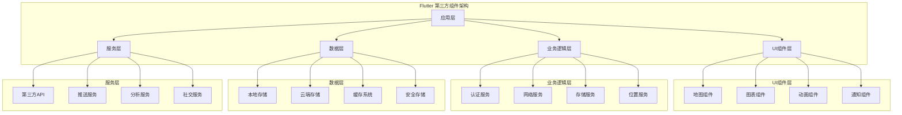
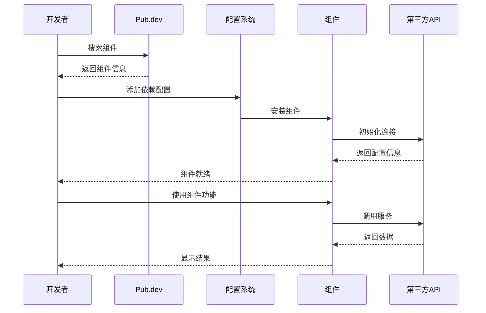
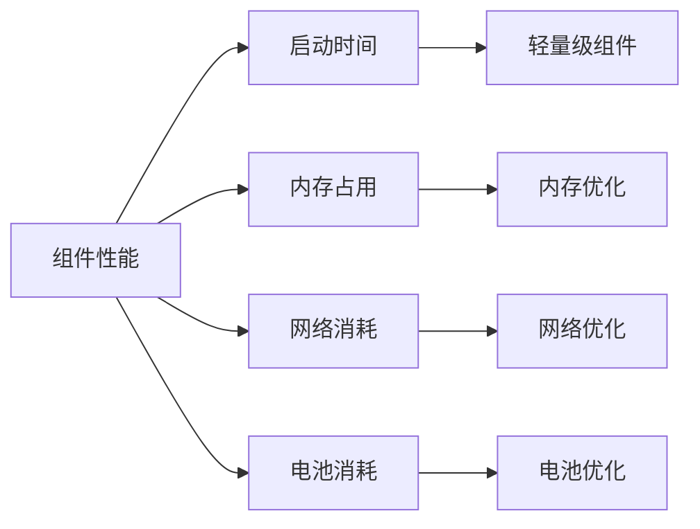
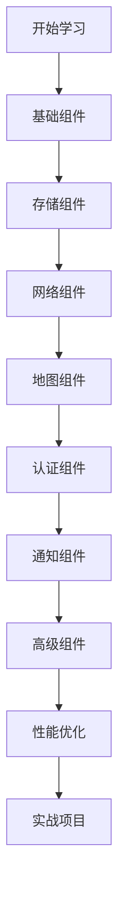

# 🔌 Flutter 第三方组件集成深度指南

> 全面的 Flutter 第三方组件集成指南，涵盖地图、存储、网络、认证等核心功能，助力快速构建功能丰富的应用


## 📋 目录导航

<details>
<summary>🎯 快速导航</summary>

### 🗺️ 地图与位置

- [🗺️ 地图和位置服务](maps-location.md) - Google Maps、地理编码、位置服务
- [📍 位置权限管理](location-permissions.md) - 权限申请、位置监听、地理围栏

### 💾 存储与数据库

- [💾 存储和数据库](storage-database.md) - SharedPreferences、Hive、SQLite
- [🔐 安全存储](secure-storage.md) - 加密存储、密钥管理、数据保护

### 🌐 网络与通信

- [🌐 网络和 API](network-api.md) - HTTP 客户端、WebSocket、网络状态
- [📡 实时通信](realtime-communication.md) - Socket.IO、MQTT、实时数据

### 🔐 认证与安全

- [🔐 认证和安全](auth-security.md) - Firebase Auth、生物识别、数据加密
- [🛡️ 安全最佳实践](security-best-practices.md) - 安全策略、漏洞防护

### 📱 通知与消息

- [📱 通知和消息](notifications-messaging.md) - FCM、本地通知、推送服务
- [💬 即时通讯](instant-messaging.md) - 聊天功能、消息推送

### 📤 社交与分享

- [📤 社交分享](social-sharing.md) - 内容分享、第三方登录
- [🤝 社交集成](social-integration.md) - 社交媒体平台集成

### 🎨 UI 与动画

- [🎨 UI 组件库](ui-libraries.md) - 常用 UI 组件库推荐
- [🎬 动画库](animation-libraries.md) - 动画效果库

### 📊 数据可视化

- [📊 数据可视化](data-visualization.md) - 图表、仪表盘、数据展示
- [📈 分析工具](analytics-tools.md) - 数据分析、用户行为追踪

</details>

## 🏗️ 第三方组件架构总览

### 整体架构图



### 组件集成流程



## 🎯 核心学习目标

### 📚 理论知识

- ✅ 深入理解第三方组件集成原理
- ✅ 掌握不同组件库的适用场景
- ✅ 了解组件间的依赖关系
- ✅ 学会性能优化和安全考虑

### 🛠️ 实践技能

- ✅ 熟练集成地图、存储、网络等核心组件
- ✅ 掌握认证、通知、社交等功能组件
- ✅ 学会组件配置和错误处理
- ✅ 能够进行组件性能调优

### 🎨 架构能力

- ✅ 理解组件架构设计原则
- ✅ 掌握组件间通信机制
- ✅ 学会组件版本管理
- ✅ 能够处理复杂集成场景

## 🚀 快速开始

### 1. 环境准备

```bash
# 检查 Flutter 环境
flutter doctor

# 创建新项目
flutter create third_party_demo
cd third_party_demo

# 添加常用依赖
flutter pub add google_maps_flutter geolocator shared_preferences dio
flutter pub add firebase_core firebase_auth firebase_messaging
flutter pub add --dev build_runner
```

### 2. 基础配置示例

```dart
import 'package:flutter/material.dart';
import 'package:firebase_core/firebase_core.dart';
import 'package:google_maps_flutter/google_maps_flutter.dart';
import 'package:shared_preferences/shared_preferences.dart';

void main() async {
  WidgetsFlutterBinding.ensureInitialized();

  // Firebase 初始化
  await Firebase.initializeApp();

  // 初始化 SharedPreferences
  await SharedPreferences.getInstance();

  runApp(MyApp());
}

class MyApp extends StatelessWidget {
  @override
  Widget build(BuildContext context) {
    return MaterialApp(
      title: '第三方组件示例',
      theme: ThemeData(
        primarySwatch: Colors.blue,
        visualDensity: VisualDensity.adaptivePlatformDensity,
      ),
      home: HomePage(),
    );
  }
}

class HomePage extends StatefulWidget {
  @override
  _HomePageState createState() => _HomePageState();
}

class _HomePageState extends State<HomePage> {
  GoogleMapController? mapController;
  final LatLng _center = const LatLng(39.9042, 116.4074); // 北京坐标

  void _onMapCreated(GoogleMapController controller) {
    mapController = controller;
  }

  @override
  Widget build(BuildContext context) {
    return Scaffold(
      appBar: AppBar(
        title: Text('第三方组件集成示例'),
        actions: [
          IconButton(
            icon: Icon(Icons.location_on),
            onPressed: _getCurrentLocation,
          ),
          IconButton(
            icon: Icon(Icons.settings),
            onPressed: _openSettings,
          ),
        ],
      ),
      body: Column(
        children: [
          // 地图组件
          Container(
            height: 300,
            child: GoogleMap(
              onMapCreated: _onMapCreated,
              initialCameraPosition: CameraPosition(
                target: _center,
                zoom: 11.0,
              ),
              myLocationEnabled: true,
              myLocationButtonEnabled: true,
            ),
          ),

          // 功能按钮
          Expanded(
            child: GridView.count(
              crossAxisCount: 2,
              padding: EdgeInsets.all(16),
              children: [
                _buildFeatureCard(
                  '地图服务',
                  Icons.map,
                  Colors.blue,
                  () => _showMapFeatures(),
                ),
                _buildFeatureCard(
                  '数据存储',
                  Icons.storage,
                  Colors.green,
                  () => _showStorageFeatures(),
                ),
                _buildFeatureCard(
                  '网络请求',
                  Icons.cloud,
                  Colors.orange,
                  () => _showNetworkFeatures(),
                ),
                _buildFeatureCard(
                  '用户认证',
                  Icons.security,
                  Colors.red,
                  () => _showAuthFeatures(),
                ),
              ],
            ),
          ),
        ],
      ),
    );
  }

  Widget _buildFeatureCard(String title, IconData icon, Color color, VoidCallback onTap) {
    return Card(
      elevation: 4,
      child: InkWell(
        onTap: onTap,
        child: Column(
          mainAxisAlignment: MainAxisAlignment.center,
          children: [
            Icon(icon, size: 48, color: color),
            SizedBox(height: 8),
            Text(
              title,
              style: TextStyle(fontSize: 16, fontWeight: FontWeight.bold),
            ),
          ],
        ),
      ),
    );
  }

  void _getCurrentLocation() async {
    // 获取当前位置
    try {
      // 这里需要添加位置权限处理
      ScaffoldMessenger.of(context).showSnackBar(
        SnackBar(content: Text('获取位置功能')),
      );
    } catch (e) {
      ScaffoldMessenger.of(context).showSnackBar(
        SnackBar(content: Text('获取位置失败: $e')),
      );
    }
  }

  void _openSettings() {
    // 打开设置页面
    Navigator.push(
      context,
      MaterialPageRoute(builder: (context) => SettingsPage()),
    );
  }

  void _showMapFeatures() {
    // 显示地图功能
    showDialog(
      context: context,
      builder: (context) => AlertDialog(
        title: Text('地图功能'),
        content: Text('• 显示地图\n• 获取位置\n• 路线规划\n• 地理编码'),
        actions: [
          TextButton(
            onPressed: () => Navigator.pop(context),
            child: Text('确定'),
          ),
        ],
      ),
    );
  }

  void _showStorageFeatures() {
    // 显示存储功能
    showDialog(
      context: context,
      builder: (context) => AlertDialog(
        title: Text('存储功能'),
        content: Text('• SharedPreferences\n• 文件存储\n• 数据库\n• 安全存储'),
        actions: [
          TextButton(
            onPressed: () => Navigator.pop(context),
            child: Text('确定'),
          ),
        ],
      ),
    );
  }

  void _showNetworkFeatures() {
    // 显示网络功能
    showDialog(
      context: context,
      builder: (context) => AlertDialog(
        title: Text('网络功能'),
        content: Text('• HTTP 请求\n• WebSocket\n• 文件上传\n• 网络状态'),
        actions: [
          TextButton(
            onPressed: () => Navigator.pop(context),
            child: Text('确定'),
          ),
        ],
      ),
    );
  }

  void _showAuthFeatures() {
    // 显示认证功能
    showDialog(
      context: context,
      builder: (context) => AlertDialog(
        title: Text('认证功能'),
        content: Text('• 用户登录\n• 第三方登录\n• 生物识别\n• 权限管理'),
        actions: [
          TextButton(
            onPressed: () => Navigator.pop(context),
            child: Text('确定'),
          ),
        ],
      ),
    );
  }
}

class SettingsPage extends StatelessWidget {
  @override
  Widget build(BuildContext context) {
    return Scaffold(
      appBar: AppBar(title: Text('设置')),
      body: ListView(
        children: [
          ListTile(
            leading: Icon(Icons.map),
            title: Text('地图设置'),
            subtitle: Text('配置地图相关选项'),
            onTap: () {},
          ),
          ListTile(
            leading: Icon(Icons.storage),
            title: Text('存储设置'),
            subtitle: Text('管理数据存储选项'),
            onTap: () {},
          ),
          ListTile(
            leading: Icon(Icons.cloud),
            title: Text('网络设置'),
            subtitle: Text('配置网络相关选项'),
            onTap: () {},
          ),
          ListTile(
            leading: Icon(Icons.security),
            title: Text('安全设置'),
            subtitle: Text('管理安全相关选项'),
            onTap: () {},
          ),
        ],
      ),
    );
  }
}
```

## 📊 组件分类对比

### 功能组件对比

| 功能类别   | 推荐组件                  | 替代方案                  | 适用场景     | 复杂度 |
| ---------- | ------------------------- | ------------------------- | ------------ | ------ |
| 地图服务   | google_maps_flutter       | mapbox_gl                 | 位置相关应用 | 中等   |
| 数据存储   | shared_preferences + hive | sqflite                   | 数据持久化   | 简单   |
| 网络请求   | dio                       | http                      | API 通信     | 中等   |
| 用户认证   | firebase_auth             | auth0                     | 用户管理     | 中等   |
| 推送通知   | firebase_messaging        | onesignal                 | 消息推送     | 中等   |
| 社交分享   | share_plus                | flutter_share             | 内容分享     | 简单   |
| 数据可视化 | fl_chart                  | syncfusion_flutter_charts | 图表展示     | 中等   |
| 动画效果   | lottie                    | rive                      | 动画展示     | 中等   |

### 性能对比



### 选择指南

#### 🗺️ 地图组件选择

- **Google Maps**: 功能全面，适合商业应用
- **Mapbox**: 自定义程度高，适合特殊需求
- **OpenStreetMap**: 免费开源，适合简单需求

#### 💾 存储组件选择

- **SharedPreferences**: 简单键值存储
- **Hive**: 高性能 NoSQL 数据库
- **SQLite**: 关系型数据库，适合复杂查询

#### 🌐 网络组件选择

- **Dio**: 功能丰富，拦截器支持
- **HTTP**: 轻量级，适合简单请求
- **Retrofit**: 类型安全，代码生成

## 🎨 设计模式应用

### 1. 工厂模式 (Factory Pattern)

```dart
// 组件工厂
abstract class ComponentFactory {
  static MapService createMapService(MapType type) {
    switch (type) {
      case MapType.google:
        return GoogleMapService();
      case MapType.mapbox:
        return MapboxService();
      case MapType.openstreet:
        return OpenStreetMapService();
      default:
        throw ArgumentError('不支持的地图类型: $type');
    }
  }

  static StorageService createStorageService(StorageType type) {
    switch (type) {
      case StorageType.preferences:
        return SharedPreferencesService();
      case StorageType.hive:
        return HiveStorageService();
      case StorageType.sqlite:
        return SQLiteStorageService();
      default:
        throw ArgumentError('不支持的存储类型: $type');
    }
  }
}

enum MapType { google, mapbox, openstreet }
enum StorageType { preferences, hive, sqlite }

abstract class MapService {
  Future<void> initialize();
  Widget buildMap();
}

abstract class StorageService {
  Future<void> initialize();
  Future<T?> get<T>(String key);
  Future<void> set<T>(String key, T value);
}
```

### 2. 适配器模式 (Adapter Pattern)

```dart
// 网络请求适配器
abstract class NetworkAdapter {
  Future<Response> get(String url, {Map<String, dynamic>? headers});
  Future<Response> post(String url, {dynamic data, Map<String, dynamic>? headers});
  Future<Response> put(String url, {dynamic data, Map<String, dynamic>? headers});
  Future<Response> delete(String url, {Map<String, dynamic>? headers});
}

class DioAdapter implements NetworkAdapter {
  final Dio _dio;

  DioAdapter(this._dio);

  @override
  Future<Response> get(String url, {Map<String, dynamic>? headers}) async {
    return await _dio.get(url, options: Options(headers: headers));
  }

  @override
  Future<Response> post(String url, {dynamic data, Map<String, dynamic>? headers}) async {
    return await _dio.post(url, data: data, options: Options(headers: headers));
  }

  @override
  Future<Response> put(String url, {dynamic data, Map<String, dynamic>? headers}) async {
    return await _dio.put(url, data: data, options: Options(headers: headers));
  }

  @override
  Future<Response> delete(String url, {Map<String, dynamic>? headers}) async {
    return await _dio.delete(url, options: Options(headers: headers));
  }
}

class HttpAdapter implements NetworkAdapter {
  final http.Client _client;

  HttpAdapter(this._client);

  @override
  Future<Response> get(String url, {Map<String, dynamic>? headers}) async {
    final response = await _client.get(Uri.parse(url), headers: headers);
    return Response(
      data: response.body,
      statusCode: response.statusCode,
      headers: response.headers,
    );
  }

  // 其他方法实现...
}
```

### 3. 观察者模式 (Observer Pattern)

```dart
// 组件状态监听
class ComponentStateManager extends ChangeNotifier {
  static ComponentStateManager? _instance;
  static ComponentStateManager get instance => _instance ??= ComponentStateManager._();

  ComponentStateManager._();

  final Map<String, ComponentState> _componentStates = {};

  ComponentState getComponentState(String componentName) {
    return _componentStates[componentName] ?? ComponentState.unknown;
  }

  void updateComponentState(String componentName, ComponentState state) {
    _componentStates[componentName] = state;
    notifyListeners();

    // 记录状态变化
    _logStateChange(componentName, state);
  }

  void _logStateChange(String componentName, ComponentState state) {
    print('🔄 组件状态变化: $componentName -> $state');
  }
}

enum ComponentState { initializing, ready, error, disabled }

// 使用示例
class MapComponent extends StatefulWidget {
  @override
  _MapComponentState createState() => _MapComponentState();
}

class _MapComponentState extends State<MapComponent> {
  @override
  void initState() {
    super.initState();
    ComponentStateManager.instance.addListener(_onStateChanged);
    _initializeMap();
  }

  void _initializeMap() async {
    ComponentStateManager.instance.updateComponentState('map', ComponentState.initializing);

    try {
      // 初始化地图
      await Future.delayed(Duration(seconds: 2));
      ComponentStateManager.instance.updateComponentState('map', ComponentState.ready);
    } catch (e) {
      ComponentStateManager.instance.updateComponentState('map', ComponentState.error);
    }
  }

  void _onStateChanged() {
    final state = ComponentStateManager.instance.getComponentState('map');
    setState(() {
      // 根据状态更新UI
    });
  }

  @override
  Widget build(BuildContext context) {
    final state = ComponentStateManager.instance.getComponentState('map');

    switch (state) {
      case ComponentState.initializing:
        return Center(child: CircularProgressIndicator());
      case ComponentState.ready:
        return GoogleMap(/* 地图配置 */);
      case ComponentState.error:
        return Center(child: Text('地图加载失败'));
      case ComponentState.disabled:
        return Center(child: Text('地图功能已禁用'));
      default:
        return Center(child: Text('未知状态'));
    }
  }

  @override
  void dispose() {
    ComponentStateManager.instance.removeListener(_onStateChanged);
    super.dispose();
  }
}
```

## 🔧 开发工具推荐

### 📱 调试工具

- **Flutter Inspector**: 组件调试
- **Dart DevTools**: 性能分析
- **Firebase Console**: Firebase 服务调试
- **Postman**: API 测试

### 🎨 设计工具

- **Figma**: UI 设计
- **Adobe XD**: 交互设计
- **Sketch**: 界面设计

### 📚 学习资源

- **官方文档**: 各组件官方文档
- **GitHub 示例**: 官方示例项目
- **社区博客**: 技术博客和教程

## 📈 学习路径建议



### 🎯 阶段目标

#### 第一阶段：基础掌握

- [ ] 理解第三方组件集成原理
- [ ] 掌握基础组件使用方法
- [ ] 学会组件配置和初始化
- [ ] 完成简单组件集成

#### 第二阶段：进阶学习

- [ ] 深入学习核心组件功能
- [ ] 掌握组件间通信机制
- [ ] 学会错误处理和调试
- [ ] 完成中等复杂度集成

#### 第三阶段：高级应用

- [ ] 掌握高级组件功能
- [ ] 学会性能优化技巧
- [ ] 理解安全最佳实践
- [ ] 完成复杂应用集成

#### 第四阶段：实战项目

- [ ] 完成完整的商业应用
- [ ] 掌握组件版本管理
- [ ] 学会团队协作开发
- [ ] 参与开源项目贡献

## 🏆 最佳实践

### 📝 代码规范

```dart
// ✅ 推荐：组件服务封装
class MapService {
  static MapService? _instance;
  static MapService get instance => _instance ??= MapService._();

  MapService._();

  GoogleMapController? _controller;
  GoogleMapController? get controller => _controller;

  void setController(GoogleMapController controller) {
    _controller = controller;
  }

  Future<void> animateToLocation(LatLng location) async {
    await _controller?.animateCamera(
      CameraUpdate.newLatLng(location),
    );
  }

  Future<void> animateToZoom(double zoom) async {
    await _controller?.animateCamera(
      CameraUpdate.zoomTo(zoom),
    );
  }
}

// ✅ 推荐：错误处理
class ComponentErrorHandler {
  static void handleError(String componentName, dynamic error, StackTrace stackTrace) {
    // 记录错误日志
    print('❌ 组件错误 [$componentName]: $error');
    print('📚 堆栈信息: $stackTrace');

    // 上报错误
    FirebaseCrashlytics.instance.recordError(error, stackTrace);

    // 用户友好提示
    _showUserFriendlyError(componentName, error);
  }

  static void _showUserFriendlyError(String componentName, dynamic error) {
    // 根据错误类型显示不同的用户提示
    String message = '功能暂时不可用，请稍后重试';

    if (error.toString().contains('network')) {
      message = '网络连接失败，请检查网络设置';
    } else if (error.toString().contains('permission')) {
      message = '权限不足，请在设置中开启相关权限';
    }

    // 显示错误提示
    // 这里可以使用 SnackBar 或 Dialog
  }
}
```

### 🎨 架构原则

- **单一职责**: 每个组件只负责一个功能
- **开闭原则**: 对扩展开放，对修改关闭
- **依赖倒置**: 依赖抽象而非具体实现
- **接口隔离**: 使用小而精确的接口

### ⚡ 性能优化

- 使用懒加载减少初始包大小
- 合理使用组件缓存
- 优化网络请求和数据处理
- 监控内存使用和电池消耗

### 🧪 测试策略

- 组件单元测试覆盖率 ≥ 80%
- 集成测试覆盖关键功能
- 自动化测试集成 CI/CD
- 性能基准测试

## 📚 相关资源

### 🔗 官方资源

- [Flutter 官方文档](https://flutter.dev/docs)
- [Pub.dev 包管理](https://pub.dev/)
- [Firebase 官方文档](https://firebase.google.com/docs)

### 📖 推荐书籍

- 《Flutter 实战》
- 《Flutter 开发实战详解》
- 《第三方组件集成指南》

### 🎥 视频教程

- [Flutter 官方 YouTube 频道](https://www.youtube.com/c/FlutterDev)
- [B 站 Flutter 教程](https://www.bilibili.com/video/BV1S4411E7LY)

---

## 🎉 开始你的第三方组件集成之旅

现在你已经了解了 Flutter 第三方组件集成的整体架构和学习路径。接下来，让我们从[地图和位置服务](maps-location.md)开始，逐步掌握各种组件的集成方法。

记住：**选择合适的组件比使用最流行的组件更重要**，根据项目需求和性能要求做出明智的选择！

---

<div align="center">

**🌟 如果这个指南对你有帮助，请给个 Star 支持一下！ 🌟**

[](https://github.com/1989allen126/language-tutorial)
[](https://github.com/1989allen126/language-tutorial)

</div>
